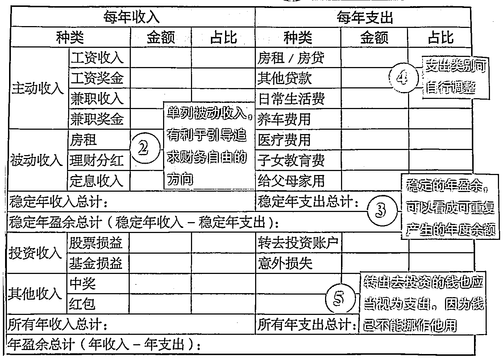

# 《适合毕业 3 年内职场人的小白理财操作指南》

> 原文：[`www.yuque.com/for_lazy/thfiu8/xcy353kztprctgo6`](https://www.yuque.com/for_lazy/thfiu8/xcy353kztprctgo6)

## (68 赞)《适合毕业 3 年内职场人的小白理财操作指南》 

作者： 矿山 

日期：2023-03-21 

第一次在星球分享，诚意之作。从去年 6 月开始，我开启了持续 9 个月不间断的每日记账&理财，感觉到对生活的掌控感显著增强。写下这篇操作指南，希望帮你增强对生活的掌控感。 

全文链接：https://www.wolai.com/nC6APzh5jnBKqaqXcYe9cd 

本文适合哪些人： 

- 0-3 岁职场新人，缺少基础的理财框架 

- 对个人财务状况感到焦虑，但又无从下手 

本文不会涉及：具体的理财投资建议，包括基金、股票等。 

本文结构如下： 

- 心态篇： 

   - 为什么要理财？ 

   - 为什么屡屡记账失败？ 

- 操作篇： 

   - 第一步：像经营企业一样经营自己，构建个人收支资产负债模型 

   - 第二步：设定目标，输出 todo list，坚定执行 

- 加餐篇： 

   - 想要提升理财认知，书单&公众号&播客推荐 

   - 重要的领域知识，建议你主动学习 

# 一、心态篇：为什么要理财？为什么屡屡记账失败？ 

「你不理财，财不理你」，日常关于理财的重要性已经被说烂了，但是很多人依然不够重视。 

①二八法则，投入大量时间在关键事情上 

分享一段知行小酒馆播客 E76 的一段话： 

"房地产的资产占比一个中国家庭超过 60%-70%的，但是大多数人在买房上投入的精力却十分有限，他们愿意在点奶茶时花 10 分钟看用户评价选哪款好喝，却不愿意每天花 10 分钟关注楼盘信息。" 

二八法则告诉我们，20%的事情重要性超过 80%。我们来算个数：一个打工人年工作日 250 天，日均打工 8 小时，除去睡眠 8 小时，占可支配时间的 50%。**因此，打工占我们一年可支配精力的 34.7%**(250/360*50%)。作为一个没有梦想的打工人，我们认为打工就是为了赚钱花。 

**所以，我们一年起码投入了 34.7%时间在赚钱上，最终的产出就是金钱。因此金钱的管理，就是那 20%重要的事情。**我们愿意花 10 分钟挑奶茶，那么更应该愿意每天投入 10 分钟在理财上，而这仅占一天时间的 0.7%. 

②"焦虑的反义词，是具体" 

「焦虑」可能是近两年大家都无法逃避的状态，大多关于工作和发展。我们焦虑的到底是什么？是失业？没有升职的机会？焦虑的反义词，是具体。很多时候我们焦虑，恰恰是因为我们问题不聚焦，答案不清晰。 

我把职场焦虑定性为：如果我被裁了，能活多久？量化一下，就是：我现有的流动资金，在失去工作收入的情况下，可以撑几个月？ 

为了让答案变清晰，我们需要做的，就是构建个人收支资产负债模型（第二部分展开）。行动起来，化不确定的焦虑为确定的资金流问题，盘清楚，逐渐增强属于你的生活掌控感。 

③为什么屡屡记账失败？ 

记账是我整个操作指南的基石，大多数人都尝试过记账，但是失败了。根据动力-阻力模型，我们放弃坚持，是因为动力<阻力。需要增强动力，减少阻力。关于增强动力部分，上面两个小节做了补充，重点讲讲如何减少阻力。 

阻力一：记账麻烦 

解决方案： 

- 统一支出账户（我把所有支出都放在支付宝，避免现金&微信等渠道支出），定期查看支付宝账单即可 

- 固定节点操作：可以每天晚上 10 点，也可以每周日晚，固话成习惯 

- 挑选趁手工具：我用的是鲨鱼记账 app，所有数据必须汇总在这里 

阻力二：自我批判 

这个阻力是很多人忽视的，当人隐隐觉得自己财务状况堪忧时，反而拒绝去认清现状，逃避现实，因为不想承认自己的短板。希望你不要自我批评和责怪，主动承担责任的勇气，已经超过了大部分人。 

# 二、操作篇 

第一步：像经营企业一样经营自己，构建个人收支资产负债模型 

在前司字节跳动工作时，飞书的 slogan 让我印象深刻：Develop a company as a product，像打造产品一样经营公司。我想说的是：像经营企业一样经营自己。背后的一个共性，是构建起收支&资产负债模型，这是第一步，也是最重要的一步，教你认清事实。 

首先：构建我们的资产负债表，直接上图 

 

第一大列是资产，第二大列是负债，计算出资产总计和负债总计后相减，就是净资产。细项这里不赘述了，任何一个名词不懂的，小红书搜一下。 

**重要提醒：现在立刻马上，打开 excel，掏出手机，追溯各资金账户情况，把每一个数字填入进去。** 

接着：构建我们的现金流量表，直接上图 

  

同理，计算出年收入和年支出后，相减就是年盈余。 

统计收入应该没难度，重点是统计年支出时，大家很难有全的数据，这里给个建议： 

支出可以分为年度大额支出和月度常规支出。年度大额支出，包括养车、父母家用、旅游、医疗，一定要翻账本搞清楚；月度常规支出如果不清楚，从现在开始记账，连续一个月，数据就有了。 

如果这一步遇到困难不要放弃，不用追求 100%的精确，完成比完美更重要。 

完成了这一步，你已经秒杀大多数理财小白了，你清楚自己现在到底几斤几两。我们回到开始关于焦虑的讨论：被裁后，我能活多久？拿流动资产/月支出，就是你的底线。 

然后，构建个人收支资产负债模型，内容来自所长林超的《开窍》，这个牛逼了！ 

我们需要知道，自己现在的情况，究竟是好是坏，下一步怎么调整？这本书将人分为四类：无产无债者、无产有债者、有产有债者、高产低债者。 

- 无产无债者：典型的月光族，也是职场小白的高频情况，每月的收入基本上全都流向支出，没有资产积累，也没有什么负债。 

- 无产有债者：最糟糕的 case，每月收入除了用于支出外，还额外产生了负债。这部分人有旺盛的物欲，喜欢消费超出能力范围之外的奢侈品，可能还要借钱度日。 

- 有产有债者：收入以工资为主，一部分转化为资产，一部分转化为负债，3 年以上的职场人比较常见。他们有额外可支配的收入用于投资基金等，也会贷款买房、买车，产生沉重的负债。 

- 高产低债者：收入主要用于购买资产，这部分资产反过来会产生收入。他们较少购买不良资产产生高额负债（如没有投资价值的房子）。 

无论你属于哪一类，我们的共同目标是，成为高产低债者，这就是我们第二步的目标。 

## 第二步：明确目标和 todo，坚定执行和复盘 

能看到这里，你又秒杀了大部分人，因为很少有人能耐心的看到这里。第一步我们知道了，我们的目标是成为高产低债者，具体怎么做呢？ 

直接给出操作框架： 

- 提高收入：努力工作升职加薪，积极拓展副业收入，适当投资 

- 控制支出：明确月支出预算，每日、每周、每月记账，控制不要超支，重要！ 

①提高收入 

工作升职加薪、拓展副业，不在本次内容范围。**重点讲讲适当投资**，怎么入门，给出两种框架。 

一，四笔钱框架。按照个人资产总体占比比例 

- 保本的钱（40%，投资国债、年金等，用于养老&教育） 

- 投资的钱（30%，投资股票、基金等风险产品） 

- 保险的钱（20%，购买保险，应对意外状况） 

- 要花的钱（10%，现金或余额宝等，覆盖 3-6 个月生活费） 

二、100-年龄分配法 

原理来自公众号《银行螺丝钉》，假设你目前 25 岁： 

- 用 100-25=75%的比例投资相对高波动、追求高收益的种类，如指数基金，长期持有 3-5 年 

- 用 25%的比例投资相对低波动的种类，如债券基金，建议持有 1 年以上 

确定好框架后，去挑选具体的投资品种，选择投资时间，操作投资。因为本人投资年限不久，暂时不给出更细节的操作，可以小红书或公众号搜索关键字，了解更具体方式。我个人投的是投顾类产品，相当于把钱交给机构，他帮你买好一揽子不错的基金组合。 

②控制支出 

控制支出分三个环节： 

- 开支分类，理清开支现状 

- 设定储蓄率目标，分类制定预算额度 

- 严控开支、持续记账和复盘 

首先，将开支分为月度开支（每个月肯定会产生的开支）和年度开支（不定时产生的大额开支），并把个人实际数据理清 

- 月度开支分类建议：餐饮、房租&房贷、社交娱乐、日用、交通、服饰美容 

- 年度开支分类建议：旅游、父母家用、医疗、其他 

接着，设定月储蓄率目标。储蓄率的平均目标是 35%（不考虑房贷），把它作为最低标准。后续逐步调高到 50%。 

月度可支配收入*（1-储蓄率），就是你每个月开支的上限。针对月度开支的弹性部分（非固定数额），比如餐饮、社交娱乐、服饰美容，设定严格的支出限额，像房租这种很难短期调整。 

最后，每个月复盘当月的支出情况，实际储蓄率是否达到预期，如果超过了，是哪一部分支出的问题，下个月是否可以避免，还是必须调低储蓄率的目标。 

小结：牢记 35%储蓄率的目标，坚定执行。做不到这个，注定难以奠定好的基础。 

③每个月 review 两张表 

在每个月更新现金流量表的基础上，同步更新资产负债表，你会更直观地看到，每个月扎扎实实控制的开支，如何最终体现在净资产的增长上。将每月净资产、收入、支出三个指标汇总到折线图中，会看到时间的力量。 

小结： 

首先，理清出个人的收支资产模型，认清现状 

接着，尝试提高收入、降低支出，严格遵守储蓄率目标 

**最后，每个月更新个人的两张表：资产负债/现金流量表，你会看着增长曲线随着日积月累，给你带来更多生活的底气。** 

# 三、加餐篇：如何提升财商 

3.1 想要提升理财认知，书单&公众号&播客推荐 

- 书单：《要钱还是要生活》、《穷爸爸富爸爸》、《指数基金投资指南》 

- 公众号：银行螺丝钉（含投资操作 SOP）、也谈钱 

- 播客：知行小酒馆、保持通话 

- 少数派：一个内容社区，里面关于如何记账&理财有很多高手在分享 

3.2 重要的领域知识，建议你主动学习 

- 四金体系：了解每个月工资中交的税，到底去了哪？哪些是税，哪些是后续会返回给我们的保障？ 

- 公积金：了解公积金的使用方法，起码得知道，公积金是可以取出来的一笔大额的钱。 

- 相关政策：如杭州 E 类人才、租房补贴、年度个税申报到底是个啥，如何申报可以赚更多钱 

- 信用卡体系：了解怎么薅信用卡福利、合理使用降低年费等 

都看到这里了，点个赞吧 

评论区： 

王小义 : 很赞 我现在就在薅信用卡福利，🤭 矿山 : 感谢认可[呲牙] 有容乃大 : 怎么撸 南鹄 : 厉害。向你学习！目前也在每月记账，使用的松鼠记账。也是看了富爸爸之后开始了行动。同时还参加了心灵财富公益组织每周举办的 富爸爸现金流游戏。收益颇多。作为一个程序员，连初会教材都已经开啃了。😂😂 茶白。 : 我也一直用鲨鱼记账，截止到今天 1138 天，看过《穷爸爸富爸爸》、《指数基金投资指南》，刚记账那会儿关注的银行螺丝钉，目前还没实现财务自由，不过明显增强对生活的掌控感，也确实减少了购物欲。 A℡zoe : 用鲨鱼记账两个月养成了记录的习惯，手机扫码支付花钱没有概念，有了每笔记录后可以更好的优化支出 西琪💫 : 谢谢分享～ 写得非常全面了，大赞给你！ 矿山 : 信用卡这块我也不专业，可以星球内搜一搜