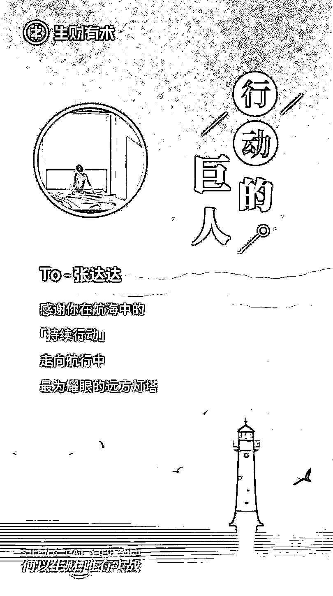

# 《30 个知识管理技巧》

> 原文：[`www.yuque.com/for_lazy/thfiu8/smt59s3u7mguni3s`](https://www.yuque.com/for_lazy/thfiu8/smt59s3u7mguni3s)

<ne-h2 id="a7153711" data-lake-id="a7153711"><ne-heading-ext><ne-heading-anchor></ne-heading-anchor><ne-heading-fold></ne-heading-fold></ne-heading-ext><ne-heading-content><ne-text id="ue1883aa7">(78 赞)《30 个知识管理技巧》</ne-text></ne-heading-content></ne-h2> <ne-p id="u0cf4e021" data-lake-id="u0cf4e021"><ne-text id="u9143d14d">作者： 张达达</ne-text></ne-p> <ne-p id="u80118d8b" data-lake-id="u80118d8b"><ne-text id="u6a0fe86d">日期：2023-03-31</ne-text></ne-p> <ne-p id="uabcc5eff" data-lake-id="uabcc5eff"><ne-text id="uadbafc12">昨天阿蓝加我，说我在航海打满卡了，给我发奖状鼓励，这倒提醒我，写下这次在资料整理航海的复盘。</ne-text></ne-p> <ne-p id="ucc70f2ea" data-lake-id="ucc70f2ea"><ne-text id="u1ee335c6">航海中看到很多人是跟以前的自己一样，陷于形式了，过度追求依葫芦画瓢，但知识管理的目的其实是让自己方便，所以并不是说有一个标准答案。</ne-text></ne-p> <ne-p id="u9e2cd3ae" data-lake-id="u9e2cd3ae"><ne-text id="uba83c9c8">我总结的这 30 个技巧，更多的是根据观察到的问题，部分也借鉴了群友的讨论，希望对大家有帮助。</ne-text></ne-p> <ne-p id="u155940ac" data-lake-id="u155940ac"><ne-text id="u46871f8c">1、遇到暂时难以归类的资料或者文章，可以新建一个文件夹，取名“杂学”，统一放进里面，然后每周整理归类一次，积攒多了自然知道放哪；</ne-text></ne-p> <ne-p id="u78a4b8be" data-lake-id="u78a4b8be"><ne-text id="ue049eb57">2、如果一个文件可以去多个分类，那就用好标签和关联功能，同时关联到几个文件夹中；</ne-text></ne-p> <ne-p id="u012450b4" data-lake-id="u012450b4"><ne-text id="ueb1498e3">3、遵循知识输入，加工，输出，归档的过程，写得好的自然要归档到相应分类中；</ne-text></ne-p> <ne-p id="u196a5c26" data-lake-id="u196a5c26"><ne-text id="u5a897572">4、对于某一学科的知识，一种是书本的输入，一种是通过这种输入的实操经验所得，不要分开放，知识整理是为了方便自己，不要过于追求形式；</ne-text></ne-p> <ne-p id="u29cc03a4" data-lake-id="u29cc03a4"><ne-text id="u157e26db">5、照片整理可以用各种云软件，比如 icloud、谷歌云、腾讯百度阿里云，有个软件叫 billfish 据说很好用：</ne-text></ne-p> <ne-p id="ua8e044ff" data-lake-id="ua8e044ff"><ne-text id="ufaa857e5">6、可以参考别人的架构，但不要照搬，因为只有你自己最知道自己需要什么信息；</ne-text></ne-p> <ne-p id="u828d1a0a" data-lake-id="u828d1a0a"><ne-text id="u407afddd">7、信息整理不是为了好看，也不是为了满足自己的虚荣心，而是为了使用方便；</ne-text></ne-p> <ne-p id="u29fd4823" data-lake-id="u29fd4823"><ne-text id="uebab9966">8、平时整理信息如果会摘抄金句，有时候涉及多个方面，那就用标签，多方面就用多个标签，然后定期整理；</ne-text></ne-p> <ne-p id="u421e4020" data-lake-id="u421e4020"><ne-text id="ube213c5a">9、信息和知识整理最后都是为了用，而不是为了收。打标签是为了更方便地使用，而定期规整能够让你集合相似信息，同时也能让自己更新内化，如果不整理，下次遇到类似的东西，可能你还会再收一次。不断重复：</ne-text></ne-p> <ne-p id="uc864e537" data-lake-id="uc864e537"><ne-text id="uab4d2fa1">10、我们该记录什么信息呢？有个方法是看看你现在遇到什么问题，那么围绕着这个问题去寻找知识，而不是总是等灵感：</ne-text></ne-p> <ne-p id="uf79db475" data-lake-id="uf79db475"><ne-text id="u47ef0ca9">11、大部分资料可能并不需要收集，因为时效性会有点强，这时候需要去看本源是什么？把本源概念搞懂，放到知识库中即可，有点像种树，不要关注叶子，而是要看树干和树枝；：</ne-text></ne-p> <ne-p id="u776ae225" data-lake-id="u776ae225"><ne-text id="u25cee006">12、不要纠结于用一种工具，而是多个工具结合不同的用处，用飞书或者印象笔记或者 notion 可以沉淀内容，用 flomo 可以随想随记，用云盘可以储存大量视频文件；</ne-text></ne-p> <ne-p id="u3f1901a6" data-lake-id="u3f1901a6"><ne-text id="u8be7ec0c">13、工具不重要，想好自己要解决什么问题才重要；</ne-text></ne-p> <ne-p id="u17f08221" data-lake-id="u17f08221"><ne-text id="u63e5b634">14、桌面有一大堆文件，整理前要先想好分类和框架，把常用的先筛出来，剩下的慢慢放到相应分类去；</ne-text></ne-p> <ne-p id="u0aec74ee" data-lake-id="u0aec74ee"><ne-text id="u1cc59560">15、沉淀一个学科的知识，要从初阶、进阶、高阶分阶段进行学习和记录，还有实践。</ne-text></ne-p> <ne-p id="u20e373cc" data-lake-id="u20e373cc"><ne-text id="u89b3fdf2">16、知识整理过后并不属于你，只有通过回顾、记忆、实践、输出才能慢慢转化成你自己的知识：</ne-text></ne-p> <ne-p id="ucd6e3b0c" data-lake-id="ucd6e3b0c"><ne-text id="u9cfdb1b1">17、不是一定要把工作的资料归工作，学习的归学习，而是该问自己，在你的知识结构中，这份资料该沉淀到哪里：</ne-text></ne-p> <ne-p id="uac0e6497" data-lake-id="uac0e6497"><ne-text id="uc0ec5066">18、All in one 可能很美，但如果做不到，可以在多个平台都建分类即可：</ne-text></ne-p> <ne-p id="u0e8ae551" data-lake-id="u0e8ae551"><ne-text id="uefda9464">19、很多以前的资料现在整理很痛苦，这个免不了的，但建议越早越好。最好的捷径就是在整理的过程中，断舍离一些不需要的内容 首先新的资料统一用一个平台，其次把其他平台资料按优先级排列，放优先级最高的且自己会常用到的。其他就放在原平台上。这就至少 50%的内容不用动了。然后平时偶尔想起来，可以去搜搜，有用的就搬过来，每周固定整理一个文件夹。过段时间，你会发现以前很多收藏的东西，有用的都搬走了，剩下的都是边角料，不动也罢，不信你看看你的微信收藏夹三年前的内容：</ne-text></ne-p> <ne-p id="u9a2a7ac4" data-lake-id="u9a2a7ac4"><ne-text id="ud88ba39a">20、恰当的知识管理的过程，也是自我进化的过程：</ne-text></ne-p> <ne-p id="ua8100119" data-lake-id="ua8100119"><ne-text id="u618b45cb">21、群聊的信息想收藏的，可以另外建一个专门的微信群，然后把各群信息转发过去，每天整理一次：</ne-text></ne-p> <ne-p id="ud68ba504" data-lake-id="ud68ba504"><ne-text id="ubc398ee0">22、如果一分资料可以放多个分类，这想放那也想放，那就用打多个标签来解决，或者直接放一旁，先整理别的；</ne-text></ne-p> <ne-p id="ubd170f1e" data-lake-id="ubd170f1e"><ne-text id="u129d5e73">23、在听书或者听播客时，听到不错的知识点，可以先用手机录音，再用飞书转成文字；</ne-text></ne-p> <ne-p id="u85d9bcb9" data-lake-id="u85d9bcb9"><ne-text id="ud8c2a7c8">24、Flomo 可以记随想，定时回顾，要用时取用即可；</ne-text></ne-p> <ne-p id="u3ce6ad36" data-lake-id="u3ce6ad36"><ne-text id="u47545a51">25、一篇资料很长，想要放进知识库，不要全部复制放进去，可以挑一个对你最有启发的，总结以下再放进去，长文可以放个链接；</ne-text></ne-p> <ne-p id="u50cd381e" data-lake-id="u50cd381e"><ne-text id="ud9e53cb8">26、一个分区工具：直接在微信或者百度搜“电脑分区桌面壁纸”，可以找到分区工具：</ne-text></ne-p> <ne-p id="uda9290cc" data-lake-id="uda9290cc"><ne-text id="ud48a47bb">27、觉得微信收藏不好用的可以直接用 cubox，用过就知道香，可以把各大平台的收藏转到这集中处理。</ne-text></ne-p> <ne-p id="u6478690c" data-lake-id="u6478690c"><ne-text id="u5d240397">28、越是信息爆炸，越要学会舍弃，敢于断舍离；</ne-text></ne-p> <ne-p id="u43794eac" data-lake-id="u43794eac"><ne-text id="ua6182dd3">29、不用担心错过重要信息，实在重要它迟早也会再出现的，如果没有出现，可能也是不那么重要；</ne-text></ne-p> <ne-p id="u301ae257" data-lake-id="u301ae257"><ne-text id="ufdf06cd1">30、知识整理的最终目的，是让人过得更好。</ne-text></ne-p> <ne-p id="u61824d77" data-lake-id="u61824d77"><ne-text id="uab6a0c56">觉得有启发的，欢迎点赞，也欢迎交流。</ne-text></ne-p> <ne-p id="u640a5f50" data-lake-id="u640a5f50"><ne-card data-card-name="image" data-card-type="inline" id="uuZCa" data-event-boundary="card"></ne-card></ne-p> <ne-hole id="u20704b7e" data-lake-id="u20704b7e"><ne-card data-card-name="hr" data-card-type="block" id="DzcSL" data-event-boundary="card"><ne-p id="u29aa6434" data-lake-id="u29aa6434"><ne-text id="ubd0c6b6b">评论区：</ne-text></ne-p> <ne-p id="u4de1c298" data-lake-id="u4de1c298"><ne-text id="u833d474e">暂无评论</ne-text></ne-p></ne-card></ne-hole>