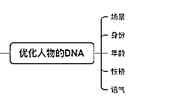
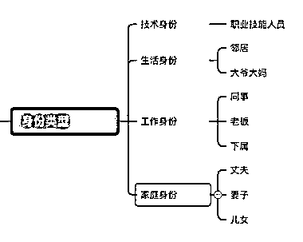

# 《GPT 调教心流法-身份篇》

> 原文：[`www.yuque.com/for_lazy/thfiu8/qn1qxpgoaga7f2p5`](https://www.yuque.com/for_lazy/thfiu8/qn1qxpgoaga7f2p5)

## (精华帖)(276 赞)《GPT 调教心流法-身份篇》 

作者： Bittle.白先生 

日期：2023-04-04 

有幸生日这天加入生财，分享等待已久的《GPT 调教心流法-身份篇》 chatGPT 的调教使用心流法。听上去很虚，但作为一个 AIGC 的创作者，如果你静下心来细细品尝，对于你使用 GPT 会有质的飞跃。我相信市面上应该还没有心流法的文章，十年内容创作心流融入于 GPT，值得你细读！ 

为什么要学习心流法呢？ 大家都晓得授之以鱼，不如授之以渔。看再多的教程，都是在“术”的层面，只有掌握好“道”，你才能灵活应用，举一反三。你保存再多的指令和教程，有多少会翻看了？所以融会贯通很重要。而且和 GPT 对话，是需要很多跳脱性思维的。如果你只停留在“索取”的思维上，只会得到一些格式化的回应。把 GPT 当作人、物，甚至是“场”，他就有很多的可能性，所以要大胆放飞自己的思维。用心去交流，时刻问自己，“它能明白我说什么吗？”。 

接下来，请跟着我的思路，以及带上你们在最近实操的过程中的记忆，来验证心流法。为了确保你们有跟着我思路和有代入感，下文开始，GPT，简称小 G。 

1、第一招 ——知己知彼，百问百胜 都知道，你在与小 G 对话时候，要设定身份。问题是，身份怎么设定？有哪些身份，彼此如何区分？ 所以设定前，你要先明确或者意识到，身份的类型有哪些。 

四个类型： 技术身份：职业类型的专职人员 生活身份：邻居、大爷大妈等等工作身份：同事、上司、下属 家庭身份：丈夫、妻子、儿女、姐姐等 

这些基本已经覆盖了你生命中会遇到的人。 是的，你得把这些身份类型先在心里梳理出来，后边会有很重要的作用。 

这些身份是设定给小 G 的吗？格局打开！ 我想告诉你的是，小 G 也需要知道你的身份！！ 我做了一组对比问答，分别是 不设定身份、设定我的身份、设定小 G 的身份 （见图一） 这组对比可以看出，当小 G 知道我是小说家身份之后，给到的反馈更优秀于其他的两个。 更加工整，理解更加深刻，且充分融入到框架中。 

那怎么运用身份类型，请记住这个第一个心流点： 身份四问 ！ 1⃣️你是谁？ 4⃣️小 G 是谁？ 3⃣️你想输出给谁看？ 4⃣️谁和你分享信息（情景设定） 用不同类型的身份运用在提问中，“知己知彼”，就能获得更优质的答案。 

2、第二招—— 优化人物的 DNA 为什么你总是要优化小 G 输出的文本？是因为你没有给他清晰的了解人物的 DNA。 比如让小 G 输出一篇小红书笔记，我们需要种草的感觉，给姐妹分享的调调 三组问题： 1）写一篇关于 YSL 口红的小红书笔记 2）写一篇关于 YSL 口红的小红书笔记，用姐姐的口吻表达 3）写一篇关于 YSL 口红的小红书笔记，模拟我姐姐跟我分享的口吻，她大概 25 岁，有点暴躁和活泼 （见图二） 

（声明一下，这些都是独立对话框在没有任何训练下直接出的结果） 

出来的结果很明显， 第一篇是详情页的感觉， 第二篇是广告介绍，有销售味。 第三篇就是一篇交流感浓厚、且个性鲜明的种草笔记！ 你只要稍加表情就能发布了。是不是很赞？一步到位搞定小红书博文的感觉爽不爽？ 所以，在提问的时候，但凡涉及到某个身份人物时候，要尽可能去优化它的 DNA。 可以从以下的角度入手： 

人物 DNA：交流场景、人物身份、年龄关系、性格、语气 

图二中，我们做的是横向对比，同理，在纵向对话中，也可以通过 DNA 元素来优化。所以你只要记住一点，如果你需要小 G 输出与人交流的文本信息，就去丰富这个人物的 DNA。 

3、第三招——提问逻辑 化骨绵掌 提问的重要性不用多讲。小 G 是不是经常问非所答呢 ？一个小孩如果不能给你想要的答案，那你就得反思自己是否没有沟通清楚。更何况小 G 是一个拥有超级大脑的小孩，有海量的数据，它需要足够的线索来抓取有效信息，并回应的你精准诉求。那么又一个问题来了，什么是精准诉求？ 

“我想要一份旅游攻略”是不是精准诉求？并不是。 人有一个通病：在表达自己欲望时，会先说表面的需求或问题，而非核心诉求。 

我举个例子，大家是不是经常会问别人“你饿吗？”，这个问题是真的关心对方吗？我相信很多时候是你自己饿了才会问的。 所以你问别人饿吗？是表面问题，自己饿了，才是核心诉求。 

同样，《狂飙》大火，大家都看孙子兵法，这是表面需求，想成为高启强才是精准诉求。 想学好英语是表面需求，想获取工作晋升机会才是核心诉求。 “我想要一份旅游攻略” 是表面需求，想省心省力畅快游玩才是核心诉求。 

提问逻辑的第一要义，把核心诉求告诉小 G！ 你是什么人，想做什么事，达到什么目的，通过什么样的方法去达成，期望有什么样的结果。 摒弃自己平时的表面问题，你才有可能得到更好的答案。 

现在你学会怎么提问，是不是就可以一步到位呢？no～解答问题小 G 需要足够的线索。 

第二要义，就是拆解逻辑 把你的问题当中涉及的元素分拆开来，特别是少见的词汇信息，先给小 G 热身检索，确保它理解的意思和你要的一致。你们俩的信息对称了，答案才会更加准确。 

举个例：“请作为创业者，写一份视频号关于茶农带货的商业计划书，用于路演” 这个问题，要拆分信息，1 视频号、 2 茶农带货、3 商业计划书、 4 路演 

其中“路演”在不同行业的意思不同，所以你需要提前和小 G 确认是不是给到你要的解读。 还有比如“谐音梗”这个词，小 G 是能解释什么是谐音梗，但他写不出这类文案，因为写出来也是基于英文的逻辑。 

因此提问逻辑两个要义： 核心诉求 和 元素拆解 

4、第四招——用好 GPT 的万能方法论 有一位名人说过，“没有形成方法论的时间积累都是经历，不是经验”。所以我要上大招了，如何与 GPT 沟通的方法论。经过前三招，你就可以讨论公式里，灵活运用了！ 

step1 明确自己的核心诉求（目的） step2 拆解元素（锁定信息库） step3 设定身份（提问者，小 G，文本输出者，文本受众） step4 丰富身份的 DNA 或者某个信息点的深度（优化答案） 

基于上边这 4 步，理论上能满足你提问的 90%要求，然后再微调补充即可。这一套下来，犯错的概率是极少的。如果还不十分契合，那就需要用喂养数据的方式去训练，这里就不展开了。在思维模型上，还有一个技巧就是身份互换，“小 G，如果你是我的话会怎么做？”。这一段落 内容很少，不然怎么叫方法论呢？大道至简，朋友们。 

AI 待续 使用 GPT 其实是也是训练我们表达的过程，他不仅提高我们的工作效率，也在减少沟通成本。 这套心法，基本适用于大部分人，因为我总结的底层逻辑，是基于人性洞察、营销洞察和思维模型相结合的。 可能有些朋友会觉得很虚，没关系，当你使用 GPT 时候触发到某个上述的心流点时，自然阔然开朗。 

这次分享主要是以身份篇为核心，其实还有“探索篇”，“物化篇”，“养成篇”可以继续挖掘。 有机会再探讨，谢谢聆听，随时讨论。 好奇的创意人永不落幕，我是 Bittle 白先生 

 

 

 

评论区： 

AiBelieve : 生日快乐🎉🎉🎉 田小田的甜 : 学习了，感谢！ 阿紫 : 写的真好，生日快乐白先生~ 六条鱼 : 生日快乐 有期 : [强][强][强][强] 聂鲁达 : 有帮助，感谢 叨叨 : 生日快乐，有看过一本书叫《心流》 希声。 : 学到了