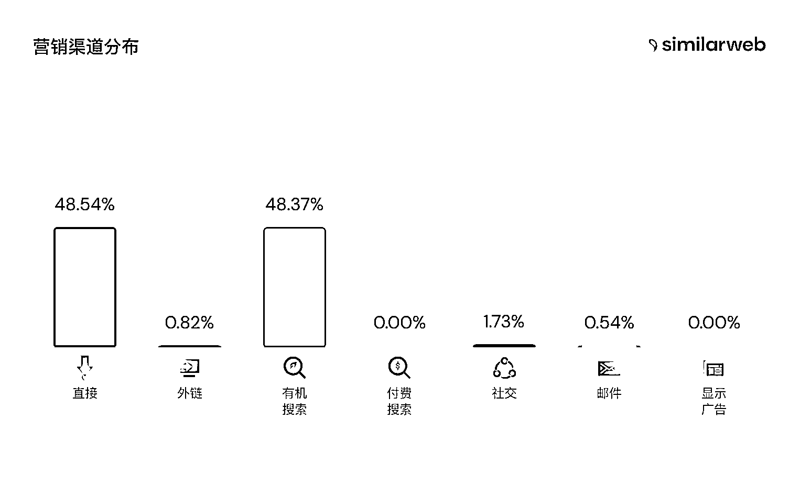
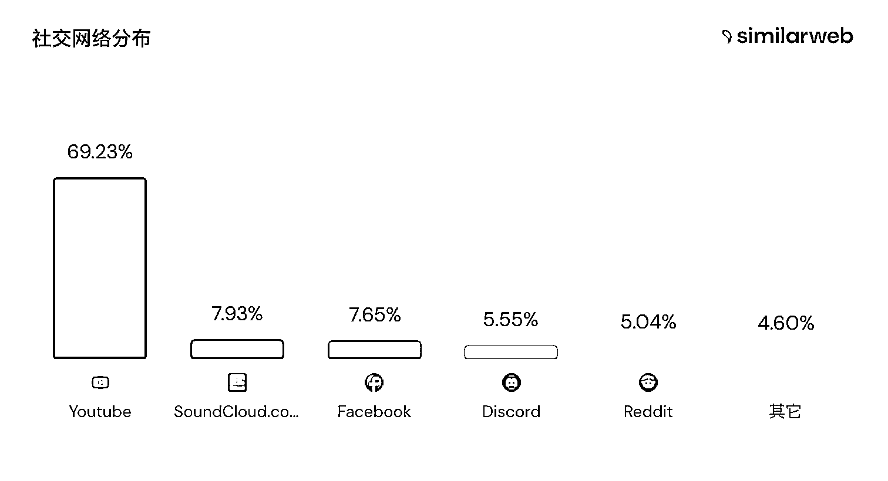

# 《6 个步骤：做 niche 海外软件工具正确的方法》

> 原文：[`www.yuque.com/for_lazy/thfiu8/nogaaqldpep67i13`](https://www.yuque.com/for_lazy/thfiu8/nogaaqldpep67i13)

## (95 赞)《6 个步骤：做 niche 海外软件工具正确的方法》 

作者： 子木 

日期：2023-04-18 

上周末，去参加了北京一个 hackathon，两天时间内从脑暴 & 挖掘软件 IDEA -> Demo 研发路演，这次经历让我难忘。这里我的看法是每个开发者圈友，都应该去参加一次 hackathon ~ 

## 一、做 niche 软件正确的方法 

  

这张图，是壹树树哥线下大会分享的。这边先说结论，如图。我认为 做 niche 软件正确的方法 或 6 个步骤是： 

1.  发现用户的问题或痛点 

2.  明确问题的根本原因 

3.  解决方案：如何用软件解决？ 

4.  确定这类用户画像特征 

5.  确定用户对应的营销渠道 

6.  确定如何营销冷启动？ 

## 第一步：发现用户的问题或痛点 

发现用户面临的问题，是痛点，但只是“标”，不是“本”。 

在 hackathon，我把自己当成用户，我本身喜欢写内容，做 content marketing 增长这块。所以，我发现了一个问题： 

明确问题，是第一步。任何工具的存在，都是为了解决问题。但解决方案，不一定是软件，还有服务，还有其他各个方式。别以为软件是万能的。 

## 第二步：明确问题的根本原因 

利用 5 whys 法，反复问造成该问题的根本原因是什么，这是"本"。 

hackthon 内容营销的问题，其根本原因是：虽然优质原创内容是必要的，但更重要的是需要制定符合各个内容平台推荐或搜索引擎流量规则的优秀标题、描述等等。 

## 第三步：如何用软件解决？ 

这里就需要 MVP 思维和算账能力（包括技术成本、人力成本、时间成本等） 

hackthon 是两天时间，所以我这边选择最重要的点，先去解决标题问题。让标题满足被推荐，被搜索到。其「AI 营销标题：高流量 & 高推荐 -> 高点击转化」解决方案： 

● 利用 AI 总结内容的 Topic + SEO 数据服务平台获取高流量相关标题 

● 通过 AI 技术再次生成高传播和高点击的标题 

未来支持：利用 AI 技术生成营销描述和标签 & AI 生成高点击文章头图 & 基于各个平台做浏览器插件提升用户体验。如下图，就是我们做的 demo 页面： 

  

## 第四步：确定这类用户画像特征？ 

其实这块，hackthon 没做下去了。 demo 完了就结束了，但这块我想分享下，这块非常重要。 

因为只有明确了用户画像特征，才能更好的做流量，做营销，做冷启动。大家可能有点懵逼，为啥用户画像特征这种重要。其实底层很简单： 

用户在哪，我的产品在哪？ 

就这句话，但你都不知道用户画像特征，你咋知道用户在哪呢？所以用户画像特征包括以下： 

1.  公司维度：公司规模、行业、地理位置、岗位、职责、岗位挑战、采购软件流程 

2.  个人维度：年龄、教育水平、平均工资、毕业专业、工作年限、爱好兴趣、所属技能、 

3.  互联网偏好：网站平台偏好、社交媒体偏好、还用其他哪些互联网软件等等 

## 第五步：确定用户对应的营销渠道 & 确定如何营销冷启动？ 

有了这些特征，以及通过你做的东西找到竞品，竞品分析。不能发现，你可以找到用户的营销渠道和冷启动方式。如何通过竞品分析，确定用户对应营销渠道很简单。那如何确定合适你的流量渠道呢？三步走： 

  

### 1、找到 niched 竞品 

竞品是与你的产品或服务最相似的产品或服务，它们的价格、产品和服务都与你相似。 

寻找竞品的方法有很多种，例如通过核心搜索词来找到你的竞争对手，或者使用工具如 ahrefs、similarweb 来寻找相似的网站。将 Top 的竞品网站如图列出来。 

 

### 2、分析竞争对手的流量渠道 

在进行竞争对手流量渠道分析时，需要统计每个竞品网站的流量渠道并进行排序。可以使用 similarweb 提供的功能进行统计，如下图所示。 

 

 

#### 3、选择合适你的流量渠道 

根据自身能力和 Top 流量渠道的匹配情况，选择合适的流量渠道。在冷启动阶段，需要综合考虑自身能力和流量渠道，找到最合适的匹配方案。 

在稳定阶段，应选择最适合的 Top 几个渠道，以获得更多的用户。 

最后，还是给总结下： 

营销底层： 

1.  成功的营销，最关键的是在正确的受众（目标客户）面前展示正确的产品。 

2.  谁是目标客户？ 

3.  在哪里找到他们？ 

4.  目标客户的定义，就是对你提供的产品或服务感兴趣的受众群体。 

### 做 niche 软件正确的方法 或 6 个步骤： 

1.  发现用户的问题或痛点 

2.  明确问题的根本原因 

3.  解决方案：如何用软件解决？ 

4.  确定这类用户画像特征 

5.  确定用户对应的营销渠道 

6.  确定如何营销冷启动？ 

评论区： 

书豪 : 子木大佬牛逼！ 子木 : 别闹 郑鹏鑫 : 大佬牛逼！🎉 Nommy : 思路清晰 子木 : [握手][握手] 子木 : 没有没有多交流 老张 : 大佬牛逼 子木 : 老张牛逼