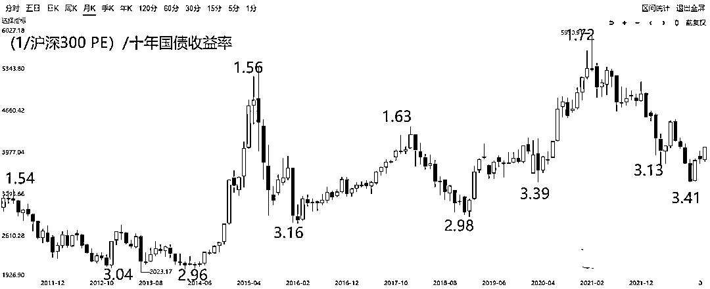
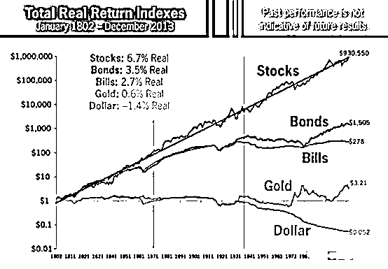
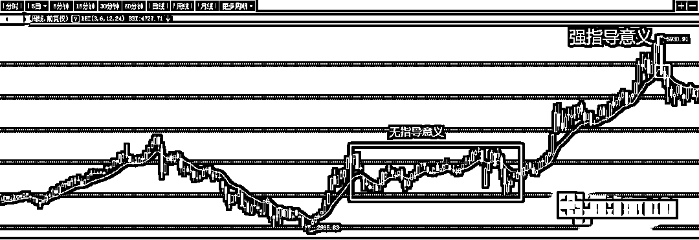

# 《A 股投资方法论（择时+选品）》

> 原文：[`www.yuque.com/for_lazy/thfiu8/rhpygdfiuygdz38g`](https://www.yuque.com/for_lazy/thfiu8/rhpygdfiuygdz38g)

<ne-h2 id="fe41af93" data-lake-id="fe41af93"><ne-heading-ext><ne-heading-anchor></ne-heading-anchor><ne-heading-fold></ne-heading-fold></ne-heading-ext><ne-heading-content><ne-text id="u06975225">(156 赞)《A 股投资方法论（择时+选品）》</ne-text></ne-heading-content></ne-h2> <ne-p id="u95712928" data-lake-id="u95712928"><ne-text id="u3f62aab8">作者： 基金小克勒</ne-text></ne-p> <ne-p id="ub2c97e2b" data-lake-id="ub2c97e2b"><ne-text id="u9da19200">日期：2023-05-09</ne-text></ne-p> <ne-p id="u2962272c" data-lake-id="u2962272c"><ne-text id="ua9301e95">大家好，第一次在生财上发长文。我是基金小克勒（自我介绍：</ne-text></ne-p> <ne-p id="ua8e91d98" data-lake-id="ua8e91d98">[<ne-text id="u00f0f33c" ne-underline="true">https://t.zsxq.com/0dgXYXMo0</ne-text>](https://t.zsxq.com/0dgXYXMo0)<ne-text id="u1ce94575">），CFA 持证人，2013 年入市 A 股投资，连续十年取得正收益。</ne-text></ne-p> <ne-p id="ue55d511d" data-lake-id="ue55d511d"><ne-text id="ud8d03754">今天我以一篇文章，讲明白 A 股的投资方法论。</ne-text></ne-p> <ne-p id="uc36ffde1" data-lake-id="uc36ffde1"><ne-text id="u1c0f73e7" ne-italic="true">A 股和所有其他的投资品种一样。在一波行情里尽可能多地获得收益，需要选到好股票、好基金。提高资金利用效率，避免回撤&提高复利，就需要择时。</ne-text></ne-p> <ne-h1 id="67fffa90" data-lake-id="67fffa90"><ne-heading-ext><ne-heading-anchor></ne-heading-anchor><ne-heading-fold></ne-heading-fold></ne-heading-ext><ne-heading-content><ne-text id="u1eac09ca" style="background-color: rgb(255, 255, 255); color: rgb(47, 48, 52);">1.择时</ne-text></ne-heading-content></ne-h1> <ne-p id="udcc2cf4f" data-lake-id="udcc2cf4f"><ne-text id="u3a8856c4">各路投资大咖都说择时不靠谱（不知他们是真心的，还是出自利益考量），金融科班教材也推崇资产配置而不推荐大幅加减股票仓位。但根据我十年的 A 股投资经验，择时是提升长期收益率的一门法宝。</ne-text></ne-p> <ne-p id="u145fc822" data-lake-id="u145fc822"><ne-text id="u428b505a">依靠一套稳定的择时交易体系，我在 2015 年 6 月、2018 年 2 月、2021 年 2-3 月份成功逃顶，并于 2015 年 9 月、2018 年底再次进入市场。2021 年 3 月切换赛道。到目前为止，我择时的准确率是 100%。</ne-text></ne-p> <ne-p id="u3b7fd9ef" data-lake-id="u3b7fd9ef"><ne-text id="ucbdeee73" ne-bold="true">要保持高的择时胜率，得先弄明白：我们做的不是猜测、赌博，而是基于资产的性价比，做大类资产轮动。</ne-text></ne-p> <ne-p id="u552b4a9f" data-lake-id="u552b4a9f"><ne-text id="ud5653907">所以，择时的周期必然是比较长的。几年才会遇上一次调整仓位的机会。</ne-text></ne-p> <ne-p id="u4ad0719e" data-lake-id="u4ad0719e"><ne-text id="u0e4eda1d">做择时的第一步，是弄明白非关键因素（干扰项）和关键因子。</ne-text></ne-p> <ne-p id="u9214745c" data-lake-id="u9214745c"><ne-text id="u98d04250" ne-italic="true">非关键因素包括三类：</ne-text></ne-p> <ne-p id="u513df5b1" data-lake-id="u513df5b1"><ne-text id="u6ca7a2c8">①突发性事件（如疫情）、地缘政治、外盘（港美股）波动</ne-text></ne-p> <ne-p id="u2a82c4f8" data-lake-id="u2a82c4f8"><ne-text id="ud7011f21">仅影响短期的行情，事件一发生，股市就已经跌了一大半，此时再做仓位调整，性价比太低</ne-text></ne-p> <ne-p id="u0dfe16ed" data-lake-id="u0dfe16ed"><ne-text id="u5705f1c1">②财政政策、中期货币政策（如 LPR、MLF）、宏观经济数据（M2、社融数据）</ne-text></ne-p> <ne-p id="u86e93258" data-lake-id="u86e93258"><ne-text id="ude7c6b35">这类因素，可能仅能影响大盘日内的走势，直接忽略。远期的影响，已经体现在十年国债收益率里</ne-text></ne-p> <ne-p id="u3f72de8b" data-lake-id="u3f72de8b"><ne-text id="uce6459cf">③投资者情绪观察（如周边人讨论股票的人数、xueqiu/股吧评论内容）</ne-text></ne-p> <ne-p id="u96b06887" data-lake-id="u96b06887"><ne-text id="u342ca2a9">样本太小、无法定量分析，也没办法保证很高的成功率，应该忽略</ne-text></ne-p> <ne-h1 id="73305306" data-lake-id="73305306"><ne-heading-ext><ne-heading-anchor></ne-heading-anchor><ne-heading-fold></ne-heading-fold></ne-heading-ext><ne-heading-content><ne-text id="ue7346bb3" ne-bold="true" ne-italic="true">关键因子只有一项：股债性价比</ne-text></ne-heading-content></ne-h1> <ne-p id="u9b6dfbba" data-lake-id="u9b6dfbba"><ne-text id="u52958172" ne-bold="true">股债性价比=指数 PE 倒数/十年国债收益率</ne-text></ne-p> <ne-p id="u19341eb0" data-lake-id="u19341eb0"><ne-text id="u3175a9c2">我比较常用的，是沪深 300 股债性价比。</ne-text></ne-p> <ne-p id="uc7e87610" data-lake-id="uc7e87610"><ne-text id="ua5f18df3">沪深 300 股债性价比= （1/沪深 300 PE）/十年国债收益率</ne-text></ne-p> <ne-p id="u1b28656e" data-lake-id="u1b28656e"><ne-text id="u9fddd8c6">沪深 300 股债性价比长期在 1.5-3.0 之间运行。</ne-text></ne-p> <ne-p id="u3320e09a" data-lake-id="u3320e09a"><ne-text id="u55d049ae">过去十几年，如果在该指标 3.0 附近买入股票/基金，在 1.5 附近卖出，你就是大赢家：</ne-text></ne-p> <ne-p id="u3c9592f0" data-lake-id="u3c9592f0"><ne-card data-card-name="image" data-card-type="inline" id="F0Wf9" data-event-boundary="card"></ne-card></ne-p> <ne-p id="u8519d147" data-lake-id="u8519d147"><ne-text id="u9dd23942">该项指标是有理论支撑的——股票相比债券有风险溢价。</ne-text></ne-p> <ne-p id="ub21a02c3" data-lake-id="ub21a02c3"><ne-text id="u86c3524d">股票相对于债券，波动率更高，但长期收益也会更高。</ne-text></ne-p> <ne-p id="u1eb55a8b" data-lake-id="u1eb55a8b"><ne-text id="u26d71ff1">美国过去 200 年的经验，股票的年化收益，就是长期债券的 2 倍左右。</ne-text></ne-p> <ne-p id="u0c4f77fd" data-lake-id="u0c4f77fd"><ne-card data-card-name="image" data-card-type="inline" id="XYO79" data-event-boundary="card"></ne-card></ne-p> <ne-p id="u9bc32996" data-lake-id="u9bc32996"><ne-text id="u0071b00c">那么，沪深 300 股债性价比长期在 1.5-3.0 之间波动，就非常符合逻辑。</ne-text></ne-p> <ne-p id="u8330cf94" data-lake-id="u8330cf94"><ne-text id="u4098087c" ne-bold="true">除了股债性价比之外，我们可以利用技术分析做辅助判断。</ne-text></ne-p> <ne-p id="u22092a35" data-lake-id="u22092a35"><ne-text id="ud7b3b652">非完全有效的股票市场里，股票会涨过头，也会跌过头。在上涨趋势里，均线对股价有支撑的作用。在下跌趋势里，均线对股价有压制的作用。</ne-text></ne-p> <ne-p id="ufd039e5b" data-lake-id="ufd039e5b"><ne-text id="u1fedb30f">技术分析，主要是在高位，判断拐点时候用的。</ne-text></ne-p> <ne-p id="uca911a09" data-lake-id="uca911a09"><ne-text id="u622d5ef0">A 股有在股债性价比 1.5 的时候拐头向下，也有时候是 1.6、1.7。顶部的股债性价比具体数据，我们没有办法提前预知。</ne-text></ne-p> <ne-p id="ud5a90924" data-lake-id="ud5a90924"><ne-text id="u95579ebf">结合技术分析的判断，股票性价比低的时候跌破趋势，就有很强的指导意义。</ne-text></ne-p> <ne-p id="uc795cd22" data-lake-id="uc795cd22"><ne-card data-card-name="image" data-card-type="inline" id="V0dAk" data-event-boundary="card"></ne-card></ne-p> <ne-p id="ud828b188" data-lake-id="ud828b188"><ne-text id="u3f297e99">插播一个关于楼市的 tips，房产投资人判断房产后市喜欢用成交量数据。楼市里的成交量，就好比股市里的技术分析，是用来辅助判断的，而不是主要的参考依据。价格足够低+成交起量，才预示着大行情的开始。</ne-text></ne-p> <ne-p id="u59906ac5" data-lake-id="u59906ac5"><ne-text id="uce055647">在沪深 300 股债性价比>3.0 的时候买入，后面 1-2 年必定会大赚吗？</ne-text><ne-text id="u6866322a" ne-bold="true">其实未必。</ne-text></ne-p> <ne-p id="u0a27d63f" data-lake-id="u0a27d63f"><ne-text id="ua6bbdf5e">过去十年，出现过很多次的结构性行情。我们不光要看沪深 300 股债性价比，也要看大盘成长/大盘价值/小盘成长/小盘价值四风格象限的估值，才能比较精准地把握结构性行情。</ne-text></ne-p> <ne-p id="u9fd1453e" data-lake-id="u9fd1453e"><ne-text id="u34620118">2012 年底是一次典型的系统性底部——所有股票都很便宜。</ne-text></ne-p> <ne-p id="uec9a9c3b" data-lake-id="uec9a9c3b"><ne-text id="u79e1db4c">大盘成长/大盘价值/小盘成长/小盘价值的估值，都是当时的历史最低。</ne-text></ne-p> <ne-p id="ub05d0e1f" data-lake-id="ub05d0e1f"><ne-text id="u29aeed82" ne-bold="true">这时候的股市，是最安全的，不管买什么类型的基金，大概率都能赚大钱。</ne-text></ne-p> <ne-p id="uf5c85ca0" data-lake-id="uf5c85ca0"><ne-card data-card-name="image" data-card-type="inline" id="gvWxn" data-event-boundary="card"></ne-card></ne-p> <ne-p id="u0705c25e" data-lake-id="u0705c25e"><ne-text id="u0d9d2a35">2015 年 6 月，是一个典型的系统性顶部——所有股票都很贵。</ne-text></ne-p> <ne-p id="u2ee18c11" data-lake-id="u2ee18c11"><ne-text id="u6163b516">在系统性顶部，指数跌破趋势的话，清仓是最好的办法。</ne-text></ne-p> <ne-p id="u5facf7df" data-lake-id="u5facf7df"><ne-text id="u396c4d1e">2016 年 3 月份，则属于一个结构性底部——大盘股估值已经非常便宜，但小盘股估值仍然偏贵。</ne-text></ne-p> <ne-p id="u39a1fa63" data-lake-id="u39a1fa63"><ne-text id="uc50c25b4">所以，2016-2017 年是属于大盘股的行情，与小盘股无缘。</ne-text></ne-p> <ne-p id="u9e4f13c5" data-lake-id="u9e4f13c5"><ne-text id="u7932b080">2018 年 2 月份又是一个系统性的顶部，所有股票都不便宜、市场利率还很高！（十年国债收益率突破 4%）</ne-text></ne-p> <ne-p id="u708364d8" data-lake-id="u708364d8"><ne-text id="u21c31129">2019 年初则是系统性的底部了。所有股票的估值，都回到了历史低位。</ne-text></ne-p> <ne-p id="u8e21881e" data-lake-id="u8e21881e"><ne-text id="u50a2c21d">2021 年 3 月份比较难判断。很多过去择时成功的私募机构，这一回也择时失败了。</ne-text></ne-p> <ne-p id="udf9d25a0" data-lake-id="udf9d25a0"><ne-text id="u47be6858">2021 年 3 月份，大盘成长股估值很高，价值股、小盘股估值很便宜，市场是撕裂的。</ne-text></ne-p> <ne-p id="u9c75a690" data-lake-id="u9c75a690"><ne-text id="u0adec11f">2022 年 4 月和 10 月，沪深 300 股债性价比再一次达到 3.0 以上。但这回，和 2016 年不一样，局部高估的是大盘成长股。</ne-text></ne-p> <ne-p id="u9c2a81ea" data-lake-id="u9c2a81ea"><ne-text id="ua2942682">所以，目前我们还和 2016 年类似，处在一个结构性的底部。</ne-text></ne-p> <ne-p id="u5af700cd" data-lake-id="u5af700cd"><ne-text id="u897ebd98" ne-bold="true">我认为，如果是水平有限（历史年化低于 25%）的投资者，不妨等 A 股系统性底部时，再大举买入，其余时间只值得小仓位参与。</ne-text><ne-text id="u17d36942">就算是抓准了结构性底部，股票或者基金没买到市场热点，很有可能也会跑输私募 xueqiu 产品，甚至保本理财产品。</ne-text></ne-p> <ne-h1 id="d441a5c8" data-lake-id="d441a5c8"><ne-heading-ext><ne-heading-anchor></ne-heading-anchor><ne-heading-fold></ne-heading-fold></ne-heading-ext><ne-heading-content><ne-text id="u454e5e67" style="background-color: rgb(255, 255, 255); color: rgb(47, 48, 52);">2.选品</ne-text></ne-heading-content></ne-h1> <ne-p id="u6db263b4" data-lake-id="u6db263b4"><ne-text id="uc67045ef">在 A 股选择投资品种，我经历了好几个阶段。2013-2015 年积极参与分级基金、可转债等低风险套利机会。2016-2020 上半年主攻个股反转因子。2020 年中开始，以主动基金投资为主。</ne-text></ne-p> <ne-p id="u664c33a6" data-lake-id="u664c33a6"><ne-text id="ubceb78ec">分级基金已经成为过去式。可转债、个股因子投资（包括趋势/反转/价值/成长），都有明显的顺风期和逆风期。再加上注册制推行，个股、个券越来越多，投资的难度在加大，对投资人的要求越来越高。</ne-text></ne-p> <ne-p id="u1a402241" data-lake-id="u1a402241"><ne-text id="u883e67df">对于普通投资者而言，参与市场最好的办法就是买公募基金，每年仅付出 1.5%的管理费，即可搭便车，享受到基金公司的投研成果。</ne-text><ne-text id="u08a0c9cc" ne-bold="true">接下来就讲讲如何选基金。</ne-text></ne-p> <ne-p id="uc9d3ea3f" data-lake-id="uc9d3ea3f"><ne-text id="u3cf3470b">购买主动权益类基金，相信大家都会遇到以下几类问题：</ne-text></ne-p> <ne-p id="ub1e7dfbe" data-lake-id="ub1e7dfbe"><ne-text id="ub0fa14cc">（1）买入前 ikun，买入后菜坤。选择历史收益很好的基金，总是不能给自己带来实际的回报</ne-text></ne-p> <ne-p id="ua872f6e8" data-lake-id="ua872f6e8"><ne-text id="u332f3986">（2）分散买了好多只基金，自以为分散了风险，结果基金的走势都差不多</ne-text></ne-p> <ne-p id="u91f75705" data-lake-id="u91f75705"><ne-text id="u083598c4">（3）买入后即遭遇更换经理/基金经理离职</ne-text></ne-p> <ne-p id="u6473d33b" data-lake-id="u6473d33b"><ne-text id="u515fe404">构建优质的基金组合，我推崇“三好”标准——好公司、好经理、好体系</ne-text></ne-p> <ne-p id="u52cd25a7" data-lake-id="u52cd25a7"><ne-text id="u4f1ccd16" ne-bold="true">一、好公司</ne-text></ne-p> <ne-p id="u31062f06" data-lake-id="u31062f06"><ne-text id="u2d315380">很多人说，投主动基金就是投人，只要经理实力够强就完事了。</ne-text></ne-p> <ne-p id="uc6a87b8b" data-lake-id="uc6a87b8b"><ne-text id="ubfce78af">看历史业绩的话，华商基金周海栋、建信基金姚灿、宝盈基金肖肖，这些人收益并不比行业大佬差。</ne-text></ne-p> <ne-p id="u50c665c8" data-lake-id="u50c665c8"><ne-text id="u82b4f7f9">但这是有幸存者偏差的。长期业绩优秀的经理，大多还是出自头部公司。</ne-text></ne-p> <ne-p id="ucf64cf1b" data-lake-id="ucf64cf1b"><ne-text id="u3bae633f">基金公司没选好，踩坑的概率会高不少。</ne-text></ne-p> <ne-p id="uc94cded4" data-lake-id="uc94cded4"><ne-text id="u28af8960" ne-bold="true">头部基金公司能获得的投研资源更丰富，利于基金经理做好净值。</ne-text></ne-p> <ne-p id="uae112e5b" data-lake-id="uae112e5b"><ne-text id="u2402ff3c">在大公司管基金，规模也容易提升，基金经理的收入则是指数级提升。中小基金公司业绩优秀的经理，容易被头部公司挖角。</ne-text></ne-p> <ne-p id="u719a37e4" data-lake-id="u719a37e4"><ne-text id="u5743ea17">我所认为的顶级基金公司是什么样？</ne-text></ne-p> <ne-p id="u54061007" data-lake-id="u54061007"><ne-text id="u3f12d64f">1\.   剔除货币基金后的管理规模大</ne-text></ne-p> <ne-p id="udf72baf8" data-lake-id="udf72baf8"><ne-text id="u3cbc4119">2\.   公司高管是高水平基金经理出身</ne-text></ne-p> <ne-p id="u2fb631b0" data-lake-id="u2fb631b0"><ne-text id="ucc9b3dd1">3\.   老（管理基金 8 年以上）中（5-8 年）青（3 年以下、3-5 年）各代，优秀经理层出不穷</ne-text></ne-p> <ne-p id="uc63b9f77" data-lake-id="uc63b9f77"><ne-text id="u55af1ac8">4\.   口碑好、负面新闻少</ne-text></ne-p> <ne-p id="u5da51d64" data-lake-id="u5da51d64"><ne-text id="uada4d6fc">5\.   公司价值观偏向于长期投资，不鼓励短期博弈</ne-text></ne-p> <ne-p id="u8a48f228" data-lake-id="u8a48f228"><ne-text id="ucdb7b313">6\.   基金经理收入高，是公募界跳槽的最终目的地</ne-text></ne-p> <ne-p id="ued462d01" data-lake-id="ued462d01"><ne-text id="u970dc49c">大规模基金公司里，给我留下好印象的公司有：景顺长城、易方达、富国、中欧、交银施罗德、华安</ne-text></ne-p> <ne-p id="u8931e584" data-lake-id="u8931e584"><ne-text id="u898843f3">大而不强，有规模没质量的公司：华夏、南方、博时、广发、汇添富、鹏华、天弘</ne-text></ne-p> <ne-p id="u67705fe2" data-lake-id="u67705fe2"><ne-text id="uf7db7cb4" ne-bold="true">二、好经理</ne-text></ne-p> <ne-p id="u683d4370" data-lake-id="u683d4370"><ne-text id="u065b54f6">筛选出好的基金公司以后，在公司内部挑选好的经理，就简单多了。</ne-text></ne-p> <ne-p id="u080167f7" data-lake-id="u080167f7"><ne-text id="u8604e9d5">最简单粗暴的——选择长期业绩居前的基金经理，这是一个不太会出错的选项。</ne-text></ne-p> <ne-p id="u5b90a9a2" data-lake-id="u5b90a9a2"><ne-text id="u2ca65314">还有两个办法，可以帮助我们判断基金经理的水平。</ne-text></ne-p> <ne-p id="u581503c0" data-lake-id="u581503c0"><ne-text id="u1f1ea4da">① 看基金经理是否是公司投资决策委员会成员。</ne-text></ne-p> <ne-p id="u0f38c8fe" data-lake-id="u0f38c8fe"><ne-text id="u1a8ccc94">投决会是个什么东西？</ne-text></ne-p> <ne-p id="ua0031c38" data-lake-id="ua0031c38"><ne-text id="u8c4c8df3">大部分基金公司会有这样的规定：基金经理在买入公司股票池以外的标的，超过基金 3%仓位的，需要投决会表决。超过 5%仓位的，需要投决会主席批准。</ne-text></ne-p> <ne-p id="ud5638a7c" data-lake-id="ud5638a7c"><ne-text id="u865d09c6">【投决会】成员，就是公司的大佬们，可以对其他基金经理的操作进行审查、指导，投资水平必然是比较高的。</ne-text></ne-p> <ne-p id="uec04bfd7" data-lake-id="uec04bfd7"><ne-text id="u1541e83e">②  金牛奖数量。</ne-text></ne-p> <ne-p id="uf3def953" data-lake-id="uf3def953"><ne-text id="u507c2d4d">金牛奖由中国证券报主办，是国内最权威的基金业奖项。</ne-text></ne-p> <ne-p id="u9b831352" data-lake-id="u9b831352"><ne-text id="u58a5659c">得过金牛奖的基金经理至少水平都不差。多座金牛奖得主，都是业内大腕。</ne-text></ne-p> <ne-p id="u15d20a20" data-lake-id="u15d20a20"><ne-text id="u760b14da">金牛奖的评选，还是比较客观公正的，注重于长期价值。即使是一年期的金牛奖，收益也不是 100%考虑因素，组合的波动性也会考虑进去。短期赌风格、净值波动大的经理，比如蔡嵩松，就拿不到金牛奖。</ne-text></ne-p> <ne-p id="uc961fa87" data-lake-id="uc961fa87"><ne-text id="u9daeeead" ne-bold="true">三、好体系</ne-text></ne-p> <ne-p id="u34616697" data-lake-id="u34616697"><ne-text id="uf26929a2">通过前两个步骤，我们可以形成自己的基金经理观察列表。（我的列表涵盖全市场 200+优秀基金经理，可以私信我免费获取，本贴主要讲投资技巧）</ne-text></ne-p> <ne-p id="ubecaff45" data-lake-id="ubecaff45"><ne-text id="ue672c945">但最关键的是第三个步骤——好的投资体系。</ne-text></ne-p> <ne-p id="uddfb94ff" data-lake-id="uddfb94ff"><ne-text id="u73f7961e" ne-bold="true">投资权益类基金，只需做到一步，就领先了别人大半个身位——只买小规模基金。</ne-text></ne-p> <ne-p id="uf22a7474" data-lake-id="uf22a7474"><ne-text id="u7cd25d1c">规模越小的基金，基金经理在交易换仓的时候，摩擦成本越小。小规模的基金还有额外的打新股超额收益。也能参与一些迷你股的交易。</ne-text></ne-p> <ne-p id="u647f8ddb" data-lake-id="u647f8ddb"><ne-text id="u5934b695" ne-italic="true">理想的权益类基金，就是优秀基金经理管理的小规模产品。</ne-text></ne-p> <ne-p id="ub8f7c3c9" data-lake-id="ub8f7c3c9"><ne-text id="u4e813eb6">很多业绩曲线逆天的基金，收益率狂奔期间，都是利用小规模做出来的。</ne-text></ne-p> <ne-p id="u5f6744f3" data-lake-id="u5f6744f3"><ne-text id="u184633ef">我们在它大放异彩、规模迅速扩大的时候买入，必定没办法取得和以前一样的业绩。</ne-text></ne-p> <ne-p id="u5bc9dedb" data-lake-id="u5bc9dedb"><ne-text id="u61cf75d2">所以，买基金，一定要选择小规模的产品。规模超过 100 亿的基金，纵使投资人水平再高，都一律否决。</ne-text></ne-p> <ne-p id="u27ec999f" data-lake-id="u27ec999f"><ne-text id="u6eeb586a" ne-bold="true">我的原则，是不买超过 50 亿规模的基金，最好是 20 亿以下的。</ne-text></ne-p> <ne-p id="u9ebdb518" data-lake-id="u9ebdb518"><ne-text id="u6fee239c" style="color: rgb(38, 38, 38);">很遗憾，投资就是这么没有创造性、枯燥无味的一门事业，以上内容，我已经在自己的号上翻来覆去讲了很多遍了。</ne-text></ne-p> <ne-p id="u175176cb" data-lake-id="u175176cb"><ne-text id="u3b4a4b10">生财是一个提倡利他的社区，对投资理财感兴趣的朋友，可以私信联系我，我会组建一个群，免费解答投资相关疑点。</ne-text></ne-p> <ne-p id="ue3d2d5c2" data-lake-id="ue3d2d5c2"><ne-text id="u56dbc455">手里有比较多客户的自媒体朋友也不要错过一起赚钱的机会，合作渠道开户，按 600 元/有效户结算，开 300 个有效户就是 18 万，利润丰厚。</ne-text></ne-p> <ne-hole id="ua806ab63" data-lake-id="ua806ab63"><ne-card data-card-name="hr" data-card-type="block" id="Qi5D3" data-event-boundary="card"><ne-p id="u01143bb2" data-lake-id="u01143bb2"><ne-text id="u2531975a">评论区：</ne-text></ne-p> <ne-p id="u02a61123" data-lake-id="u02a61123"><ne-text id="u9d717c8f">刘一笔 : 赞</ne-text> <ne-text id="uc662520f">念十一｜豪宅 : 厉害</ne-text> <ne-text id="uee73ed7b">张有财 : 投资怎么会“枯燥无味”呢，投资要技术，是一门学问也是一门艺术。[憨笑]</ne-text> <ne-text id="u49d19da4">蜗牛进阶 : 请问有效户的条件是？</ne-text> <ne-text id="u7a01dc72">VV 安 : 赞</ne-text> <ne-text id="uf6dc089a">苓枫 : 生财真是藏龙卧虎啊</ne-text> <ne-text id="u47e7624c">生财青蛙 : 研究投资确实是一件枯燥又有趣的事[偷笑]</ne-text> <ne-text id="u346f0131">惟乔 : 请问使用股债性价比预测成功率是多少，是否适用于行业或概念版块</ne-text></ne-p></ne-card></ne-hole>