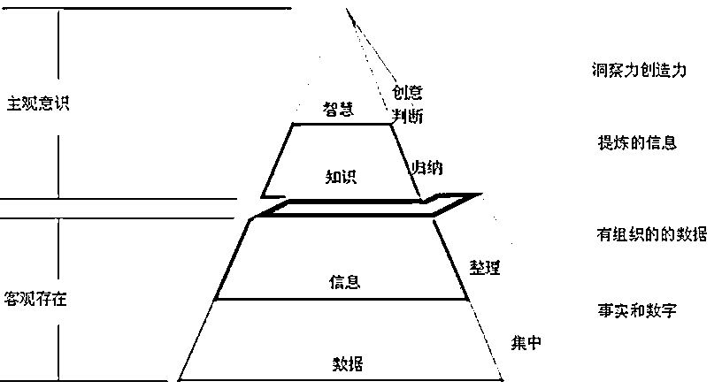
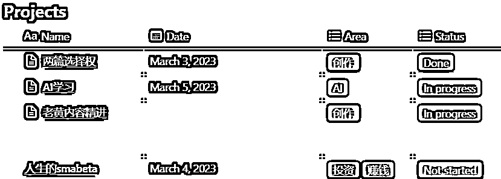

# 《如何成为持续创作的机器，分享三个技巧》

> 原文：[`www.yuque.com/for_lazy/thfiu8/vgl5dzppaqgpzycq`](https://www.yuque.com/for_lazy/thfiu8/vgl5dzppaqgpzycq)

## (108 赞)《如何成为持续创作的机器，分享三个技巧》 

作者： 老黄牛 

日期：2023-05-05 

大家好，我是老黄牛，创业者投资者。在生财写过 14 篇精华帖，【生财精选小报童】的内容统筹（至今 2 万 4 千多订阅）。 

今天分享一个知识创作系统，目的是把【资料整理系统】升级【知识管理系统】再升级到【知识创作系统】。 

自媒体时代，输出内容至关重要，希望这篇文章对大家有收获。 

### 【资料整理】→【知识管理】→【知识创作】 

把文章、课程整理有序，叫资料（信息）整理。 

整理自己加工后的信息，叫知识管理。 

如何把这些知识输出成原创文章，叫知识创作。 

市面上把 3 种知识管理混淆在一起，先澄清： 

1.  个人信息管理 PIM，这个就是资料管理。做好收集、分工管理，为了用的时候方便提取。 

2.  企业界的知识管理 KM，是关于学习型组织“组织的信息创建、共享、使用和管理的过程”。 

3.  个人知识管理是 PKM，它融合了企业界称为知识管理 (KM) 的概念，也是个人信息管理 (PIM) 理念的扩展。 更强调通过已有信息扩展新信息或新知识。 

PKM 和 PIM 的区别，就是 PKM 能通过旧知识（资料）创造新知识。 

从资料整理系统到知识创作系统，本文将分享三个技巧 

1、什么知识需要记录 

2、如何萃取：把信息变为知识 

3、知识创作系统 

# 一、什么知识需要记录 

卡片笔记法之前分享过，不为本次分享重点。具体可参考：[在生财 9 个月写了 9 篇精华，我分享一个方法](https://t.zsxq.com/0dySlYsf5) 

在知识创作系统里，有一些补充： 

以前做笔记时，我只关注记录信息来源以便日后查找，却未思考如何利用这些笔记，导致它们很少被重新使用。 

许多人热衷于数字花园和庞大的知识体系，致力于收集名人演讲、思维模型等。然而，这些信息在网络上随处可见，未来你不一定会用到。因此，在收集知识时要审慎思考，关注实际需求和可应用性，避免陷入信息过载的困境。 

在收集过程中，要避免贪多，保持克制。那么，哪些知识值得我们保留呢？ 

收集准则 1：它是否有用？ 

不要疯狂收集你用不到的信息。收集您当前涉及的领域，或者未来可能研究的领域。 

收集准则 2：它是否能激发灵感？ 

启发性的语录、图片、观点和故事都可能成为激发灵感的源泉。 

收集准则 3：它是否足够新颖？ 

避免记录众所周知的想法。信息理论家香农曾对“信息”给出过一个简洁的定义：让人惊讶的信息。 

收集准则 4：它是否是私人的？ 

每个人的经历都独一无二，您自己的思考和反思具有独特的价值。 

# 二、萃取：渐进式总结，把信息变为知识 

信息和知识的区别 

在 DIKW 体系中，有四个层次：Data（数据）、Information（信息）、Knowledge（知识）、Wisdom（智慧）。 

  

数据层是最基本的，信息层加入了“内容”，知识层加入了“如何使用”，而智慧层则加入了“在何时使用”。 

1.  数据：对客观事物的描述，通常为原始事实和数字，需处理分析以转化为有用信息。 

2.  信息：经处理的数据，提供有价值洞察和理解，解决问题、支持决策或增进了解。 

3.  知识：基于信息积累、理解和应用，涉及深入理解、经验、技能和专业见解。 

4.  智慧：知识的高级形态，评估、筛选、整合知识实现更高价值和目标。 

### 渐进式总结：把信息变为知识 

大家听过费曼学习法，就是把你看过的知识，用自己话复述，这是一种萃取（内化）的办法。但它没有明确的步骤，而渐进式总结，就非常清晰。 

渐进式总结是一种萃取笔记方法，由 Tiago Forte 提出，是内化很好的方法论，它有 5 层 

1.  第一层：高亮或下划线标记出文章中最重要或最有趣的部分。 

2.  第二层：用自己的话对每个高亮或下划线部分写一句话的总结。 

3.  第三层：把所有第二层的总结合并成一个段落，形成对文章的整体概括。 

4.  第四层：把第三层的段落进一步压缩成一句话，作为对文章的核心观点。 

5.  第五层：把第四层的句子转化成一个问题，作为对文章的思考启发。 

假设你时间紧迫，但看到优质的内容，你可以先用第一层，摘录下来。等你有空再进行第二层或后续的操作。 

如果这个知识对你非常有价值，值得你用 5 层来总结，而一些普通的知识，用到第二层就 OK，这个丰俭由人。 

举个例子：一篇“如何知识变现”的文章，可按以下步骤做笔记： 

1.  第一层：下划线标记出文章中最重要或最有趣的部分，比如知识变现的定义、方式、优势、难点等。 

2.  第二层：用自己的话对每个下划线写一句话总结，比如「知识变现是指利用自己掌握的知识来为他人提供价值并获得收益」、「知识变现的方式有很多，比如写书、开课、做咨询等」、「知识变现的优势是可以提升自己的专业水平和影响力，并且不受时间和地域的限制」、「知识变现的难点是要找到合适的目标受众和平台，并且保持持续输出和更新」。 

3.  第三层：你可以把所有第二层的总结合并成一个段落，形成对文章的整体概括，比如「这篇文章介绍了什么是知识变现以及它有哪些方式、优势和难点。作者认为，知识变现是一种利用自己掌握的知识来为他人提供价值并获得收益的方法，它可以帮助我们提升自己在某个领域内的专业水平和影响力，并且不受时间和地域的限制。但是，要实现知识变现也不容易，我们需要找到合适的目标受众和平台，并且保持持续输出和更新。」 

4.  第四层：你可以把第三层的段落进一步压缩成一句话，作为对文章的核心观点，比如「这篇文章讲述了知识变现是什么以及它有哪些好处和挑战。」 

5.  第五层：你可以把第四层的句子转化成一个问题，作为对文章的思考启发，比如「我怎样才能有效地进行知识变现呢？ 

这里面的萃取，就是从原始信息中筛选、提炼和整合关键观点和知识点。 

首先是内化，通过将文章的信息用自己的语言重新表达，使之更符合个人理解，便于记忆和应用。文章内容整合成段落和核心观点，使原本分散的信息变得更加结构化，有助于对知识的理解。第五层将核心观点转化为问题，启发思考和探索，从个人角度去应用和拓展这些知识，从而使信息更具价值和实用性。 

  

而当你想要回顾这篇文章时，只需要看看你自己写的笔记就行了。而且，如果你想要和其他人分享这篇文章时，也可直接用你写的总结来介绍它。 

# 三、动态知识创作系统 P.A.R.A 

当我们积累大量的笔记时，很容易变得杂乱无章，难以找到所需的内容。这时，我们需要一种方法来帮助我们组织和管理数字笔记。介绍由生产力专家 Tiago Forte 提出 PARA 的方法，可帮你组织和管理数字笔记。 

这个知识管理方法由四个主要类别组成：项目（Project）、领域（Area）、资源（Resource）、 档案（Archive）。 

项目（Project）：具可操作性，有具体的截止日期。和 Areas 的不同之处是 Project 有明确的目标。如：创建网站、出一个课程。 

  

领域（Area）：长期关注的方向，如：写作、投资、AI、赚钱 

  

资源（Resource）：领域内与领域外（以后可能关注）的任何知识或资料。例如文章、视频、课程。 

  

档案（Archive）：已结束的项目，不再需要或不再可操作的信息或工具。例如已发布的文章，已完成的学习。 

  

我觉得 P.A.R.A.最精髓是项目（Project）和档案（Archive）： 

1、项目确保笔记是你最快用到。 

因为它是一个动态的系统，一个信息不一定要自始至终属于上述类别中的一个，而是可以自由流动。通过流动，确保笔记放在最有用的地方，而且是最快用到的地方。 

2、能更加专注，聚焦要做的项目和关注的领域。而不是什么信息都记下。 

这个系统是一个很好的方法论，当我们看到资料时，就可以想： 

1.  这将在哪个项目（Project）中最有用？ 

2.  如果没有：这将在哪个区域（Area）中最有用？ 

3.  如果没有：放在资源吧（Resource） 

para 解决了没有目标（只追求的知识体系）的问题，因为它要让找到自己做的项目，找到自己专注的领域。 

## 总结一下： 

1、分清资料整理和知识创作的区别，收集信息不要存了一堆没有的资讯，而是针对自己有用的知识。 

2、通过渐进式总结，用 5 层加工，把信息内化成知识乃至智慧。 

3、动态的知识管理系统，让笔记放在最快用到的地方，更聚焦眼前，提高创作力。 

创作输出给我带来很大好处，特别是互联网时代，它不单单能获得流量利器，还可以梳理思维，还能跨时间跨空间结识有趣的人。但创作不是学会的，是需要多练习。多创作多输出，就会自然会频频好事发生！ 

评论区： 

周彦充 : 感觉挺牛，还没看过瘾就结束了[色] 老黄牛 : 我还怕写太长[憨笑] 周彦充 : 做个飞书，写 10 万字，这样看着才过瘾，哈哈 林清杰 : 感谢，  《卡片笔记法》也看过，一直看不懂怎么用的，总觉得哪里不对，最后放弃思考直接通篇搬运当个搬运工了[发呆] 林清杰 : 少了写作两个字，就是介绍卢曼怎么使用的  越看越晕 金多多 : 是不是有望出续集[色] 老黄牛 : 知识管理领域，其实还有很多操作细节可写[呲牙] 老黄牛 : 确实是书的问题，写得云里雾里