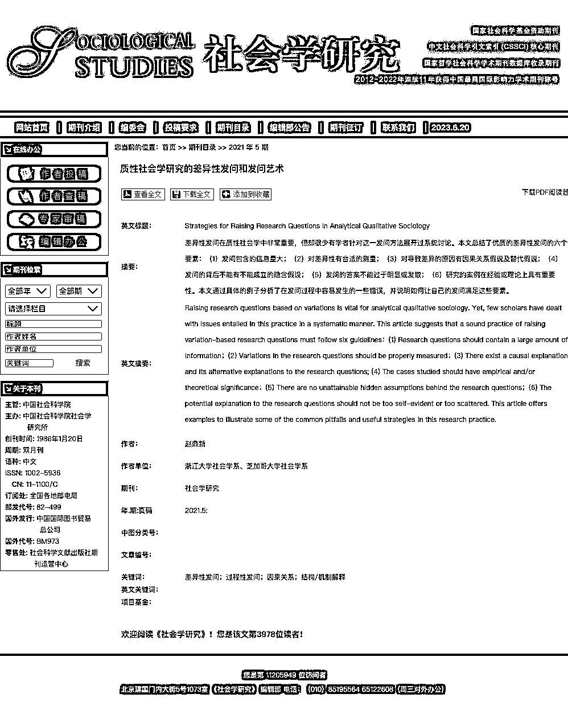

# 找到向 AI 提出好问题的六重境界

> 原文：[`www.yuque.com/for_lazy/thfiu8/ln4yhgi8zlwomgun`](https://www.yuque.com/for_lazy/thfiu8/ln4yhgi8zlwomgun)

<ne-h2 id="e807540a" data-lake-id="e807540a"><ne-heading-ext><ne-heading-anchor></ne-heading-anchor><ne-heading-fold></ne-heading-fold></ne-heading-ext><ne-heading-content><ne-text id="u854ec9c4">(34 赞)找到向 AI 提出好问题的六重境界</ne-text></ne-heading-content></ne-h2> <ne-p id="u644e9adf" data-lake-id="u644e9adf"><ne-text id="ub46bb36d">作者： 杨昌</ne-text></ne-p> <ne-p id="u526f5f94" data-lake-id="u526f5f94"><ne-text id="u3b246109">日期：2023-06-20</ne-text></ne-p> <ne-p id="u12ef77c0" data-lake-id="u12ef77c0"><ne-text id="ud910e365">我们都知道，对于 Al，提问很重要。深刻的问题，才有深刻的答案。</ne-text></ne-p> <ne-p id="u77718012" data-lake-id="u77718012"><ne-text id="uf7a93e47">但很少有人知道，深刻的问题从何而来？</ne-text></ne-p> <ne-p id="ue7aa923b" data-lake-id="ue7aa923b"><ne-text id="ua5fc79a8">今天，从「浙大社会学系系主任」赵鼎新老师的一篇论文里，找到「向 AI 提出好问题」的六重境界（6 个方法）。#AI 工作流</ne-text></ne-p> <ne-p id="ud6d70ae5" data-lake-id="ud6d70ae5"><ne-text id="u75bb1270">【第一重境界】交代要透彻</ne-text></ne-p> <ne-p id="uf93c1003" data-lake-id="uf93c1003"><ne-text id="u55b08c1a">提问时，要尽可能提供详细和具体的信息，以帮助 AI 更好地理解你的问题，并给出更准确的答案。具体的建议如下：</ne-text></ne-p> <ne-oli index-type="0"><ne-oli-i>1</ne-oli-i> <ne-oli-c class="ne-oli-content" id="u6f62d0f0" data-lake-id="u6f62d0f0"><ne-text id="ueb22e4d1">明确的上下文：提供问题的背景信息，比如你在研究什么主题，你的问题是在什么情境下提出的，你希望得到什么样的答案等。</ne-text></ne-oli-c></ne-oli> <ne-oli index-type="0"><ne-oli-i>2</ne-oli-i> <ne-oli-c class="ne-oli-content" id="u67d64cb7" data-lake-id="u67d64cb7"><ne-text id="ud404f094">具体的要求：明确指出你希望 AI 做什么，比如你希望 AI 提供某种信息，解释某个概念，还是帮你解决某个问题。</ne-text></ne-oli-c></ne-oli> <ne-oli index-type="0"><ne-oli-i>3</ne-oli-i> <ne-oli-c class="ne-oli-content" id="u1d78d665" data-lake-id="u1d78d665"><ne-text id="ufafb90e4">详细的描述：如果你的问题涉及到某个具体的情况或例子，应该尽可能详细地描述这个情况或例子，包括相关的时间、地点、人物、事件等。</ne-text></ne-oli-c></ne-oli> <ne-oli index-type="0"><ne-oli-i>4</ne-oli-i> <ne-oli-c class="ne-oli-content" id="ua8b6bca2" data-lake-id="ua8b6bca2"><ne-text id="u3ef597cc">相关的知识：如果你的问题涉及到某个特定的领域或主题，应该提供相关的知识或信息，以帮助 AI 更好地理解你的问题。</ne-text></ne-oli-c></ne-oli> <ne-p id="ud90ed188" data-lake-id="ud90ed188"><ne-text id="udbe754ef">【第二重境界】“对照实验”</ne-text></ne-p> <ne-p id="u89dc8f33" data-lake-id="u89dc8f33"><ne-text id="u2e7c40e3">就像做对照实验一样，每一次改变其中的某一个重要的因素，从而研究被改变的这个因素对事物的影响，</ne-text></ne-p> <ne-p id="u0e626011" data-lake-id="u0e626011"><ne-text id="u73b61c0a">提问时，应明确指出你关注的是哪些差异，并给出合适的测量方法。</ne-text></ne-p> <ne-p id="u2374a330" data-lake-id="u2374a330"><ne-text id="u9e6ffefa">举个张一鸣高考填报志愿的例子，他列出了五个参考维度：下雪、靠海、离家远、综合性大学、大城市。</ne-text></ne-p> <ne-p id="uddf3692f" data-lake-id="uddf3692f"><ne-text id="ud6818c4c">经过一个维度一个维度的比较和筛选，最终发现满足这些维度的学校，只有一所，那就是位于天津的南开大学。</ne-text></ne-p> <ne-p id="u1daaaf6a" data-lake-id="u1daaaf6a"><ne-text id="u635702d7">好的答案，是在比较中得出。比较的维度，可以来自喜好，也可以来自 SWOT 等的经典模型。有了清晰的标准和全面的衡量，好的答案就不远了。</ne-text></ne-p> <ne-p id="u5ef0803d" data-lake-id="u5ef0803d"><ne-text id="ud422ae67">【第三重境界】综合考虑更多可能性</ne-text></ne-p> <ne-p id="uce5877c0" data-lake-id="uce5877c0"><ne-text id="uab801a74">继续拿高考举例，假设你正在考虑填报哪所大学的哪个专业，你可能会有这样的问题："为什么某些专业的就业率比其他专业高？"</ne-text></ne-p> <ne-p id="u262c7613" data-lake-id="u262c7613"><ne-text id="uf62941da">在这个问题中，你的主要假设可能是：某些专业（比如计算机科学或医学）的就业率高，是因为这些领域的工作机会多，需求大。</ne-text></ne-p> <ne-p id="u2a96d2d1" data-lake-id="u2a96d2d1"><ne-text id="ua4ddfbad">除了这个表面的原因外，其实你还有必要思考更多可能性。例如，某些专业的就业率可能高是因为这些专业的学生更有可能在毕业后立即寻找工作，而其他专业的学生可能会选择继续深造。</ne-text></ne-p> <ne-p id="u944a6d48" data-lake-id="u944a6d48"><ne-text id="udfd4e70d">或者，某些专业的就业率高可能是因为这些专业的学生更有可能在学校的职业发展中心寻求帮助，或者更有可能利用学校的校友网络来寻找工作机会等等。</ne-text></ne-p> <ne-p id="ud7d5c5f8" data-lake-id="ud7d5c5f8"><ne-text id="u016284f1">如果你综合考虑了影响就业率的各种可能因素，你就可以更明智地选择专业，而不仅仅是根据就业率来选择。</ne-text></ne-p> <ne-p id="u7da24e5c" data-lake-id="u7da24e5c"><ne-text id="u9e23a74c">【第四重境界】Stay Hungry Stay Foolish</ne-text></ne-p> <ne-p id="ucfb97e9e" data-lake-id="ucfb97e9e"><ne-text id="u06d886e2">例如，如果你问："我应该选择哪个专业才能找到一份高薪工作？"</ne-text></ne-p> <ne-p id="u819c4689" data-lake-id="u819c4689"><ne-text id="u486f4413">这个问题中的隐含假设可能是"选择的专业直接决定了工作的薪酬"。</ne-text></ne-p> <ne-p id="u490d7e9f" data-lake-id="u490d7e9f"><ne-text id="uf351368f">然而，这个自以为是的假设，可能并不总是成立，因为工作薪酬可能还会受到其他因素的影响，比如个人的技能、工作经验、地理位置等。</ne-text></ne-p> <ne-p id="uea36be7f" data-lake-id="uea36be7f"><ne-text id="u6c52ea3c">这就要求我们在提问时，尽量避免先入为主地包含那些可能不成立的隐含假设。</ne-text></ne-p> <ne-p id="u7dd0e8be" data-lake-id="u7dd0e8be"><ne-text id="u99267f28">保持开放，保持婴儿般的好奇。别太自以为是地妄下判断，尽量避免过度简化，避免忽略可能影响答案的重要因素。</ne-text></ne-p> <ne-p id="u77ff5ab6" data-lake-id="u77ff5ab6"><ne-text id="u9cba79d6">【第五重境界】问题有深度</ne-text></ne-p> <ne-p id="u307e854a" data-lake-id="u307e854a"><ne-text id="u61871d86">我们很难凭空提出「有深度、具体明确、有探索价值的问题」。但我们可以比较容易地反着来，去避免没有深度、不具体明确和没有探索价值的问题。</ne-text></ne-p> <ne-p id="u587cb256" data-lake-id="u587cb256"><ne-text id="uface4f5d">如何避免呢？看看答案是否太明显，或者问题是否过于发散，就知道了。</ne-text></ne-p> <ne-p id="ue563732a" data-lake-id="ue563732a"><ne-text id="u26961530">1、答案是否太明显：</ne-text></ne-p> <ne-p id="u26f9c653" data-lake-id="u26f9c653"><ne-text id="uae83e99f">如果一个问题的答案是公认的事实或者是广为人知的信息，那么这个问题的答案可能就太明显了。</ne-text></ne-p> <ne-p id="uaf0d5161" data-lake-id="uaf0d5161"><ne-text id="u0964bfcb">例如，"太阳从哪个方向升起？"这个问题的答案（东方）是众所周知的。</ne-text></ne-p> <ne-p id="ua8f1c1eb" data-lake-id="ua8f1c1eb"><ne-text id="u21e19b6e">在提问之前，你可以先自己思考一下，看看你是否已经知道答案。如果简单百度/谷歌一下就能得到答案，那么这个问题可能就没有太大的探索价值，发到群里都会被群嘲。</ne-text></ne-p> <ne-p id="ud72baf3e" data-lake-id="ud72baf3e"><ne-text id="u3c4b87d3">2、问题是否过于发散：</ne-text></ne-p> <ne-p id="u2eeb0efb" data-lake-id="u2eeb0efb"><ne-text id="uc4e3dfd7">如果一个问题太过宽泛，没有明确的范围或者条件，那么这个问题可能就过于发散。</ne-text></ne-p> <ne-p id="uaadae2e6" data-lake-id="uaadae2e6"><ne-text id="u29d7b018">例如，"我应该怎么做才能成功？"这个问题太过宽泛，因为"成功"的定义和路径因人而异，可能会有无数种答案。</ne-text></ne-p> <ne-p id="u5f84ecb7" data-lake-id="u5f84ecb7"><ne-text id="u4248aeda">在提问之前，你可以试着预想一下可能的答案。如果你发现可能的答案太多，或者答案可能会因人而异，那么这个问题可能就过于发散。</ne-text></ne-p> <ne-p id="u159854fa" data-lake-id="u159854fa"><ne-text id="ub985bddd">【第六重境界】案例有分量</ne-text></ne-p> <ne-p id="u76a48e42" data-lake-id="u76a48e42"><ne-text id="u5f7f1ce0">好的案例，可以将抽象的问题具体化，使得问题更加清晰易懂；可以提供实证支持，增强论点的说服力；还可以引发深入思考，激发新的见解和想法；甚至可以连接理论和实践，帮助我们理解理论在实际中的应用。</ne-text></ne-p> <ne-p id="u9ed47046" data-lake-id="u9ed47046"><ne-text id="ucaa0cf8b">选择问题的案例时，应该选择那些在经验或者理论上具有重要性的案例。以下是一些具体的建议：</ne-text></ne-p> <ne-p id="u5734e559" data-lake-id="u5734e559"><ne-text id="u2d559361">1、经验上的重要性：</ne-text></ne-p> <ne-p id="u53a0c58f" data-lake-id="u53a0c58f"><ne-text id="u7d687b9d">这通常指的是案例是否具有实际的、现实的重要性。</ne-text></ne-p> <ne-p id="u6a5d305f" data-lake-id="u6a5d305f"><ne-text id="ueabb5668">例如，如果你正在研究环保问题，那么选择那些严重受到污染的地区作为案例可能会更有意义，因为这些地区的环保问题更为严重，更需要我们去关注和解决。</ne-text></ne-p> <ne-p id="u109677dd" data-lake-id="u109677dd"><ne-text id="u2311a9e3">2、理论上的重要性：</ne-text></ne-p> <ne-p id="ufcea7caf" data-lake-id="ufcea7caf"><ne-text id="u1457757d">这通常指的是案例是否能够帮助我们理解或者验证某些理论或概念。</ne-text></ne-p> <ne-p id="ucc4c85a9" data-lake-id="ucc4c85a9"><ne-text id="u58e5a9b2">例如，如果你正在研究经济发展对环境的影响，那么选择那些经济发展快速但环境问题严重的地区作为案例可能会更有意义，因为这些地区的情况可以帮助我们理解和验证经济发展和环境之间的关系。</ne-text></ne-p> <ne-p id="u476cf600" data-lake-id="u476cf600"><ne-text id="u98e86efc">———</ne-text></ne-p> <ne-p id="ud4b3e539" data-lake-id="ud4b3e539"><ne-text id="ucd355f1b">论文 pdf 官网链接如下，点击即可查看：</ne-text></ne-p> <ne-p id="uc2dea630" data-lake-id="uc2dea630">[<ne-text id="u79d28324">http://shxyj.ajcass.org/Admin/UploadFile/Issue/202005130001/2021/9//20210917064949WU_FILE_0.pdf</ne-text>](http://shxyj.ajcass.org/Admin/UploadFile/Issue/202005130001/2021/9//20210917064949WU_FILE_0.pdf)<ne-card data-card-name="image" data-card-type="inline" id="MHPZg" data-event-boundary="card"></ne-card></ne-p> <ne-hole id="u81ddd90e" data-lake-id="u81ddd90e"><ne-card data-card-name="hr" data-card-type="block" id="e9q7g" data-event-boundary="card"><ne-p id="ue8c67ee8" data-lake-id="ue8c67ee8"><ne-text id="u1bc1ff30">评论区：</ne-text></ne-p> <ne-p id="ud0546fbb" data-lake-id="ud0546fbb"><ne-text id="u1c2fe668">阿黎 : 谢谢分享，早安</ne-text> <ne-text id="u4a9c2a13">杨昌 : 早吖 阿黎老师</ne-text></ne-p></ne-card></ne-hole>