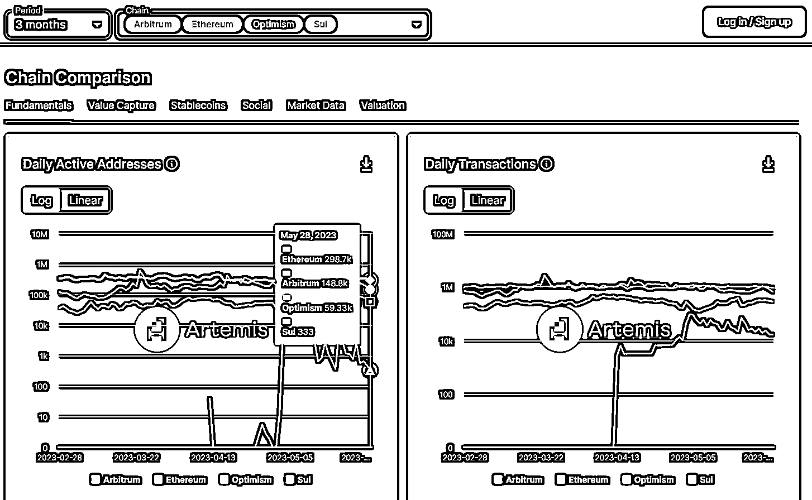
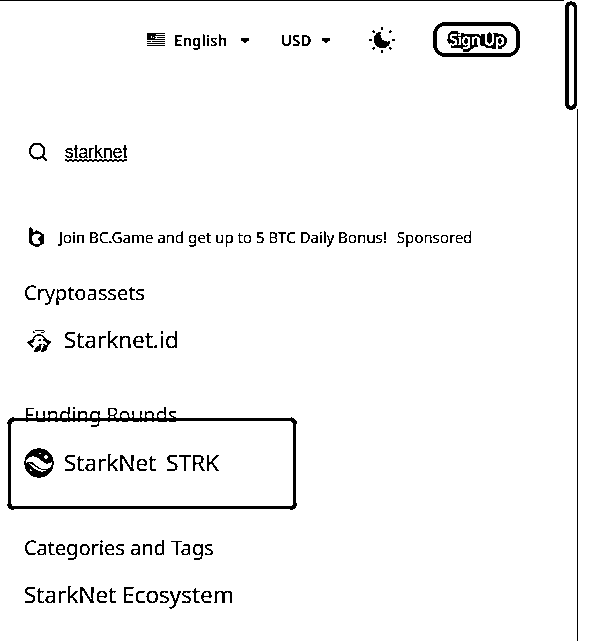
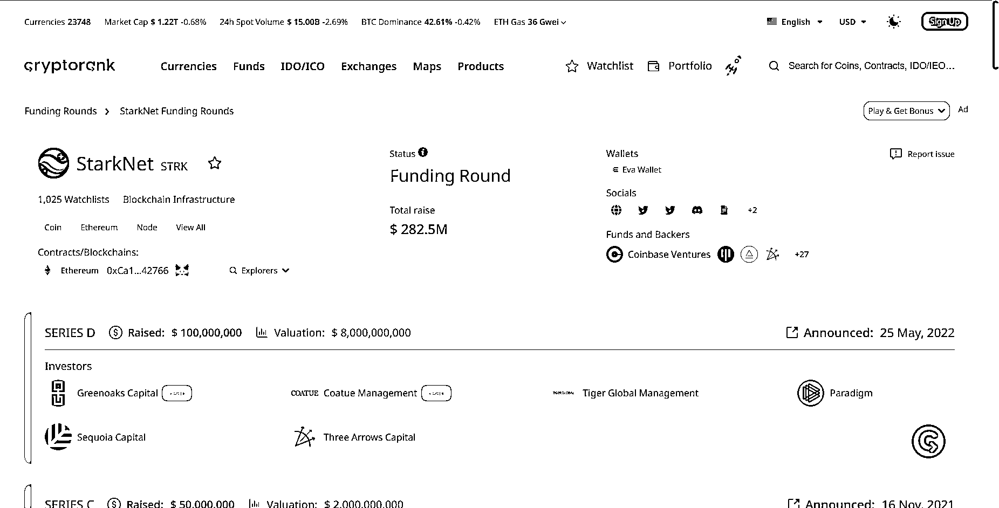

# 手把手教你找 L2 链上数据及交互教程

> 原文：[`www.yuque.com/for_lazy/thfiu8/xvvgimsc9rcl2qwr`](https://www.yuque.com/for_lazy/thfiu8/xvvgimsc9rcl2qwr)

## (28 赞)手把手教你找 L2 链上数据及交互教程 

作者： 阿布 Abo 

日期：2023-07-04 

5 月 30 日《手把手教你找 L2 链上数据及交互教程》@阿布 Abo5 月 30 日《手把手教你找 L2 链上数据及交互教程》@阿布 Abo船员们晚上好，我叫阿布 Abo。目前是 web3 投资俱乐部 RichDAO、某华语区 socialfi 龙头 app 的 Builder 之一，以及某万粉 kol 的社群分享嘉宾。我是22 年 12 月通过 RichDAO 的入门训练营入门的。入圈半年，投入资金 5k 左右，目前的投资回报率是 5 倍多。算上可预见的分红及其他权益，一年内的预期回报大概是 8-10w cny。还不算上未来二层有可能的两大项目空投，未来的收益毛估估都是比较可观的。由于我的资金量不大，所以我只会去找确定性高、门槛相对不高、投资回报率高的领域去做。在经历过 NFT 买卖、二级买币等等的小成本试错后，发现适合自己的还是撸毛。无论大家选择哪个方向探索，一定切记要根据自己的实际情况，计算好【投入资金】、【固定成本】、【可投入时间/精力】、【预估收益】、【能否承担极端风险】等相关因素后，再根据战略制定具体的执行计划:·比如说你是个本金有限但时间宽裕的刚毕业大学生，那“低成本”跟“高收益”的撸毛可能就是你适合你的路；·又比如你是个有本金但时间宝贵的老板，那“批量购买 NFT”、“屯币”可能是更为适合你的路；·又或者你是个有本金但时间宽裕的程序员，那你就可以自己写脚本去撸毛或者弄机器人套利等等......就像第一天航海 koda 教练说的那样，你需要去思考你在这个圈子想要赚的是哪些钱， 进而在该领域去学习、去低成本试错、去复盘总结，去探索适合自己的路。言归正传，聊聊为什么今天我会选择 L2 数据作为分享的切入点。说是 L2 数据，实际上还会教大家怎么找官方信息、项目判断以及如何找项目教程等等。同时我发现，网站这个信息差很大可能还没有被挖掘和公布，这才有了今天的分享。以下是今天的分享内容:① 考虑到群里有部分是新用户，所以今晚分享的开头部分会简单讲解一点【基础概念科普】；② 其次是讲解【L2 链上数据】，分享 L2 数据：一是为大家提供官方推特、dc 等渠道。身边有好友因为刚入门，不知道如何找到官方的推特和 discord，找了错误的链接，导致资产被盗；二是为了获取到当前该项目的发展情况。项目交互的人数和交易次数等相关数据信息的获取，可以让我们较为清晰的了解大家对这些项目最近的看法。包括但不限于融资信息、项目方官方网站、链上数据等；③我会手把手教大家如何去实操如何使用相关网站；④ 最后是教大家如何自主找项目信息和网站，很多优质信息其实都是透明的。而人与人之间获取信息的速度快慢和获取信息的效率高低会使得不同人之间对同一个项目的认知不同，认知会影响执行，而执行则会影响最后的结果。话不多说，Let's go！！一、基础名词科普ethereum，以太坊：ETH 是以太币的简称，以太坊区块链上的代币称为以太币，代码为 eth，可在许多加密货币的外汇市场上交易，它也是以太坊上用来支付交易手续费和运算服务费的媒介。gas fee：Gas fee 也称燃料费，在转移代币或购买 NFT 时支付给矿工的费用。以太坊二层 L2：L2 全称 Layer2因为 eth 以太链被俗称贵族链，以太坊处理交易的能力，其交易吞吐量，被限制为每秒 15 笔交易，导致它变得越来越昂贵，过于拥挤，使得许多人无法使用。在 gas war 的时候，每次交易的手续费太高，每笔交易高达几百，几千美金，因此二层网络 L2 诞生，可以帮助以太坊扩大规模，提高交易速度，降低手续费，增加网络可以处理的交易数量。以太坊二层 L2 有 Optimism，Arbitrum，zkSync ，StarkWare 等等，目前 op 和 arb 已经发币，剩下两个还没发币，因此我们做交互的时候尽量使用后面两个 L2 的产品。加密钱包：加密钱包，数字钱包是我们在 web3 里面一定要有的“身份系统”，我们的资产都在里面。加密钱包有：MetaMask（小狐狸），okx 钱包，starknet 项目常用的钱包（braavos 头盔钱包、argent X 人字拖钱包）tx( txs) : 某个项目的交易数量撸空投（普通人想在 web3 中赚到钱的较优路径）：撸空投又称作撸羊毛。每个项目方在推进项目的时候，需要有一个理由让用户去体验该项目的生态及其下属的项目，所以会拿出一部分资金反馈给用户，这部分的资金其实算是项目方的推广预算。你可以理解成，传统的 web2 在电视上打广告，公司付给电视台广告费。而在 web3 中，空投就是项目方的“广告预算”，由于少掉了中间商赚差价，直接让利给了用户。逻辑线是：项目方有好的项目→宣传出去积攒些用户→项目活跃人数和项目交互数量增加→项目方更有利于去拿到融资→项目方拿到融资→后续会给在该项目上活跃的用户进行奖励分发空投→交互人数和数量会更多→以此形成正向循环。到最后，项目方数据好看，投资方拿到一级市场筹码，活跃用户拿到项目空投。之所以先给大家分享一些名词解释，是我考虑到今天来听分享的可能有部分是刚入门的 web3 新人，怕自己犯了“知识的诅咒”，所以大家在看到我后续的分享中发现不懂的名词解释，大多都可以翻到上面去看一下。如果有一些我没有讲解到的，也可以直接在群里艾特问或者私下问我。二、L2链上数据之所以以 L2 数据作为切入点，是因为现在的新老玩家都在撸毛，做 zksync 和 starknet 也是目前 web3 撸毛人（也包括我 哈哈），是在下轮牛市前获取到一级筹码的低成本方式。必备插件小狐狸插件（web3 使用人数最多的钱包，适合新人使用）：https://metamask.io/与小狐狸相搭配的网站（加其他链）：https://chainlist.org/也可以用 okx 钱包，用这个钱包不需要多添加其他链。相比于小狐狸钱包，优点是可以一眼看到和复制各链的资产数量和公钥地址；缺点是不支持部分不知名的链。如果只做二层项目交互，建议用 okx 钱包，对新人蛮友好。也可以小狐狸和 okx 钱包都体验一遍，看自己更喜欢哪个。okx 钱包下载地址：https://chrome.google.com/webstore/detail/okx-wallet/mcohilncbfahbmgdjkbpemcciiolgcge?hl=zh-CNgas fee 查询：gas fee，又称手续费。无论是挖矿、买卖 NFT、跨链等等，只要在链上的交易行为，大部分都需要支付手续费。这里给大家分享一个可以查询实时 gas 的插件：https://www.blocknative.com/gas-estimator?utm_campaign=Gas%20Platform&utm_source=share-extension还有一个我常用的手机电脑都可以查询 gas 的网站：https://mct.xyz/gasnow必备网站：查项目融资网站：https://cryptorank.io/这个查询项目融资的网站，可以让我们直观的了解到某一项目当前的融资额度、投资机构等等相关信息，从而了解到该项目方是否有钱。比如一个项目方团队成员之前拿到过结果、市场上口碑也不错、融资数据也不错（主要看领投的机构和金额），那这样的项目大概率就是值得关注的。币价查询网站：https://www.coingecko.com/https://coinmarketcap.com/这两个网站的作用相当，任选一个使用即可。以下用 CoinMarketCap 举例，基本就是看数据，包括但不限于币价、官网、推、dc、白皮书、合约地址、市值、fdv、24 小时成交量、流通数量等信息。Layer 2 分析研究网站：https://l2beat.com/scaling/tvl该网站可以让我们直观的了解到很多热门项目当前的发展情况，比如 L2 和 eth 主网目前的交易数据高低、项目月交易量数据、官方网站、官方推特和 dc、背后的技术对比 等等相关信息，从而增进对该项目的判断。各链上活跃程度汇总：https://app.artemis.xyz/dashboard这个网站可以让我们很清晰的看到不同链上活跃用户和交易量的数据，进而判断出该项目的热度。在这就可以跟其他两个已经发币的二层项目的日活用户做一个比较。举个例子，有些人好奇 sui 的操作，想看看 sui 现在是个什么水平，sui 当初可是号称 130 亿美金（fdv）的公链。大家可以在心理默默猜一下它现在的日活是多少？5 月 28 日的日活数据是 333，对的，你没有看错，后面没有“k”。这也能从侧面看出，现在公链在大家的心目中是个什么水平。又比如你想看当前已经发币的 L2 项目的日活数据，也可以在这一目了然的看到。虽然说只是单一的把活跃数拿出来对比可能没有那么全面跟客观，但以日活的数据来看，还是可以有一个大概的了解的。查 ip 地址的质量高低：https://whoer.net/zh#关于 IP 地址质量高低，目前关于是否需要配置 ip，大家并没有达成一致的共识。有人觉得说目前 L2 已经发币的两个项目，op 和 arb 都没有查 ip，那没必要浪费钱去买 ip 和配置指纹浏览器。又有人觉得说稳妥为主，还是需要以防一下万一。对了，有 ip 跟三件套需要的可以 dd 我 哈哈。我的看法是：如果说你只做两个二层的项目，其余的小项目克制住不去做它；又比如你只有 3～5 个号，那什么 ip、指纹浏览器，就不是你现在需要考虑的事情。直接用 chrome 浏览器多开就行了，具体操作：打开 chrome——点击右上角三个点“左边的 google 账号图标”——点击下面的“其他个人资料”的“添加”即可。直接用谷歌多开做二层项目，影响不大。而且多开也是可以挂其他地区的 ip 而不用指纹浏览器的。受限于今天的分析内容长度，这部分就不展开细讲了。取消授权网站：https://revoke.cash/zh如果你问我 web3 最需要注意的是什么，那最重要的无非是资金安全。因为今天的分享主题是 web3 相关的网站，这部分我就不细讲，核心理念就是：君子不立于危墙之下。账户的安全永远是首位的，否则你赚再多的钱，也不过是给黑客打工罢了。在交互不知名项目、领土狗空投的时候，操作完一般建议取消授权。公链数据看板：在链上做交互，往往离不开查看某个项目的数据，比如总交易量又多少、某个时间段的交易数量等等，由此可以看出大家对于某个项目是看多还是看空，卷的人多不多等等。zk 整体数据：https://www.oklink.com/cn/zksync该地址可以清晰的看到 zksync 的总交易数量（tx）、地址总数、活跃地址数等等数据。如果说你现在想做 zk 的号，你想了解目前人均的 tx，就可以用 tx 除以地址总数，有个预估。zkSync era 看板：https://dune.com/gm365/erazk 号的项目交互同步（来自 kol 北北）：https://bitboxtools.github.io/#/zksyncStarkNet 看板：https://dune.com/chaininsight/starknet-overviewLayerZero 看板：https://dune.com/kosk/stargate-amount-of-txL2 四大天王对比看板：https://dune.com/gm365/L2三、实操：如何使用上述网站了解和参与项目了解完上述插件和网站后，我们需要做的，就是合理使用它们，探查你想要了解的项目信息。举个例子：如果你想从 0 了解 starknet 这个项目和做项目交互，步骤如下。第一步：先进 https://cryptorank.io/查询该项目的融资额。一般来说，融资额高意味着项目方有钱，项目方有钱才有可能给用户发放空投。①右上角搜索“starknet”：②进去就可以看到该项目的融资情况和官方推、discord、白皮书等等：第二步：StarkNet 看板：https://dune.com/chaininsight/starknet-overview，可以看到 starknet 目前的用户数及其交易数量等数据。进入 https://foresightnews.pro/search/result?search=%20&search_type=mirror¶ms_type=article搜“starknet 项目”，尽可能多的了解该项目的相关信息：第三步：看几篇研报或者分析后，你就会对这个项目有一个大框架的了解后，后续想了解该项目如何进行实操交互，则在上述地址将搜索内容改为“starknet 教程”。注意：在了解项目的时候，日期不要限制；而在搜教程的时候，时间最好限制在半年内，最好是 3 个月内。因为项目在发展，有些子项目的前端页面的显示也会跟着改变，老教程有可能你就看不太懂了。第四步：在 twitter 上搜索框搜关键词：“starknet 教程”，看看一些 kol 对这个项目近期的交互建议是什么？该项目汇总的信息有哪些等等。四、如何自主寻找教程授人以鱼不如授人以渔，以下分享几个我自己平时找教程和项目会用的搜索网站。https://foresightnews.pro/search/result?search=%20&search_type=mirror¶ms_type=articlehttps://askmirror.xyz/比如你想学习合约，直接搜关键词“合约+教程”；又比如你想了解 zksync 项目，就搜“zksync 项目”，弹出来的 mirror 就可以自己去筛选判断。站在前人的肩膀上去看世界，会远比自己探索要高效得多。需要注意的是：mirror 上的信息不可全信。mirror 是用户或者博主自发创作的，既然是人做的，那就有可能有主观上使坏的可能性。所以我的建议是，把 mirror 上的一些项目教程都看一下，包括但不限于项目方信息、子项目信息、融资额度、投资机构等等。如果想关注官方的推、dc 这类，就直接在 https://cryptorank.io/上面找就行了。在对项目有了基础的了解之后，如果有看到不理解的概念，也可以求助于 gpt，比如上述的前文提到的两个二层项目，你想深究 starknet 和 starkware 的区别，又或者 Zksync era 和 zksync lite 的区别，就可以直接给它提问。在自己大概了解了一个项目后，建议再去找找身边的做过该项目的人，问一问他们对于该项目的看法和如何做交互等等。实际上如果你认识的人到一定量级，哪怕以上内容你都不学，你可能都能获取到很多的优质信息。故而，多认识一些人，对自己在这个圈子里的发展是有益处的（现实生活中也是这么个逻辑）。给大家推荐几个分享优质内容的撸毛的博主，大家可以关注下，比如 zhaozhao（@0xzhaozhao）、宣城小科比（@cr7_hacker）、福利鸭（@0xCryptoUni）、冰蛙（@Ice_Frog666666）、sanyi（@sanyi_eth_）、何币（@hebi555）、Lin Dora（@Taiyanghuaaa），感兴趣也可以 follow 下我（@0xAboCrypto）。结束语之前有机会跟一些长辈了解和见识到现实中的商业社会及其目前发展的大趋势，真的觉得这个时代留给普通人的机会并不多了。而如果你问我现在普通人的机会在哪，我脑子里的第一反应就是 web3，web3 中有很多有趣的东西。Crypto、NFT、meme coin、brc-20 等等很多你看不懂但是却切切实实能赚到钱的东西。在熊市的大背景之下，依旧还是能够赚到钱，恰恰说明这个圈子的机会依旧很多。最重要的是思考【目标&策略】，及其更为重要的【执行】。希望大家都能够在 web3 的世界中赚到钱，我的分享到此结束，谢谢大家～  

评论区： 

朝阳🐳 : 牛呀 阿布 Abo : 谢谢[玫瑰][玫瑰]