# AI 模特换装及 lora 模型教程分享

> 原文：[`www.yuque.com/for_lazy/thfiu8/okkabrzp7zyv0ydc`](https://www.yuque.com/for_lazy/thfiu8/okkabrzp7zyv0ydc)

## (30 赞)AI 模特换装及 lora 模型教程分享 

作者： 瑾糖 

日期：2023-07-03 

6 月 1 日《如何训练 AI 模特，实现定向换人换装换背景》@瑾糖6 月 1 日《如何训练AI 模特，实现定向换人换装换背景》@瑾糖哈喽各位航海的小伙伴们大家好！我是瑾糖，一位探索 AIGC 广告从业者，也是一家茶馆的前主理人前两个月 AI 模特火热的时候，我就开始摸索这个技术，之前我负责过拍摄相关的业务，了解到模特在其中占用的成本有多少。按照广州的模特一手报价，中模在 1K～5K/天，外模 2～5K/时。如果能够利用 AI 技术，为我们降低拍摄中的模特成本那就好了。例如用假模换真模，无货源换脸换背景，中模变外模等，这些可以在我们做项目中得到实际应用。希望我分享这个主题，能够让大家在 AIGC 类目里面多一条变现的思路，那我们开始今天的分享叭～一、图文图，保留衣服换人换背景我们现在利用图生图的局部功能来实现把原本的模特和背景，换成另外一个人，可以换成白人或者黑人，也可以用这个方法用把假人模特换成真人模特。这里我们需要使用Segment Anything的一个插件，来代替PS中制作蒙版的方式，这样我们就能在SD中完成出图。第一步：Segment Anything 插件安装💡guthub 地址：https://github.com/continue-revolution/sd-webui-segment-anything1.1 打开 WEB UI 界面-在后面找到扩展-点击从网址安装-在 git 网址中粘贴👆链接-点击安装-底部看到按照路径表示完成1.2 回到已安装界面-会看到下面 segment-anything 插件已安装-点击应用并重启-等待加载-在文生图或者图生图界面就可以看到 Segment Anything 插件选项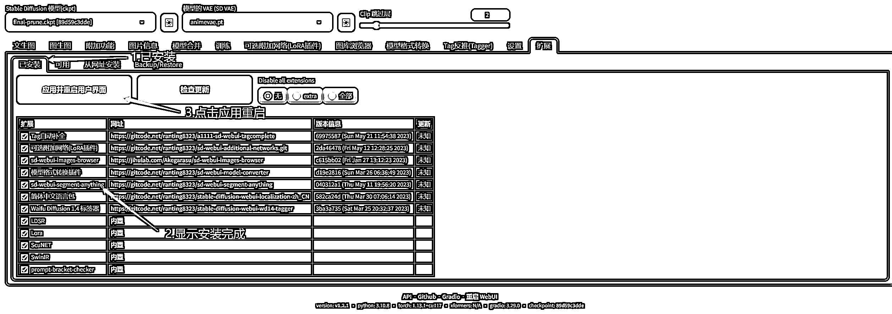1.3 下载对应的模型，点击下方👇蓝色字体直接下载，也可以在网盘中下载：10G 以上显存：vit_h ；6～10G 显存：vit_l ；6G 以下显存：vit_b百度网盘链接：https://pan.baidu.com/s/1Xqo1LA8ho0R2SN5YIEW18A?pwd=wxbj，提取码：wxbj 1.4 把下载的模型放在【盘符\webui 目录\extensions\sd-webui-segment-anything\models\sam】中（一定不要修改模型命名）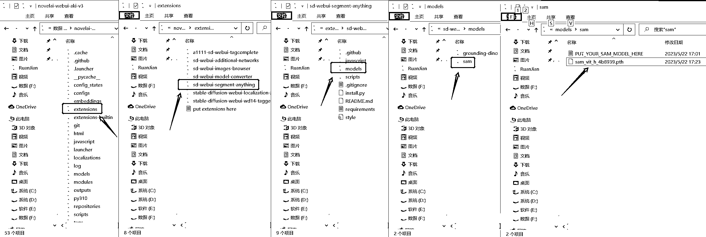1.5 回到 WEB UI 界面-点击在 Segment Anything 插件选项后面的小三角-点击模型栏的刷新按钮-点击模型栏中的小三角选择对应模型（如果只有 1 个模型刷新后会自动选择）第二步：分割蒙版2.1 打开 Segment Anything 插件后面的小三角-把需要换装保留的衣服图片上传至图像框-在图像框中用左键点击需要保留的区域，右键点击不需要的区域-点击 Preview Segmentation 生产蒙版💡使用技巧：左键可以生成黑点是我们框选保留部分，右键生成红点是明确不要的部分，如果黑/红点位置错误可以用左键点击该黑/红点进行取消；如果想全部的黑/红点取消点击图像下面的【Remove all point prompts】2.2 生成后会出现三张分割图，三张蒙版图，三张蒙版预览图（现在预览的图是因为画面压缩，点击任意图就可以放大预览了）2.3 放大后的图片位置是对应的，我们可以选择预览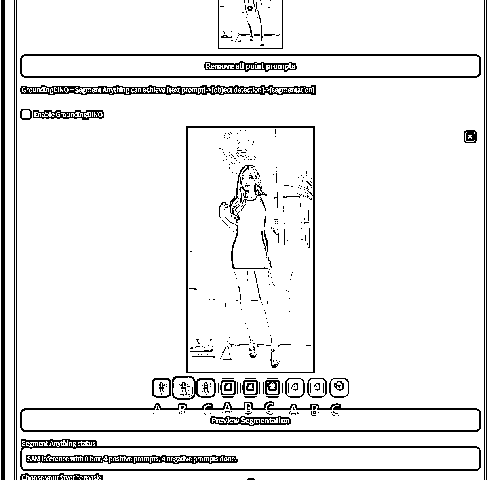2.4 我们选择分割效果比较好的蒙版选择保存-在蒙版的预览界面（👇图 2）点击右键-图片另存为（放在任意文件夹）-然后点击保存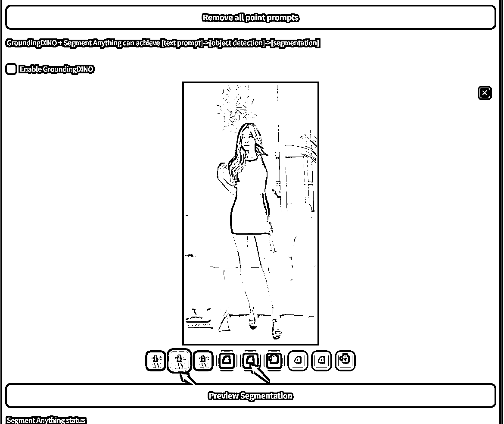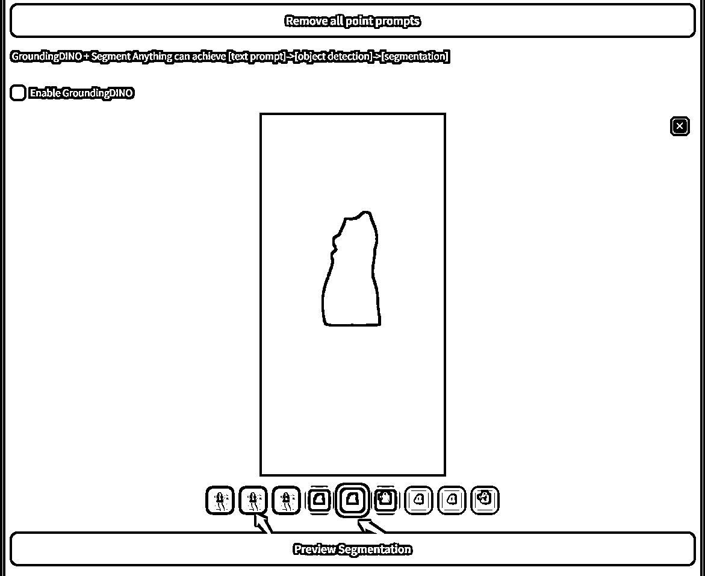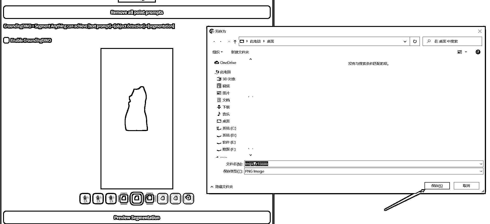第三步：设置出图参数3.1 选择出图的大模型（比如你想生成白种人或者黑种人，这个大模型是否支持）-点击图生图板块-选择局部重绘（上传蒙版）-把需要保留的衣服图片和 2.4 保存的蒙版上传至对应区域3.2 设置生成图片的参数值💡缩放模式：拉伸蒙版模式：重绘非蒙版内容（因为黑色部分才是蒙版，但是我们使用 Segment Anything 衣服部分是白色的，如果使用重绘蒙版内容就是改变衣服样式人物和背景不变）蒙版蒙住的内容：原图重绘区域：全图  蒙版模式边缘：32（默认就好）采用迭代步数：50（如果显卡差些可以调低至 20～30）采用算法：DPM++ 2S a Karras面部修复：启用面部修复图片尺寸：与上传的图片一致或倍数（太低会出坏图，太高会爆显存）最好不要高于 2000 低于 768提示词相关性：7重绘幅度：0.75随机种子：-13.3 设置 ControlNet 参数💡1）把图片上传至图片区2）勾选启用3）勾选、【Pixel Perfect】和【Allow Preview】如果显存比较低（4～6G）可以勾选【低显存优化】4）预处理器选择 canny 预处理模型也要选择对应的 canny5）点击预处理器和预处理模型中间的小爆炸图标就能预览线稿图6）其他参数默认就好第四步：添加关键词4.1 添加正反向关键词💡正向关键词：1girl， solo， brown hair， long hair， window， jewelry， couch， indoors， standing， sleeveless， full body， looking at viewer， blue eyes， lips， nail polish， High heels， Wood floor， （Negroid :1.9）， UHD💡反向关键词：bw， worst quality， low quality， （deformed， distorted， disfigured:1.3）， poorly drawn， bad anatomy， wrong anatomy， extra limb， missing limb， floating limbs， （mutated hands and fingers:1.4）， disconnected limbs， mutation， mutated， ugly， disgusting， blurry， amputation， cloned第五步：AI 模特出图5.1 点击右侧生成按钮等待生成5.2 直出效果图小结：该方法适用于假人模特、帽子、鞋子、首饰、床柜等需为指定物品更换场景的应用方式。二、训练服装 lora 模型，标签详细这一章节我们来讲用训练lora的方式训练我们的衣服（物品）模型，然后再使用衣服的lora模型，生成人物穿着我们的衣服。第一步：模型训练工具安装1.1 下载 lora-scripts-打开下面网盘链接-保存至网盘-下载到本地盘符💡链接：https://pan.baidu.com/s/1-UYJkiYtAyVZRNfnLzxWQQ?pwd=zksy提取码：zksy1.2 把压缩包解压至盘符中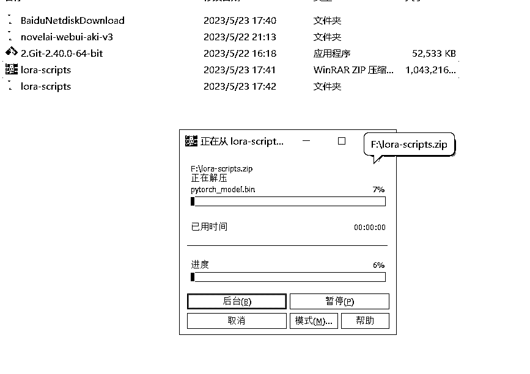1.3 在搜索局域栏中输入【powershell】然后用右键选择管理员身份运行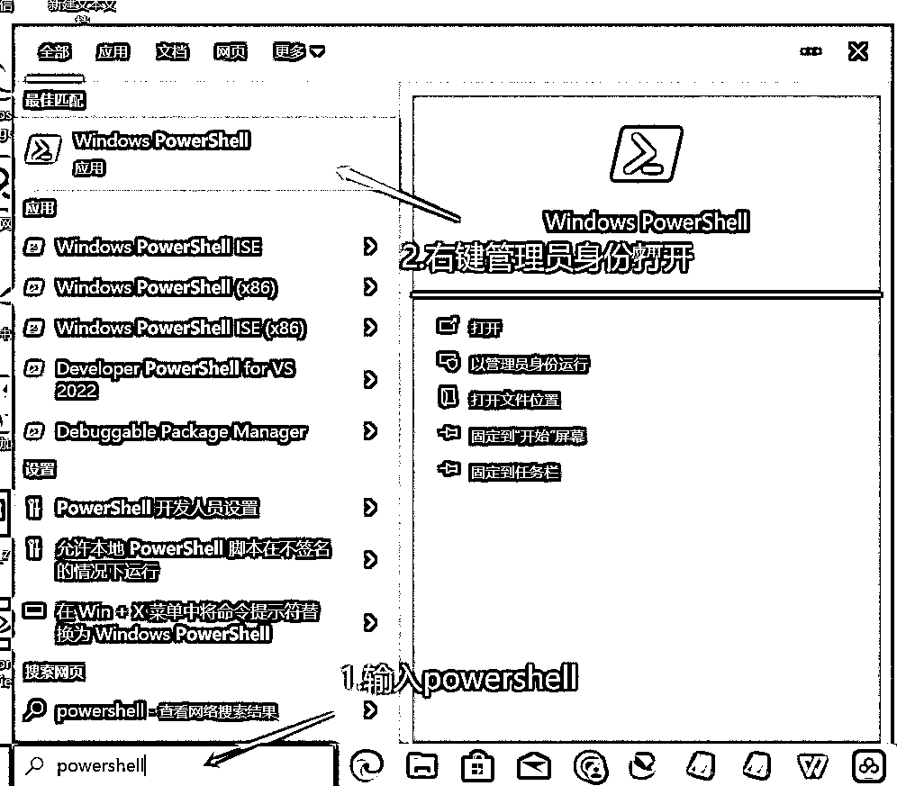1.4 在 powershell 中输入下面👇运行代码-然后输入【Y】回车💡Set-ExecutionPolicy -ExecutionPolicy RemoteSigned1.5 打开【lora-scripts】目录，找到【install-cn】点击右键使用 PowerShell 运行，就会自动安装加载，现在安装完毕就可以关掉了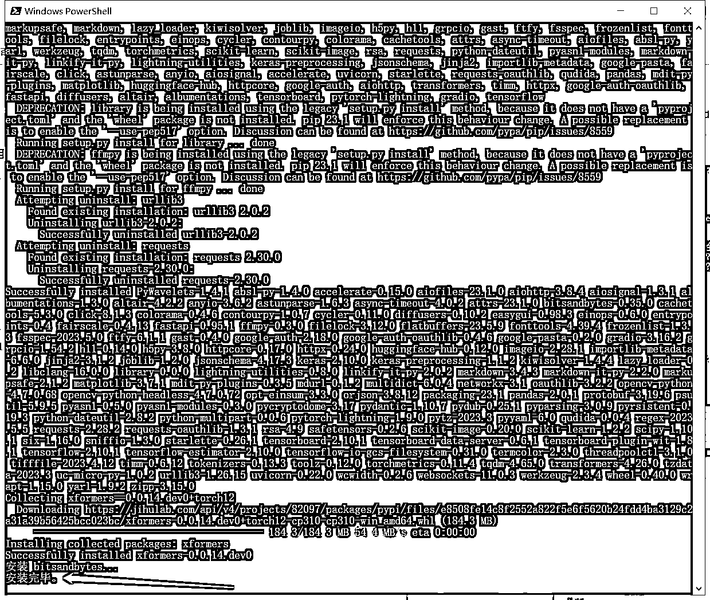第二步：训练素材准备在进行 LORA 训练前需要准备训练素材，想要到达预期的效果对图片素材有一定要求：分辨率：越高清越好，训练出来的模型细节也越多数量：推荐 50 张图片，保底 10-15 张背景：建议纯色背景角度：建议平视拍摄，配合不同的角度前后侧，不建议俯视训练衣服模型需部位：衣服要保证完整，同一衣服多角度拍摄，产品每个部位有特写更好，衣服不要被人手遮挡，建议有透明人台上单独 拍摄一组第三步：训练素材预处理3.1 新建一个文件夹（可以是产品的拼音）-在新建的文件夹中再新建两个文件夹分别命名为【in 和 out】-准备好的图片素材拷贝进【in】文件夹3.2 打开 web ui 界面-训练-图像预处理-输入图片存放路径和输出路径-输入图片尺寸-创建镜像-自动裁剪-生成 tags 说明文件-点击预处理预处理图片尺寸：需要根据你的原图尺寸比例输入。比如，竖版的用 768*1024 或 768*512；横板：768*512 或 1024*768；正方形：512*512、768*768 或 1024*10243.3 等着加载完成，就能在【out】文件夹中看到处理好的图片和文本说明文件第四步：训练素材标签处理4.1 在【lora-scripts】目录中新建一个【train】文件夹（首次创建便可）；在 train 文件夹中创建一个模型文件夹（你训练的这个模型叫什么比如黑色内衣的拼音【heiseneiyi】）；在模型文件夹中创建训练文件夹【8_heiseneiyi】结构为训练步数 _ 模型名💡train 文件夹仅需首次创建便可训练步数建议为 5～10 之间文件夹路径不能存在中文文件夹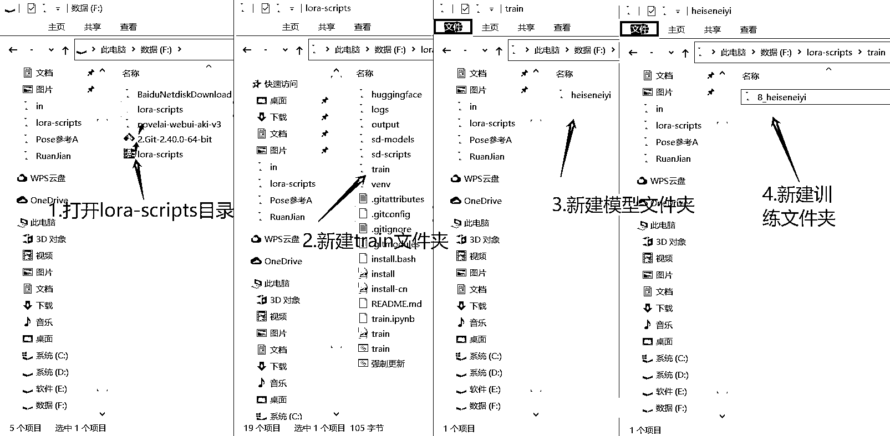4.2 把【out】文件夹中预处理的图片和 tags 说明文本拷贝至训练文件夹：4.3 打开网盘保存 BooruDatasetTagManager 软件-下载至本地盘符中网盘链接：https://pan.baidu.com/s/1LAmiYYjj8JXALvu6s5VFgg?pwd=tcvw提取码：tcvw 4.4 运行程序：4.5 点击【File】选择你第一项 load-选择训练文件夹【8_heiseneiyi】点击选择文件夹：4.6 点击右侧的＋号，输入 lora 模型的触发器（尽量用罕见的词，拼音是最好的选择），选择放在前面 Top，然后点击 OK 生成：4.7 在右侧的预览框中删除所有关于内衣的关键词（因为我们训练的是一个内衣的 LORA 模型）按住 ctrl 键不放选择全部内衣相关的关键词（刚刚我们添加的触发词除外）点击右侧的❌键删除：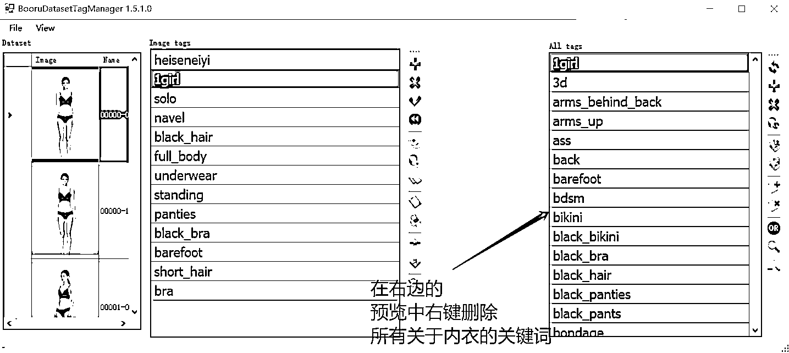4.8 点击【File】选择第二项 Save 保存，打开训练文件夹的 tags 说明文本就能看到调整后的标签了：第五步：训练参数设置5.1 把常用的大模型复制到【lora-scripts\sd-models】目录下5.2 右键点击【train.ps1】文件用记事本打开5.3 把大模型的完整命名复制到【。/sd-models/】后面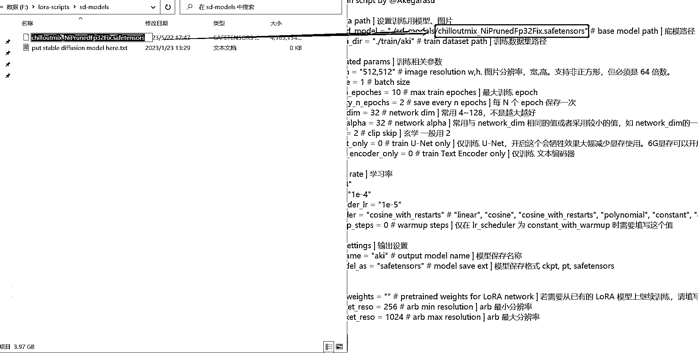5.4 把模型文化夹的命名复制到【。/train/】后面5.5 设置图片分辨率、最大训练量、还有模型名字，设置完了点击左上角的文件-保存💡batch size（同时训练量）：显存在 12G 以上可以选择调成 2，正常我们默认为 1 就可以最大训练 epoch 数值：10～20 之间network dim 和 network alpha 需要保持一致：可以输入 32 或者 64，一般我们使用默认 32 数值就可以了模型保存名称 output_name ：需要给输入的模型命名比如 heiseneiyi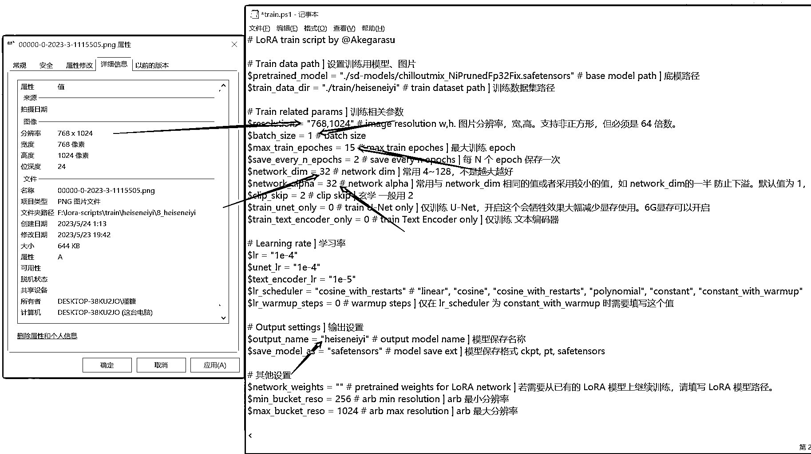5.6 右键点击【train.ps1】文件，选择使用 PowerShell 运行，就会自动开始训练 lora 模型，大概训练时长为 15 分钟～4 小时，根据显卡性能决定：5.7 训练完成后模型保存在【output】文件夹中，我们选用第一个就好：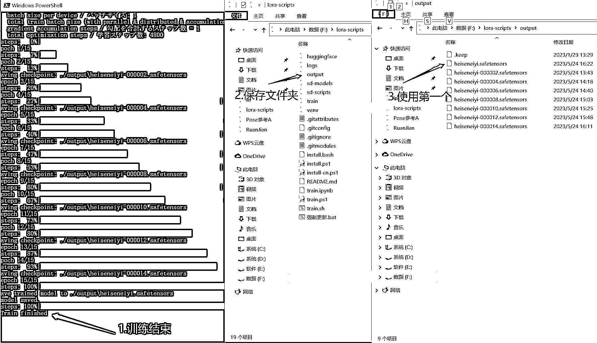第六步：训练模型使用6.1 打开 WEB UI 目录进入 lora 文件夹目录【novelai-webui-aki-v3\extensions\sd-webui-additional-networks\models\lora】把训练好的 lora 模型拷贝进去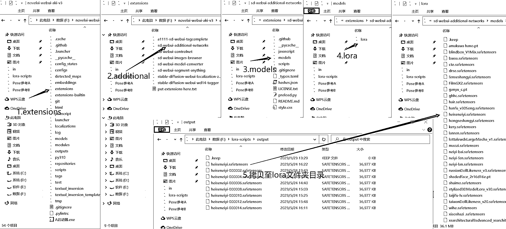6.2 选择大模型，然后在文生图中输入正向关键词和反向关键词，设置参数💡正向关键词：heiseneiyi，1girl， solo， skirt， realistic， long hair， brown hair， jewelry， bracelet， pink shirt， breasts， ring， indoors，black_ Bra， black_Underpants，High heels反向关键词：easynegative， cross-eyed， ng_deepnegative_v1_75t， badhandv4， By bad artist -neg， disfigured， bad art， deformed， extra limbs， weird colors， blurry， duplicate， morbid， mutilated， extra fingers， mutated hands， poorly drawn hands， poorly drawn face， mutation， ugly， bad anatomy， bad proportions， cloned face， gross proportions， malformed limbs， missing arms， missing legs， extra arms， extra legs， fused fingers， too many fingers， long neck， tiling， poorly drawn feet， mutated， cross-eye， loli， chibi， bad eyes采样迭代步数：30采样方法：DPM++ 2M Karras高清修复：启用放大算法：R-ESRGAN 4x+  重绘幅度：0.7放大倍率：2图片尺寸：与 ControlNet 上传的图片尺寸一致或倍数提示词相关性：7随机种子：-16.3 设置 lora 参数勾选启用-选择训练好的 lora 模型（heiseneiyi）-权重：0.7～16.4 ControlNet 参数设置选择一张想要生成的姿势图片上传至 ControlNet，启用低显存优化，Pixel Perfect  Allow Preview  都勾选上。预处理器：depth_leres++预处理模型：control_v11p_sd15_depthControl Weight 权重：0.8其他默认：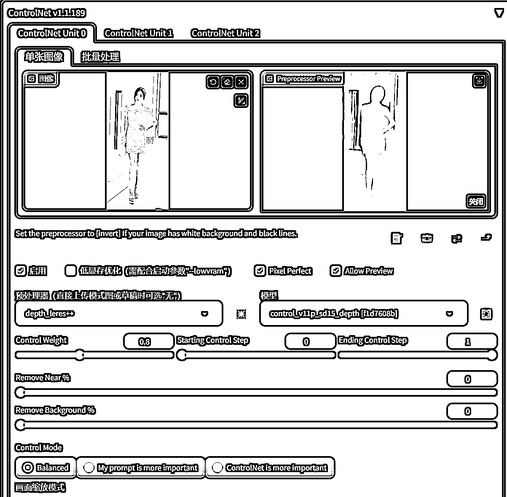6.5 点击生成生成的图片不满意没关系，因为lora训练的人物数据不足会导致脸部奇奇怪怪，按照【一、图文图，保留衣服换人换背景】方式再二次修改即可：小结lora 训练模型的方式适用一切物品，但是精度不够，目前我测试的结果是，对于简单内衣、T 恤、瑜伽裤、背心等这些简单版型、简单材质的服装还原度会相对高一些。对于 AI 模特换装的分享就这么多了，大家在执行的过程中有那些问题可以找我一块探讨，我们共同把这个类目放大，变成可应用的商业化。如果你什么有商家资源或者摄影师资源，你可以把这个事跟他们说一些，估计他们的兴趣意向会挺高，一组图先收个 99～199 元不过分的，一天做接一组图都能有 3K～6K 的额外收入不香吗？奥里给！！搞起来吧家人们！  

评论区： 

北辰 : 非常详细，感谢分享！ 自律更自由 : 老师可以点评一下我的作品吗？ 千穹 : 很好 瑾糖 : 太好看了叭～好美 自律更自由 : 有没有简单点的，这换衣服，太复杂了 瑾糖 : 蘑菇街，美图工作室，都可以实现这个功能，但是自由度没这么高