# SD 工具的实操方法和案例应用分享

> 原文：[`www.yuque.com/for_lazy/thfiu8/op6l0gxboa9mmt49`](https://www.yuque.com/for_lazy/thfiu8/op6l0gxboa9mmt49)

## (69 赞)SD 工具的实操方法和案例应用分享 

作者： 大刘 

日期：2023-06-28 

5 月 30 日《SD 工具的实操方法和案例应用分享》@大刘一、自我介绍大家好呀，我是大刘～ 很荣幸收到子安老师的邀请，与大家一起分享～今天主要给大家分享的是 SD 的应用案例和具体实操。因为我主业是程序员一枚，相对营销来说，更偏向技术研究一点，所以今天给大家一起分享的是，如果在风向标或者其他地方看到有用 AI 图片做的变现案例很不错，我想出类似图片的去模仿，可以从哪些方面入手？二、绘图工具的选择相信经过前几天的航行，有伙伴已经有所进展，甚至可能都有些许收获了。但是可能会有部分新手伙伴会觉得出图随机性太大了，有时候想要一张合适的图，需要一直抽卡，花费大量的时间。也有可能有伙伴觉得 MJ 的账号问题不好解决，想用其他网页小程序或者自己安装 SD 到自己电脑上。也有刚学会出图的伙伴会想，我需要出什么样的图片才能拿去变现呢？以上是我自己之前所遇到过的一部分问题。所以更加希望咱们可以把遇到的问题提出来，大家一起讨论解决。首先提一个点，我们手上的东西都是我们的工具，有时候不要被工具限制住，觉得 AI 绘图就只能用 AI 软件来实现，并不是，AI 也是一个工具，可以帮我们加速实现我们预想的工具，有时候 AI+人工反而会更快一些。所以在工具的选择上，哪种方式你更熟悉，能更好更快的让你实现目标，我们就优先使用哪个。现在 AI 绘图的软件层出不穷，对于我自己来说，因为一直使用的是 SD，心思也主要是放在 SD 上面，这里我就以 Stable diffusion webUI 为例，给大家演示如何用 SD 去实现需求。三、SD 的简介过多的话语不赘述，怎么安装，也可以参考咱们的航海手册安装部分。有遇到问题的群里发消息即可～现在大家都喊的 SD 全名叫 Stable diffusion，简称稳定扩散模型，这是一个模型。比较出圈的是基于这个模型开发出的方便操作的 UI 页面，叫 Stable diffusion webUI。而我们常听到的 SD 大概率是说的 Stable diffusion webUI。好，到此为止，咱不深挖。就是这个页面：SD 的优势是什么呢？开源、免费，可以在自己电脑或者云服务器安装使用。因为开源，所以有特别丰富的插件，其中最出圈的就是 ControlNet 插件，它可以让我们把图片经过不同的预处理，加上对应的模型和描述词，就能大概率达到我们想要的效果。无图无真相，下面就以用户的需求出发，跟大家一起看一下是怎么通过 SD 满足用户的需求。四、实际案例操作4.1 AI 图片+实物包装线下很多服装，产品的外包装是需要图片的。去年，天辉老师有和我提到，可以选择一张自己喜欢的画，他可以帮我放到帆布袋上面，这也是我第一次接触到 AI 绘画实际运用到现实的案例。我当时选的这张图：描述词：A beautiful painting of a building full of sakura, bridge, clouds, sunset, fairy tale, distant town, light effect, dream, Josan Gonzalez, artstation,8k做成的效果图：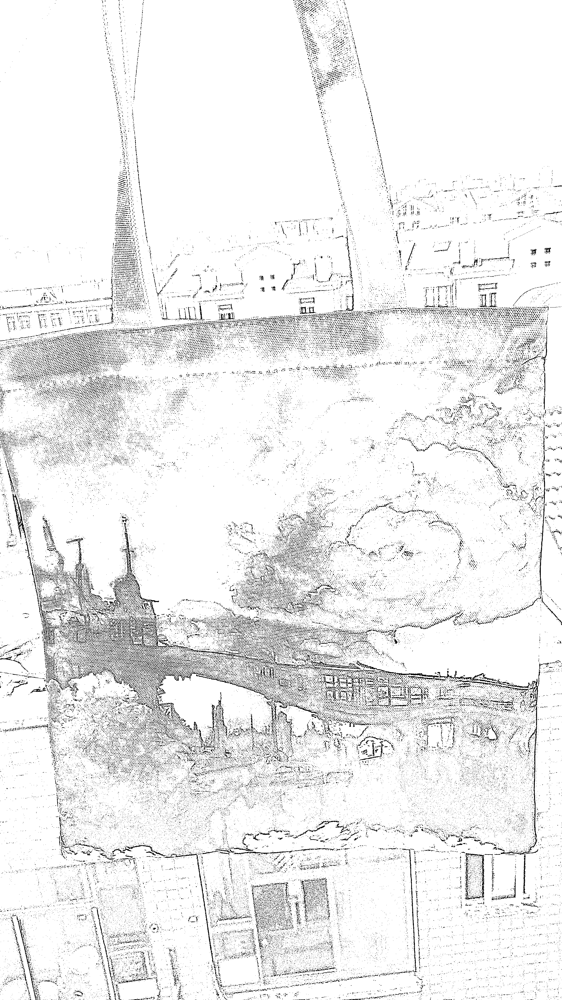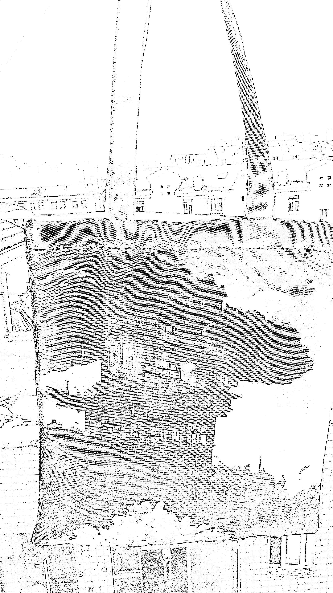这个过程没有任何需要复杂的操作，就单纯的在网页上写描述词—>生成图片—>把图片发给商家制作，等着收货就好了。插一句，我媳妇出门买点东西经常会带上这个袋子，她觉得很好看～这种随机性比较大的，但是仅仅需要你会使用 AI 绘图软件的基础操作而已～ 除了有这个帆布袋，是不是还有 T 恤、商品外包装、宣传广告、鼠标垫，等等也可以用上呢？这里就暂时不展开了哈，原理差不多。4.2 头像、壁纸的实操接下来给大家演示另一个，火爆小红书抖音的头像制作。照片转二次元？二次元转照片？怎么操作的，几分钟就能实现。下文所用工具皆为「Stable diffusion webUI」，具体使用细节大家可以学习本期航海手册的章节「五、学会用 Stable Diffusion 完成 AI 绘画」：https://i.shengcaiyoushu.com/docx/S38TdhmTsosK6Uxlo9tcYec9nxh常用方法：图生图+ControlNet4.2.1 图生图+ControlNet（线稿）这里用图生图+controlNet 线稿来举例~如果我们有一张二次元的图片，想换成三次元，可以这样做：首先，先把图片放入图生图的位置，设置图片尺寸，切换大模型（需要什么风格就换哪个大模型），写描述词，ControlNet 预处理器选择 lineart_coarse（其他几个 lineart 也可以尝试），处理模型选择 canny。这是原图：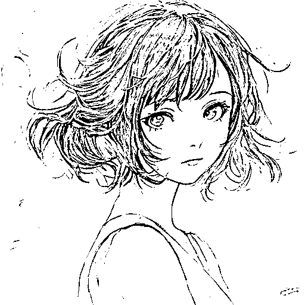这是效果图：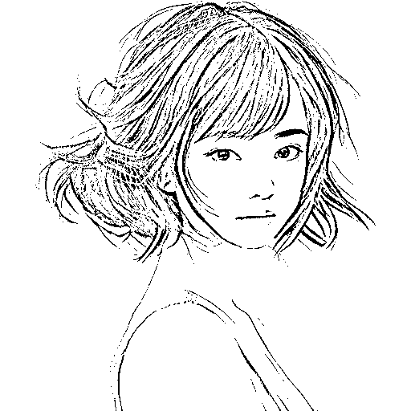上述步骤大家可以结合以下参数图再理解一下：这里大模型用的真人的，所以出来的图片就会是真人了~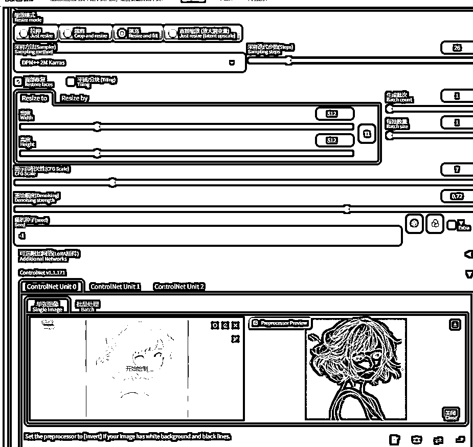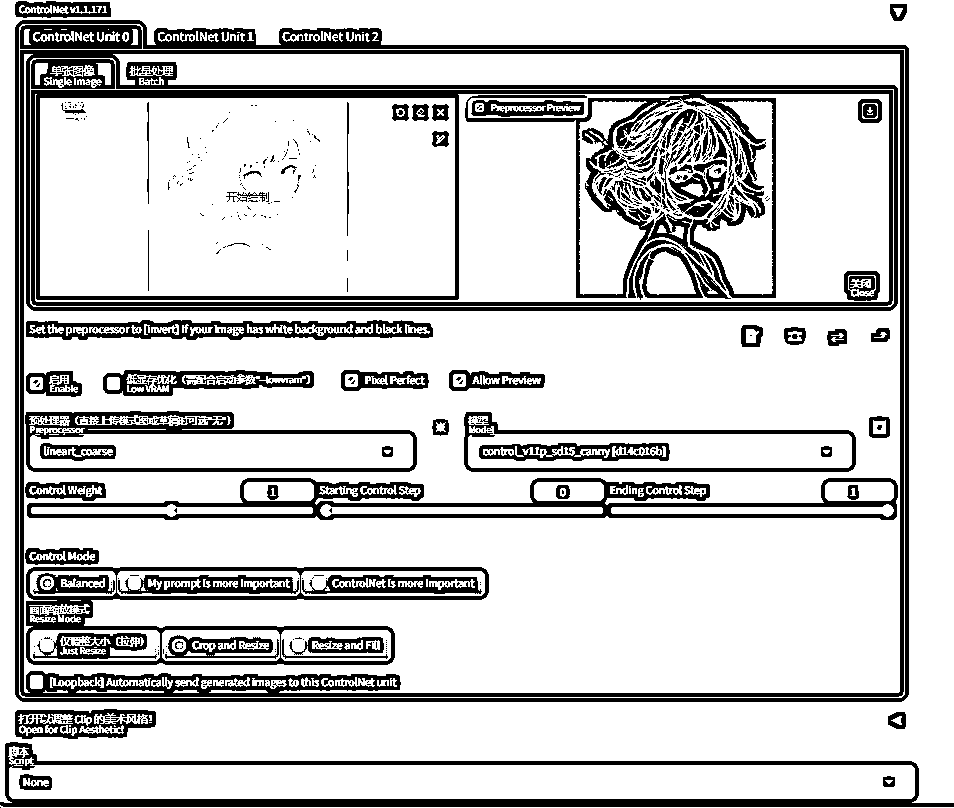细节部分补充一下：这是动漫转真人才需要勾选面部修复，真人转动漫就别勾选了，脸有可能会崩；重绘幅度两种方式，想一次转换，重绘幅度设置 0.6-0.9，有概率与参考图差距过大，需要多出几次图，然后选合适的；想要更加精细可采用小步多次重绘，就是重绘幅度每次设置 0.2，生成一张图片后，其他都不变，把生成的图片放入图生图的参考位置，继续 0.2，如此多次重复，也可以达到想要的效果，3 次元转 2次元 也是如此。再以 17 号看到圈友在风向标发布的一条信息，我们尝试复现，原理是一样的：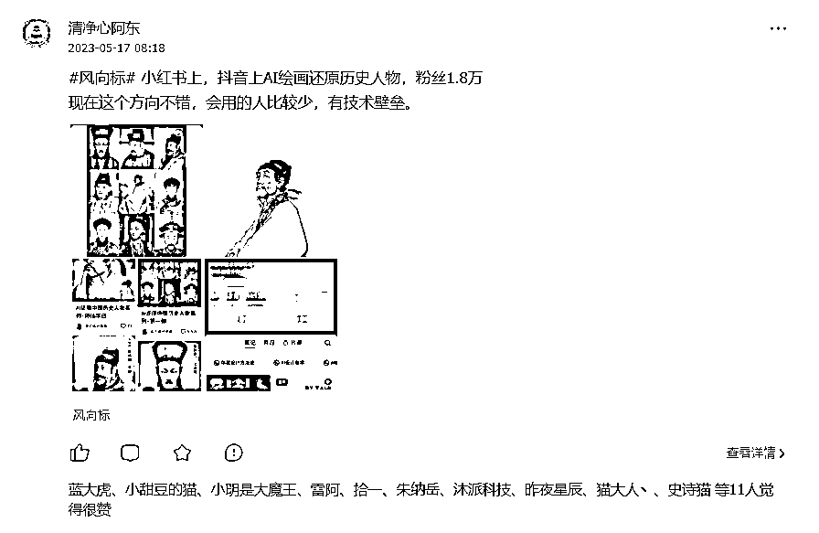网上随机找了张韩愈的照片，用上面方式还原了下，大部分还是比较像的，类似这种可以不用完全一样，流量会更好一点：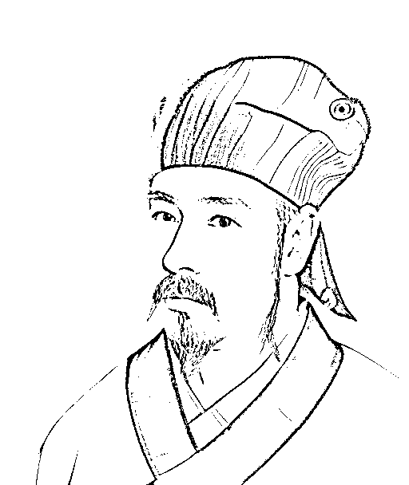上述还原韩愈的描述词与操作如下：正 tag：（Best quality， masterpiece），ultra high res， （photorealistic）， raw photo，1 old man， solo， male focus， facial hair， Red phoenix eye， mustache， beard， hanfu，（raised eyebrows），  hat， simple background， black hair， black eyes， upper body，  负 tag：lineart， motion lines， 底模：chilloutmix_NiPrunedFp32Fix重绘幅度：0.63ControlNet 预处理器选择的是：lineart_realistic  模型 canny4.3 四维彩超以下两张分别为原图和案例图：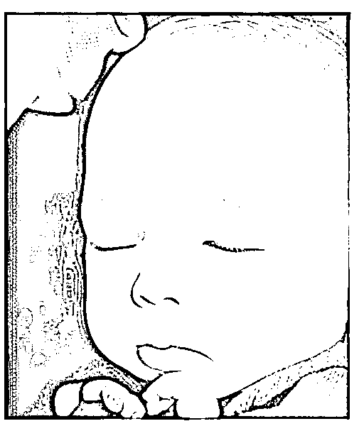上述图片生成的描述词与操作如下：图生图，无插件底模：braBeautifulRealistic_v40懒人正 tag：（Best quality， masterpiece），ultra high res， （photorealistic）， raw photo，a newborn baby who has just been born is sleeping peacefully。 The photo is realistic and captured through photography with a simple background. There are numerous authentic details in the photo, including the pores on the baby's skin, realistic hair, and the use of natural lighting or artificial lighting through a daylight-simulating bulb, highlighting the baby's features. The photo has no black borders, providing a full view of the baby and its surroundings.重绘幅度：0.6Steps: 31采样器： DPM++ 2M Karras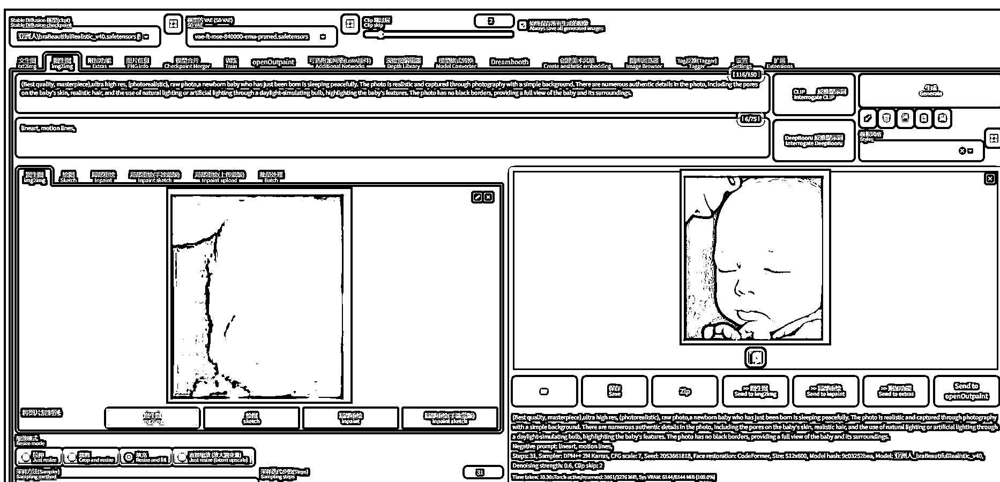通过上述几个案例，大家有没有发现，其实这些都是图生图+ControlNet，主要就是模型的选择和些许参数的微调。总结下来就是想把一个图片换成另一种风格，SD 的图生图可以帮我们完成。MJ 也是可以的，这里不赘述。所以从技术上来说，实现一个功能并不难，大家最主要的还是优先考虑怎么变现，我们需要的技术只是用来出图，知道大概原理就行。不用深究里面的门道，等真的有需要的时候再花时间研究也不迟。五、ControlNet 更新因为 SD 的一大核心就是这个插件，所以单独拎出来讲，建议大家更新，如果你用的秋叶的启动器，点击这里更新：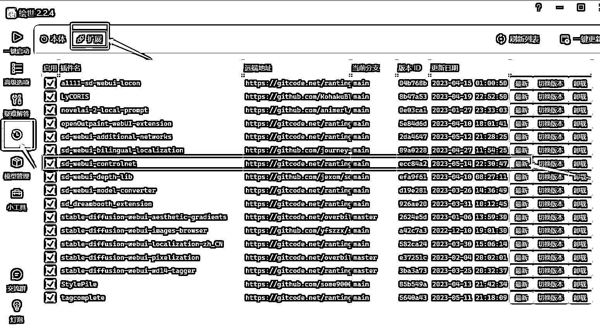如果你用的星空的包或者其他人的安装包，可以进入 ControlNet 文件夹下面，空白地方右击—>选择 Git Bash Here—>回车—>输入 git pull  即可更新。这个额外添加进来是因为最近它又又又更新了，不光是模型，还有预处理器，在航海手册上有模型的解释，大家可以查看章节「5.7 模型介绍、使用与炼制 」：https://i.shengcaiyoushu.com/docx/S38TdhmTsosK6Uxlo9tcYec9nxh这里写一下预处理器的吧：预处理器，可以简单理解为，这个插件把你上传的参考图通过不同的预处理器解析成不同的模板，然后在图片生成的过程中会参考这个模板来出图。如果你用的秋叶的安装包，可以把这个文件复制到你 extensions\stable-diffusion-webui-localization-zh_CN\localizations 文件夹下面，可以帮你把预处理器做中文翻译（官网没更新，我手动加进去的翻译，后续更新不会有影响）：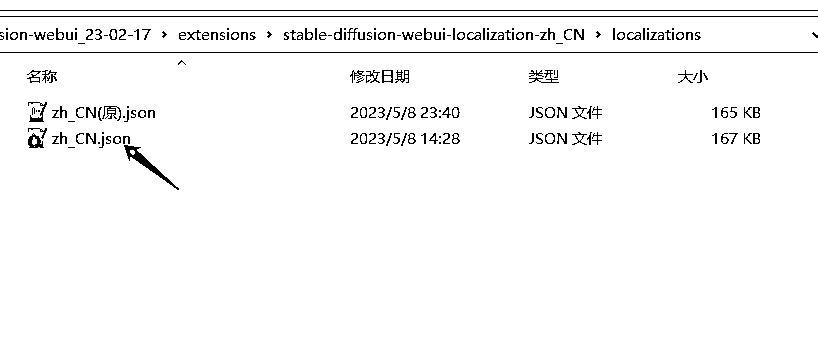使用后效果是这样的：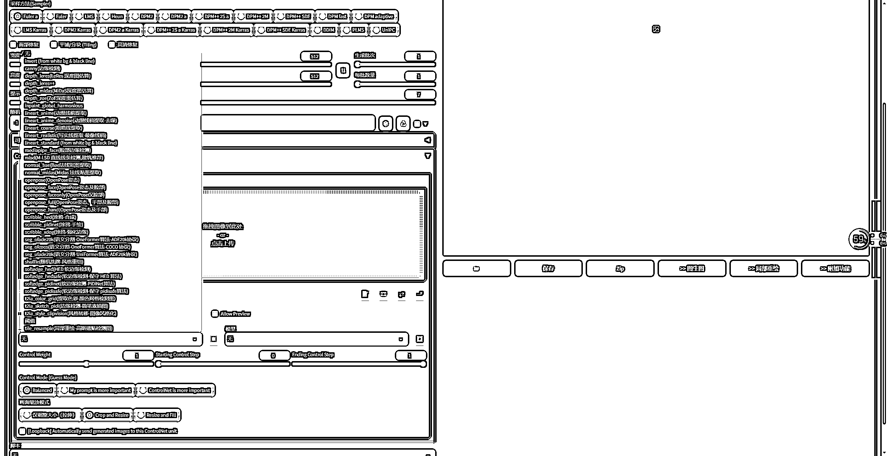预处理器的具体选择，看这个中文翻译就可以，或者参考文档：https://github.com/lllyasviel/ControlNet-v1-1-nightly/blob/main/github_docs/annotator.md常用的包括线稿提取、直线线条、openpose 姿态，最新的 tile 作者还未完成：zh_CN.json六、模仿爆款图片风格6.1 模型的选择好，到这里我们基本能简单明白出图，那如果我看到有比较好的风格图片，想模仿，应该怎么模仿呢？答案就是找到对应的模型。比如小红书上半个月爆火的治愈系图片：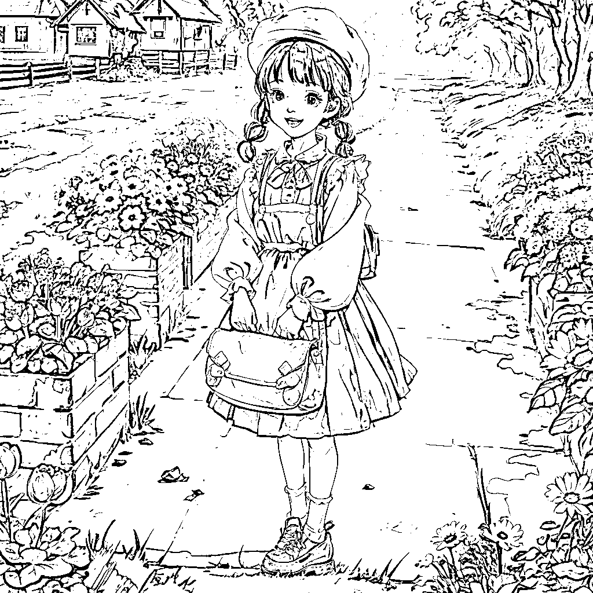这个图片底模用的是 revAnimated_v11，两个 lora 模型，墨心+吉卜力模型我们常用的就是大模型和 lora 模型，大模型是决定你图片的整体画风，lora 模型是在大模型的基础上，特别针对某个人物或者风格训练的模型。一位经常使用 SD 的玩家，通常会有一系列的模型，根据不同的使用场景来切换。这边推荐几个个人觉得用的还不错的。3D 现实大模型：ChilloutMix: https://civitai.com/models/6424?modelVersionId=11745Realistic Vision V2.0: https://civitai.com/models/4201?modelVersionId=29460majicMIX realistic: https://civitai.com/models/43331?modelVersionId=48289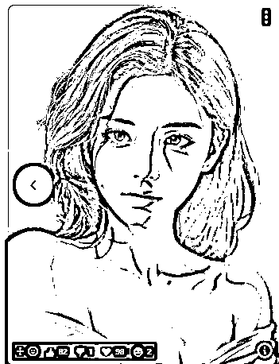2D: Anything: https://civitai.com/models/9409?modelVersionId=30163Counterfeit: https://civitai.com/models/4468?modelVersionId=57618ReV Animated: https://civitai.com/models/7371?modelVersionId=46846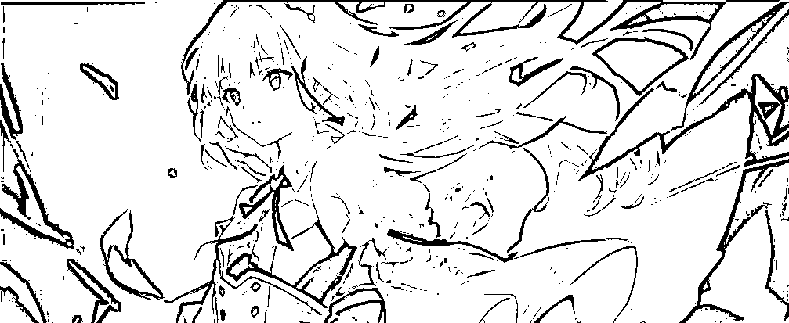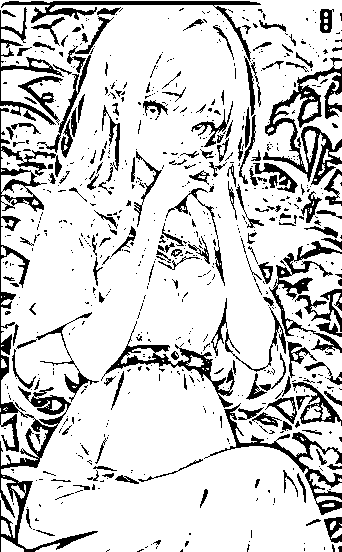lora: 写到这儿我纠结了下，模型太多了。这东西得看需求，什么风格用什么模型就好了，还是推几个吧。blindbox/大概是盲盒：https://civitai.com/models/25995/blindboxStudio Ghibli Style LoRA 吉卜力：https://civitai.com/models/6526/studio-ghibli-style-lora墨心 MoXin：https://civitai.com/models/12597/moxinhanfu 汉服：https://civitai.com/models/15365/hanfu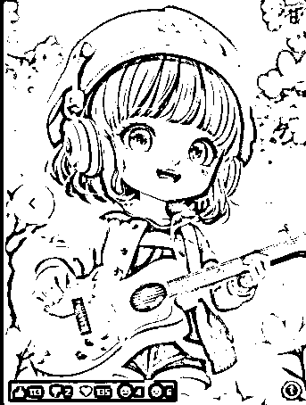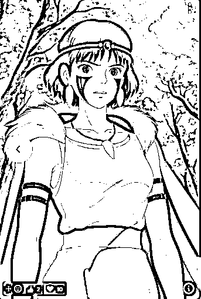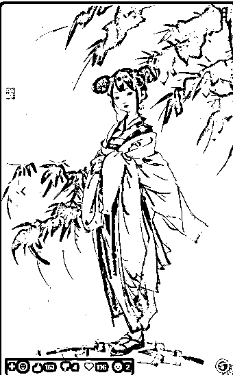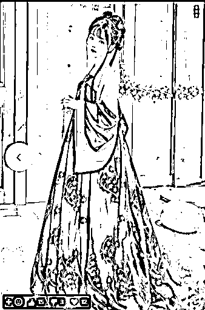6.2 模型的切换底模的切换点左上角就可以选择，右边这个圈圈是刷新，当你新下载了一个模型放进去，不用重启，刷新这里就行。lora 的使用：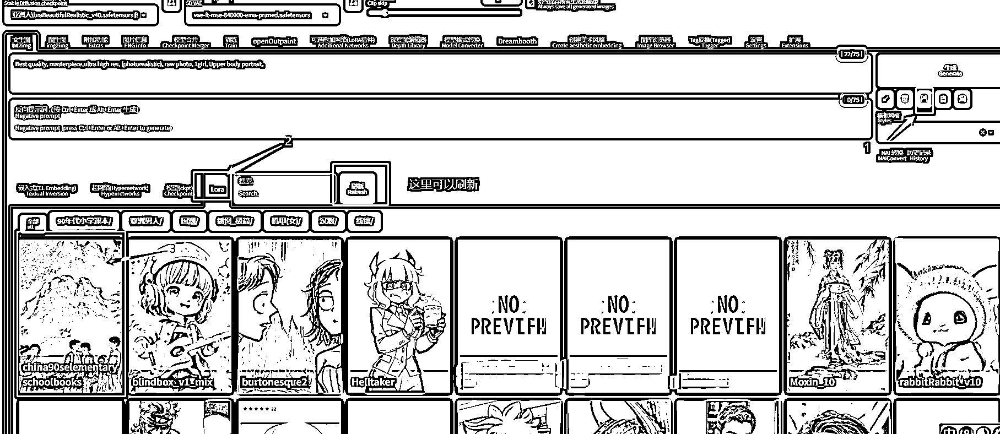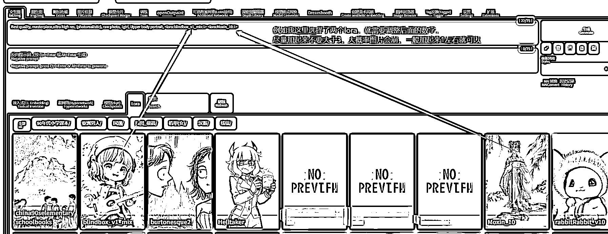七、抠图考虑到会有伙伴是需要把图片放到物品上，会有抠图的需求，这里加一个抠图的使用。如果不会 PS，觉得学起来需要一定的时间和精力，那就用其他的抠图软件，美图秀秀、佐糖网页版、可画、即时设计、master go 等等，用什么不重要，重要的是找你熟悉的能解决问题就行。这里拿佐糖网页版举例吧，网页版免费（第一次需要登录），简单的抠图够用：https://picwish.cn/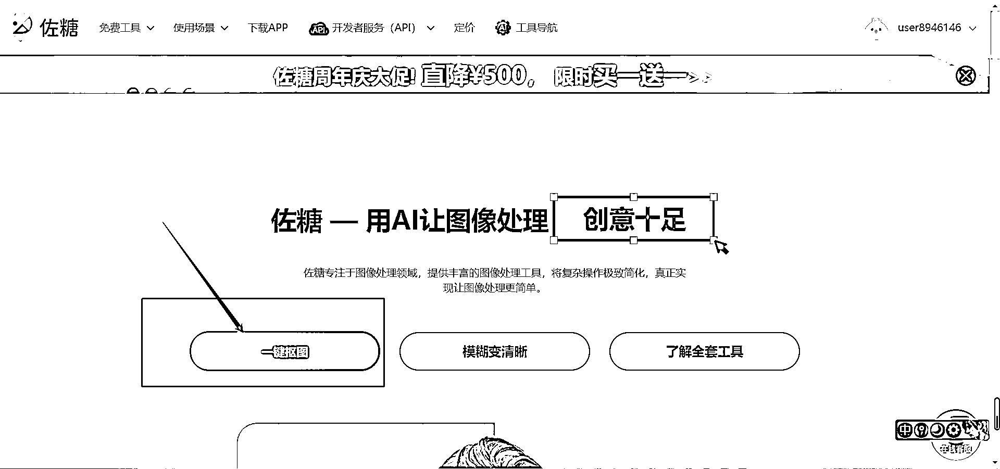在这个页面，图片放上去：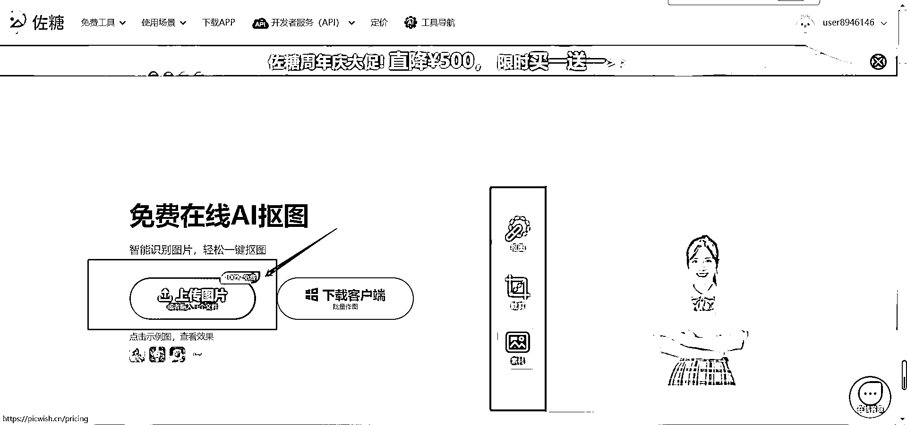会自动跳转到这个页面，下载图片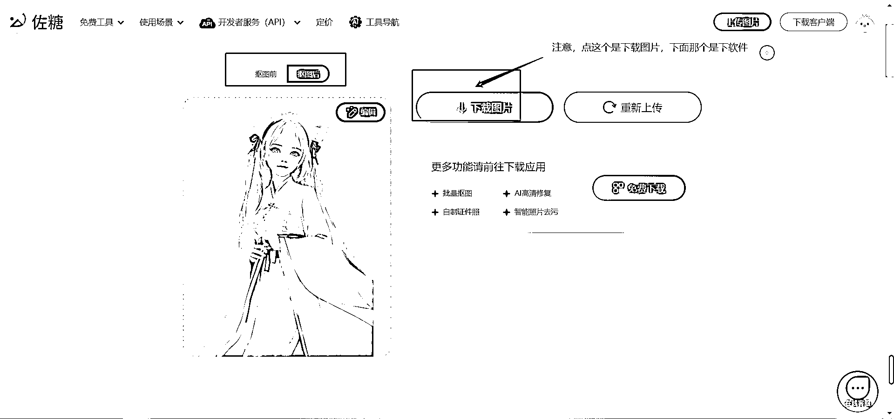注意，这个页面的立即下载依旧不用管，下面进度条到 100%以后会弹出这个文件的保存框，自己选地方保存就行了：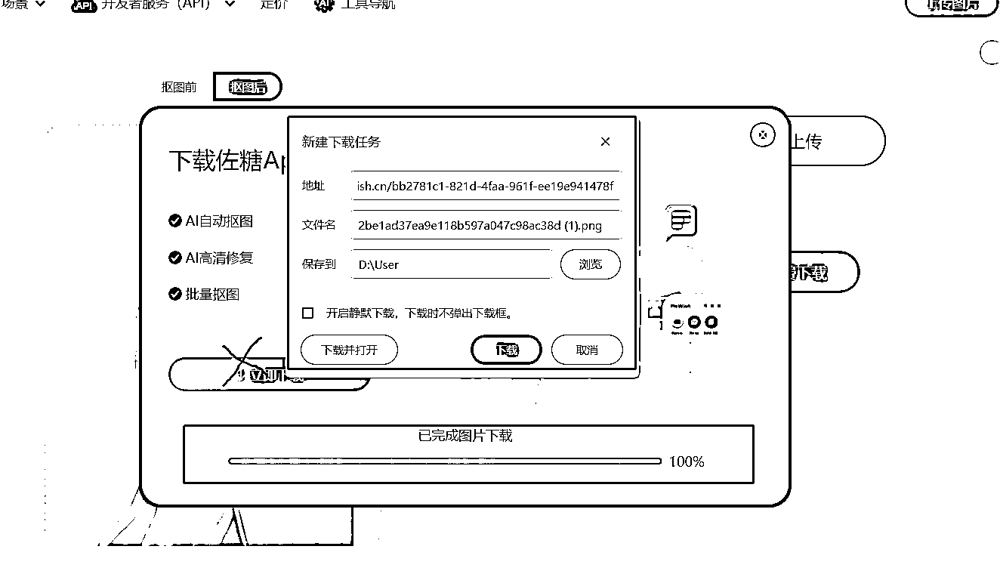实际上到这儿差不多就结束了，但是如果是你需要自己发布到平台引流，那建议出个成品图片，就是把图片和产品结合的图片也一起放上去。可以给用户有更加直观的感受。比如把这个图片加到包装袋上面，杯子上面等等，可以自由发挥～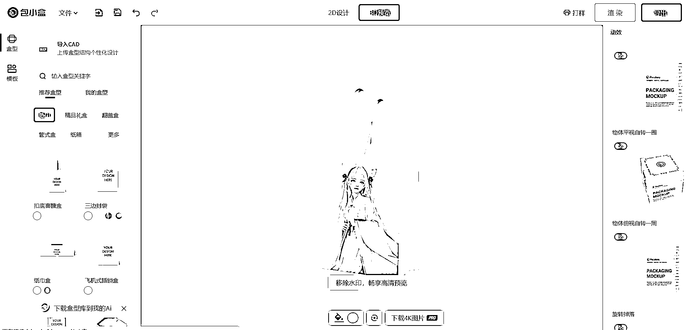这个网址具体实操可以看航海手册章节 7.2 刘楚宾教练写的内容：，这里不赘述哈。为了方便大家吸收，以上就是本次与大家分享的内容啦，还是那句话，工具用什么不重要，只要你用着顺手，把更多的精力放在变现上就好～ 技术流大佬随意～感谢大家的时间～  

评论区： 

飞向云端 : 给教练点赞👍 … : 哇塞 很及时，感谢大佬 大刘 : 多谢~ 大刘 : 能用上就是最好的啦~ … : 哈哈哈，必须用上它！！ 大刘 : [嘿哈][嘿哈][嘿哈] Yoga : 武汉圈友好，线下面基过 大刘 : 阿里大佬[呲牙][呲牙][呲牙]