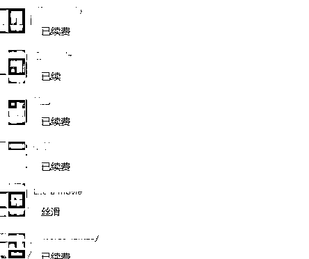

# 私域里促成交易的心理效应，你知道多少？

> 原文：[`www.yuque.com/for_lazy/thfiu8/xmcbxxye9dmo4ail`](https://www.yuque.com/for_lazy/thfiu8/xmcbxxye9dmo4ail)

## (20 赞)私域里促成交易的心理效应，你知道多少？ 

作者： 奋斗的木鱼 

日期：2023-07-28 

私域现在越发成为各大企业的利器，不管有没有专业团队的运营，大伙都热衷于不断收集流量，打造自己的私域流量池。 

不过大伙有没有了解过，私域的某些交易环节里，为什么能促成人们交易呢？ 

最近在研究私域，刚好看到某些私域内消费现象，触发了一些思考，因此今天想从私域的触发的非理性消费环节入手，写写私域内某些环节内心理效应是如何影响人们决策，从而产生交易的。 

#### 一、私域内的从众 

 

大伙看看以上这张图，是否似曾相识？ 

有没有发现，在一个个群里，在一个个朋友圈内，本来自己犹豫不决的观察时，群内、圈内不断显现“购买、已下单”或者“已续费”等大批的购买信息时，在群内的你，自然的跟随着这股波澜，慢慢汇合到付费大军里？ 

如果你有这种现在的出现，你就大概率中了从众的毒。 

从众现象原指相符行为的一种。群体成员受群体心理气氛的影响，企求与群体中多数人在态度和行为上相一致的现象。 

从众现象大都是在群体压力作用下产生的。 

个体的态度和行为与其他成员一致时，就有一种安全感，否则，个体就感到一种心理紧张，促使他趋向一致。群体压力与权威命令不同，它是大多数人的意向，使的个体在心理上往往难以违抗。 

或许你会疑问，我并没有要和其他成员保持一致，那为什么我还会“从众”？ 

你可能没有想要保持一致，但从众的环节加入了“稀缺”等元素，那你的坚持也有可能被快速瓦解，成为从众的一员。 

还记得李佳琦的“1、2、3，上链接吗“？ 

在稀缺的刺激下，在庞大用户的疯狂购买下，我们是否自然而然的也被吸引到了大众的一员？ 

从众是一个神奇的心理效应，让本来在观望的我们，降低了内心的防备，慢慢进入付款大军。 

#### 二、私域的形成的环境，天生利于销售。 

（1）提供利于凸显商品的评估环境 

我们来看看公域与私域两个环境及内在情况的对比： 

 

从上图我们可以看出，在购买环境里，公域是开发的，私域封闭的。 

在公域里，我们有大量的选择，而这些选择提供我们更多的主动权，因此我们在公域里是作为主人的存在。 

在私域里，虽然我们也是作为主人的存在，但有限的产品锁死了我们的选择权，导致我们要么放弃，要么选择。 

我们在公域购买商品，大量的精力会放在不同的对比情况上，最终决定我们购买的，可能是某个产品的某些组合功能更优于其它产品。 

在私域，这类对比就很少，即使有，也仅限于少数的或者只是在内心将记忆中的产品作为对比。但人的记忆是有限的，和记忆内产品做对比不会超过 7 个，最少的可能只有 1 个，在整个过程，私域内的产品优势就体现的很明显。 

有一个有趣的对比试验，也是变相的证明了少量的对比是更易于体现商品优势。 

在一个在实验中，奚恺元教授做了一个有趣的测试，为受试者提供了两杯冰淇淋： 

第一杯冰淇淋有 7 盎司，装在容积是 5 盎司的杯子里，溢出了许多。 

第二杯冰淇淋有 8 盎司，但装在容积是 10 盎司的杯子里，看上去还没装满。 

看看受试者愿意为哪一份冰淇淋支付更多的钱呢？ 

奚恺元的实验结果表明，如果不把这两杯冰淇淋放在一起比较，人们竟然愿意为分量少的第一杯冰淇淋付更多的钱。人们平均愿意花 2.26 美元买 7 盎司那杯冰淇淋，却平均只愿意用 1.66 美元买 8 盎司那杯冰淇淋。 

根据西蒙提出的有限理性准则，人们在作比较评价时，并没有去计算一个商品的真正价值，而是寻找某种比较容易的线索进行判断，商品的外包装就是这样的线索。在冰淇淋实验中，人们用杯子作为参照，根据冰淇淋是否装满一个杯子来决定支付多少钱。 

私域的有限对比，先天的为产品提供了优势，让产品更易于体现或拉高它的价值。 

在触发非理性消费一书中，也提供类似的定律：相亲定律的应用 

中国在经济快速发展和城市化进程中，产生了一个社会问题：大龄未婚青年越来越多。婚姻成为大龄未婚青年的烦恼，许多人都开始通过相亲的传统方式寻找自己的另一半。为了避免尴尬，有些女孩子在相亲时，会带上自己的女伴。 

那么，女孩子相亲时，是否应该带上一个女伴呢？ 

人们在进行评估选择时，可以将评估模式分为两种情况，一种是无比较对象的单独评估（SeparateEvaluation），另一种是有比较对象的联合评估（JointEvaluation）。 

后面解答把女伴转变为了商品（为了节省大伙时间，省去一部分内容，可移步书籍了解） 

第一，如果 A＞B，即 A 产品优秀，竞争产品 B 一般。这时候应该引导联合评估，利用“对比效应”突出 A 产品的优势。 

第二，如果 A＜B，即 A 产品一般，竞争产品 B 优秀。这时候应该引导单独评估，以免发生“对比效应”。 

第三，如果 A=B＞1，即 A 产品优秀，竞争产品 B 也优秀。这时候应该引导单独评估，以免优势被分散。 

第四，如果 A=B＜1，即 A 产品一般，竞争产品 B 也一般，这时候应该引导联合评估，分散责任，反正大家都是这样。 

在私域里，我们既可以形成单独评估（仅限出现自己的产品），又可以形成联合评估（把别人的产品拉来做对比），整个环境都是利于我们的。 

（2）降低对比困难，促进客户转化 

消费者经常需要在不同产品之间进行价格比较，这种比较十分困难。要确定一个产品或服务的价值非常困难，对它们进行价格比较更加困难，消费者很难比较替代品的优劣，这就是对比困难效应（Diffi cult Comparison Effect）。 

正是因为存在对比困难效应，消费者愿意购买他们信得过的产品，而不愿冒风险去寻找价格更便宜的产品。 

对比困难效应往往与名牌效应联系在一起，名牌产品可以为消费者带来安全感，获得消费者的信任。 

在私域里，因为过往的消费让“我（消费者）”对商家产生里基本的信任（一般是购买商品后或具备一定信任度后再添加客户成为私域流量），那么后续选择商品过程中，私域也能有效的降低对比困难，让客户更易做出选择。 

（3）从【对比产品】阶段直接跨越【进入想象】阶段。 

购买某些产品，我们都会有基于该类产品的想象，在公域里，虽然提供了大量的选择，但也容易造成我们决策瘫痪，即使没有瘫痪，我们的精力也会被损耗的一大部分，那么留给想象使用产品的精力就急速的降低了。 

在私域不同，有限的产品里，产品能基于不同场景的要求不断搭配出美好想象的图画，因为选择有限，信息的刺激更易让客户自然而然的进入到了想象的阶段，产品的价值分为功能价值与情感价值，情感价值的判断往往是从回忆与想象中开启的。 

相较于公域，私域天然具备让客户有更多的感知空间与时间。 

大伙还记的公众号带货吗？ 

大伙在过往有在公众号上购物（没出私域时）吗？ 

我们在公众号购物时，是不是被图文带入想象的时间多于产品对比时间？ 

私域还具备信息链路短、触达更快等优点，也是这些优点造就了私域成为各大企业必备的工具原因，因为有太多的文章有呈现这些点，我就不再一一重复了。 

最后总结： 

私域里促成交易的心理效应有哪些？ 

有四个效应，分别是：从众效应、相亲效应、有限决策理论（西蒙有限决策理论）、对比困难效应。 

你们还发现有其他心理效应在私域里起作用吗？ 

如果有，分享出来，我相信大伙了解的会更多 

评论区： 

Alex : [强][强] 奋斗的木鱼 : 😄 

  