# AI 模特换装及 lora 模型教程分享

> 原文：[`www.yuque.com/for_lazy/thfiu8/okkabrzp7zyv0ydc`](https://www.yuque.com/for_lazy/thfiu8/okkabrzp7zyv0ydc)

<ne-h2 id="a60c3319" data-lake-id="a60c3319"><ne-heading-ext><ne-heading-anchor></ne-heading-anchor><ne-heading-fold></ne-heading-fold></ne-heading-ext><ne-heading-content><ne-text id="ua7bc9ab8">(30 赞)AI 模特换装及 lora 模型教程分享</ne-text></ne-heading-content></ne-h2> <ne-p id="u38d3a8f5" data-lake-id="u38d3a8f5"><ne-text id="ub7b85a03">作者： 瑾糖</ne-text></ne-p> <ne-p id="ub5a00679" data-lake-id="ub5a00679"><ne-text id="u04b62303">日期：2023-07-03</ne-text></ne-p> <ne-p id="u6d9da1b2" data-lake-id="u6d9da1b2"><ne-text id="ueb1cf01e">6 月 1 日《如何训练 AI 模特，实现定向换人换装换背景》@瑾糖</ne-text><ne-text id="u62e9f4d0">6 月 1 日《</ne-text><ne-text id="u338806f2">如何训练</ne-text><ne-text id="uca61697f">AI 模特</ne-text><ne-text id="ub7e3a920">，实现定向换人换装换背景</ne-text><ne-text id="u322a192c">》@瑾糖</ne-text><ne-text id="u63b1793f">哈喽各位航海的小伙伴们大家好！我是瑾糖，一位探索 AIGC 广告从业者，也是一家茶馆的前主理人</ne-text><ne-text id="u0682556d">前两个月</ne-text> <ne-text id="u59f35f10">AI</ne-text> <ne-text id="u92d86527">模特火热的时候，我就开始摸索这个技术，之前我负责过拍摄相关的业务，了解到模特在其中占用的成本有多少。</ne-text><ne-text id="u3658043a">按照广州的模特一手报价，中模在 1K～5K/天，外模 2～5K/时。如果能够利用</ne-text> <ne-text id="u16d566c0">AI</ne-text> <ne-text id="u45075504">技术，为我们降低拍摄中的模特成本那就好了。例如用假模换真模，无货源换脸换背景，中模变外模等，这些可以在我们做项目中得到实际应用。</ne-text><ne-text id="ua7a36bd2">希望我分享这个主题，能够让大家在 AIGC 类目里面多一条变现的思路，那我们开始今天的分享叭～</ne-text><ne-text id="uaa7cb32b">一、图文图，保留衣服换人换背景</ne-text><ne-text id="u98a62cbb">我们现在利用图生图的局部功能来实现把原本的模特和背景，换成另外一个人，可以换成白人或者黑人，也可以用这个方法用把假人模特换成真人模特。</ne-text><ne-text id="u20638f52">这里我们需要使用</ne-text><ne-text id="u33e055e6">Segment Anything</ne-text><ne-text id="u5ddd7643">的一个插件</ne-text><ne-text id="uf5349c4b">，</ne-text><ne-text id="u80d36a7f">来代替</ne-text><ne-text id="ud292f190">PS</ne-text><ne-text id="uac019662">中制作蒙版的方式</ne-text><ne-text id="u2c6311f0">，</ne-text><ne-text id="u85250f46">这样我们就能在</ne-text><ne-text id="u856283ce">SD</ne-text><ne-text id="u939f540b">中完成出图。</ne-text><ne-text id="u0ba564ab">第一步：Segment Anything 插件安装</ne-text><ne-text id="u29e1828e">💡</ne-text><ne-text id="uedbe4be3">guthub 地址：</ne-text><ne-text id="ud927ac48">https://github.com/continue-revolution/sd-webui-segment-anything</ne-text><ne-text id="ub66e1f8e">1.1 打开 WEB</ne-text> <ne-text id="ube041fc2">UI</ne-text> <ne-text id="u1b1499fc">界面-在后面找到扩展-点击从网址安装-在 git 网址中粘贴👆链接-点击安装-底部看到按照路径表示完成</ne-text><ne-card data-card-name="image" data-card-type="inline" id="UjP7n" data-event-boundary="card"><ne-text id="u96200db2">1.2 回到已安装界面-会看到下面</ne-text> <ne-text id="u3e550388">segment-anything</ne-text> <ne-text id="u453223da">插件已安装-点击应用并重启-等待加载-在文生图或者图生图界面就可以看到 S</ne-text><ne-text id="ua7d10367">egment Anything</ne-text> <ne-text id="u4099ba50">插件选项</ne-text><ne-card data-card-name="image" data-card-type="inline" id="VDGGS" data-event-boundary="card"><ne-card data-card-name="image" data-card-type="inline" id="UaReA" data-event-boundary="card"><ne-text id="ubca31f49">1.3 下载对应的模型，点击下方👇蓝色字体直接下载</ne-text><ne-text id="u74a9127b">，</ne-text><ne-text id="ua42c60c4">也可以在网盘中下载</ne-text><ne-text id="ua563eb67">：</ne-text><ne-text id="ufaa1c9d1">10G 以上显存：</ne-text><ne-text id="ud04064c2">vit_h</ne-text> <ne-text id="uf0e7c6fe">；</ne-text><ne-text id="uf2c6a770">6～10G 显存：</ne-text><ne-text id="u28eeb87d">vit_l</ne-text> <ne-text id="u162d2c86">；</ne-text><ne-text id="u4d87fb33">6G 以下显存：</ne-text><ne-text id="u783bde44">vit_b</ne-text><ne-text id="ue0cb60bb">百度网盘链接：</ne-text><ne-text id="u1fbcf1fe">https://pan.baidu.com/s/1Xqo1LA8ho0R2SN5YIEW18A?pwd=wxbj</ne-text><ne-text id="ud2d14060">，</ne-text><ne-text id="u81e77945">提取码：wxbj</ne-text> <ne-text id="ud15d2d96">1.4 把下载的模型放在【盘符\webui 目录\extensions\sd-webui-segment-anything\models\sam】中（</ne-text><ne-text id="u01fa3f7a">一定不要修改模型命名</ne-text><ne-text id="uff9700a1">）</ne-text><ne-card data-card-name="image" data-card-type="inline" id="VGTTm" data-event-boundary="card"><ne-text id="ubddd4048">1.5 回到 WEB</ne-text> <ne-text id="u0170d2b6">UI</ne-text> <ne-text id="u6a2f12c7">界面-点击在 S</ne-text><ne-text id="u198bbc4c">egment Anything</ne-text> <ne-text id="uba1010aa">插件选项后面的小三角-点击模型栏的刷新按钮-点击模型栏中的小三角选择对应模型（如果只有 1 个模型刷新后会自动选择）</ne-text><ne-card data-card-name="image" data-card-type="inline" id="vVJ9F" data-event-boundary="card"><ne-text id="ua98a5d6b">第二步：</ne-text><ne-text id="ueb3c0599">分割蒙版</ne-text><ne-text id="u22b4b9d9">2.1 打开 S</ne-text><ne-text id="u71bed249">egment Anything</ne-text> <ne-text id="u598ec7ac">插件后面的小三角-把需要换装保留的衣服图片上传至图像框-在图像框中用左键点击需要保留的区域，右键点击不需要的区域-点击 Preview Segmentation 生产蒙版</ne-text><ne-text id="ue0044057">💡</ne-text><ne-text id="ub07f8543">使用技巧：</ne-text><ne-text id="u72959168">左键可以生成黑点是我们框选保留部分，右键生成红点是明确不要的部分，</ne-text><ne-text id="uc833701e">如果黑/红点位置错误可以用左键点击该黑/红点进行取消；</ne-text><ne-text id="u35490f75">如果想全部的黑/红点取消点击图像下面的【Remove all point prompts】</ne-text><ne-card data-card-name="image" data-card-type="inline" id="oPcud" data-event-boundary="card">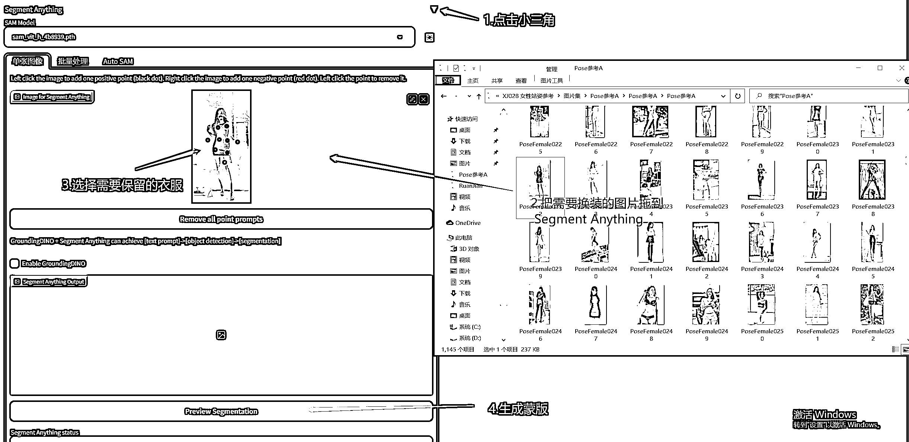<ne-text id="u88015c27">2.2 生成后会出现三张分割图，三张蒙版图，三张蒙版预览图（现在预览的图是因为画面压缩，点击任意图就可以放大预览了）</ne-text><ne-card data-card-name="image" data-card-type="inline" id="OegpV" data-event-boundary="card">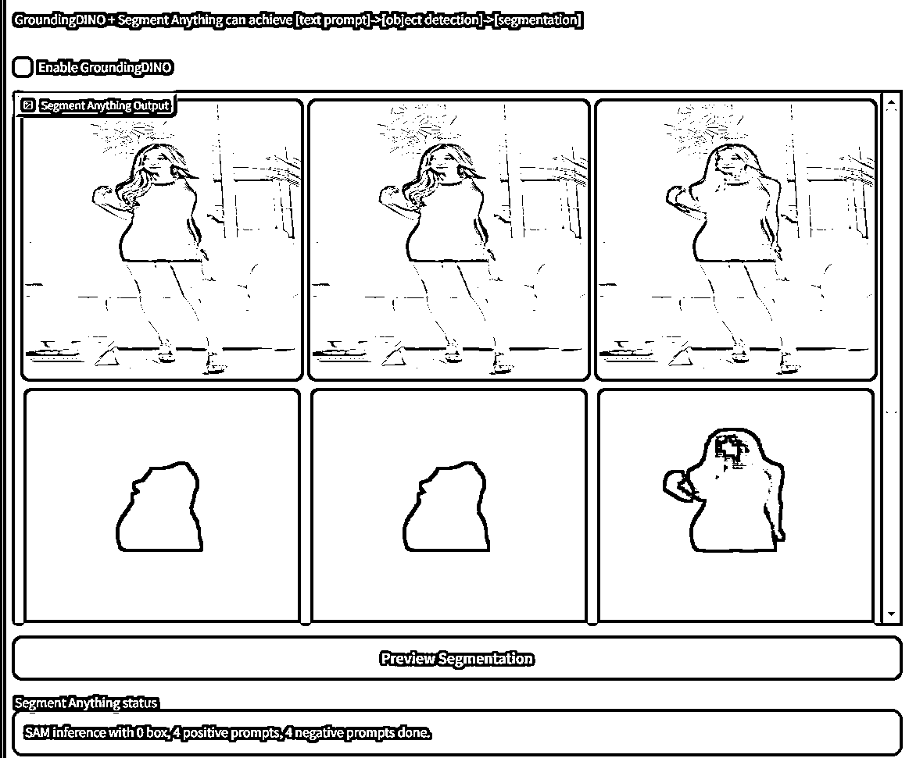<ne-text id="uefe8f813">2.3 放大后的图片位置是对应的，我们可以选择预览</ne-text><ne-card data-card-name="image" data-card-type="inline" id="WrCr7" data-event-boundary="card"><ne-text id="u93abf1c8">2.4 我们选择分割效果比较好的蒙版选择保存-在蒙版的预览界面（👇图 2）点击右键-图片另存为（放在任意文件夹）-然后点击保存</ne-text><ne-card data-card-name="image" data-card-type="inline" id="FWpR9" data-event-boundary="card"><ne-card data-card-name="image" data-card-type="inline" id="DHiqA" data-event-boundary="card"><ne-card data-card-name="image" data-card-type="inline" id="wsNVD" data-event-boundary="card"><ne-text id="u2bcf32af">第三步：</ne-text><ne-text id="ucd854da0">设置出图参数</ne-text><ne-text id="u80802acd">3.1 选择出图的大模型（比如你想生成白种人或者黑种人，这个大模型是否支持）-点击图生图板块-选择局部重绘（上传蒙版）-把需要保留的衣服图片和 2.4 保存的蒙版上传至对应区域</ne-text><ne-card data-card-name="image" data-card-type="inline" id="aVfw5" data-event-boundary="card"><ne-text id="u571ce7bc">3.2 设置生成图片的参数值</ne-text><ne-text id="u1de1cf6b">💡</ne-text><ne-text id="uf95a68c0">缩放模式</ne-text><ne-text id="u2c56b89c">：拉伸</ne-text><ne-text id="u9e142c97">蒙版模式：</ne-text><ne-text id="u99ba5b7d">重绘非蒙版内容（因为黑色部分才是蒙版，但是我们使用 Segment Anything 衣服部分是白色的，如果使用重绘蒙版内容就是改变衣服样式人物和背景不变）</ne-text><ne-text id="u196c20fb">蒙版蒙住的内容</ne-text><ne-text id="u4648f61c">：原图</ne-text><ne-text id="u39e4e393">重绘区域：</ne-text><ne-text id="uc6ba549e">全图  蒙版模式边缘：32（默认就好）</ne-text><ne-text id="u01c927a7">采用迭代步数：</ne-text><ne-text id="u2df81fac">50（如果</ne-text><ne-text id="u76bbacee">显卡</ne-text><ne-text id="uf89cc95d">差些可以调低至 20～30）</ne-text><ne-text id="ua6ef6cbf">采用算法：</ne-text><ne-text id="u6a5460a6">DPM++ 2S a Karras</ne-text><ne-text id="ua5a31222">面部修复：</ne-text><ne-text id="ufd3133af">启用面部修复</ne-text><ne-text id="u9b9f6938">图片尺寸：</ne-text><ne-text id="ua63eb046">与上传的图片一致或倍数（太低会出坏图，太高会爆显存）最好不要高于 2000 低于 768</ne-text><ne-text id="u5891e9b9">提示词相关性：</ne-text><ne-text id="udda7957b">7</ne-text><ne-text id="u8dcbd005">重绘幅度：</ne-text><ne-text id="u756bc5a2">0.75</ne-text><ne-text id="ued07ab37">随机种子：</ne-text><ne-text id="u78fdfc08">-1</ne-text><ne-card data-card-name="image" data-card-type="inline" id="PW8rm" data-event-boundary="card">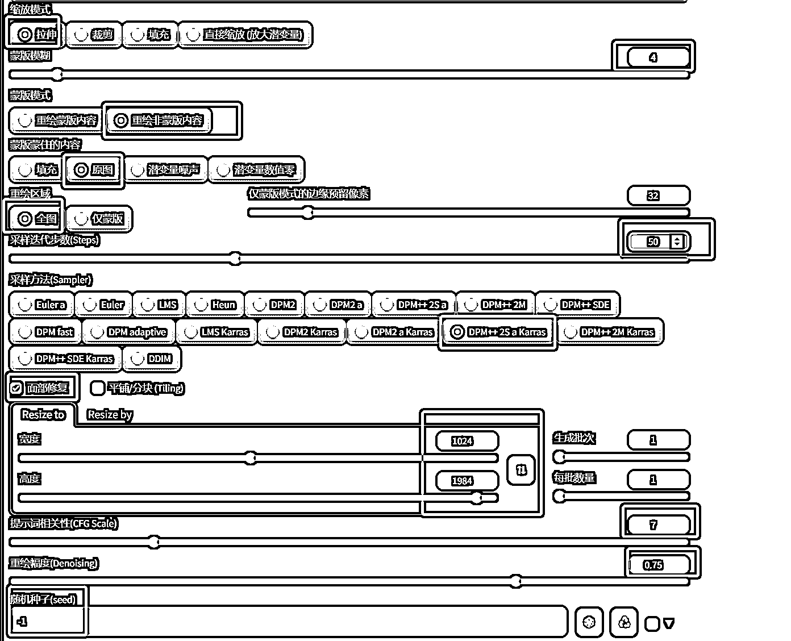<ne-text id="u020300f4">3.3 设置 ControlNet 参数</ne-text><ne-text id="u9a9671ff">💡</ne-text><ne-text id="u687574e1">1）</ne-text><ne-text id="u68d93156">把图片上传至图片区</ne-text><ne-text id="u4ae8e7c1">2）</ne-text><ne-text id="uf7076da0">勾选启用</ne-text><ne-text id="u701330f1">3）勾选、【Pixel Perfect】和【Allow Preview】如果显存比较低（4～6G）可以勾选【低显存优化】</ne-text><ne-text id="u695c34dd">4）预处理器选择 canny 预处理模型也要选择对应的 canny</ne-text><ne-text id="u4453686b">5）</ne-text><ne-text id="ue2aaff59">点击预处理器和预处理模型中间的小爆炸图标就能预览线稿图</ne-text><ne-text id="ubb90d777">6）</ne-text><ne-text id="u5dcffdff">其他参数默认就好</ne-text><ne-card data-card-name="image" data-card-type="inline" id="LSucz" data-event-boundary="card"><ne-text id="ua5a6efd3">第四步：</ne-text><ne-text id="u8c875818">添加关键词</ne-text><ne-text id="ua9c30732">4.1 添加正反向关键词</ne-text><ne-text id="u9a418057">💡</ne-text><ne-text id="u7828e866">正向关键词：1girl， solo， brown hair， long hair， window， jewelry， couch， indoors， standing， sleeveless， full body， looking at viewer， blue eyes， lips， nail polish， High heels， Wood floor， （Negroid :1.9）， UHD</ne-text><ne-text id="u143182d3">💡</ne-text><ne-text id="ubfdafefa">反向关键词：bw， worst quality， low quality， （deformed， distorted， disfigured:1.3）， poorly drawn， bad anatomy， wrong anatomy， extra limb， missing limb， floating limbs， （mutated hands and fingers:1.4）， disconnected limbs， mutation， mutated， ugly， disgusting， blurry， amputation， cloned</ne-text><ne-card data-card-name="image" data-card-type="inline" id="MnuXo" data-event-boundary="card"><ne-text id="ubd8181f8">第五步：AI 模特出图</ne-text><ne-text id="u9da3d4f4">5.1 点击右侧生成按钮等待生成</ne-text><ne-card data-card-name="image" data-card-type="inline" id="SsJAS" data-event-boundary="card">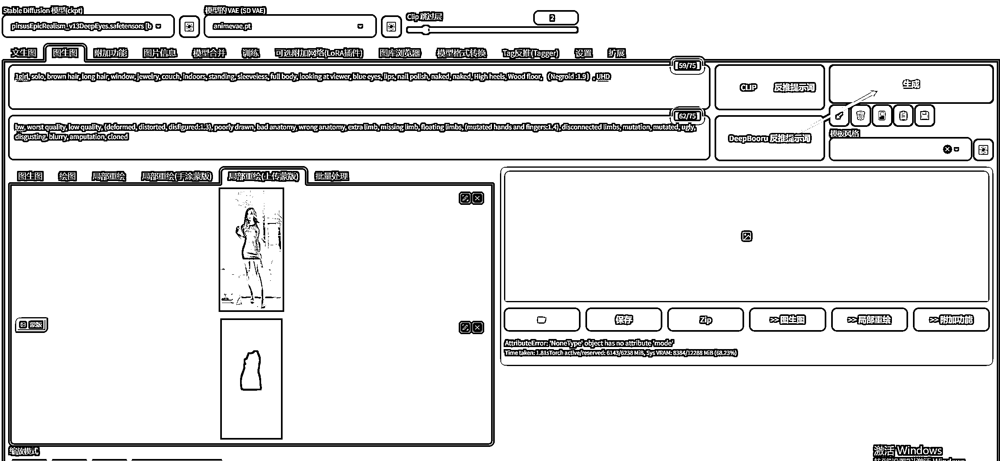<ne-text id="u0eae2f06">5.2 直出效果图</ne-text><ne-card data-card-name="image" data-card-type="inline" id="lG19Y" data-event-boundary="card">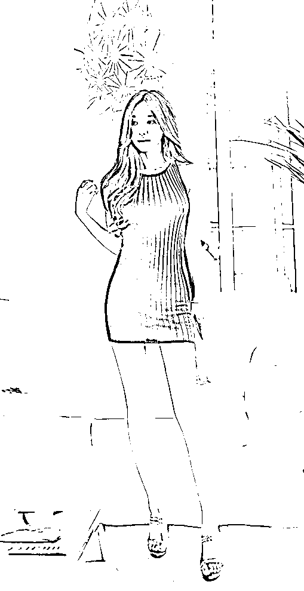<ne-card data-card-name="image" data-card-type="inline" id="W7b1M" data-event-boundary="card">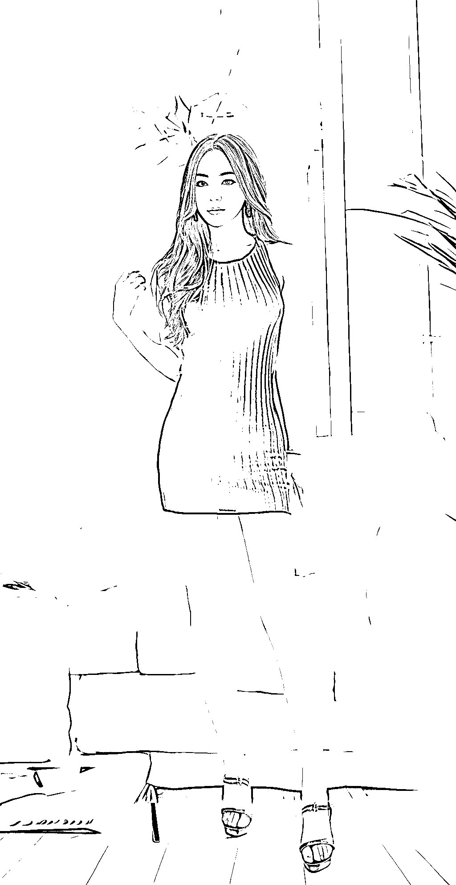<ne-text id="u5ecee090">小结：</ne-text><ne-text id="u6de076c6">该方法适用于假人模特、帽子、鞋子、首饰、床柜等需为指定物品更换场景的应用方式</ne-text><ne-text id="u842627b8">。</ne-text><ne-text id="ue74512b6">二、训练服装 lora 模型，标签详细</ne-text><ne-text id="u1f5cb061">这一章节</ne-text><ne-text id="u8b78e3bb">我们</ne-text><ne-text id="ueb1932c3">来讲</ne-text><ne-text id="uc2b74e85">用训练</ne-text><ne-text id="u493decd9">lora</ne-text><ne-text id="ud1bd2744">的方式训练我们的衣服（物品）模型，然后再使用衣服的</ne-text><ne-text id="u6f877b53">lora</ne-text><ne-text id="u95d90c1a">模型</ne-text><ne-text id="uc2ededa3">，</ne-text><ne-text id="u1563aaec">生成人物穿着我们的衣服。</ne-text><ne-text id="ue361df5f">第一步：</ne-text><ne-text id="ua31a8757">模型训练工具安装</ne-text><ne-text id="udee0b6cb">1.1 下载 lora-scripts-打开下面网盘链接-保存至网盘-下载到本地盘符</ne-text><ne-text id="u18eba6c7">💡</ne-text><ne-text id="uf2d64ae5">链接：</ne-text><ne-text id="u1f19eb8e">https://pan.baidu.com/s/1-UYJkiYtAyVZRNfnLzxWQQ?pwd=zksy</ne-text><ne-text id="ud1b832fb">提取码：zksy</ne-text><ne-card data-card-name="image" data-card-type="inline" id="Df71O" data-event-boundary="card"><ne-card data-card-name="image" data-card-type="inline" id="s5BGH" data-event-boundary="card">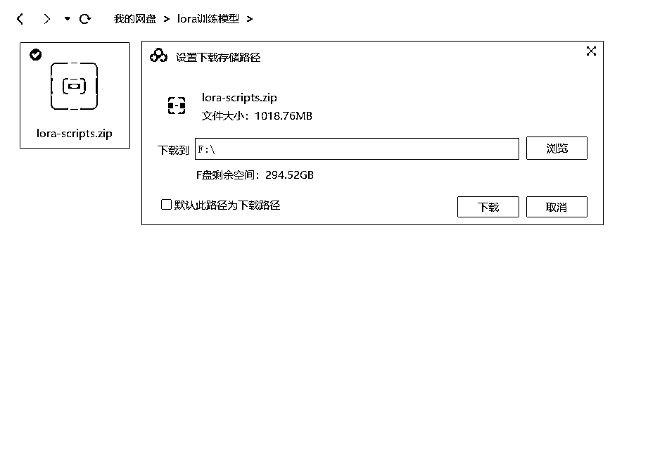<ne-text id="u930c9768">1.2 把压缩包解压至盘符中</ne-text><ne-card data-card-name="image" data-card-type="inline" id="eidND" data-event-boundary="card"><ne-text id="u93de0373">1.3 在搜索局域栏中输入【powershell】然后用右键选择管理员身份运行</ne-text><ne-card data-card-name="image" data-card-type="inline" id="csGgi" data-event-boundary="card"><ne-text id="u22c8a81d">1.4 在 powershell 中输入下面👇运行代码-然后输入【Y】回车</ne-text><ne-text id="u5268acdb">💡</ne-text><ne-text id="ued52af0f">Set-ExecutionPolicy -ExecutionPolicy RemoteSigned</ne-text><ne-card data-card-name="image" data-card-type="inline" id="pscA2" data-event-boundary="card"><ne-text id="u53b92f61">1.5 打开【lora-scripts】目录，找到【install-cn】点击右键使用 PowerShell 运行，就会自动安装加载，现在安装完毕就可以关掉了</ne-text><ne-card data-card-name="image" data-card-type="inline" id="DMt0u" data-event-boundary="card">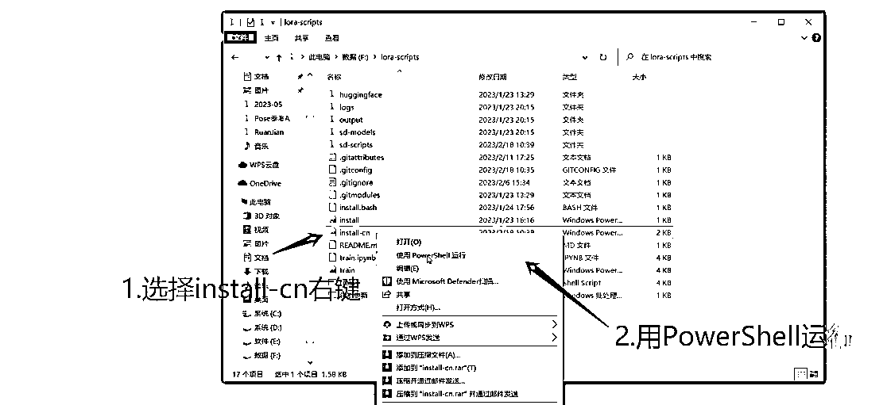<ne-card data-card-name="image" data-card-type="inline" id="SCDAV" data-event-boundary="card"><ne-text id="u7ddfee28">第二步：</ne-text><ne-text id="ue069249c">训练素材准备</ne-text><ne-text id="u1f48c819">在进行 LORA 训练前需要准备训练素材，想要到达预期的效果对图片素材有一定要求：</ne-text><ne-text id="uc98257b8">分辨率：</ne-text><ne-text id="ue25b4289">越高清越好，训练出来的模型细节也越多</ne-text><ne-text id="u10977072">数量：</ne-text><ne-text id="u456d1463">推荐 50 张图片，保底 10-15 张</ne-text><ne-text id="u7e3f758b">背景：</ne-text><ne-text id="u2c7c7fee">建议纯色背景</ne-text><ne-text id="u8453e8af">角度：</ne-text><ne-text id="u86c66cb9">建议平视拍摄，配合不同的角度前后侧，不建议俯视</ne-text><ne-text id="uaba19a0f">训练衣服模型需部位：</ne-text><ne-text id="u4a4ec18c">衣服要保证完整，同一衣服多角度拍摄，产品每个部位有特写更好，衣服不要被人手遮挡，建议有透明人台上单独 拍摄一组</ne-text><ne-card data-card-name="image" data-card-type="inline" id="j6YuF" data-event-boundary="card"><ne-text id="ue5a92b81">第三步：</ne-text><ne-text id="uae1829cd">训练素材预处理</ne-text><ne-text id="ue0c7e8c0">3.1 新建一个文件夹（可以是产品的拼音）-在新建的文件夹中再新建两个文件夹分别命名为【in 和 out】-准备好的图片素材拷贝进【in】文件夹</ne-text><ne-card data-card-name="image" data-card-type="inline" id="CDiiW" data-event-boundary="card">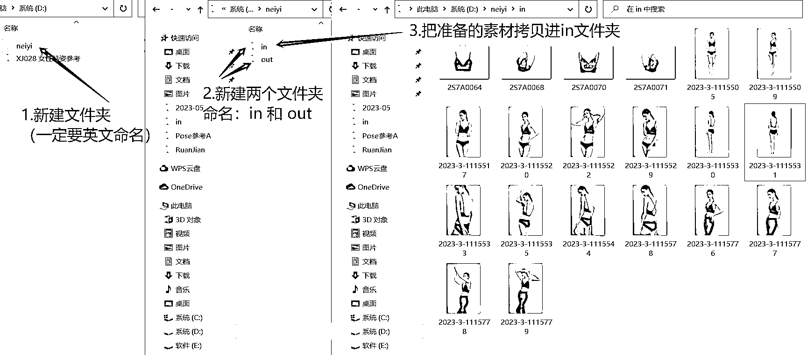<ne-text id="ue9abcd6c">3.2 打开 web</ne-text> <ne-text id="ub01941ea">ui</ne-text> <ne-text id="u9025d866">界面-训练-图像预处理-输入图片存放路径和输出路径-输入图片尺寸-创建镜像-自动裁剪-生成 tags 说明文件-点击预处理</ne-text><ne-text id="u3f94c659">预处理图片尺寸：需要根据你的原图尺寸比例输入。</ne-text><ne-text id="u1b2c6c89">比如，</ne-text><ne-text id="u92385b02">竖版的用 768*1024 或 768*512；</ne-text><ne-text id="ua0703934">横板：768*512 或 1024*768；</ne-text><ne-text id="u26a50896">正方形：512*512、768*768 或 1024*1024</ne-text><ne-card data-card-name="image" data-card-type="inline" id="RY8tu" data-event-boundary="card">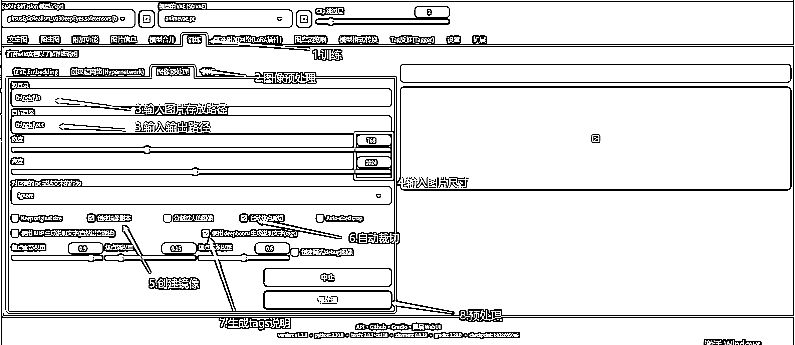<ne-text id="u1a251c3f">3.3 等着加载完成</ne-text><ne-text id="uaec10afc">，</ne-text><ne-text id="u71e61290">就能在【out】文件夹中看到处理好的图片和文本说明文件</ne-text><ne-card data-card-name="image" data-card-type="inline" id="pHkpz" data-event-boundary="card"><ne-text id="ud3993dda">第四步：</ne-text><ne-text id="u3acca6c3">训练素材标签处理</ne-text><ne-text id="u1a8f03d9">4.1 在【lora-scripts】目录中新建一个【train】文件夹（首次创建便可）；</ne-text><ne-text id="u5e0952ad">在 train 文件夹中创建一个模型文件夹（你训练的这个模型叫什么比如黑色内衣的拼音【heiseneiyi】）；</ne-text><ne-text id="ua2d7682e">在模型文件夹中创建训练文件夹【8_heiseneiyi】结构为训练步数 _ 模型名</ne-text><ne-text id="ufc835f57">💡</ne-text><ne-text id="uac115e66">train 文件夹仅需首次创建便可</ne-text><ne-text id="u614fc595">训练步数建议为 5～10 之间</ne-text><ne-text id="u74179651">文件夹路径不能存在中文文件夹</ne-text><ne-card data-card-name="image" data-card-type="inline" id="x2Stp" data-event-boundary="card"><ne-text id="u909213e4">4.2 把【out】文件夹中预处理的图片和 tags 说明文本拷贝至训练文件夹：</ne-text><ne-card data-card-name="image" data-card-type="inline" id="mnmV1" data-event-boundary="card"><ne-text id="u01684bfd">4.3 打开网盘保存 BooruDatasetTagManager 软件-下载至本地盘符中</ne-text><ne-text id="u89cc2f70">网盘</ne-text><ne-text id="u2394e8d3">链接：</ne-text><ne-text id="u82815fe4">https://pan.baidu.com/s/1LAmiYYjj8JXALvu6s5VFgg?pwd=tcvw</ne-text><ne-text id="ue96155ba">提取码：tcvw</ne-text> <ne-text id="u573628fe">4.4 运行程序</ne-text><ne-text id="u49543135">：</ne-text><ne-card data-card-name="image" data-card-type="inline" id="gKaC1" data-event-boundary="card"><ne-text id="uafbc3f86">4.5 点击【File】选择你第一项 load-选择训练文件夹【8_heiseneiyi】点击选择文件夹：</ne-text><ne-card data-card-name="image" data-card-type="inline" id="gdGUI" data-event-boundary="card"><ne-text id="ua72778a1">4.6 点击右侧的＋号，输入 lora 模型的触发器（尽量用罕见的词，拼音是最好的选择），选择放在前面 Top，然后点击 OK 生成：</ne-text><ne-card data-card-name="image" data-card-type="inline" id="MFDSi" data-event-boundary="card"><ne-text id="ude36b916">4.7 在右侧的预览框中删除所有关于内衣的关键词（因为我们训练的是一个内衣的 LORA 模型）</ne-text><ne-text id="u44edd1ac">按住 ctrl 键不放选择全部内衣相关的关键词（刚刚我们添加的触发词除外）点击右侧的❌键删除：</ne-text><ne-card data-card-name="image" data-card-type="inline" id="pNUTy" data-event-boundary="card"><ne-card data-card-name="image" data-card-type="inline" id="oQhuU" data-event-boundary="card">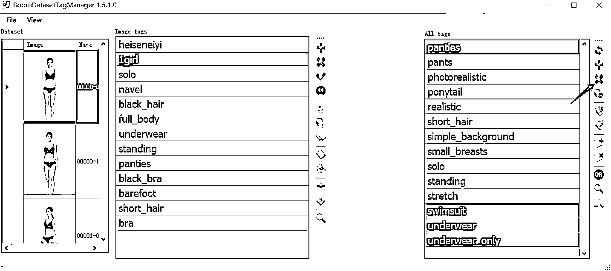<ne-text id="uce104dbb">4.8 点击【File】选择第二项 Save 保存，打开训练文件夹的 tags 说明文本就能看到调整后的标签了：</ne-text><ne-card data-card-name="image" data-card-type="inline" id="Is2V0" data-event-boundary="card"><ne-card data-card-name="image" data-card-type="inline" id="CiX3P" data-event-boundary="card"><ne-text id="u3c451f51">第五步：</ne-text><ne-text id="ue9a6d553">训练参数设置</ne-text><ne-text id="u651e4223">5.1 把常用的大模型复制到【lora-scripts\sd-models】目录下</ne-text><ne-card data-card-name="image" data-card-type="inline" id="GXqfJ" data-event-boundary="card">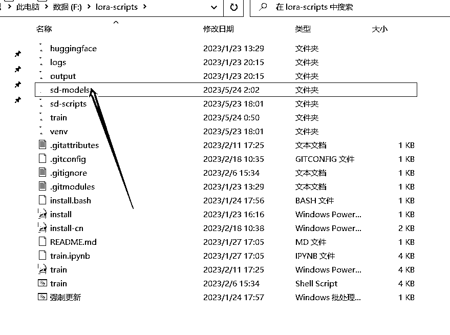<ne-card data-card-name="image" data-card-type="inline" id="vj2h0" data-event-boundary="card">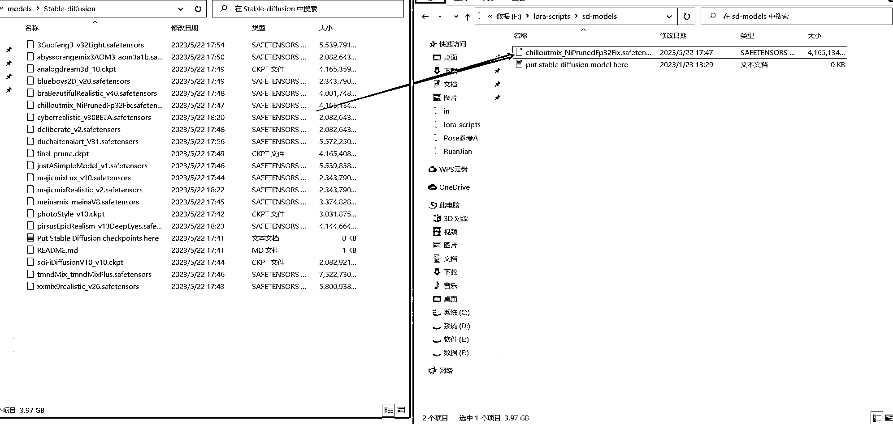<ne-text id="u32a06fad">5.2 右键点击【train.ps1】文件用记事本打开</ne-text><ne-card data-card-name="image" data-card-type="inline" id="mWNMS" data-event-boundary="card">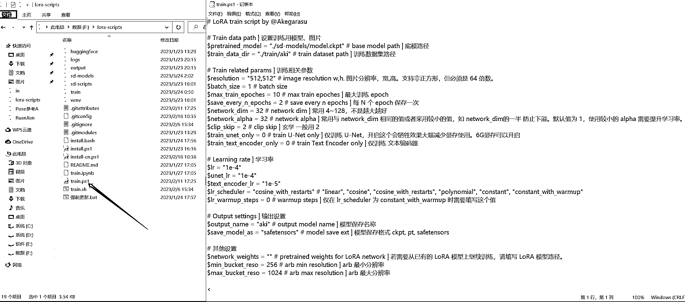<ne-text id="u6885c897">5.3 把大模型的完整命名复制到【。/sd-models/】后面</ne-text><ne-card data-card-name="image" data-card-type="inline" id="j1Jkt" data-event-boundary="card"><ne-text id="ucbd612b1">5.4 把模型文化夹的命名复制到【。/train/】后面</ne-text><ne-card data-card-name="image" data-card-type="inline" id="J9kCC" data-event-boundary="card"><ne-text id="u3610b11b">5.5 设置图片分辨率、最大训练量、还有模型名字，设置完了点击左上角的文件-保存</ne-text><ne-text id="u4ff71a05">💡</ne-text><ne-text id="u4b65f80d">batch size（同时训练量）：显存在 12G 以上可以选择调成 2，正常我们默认为 1 就可以</ne-text><ne-text id="u090f69b4">最大训练 epoch 数值：10～20 之间</ne-text><ne-text id="u263e1757">network dim 和 network alpha 需要保持一致：可以输入 32 或者 64，一般我们使用默认 32 数值就可以了</ne-text><ne-text id="u522df133">模型保存名称 output_name ：需要给输入的模型命名比如 heiseneiyi</ne-text><ne-card data-card-name="image" data-card-type="inline" id="XPUxo" data-event-boundary="card"><ne-text id="uab009afd">5.6 右键点击【train.ps1】文件，选择使用 PowerShell 运行，就会自动开始训练 lora 模型，大概训练时长为 15 分钟～4 小时，根据</ne-text><ne-text id="u5ff4a5a3">显卡</ne-text><ne-text id="ua00274b1">性能决定：</ne-text><ne-card data-card-name="image" data-card-type="inline" id="sFTCw" data-event-boundary="card">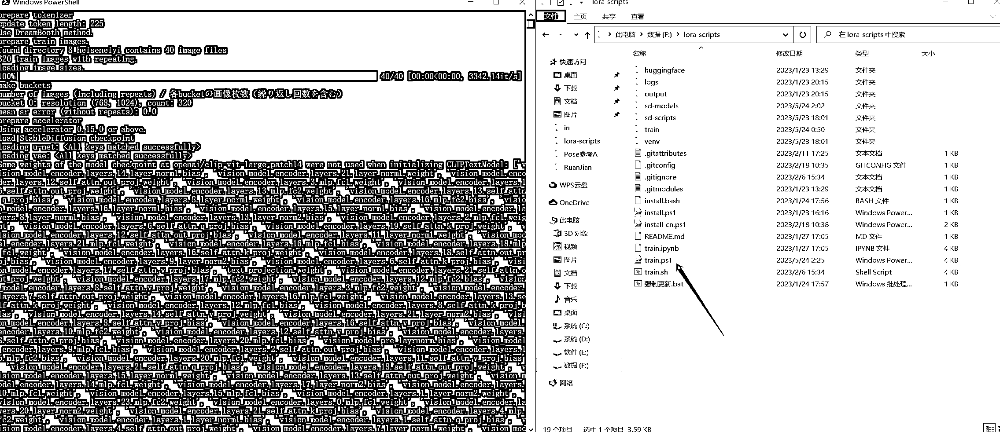<ne-text id="u549205a2">5.7 训练完成后模型保存在【output】文件夹中，我们选用第一个就好：</ne-text><ne-card data-card-name="image" data-card-type="inline" id="s1Pji" data-event-boundary="card"><ne-text id="u89e6a080">第六步：</ne-text><ne-text id="u3ad10b07">训练模型使用</ne-text><ne-text id="u5515c9d8">6.1 打开 WEB</ne-text> <ne-text id="ue5e3a283">UI</ne-text> <ne-text id="u0f9b1a25">目录进入 lora 文件夹目录【novelai-webui-aki-v3\extensions\sd-webui-additional-networks\models\lora】把训练好的 lora 模型拷贝进去</ne-text><ne-card data-card-name="image" data-card-type="inline" id="NGlfp" data-event-boundary="card"></ne-card><ne-text id="u525ea0c0">6.2 选择大模型，然后在文生图中输入正向关键词和反向关键词，设置参数</ne-text><ne-text id="u45957434">💡</ne-text><ne-text id="u6207d61e">正向关键词：</ne-text><ne-text id="uc46dfbd4">heiseneiyi，1girl， solo， skirt， realistic， long hair， brown hair， jewelry， bracelet， pink shirt， breasts， ring， indoors，black_ Bra， black_Underpants，High heels</ne-text><ne-text id="ue9e63614">反向关键词：</ne-text><ne-text id="ua34173c9">easynegative， cross-eyed， ng_deepnegative_v1_75t， badhandv4， By bad artist -neg， disfigured， bad art， deformed， extra limbs， weird colors， blurry， duplicate， morbid， mutilated， extra fingers， mutated hands， poorly drawn hands， poorly drawn face， mutation， ugly， bad anatomy， bad proportions， cloned face， gross proportions， malformed limbs， missing arms， missing legs， extra arms， extra legs， fused fingers， too many fingers， long neck， tiling， poorly drawn feet， mutated， cross-eye， loli， chibi， bad eyes</ne-text><ne-text id="u0ed95a27">采样迭代步数：30</ne-text><ne-text id="u69206189">采样方法：DPM++ 2M Karras</ne-text><ne-text id="u9aeac3f6">高清修复：启用</ne-text><ne-text id="uecdc4852">放大算法：R-ESRGAN 4x+  </ne-text><ne-text id="u3c1d2af8">重绘幅度：0.7</ne-text><ne-text id="ufdb39904">放大倍率：2</ne-text><ne-text id="u549dd976">图片尺寸：与 ControlNet 上传的图片尺寸一致或倍数</ne-text><ne-text id="ue18bf432">提示词相关性：7</ne-text><ne-text id="ua7566a90">随机种子：-1</ne-text><ne-card data-card-name="image" data-card-type="inline" id="FqTq7" data-event-boundary="card"><ne-text id="u4adf37ec">6.3 设置 lora 参数</ne-text><ne-text id="u853c5a83">勾选启用</ne-text><ne-text id="u98511d47">-选择训练好的 lora 模型（heiseneiyi）-权重：0.7～1</ne-text><ne-card data-card-name="image" data-card-type="inline" id="VMGYo" data-event-boundary="card">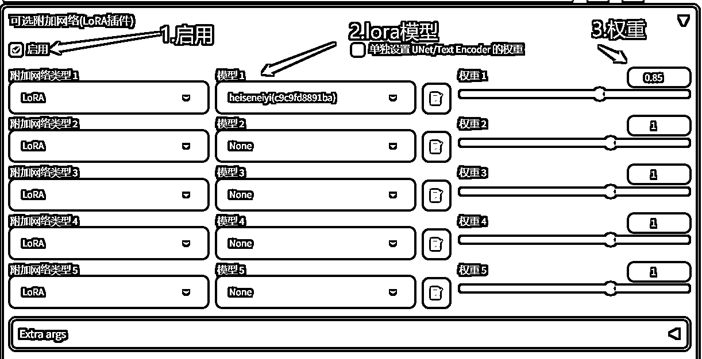<ne-text id="ue9ec8679">6.4 ControlNet 参数设置</ne-text><ne-text id="u26af3e1e">选择一张想要生成的姿势图片上传至 ControlNet，</ne-text><ne-text id="uc990ce26">启用低显存优化</ne-text><ne-text id="u443ce73a">，</ne-text><ne-text id="u1c913e67">Pixel Perfect  Allow Preview  都勾选上</ne-text><ne-text id="uf3be5bd0">。</ne-text><ne-text id="uabe890c3">预处理器：depth_leres++</ne-text><ne-text id="u7fde07c2">预处理模型：control_v11p_sd15_depth</ne-text><ne-text id="uba2ccbdc">Control Weight 权重：0.8</ne-text><ne-text id="ue80524a7">其他默认</ne-text><ne-text id="ud07045ab">：</ne-text><ne-card data-card-name="image" data-card-type="inline" id="k380M" data-event-boundary="card"><ne-text id="u1de95f1f">6.5 点击生成</ne-text><ne-text id="u3e633f03">生成的图片不满意没关系，因为</ne-text><ne-text id="uf216caf7">lora</ne-text><ne-text id="uec3acc3e">训练的人物数据不足会</ne-text><ne-text id="u6a18213c">导致脸部</ne-text><ne-text id="ue9faaabc">奇奇怪怪，按照【一、图文图，保留衣服换人换背景】方式再二次修改</ne-text><ne-text id="u6528ec9b">即可：</ne-text><ne-card data-card-name="image" data-card-type="inline" id="xNRWd" data-event-boundary="card">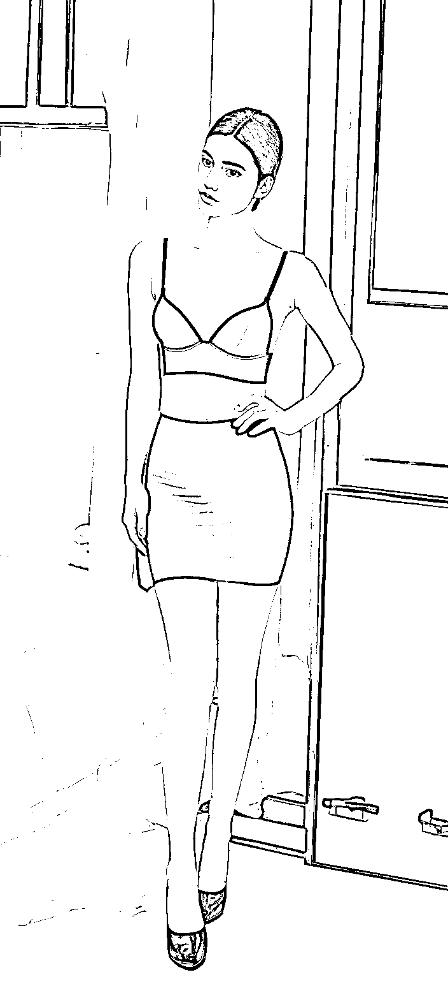</ne-card><ne-text id="ua8f32c30">小结</ne-text><ne-text id="uf8ca3afa">lora 训练模型的方式</ne-text><ne-text id="u4405ceb7">适用</ne-text><ne-text id="u80fa6e6d">一切物品，但是精度不够，目前我测试的</ne-text><ne-text id="u706fec4a">结果是，</ne-text><ne-text id="uc175f0db">对于简单内衣、</ne-text><ne-text id="uc3c8e1da">T 恤</ne-text><ne-text id="uc4d34f64">、瑜伽裤、背心等这些简单版型</ne-text><ne-text id="u94ac0909">、</ne-text><ne-text id="ubd821abb">简单材质的服装还原度会相对</ne-text><ne-text id="u0fa364a2">高</ne-text><ne-text id="u6da174c7">一些</ne-text><ne-text id="u72443f48">。</ne-text><ne-text id="uecbf5557">对于</ne-text> <ne-text id="u88617b38">AI</ne-text> <ne-text id="uaf236a8d">模特换装的分享就这么多了，大家在执行的过程中有那些问题可以找我一块探讨，我们共同把这个类目放大，变成可应用的商业化。</ne-text><ne-text id="u67990d49">如果你什么有商家资源或者摄影师资源，你可以把这个事跟他们说一些，估计他们的兴趣意向会挺高，一组图先收个 99～199</ne-text> <ne-text id="udbb7c725">元</ne-text><ne-text id="ua4318d3e">不</ne-text><ne-text id="ue1fa4eaf">过分</ne-text><ne-text id="u34d9687a">的，一天做接一组图都能有 3K～6K 的额外收入不香吗？</ne-text><ne-text id="ue4e87ced">奥里给！！搞起来</ne-text><ne-text id="ue7e8d951">吧</ne-text><ne-text id="ucba20141">家人们</ne-text><ne-text id="u35504e08">！</ne-text>  <ne-hole id="u983e7186" data-lake-id="u983e7186"><ne-card data-card-name="hr" data-card-type="block" id="KJiX8" data-event-boundary="card"><ne-p id="u9b3d4a7d" data-lake-id="u9b3d4a7d"><ne-text id="ud4e1c3aa">评论区：</ne-text></ne-p> <ne-p id="uaf1dedcb" data-lake-id="uaf1dedcb"><ne-text id="u7c8460e9">北辰 : 非常详细，感谢分享！</ne-text> <ne-text id="u77a25fd1">自律更自由 : 老师可以点评一下我的作品吗？</ne-text> <ne-text id="u86e57c0b">千穹 : 很好</ne-text> <ne-text id="u23cbaa44">瑾糖 : 太好看了叭～好美</ne-text> <ne-text id="u88cbfe75">自律更自由 : 有没有简单点的，这换衣服，太复杂了</ne-text> <ne-text id="ufa062aef">瑾糖 : 蘑菇街，美图工作室，都可以实现这个功能，但是自由度没这么高</ne-text></ne-p></ne-card></ne-hole></ne-card></ne-card></ne-card></ne-card></ne-card></ne-card></ne-card></ne-card></ne-card></ne-card></ne-card></ne-card></ne-card></ne-card></ne-card></ne-card></ne-card></ne-card></ne-card></ne-card></ne-card></ne-card></ne-card></ne-card></ne-card></ne-card></ne-card></ne-card></ne-card></ne-card></ne-card></ne-card></ne-card></ne-card></ne-card></ne-card></ne-card></ne-card></ne-card></ne-card></ne-card></ne-card></ne-card></ne-card></ne-card></ne-card></ne-card></ne-card></ne-card></ne-p>