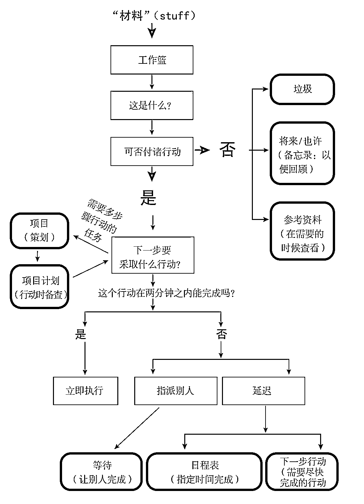
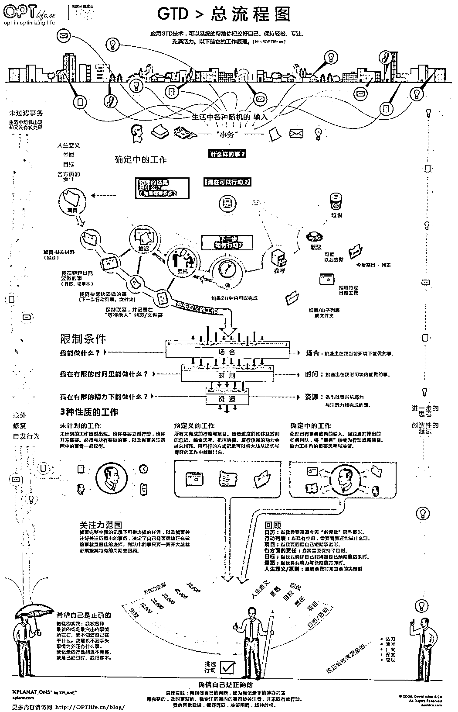
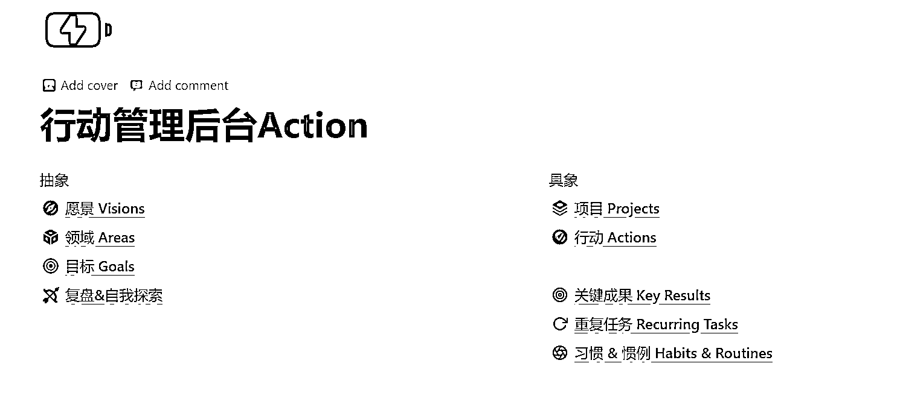

# 给时间管理新手的极简入门“ 行动管理 ”指南

> 原文：[`www.yuque.com/for_lazy/thfiu8/rx4iogsrr9yt7o72`](https://www.yuque.com/for_lazy/thfiu8/rx4iogsrr9yt7o72)

<ne-h2 id="a44d4329" data-lake-id="a44d4329"><ne-heading-ext><ne-heading-anchor></ne-heading-anchor><ne-heading-fold></ne-heading-fold></ne-heading-ext><ne-heading-content><ne-text id="u0977a60e">(41 赞)给时间管理新手的极简入门“ 行动管理 ”指南</ne-text></ne-heading-content></ne-h2> <ne-p id="uc4ec5a90" data-lake-id="uc4ec5a90"><ne-text id="u23744ce4">作者： 饭先生</ne-text></ne-p> <ne-p id="u6e22ed01" data-lake-id="u6e22ed01"><ne-text id="u788702ab">日期：2023-06-29</ne-text></ne-p> <ne-p id="u74b6a29a" data-lake-id="u74b6a29a"><ne-text id="uedbec804">5 月 30 日《给新手入门的极简“ 行动管理 ”指南》@饭先生</ne-text><ne-text id="u43a1bd9c">大家好我是阿饭，4 年生财有术老圈友，资深潜水党，现在浮出水面希望可以给圈友们提供一些价值。</ne-text><ne-text id="u87ccd95c">我在 17 年还上学的时候接触个人成长领域，开始学习并践行时间管理与目标管理等理论；工作之后基本工作日都会进行每日记录，周复盘也持续了三年以上；使用的工具从有道云笔记到印象笔记再到 notion 和 Obsidian</ne-text><ne-text id="u9cfddebe">也体验过各类时间管理方法和工具，</ne-text><ne-text id="uc634c46e">曾经因为在产品社区写了多篇泛时间管理类产品的分析被邀请参与“时间管理应用”的创业项目，作为知识付费老韭菜，近几年也担任过一些个人 OKR、时间管理等课程的助教工作，帮助大家设计自己的自我管理策略。</ne-text><ne-text id="u41d96b9a">目前，经过了多年的理论学习和自己的实践。我打造了一套自己的知识+行动管理方法论和对应的模板，目前运行的还算顺利</ne-text><ne-text id="ucc223db4">。</ne-text><ne-text id="u235f9363">帮助我在长期远程办公，外加参与多个项目的游民生活中，保持了持续的生产力和效能感。</ne-text><ne-text id="u707fd1f7">当然，我的流程也并不适合所有人，我觉得没有适用所有人的时间管理方法。所以今天的主题是分享常见的时间管理的方法，但更多的还是分享个人管理的思路，</ne-text><ne-text id="u67fbc389">帮助</ne-text><ne-text id="u9f712684">大家来自己设计适合的方法。</ne-text><ne-text id="u8b0a0bb8">一、</ne-text><ne-text id="u390a7766">心态和思维的转变</ne-text><ne-text id="ua76781eb">1</ne-text><ne-text id="u6e3b8e32">.1</ne-text> <ne-text id="u41c5bc26">明确目标，我们管理时间是为了“成事”</ne-text><ne-text id="ufc59b40d">我们小航海的主题是“时间管理”。</ne-text><ne-text id="u0fcf7c90">但对我而言，比起管理时间，目标和行动管理更加有效，经过我反复实践（caikeng）多年的经验，我阶段性的认为「目标重于时间管理方法论」</ne-text><ne-text id="ub67360d1">时间是流动的，是一个客体，我们很难对它进行约束，只能进行觉察。我们只能对自己可以“掌控”的东西进行管理。</ne-text><ne-text id="uaa69c793">对于自由职业者或者以「成果为导向」的职场人来说，时间管理可以被简化成，想清楚自己要啥（定目标）+</ne-text><ne-text id="u7b233e06">拆解到能做 + 给相应的任务安排时间去干。</ne-text><ne-text id="ue72eef41">如果我们以时间为指标去划分关键里程碑</ne-text><ne-text id="uf3b56db7">，</ne-text><ne-text id="uc89f9be0">在特定时间点未能实现目标，会感到失败或没有进步。</ne-text><ne-text id="u7051d364">但如果</ne-text><ne-text id="uc16a83a3">以我们想要实现的目标为基础</ne-text><ne-text id="ue869c206">，</ne-text><ne-text id="ub473b347">将目标分解，然后根据任务来安排时间资源，</ne-text><ne-text id="u6f28e7a0">可能心态会好很多。</ne-text><ne-text id="u2eee33d9">仔细想一下，我们学习时间管理的原因是什么？无非是希望好钢花在刀刃上，有足够的时间完成自己想做的事情。对大多数人而言，</ne-text><ne-text id="uc375ff9f">每天</ne-text><ne-text id="u6bf24af4">能够实现既定的目标。那么剩下的时间爱干嘛就干嘛，享受生活就好了。</ne-text><ne-text id="u1d2c8e39">这仅为我个人的实践经验，大家可以选择自己更喜欢的管理方式，核心是找到适合自己成长的方式。这就涉及到下面一条思维的转变</ne-text><ne-text id="u48354ec9">1</ne-text><ne-text id="ue4a12f66">.2</ne-text> <ne-text id="u87252bcf">以自我为主体</ne-text><ne-text id="u70e38c5d">市场上有各种时间管理、目标管理的流派和方法论。但是一个方法好不好用，需要“自己”来确认。很多人可能</ne-text><ne-text id="u4362592a">在小航海之前就已经</ne-text><ne-text id="u37655155">使用过一些时间管理的方法，但在具体运行的过程中，总会出现各种各样的 bug。这种时候还会怀疑自己。觉得自己自控力、意志力不行，然后就放弃了。过段时间卷土重来，或者转而去寻找其他的方法，就这样循环往复。</ne-text><ne-text id="ud6cd81bc">但其实每个人的特点不一样，所处的外部环境也不一样。没有适合所有人的时间管理、目标管理方法。</ne-text><ne-text id="u13f7eb86">例如我的情况跟大多数人可能并不太一样。我目前是远程办公，除了主业之外，也是一个资深斜杠青年，在并行推进很多的项目，这些项目可能都处在不同的阶段。所以我的时间相对自主可控，同时并行的事情又比较多。那跟我生活状态不一致的人照搬我的方法可能就会出问题。</ne-text><ne-text id="uf9ebceaa">所以，时间管理应该是以自己为主体，具体情况具体分析。这个时候应该有“甲方思维”，一个方法、一种技巧不适用，那就是方案跟我们的问题不匹配。</ne-text><ne-text id="u0ae006ab">对于进行时间管理的新人，更需要的是先尝试起来，在这个过程中掌握原理，根据自己的实际情况进行方案调整和修改。</ne-text><ne-text id="u6014182d">1</ne-text><ne-text id="u8fbdc8be">.3</ne-text> <ne-text id="u3093fc22">时间管理是个无限游戏，</ne-text><ne-text id="u2056c666">培养自己的</ne-text><ne-text id="ua861221a">系统</ne-text><ne-text id="uc69a3ed4">思维</ne-text><ne-text id="u06f69711">时间管理</ne-text><ne-text id="uf9cd785f">是结果导向的，我们会关注自己每天时间的使用效率。但我也提倡大家关注过程，思考如何持续优化自己的生活而不仅仅是目标的达成。这是一种思维的转变，我们学习时间管理，因为我们想过上更好的生活。时间管理是手段而非目的。</ne-text><ne-text id="ubc8d1f29">因此循序渐进的搭建一个系统并逐渐优化，比</ne-text><ne-text id="uf27b1a60">追寻</ne-text><ne-text id="u77c6192b">一个目标的实现更容易持续。</ne-text><ne-text id="u51b8df65">这有点像是有限游戏和无限游戏的区分。有限的游戏，其目的在于赢得胜利；无限的游戏，却旨在让游戏永远进行下去。</ne-text><ne-text id="ua2ee7be9">万维钢老师有句话我很喜欢：“凡夫畏果，菩萨畏因，佛畏系统”。如果我们有个系统，那么每个目标不过是一个个例、一个数字而已。我们要担心的不是这个目标是否可以实现，而是自己的系统运行是否运转正常。</ne-text><ne-text id="u40182a3f">比如说如果目标是在体育比赛中得第一名，那么系统就是优化自己的身体状态，训练方法，竞技能力，而达成目标只不过是系统改善后的必然结果。</ne-text><ne-text id="ud2e02d49">如果以这样的心态工作生活，就不会在完成之前痛苦，完成后空虚。因为系统的改进没有终点。就算拿到冠军，你的身体素质，心态以及训练方法都有改善空间。</ne-text><ne-text id="u2e9ae992">回到我们的生财</ne-text><ne-text id="u16eaa44d">小航海</ne-text><ne-text id="u2695784e">，每个人会给自己定下不同的目标。例如完成**次打卡，成功变现**元。但这个目标完成之后就是终点吗？大家参加小航海，或许是期待最低成本的进行行动，去落地实战项目。</ne-text><ne-text id="u63add3eb">那更好的状态或许是日有所进，将今天学到的有用的方法应用起来，去应对更多的挑战，在出现问题的时候再持续调整。比起我们离目标差距的数值，实现这个目标有哪些过程，过程的各个步骤及其所用时间，过程的衡量标准，每个环节的优化空间……这些都是“无限游戏”，可以让我们持续玩下去</ne-text><ne-text id="u12136a37">大家也可以更加关注目标完成的前置条件，并不断思考改变一个条件之后会带来什么连锁反应。当你处在一个不断优化自己系统的状态时，结果的达成会是自然而然的。</ne-text><ne-text id="uce4bacc9">二、</ne-text><ne-text id="uf66664b1">时间管理领域的几大流派</ne-text><ne-text id="uaa1ab292">说完比较虚的心态和思维，下面我分享更具体实操的内容，来看看时间管理的几个流派，以及他们的应用场景。</ne-text><ne-text id="u15fae962">2.1 GTD（Getting Things Done）</ne-text><ne-text id="uaff370a9">GTD（Getting Things Done）：旨在帮助人们更好地组织和管理他们的任务清单。</ne-text><ne-text id="ue4331112">GTD 包括五个步骤：收集，处理，组织，回顾和执行。这个方法强调要将任务逐一地收集起来，避免任何事项被遗漏。然后，将它们分类和组织，以便更容易地处理和执行。</ne-text><ne-card data-card-name="image" data-card-type="inline" id="K39GU" data-event-boundary="card"><ne-card data-card-name="image" data-card-type="inline" id="SDdKH" data-event-boundary="card"></ne-card><ne-text id="u39763c8a">这种方法可以说是时间管理最经典的方法，也是下面我要分享的我自己的行动系统的基石。比较适用于事情比较多，注意力不够用的人群。如果你经常感到被淹没在各种事情当中，那么用这方法，先记录再行动就会比较有效。</ne-text><ne-text id="u40d50949">2.2 艾森豪威尔矩阵</ne-text><ne-text id="u8ff2c7b3">艾森豪威尔矩阵（紧急-重要四象限）：这个方法基于一个四象限矩阵，用于区分任务的重要性和紧急程度。将任务分为四个象限：紧急且重要，紧急但不重要，重要但不紧急和不重要也不紧急。这可以帮助人们更好地了解他们的任务和优先级，并且确保优先完成最重要的任务。</ne-text><ne-card data-card-name="image" data-card-type="inline" id="AacXy" data-event-boundary="card"><ne-text id="ucf785445">这一工具其实更适合用于管理者，或者跟很多人协作互动的过程中。其核心理念是，做重要的事情而非紧急的事情。不要把一些事情拖到成为紧急的事情。不重要的事情要么放弃，要么授权给别人做。</ne-text><ne-text id="u81b3d3c2">2.3 二八法则</ne-text><ne-text id="ud24668b5">二八法则：也被称为帕累托法则，这个方法认为，80%的结果来自于 20%的投入。大部分成果来自于少数重要的任务。因此，这个方法鼓励人们集中精力在最重要的任务上，并忽略那些不重要或没有太大价值的任务。</ne-text><ne-text id="u24abcbf6">这个问题的核心在于分析，找到什么是那 20%的事情？难点就在于需要对自己的日常进行仔细思考，找到那些导致一些现象经常出现的根本问题。例如跟上面的四象限法则结合，思考自己为会啥让重要的事情拖到最后，让其变得紧急</ne-text><ne-text id="u36023a7c">2.4 吃青蛙</ne-text><ne-text id="u38b22039">吃青蛙：强调人们应该首先完成最难的任务。如果你首先完成最重要和最困难的任务，那么你就能够更轻松地完成其他任务，并避免拖延。这个方法的重点在于行动，比较适用于“思想家”只想不做这种情况。</ne-text><ne-text id="ude3955e2">可以说，目前所有的时间管理的方法都脱胎于这几种方法。结合这几种方法的原理，其实就可以设计自己的行动方案了。下面，我就来介绍一下我常用的目标管理流程。</ne-text><ne-text id="ufed0d47c">三、</ne-text><ne-text id="ueb9fb3cb">极简化的行动流程</ne-text><ne-text id="uaedbc2fd">我的整体框架来源于 GTD：总共分为几个步骤：</ne-text><ne-text id="u4f1b6327">收集-分类-排序-行动-复盘。</ne-text><ne-text id="uafe926a7">Step 1：清空大脑，将待思考、待行动的全部都列出来</ne-text><ne-text id="u1be6ff3a">很多人可能听过一个概念“第二大脑”。本质上是善于利用工具，时刻进行认知卸载，让大脑做更擅长的事情。</ne-text><ne-text id="u911afb29">初期可以直接用白纸或者手机便签，打造一个放置盒/收集箱，将头脑里引起你关注的所有事情，全部从工作记忆中转移到外部，从抽空思考事业规划，到周末跟朋友聚会吃啥……统一到收集箱，让脑子保持清爽</ne-text><ne-text id="ud06727c8">。</ne-text><ne-text id="u7e394367">Step 2：分类，清空收集箱</ne-text><ne-text id="u61c5b05d">对收集箱进行处理，可以选择一个固定的时间，例如每天晚上或者早上，对收集箱的各种想法进行评估和处理。将记录下来的事情转移到适合的位置，清空收集箱，开始下一步行动。</ne-text><ne-text id="ub9bc11f8">在分类时，可以参考 GTD 的原理。能在几分钟内完成的就立即行动，剩下的可以具体评估之后划入不同的领域。</ne-text><ne-text id="uaf4ff85c">例如下面这个是我的操作系统，会将收集箱的 idea 更具象化之后划分到不同的位置：</ne-text><ne-card data-card-name="image" data-card-type="inline" id="vWgYL" data-event-boundary="card"><ne-text id="u8de7cbe1">我分的类型比较多。大家其实可以简单按照是否需要现在行动，以及行动所需步骤来处理和分类。简单划分为任务、项目、目标和资料等</ne-text><ne-text id="u8a30581f">。</ne-text><ne-text id="u85487ca7">任务：</ne-text><ne-text id="u9842f008">一系列有组织的行动的集合，一般会有一个明确的产出物，可以在一天或者几天之内完成。例如做一个 PPT，用 ChatGPT 写一篇文章，完成今天的小航海打卡等</ne-text><ne-text id="u31b6521b">项目：</ne-text><ne-text id="u772c9c40">一系列任务的集合。支持目标的实现，满足 SMART（具体、可衡量、可达成、现实、有截止期限）要求。例如我会将完成</ne-text><ne-text id="u65fbf72c">小航海</ne-text><ne-text id="u61b276b7">作为一个项目。</ne-text><ne-text id="u78311229">目标：</ne-text><ne-text id="u2c7d2024">心中长期期望实现的想法，要成为什么样的人等比较宏观的概念。一般需要较长周期，多个项目来支持目标的达成。</ne-text><ne-text id="u7f7f2529">资料：</ne-text><ne-text id="udf5dc336">无需采取行动的信息，可归入参考资料。</ne-text><ne-text id="u5c11e58d">Step 3：排序</ne-text><ne-text id="u8a6f02cb">排序，筛选出重要的事情，这个要从外部环境和自身出来设计。可以结合前文我们提到的几种理念来设计。例如</ne-text><ne-text id="u9af28dde">-紧急且重要</ne-text><ne-text id="u879bcd49">-老板让你马上交给他的</ne-text><ne-text id="uba362eb2">-吃青蛙，挑选剩下的任务中最难受，最困难的事情</ne-text><ne-text id="uf0591638">-解决很多问题重复出现的根本问题</ne-text><ne-text id="u4ccfeb76">-在一个协作链条的前置环节，后面的步骤在等待你</ne-text><ne-text id="u9cd75d0d">这个排序的原则没有对错之分，完全以自己为主体进行规划。但尽可能跟自己的长期目标和价值观对齐。</ne-text><ne-text id="ufc08a0ba">Step 4：行动</ne-text><ne-text id="u3e753c0b">我认为思考和行动应该适当的分开。前面的思考步骤必须做的充分，这样才能使你确信穷尽了所有可能。</ne-text><ne-text id="u43ac58d2">经过前面的环节，把现在要做什么想清楚了。这个时候就不要纠结、不要内耗了，直接去做。</ne-text><ne-text id="u704d9c16">在做事的过程时刻以产出为导向。过程中不断积累各种具体的认知，争取让执行的流程越来越顺利。</ne-text><ne-text id="ua9557149">Step 5:</ne-text><ne-text id="u350f7337">复盘迭代</ne-text><ne-text id="ub182547f">我习惯每天晚上或者早上的时候重复上面的环节。</ne-text><ne-text id="ue76b7e0a">清空大脑</ne-text><ne-text id="ua6d59e06">清空收集箱</ne-text><ne-text id="u8fcc730a">更新任务、更进项目进展</ne-text><ne-text id="ue3029b92">确定优先事项</ne-text><ne-text id="u95b47244">同时也会在每周或者每个月，以及一个项目结束后复盘，主要是为了让自己做过的事情价值最大化。</ne-text><ne-text id="u106f5068">这里也提供几个我在做复盘的时候常用的问题。脱胎于 KPT 复盘法，比较适合在一个项目结束，或者每天的工作结束之后用于自我提问进行思考。</ne-text><ne-text id="uc00615d1">KPT 复盘法是</ne-text><ne-text id="u2a10be34">K（Keep）：今天有那些做的好的地方，夸夸自己，可以继续保持。如果能抽象成一个经验或者流程就总结下来。</ne-text><ne-text id="ub54a8f47">P（Problem）：在今天的工作中，遇到了哪些问题？</ne-text><ne-text id="u43c63325">T（Test）：有什么想法可以在下次任务/明天工作当中进行测试，尝试改进？</ne-text><ne-text id="u21a855ac">复盘一方面看细节。</ne-text><ne-text id="ua0ae7853">做事的过程中有什么经验和积累，沉淀下来。甚至总结成 SOP，让自己做熟悉的事情时可以既快又好。另外也能在协作中帮助到其他人。</ne-text><ne-text id="u42cea8e0">一方面也要看整体流程，</ne-text><ne-text id="uf85da65a">还记得前面我们说的系统思维吗。复盘也是优化系统的过程。经过实干有了更多一手经验之后，每个环节都可以逐渐替换成对自己更舒服更有效的。</ne-text><ne-text id="u108c8a57">以上就是我今天要分享的内容，听完这个分享之后，我也希望大家思考一下， 你马上可以去做的第一步行动是什么</ne-text><ne-text id="u364cda8e">，</ne-text><ne-text id="u70ee3dfc">以及现在自己的行为系统里面有什么可以马上去调整的部分。</ne-text><ne-text id="u30b6b9c8">如果大家也有好的复盘模板，也欢迎提出来一起交流哇</ne-text>  <ne-hole id="ua8e560b3" data-lake-id="ua8e560b3"><ne-card data-card-name="hr" data-card-type="block" id="SYiZ4" data-event-boundary="card"><ne-p id="ue4f8c880" data-lake-id="ue4f8c880"><ne-text id="uc7832273">评论区：</ne-text></ne-p> <ne-p id="u3209d7d4" data-lake-id="u3209d7d4"><ne-text id="u61585378">暂无评论</ne-text></ne-p></ne-card></ne-hole></ne-card></ne-card></ne-card></ne-p>