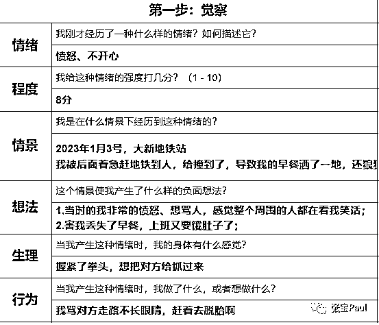

# 如何通过记录情绪日志，最终战胜不合理的情绪“信念”

> 原文：[`www.yuque.com/for_lazy/thfiu8/nugabghq4kqgwmig`](https://www.yuque.com/for_lazy/thfiu8/nugabghq4kqgwmig)

## (19 赞)如何通过记录情绪日志，最终战胜不合理的情绪“信念” 

作者： 小宝 

日期：2023-07-19 

START 

前言 

情绪的本身无好坏，它是我们身体给我们发出的信号，所以合理的解读情绪是非常有必要的。 

 

但如果我们长期处于某种情绪中，我们就要当心了。比如迷茫、焦虑这类情绪，短时间并无大碍。它是在告诉我们，当下遇到了事情，打破了我们原有的宁静，也许是突如其来的公司裁员，短时间找不到合适的工作；也许是你觉得工作太压抑了，不快乐，想重新换一份工作.... 

这个时候，情绪是在告诉我们，你需要做出改变了，需要行动起来，才能解决这些新的问题。 

但如果你长期处于焦虑、迷茫、痛苦、不开心、压抑...的状态中，你可就要小心了。因为任由他们的发展，会让你的生活越来越糟糕。 

ONE 

做情绪日记 

今天和大家分享一个非常好用的工具，就是坚持做“情绪日记”来帮助大家走出负面情绪的泥潭。 

首先，我们要做的一件事情就是去觉察它，通过记录的方式，把自己的情绪状态给记录下来。然后再用旁观者的视角去看，去思考它们。 

大家可以参考这个模板来做填写： <ne-oli index-type="0"><ne-oli-i>1</ne-oli-i><ne-oli-c class="ne-oli-content" id="ubcef426d" data-lake-id="ubcef426d">情绪：我刚才经历了一种什么样的情绪？如何描述它？</ne-oli-c></ne-oli> <ne-oli index-type="0"><ne-oli-i>2</ne-oli-i><ne-oli-c class="ne-oli-content" id="u9536fda4" data-lake-id="u9536fda4">程度：我给这种情绪的强度打几分？（1 - 10）</ne-oli-c></ne-oli> <ne-oli index-type="0"><ne-oli-i>3</ne-oli-i><ne-oli-c class="ne-oli-content" id="u928c3486" data-lake-id="u928c3486">情景：我是在什么情景下经历到这种情绪的？</ne-oli-c></ne-oli> <ne-oli index-type="0"><ne-oli-i>4</ne-oli-i><ne-oli-c class="ne-oli-content" id="u1b8e7a91" data-lake-id="u1b8e7a91">想法：这个情景使我产生了什么样的负面想法？</ne-oli-c></ne-oli> <ne-oli index-type="0"><ne-oli-i>5</ne-oli-i><ne-oli-c class="ne-oli-content" id="ua14d3ad5" data-lake-id="ua14d3ad5">生理：当我产生这种情绪时，我的身体有什么感觉？</ne-oli-c></ne-oli> <ne-oli index-type="0"><ne-oli-i>6</ne-oli-i><ne-oli-c class="ne-oli-content" id="u44b4aebe" data-lake-id="u44b4aebe">行为：当我产生这种情绪时，我做了什么，或者想做什么？</ne-oli-c></ne-oli> 

举例： 

小王上地铁时，被后来的人撞了下，导致自己的早餐掉了一地。虽然最后地面由地铁工作人员清理了，但自己这一天都非常郁闷，工作也是无精打采的。于是，下班后，小王开始打开电脑记录下了自己的情绪状况。 

 

这个日记的作用就是协助你用客观的事实来记录自己，然后用理性的眼来帮助你审视自己的内心，找到你在面临这些场景时，为什么会产生这些想法、情绪的来源，从更高的视角来看待、觉察自己的状态。 

而这样的记录，我们往往需要持续去做，比如坚持 1 个月，每天记录自己的情况状况，定期的用理性的眼去审视它。 

TWO 

消解情绪 

前面我们，已经记录下了我们的情绪，接下来我们就是要理性地去分析情绪。 

我们可以问问自己这 4 个问题来帮助我们分析： <ne-oli index-type="0"><ne-oli-i>1</ne-oli-i><ne-oli-c class="ne-oli-content" id="u997fd5e4" data-lake-id="u997fd5e4">支持：有哪些支持我负面想法的证据？</ne-oli-c></ne-oli> <ne-oli index-type="0"><ne-oli-i>2</ne-oli-i><ne-oli-c class="ne-oli-content" id="u5a944de1" data-lake-id="u5a944de1">反对：有哪些反对我负面想法的证据？</ne-oli-c></ne-oli> <ne-oli index-type="0"><ne-oli-i>3</ne-oli-i><ne-oli-c class="ne-oli-content" id="ubd4014b6" data-lake-id="ubd4014b6">反思：如果是我朋友遭受到这样的情景，我会对他说什么？</ne-oli-c></ne-oli> <ne-oli index-type="0"><ne-oli-i>4</ne-oli-i><ne-oli-c class="ne-oli-content" id="u6301caf2" data-lake-id="u6301caf2">再定义：经过了这段时间和思考，如果现在重新给当时的「严重程度」打分，我会打几分？（1 - 10）</ne-oli-c></ne-oli> 

继续上述案例： 

 

就是这个自我消解、自我分析的过程，我们把场景的场景进行还原，用理性的视角去审视每一个细节，然后再给出一个全新的解读，就像此刻，小王的愤怒值已经从 8 分下降到了 5 分。 

这就是一个非常好的开始，当我们逐渐养成这个习惯后，你会发现那些曾经出现在你生活中，让你很难受、郁闷、不开心、暴躁、愤怒的情景，其实大部分都是来源于自己当时的心态是怎么去看待这个事情的。 

事实上，情况其实并没有你想得那么糟糕，大部分都是你自我的“加戏”。 

这就是一个不断【训练】的过程。 

用“理性”代替“感性”，借助表格的梳理，让自己一次又一次地看清事实的真相。从一个旁观者的视角来看待，每一个场景下发生在你身上的事情。 

在这反复的训练下，今后当你再遇见这类熟悉的场景时，你就不会再像曾经那样，受控于情绪大脑的影响而开始暴躁、愤怒，而是立刻转化为理性的视角来看待问题，来控制自己当下的行为。 

THREE 

定期整理归纳，找根源 

当你的记录越来越多的时候，你就可以把他们都统统打印出来。然后从中去寻找“共性”的东西，去进行提炼，顺藤摸瓜找出问题的根源。 

举例： 

小王通过定期的检查，发现自己在一些有挑战的工作任务这类的场景时，都会感觉到非常的有压力，所以错过了多次升职加薪的机会。 

通过不断地审视自己，发现自己在面对挑战的时候，就会不自觉得选择逃避。再继续往深处觉察，这样思维模式的背后是因为自己害怕失败，怕失败了，自己就没有用了。 

为什么会这样呢，在小王的持续记录和审视下，终于摸到了问题的根源。原来是小时候每次碰到有难度的作业的时候，自己没有做好，妈妈就会骂他，说他很笨，做不会，就不许吃饭。 

正是因为这样，所以每当有难度的作业出现时，小王都会找工作借口来忽悠过去，从而避免妈妈的责罚。这也在小王的成长过程中，逐步地被建立起来了这样的[不合理的信念]，才导致一出现有挑战的东西，小王的第一反应就是逃避。 

这一步很难，它需要你不断地和自我对话，去审视自己，直到找到它，并直面它，才能最终战胜它。 

FOUR 

试着战胜它 

这个时候我们找到了问题的根源所在，接下来我们要做的就是去制订计划，让自己改变这曾经的思维模式，去改变它。 

这一点很难，因为它是随我们多年的成长而不断根深蒂固下来的，不是短时间可以改变的。所以，你最好有一个心理准备，就像前面坚持记录情绪状态那样。 

给自己些时间，制定合理的计划，我们一步一步地来攻克它。 

 

举例 

现状：每当有新的工作挑战时，我总是会选择放弃。 

程度：放弃值 9 分。 

行动：下次再出现这样的场景时，我尝试和老板说:好的老板，我试试。 

目标：通过尝试去做，打破自己每次都会选择逃避的限制性信念，并通过去做，去还原事情最真实的面貌。 

结果：过程中，我依然遇到了很多难题，也多次想放弃，但好在我坚持了下来，虽然做得不是很完美，但也没有想象中的那么难，老板还夸奖我在项目管理上有天赋，正是得益于此，老板又给了我新的工作机会。老板也没有想象中那样，我要没有做好，就会打击、批评我。 

去执行后的程度：我感觉放弃值，可以打 5 分了（开心） 

这样的行动计划，你需要做很多次，请不要期待做一次就有成效。同样地给自己些时间，通过你一次又一次地练习，你已经开始慢慢脱离你原来的思维模式。 

开始重新点掌控自己的大脑，在面对问题的时候，理性地分析。而不再是像以前一样，自己还没有真正的思考，习惯性的思维就已经替你做出了决定。 

飞书链接（含情绪觉察日志模板）： 

https://imste3bktg.feishu.cn/docx/JTiXdb1MCoI5L9xYoBncksvHneg?from=from_copylink 

评论区： 

暂无评论 

  