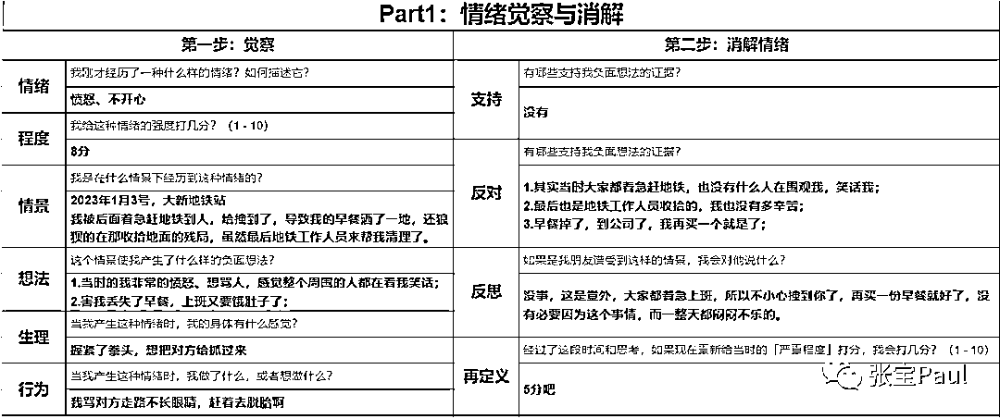
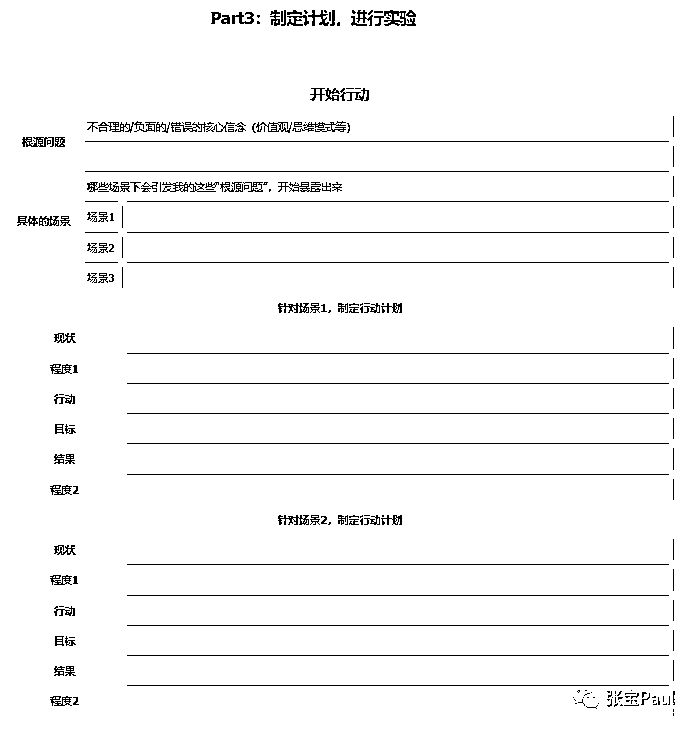

# 如何通过记录情绪日志，最终战胜不合理的情绪“信念”

> 原文：[`www.yuque.com/for_lazy/thfiu8/nugabghq4kqgwmig`](https://www.yuque.com/for_lazy/thfiu8/nugabghq4kqgwmig)

<ne-h2 id="3c67e157" data-lake-id="3c67e157"><ne-heading-ext><ne-heading-anchor></ne-heading-anchor><ne-heading-fold></ne-heading-fold></ne-heading-ext><ne-heading-content><ne-text id="u4a31b0fe">(19 赞)如何通过记录情绪日志，最终战胜不合理的情绪“信念”</ne-text></ne-heading-content></ne-h2> <ne-p id="u633d13b6" data-lake-id="u633d13b6"><ne-text id="ub13c98a4">作者： 小宝</ne-text></ne-p> <ne-p id="u5ea7d976" data-lake-id="u5ea7d976"><ne-text id="u2d89846e">日期：2023-07-19</ne-text></ne-p> <ne-p id="u1af625f3" data-lake-id="u1af625f3"><ne-text id="u7dc7fb25" ne-bold="true">START</ne-text></ne-p> <ne-p id="u066dab69" data-lake-id="u066dab69"><ne-text id="u262cc927" ne-bold="true">前言</ne-text></ne-p> <ne-p id="u26df4e5c" data-lake-id="u26df4e5c"><ne-text id="udb6ca10e" ne-bold="true">情绪的本身无好坏，它是我们身体给我们发出的信号，所以合理的解读情绪是非常有必要的。</ne-text></ne-p> <ne-p id="u77530f50" data-lake-id="u77530f50"><ne-card data-card-name="image" data-card-type="inline" id="ZDQuj" data-event-boundary="card"></ne-card></ne-p> <ne-p id="udcb2034d" data-lake-id="udcb2034d"><ne-text id="u96a30ad9" ne-bold="true">但如果我们长期处于某种情绪中，我们就要当心了。比如迷茫、焦虑这类情绪，短时间并无大碍。它是在告诉我们，当下遇到了事情，打破了我们原有的宁静，也许是突如其来的公司裁员，短时间找不到合适的工作；也许是你觉得工作太压抑了，不快乐，想重新换一份工作....</ne-text></ne-p> <ne-p id="u37a3b1ca" data-lake-id="u37a3b1ca"><ne-text id="udffbf83a" ne-bold="true">这个时候，情绪是在告诉我们，你需要做出改变了，需要行动起来，才能解决这些新的问题。</ne-text></ne-p> <ne-p id="u1ef3342f" data-lake-id="u1ef3342f"><ne-text id="ua5d7ff96" ne-bold="true">但如果你长期处于焦虑、迷茫、痛苦、不开心、压抑...的状态中，你可就要小心了。因为任由他们的发展，会让你的生活越来越糟糕。</ne-text></ne-p> <ne-p id="u8300a167" data-lake-id="u8300a167"><ne-text id="u1e78d580" ne-bold="true">ONE</ne-text></ne-p> <ne-p id="u132c9bb7" data-lake-id="u132c9bb7"><ne-text id="u67505bd7" ne-bold="true">做情绪日记</ne-text></ne-p> <ne-p id="uf49785c2" data-lake-id="uf49785c2"><ne-text id="u0ce40448" ne-bold="true">今天和大家分享一个非常好用的工具，就是坚持做“情绪日记”来帮助大家走出负面情绪的泥潭。</ne-text></ne-p> <ne-p id="u94920c14" data-lake-id="u94920c14"><ne-text id="ua62f1ecc" ne-bold="true">首先，我们要做的一件事情就是去觉察它，通过记录的方式，把自己的情绪状态给记录下来。然后再用旁观者的视角去看，去思考它们。</ne-text></ne-p> <ne-p id="u43f02791" data-lake-id="u43f02791"><ne-text id="u1b3ee204" ne-bold="true">大家可以参考这个模板来做填写：</ne-text></ne-p> <ne-oli index-type="0"><ne-oli-i>1</ne-oli-i><ne-oli-c class="ne-oli-content" id="ubcef426d" data-lake-id="ubcef426d"><ne-text id="u841ae404" style="color: rgb(51, 51, 51);">情绪：我刚才经历了一种什么样的情绪？如何描述它？</ne-text></ne-oli-c></ne-oli> <ne-oli index-type="0"><ne-oli-i>2</ne-oli-i><ne-oli-c class="ne-oli-content" id="u9536fda4" data-lake-id="u9536fda4"><ne-text id="u071c9c46" style="color: rgb(51, 51, 51);">程度：我给这种情绪的强度打几分？</ne-text><ne-text id="u0f6bd419" style="color: rgb(136, 136, 136);">（1 - 10）</ne-text></ne-oli-c></ne-oli> <ne-oli index-type="0"><ne-oli-i>3</ne-oli-i><ne-oli-c class="ne-oli-content" id="u928c3486" data-lake-id="u928c3486"><ne-text id="u55f1325c" style="color: rgb(51, 51, 51);">情景：我是在什么情景下经历到这种情绪的？</ne-text></ne-oli-c></ne-oli> <ne-oli index-type="0"><ne-oli-i>4</ne-oli-i><ne-oli-c class="ne-oli-content" id="u1b8e7a91" data-lake-id="u1b8e7a91"><ne-text id="u32c92e92" style="color: rgb(51, 51, 51);">想法：这个情景使我产生了什么样的负面想法？</ne-text></ne-oli-c></ne-oli> <ne-oli index-type="0"><ne-oli-i>5</ne-oli-i><ne-oli-c class="ne-oli-content" id="ua14d3ad5" data-lake-id="ua14d3ad5"><ne-text id="u32b9de07" style="color: rgb(51, 51, 51);">生理：当我产生这种情绪时，我的身体有什么感觉？</ne-text></ne-oli-c></ne-oli> <ne-oli index-type="0"><ne-oli-i>6</ne-oli-i><ne-oli-c class="ne-oli-content" id="u44b4aebe" data-lake-id="u44b4aebe"><ne-text id="ue4a667dc" style="color: rgb(51, 51, 51);">行为：当我产生这种情绪时，我做了什么，或者想做什么？</ne-text></ne-oli-c></ne-oli> <ne-p id="uaf22565f" data-lake-id="uaf22565f"><ne-text id="u8062dc0a" ne-bold="true">举例：</ne-text></ne-p> <ne-p id="uc2aac56a" data-lake-id="uc2aac56a"><ne-text id="u4a6651f8" ne-bold="true">小王上地铁时，被后来的人撞了下，导致自己的早餐掉了一地。虽然最后地面由地铁工作人员清理了，但自己这一天都非常郁闷，工作也是无精打采的。于是，下班后，小王开始打开电脑记录下了自己的情绪状况。</ne-text></ne-p> <ne-p id="uccce88c1" data-lake-id="uccce88c1"><ne-card data-card-name="image" data-card-type="inline" id="WapD4" data-event-boundary="card"></ne-card></ne-p> <ne-p id="u13872131" data-lake-id="u13872131"><ne-text id="u7b2369f6" ne-bold="true">这个日记的作用就是协助你用客观的事实来记录自己，然后用理性的眼来帮助你审视自己的内心，找到你在面临这些场景时，为什么会产生这些想法、情绪的来源，从更高的视角来看待、觉察自己的状态。</ne-text></ne-p> <ne-p id="u35237ad5" data-lake-id="u35237ad5"><ne-text id="u84e50ccf" ne-bold="true">而这样的记录，我们往往需要持续去做，比如坚持 1 个月，每天记录自己的情况状况，定期</ne-text><ne-text id="u26c06229" ne-bold="true">的</ne-text><ne-text id="ub56fe06c" ne-bold="true">用理性的眼去审视它。</ne-text></ne-p> <ne-p id="u85f58781" data-lake-id="u85f58781"><ne-text id="u55a06a7d" ne-bold="true">TWO</ne-text></ne-p> <ne-p id="ufd869c12" data-lake-id="ufd869c12"><ne-text id="ub9692b95" ne-bold="true">消解情绪</ne-text></ne-p> <ne-p id="ub5501ec1" data-lake-id="ub5501ec1"><ne-text id="u443cbe29" ne-bold="true">前面我们，已经记录下了我们的情绪，接下来我们就是要理性</ne-text><ne-text id="ue0f755b2" ne-bold="true">地</ne-text><ne-text id="u78a1ce7d" ne-bold="true">去分析情绪。</ne-text></ne-p> <ne-p id="ud46449c4" data-lake-id="ud46449c4"><ne-text id="u6fe81748" ne-bold="true">我们可以问问自己这 4 个问题来帮助我们分析：</ne-text></ne-p> <ne-oli index-type="0"><ne-oli-i>1</ne-oli-i><ne-oli-c class="ne-oli-content" id="u997fd5e4" data-lake-id="u997fd5e4"><ne-text id="u56321a2d" style="color: rgb(51, 51, 51);">支持：有哪些支持我负面想法的证据？</ne-text></ne-oli-c></ne-oli> <ne-oli index-type="0"><ne-oli-i>2</ne-oli-i><ne-oli-c class="ne-oli-content" id="u5a944de1" data-lake-id="u5a944de1"><ne-text id="u53a1dcad" style="color: rgb(51, 51, 51);">反对：有哪些反对我负面想法的证据？</ne-text></ne-oli-c></ne-oli> <ne-oli index-type="0"><ne-oli-i>3</ne-oli-i><ne-oli-c class="ne-oli-content" id="ubd4014b6" data-lake-id="ubd4014b6"><ne-text id="ub1d4e133" style="color: rgb(51, 51, 51);">反思：如果是我朋友遭受到这样的情景，我会对他说什么？</ne-text></ne-oli-c></ne-oli> <ne-oli index-type="0"><ne-oli-i>4</ne-oli-i><ne-oli-c class="ne-oli-content" id="u6301caf2" data-lake-id="u6301caf2"><ne-text id="u7c34465d" style="color: rgb(51, 51, 51);">再定义：经过了这段时间和思考，如果现在重新给当时的「严重程度」打分，我会打几分？</ne-text><ne-text id="ud92c75e3" style="color: rgb(136, 136, 136);">（1 - 10）</ne-text></ne-oli-c></ne-oli> <ne-p id="uaec8f1c7" data-lake-id="uaec8f1c7"><ne-text id="uf1d766c0">继续上述案例：</ne-text></ne-p> <ne-p id="u65e5a96d" data-lake-id="u65e5a96d"><ne-card data-card-name="image" data-card-type="inline" id="yDYeJ" data-event-boundary="card"></ne-card></ne-p> <ne-p id="ue578e8a7" data-lake-id="ue578e8a7"><ne-text id="u0833d751" ne-bold="true">就是这个自我消解、自我分析的过程，我们把场景的场景进行还原，用理性的视角去审视每一个细节，然后再给出一个全新的解读，就像此刻，小王的愤怒值已经从 8 分下降到了 5 分。</ne-text></ne-p> <ne-p id="uae6084cc" data-lake-id="uae6084cc"><ne-text id="u89bdf0fa" ne-bold="true">这就是一个非常好的开始，当我们逐渐养成这个习惯后，你会发现那些曾经出现在你生活中，让你很难受、郁闷、不开心、暴躁、愤怒的情景，其实大部分都是来源于自己当时的心态是怎么去看待这个事情的。</ne-text></ne-p> <ne-p id="u2778e781" data-lake-id="u2778e781"><ne-text id="ufa995a0f" ne-bold="true">事实上，情况其实并没有你想</ne-text><ne-text id="u35969255" ne-bold="true">得</ne-text><ne-text id="uf19c25de" ne-bold="true">那么糟糕，大部分都是你自我的“加戏”。</ne-text></ne-p> <ne-p id="u2a2903ce" data-lake-id="u2a2903ce"><ne-text id="u01fbefaf" ne-bold="true">这就是一个不断【训练】的过程。</ne-text></ne-p> <ne-p id="u845b778a" data-lake-id="u845b778a"><ne-text id="u13aa9762" ne-bold="true">用“理性”代替“感性”，借助表格的梳理，让自己一次又一次</ne-text><ne-text id="u3f07a68e" ne-bold="true">地</ne-text><ne-text id="uff02b2ed" ne-bold="true">看清事实的真相。从一个旁观者的视角来看待，每一个场景下发生在你身上的事情。</ne-text></ne-p> <ne-p id="uc92c92a0" data-lake-id="uc92c92a0"><ne-text id="uf1b793d4" ne-bold="true">在这反复的训练下，今后当你</ne-text><ne-text id="ubfab3c9b" ne-bold="true">再</ne-text><ne-text id="u85cd8c06" ne-bold="true">遇见这类熟悉的场景时，你就不会再像曾经那样，受控于情绪大脑的影响而开始暴躁、愤怒，而是立刻转化为理性的视角来看待问题，来控制自己当下的行为。</ne-text></ne-p> <ne-p id="u3b1794e2" data-lake-id="u3b1794e2"><ne-text id="u2608604b" ne-bold="true">THREE</ne-text></ne-p> <ne-p id="ud852e6f3" data-lake-id="ud852e6f3"><ne-text id="u72af670b" ne-bold="true">定期整理归纳，找根源</ne-text></ne-p> <ne-p id="ud0823638" data-lake-id="ud0823638"><ne-text id="uaecef1ad" ne-bold="true">当你的记录越来越多的时候，你就可以把他们都统统打印出来。然后从中去寻找“共性”的东西，去进行提炼，顺藤摸瓜找出问题的根源。</ne-text></ne-p> <ne-p id="udbdbca74" data-lake-id="udbdbca74"><ne-text id="u24c4a8c7">举例：</ne-text></ne-p> <ne-p id="u1d52435b" data-lake-id="u1d52435b"><ne-text id="u7d026690" ne-bold="true">小王通过定期的检查，发现自己在一些有挑战的工作任务这类的场景时，都会感觉到非常的有压力，所以错过了多次升职加薪的机会。</ne-text></ne-p> <ne-p id="u08df99b5" data-lake-id="u08df99b5"><ne-text id="u8ef12076" ne-bold="true">通过不断</ne-text><ne-text id="u0d2cda73" ne-bold="true">地</ne-text><ne-text id="ua9ba521d" ne-bold="true">审视自己，发现自己在面对挑战的时候，就会不自觉</ne-text><ne-text id="ue4952614" ne-bold="true">得</ne-text><ne-text id="u94b58177" ne-bold="true">选择逃避。再继续往深处觉察，这样思维模式的背后是因为自己害怕失败，怕失败了，自己就没有用了。</ne-text></ne-p> <ne-p id="u3ab28659" data-lake-id="u3ab28659"><ne-text id="u38d2dff2" ne-bold="true">为什么会这样呢，在小王的持续记录和审视下，终于摸到了问题的根源。原来是小时候每次碰到有难度的作业的时候，自己没有做好，妈妈就会骂他，说他很笨，做不会，就不许吃饭。</ne-text></ne-p> <ne-p id="u290392ca" data-lake-id="u290392ca"><ne-text id="uf9ad6506" ne-bold="true">正是因为这样，所以每当有难度的作业出现时，小王都会找工作借口来忽悠过去，从而避免妈妈的责罚。这也在小王的成长过程中，逐步</ne-text><ne-text id="u6334ae1d" ne-bold="true">地</ne-text><ne-text id="u4186e306" ne-bold="true">被建立起来了这样的[不合理的信念]，才导致一出现有挑战的东西，小王的第一反应就是逃避。</ne-text></ne-p> <ne-p id="u72cf34de" data-lake-id="u72cf34de"><ne-text id="u5fb0bff8" ne-bold="true">这一步很难，它需要你不断</ne-text><ne-text id="u8a626a93" ne-bold="true">地</ne-text><ne-text id="u83cc874c" ne-bold="true">和自我对话，去审视自己，直到找到它，并直面它，才能最终战胜它。</ne-text></ne-p> <ne-p id="ua73d35ab" data-lake-id="ua73d35ab"><ne-text id="ue59aec89" ne-bold="true">FOUR</ne-text></ne-p> <ne-p id="ueccb591c" data-lake-id="ueccb591c"><ne-text id="u8dadd589" ne-bold="true">试着战胜它</ne-text></ne-p> <ne-p id="ubc2258fc" data-lake-id="ubc2258fc"><ne-text id="u1a82ed76" ne-bold="true">这个时候我们找到了问题的根源所在，接下来我们要做的就是去制</ne-text><ne-text id="uefa719f5" ne-bold="true">订</ne-text><ne-text id="u9785abb2" ne-bold="true">计划，让自己改变这曾经的思维模式，去改变它。</ne-text></ne-p> <ne-p id="ub48c9f90" data-lake-id="ub48c9f90"><ne-text id="u083d73ce" ne-bold="true">这一点很难，因为它是随我们多年的成长而不断根深蒂固下来的，不是短时间可以改变的。所以，你最好有一个心理准备，就像前面坚持记录情绪状态那样。</ne-text></ne-p> <ne-p id="uf94d1a4c" data-lake-id="uf94d1a4c"><ne-text id="u620e3344" ne-bold="true">给自己些时间，制定合理的计划，我们一步一步</ne-text><ne-text id="u9091e7b3" ne-bold="true">地</ne-text><ne-text id="ub001071d" ne-bold="true">来攻克它。</ne-text></ne-p> <ne-p id="uc0acc81a" data-lake-id="uc0acc81a"><ne-card data-card-name="image" data-card-type="inline" id="nWZhh" data-event-boundary="card"></ne-card></ne-p> <ne-p id="ucc86643c" data-lake-id="ucc86643c"><ne-text id="udd7258ab">举例</ne-text></ne-p> <ne-p id="u955302f6" data-lake-id="u955302f6"><ne-text id="u2fb5c12e">现状：每当有新的工作挑战时，我总是会选择放弃。</ne-text></ne-p> <ne-p id="uc058951a" data-lake-id="uc058951a"><ne-text id="u2524c4d0">程度：放弃值 9 分。</ne-text></ne-p> <ne-p id="u0b9c6388" data-lake-id="u0b9c6388"><ne-text id="u3c4c7c25">行动：下次再出现这样的场景时，我尝试和老板说:好的老板，我试试。</ne-text></ne-p> <ne-p id="u86c4bc5a" data-lake-id="u86c4bc5a"><ne-text id="u95949fa6">目标：通过尝试去做，打破自己每次都会选择逃避的限制性信念，并通过去做，去还原事情最真实的面貌。</ne-text></ne-p> <ne-p id="ufa739e74" data-lake-id="ufa739e74"><ne-text id="u80d84ecb" style="background-color: rgb(255, 255, 255);">结果：过程中，我依然遇到了很多难题，也多次想放弃，但好在我坚持了下来，虽然做</ne-text><ne-text id="ued3630b3">得</ne-text><ne-text id="ud5d10db1" style="background-color: rgb(255, 255, 255);">不是很完美，但也没有想象中的那么难，老板还夸奖我在项目管理上有天赋，正是得益于此，老板又给了我新的工作机会。老板也没有想象中那样，我要没有做好，就会打击、批评我。</ne-text></ne-p> <ne-p id="u47614e4d" data-lake-id="u47614e4d"><ne-text id="uf11da37e">去执行后的程度：我感觉放弃值，可以打 5 分了（开心）</ne-text></ne-p> <ne-p id="u78fbdaff" data-lake-id="u78fbdaff"><ne-text id="ue848f594" ne-bold="true">这样的行动计划，你需要做很多次，请</ne-text><ne-text id="u525d4dc7" ne-bold="true">不</ne-text><ne-text id="ua3f3d11f" ne-bold="true">要期待做一次就有成效。同样</ne-text><ne-text id="ub383e531" ne-bold="true">地</ne-text><ne-text id="u65167086" ne-bold="true">给自己些时间，通过你一次又一次地练习，你已经开始慢慢脱离你原来的思维模式。</ne-text></ne-p> <ne-p id="udd477803" data-lake-id="udd477803"><ne-text id="u1c791078" ne-bold="true">开始重新点掌控自己的大脑，在面对问题的时候，理性</ne-text><ne-text id="ueefe7a4c" ne-bold="true">地</ne-text><ne-text id="uc1b7568d" ne-bold="true">分析。而不再是像以前一样，自己还没有真正</ne-text><ne-text id="uf396aff4" ne-bold="true">的</ne-text><ne-text id="u09086d27" ne-bold="true">思考，习惯性的思维就已经替你做出了决定。</ne-text></ne-p> <ne-p id="u97e512ed" data-lake-id="u97e512ed"><ne-text id="udaf2f43a">飞书链接（含情绪觉察日志模板）：</ne-text></ne-p> <ne-p id="u28c287b0" data-lake-id="u28c287b0"><ne-text id="ud8bb8c73">https://imste3bktg.feishu.cn/docx/JTiXdb1MCoI5L9xYoBncksvHneg?from=from_copylink</ne-text></ne-p> <ne-hole id="ud0055eee" data-lake-id="ud0055eee"><ne-card data-card-name="hr" data-card-type="block" id="gA9Fk" data-event-boundary="card"><ne-p id="u2be018f0" data-lake-id="u2be018f0"><ne-text id="u3544b6e8">评论区：</ne-text></ne-p> <ne-p id="uff12a0d6" data-lake-id="uff12a0d6"><ne-text id="u7d5f5bcf">暂无评论</ne-text></ne-p> <ne-p id="u0b874bc6" data-lake-id="u0b874bc6"><ne-card data-card-name="image" data-card-type="inline" id="nxCyu" data-event-boundary="card">  <ne-hole id="u9d6c07ad" data-lake-id="u9d6c07ad"><ne-card data-card-name="hr" data-card-type="block" id="UoIwi" data-event-boundary="card"></ne-card></ne-hole></ne-card></ne-p></ne-card></ne-hole>