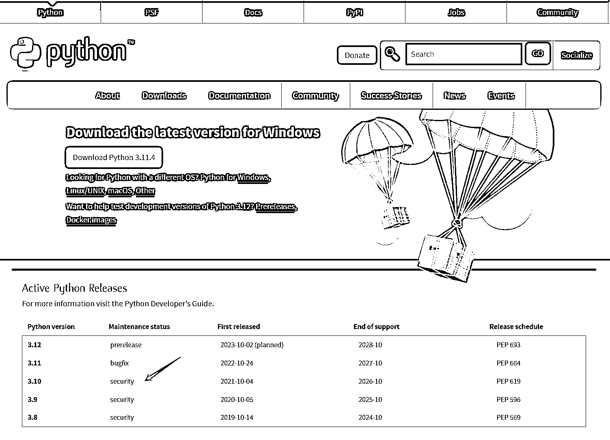
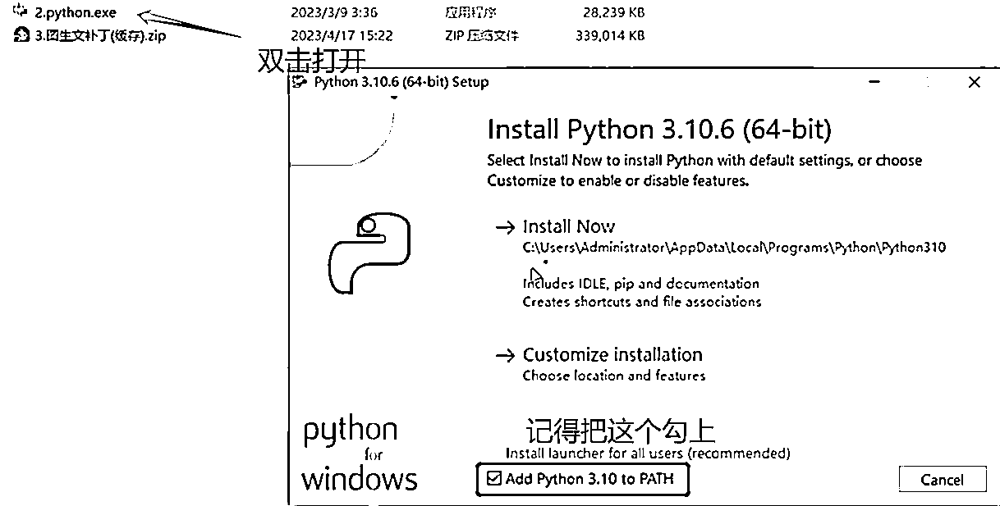
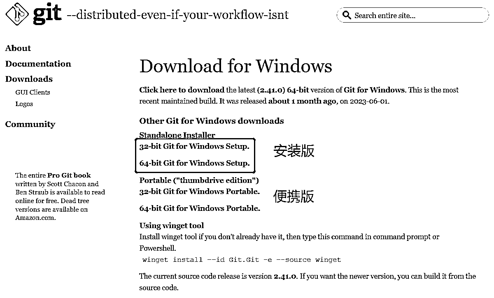
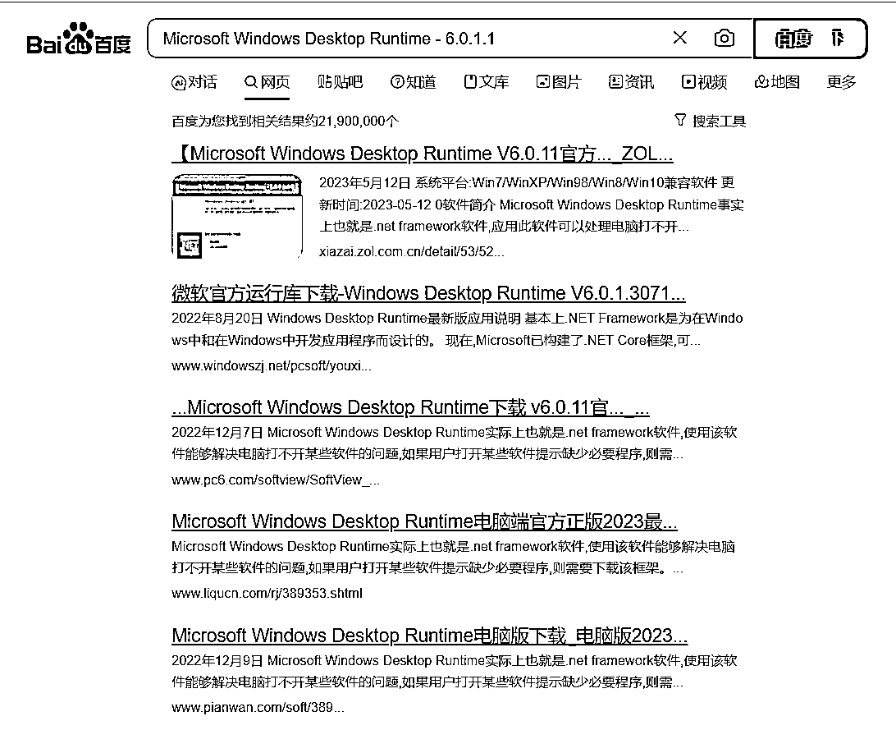
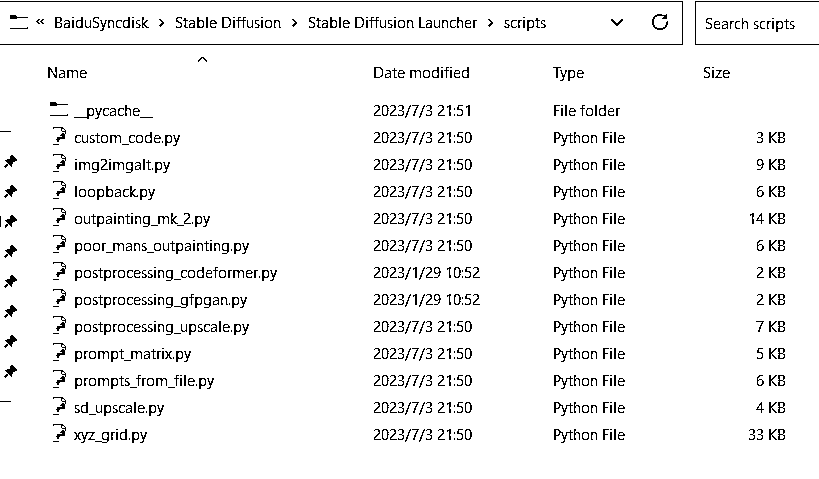
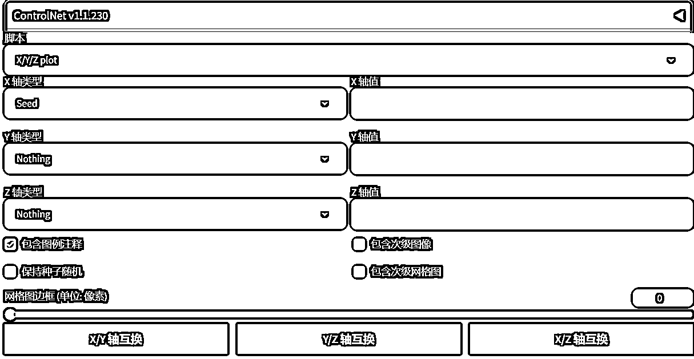
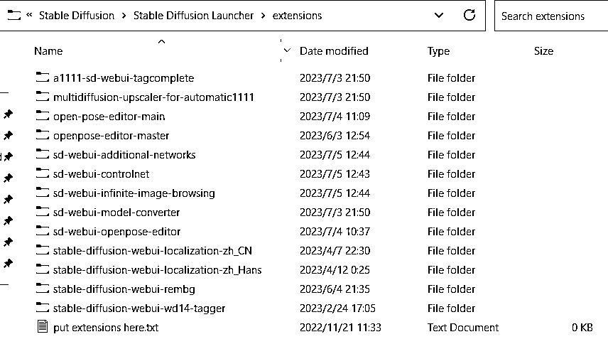

# Stable Diffusion 六脉神剑，小白的福音

> 原文：[`www.yuque.com/for_lazy/thfiu8/kd749lu65bisgxpe`](https://www.yuque.com/for_lazy/thfiu8/kd749lu65bisgxpe)

## (49 赞)Stable Diffusion 六脉神剑，小白的福音 

作者： Chris LEN 

日期：2023-07-20 

如果你是一个 Stable Diffusion 的小白，那么你一定要看完这篇文章，这篇文章就像一张地图，看完你就知道自己到底身在 Stable Diffusion 的哪个板块。 

从来没有在生财写过文章，因为自己不爱写，近来因为专注 Stable Diffusion 绘画，经过挑灯近 20 来天的学习，学习记录了一篇高达 30000 字记录，本来是自己记录看的（因为 CTRL+F 查找很方便），结果越来越多，后来干脆就做成了教程，目前已经 31484 个字，还在小部分在更新中，采用云文档，这样就保证了有最新的技术和信息都可以随时更新。 

       而经过系统的学习，我从一个小白到了一个大白，所以特别明白小白看到Stable Diffusion 那些各种各样的设置，选项，插件等等是什么感受，直接就是云里雾里。想想自己才学的时候也是这样，所以就总结了这篇短文。话不多说我们直接开始。 

 

       Stable Diffusion 具体是什么？我们就不在这里多说了，总的来说就是一个靠自己打字，然后通过 Stable Diffusion 这个工具，利用 Ai 技术，根据你输出的文字内容及配套的资源，来形成图片的系统。 

而 Stable Diffusion 总体来说由 6 个维度构成，我们就简单地把这 6 个维度称之为“六脉神剑”吧。要学好 Stable Diffusion，那么一定要先清楚这 6 个维度是什么？ 

       它们分别是环境，参数，模组，脚本，插件（扩展）和提示词，让我一一开始。 <ne-h3 id="052c6665" data-lake-id="052c6665">1. 环境</ne-h3> 

       首先我们要能够使用 Stable Diffusion，环境就要匹配，有些人也称之为依赖。这个环境实际上有两种，硬环境和软环境，硬环境就是说自己的电脑硬件基础，软环境就是需要安装的前置组件或生态。 

就类似说你要剖腹生孩子，除了产房、医生和医疗器械这些硬环境条件要达标外，这接生技术还必须到位，否则你就肯定噶了，就是这个道理。而接生技术、产房温度等等之类的东西就可以理解为软环境，我们先看看硬环境需要什么？ <ne-h4 id="8e882c59" data-lake-id="8e882c59">1.1.硬环境</ne-h4> 

       硬环境就是说电脑的硬件配置了，Stable Diffusion 运行推荐配置如下： 

       内存：不低于 16 GB DDR4 或 DDR5 

       存储：不低于 10 GB 可用空间 

       GPU：N 卡，不低于 6 GB 显存 

       我们现在通常用的秋叶的整合包，运行推荐配置如下： 

       操作系统: windows10 以上 

       CPU: 不做强制性要求 

       内存: 推荐 8G 以上 

       显卡:必须是 Nvidia 的独立显卡,显存最低 4G,推荐 20 系以后 

       A 卡、核显只能用 CPU 跑 

       整合包推荐放在固态硬盘中，提升模型加载速度 

       配置不够的，可以在云主机上运行。 

       关于硬盘，即储存空间，实际上 10G 远远不够，各种模型插件搞下来，也得好几十个 G，到后期上百 G 是非常容易的，所以最好搞个大点的地方来放相关的资源。 

《《《《《《硬盘推荐固态硬盘！！！》》》》》 

《《《《《《硬盘推荐固态硬盘！！！》》》》》 

《《《《《《硬盘推荐固态硬盘！！！》》》》》 <ne-h4 id="bdc06ccc" data-lake-id="bdc06ccc">1.2.软环境</ne-h4> 

       一共分为三个板块：Python、Git 和魔法上网 

题外话：推荐彻底卸载 360、金山、电脑管家之类的沙雕工具，还有安装这些东西的时候，它们给你附带安装的各种垃圾软件，这些东西会极大地消耗你的电脑性能，除了惹人讨厌外，毫无用处。 

       我们在使用 Stable Diffusion 之前，电脑里要先安装 Python 和 Git，否则就运行不起来，这两者是非常重要的前置软环境，也就是生态。 

       Python 下载地址： 

 

       下载 Python 3.10 以上就行了，但我截图的时候已经有了 3.11 和 12，但目前 3.10 以下显示是稳定版，所以我们就选用 3.10 就行了。 

鼠标往下滑，找到这个就行，网上大部分人推荐 3.10.6 或者 3.10.9。（不过我试了一下最 3.11.4 也没什么问题） 

 

       安装注意事项：看下图，然后点 Install Now，一直下一步，完事儿。 

 

       其次是 Git，下载地址： 

 

       下载安装版就好了，便携版我没有试过。 

       安装注意事项：无，就一直下一步 next、下一步 next、下一步 next 就行。 

       秋叶的整合包还需要一个微软的组件，就是 Microsoft Windows Desktop Runtime - 6.0.1.1，这个在本教程提供的整合包里有（整合包是免费的，后面会详细说到）。这个组件在网上很多地方也可以找到，百度一下就有了。 

 

       上面这些都匹配了的情况下，解压整合包，在里面找到 A 启动器.exe 双击即可。 

 <ne-h3 id="73da6fe9" data-lake-id="73da6fe9">2.参数</ne-h3> 

       点击以后就可以使用了，这里我们还是用秋叶的整合包举例，打开后点击一键启动。 

 

然后就会弹出来一个 CMD 界面，不用管它，但出错的时候，这里也记载了很多重要信息，所以如果遇到错误时，可以到这里来看看都有什么提示。 

 

       这个过程加载完以后，会自动打开一个网页，你会发现这个界面非常复杂（秋叶整合包已汉化）（每个人进去的界面可能不一样，比如下载秋叶整合包的，和从别的地方下载的可能都不一样，和自己从 0 到 1 配置的也不一样，这是因为他们在 UI 和插件上和本整合包不同，但后期使用大致都是相通的） 

 

       进去以后，我们就会发现，界面里面有非常非常多的参数，对不对？包含了什么迭代步数、采样方法、引导词系数等等等等。 

       而这些参数又跟模型，脚本，插件等等交叉混合使用，非常繁多复杂，这个只有同学们在使用的过程中慢慢地记，慢慢地试验，逐渐熟悉。 

       参数的详细讲解和推荐配置就先不在这里一一赘述了，因为比较多。 <ne-h3 id="9738769a" data-lake-id="9738769a">3. 模组</ne-h3> 

       Stable Diffusion 里面有很多的模型，而这些模型的都有各自不同的用途，主要分为五大类别。分别是 Checkpoint，Hypernetwork，Embedding(也叫 Textual Inversion)，Lora 和 VAE。在后续我们的讲解中，我们会讲解在何处下载模型，下载后存在哪里，如何使用等等。 

       很多地方统称他们为模型，我称之为模组的原因是，这些模型可以单独使用，也可以配套使用，有一些则必须要配套使用，可能是模型配套模型，模型配套脚本，模型配套插件，所以我把它们称之为模组更为贴切，你想怎么称呼都随便你了。 

       我们常用的模型就是 Checkpoint、Lora以及ControlNet，但 ControlNet 并不是模型之一，只是一个插件，这个我们后面会详细说明（其实早期版本的 Stable Diffusion，Lora 也是作为插件使用的）。模组的存放和使用等等也不在这个文章里多说，因为本文只是一个索引地图，让你明白方位即可。 <ne-h3 id="05e768eb" data-lake-id="05e768eb">4. 脚本</ne-h3> 

       Stable Diffusion 还有脚本功能，脚本也是 SD 里一个非常不同寻常的功能，它就像一个打工人一样，按照你的要求给出你要的东西，下图是存放目录。 

 

       脚本有什么用途呢？我们可以这样理解，它的用途就像玩游戏的时候给自己施加 Buff，给我们的武器附魔是一个道理。脚本，就是给 Stable Diffusion 的成品附魔的（看下去你就会明白了），而有时候有的武器，不附魔是无法使用的。 

       虽然每个脚本有不同的用途，但并不是每一次都一定要用才行的。 

       比如利用脚本，你可以生成这种连环漫画，但如果你只用模型则是不行的，所以我说这就是给你的成品附魔的，相当于给 Stable Diffusion 附魔说，我要你出的图是这种漫画，那么结合这个脚本，Stable Diffusion 就会出这样的漫画。这个生成漫画的脚本，我们后续也会说到。 

 

       比如说下面这个 X/Y/Z 图表的脚本，也有很多不同的用途，这里不会详细讲，因为正如之前说的，本文只是一个索引地图，让各位明白什么是什么即可，这个在教程里有详细讲解的。 

 <ne-h3 id="7cb06bc1" data-lake-id="7cb06bc1">5.插件/扩展</ne-h3> 

       除了模型和脚本以外，还有插件，插件就是扩展。 

脚本是给成品附魔的，那么插件就是给 Stable Diffusion 这套系统附魔的。就是说，通过插件，我们的 Stable Diffusion 就会有更多的功能，我们耳熟能详的 ControlNet 其实就是 Stable Diffusion 里的一个插件。 

       插件存储的位置是：SD 安装目录 > extensions  

 

第二种下载插件的办法就是，在 Stable Diffusion 里直接安装。 

 

       插件界面图，红色画框部分里有很多都是插件，比如有增强提示词的，编辑姿势的等等。 

 <ne-h3 id="d78cb8bb" data-lake-id="d78cb8bb">6.提示词</ne-h3> 

提示词，Prompt，有些地方也称之为关键词，也有人称之为咒语。不管叫什么了，反正我们只有通过提示词，才可以让 Stable Diffusion 明白我们需要什么样的图。 

       而提示词则分为正向提示词和反向提示词，正向提示词是告诉 Stable Diffusion 我们要什么，比如 best quality,4k,1girl，这就是告诉 Stable Diffusion 我们要画的内容里要包括最好画质，4K 分辨率，1 个女孩。 

       而反向提示词则可以是 Twisted fingers, multiple heads, multiple arms，当你把这个放进反向提示词里，则是告诉 Stable Diffusion，出的图不要扭曲的手指，不要三头六臂。 

 

       提示词怎么写，怎么写更快，也不在这里继续说了。 

       好了，关于 Stable Diffusion 的六脉神剑就讲完了，看完这一篇文章，想必作为一个小白的你，应该也明白自己薄弱的是哪一块了，如果有问题的，也可以提问，我都会回答的。 

评论区： 

无咎。 : 别的不说，360 和金山确实挺沙雕的[OK] Chris LEN : 腾讯电脑管家也不遑多让 生财大头 : 别的不说，引流高手 Chris LEN : 啥引流？我可没引流 

 