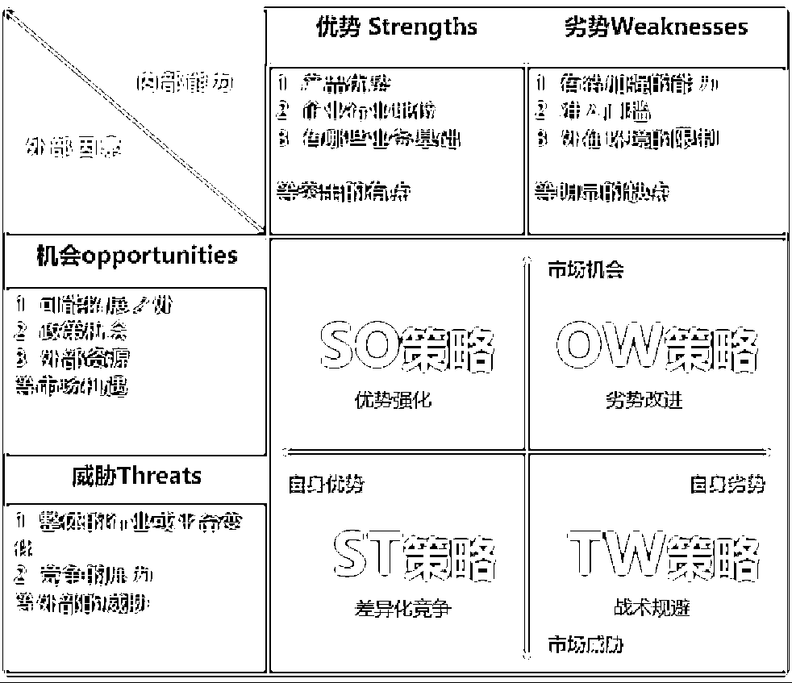
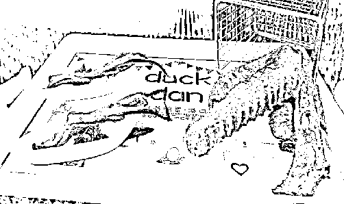
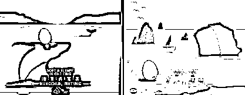
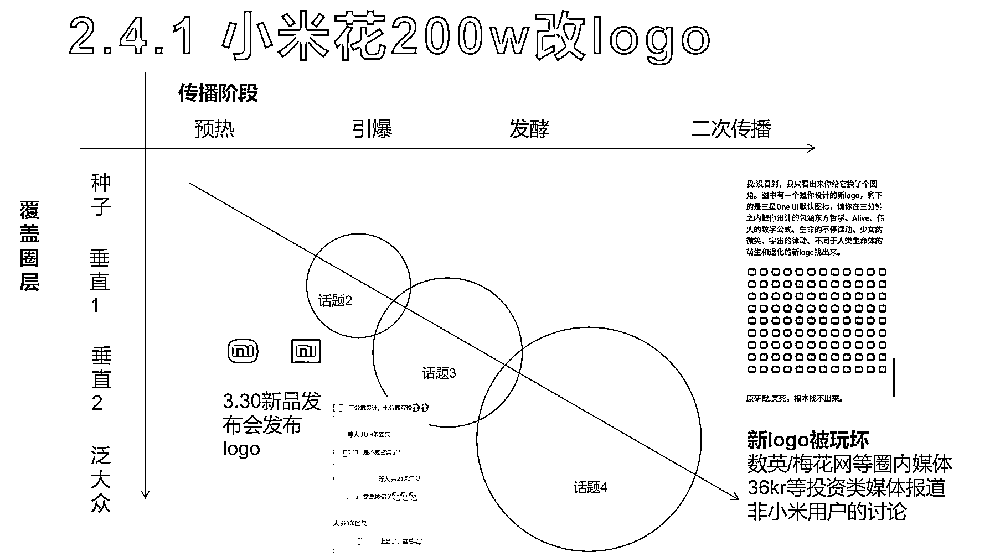
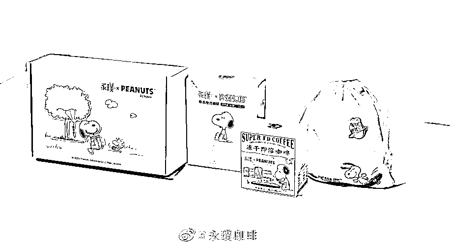
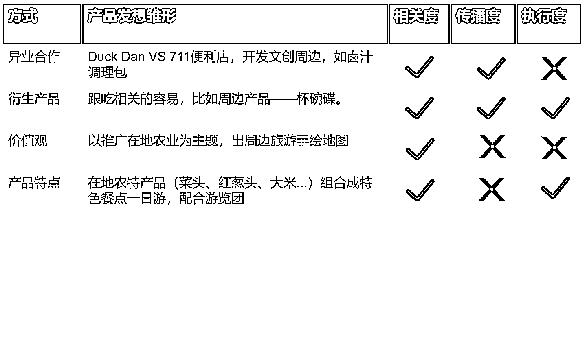

# 从 0 顾客到破百万收入，如何把一家初创小店做成当地知名品牌？

> 原文：[`www.yuque.com/for_lazy/thfiu8/zf4rzfxa2nllrio7`](https://www.yuque.com/for_lazy/thfiu8/zf4rzfxa2nllrio7)

## (37 赞)从 0 顾客到破百万收入，如何把一家初创小店做成当地知名品牌？ 

作者： 💪Chrys 

日期：2023-07-21 

做实业不比自媒体，需要金钱和精力的投入，更需要对用户和产品有深刻的理解。 

我曾经在台湾开了快 3 年的餐饮店，通过文创品牌玩法和用户导向的策略，从没有一个客人到链接各方资源，打开销路，营收百万，在高雄黄金地段买了套房，最后还把公司卖了几十万人民币。 

接下来我从产品和品牌的角度来分享，怎么让一家初创 2C 的小店做成当地出名的小品牌，打开市场吸引更多用户的，希望我这几年实体店的心路历程能够对大家有帮助。 

先说一下我们店的背景。 

店铺占地约 900 平方米，位于台湾的旅游观光景点恒春（垦丁附近）。当初以很低的租金（折合人民币约 2000 元/月）签了 5 年合同，花费近人民币 60w 进行改造，包括整地，做水电，做门店装置艺术、装潢等。 

 

做实业不比自媒体，真的很需要金钱和精力的投入！ 

创业过程中起起落落，也经历过疫情时期，从没有一个客人到链接各方资源，打开销路，实现破百万的收入。 

我从产品和品牌的角度来分享我是怎么让一家初创 2C 的小店做成当地出名的小品牌，并且打开市场，吸引更多用户的。 

# 一、赛道选择 

刚开始创业是因为有资源，产品易制作，且能彰显当地的特色，所以拍脑门打造了一个园区，只卖三款产品。刚开始因为产品很特别，前几个月人潮爆满，其中低价“引流款”产品（单价 35 元）平均每天能带来 1.5k 的收益。 

但，等到新鲜劲过去了，再加上游客数量减少，收益骤降。 

后来分析起来主要还是赛道方向的选择上，踩了大坑。之后依据以下几点在赛道上做了调整。 

（１）研究“政策行情” 

这里的行情包括地区政策、周边环境、人口特征等等信息。 

有人可能会说，经营一家小餐厅有什么政策好研究的？ 

其实不然，以屏东地区为例，有专门的青年创业补贴，对创业项目有一定的要求；还有该地区的政策和福利也会对某些产业有倾斜。后来我们也是抓住这一点，通过政府媒合到了很多新机会。 

如果你要开店，需要了解人口特质的“行情”，比如周边是否有新楼盘，是否有新的工业区或者产业聚落。 

如果你要做实体生意，更加需要了解政策情况，哪些领域和发展方向会有政策福利等。 

如果是实体或重资产的生意，某种程度上也能够评估风险和进入该领域的时机。 

在我们查找官方网站以及看到相关领域的利好政策后，发现把文化+旅游的产业相结合，在政策上会有当地政府的扶持，也很适合我们的发展方向和调性。 

（２）填补市场空白 

所谓“知己知彼，百战不殆”。 

在了解完政策行情之后，我们调研了当地比较出名的店，分析他们能成功的原因，还研究了台湾其他旅游景区的名店，分析他们的调性和产品。 

 

可以通过上面这个图表进行分析，得出差异化的策略。 

我们发现当地很少有店能把文化做深做透，都是偏网美店，甚至有的连爆款产品都没有，都是以氛围和拍美照取胜。 

在这一点上，我们的装潢就没办法走文青路线，反而很适合走阳光+温馨路线。 

在产品的角度来说，当地的名店尽管有少数特色餐饮品项，但很少能提供伴手礼，而靠文创产品和餐饮脱颖而出更是少之又少了。 

餐饮品牌的进入门槛低，大部分客户是追求新鲜感，妥妥的红海产业，而调研的目的就是让我们思考怎么在厮杀激烈的红海中，找到符合我们的空白市场。 

在找调研的竞品时一定要明确参照物。例如，我是在特定区域开店，那么我的参照物就是当地的名店。 

如果你没有确定的区域，可以从品类的角度出发甚至是相同的用户群体出发，找到你的竞争对手。 

比如你想开连锁饮品店，主打水果茶，那么你的竞品可以是一芳、喜茶、奈雪的茶等跟水果茶相关的饮品店。然后再从这个细分市场中找到你的产品可以切入的点。 

找到你的细分市场空白后，不要盲目投入。而是要思考和验证，蓝海领域可能意味着商机，也可能意味着进入市场的企业，没有活下来的。 

比如我发现在我想开店的那个区域没有人做类似概念的店，那么在台湾地区，甚至在全世界，有没有把文化和产品融合在一起，并且做得很成功的案例呢？ 

我们又查找到一些还不错的案例，比如有一家台中的直接竞对，产品形式和我们的很类似。 

于是，经历过一系列的调研和验证，我们决定走当地文化+文创+餐饮路线。 

# 二、用户&产品 

## 

（１）用户调研 

用户调研的目的是为了让你更清楚自己的优质客户是谁，怎么获得更多的用户终身价值，以及如何获得更多的相似客户群体。 

首先，来说说我们前期试错的结果。因为垦丁在大家脑海中的印象跟文化是不沾边的，尤其是年轻人对这里的印象就是“阳光、沙滩、比基尼”。 如果想要教育市场，没有长时间的精力和金钱的投入比较难。 

但，如果从客户群体的角度出发，就容易很多了。因为过往的客户中，总有一些特别优质的客户很喜欢我们这种形式，并且购买了大量的产品。 

我们最贵的产品单价不超过 60 元人民币，但是单个优质客户的消费力度可以达到 500～800 元。 

１.找到优质客户 

我们先来定义一下优质的标准： <ne-oli index-type="0">1.  付费意愿高，付费能力强 <ne-oli index-type="0">2.  对你的产品和经营价值观认同 <ne-oli index-type="0">3.  信任感强，愿意为了你的产品（新品）买单 

根据以上标准来寻找你的优质客户，再把优质客户们画像总结出来。 

有的小伙伴可能会问，这些优质客户的基础资料从哪来？ 

如果你是做线上知识付费类的产品，数据从你平常接触到的客户中来。 

如果你是做实体类的，自己有 CRM 系统的，可以从系统中调出来。 

我们用的是最原始的方法，从客人进店开始就进行销售，讲故事，到后来的销售话术促单。 

在聊天的过程中，能够获取到很多信息，比如年龄、职业、城市、需求等，还喜欢哪些竞品店家，感受如何？ 

因为前期在品牌力不强的时候，还是要通过面对面的销售方法，增加产品销量。 

２.用户画像 

经过了初期的尝试，我们把用户按照他们的个人信息进行归类，得出了我们的优质客户画像。 

他们是来自哪个城市，职业是什么，平常游玩的爱好，喜欢什么类型的产品等等。 

大致发现了我们优质客户群体的画像：以家庭或团体为主，来自六都（以台北、台中为主），年纪在 30+... 

有了这些具体的描述之后，能够让我们了解到从哪些渠道获客，制作什么类型的内容和产品能够吸引到他们。 

对用户越了解，你的产品就越容易深入他们的内心。 

（２）产品的内在意义 

由于消费品品牌或者餐饮品牌太多了，顾客选择你的原因不一定是你味道好，而是满足了他们其他的需求，也就是意义。 

《品牌翻转》这本书里有提到，现在人们关注的不再是产品而是意义，顾客通过购买商品建立身份。 

这里我们就要思考，除了“好吃”之外，我们的品牌还能给客户带来什么价值呢？ 

这里的产品价值可以是社会的、教育的、身体的、精神的——可以是客户从产品或服务中获得的任何好处。 

对于我们的客户群体来说，他们希望在度假的时候享受家庭/朋友和谐相处的氛围；他们有送礼的需求，和亲戚朋友甚至领导分享；甚至还想回到家，在工作之余也有放松的片刻... 

如何寻找你的产品能带来的价值呢？ 

从客户的需求以及他们的评价中出发，找到产品的内在意义。这也是在不断的试错中慢慢形成的价值。 

（３）产品小步试错 

我们的产品经历了好几个阶段，边在寻找目标客户群体时，不断地迭代我们的产品。 

刚开始我们把餐饮产品定位为卤味，因为我们的招牌产品茶鸭蛋，卤制 15 天，卤的汤汁还可以拿来再继续卤其他产品，从成本和制作工序上考虑，这项产品可行； 

再加上镇上有一家卤味店，口味不如我们，却吸引很多游客慕名而来。 

于是我们加入了卤制的鸭舌和鸭翅，产品味道的确好，一些回头客也纷纷表达了对产品品项的喜爱，但一个月过去后，产品销量平平，试做了几次后，我们决定放弃。 

 

主要原因有几个： 

1.和店内的风格不搭； 

2.传统的卤味在大众心里不是下午茶餐点，而是宵夜； 

3.定价偏高，新客的接受度普通； 

后来，我们又结合客户群体的特征分析，他们的需求和他们对产品的偏好。发现即便是家庭客户，大家还是会喜欢拍照。要把照片拍得美美的，或者产品很有特色，值得他们发社交网络上。 

于是，后期我们想办法把文化+有趣+好看结合到餐点中。 

尽管初期研发不占成本优势，但总是在上新产品，用比较低的成本，不断测试哪种类型的产品，用户会买单。 

我们也针对不同年龄层和不同体量的消费者，设计他们所需的产品。 

比如成人，我们以人数为单位，设计套餐。 

还加了一个小心机：菜单第一页用推荐的方式，鼓励大家根据人数来购买套餐，目的是增加客户的消费金额。（毕竟一颗蛋 8 块钱，融合到套餐中，顾客对价格的敏感度会变低，加上在菜单中放上成本低，价值感高的产品，购买率有明显提升。) 

还有设置专门的儿童套餐，用其他种类的饮料替代茶，还加上了互动的玩具。因为园区景色很美，自然而然会让带小朋友的家长，在小孩吹泡泡的过程中，拍照留念。 

另外在造型方面也有一个很大的改善，想要给客人提供好拍好吃的餐点，我们定制了鸭脚模具，做成饭团，上面撒 cheese 炙烧，或者是淋上鹅油香葱，搭配鸭胸肉（预制品）或者卤制的控肉。 

做成日式定食的形式，受到用户好评！ 

 

出餐过程不需要专业厨师，只需要按照 SOP 流程执行即可。 

然后又能把我们在餐点中涉及到的产品变成伴手礼再卖一次，我们把它放到礼盒中，做成“吃饭礼盒”。 

这个过程中，产品和品牌是在同步进行。不断加深我们的独特定位，在地农产品和特色伴手礼，期间还完善了我们的 IP 形象——一颗会走路的鸭蛋，结合场景说品牌故事和在地文化的融合。 

这一套组合拳下来，消费者拍照和分享的意愿度更高，也吸引了很多慕名而来的网红。 

除了在餐点上的要做 MVP 产品，在伴手礼上更加如此。因为定做产品周期长，量要大。 

好在我以前做品牌时积累了一些内地的厂商，请他们帮我们定制化出小批量的订单。 

采用预购制的形式，先下单，积累到一定时间后再生产，我们的“吃饭礼盒”，在过年期间就卖出近 200 套。 

总结来说，就是要不断研发新品，不断试错。如果运气好，其中能有一两个爆款产品，可以集中火力推。 

比如奈雪的茶、喜茶、瑞幸，他们的思路都是不断研发新产品，从而研发出受消费者欢迎的产品。 

# 三、文创品牌玩法 

国内有一阵子很流行国潮风，其实也是放大文化元素与产品进行结合。 

要知道，任何广为流传的品牌都是基于某种文化基因和特色，重新加工并壮大的。 

抛个砖，引下玉，华杉老师讲到一个概念，“做品牌要找到一个文化母体”。 

当时可口可乐的 logo 是如何来的？ 

“其实可口可乐公司创造了圣诞老人，之前在美国是没有圣诞老人的形象的，可口可乐公司为了解决人们冬天不喝可乐的问题，1931 年请了一个艺术家叫海顿。 

珊布，海顿按照可口可乐红白相间的品牌色彩绘制了圣诞老人的形象。圣诞老人这个形象就是一个文化母体，当可口可乐创建了圣诞老人这个形象后，可口可乐的品牌就寄生在了圣诞节这个文化母体之上。” 

文创品牌就是有天然的文化母体元素，比如像“茶颜悦色”，从品牌名、到品牌 logo、餐点名称、包装、甚至文创周边产品，无一对外彰显它的文化基因——古风+茶文化。 

而我觉得文创品牌的玩法就是要抓住一个主题，不断钻进这个领域中，把东西做深。 

当然我们自己的小品牌也只是引用其中的部分概念，比如把文化+超级符号结合在一起，融合在我们要表达的场景中。 

比如，我们的主体 logo 是一颗有鸭脚的蛋，它就是我们的主人公。把形象与当地的场景+文化底蕴进行结合。 

比如垦丁天气很热，有阳光和沙滩，那我们的包装和宣传物料可以放入这样的场景和画面：一颗在沙滩戴着墨镜和喝冷饮的蛋。 

还可以把当地的民俗文化和景点融合进来，生产不同的以“场景+文化”的内容。 

 

具体还有什么玩法呢？我给大家分享 4 种思路。 

（１）附加价值 

给消费者一个喜欢文创产品的理由。 

生财的根源老师在他的销售课上有讲过，成交之后的流程是售后服务，这里的售后服务不是产品本身的价值，而是你能提供的额外价值。 

品牌也同样如此，我们还能给客户提供哪些附加价值？ 

《你希望客户成为怎样的人？》这本书提到：“真正成功的创新不仅仅为创造者创造财富，同时也为用户创造价值。” 

消费者的需求也慢慢发生了转变，来垦丁旅游的人对餐点要求并不高，只要不难吃，可以接受就够了。 

他们更期望的是店家能够提供惬意的休息场所，能够感受到当地的风土人情；挖掘一些小众旅游景点；享受和家人朋友旅行的时光；有一些充满快乐的回忆；甚至还想把这份快乐和轻松带回家... 

所以品牌想要与众不同就要思考附加价值有哪些？可以是特色的体验、新知、情感的价值等等。 

举个例子，脑白金的产品原材料叫褪黑素，让爸爸妈妈晚上睡得更好。它提供的附加价值是“礼品”。 

slogan 就成了“今年过节不收礼，收礼只收脑白金”。变成是孝敬父母，孝敬长辈的礼品，卖的是孝心。 

他卖的就不是货，卖的是一种情感，叫孝顺。 

我们根据自己的产品重新梳理和规划了能够提供哪些附加价值。 

1.特色的体验：园区优美的环境，小朋友大自然体验之旅/月琴体验之旅（看过《海角七号》的朋友们，或许对里面失明的老爷爷谈月琴画面还有印象，他曾经有在我们店的大树底下弹唱过） 

2.情绪的价值：放松惬意的环境/周末三五好友聚会烤肉场景/上班“度假”饮品，社交时间和来访的朋友共享 

... 

再根据这些附加价值，加上我们的产品和内容，甚至以此为基础，增加用户的黏性。 

茶颜悦色的文创产品也很有意思，比如有写满方言的保温杯，还有便携式手摇杯奶茶，让你随时随地可以喝的奶茶。还有单做好了对你的称呼，XX 小主。 

这些都是茶颜带来的沉浸式体验感和附加价值，也无形中提升了消费者对它的品牌忠诚度。 

（２）破圈 

前文有说，刚成立的品牌最好不要花时间花精力教育消费者和市场，除非你预算很多。 

但在你有了一定用户基础之后，可以尝试破圈，不断地扩大你的用户群体。 

 

比如小米花 200w 改 logo 的案例，最开始关注的可能就是设计师或者米粉这类人群，但随着米粉和设计师在微博转发，发酵这个事件，让品牌营销圈和 36kr 等投资媒体争相报道，最后扩散的受众人群已然成了非小米粉丝。 

这是一个事件的传播方式，它的本质就是突破圈层进行跨圈层传播。 

同样的，文创品牌也是可以借鉴类似的思路进行破圈，并扩大自己的影响力。这里有几种破圈方法和大家分享： 

1.异业合作 

异业合作可以理解为“蹭其他品牌”，增加自己的知名度。 

文创品牌的优势就是在于文化创意，在一定范围内和其他品牌联名合作，能够体现创意和特色，也能彰显你的品牌价值观。 

现在很多文创类的品牌都开始做这方面的营销活动，像“永璞咖啡”，6 年做了 400+次的联名活动，创始人说联名活动，在前期无论是口碑还是传播方面都给带来了很多的帮助。 

联名是有讲究的，初创品牌通常可以找价值观相似、调性相似，风格相似的品牌进行联名。比如可能你们都是有着相同追求的品牌，或者设计风格都属于可爱风。 

 

就像我们要做破圈活动时的图片，总是得先有重合的受众才能达到传播的破圈的效果。 

我们自己找的联名品牌是屏东当地一家制作麻油的店铺，它的价值观和我们类似。比如我们同样获得了“屏东十大”系列的荣誉，同样是在做推广在地的农产品的工作，而且也会把文化传递在包装上。 

唯一不同的是它们做的时间更久，受众更广。和这样的品牌进行联名，有部分相同的客户群体，也能够达到不错的传播效果。 

但，如果我们和一家摇滚风格或工业风为调性的品牌进行合作，就不太能够体现我们阳光、热情的品牌调性，也容易降低消费者对你的品牌辨识度。 

2.KOL 合作 

就是品牌找达人进行投放，筛选达人时要找到达人粉丝类型和我们的客户有重合的。 

我们的 KOL 合作，基本都是中腰部和长尾达人，大部分资源都是免费的。 

第一，台湾的 Youtuber 和部落客自己缺少亮眼的题材，如果能够置换资源，给他们一些专题素材，大家也是很欢迎的。这种通常是到店测评食物、故事文或者网红美照。 

因为我们是有品牌故事而且也一直传递正能量的价值观，所以博主们都会很愿意帮助我们进行品牌推广，把我们的故事融进他们的文章和影片里。 

第二，政府的免费推广资源，因为当地有评选“十大好店”（600 家选 10 家），这十家店要能够代表当地特色，推广当地文化，而且还有美食家评选。 

我们入选之后，政府给我们一些 MCN 机构的资源，曾经也有 50w+粉丝的 Youtuber 博主来拍摄，影片播放后，有海外粉丝联络我们想要学习技术和洽谈海外加盟。 

在内容推广方面，可以以测评和故事的形式表达，这样既不僵硬也不会很尴尬。总之一切都要符合你的品牌想要表达的价值观和调性。 

所以在推广方面，做品牌一定要舍得花钱，花钱请人写内容，这样能有更高质量的曝光。 

3.用户自发传播 

好的产品和舒适的体验感是很容易形成口碑传播的。 

我们的品牌回头客和复购率是非常高的，新用户中每年有三分之一的客户会带朋友家人到店消费或者购买我们的伴手礼。 

甚至很多都是看到他们朋友发的内容提到我们的产品，都想要跃跃欲试。 

第一，是在产品的设计上花了心思，颜色明亮，拍照漂亮。 

除了拍照好看之外，还好吃。用户就随手一拍上传到他们的社交媒体上。 

第二，客户来店消费之前，通常会查看评价，判断这家店值不值得去。 

所以现在很多商家都会请用户五星好评，然后送小礼品之类的。 

我们在 Google 商家评价的分数达到 4.7 颗星，将近有 500 则好评（这个分数算很高了），没有请水军也没有通过送礼的形式。 

那么，我们是怎么做到的呢？ 

Ａ、客人互动 

前期到店人数不多，我们就为客户导览园区和介绍这块区域的文化特色，增加客人对我们的信任感和认同感。 

介绍产品，因为产品非常有特色，而且在外面吃不到。我们就会介绍产品的工艺和用料（室内有产品展示区域，介绍食材）。 

Ｂ、到店体验 

这一部分内容会在第 4 部分着重介绍，和大家聊聊我们是如何做出差异化的。 

去任何一家实体店，你都能从店员和顾客之间的互动感受到这家店的品牌价值。 

是对客户漠不关心，还是用心服务好顾客。不同的体验决定了用户是否会发自内心的接受这个品牌，喜欢这个品牌，而仅仅靠单一的产品维度。我见过太多产品好，体验感不好的品牌活不了太久的例子了。 

（３）产品开发宗旨 

文创产品从品类上来说，大部分还是属于消费品。 

消费品迭代更新的速度很快，所以要源源不断地冒出灵感对产品进行开发，定期推出新品，不断测试哪种产品能成为爆款，为品牌引流。 

喜茶、奈雪的茶、永璞咖啡、瑞幸咖啡等等品牌，推陈出新的速度相当快，就是要不断加深自己在消费者心目中的形象，不断刷存在感。 

这里我想分享两点，如何开发爆款产品，以及如何源源不断地开发新品。这有什么诀窍吗？ 

1.爆款产品 

乔布斯说过：产品人不能被营销人打败。未来，做营销的干不过做产品的。产品是 1，营销是 0。 

可见产品是营销中重中之重！ 

在不断推出新品的同时，我们研发的某款产品备受大家好评，而且有很忠实的客人，度假开 party，不买便宜的手摇杯饮料，特地找我们购买贵出两倍的饮料，一买就是 50 杯。还有客人带冰桶买这个单品（一次 20 瓶以上）回北部。 

当这一品项带来的业绩就占营收的三分之一。 

相对其他品项和我们了解的同类型店家来说，这款产品在当地引发了小小的“爆品”风潮。 

也和大家分享我们在摸索和学习的过程中，是如何打造这款爆品的，抛砖引玉供大家参考。 

Ａ、爆品研发靠洞察 

瑞幸的生椰拿铁就是一款很成功的爆品。 

在产品的研发上，生椰拿铁就拿捏住年轻消费者的心。 

比如把咖啡奶茶化，同样也把握了“颜值即正义”，符合他们年轻消费者的需求。 

营销上，紧贴潮流，什么话题火，就借什么势！ IP 联名+品类创新的方式，例如联名“椰云集团”的“土味”包装掀起风潮，联名哆啦 A 梦等等。 

创业型品牌可以从瑞幸的案例中学习到，洞察你的用户群体，他们的需求是什么？ 

对于到我们店的游客而言，因为店内户外区域较大，客人从停车场走到柜台的路途中，难免会有热、晒的感觉，他们想要一款能够解渴和冰凉祛暑的饮料。而之前的纯茶虽然也能达到效果，但之后开发的饮料有酸甜口味和香气更加清爽解渴。 

我们开发了柠檬茶，因为屏东地区盛产柠檬，柠檬茶老少咸宜（除非是爱吃槟榔，不能尝试酸的饮料客群除外），产品毛利率很高，大约在 60%左右。这款商品不需要做太多市场教育，各大手摇杯店和商超都有。 

另外结合客人解暑的需求，我们用冷冻保存的纯乳酪蛋糕替代了冰淇淋/冰棒，制作成柠檬和茶口味。造型设计上，采用了《猫和老鼠》里的奶酪形象，搭配茶饮，清爽不腻。 

Ｂ、爆品的内核是品质 

现成的预制品不加工是很难成为爆品的，品质的把控和供应链稳定也决定了这个爆品能不能稳定持续地爆下去。 

所以我们对供应商是要求是：第一品质是不是达到我们的要求，有没有合作的大型企业；第二能否做到稳定供货。 

可能有小伙伴会问，初创企业去哪里找这样的合作商？ 

多参加食品原料展会，或者加入类似的协会，也可以去网络上搜集你所在行业的供应商有哪些。资源都是找出来的！ 

台湾的食品供应链相对比较成熟，有现成的中间商提供半成品或者原材料。我们最开始是找这种中间商，优点是不会有食品安全问题，缺点是价格相对比较高。 

这里有个小插曲，疫情期间没有业绩，我们想了很多办法，还去了县里的工商发展促进会寻求帮助，它们也提供了很多资源。还推荐了蛋品和柠檬原汁的供应商，成本立刻下降 20%左右。 

其中柠檬原汁的供应商，几乎垄断了整个屏东地区的柠檬种植和生产，它们的产品主要是销往美国和日本市场，还是迪士尼乐园的供应商。 

还有鸭蛋的供应商也是台湾有名的点心公司产品供应商。 

有这样的背书，也为我们宣传产品加分不少。 

Ｃ、配套方案让产品更爆 

这里的配套方案包括：线上的营销，线下门店的引导和话术。 

线上的营销我们做得很一般，线下门店的销售话术上我们下了一番功夫。 

进店的客人，我们会事先询问是否需要做产品介绍，需要的话就重点推爆款产品，在点单的过程中引导客户消费。连锁店的套路，单个门店也很适用。 

门店销售不要问客人需不需要下单某个品项，而是问你需要带一个还是几个？ 

门店有活动时，适当提醒客人加购有礼品，或者点单品项时，我们会建议他加点组合成套餐，有折扣优惠。50%以上的客人会接受我们的建议。 

在推荐爆品的时候，我们会拿客人的例子和消费者分享，这款产品原料很厉害，有多厉害？这款产品很火，有多火？客人开 Party 专用，客人特地带冰桶装满回家（用这样的话术引导客人，神奇的是，有 10 个左右的客人听完之后会这样做）。 

想提升单个门店的业绩，也需要有点幽默感和展示员工的特质，拉近和客户之间的距离。 

以上话术供大家参考，可以酌情修改。 

2.源源不断地开发新品 

Ａ、接触新知 

我们开发的乳酪蛋糕是在 2021 年内地比较流行的，其中乳酪蛋糕的造型是有借鉴网红款，而且模具很方便购买，制作流程很简单，成本不高。 

之后台湾的全联超市也有借鉴这波风潮，制作类似的产品。 

很多产品尤其是食品行业，会先在某个局部范围火起来，然后传播至大众。就像有一段时间的西西里咖啡，美式加柠檬，也成为了不少咖啡店的常驻品项。 

还可以去 Pinterest、Instagram、Pinkoi、小红书、淘宝、tiktok、花瓣网等等各种渠道寻找文创类产品的灵感。 

Ｂ、找到主轴，发散思维 

大部分的品牌都是这样不断进行产品拓展的，找到他们的一个主轴再发散思维。 

比如医疗器械产品，他们的主轴或许是精准检测，开发的一系列产品都是围绕着检测，搭配不同的技术、疾病甚至机器规模的大小进行产品开发。 

又例如 MUJI（无印良品），以简约、实用和自然为主轴（他们的核心价值），通过持续的创新和产品线扩展，不断推出新品，包括家居用品、文具、服装等。 

所以这里的主轴根据公司和行业来确定，以我们自己为例，我们的主轴是在地文化+农特产品，用可爱纯真的形象进行表达。 

在产品研发上，提取出关键词，关键词可以是你的产品特点、异业合作、公司价值观等等你能想到的和你公司沾边的内容。 

开脑洞思考产品创意，再验证这种思路是否合适。这种思维方式除了在产品应用开发上，在营销活动上也很适合。 

 

Ｃ、异业结合 

大部分消费品很多营销活动和产品创意都是把不同类型和不同调性的产品结合在一起，让大家眼前一亮。像周黑鸭出口红，马应龙出服装，江小白和雪碧的合作等等。 

这些靠异业结合打造出来的产品都能找到相同点，有可能是相似的产品组合在一起，有可能是价值观相同的品牌互相借势，也有可能是流行元素的堆叠。 

除了要开脑洞，我们还要回归到现实的层面： <ne-oli index-type="0">1.  产品的利润够不够？ <ne-oli index-type="0">2.  能否达到业绩增长的目的？ <ne-oli index-type="0">3.  能否帮品牌突破传播的圈层？ 

# 四、创造竞争优势 

“竞争优势目前是帮助企业有效销售、超越竞争对手和强化品牌的重要因素之一。” 

想要在消费者面前有你的一席之地，就是要发挥你的竞争优势。 

比如大家在提到港口茶时会想到我们品牌，或者说到垦丁很有在地文化的特色商家也会提到我们品牌。 

这里和大家分享 3 点新创品牌创造竞争优势的方法，供大家参考： 

（１）初创品牌要创造的成本优势 

这里和大家分享一下，不具备规模效应的单店，如何做好“成本管理”。 

１.　刚开始营业期间，找半成品或中间商供应，除非你是想做一家非常精致的下午茶餐厅或烘焙店。 

２.　当你到店的顾客趋于稳定后，按照用量估算采买产品，可以和源头厂商进行沟通和稳定下单。 

３.　时令蔬菜，需要冷藏的原材料需谨慎购买数量。 

４.　切记不要因为淡旺季价格差而囤保质期较短的货。囤货也要考虑到“坪效”。 

举个两个例子，初期产品研发时不要贪多产品种类，不妨尝试思考有限的产品原料种类可以如何组合搭配，形成新的产品。 

我们尝试用柠檬原汁调配出各种柠檬类的单品，比如柠檬茶、柠檬茶冻、柠檬乳酪蛋糕。组合成套餐又能鼓励用户进行消费。 

还有我们提供的餐点主食也是半成品，提前按份量分装好，放入烤箱、油炸机几分钟就能搞定，但食材和味道要比料理包好太多。 

（２）产品及服务深耕，提供差异化价值 

1.产品唯一性 

前文花了些篇幅在讲产品开发上，相信大家对如何开发出适合自己品牌且能提供差异化价值的产品，有了一定的了解。 

这里的主旨就是一个，如何体现你的产品的唯一性，比如我们的柠檬茶，只有三种原料：港口茶原叶茶、屏东产的柠檬原汁（带皮冷压，还有柠檬香气）和蔗糖。 

内地的手打柠檬茶、鸭屎柠檬茶等等，都是在品类和命名上体现了它们的唯一性。 

除了餐饮类的，还有其他品牌，如 lululemon，是专门做瑜伽服，这就是它的唯一性。 

2.体验营销 

当产品的功能和特点区分不大时，就要开始在体验上下功夫了；当产品的唯一性已经凸显出来时，依旧要在体验营销上留住客户。 

这里借用梁宁老师的课程，引用“峰终定律”这个概念。 

Ａ、峰终定律 

“当客户评价过去的某段经历时，回忆中高潮和结局往往是最终评价的决定性因素，过程其实是被我们所忽视的，这就是我们所说的峰终定律。” 

比如宜家的购物体验打造很好地应用了峰终定律，在逛宜家的过程中，人们通常会沉浸在宜家样板间新颖的装修和布置风格中（峰值），同时会对逛店结束时 1 元钱冰激凌记忆犹新（终值），因而忽略了体力消耗和身心疲惫。 

以我们的销售流程为例，客户的峰值的在他吃到好吃的产品后，店长给他做产品介绍，介绍到用料、产品工序以及在地的故事等等。我们还设计了客人互动环节，客人能够闻到卤汁的香气。 

终值是结束后，我们会帮客人指挥交通，或者拿园区的鸡蛋花或其他天然纪念品赠送给客人。让他们从店里离开时还能带走一份念想和回忆。 

尽管看上去都是很不起眼的设计，但是顾客来垦丁其他同类型的店家体会不到的经历，这也是为什么我们的 Google 评分能够达到 4.7 分。 

（３）聚焦目标客户，创造渠道优势 

新创品牌一开始我们需要用最少的接触点来启动，什么是接触点？ 

也就是涉及到销售流程中的每一个环节，如下图。 

 

从购买前、中、后的消费者旅程来看，我们的品牌体验和接触点又哪些呢？ 

假设你是一家茶叶公司，想要开发一款茶类产品。那么你的品牌接触点会体现在品牌的传播露出上（如产品目录、媒体文章、KOL/KOC 内容、包装、产品名称、品牌手册等）； 

还有线下的渠道，（如实体店、线下快闪店、大街上 logo 和周边的露出等等），以及产品（茶类产品、茶具、茶文化之旅、茶道课等等）。 

我们结合优质客户的特点和品牌能够渗透的接触点思考，思考传播和贩卖的渠道。 

Ａ、反推优质客人住宿地点 

情形和话术： 

如果客户带的产品量多，或者接下来有其他的行程要走，我们会询问他的住宿地点，贴心提供配送服务。 

或者在聊天时，问他们来旅游有没有去新开的 XX 民宿/饭店，顺嘴询问住宿地点。大部分客人都很乐意和我们分享他们的住宿体验。 

我们发现住宿地点以高档民宿和五星级饭店为主，于是我们大致列了名单，和饭店洽谈（刚好有管礼品部的客户），在他们的礼品部贩售我们的礼盒、茶叶等产品，并摆放宣传牌。 

尽管业绩很普通，但还是能够吸引到小部分客人慕名而来，且消费水平不低。 

Ｂ：定位优质群体客 

来我们店的优质客户群体，尤其是复购率高的群体，以家庭、车友/狗狗聚会、公司团建居多。 

因为面积大、整体氛围很休闲，还有伴手礼能带走，有点类似游客中转站。 

通常团体客的消费能力在人民币 50～100 元之间。淡季的时候我们就采用团体客+伴手礼的形式提升业绩。 

于是在工商发展促进会的协助下，认识到一些中小型企业有年度员工旅游需求； 

还有旅行社主动接洽，淡季（11～1 月）安排定制旅行团，把我们店设为落脚点； 

以及联系中高端车友会，接洽安排旅游行程； 

宠物中心或者宠物社团，接洽团体旅游等。 

这样的客户群有一两个，很容易在小圈子里传开，有更多的客户慕名而来了。 

Ｃ、用户习惯倒推传播渠道 

消费者在社交媒体上有怎样的浏览习惯？平常又有哪些爱好呢？ 什么类型的内容会吸引他们呢？ 

比如我们附近有一家店，他们的风格很嘻哈和年轻，客户偏年轻化且属于很有个性的族群。于是在台北的 night club 里投放广告，吸引了和他们同频的客人。 

例如，我们的客户群体以妈妈们占多数，尤其是我们开发的晚安养颜茶很受这类群体欢迎。那可以在一些冥想/Yoga 团体/连锁舞蹈教学品牌进行异业合作，联名推广。 

每一次体验，每一个出点，都能够说明品牌的意义，都能让客户看到你。前期可以开脑洞思考，在实践中，判断的标准是： 

1）选出最有品牌说服力的接触点（和你的品牌调性搭，能持续产生订单）； 

2）尽可能少； 

3）评估 ROI，是否值得投入。 

总结： 

以前做品牌都是纸上谈兵，离业务线太远。 

现在做品牌，多亏了这 3 年的创业经历，才知道在整个营销流程做品牌要如何表里如一，如何在各个接触点下功夫触达客户～ 

感谢生财团队，让我把这三年来的点点滴滴和用到的方法论总结出来，也希望能给到想要创业做自己品牌，或者想要开咖啡厅、下午茶点的朋友们一个新的思路。 

我是 Chrys，欢迎大家的链接～ 

评论区： 

一时 : 牛 段不断 : 火钳刘明 

 