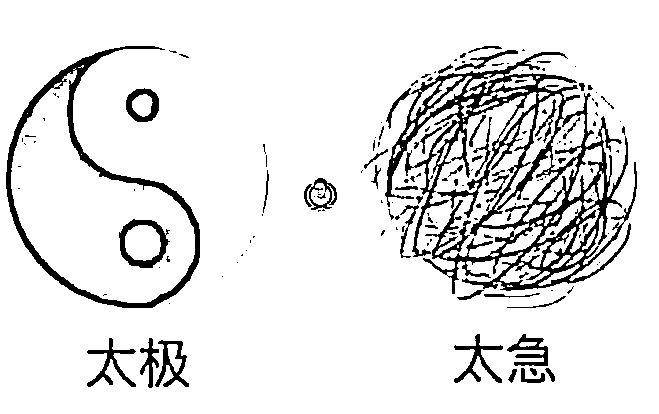

# 实体门店获客引流的 5 个操作重点

> 原文：[`www.yuque.com/for_lazy/thfiu8/lczagk0dua0m94eq`](https://www.yuque.com/for_lazy/thfiu8/lczagk0dua0m94eq)

## (12 赞)实体门店获客引流的 5 个操作重点 

作者： 东山老师 

日期：2023-07-10 

简单介绍一下我自己： 

很多人都叫我东山老师，我是个 70 后，今年是我创业的第 20 年！从 2010 年以来，我一直以来就是帮实体门店获客的 

2016 年以前什么门店都接一点来做，2016 年以来，死磕少儿艺术教培机构的招生和转化工作。至今做了 1500 多场吧，去年转型为培训为主，还是这群人，还是这个事，换了个方式而已 

我这些年见到过的门店老板，没有 10000 个也有 8000 个以上吧，有些生意一直很好，不断的开分店，开分校，搞加盟什么的，而好大一部分，开了 3 个月，就顶不住挂出“旺铺转让”的纸条了！ 

究其原因，当然有经营和经验的关系，也有产品等关系，但最近我这几年通过少儿培训机构这个群体我发现，往往经营困难的就是那些一心研发更好的课程，一心做好服务的机构。 

为什么呢？ 根源在于不擅长招生和转化，也就是通常说的：引流获客！ 

我想，其他行业也有这样的情况，尤其一些 70 后、80 后开的门店，凭着一个手艺开个店，实现梦想。 但冷不防，就被那些手艺没那么好，课程交付没那么好的 95 后，98 后开的店抢走了很多的生意。 

这是我看到目前线下实体店引流的现状，尤其在一些教育培训行业，美业，餐厅，烘焙，民宿酒店等行当，更是如此！ 

我经常跟开教培机构的校长说的一句话：咱们开机构的，课程好，教学好，团队棒，这不是应该的吗？有啥值得天天挂在嘴边说的？ 这就跟一些餐厅一样，把菜做的好吃，不是应该的吗？ 

反过来说：如果你的教学真的好，服务真的好，团队真的强，理论上，更应该让周边所有的孩子都来你这里学习才对呀？ 

但为什么，别人的机构能有 500 人，能有 1000 个学员，而你的机构都开了 5 年了，还是 100 来个学员呢？ 

难道别人机构的教学就不好，课程就不好，团队就不强了吗？ 难道家长都是傻瓜吗？ 难道当今开机构，还会其他的校长拍着胸脯跟家长说：放心吧，我这里的教学不好，我这里的团队很差劲的！ 有这样的老板吗？ 

当然，不会有的！每一个老板都会说自己的产品好，服务好，产品强的！ 

所以，我们要比就比谁的客户多，谁更能赚钱！而不是比谁的课程好，谁的服务好，这些都是基本的，是应该的！ 

所以，在线下开门店，就是这么现实：人越多，就人越多！对不对？ 

我想在这个社会，酒香不怕巷子深的道理早就没用了，所以，如果你开一家线下的实体门店的话，必须要过的一个关卡就是：引流获客。 否则，多少钱都不够亏的！我这些年见过太多了店老板了，我都有点儿麻木了！ 

那具体实体门店如何进行获客引流呢？ 

我今天给你分享实体门店获客引流的 5 个操作重点，分别是： 鱼塘找寻，钩子设计，信任培育，承接转化，流程复制 

这 5 个点也是我刚刚结束的 4 天 3 夜《私域变现 4 步密码》的核心内容，今天，我只能简单跟大家说说，理解了这 5 个步骤，就可以按部就班的去做好自己门店的获客流程了。 

先要说明一点就是：无论你在哪里开店，开的什么样的店，你在真正开始做获客引流之前，首先要做的就是：精准的人群画像。 

很多人开店，是没有人群画像的概念的，反正周围小区的人都是我的菜，路上来来去去的人都是我的客户群体。 

但凡抱着这样的想法去开店，往往很难开起来，就算开起来了，利润也不高！因为没有精准的人群定位，你的产品定位，价格定位，宣传定位，获客对象，后面讲的鱼塘，钩子等全部都没法精准定位。 

没有人群定位，任何的海报和宣传主张就像跟一大帮人说话，有精准的人群定位，那就是对具体的一个人说话。 

这样，你所有的营销活动才会极度的精准，你做的营销策略才会吸引来真正有用，能消费的人。 

我每次别人问我的问题，我都会反问：你的人群画像是什么样的？ 如果对方无法说出来，那给什么答案都没有用！80%的问题都是因此而起的。 

一般而言，做人群定位也就几个点： 1：地区（某个小区，某个学校，某个大型医院，学校等） 2：年龄：2000 后，95 后，90 后，80 后，70 后等等 3：经济实力，有钱没钱永远都是重要的，付费能力比消费意愿更重要 4：工作阶层：白领，创业主，全职宝妈，公务员等 5：其他：主要是结合你的行业，再列出一些参考的： 例如教培的：孩子的年龄，孩子性别，孩子的学校.... 例如养生的：老人家，企业主，什么类型的慢性病等等 

自己对号入座去列一下，然后把 12345 分别进行组合，用一句话表达出来，然后这个人的形象就慢慢清晰了。 

例如开个少儿美术机构的人群画像：在万达小区的，家里有 2 个孩子，4 岁和 6 岁的 90 后宝妈，老公主要是附近的工厂企业主.... 

像我这么写了一句话，我未来做获客引流的时候，我写的招生方案，引流裂变方案，寻找的鱼塘，策划的钩子等，我就全部都针对这个具象的人去展开，这样我的活动成功率就会很高。 

如果没有这样的人群画像，真的，连活动方案都不知道怎么策划，只能是送礼，送大礼，被人薅羊毛，吸引一大堆的人过来，又不消费，还要一个一个的过滤筛选，搞两下就怕怕的了。 

所以，开个店，千万不要有“有奶就是娘”的想法 不然不光做不大，也做不好的 

做好人群画像之后，我们就直接进行下面的 5 步骤： 

1：鱼塘找寻 首先要讲的一点是，一般而言，我是建议所有的实体店老板都是先从私域开始做引流获客，而不是从小红书，抖音，百度等公域去获客。 

因为无论你是餐厅，还是美业，或者是教培等，本质上，你能服务的就是周围一亩三分地的人群，大部分门店能覆盖的人群都不会超过 3 公里，甚至有些只有门口的一条街或者一个小区。 

你连家门口的流量都没有去摆平，却一门心思的去搞小红书，搞抖音，搞 B 站什么的，我觉得纯粹就是：舍近求远！ 

当然，有些门店的业态不同，例如月子中心，医美，口腔医院等大型的门店，是需要从公域导流的 

我说的是绝大部分的社区门店，夫妻店，小店那种 这些，还是要先搞门口的流量为主 

很多人搞门口的流量，能想到的一点也就是：地推，派传单，在门口敲锣打鼓做活动，当下这样的活动效果非常低，因为优质的客户们都贼精的了，有礼品就拿，但是极少会上门！ 

所以正确的做法是：从别人的鱼塘里捞鱼！这就是找寻鱼塘的过程。 

要找到客户会去的鱼塘，我们就要有精准的人群画像，模仿这个人的行为轨迹，她会去哪里？会看什么地方的信息？会去哪里消费？等等 

沿着她的行为轨迹，我们就能找到很多她会去的地方，这就是鱼塘！ 

例如一个少儿美术机构，一个孩子的宝妈会进入各种宝妈社群，二手置换群，会去钱大妈卖菜，会去百果园买水果，会去快递驿站拿快递，会去各种团购群.... 

孩子会去游乐场，会去补习班，会去玩具店，会去童装店，会去文具店，会去理发.... 

那么我们只需要想办法找到这些鱼塘主，跟他们合作，或者付费，或者混群，或者合作搞活动等，在他们的鱼塘里抛下我们策划好的钩子，把他们都吸引过来添加你的微信，这就是典型的一个获客的流程。 

当我们找到了大量的鱼塘后，我们就要进行分类，找出马上能合作的，优质的鱼塘出来，根据每个鱼塘的特性和他们的客户特性，专门策划不同的鱼饵和钩子。 

所以，我们第二步就是：鱼饵和钩子的策划。 简单讲讲鱼饵和钩子的区别 

例如我们跟一个美容院的老板合作，我们在他们的会员群里讲 3 天的幼小衔接升学主题分享内容，那么这 3 天的课就是一个鱼饵，我们讲完课了，跟所有的会员说：我还有 XX 份资料，需要的添加我微信，我发给你，那么这个资料就是一个钩子。 

又例如你在小红书看到一个很好的视频，你看完视频了，她说有个什么资料，你后台踢踢就可以领资料了 这个视频就是鱼饵，这个资料就是钩子 

因此，要做好获客引流，我们要设计 2 样东西，鱼饵和钩子，但有时候这 2 个又是同一个产品，在我们的线下课堂里，我们会现场要求学员用半天的时间去策划获客武器库，就是围绕不同的场景策划不同的钩子和鱼饵。 

大体而言，有 3 类产品，资讯类的，教育类的，付费的实体产品等。 

可以这么说，客户的精准度是有鱼饵和钩子的精准度去决定的，不同的鱼饵和钩子吸引来完全不同的人群。 

例如一个少儿教培机构，用一个绘本去做引流，那么吸引来的都是 3-5 岁的孩子，家里如果孩子是 9 岁了，是压根瞧不上这个绘本的。 

如果你用奥特曼玩具去做引流，那么吸引来的都是家里有男孩子的，这个就适合跆拳道，篮球等男孩子居多的机构。那你如果做少儿中国舞，就很不适合！ 

又例如，你现在用一份：XX 地区幼小衔接资料或者幼升小的指南去做获客 那么吸引来的都是 6 岁的孩子，4 岁的，7 岁，8 岁的都不会理你的 

鱼饵和钩子的设计是一个很细的功课，未来有机会再跟你去细说。 不管是什么类别，一定要记住一句话：只给客户想要的，而不是她需要的。 

我们继续，讲第二步。当我们把人都添加到我们的微信后，很多老板做的就是直接进行销售，往往非常难！ 

打个比喻就明白了： 如果一个男孩子在一个聚会上（鱼塘）添加了一个女神（人群画像）的微信，第二天就跟这个女的说，我家里有 2 栋楼，3 部车，我会对你很好的，我们马上去结婚吧！ 

先不说你说的是不是真的，就算是真的，也会吓跑很多姑娘，觉得你这个人是不是神经病？ 

既然这么好的条件了，还这么猴急，是不是有什么问题呀？ 姑娘心里肯定会嘀咕，只要一迟疑，就算了，对不对？ 

很多机构，很多门店就是这样的，自己的产品，自己的服务，自己的店面等确实很好，但是一加到人后，就冲上去就要销售，往往把人吓跑了，后果就是：删除拉黑，而且到处说你：神经病！ 

那么应该怎么做呢？ 这个男孩子完全可以在朋友圈里展示自己丰富多彩的生活，展示自己的 2 栋楼，3 部车，展示自己的好学，能干等。 

等时机合适了，再约这个姑娘出来吃个烧烤，看个电影，慢慢的让这个姑娘觉得你真的不错呢，这才有了美好故事的开始。。。。 

所以，我们做线下门店，也要有耐心一点，加来的人先养一下，混个面熟，让他们知道你是干嘛的，对他们有什么好处，有什么特色优势好处等，每天发好朋友圈，偶尔来个社群主题分享，和直播分享。 

  

这样，客户脑海中有你了，有你的产品和服务了，知道你的牛逼了，这时候才去做销售，成功概率大大的提升了。 

当你不急于销售，只是贡献价值的时候，你是很淡定的，就跟耍太极一样，悠游自在 如果你很急，那就是一团乱麻了 

这就是第 3 部分：信任培育的部分，记住，无培育不成交，无信任不成交 

客户只有经过了信任培育的部分，才能去做成交，而在门店的私域成交里，最有效的还不是一对一的攻单，逼单等！太吓人了，又攻又逼的，搞得好紧张。 

我们常做的有效的方法是：用快闪群去做一场针对性的发售。 

例如艺术机构的招生，我们一次就招募 100-200 人来上体验课，在上体验课的过程中再慢慢的去一个一个的转化为常规班。 

我想其他的餐厅，烘焙店，美业店等都可以用快闪群的方法去做一些基础会员，小额充值，爆品的团购等活动的，先锁住人，再转化大额订单，是比较合理的流程。 

发售真的很重要的环节，一定要学会这个，无论什么样的发售，大体上都是 4 个环节 造势---预售---发售---追售 

具体的，大家可以当当买一本《浪潮式发售》看看就 OK 了，我起码看了 10 多遍了，我自己也操盘了上百次的发售 以上是第 4 点：承接转化！ 

最后就是获客流程，我们要做的有 2 点： 1）梳理整个获客的闭环，让链路越短越有效，例如让人加你微信，让客户拉人进群，让客户发朋友圈等，话术，海报，步骤等要简单一些，不要太复杂。 2）培养所有的员工一起做这件事，只有这样才能真正的把门店做起来，单靠老板一个人，只有把老板搞残废，都做不了一个大店。 

于获客引流而言，必须是人人头上有指标，人人都要负责才会快速的把私域流量做起来。 

这就是第五步：流程复制 

我们前面讲了门店获客引流的五个关键要素：鱼塘找寻，钩子设计，信任培育，承接转化，流程复制。 

大家可以对照着航海手册去一步一步的学，结合自己的门店情况一步一步的去套，先走出一个小闭环再说！ 

依据我的经验，实体店获客引流过程中会遇到的 4 个问题卡点，这 4 个卡点如果解决不掉，很头疼！ 

这 4 个卡点是：鱼塘找不对，钩子没吸引力，客户没响应，团队不会干 

如何应对呢？ 

鱼塘找不对：鱼塘找不对的根源就在于没有精准的人群画像，只要你有精准的人群画像，你去模拟客户行动轨迹，在源头上截，一定能找得到很多精准的鱼塘。 

钩子没吸引力：大部分都是给了客户需要的，而不是想要的。记住，在引流获客阶段就是要给客户想要的，而不是需要的。 

在成交阶段，才是给客户需要的，才需要挖痛点，激活需求等等 

在获客阶段，她想要什么就给什么，这一点很巧妙。但也要结合自己的产品定位，否则人人都需要 500 万，你也给不了，对不？ 

客户没响应：一般就是钩子的价值塑造没有塑造好，明明是很好的东西，但是海报和文案看起来太不值了，所以她不想动。还有就是让她做简单的事，难的事留给自己。 

团队不会干：这个根源就是流程的问题，所以你要把获客的 SOP 拆解的足够细，然后经过培训，并要考试，最后给予明确的激励，把获客和绩效挂钩，人就动起来了。 

最后给大家 4 个建议，就结束我今天的分享： 

1）说一万句，还是一个字：干！边做边优化调整，别观望，别纠结 

2）先看一遍航海手册，不看完，不写笔记，没有发言权，航海手册里有答案的东西，就不要一而再再而三的问，会让自己养成什么都直接要，而不是自己思索的坏习惯。 

3）虽然要打卡才能拿回保证金，但是也敬请你不要为了打卡而打卡，骗自己没劲。 

上一期我经常看到有人直接复制我在群里分享的几句话放到打卡哪里，字数够了就算了，这样有什么意思呢？做一个老板，都不能对自己诚实，还能鼓励员工怎么样呢？ 所以，我们不要骗自己，好吧？ 

4）真的有问题，随时在群里讨论，#举手，教练都在呢！群里大咖足够多，肯定能解决自己的问题。 但是问问题也是有技巧的，就是不要问那些一句话的问题，例如：教练，我怎么获客引流呀？ 也不要问：教练，我怎么设计钩子呀？ 

面对这样的问题，我一般都是装作没看到！这种问题就跟直接问：教练，我怎么赚大钱呀？ 

所以，建议大家要问具体的问题，包含： 1）我的问题是_ 2）问题的背景是_ 3） 我是怎么做的？_ 4）我的卡点是？我需要教练支持的是？_________ 

大概按照这样的框架去问问题，你就能获得一个很好的答案！只有好问题才有好答案！ 

好了，最后祝大家全部靠岸，学有所获，客户装满店！ 

评论区： 

暂无评论 

  