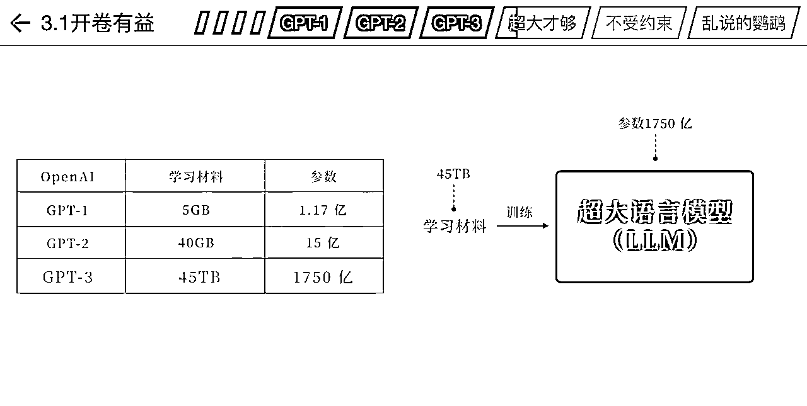

# 「AI 科普」小白也能看懂 GPT 和人工智能

> 原文：[`www.yuque.com/for_lazy/thfiu8/df5ri3wo3vg3gupl`](https://www.yuque.com/for_lazy/thfiu8/df5ri3wo3vg3gupl)

## (24 赞)「AI 科普」小白也能看懂 GPT 和人工智能 

作者： 萧川川川 

日期：2023-08-10 

「AI 科普」小白也能看懂 GPT 和人工智能，NLP、预训练、机器学习、深度学习、神经网络……这都是啥？ 

作为一个产品经理、非技术人士，想对 GPT 和涉及到的 AI 知识有一个整体的认知和理解，但是市面上的内容要么太专业、要么过于浅显，同时没有对常见的自然语言处理、深度学习等名词作解释，于是把自己学到的内容沉淀下来，分享给同样有需要的人。 本文主要分为 4 个部分，第一部分是用大白话理解 GPT，第二部分补充一些基础的 AI 知识、名词解释、关系；因为我是借助 GPT 理解并学习的，所以第三部分分享下「我是怎么用 GPT 学习 GPT 的」，第四部分是比较详细的技术知识、优缺点等，辅助进一步理解，或者也可以作为存档，随时回来搜索。 

大家有问题可以在评论区说，我尽量解答，以及补充完善。 （更好的阅读体验，可以移步飞书文档：‌⁤‍⁣⁡⁤⁢⁢⁣⁤⁡⁡⁢⁡‍⁤⁢⁢‌⁤⁡‬‌‍⁡⁣‍⁡‬⁤⁡‍⁢⁤‬ 

一、GPT 介绍 说人话/极速版理解： GPT 厉害的点在于通过「预训练」有了上下文理解、「自回归方式」生成流畅长文本，因为是预训练，在前期有大量的数据学习，所以可以处理多领域的语言问题，具有少量样本学习能力，反应也比较迅速。 

GPT 没有理解功能，只是一个模型。 实质功能/底层原理就是「单字接龙」，是对于下一个字的预测。 生成句子的话，就用到了「自回归生成」，gpt 自己套娃预测。 比如，给 gpt“我”，预测出了“想”，然后再基于“想”预测，可能是“吃”可能是“睡”。 那怎么生成长文呢？Transformer 架构里有一个注意力机制，擅长「捕捉长距离依赖关系」，不拘泥于上下文。 

模型训练的目的是学习「提问和回答的通用规律」。它只学习提问和回答的模式，并不记忆数据库，基于数据和学到的规律生成全新的回答，所以有时候会胡说八道。这和搜索引擎不同，搜索引擎只能回答它记得的数据库里的信息。 因为训练的数据足够多，就成了大模型，本来是只能「单字接龙」，但是训练着能够理解“指令”、学习范文、还可以「步步连续推理，从而提升正确率」（思维链），这一现象也叫涌现。（现在似乎不清楚为啥出现） 所以在回答问题时，它更像是个人一样。它用学到的大量数据来模拟各种情景、角色和语气，同时可以生成有逻辑关系的长文。 

GPT（Generative Pre-trained Transformer）是一种基于变换器（Transformer）架构的预训练语言(Pre-trained)模型，是大语言模型。 2、训练过程 说人话/极速版理解：先是海量数据尽情学，然后模版规范纠正，最后是激励引导输出有创意的内容。 3 个学习环节用到了不同的学习算法。 

移步飞书文档：‌⁤‍⁣⁡⁤⁢⁢⁣⁤⁡⁡⁢⁡‍⁤⁢⁢‌⁤⁡‬‌‍⁡⁣‍⁡‬⁤⁡‍⁢⁤‬[https://njmseq3llu.feishu.cn/wiki/XxIRwLl0biWZZvkvNjjc5GLRn0g?from=from_copylink](https://njmseq3llu.feishu.cn/wiki/XxIRwLl0biWZZvkvNjjc5GLRn0g?from=from_copylink)[https://njmseq3llu.feishu.cn/wiki/XxIRwLl0biWZZvkvNjjc5GLRn0g?from=from_copylink](https://njmseq3llu.feishu.cn/wiki/XxIRwLl0biWZZvkvNjjc5GLRn0g?from=from_copylink) 

 

评论区： 

暂无评论 

  