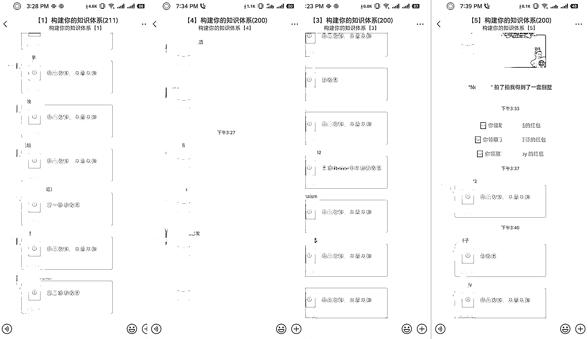
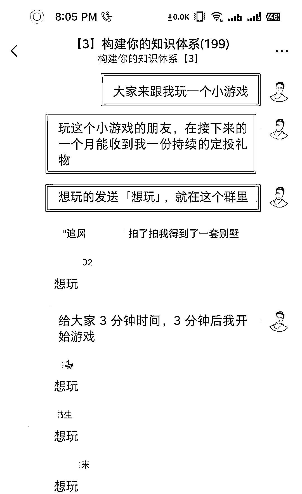
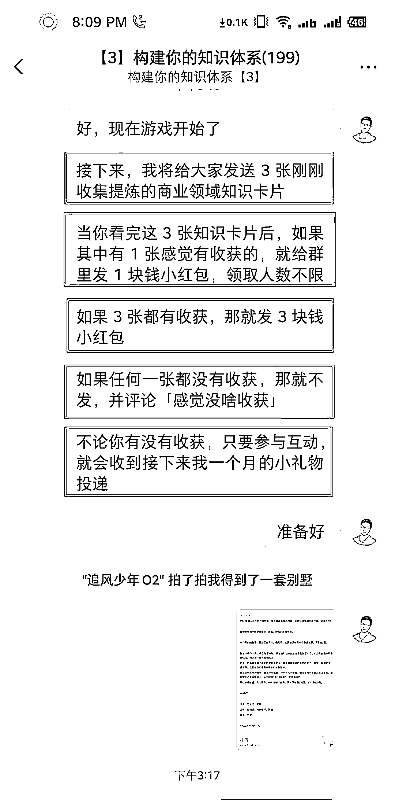
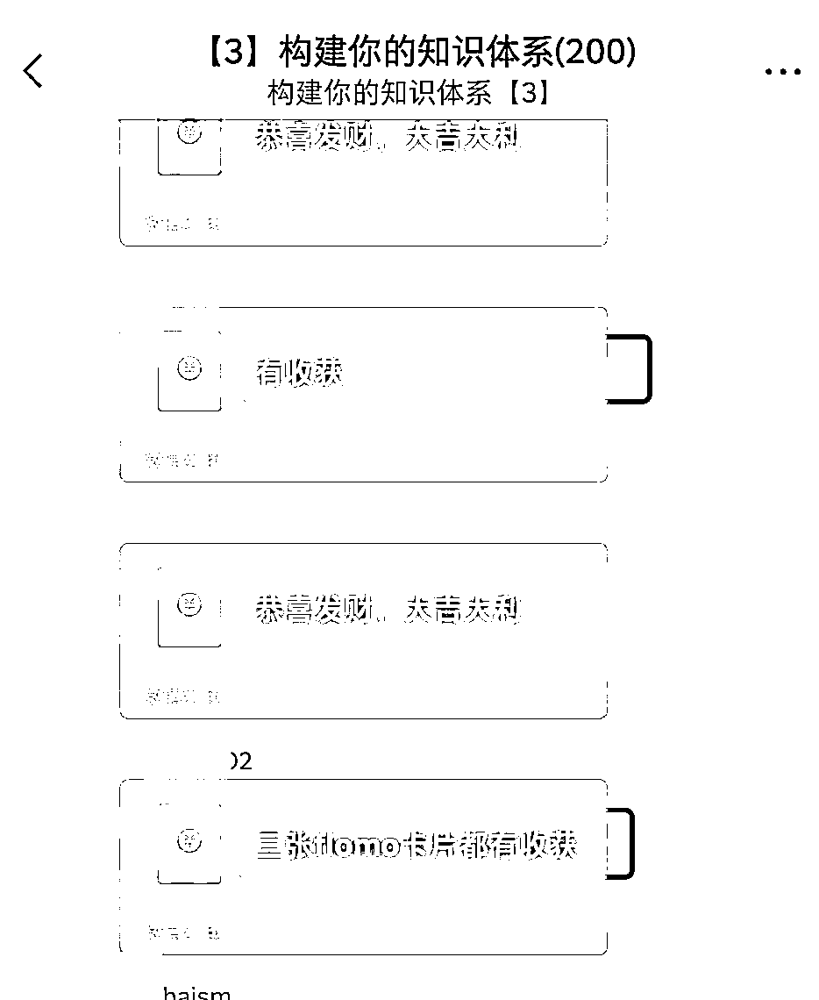
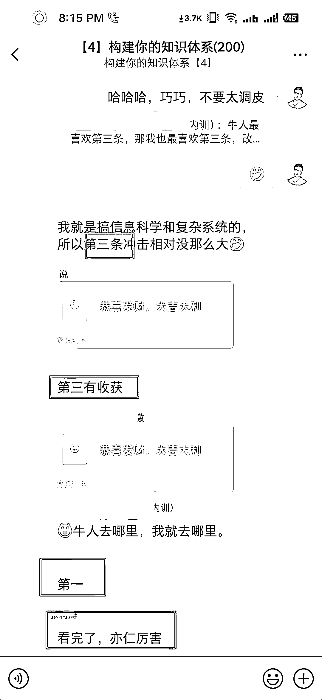
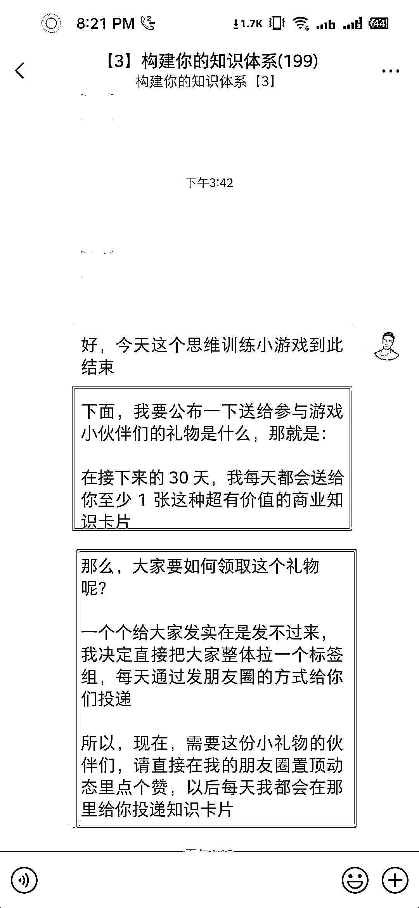
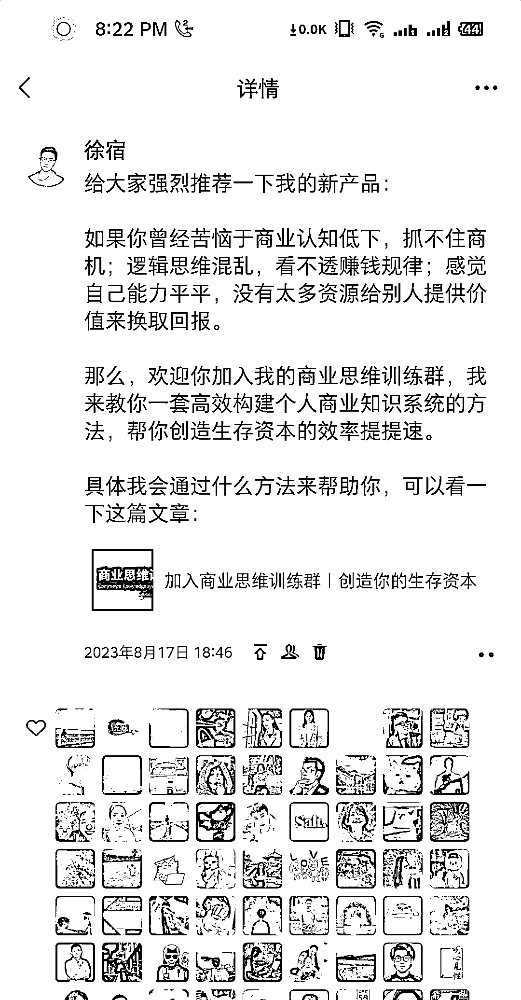
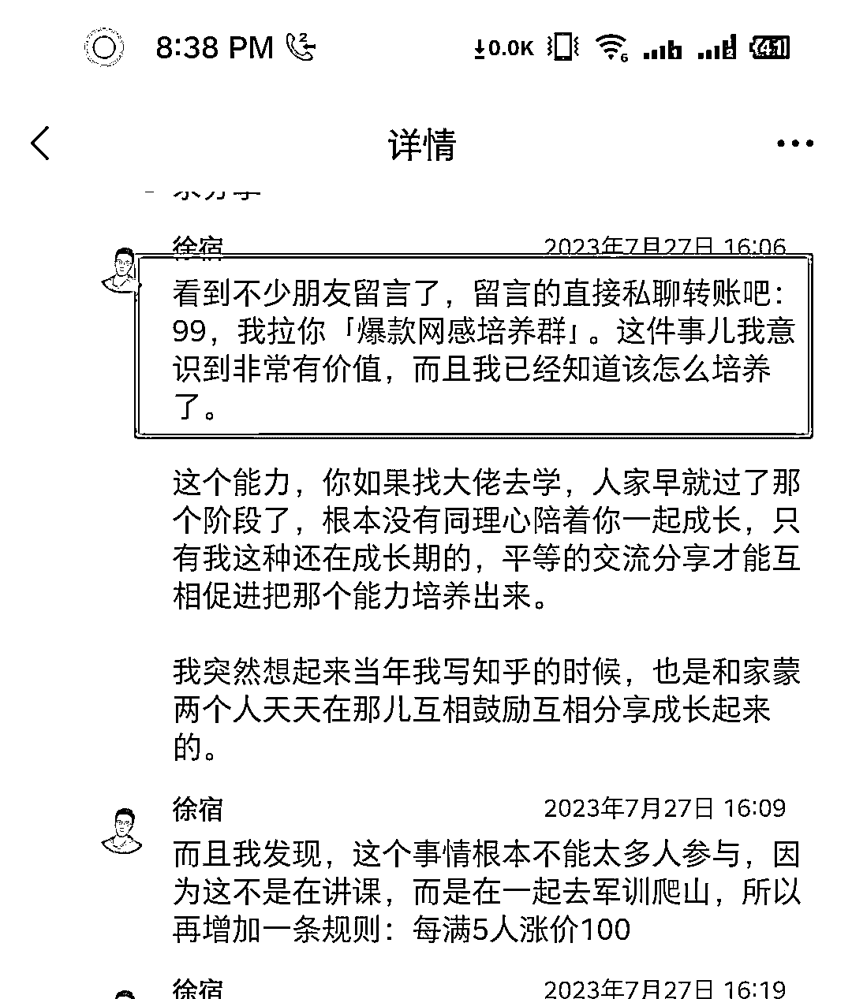
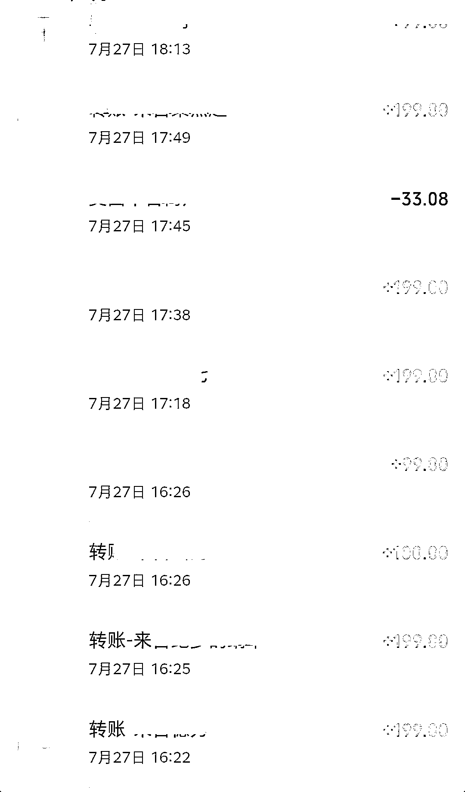
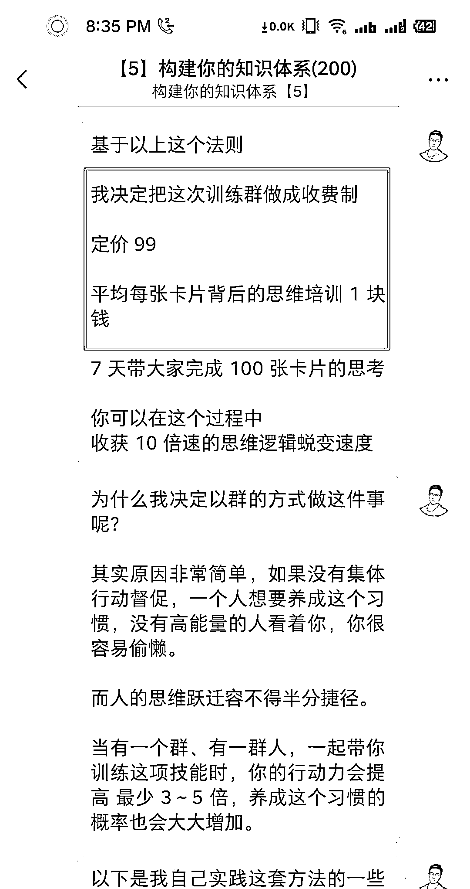

# 当你想要卖一个产品时，如何做一些有意义的产品价值调研活动

> 原文：[`www.yuque.com/for_lazy/thfiu8/tbcp9b46lg4bysx3`](https://www.yuque.com/for_lazy/thfiu8/tbcp9b46lg4bysx3)

## (精华帖)(104 赞)当你想要卖一个产品时，如何做一些有意义的产品价值调研活动

作者： 徐宿

日期：2023-08-21

1997 年，被苹果公司踢出董事局 12 年后的乔布斯重新回到他多年前创办的这家企业，随后开始了他一系列大刀阔斧的改革，一步步把苹果公司推向了这个世纪当之无愧的科创公司王座。

遍读乔布斯过往大部分公开演讲和书籍，其中关于「如何判断产品价值」这个话题下最广为流传的是下面这段话：

Some people say give the customers what they want, but that's not my approach. Our job is to figure out what they're going to want before they do. I think Henry Ford once said, "If I'd ask customers what they wanted, they would've told me a faster horse." People don't know what they want until you show it to them. That's why I never rely on market research. Our task is to read things that are not yet on the page.

翻译一下，大概是说：

“有人说给客户他们想要的东西，但这不是我的做法。**我们的工作是在他们这样做之前弄清楚他们想要什么**。我记得亨利·福特曾经说过：“如果我问顾客他们想要什么，他们会告诉我一匹更快的马。”**人们不知道自己想要什么，直到你向他们展示为止**。这就是为什么我从不依赖市场研究。我们的任务是阅读页面上尚未出现的内容。”

多年来，我并不理解乔布斯这段话到底是什么意思，只以为有些产品经理可能就是天生的，天然的能发现普通人发现不了的用户需求，然后针对这些需求设计出恰到好处的产品，去市场上赚的盆满钵溢。

直到最近半年来，随着我自己的线上产品在一系列小步调整收到一些好评后，我或许理解了这段话中的一些含义。

故事就从前几天的一次小事情开始讲起吧：

上面的这几张截图是我的读者群前几天下午发生的事情。

这件事情起源于我要向我的读者们推出一项新服务，而我不知道这项服务是否真的是他们需要的，于是我想采用一种简单的方法测试大家的意愿。

应该如何测试呢？

按照半年多来的经验，我知道，如果想要真正的获取用户的真实需求，必须要让用户付出一些代价。

于是，我开始了下面的行动：

## **1：承诺价值-引起兴趣：**

我在我的 5 个读者群中发起了一个小游戏活动，每一个参与游戏的最终会收获我发送的一份为期一个月的礼物，然后先引起大家的好奇心和兴趣。

接着，当有一些人留意到我在发信息时，开始参与互动后，我需要发出这个游戏活动的规则：

## **2：展示价值-发布规则：**

我开始发布这场游戏的规则

展示给大家我后续要提供的产品

直接让大家以付出代价（发红包）的方式来参与游戏

并限制这个游戏只有 30 分钟的时间

由于游戏机制本身的裂变属性，越来越多的群友会被激活来参与这个活动

只要注意力投入到这个游戏中来，我必然能够或多或少的看到大家的各种反馈：

然后就是大家开头看到的那一幅场面，30 分钟内，一共有将近 80 ～ 100 个人参与这场活动。

由于这个机制的设定，我满足了所有参与者的利益：

我：**要收集产品建议**

参与者：**吸收到了产品价值**

观看者：**抢到了红包**

所以大家基本上不会对我这个活动产生的噪音而反感，相反，他们内心可能以前没有玩过这种模式，挺期待我接下来要提供什么产品。

而同时，当我看到有 98%的人都对这个产品（服务）很认可的时候，那么我知道推出这个服务一定不会错。

然后，我需要完成我的承诺，让参与活动的伙伴们知道我要送给他们什么礼物：

## **3： 提供价值-交付承诺：**

如上如所见，大家很乐意我来给他们提供这个服务，持续跟我进行产生互动。

到这一步并没有完，因为我的目的是要发布我的产品，而我的产品是一种信息服务，今天这个互联网信息大爆炸的时代，大家已经厌倦了信息轰炸，我需要确保大家一如以往需要我的服务。

于是，我开始发布我的产品并再一次让大家跟我互动：

## **4：消费确认-发布产品：**

为什么我一定要让我的读者们允许后，我才去为他们提供产品。

因为我觉得这才是更合理的商业流程，商业不是强买强卖，而是基于彼此尊重平等的交换，我需要获取大家的注意力，而大家需要同意我获取，作为回报，我会给大家提供优质的商业知识。

在这里，他们或许能够感觉到，我不是在滥用群主的权力，每一次的服务更迭，产品迭代，都是基于大多数用户有需求，我才真正的用新方案替代老方案。

这也或许是我虽然一直处于影响力捉襟见肘的贫困阶段，每次发一些内容依然能够获得基础读者注意量的原因。

以上，是前几天刚刚发生的案例，在不久以前，还有两个类似的案例也符合同样的底层原则。

一个是我由于自己做小红书做的有点苦闷，虽然做出了一些成绩，但是很想找一帮人一起去行动，而这种事情如果让别人免费跟我做，我估计他们都不会珍惜。

于是我发起了一个为期 10 天的付费观览群，限制 20 个人加入，有兴趣跟我一起培养小红书网感的朋友，可以直接转账来跟我这一起培养，我不承诺任何东西。

这样一来，有人看着我做，我自己更有动力，而且他们还给我钱，何乐而不为，于是我就发朋友圈招人看看有没有人愿意给钱：

最终 20 人都满了，一条朋友圈收了大概四千来块钱，一个月房租算是不用愁了。

而我需要做的是：**持续好好做我自己的事情，并尽可能的分享我的动态和思考。**在他们有问题的时候，在群里答疑一下，把我的所思所想都分享到群里，10 天过后，解散这个群。

还有一个例子，也类似这样的原理，前段时间由于我研究出了一个新的帮助成年人训练大脑思维的方法，可以让 1 个成年人在 1 小时内学会那套方法，迅速提高自己看透事物本质的能力。

于是，我继续在我的读者群发起招募测试，仍然是先让大家付出一定的代价：

然后，结果依然如此：

当时记得是招募了 40 多个人来测试我的新产品，不是我花钱请大家测试，而是大家花钱来参与测试。

这样，当他们花了钱，测试完，说出来的话才更有可信度，我才更有底气去市面上推广。

为什么这半年来，始终坚持要先让读者朋友们先付出代价，这种模式在早期非常艰难，尤其是我的社群本身就是收费社群，他们加了群以后一次次的还得给我钱，我自己想起来都挺不好意思，但没办法，该收还是得收。

答案其实非常简单：

一方面，是乔布斯开头说的那句话：**用户并不知道他们到底想要什么，直到你把好东西分享给他们，他们才会大叫：我要的就是这个！**

另一方面，是我从咱们圈子里刘小排老师的文章中看到的那段话：**塔勒布希望我们在调研产品价值的时候，一定要让用户付出一些代价**（这段话下文中我会再次引用，实际上这一年多来我已经不知道不知道引用了多少次了）。

于是，经过我多次的持续测试以后，我发现哪些一直付费的朋友，不仅不反感我，反而非常期待我持续去给他们推出更多新的、有价值的服务。

## **5、再问一遍，为什么一定要让用户付出代价？**

这里就是要引用刘小排老师的那段话了：

如何判断自己的产品对于别人到底有没有价值？

塔勒布希望我们对所参与的事要有「代价」：**提出一个方案，决策人要有和结果绑定的代价，成功要有相应的奖励，失败要有相应的损失**。

只有这样，这个决策才是真实、可信的，即 game 中的 skin（skin in the game）。Have a skin in the game，是上述方法之所以有效的底层逻辑。

当你问别人「我这个产品好不好？」时，别人说「挺好的」，那只是嘴炮，别信。因为他没有付出与结果绑定的代价，他又不买，怎么说都行。

你应该反问：“虽然产品还没做出来，但现在就可以预购了，你买吗？”

当女孩对你说「你是个好人」时，那只是嘴炮，别信。因为她没有付出与结果绑定的代价，她又不会和你在一起，她怎么说都行。

你应该反问：“那你愿意和我在一起吗？”

当银行大堂经理向你推销一支理财产品时，不管她怎么把这支产品夸上天，你要知道，那只是嘴炮，别信。

在你作出购买的决定之前，你得先反问她：“姐，我相信你。我想参考一下，你自己买了多少钱的？”

...

如上，只有用户付出代价的时候，他做出的评价才是更具含金量的，我会尽可能的在每次推出产品前都让我的读者先支付一些代价。

## **6、如何找到这样一批愿意为你付费的读者？**

那么，看到这里，你脑子里可能会冒出一个问题：

**徐宿，你是如何找到这样一批愿意主动付费的读者们呢****？**

这让我想起了，美国国务卿基辛格的故事。

基辛格是个幽默狡猾的老头。

有一次，他去 TCW 开会，有人问：“基辛格先生，您可以解释一下昨天波斯尼亚所发生的事件吗？”

基辛格回答：“**哦，是这样的。这要从 1722 年谈起****。**”

为什么基辛格要扯那么久远的事？

因为历史是一串连锁反应的事件，要想理解后来发生的事情，必须理解由一连串历史事件所形成的背景。

同样的道理，如果你要问我：“徐宿，你可以分享一下你是如何找到这样一批愿意主动付费的读者们吗？”

我会回答：“**哦，是这样的。这得从 2015 年说起****。**”

* * *

评论区：

梨云 : 调研鬼才[机智]
西瓜 : 话术固然巧妙，更震惊我的是竟然会有人在付费群里反复复购，当然这和案主多年经营起来的信任高度相关。[强][强][强]
良辰美 : 感谢分享，已学习实践，按照所给方法论一比一模仿，只不过我没有建立读者群，分享价值较少，回应者廖廖，不过这个还是很有意思的设计
良辰美 : 这是文章开头，前面是结尾截图
如也 : 优秀！学习了哈哈哈
下页小峰 : 学习啦[机智]
徐宿 : [爱心]鬼的一批
徐宿 : 用起来

* * *