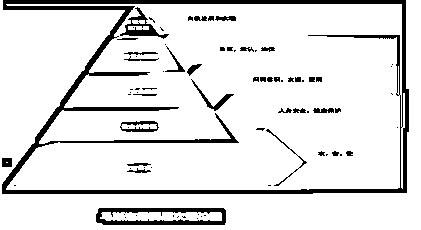
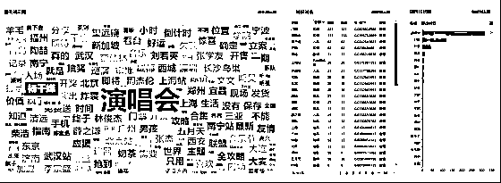
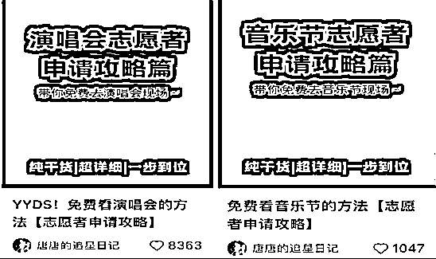
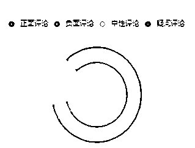
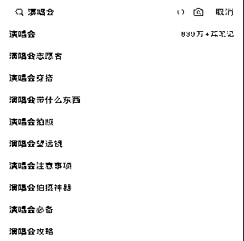
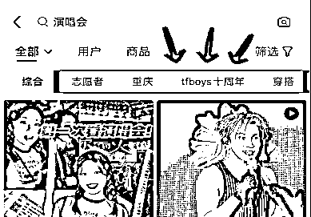
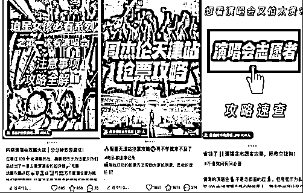
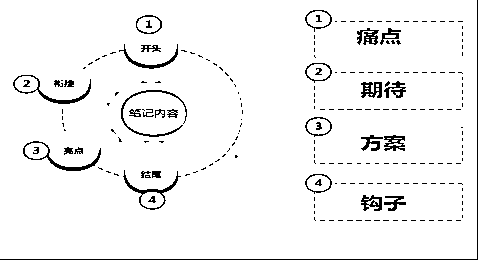
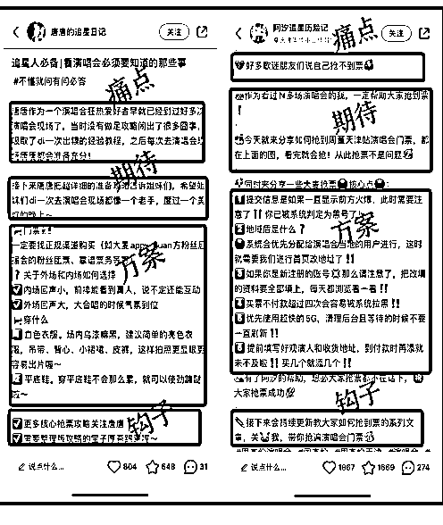

# 小红书 6 个月用原创变现 90W+，如何流程化创造爆款内容？

> 原文：[`www.yuque.com/for_lazy/thfiu8/oi4f4ot2idpariv8`](https://www.yuque.com/for_lazy/thfiu8/oi4f4ot2idpariv8)

## (92 赞)小红书 6 个月用原创变现 90W+，如何流程化创造爆款内容？ 

作者： 小颖 

日期：2023-08-16 

 Hi～我是小颖，一个抛弃体制内铁饭碗，25 岁从零开始自主创业失败，如今 30 岁却靠小红书六个月成功变现 90w+的大龄叛逆女青年。 

 昨晚在小红书刷到一条视频，视频内容是一个女博主在普及做自媒体的门槛有多低，做起来有多容易多赚钱。那个视频简直是把我看呆了，感觉在自媒体上随便发发作品年入百万就不是梦了。 

 估计大家也都多多少少刷到过类似内容视频或笔记，也都会有这种想法。甚至在前几年我也和身边朋友说过类似的话，鼓励他们尽早入局做自媒体账号。 

不过，今天要和大家的分享的观点恐怕要推翻我自己了。 

在小红书红利未减的今天，越来越多的人看了这类视频之后，就头脑一热扎进了自媒体运营的洪流之中。但这些人往往过不了多久就会发现，自己发的作品只是淹没在这洪流之中，连一点小水花都没有，更别说能掀起什么风浪了。 

其中一个原因就是，虽然自媒体的变现潜力被越来越多的人看到，但是由于自媒体的流量红利有限，最初的大蛋糕早已经被瓜分成零零碎碎的小蛋糕。此时大批量玩家的涌入，就导致了连小蛋糕的竞争都日益激烈，而这些玩家本身并没有具备足够强的个人竞争优势，自然只能饿着肚子眼红地看着吃蛋糕的人了。 

 

算起从毕业到现在，我进入社会工作已经 7 年了。这 7 年中最大的收获就是让我明白了“起步门槛越低的东西，想要做好的门槛就越高。” 

小红书账号“做”起来当然不难，一部手机，一个手机号，注册一下一分钟都用不到。而真正的“高门槛”是把小红书账号“做起来”。 

如果你想要做到的是把账号“做起来”，那么核心就在于要建立个人竞争优势，可以从以下两个方面入手。 

硬实力：在一机一号的标准下，配置 10 个以上的手机，以账号数量取胜，用批量的矩阵号荡平赛道。 

软实力：仅需找寻切入点，产出高于平均水平的内容，直接在大量同质化笔记中脱颖而出。 

对于普通人来说，靠硬实力出圈的方法显然不现实，而 0 成本最快建立竞争优势的方法，就是提升内容竞争力。 

接下来，我将会以我在小红书小众赛道用 30 天 10 多篇原创笔记拿下百万阅读量，帮助客户创造 50w+营业额的账号为例,向你分享做小红书账号如何提升内容质量，建立自身竞争力。 

一、劝退篇：老实人做自媒体，只有死路一条 

二、入门篇：普通人怎么靠“不老实”做出爆款内容 

三、进阶篇：如何“不老实”的高效创作内容 

一、劝退篇：老实人做自媒体，只有死路一条 

说到提升内容质量才能建立自身竞争力，你是不是想到“那我知道什么就什么说什么，一五一十的说，事无巨细的说，这样总行了吧。” 

看！这就是典型的老实人思维，也是绝大多数人的思维。 

但是我这个人生来就不喜欢循规蹈矩的思维方式，做事也不喜欢按部就班，这也就是我受不了体制内的工作，而选择做小红书却能成功的重要原因。 

就像很多做小红书账号的老板找到我，都会问同一个问题，为什么我的内容做的越是认真，越是专业干货，甚至感觉质量已经非常高了，但是流量不仅没有增加，反而更少了啊？ 

对于这个问题，我们先换个角度思考一下，如果是你，你会被什么样的人吸引呢？ 

倘若有一个人能够在你不开心的时候会哄你、需要人安慰时给你拥抱、给你精神以及物质满足、知道你想要的是什么、知道你需要的是什么。你能不被这样的人吸引吗？ 

其实做小红书也是一样的，当你纠结于为什么自己的笔记总没有人看？为什么没有人关注你的账号？为什么没有人给你的笔记评论留言？ 

最简单的一个原因：你不是“海王”，你太老实了！ 

你不能满足粉丝用户的需求和幻想，不能给粉丝用户提供价值，提供的内容不是粉丝用户所需要的。 

你有花时间、花心思去研究自己目标用户的需求了吗？知道他们想要什么吗？ 

大众认可的是你内容传递的价值感、需求感和归属感。 

而有些人想的都是，如何创作自认为比较好的优质内容，沉浸在自嗨的情绪之中，而不是符合大众需求和用户感受的内容。这样就会导致你创作的内容，推荐量也少，阅读量也少。 

一篇笔记的好坏，归结到底其实是由用户来决定的，当你的笔记发出小红书后台就已经开始了对它的评分，而评分的标准就是以用户所获得的价值体验所决定的。 

笔记发出后，即进入初始流量池，不少用户就能看见这篇笔记了，有的点进来觉得有获取到有价值的信息，点了个赞，有的点进来觉得不行，直接退出了，这些用户的动作，都会成为小红书判断笔记质量的因素。 

 

小红书的内容算法 CES 全称 community engagement score； 

模型是：CES=点赞数*1 分+收藏数*1 分+评论数*4 分+转发数*4 分+关注数*8 分 

我相信基本上大家都看过上面网传的小红书推荐 CES 算法，但实际上，这已经是 2017 年以前的小红书算法，当时的小红书还无法获取用户太多的动作(没有埋点)，仅能凭借基本的用户互动来判断笔记质量。 

在前两年，如果单独只看用户的互动，这个 CES 的互动评分还是合理的，但现在 2023 年了，小红书早已经不只看互动了，小红书也看开始考核笔记的停留时间、完播率、跳出率等等。 

何况如果小红书的算法就是简单的加法和乘法，那么小红书的程序员都可以下岗了，更别提判断因素仅仅有“互动”。 

因此，一篇笔记有了初始流量池后，小红书会根据以下几方面来判断笔记的质量： 

1、点击率 

2、互动率（含转发等） 

3、完播率/完读率 

4、互动值 

5、用户停留时间 

其中互动值（点赞收藏评论）、完播率、平均停留时间是我们能看见的，而点击率、互动率都是我们暂时无法看见的，每一个行为也都是用户的一种表态。 

因此当用户做出动作时，一定会让笔记的权重占比更高。比如点赞，收藏以及评论，其中评论最复杂，所以评论增长的权重一定比点赞收藏更高，同理点赞收藏肯定也比完播率这些不用做出动作的要更复杂，核心就是互动难度越高，权重占比越高，平台就是根据这些综合得出一篇笔记到底算不算优秀，值不值得去推荐。 

 

试问如果你老实到不加以引导，不会调动用户情绪，只是干干巴巴的输出内容，那么你觉得你的笔记要怎么吸引用户做出提高你笔记评分的举措呢？对于那些达不到平均分的笔记，系统自然不会将它放入下一个流量池，所以你一篇笔记的寿命其实在笔记发出后的一个小时就大致决定了。 

“老实人做自媒体，只有死路一条”并不是危言耸听，而是确确实实存在的行业现象。可是很多这样的“老实人”根本不知道该怎么拜托自己身上的“老实气”。 

二、入门篇：普通人怎么靠“不老实”做出爆款内容 

我从业七年，带过不下几十个的新人，这些人在一开始时最大的特点就是“太老实了”。很多新手写内容完全就是自己死磕，纯靠自己凭感觉输出，数据分析也一头雾水。 

其实在入行新媒体运营前期没有基础支撑时，新手宝子们学会用“巧劲”去解决运营问题。 

这个“巧劲”就是在挖掘用户痛点的基础上，加入一些更有趣的、更富有个人色彩的特点，与用户实现价值交换，这样既增大了爆款的概率，同时还能强化你的账号 IP。 

那么问题来了，如何才能知道你的目标用户的痛点，并打出自己自己的特色呢？ 

跟着我两步走：深挖需求、拿捏人性。 

㈠深挖需求 

首先要明确一点，用户需求即用户痛点。 

痛点这种东西是比较隐形的，但是需求却是显性的。人是一种要强的动物，所以很少有人会去主动透露他的痛点，但需求却用户在痛点困扰下较为隐晦的表露，所以只有我们深挖用户的需求才能精准找到痛点。 

用户的需求由马斯洛需求理论来说主要分为五个层次。 

 

精神需求【宗教信仰、心理健康、追星】 

对应赛道：演唱会门票、心理咨询、陪伴服务 

自我超越的需求【超越自我、关注社会】 

对应赛道：极限运动、探险 

自我实现的需求【发挥潜能、找到个人价值感、自我实现】 

对应赛道：养成系 IP、如何成为大格局女孩 

尊重需求【成就、名声、地位和晋升机会】 

对应赛道：升职加薪、逆袭、职业规划 

社交需求【友谊、爱情、隶属关系的需求】 

对应赛道：恋爱经历、闺蜜、人际关系 

安全需求【人身安全、生活稳定及免遭痛苦、威胁或疾病】 

对应赛道：防狼术、保险服务 

生理需求【食物、水、空气、健康】 

对应赛道：赚钱、美食、运动健身、变美 

金字塔越往下，需求就越普遍，目标人群越广泛；金字塔越往上，需求就越高阶，目标人群也就越精准。 

再说到管理学中提到的“Y 理论”，将挖掘用户需求的过程形象化为“Y”。 

 

这个理论在小红书运营中的应用就是，挖掘和收集用户需求，然后将用户需求转变成对小红书笔记的需求，笔记的需求就是小红书账号内容输出的方向。 

那么，在进行需求挖掘时需要注意些什么？ 

1、用户：这个账号的目标用户是哪类人？他们的特点是什么？ 

2、需求：这个账号满足了用户什么需求，能帮助他们解决什么问题？ 

3、场景：用户在什么场景下会对这个账号的内容感兴趣？不同场景下的需求相同吗？ 

4、当前解决方案：没有这个账号的情况下，用户是怎么解决需求的？用户解决需求的方法存在什么样的问题？ 

5、解决方案：怎样才能更好的解决用户需求，给出解决方案。 

由此也可以看出，做挖掘需求的最终目的是以用户为核心，用户需求产生笔记内容，产生账号定位。 

明白挖掘需求背后的理论固然重要，但是理论现在暂时告一段落，接下来我将教你挖掘需求的方法论，三个核心策略帮助你直击用户痛点。 

⑴爬取赛道关键词做数据分析 

①爬取标题：在任意小红书数据平台，输入赛道关键词，导出表格。 

②数据分类：复制所有标题放入微词云分析：  [https://fenci.weiciyun.com/cn/](https://fenci.weiciyun.com/cn) 

③高频筛选：找到特征词汇列表，里面有高频出现的关键词，这些就是该赛道用来吸引特定用户的核心词。 

拟写标题的时候，一定要带上这些核心词，吸引来的粉丝，才能更精准。 

 

例如，我在做演唱会票务的账号的笔记时，就收集到了：攻略、开票时间、指南、志愿者…… 

在笔记创作时将这些关键词插入到标题和内容当中，尤其是标题，你需要做到的是让用户一眼就明白，能从你的笔记获得哪些有价值的信息。 

因为无论是做哪个平台的账号到存在一条永恒不变的法则：价值交换。 

我们用有价值的内容，去交换用户的注意力、信任、行动成本，进而是金钱。 

要想写出有价值的内容，首先我们要知道，哪些内容，是有价值的。 

我在做演唱会票务这个账号之前，爬取关键词和大量浏览同类笔记后发现，关于抢票攻略写的人很多，但是关于很多粉丝都想做的演唱会志愿者报名攻略却没有多少人写。 

这不就是一个巨大的需求嘛？我便一下抓住了这个热点，出了两篇演唱会志愿者报名的攻略都有了非常不错的成绩。 

 

（2）爬取爆款评论区做情感分析 

小红书评论区是用户需求最真实的反馈，在做用户需求挖掘时，可将同赛道爆文笔记的评论区进行导出，这样就能看到用户对于该产品有哪些优点和缺点。 

导出工具：千瓜：[http://wap.qian-gua.com/](http://wap.qian-gua.com) 

灰豚：[https://www.huitun.com/](https://www.huitun.com) 

在使用导出工具前，先选取几个同赛道博主，然后找到他们在投热门笔记或企业号笔记，然后点击笔记分析，找到热门笔记后，选择评论，就可导出评论，去调研相关数据分析。 

 

通过小红书笔记评论的导出，我们就可以更直观看出，用户主要的关注点是在哪里。再通过正、负面评论和疑问评论，就可以轻松的知道他们喜欢什么，不喜欢什么，还有哪些需求和疑问等待解决。这些都是我们作为小红书账号运营者需要去了解的 

只有当宏观与微观结合，客观与判断相佐证，才能为爆款笔记的诞生。 

 

 

从评论里的反馈中就可以看出，用户对关于志愿者报名流程这一块非常关注，我就是利用这一强烈的需求，引导加入粉丝群，群里配合话术进行引流，最后将他们引入私域，以便于完成后续演唱会门票购买的转化。 

除此之外，我们也可以根据他们的需求与疑问来做选题，来写笔记，这样的笔记效果就更加显著了。 

 

（3）搜索框细挖需求关键词 

如果你觉得以上两个方法对你来说都太复杂了，那么就直接跟着我学着在搜索框里抄作业吧。 

例如，搜索“演唱会”时，搜索框会自动显示很多相关词。这些下拉相关词的排序不仅仅基于笔记数量，还会根据用户搜索频率和系统推荐热度进行综合排序。排在前面的词都具有一定的热度，适合作为选题切入点和笔记的核心关键词。 

 

当你搜索某个关键词时，搜索结果页面会显示一排关联标签，以便对搜索结果进行分类。这些都是用户的高频搜索需求，你可以从这些前排词语中挑选几个组合作为选题切入点。 

 

（二）拿捏人性 

做好博主，你首先要懂人性，利用人性的弱点。 

为什么要利用人性的弱点？ 

做自媒体的本质就是流量的争夺，抢大家的时间和注意力，只有踩中人的弱点，才能让用户扎心，他才会忍不住点进来看。不要想着发什么内容会火，而是应该思考，发什么内容别人才会被你吸引，被吸引才是产生互动的根本。 

这也是老实人做不好小红书的一个原因之一。 

但其实所有的人性密码不是看不见摸不着，而是就存在每次的互动中。别人说了什么，做了什么，笔记呈现了什么，你思考的越全面越深刻，你对一个事情的感知能力会很强。 

随着这几年，我越做自媒体，就越发觉，其实人性的底层是自私和逐利。 

小红书用户并不关心你怎么样，也不关心你的笔记怎么样，Ta 只关心你能让 Ta 变得怎么样！ 

那么如何利用人性的自私和逐利写出直戳人心的爆款文案呢？这两条基础思路一定要懂。 

（1）给利益：让用户觉得你讲的东西，切实关注到他的利益点，对他有帮助 

◆YYDS！免费看演唱会的方法【志愿者申请攻略】 

◆周董天津站官宣丨抢票攻略火速 get 

◆追星人必备丨看演唱会必须要知道的那些事 

 

### （2）讲风险：让人感觉听完你讲的他就能躲避风险！ 

◆内娱演唱会攻略大法丨分分钟教你避坑！ 

◆省钱了！！演唱会志愿者攻略，拯救空钱包！ 

◆张杰演唱会注意事项丨避雷丨演唱会攻略 

 

其实小红书内容的调性万变不离其宗，爆文基本上都是围绕着这两个基础思路展开的，但显然只知道基础思路还是远远不够的，接下来我将带你学会运用人性心理学进一步拿捏小红书用户。 

往通俗的来说，人性的几大欲望不外乎是：男人怕穷、女人爱美、小孩怕笨、老人要健康、穷人想赚钱、富人想变闲 

记住这六点人性的需求之后，你就拿捏了你的目标用户的痛点，接下来只需要将下面这些心理学知识运用在你的笔记中，形成钩子，还怕不能牢牢勾住用户的心？ 

1、好奇心理 

人们总是对自己不了解的事有强烈好奇心制造悬念，欲擒故纵，钓足对方胃口进行创作 

例：明星演唱会助理的生活/工作/体验是怎样的？ 

学生党的我，是如何连看一个月演唱会的？ 

2、贪婪心理 

利用人们爱占小便宜，希望用最小的付出，获得最大的收获的心理，突出他们会获得的高性价比 

例：YYDS！免费看演唱会的方法【志愿者申请攻略】 

两百块就看到的演唱会你冲不冲？！ 

3、从众心理 

行为倾向多数人，将压力转化为动力 

例:99%的追星人抢票都在用的保姆级攻略 

优秀的追星人演唱会前都会做这些事 

4、恐惧心理 

抓住用户不愿意提起的痛点，促使他去做一件事或者起警醒作用 

例：去看演唱会千万不要这样做！亏大发啦！ 

避雷篇丨第一次去看演唱会一定不要忽略的事 

5、懒惰心理 

懒情是人的天性，满足对方不劳而获的心理进行内容创作 

例：抄作业!30 个最适合演唱会的拍照姿势都在这 

追星人必备的抢票攻略！直接照抄就行！ 

6、傲慢心理 

每个人都希望自己过得比别人好，拥有别人没有的重点在于突出受众的优越性 

例:这些都不知道？活该你抢不到票 

演唱会还在这样拍照？真的太过时啦！ 

7、嫉妒心理 

别人有，自己也要有。嫉妒是促进用户行为最好的动机 

例：都是大学生，凭什么他能坐演唱会前排？ 

当你生产了爆款笔记多了以后，就会形成对小红书人性特点的敏感，而所有爆款文案的本质都离不开两个公式： 

A 人+动作+结果 

B 人群痛点+解决方法 

可以根据自己的领域和内容，结合人性心理学，套用公式。但是前提是不能触犯平台的规则，要学会正反面去看问题，给大家几个小建议： 

1. 可以适当的标题党。 

但是笔记的内容要和标题相关联，要契合，如果只有亮瞎眼的标题，没有优质的内容，小红书的用户是不买账的，甚至会引起用户的反感。 

2.多看多学多思考。 

这七个字无论放在任何的地方，都适用。多去刷首页，多拆解不同赛道的热门标题，取长补短，做好网络名词的积累。 

3.适当蹭热点话题。 

热点话题的好处就是自带流量，眼下的七夕节，以及下个月的开学季都可以提前规划一下。当然也不是不是所有的热点都可以去蹭，与自己内容相符的话题才能达到最佳效果。 

三、进阶篇：如何“不老实”的高效创作内容 

能输出一篇爆款不厉害，能持续输出爆款才厉害。 

很多人在开始做小红书的时候，都会有一个疑问：要不要日更。 

对于能力来说，矩阵号对笔记质量要求低，一天日更几条压力都不是很大，但如果你是要精品 IP 号，就要考虑你创作笔记的能力了，是否能支持你在日更的情况下，还能保证质量。 

对于精力来说，一般新手认真做笔记，单篇耗时在 40 分钟左右，你是否每天能分配这个时间。 

然而现实却是，老实人在勤勤恳恳，“不老实”的人早就开始学会对方法和工具提高效率啦！ 

如果你还在老老实实的一个字一个字地磨蹭笔记内容，日更对你来说当然是非常痛苦的，别忘了开头说到的，做小红书账号一定是要摆脱“老实气”的，只要你掌握技巧小红书笔记也是可以流程化高质量输出的。 

我现在是一个人在小红书上管理三个账号，每周总共输出 20 多篇爆款笔记，接下来和你分享我的高效稳定的输出内容的诀窍（附提高效率工具）。 

快速创作框架包括以下四点内容：开头、衔接、亮点、结尾 

与其相对应的也是四点创作方法：痛点、期待、方案、钩子 

 

怎么理解呢？其实就是在开头我们要给用户留下痛点，然后接下来的衔接内容要让用户产生期待感，最后再给用户解决痛点的感觉。 

所以我们要给出内容的亮点也就是解决痛点的方案，最后的结尾就是留一个钩子，吸引用户获取，下面我用演唱会票务的账号给大家举个简单的例子 

开头（痛点）：好多粉丝抢不到票 

衔接（期待）：作为看过 N 多场演唱会的我，一定帮助大家抢到票！ 

亮点（方案）：通过演唱会抢票攻略抢到票 

结尾（钩子）：想要获取更多攻略或者方法就关注我 

 

以上就是创作框架的一个完整结构，大家可以去观察一下，是不是一般爆款内容都是遵循这个逻辑的。 

说完了内容框架，但其实更重要的是要提升内容创作效率，身处互联网时代很多事情早已没必要再死磕亲力亲为，只有学会运用网络运营工具才能在同一赛道比别人跑得更快更远。 

文章的最后，我分享一些日常提升小红书内容创作效率的工具给大家吧()。欢迎大家一起讨论交流（lf001134） 

好啦，今天的小红书干货分享就先到这里，希望能给正在做小红书的你一些启发和帮助。请和小颖一起在自媒体这条路上坚持下去吧，相信你一定会有所收获的～ 

# 附件：工具集合 

1\. 内容素材工具 

2\. 内容创作工具 

3\. 内容检测工具 

4\. 数据分析工具 

5\. 合作变现工具 

（1）内容素材工具 

做内容通常都会遇到没灵感的情况，这个时候就可以借助一些内容素材的工具根据自己账号内容的垂直情况找到合适的热点内容去创作。 

◆今日热榜 链接：[https://tophub.today/](https://tophub.today/) 

基本每个平台的热门事件这里都有，比如微博、知乎、百度等几十家的热榜。 

 

 

◆营销热点日历链接：[https://www.adguider.com/calendar](https://www.adguider.com/calendar) 

可以阅览任何时间上以往发生的热门事件 

 

◆笔记灵感 

可以选择适合自己领域的话题去创作。 

路径：直接打开小红书，在【我】的页面点击左上角图标选择【创作者中心】就能看到【笔记灵感】 

 

◆顶尖文案 TOPYS 链接：[https://www.topys.cn/](https://www.topys.cn) 

抢先知道全球最新鲜、最棒的创意资讯，启迪灵感，扩充你的灵感库，为用户呈现不同行业的优秀创意案例。 

◆新片场 链接：[https://www.xinpianchang.com/](https://www.xinpianchang.com) 

超多素材内容，包括图片、音乐、背景视频、配乐以及一些 AE 模板，很多都可商用。 

（2）内容创作工具 

制作内容不仅需要新颖的创意和素材，还需要使用到内容创作工具，这样能更好的制作出优质、引人注目的内容。 

◆黄油相机 APP/美图秀秀 APP/醒图 APP 

很多小红书博主都在用的软件 

◆剪映 APP 适合新手小白使用的视频剪辑软件 

◆COOL VUE APP 适合 Vlog 拍摄剪辑一体化的视频拍摄剪辑软件 

◆在线 emoji 链接：[https://uutool.cn/info-emoji/](https://uutool.cn/info-emoji)