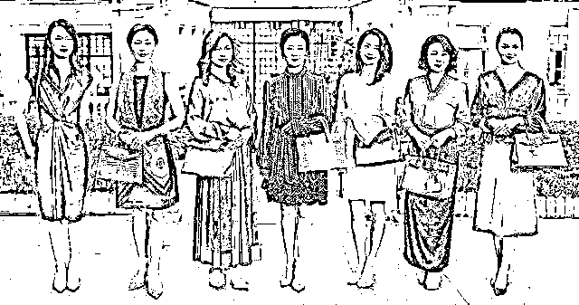

# 高净值人群销售的 99 个小技巧

> 原文：[`www.yuque.com/for_lazy/thfiu8/vzuu8i65lhe9biad`](https://www.yuque.com/for_lazy/thfiu8/vzuu8i65lhe9biad)

## (27 赞)高净值人群销售的 99 个小技巧 

作者： 小女巫忻忻 

日期：2023-08-14 

纵然现在说到高净值人群，几乎 90%都是企业主，但其实对于金融从业者，或者一些奢侈品行业的销售来说，有些人群其实购买力不啻企业主。甚至在某些市场行情下，这些被忽略的人群花钱的自由度还高于某些企业主。 

大家好，我是忻忻，一个 16 年的金融从业者，10 年高净值客户销售及培训经验。主业在外资银行教私行理财经理怎么做业绩，去年开始加入生财，找到合适自己的副业，教金融行业的销售们做单子赚钱，入局自媒体一年，靠引流到私域的 200 粉变现约 15 万。 

在帮我的学员梳理可以做大单的人群时，我们发现“避开”过于激烈的竞争，去做以下几个人群的生意，效率也许会高得多。与各位圈友一一分享。 

群体一：自媒体从业者/网文作者 

这可能就是因为“世界有壁”带来的信息不对称了，过去我从来也不知道原来做自媒体也可以达到月收入六位数。当然，这并不是说只要从事这个行业就会是高净值人群。 

其实“企业主”也会带来这样的误解，比如开了家“小饭店”，有的人可能在为房东打工，每个月甚至还亏着钱，有点人可能就每天净利润好几千。街口卖葱油饼和奶茶的大叔大妈也许坐拥好几百万呢。 

话题岔远了，回来说说这个群体。 

无论是做自媒体知识付费还是写网文，可能收入超过百万的只是头部中的头部，但也不得不承认，冒尖的人收入甚至比一些做企业的客户税后到手的还要高得多。像是我们星球几个大咖，芷蓝、根源等（靠谱和理白有主业，暂时就不算上他们），都是自媒体的头部。还有过去的起点白金作者，如今新平台的一些订阅量非常不错的作者，他们光是网文订阅就会有每年几十万的收入，更不要说改编版权等。 

所以这样的一个人群，工作 10 年，存款超过 600 万，妥妥的就是高净值人群（根据可投资资产 600 万的共识来统计）。 

这个人群的特点也很清晰： 

理论上来说缺乏保障 

未来收入的走势不明朗 

大多没有专业理财能力和经验 

年纪较轻 

相对舍得享受生活和追求品质 

为什么这么说呢？哪怕是自己成立了公司，其实他们的主要收入来源依然是个人 IP 带来的收益，市场到底是不是一直为他们的服务、创作买单，毕竟是未知的，所以说，理论上是缺乏保障的。当然了，如果需要一份稳定的工作，头部的 IP 无论如何能找到个类似运营、文案的岗位，这个且先不提。 

而收入不明朗不是说一定持悲观态度，数量级的飞跃也叫“不明朗”。拿芷蓝来举个例子，她刚从 BAT 出来做全职自媒体的时候，第一年也并没有百万的收入，大概前五年共变现 400 万，可是 2023 年平均月收入大概达到了 70-100 万。两三年前预判一下，绝对不会预测出这个金额吧。 

但是因为这些人群的脑瓜值钱在“搞钱”本身，所以其他方面的经验也许就没有那么丰富了。所以，帮这个人群做财富管理，给他们推荐一些奢侈品甚至形象气质打造，都是相当不错的生意。还有一个项目，便是健康管理——这可基本都是久坐族啊。 

群体二：独立投资者 

对我自己的学员来说，其实我是有些担心他们对独立投资者的判断的——自己炒股炒币，风险又大又没有什么保障，还不如买点保险做点理财。 

玩钱赚钱的人，和只会人赚钱的人，思维模式是相当不同的。 

前面讲超级 IP，再牛也是人赚钱，即便是一个私教收 10 万，赚 100 万也得交付 10 个人，如果希望后面源源不断，这个交付还不能差。说白了就是不能割了一茬就走人。 

但是投资者不同，他们讲究的是“数字带来的高潮”。 

虽然我和所有高净值客户都沟通一个理念——钱是拿来用的，不是拿来数的，我们无法否认，“数钱”的确会给人以相当的快感，尤其是看到数字在短期之内迅速变多。 

如果有 1000 万的本金，三个月达到 10%的回报率，那么就等于什么都不用干就可以净赚 100 万。那么当投入变成 2000 万，或者投资回报率变成 20%，或者回报周期变成一个半月……他们都能把纯利润翻个倍，并没有花出多一倍的精力。 

所以对于这样的人群来说，直勾勾地让他们花钱买东西，无异于从他们手里抢钱。你想啊，如果他从你手里买一个爱马仕的包花了 20 万，按照他年化 20%的回报率，可能就是一年的时间他因为你而少赚了 4-5 万，三年以后他“损失”20 多万。这个算法……跟谁说理去？ 

面对不同的人，我们先要研究人性，再来研究产品。管是你卖包的卖房子的还是卖保险的，对这个人群的销售思路，一定是欲速则不达——你拦不住他，因为对方势能太大惯性太大，一个不小心撞死撞伤就划不来了。 

所以对这样的人群，销售起来几乎是唯一的，但又极其简单好用的方法就是，把节奏放到对方自己手上，而我们能做的，是做个好指挥。 

钱是拿来用的，几乎是个真理。除了那 1%如巴菲特之类的高手，大多人数钱的终点还是要把它们用出去，只不过担心不够而已。就连马斯克也是有很多地方要用钱的，对吧？ 

此时我们需要做的，就是像一个好的指挥一样，和对方梳理清楚，到底是几个乐章？一场 3 小时的演奏，如果 6 个乐章，那么和 4 个乐章相比，容错的要求就完全不一样了，前面快了后面慢下来，总之对方就会了然于胸。 

一辆车哪怕开到 200 的时速，也是能安全停下来的，只要在合适的时候减速就行了。 

客户从未来回到现在，我们要做的不是劝他别做投资，而是让他意识到，是减速的时候了。 

群体三：全职太太 

还有另外一个词也经常被使用，可是我会建议大家最好别在你的客户面前这么说——家庭主妇。 

好听不好听倒是其次，而是因为我们在做销售的时候，通过给客户好的定位暗示，会让我们接下来做生意轻松得多。 

家庭主妇，重点仿佛在家事的主理，衣食住行什么的花点钱可能还好，重大消费决策，莫说先生没给她授权，可能她自己都不敢。“我要和我先生商量商量”，这个话熟悉不？ 

全职太太，也是个职业嘛，就是做太太。这的确也不太方便兼职做。 

玩笑归玩笑，当你对这么一个人群的定位称为“全职太太”的时候，对方对你的第一印象一定不错，至少这个词听起来更尊重她。 

说实话很多人在面对这个人群的时候，销售起来容易走入两个误区： 

要么就是过于忽略对方在家里的决策权，先入为主她不做主，所以很多人第一反应就是“你收入不稳定所以要给自己买点年金”，感觉这是背着先生弄点小金库的意思。 

要么就是完全不考虑可能存在的家庭分工，一股脑儿给对方推销，回去之后她必然要和先生商量，然后生意可能就黄了。因为客户思维和销售思维是不同的，我们告诉客户的那些话她肯定不会 100%还原给先生，甚至正好错过了最有价值的卖点。 

其实高净值人群的销售思路，一定不是简单地看本人有没有购买意愿和购买能力，而是都要以家庭甚至家族为整体单位来思考客户需求的。 

比如一个年轻女孩买一个名牌包包，可能是因为她觉得这能给她以自信，或许又是辛苦工作之后给自己的犒劳，哪怕仅仅出于虚荣，她买包的行为，初心是为了自己的需求。 

可是一个企业主夫人买一个爱马仕，不管她自己有没有需求和欲望要拥有它，几乎不可避免必须有一个，这大致算是社交名片了。（参考《三十而已》里的名场面） 

 

通过这个思维升级，我们就能轻易判断出，有些消费决策，全职太太是出于她“个体”就能决定的，有一些是出于“太太”的身份，代入她的家庭角色决定的。这与金额无关，和身份认定有关。所以很多时候，有些太太买一个 20 万的包不需要和老公商量，可是在银行买一份 10 万的理财产品或者保险，又要回去商量了（这里排除客户敷衍你的情况）。 

买一辆车，假如家里需要，就要从客户身份、接送孩子方便程度、甚至某些行业监管的要求和别人的敏感度去切入，已经有了保时捷的客户也许需要有一部奥迪换着开开。 

买一份保险，假如是通过投保人的设计规划，帮丈夫隔离一些资产，确保以后能低成本地融资或者无论生意好不好，孩子读书的钱都能专款专用，这时客户就不用小心翼翼地问先生，能不能买了。 

学会用这种方式销售，你甚至能帮客户提升家庭地位。 

评论区： 

暂无评论 

 