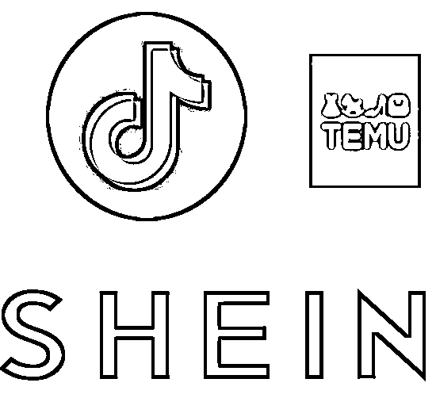

# 跨境创业？新手下场前必看的赚钱指南！

> 原文：[`www.yuque.com/for_lazy/thfiu8/eb28aycbhrb3uz1a`](https://www.yuque.com/for_lazy/thfiu8/eb28aycbhrb3uz1a)

<ne-h2 id="4a47c9ed" data-lake-id="4a47c9ed"><ne-heading-ext><ne-heading-anchor></ne-heading-anchor><ne-heading-fold></ne-heading-fold></ne-heading-ext><ne-heading-content><ne-text id="u7fadeaaf">(精华帖)(71 赞)跨境创业？新手下场前必看的赚钱指南！</ne-text></ne-heading-content></ne-h2> <ne-p id="u5ce30fba" data-lake-id="u5ce30fba"><ne-text id="u0e173a5b">作者： 希声</ne-text></ne-p> <ne-p id="uabec3dea" data-lake-id="uabec3dea"><ne-text id="u18e84ac1">日期：2023-08-18</ne-text></ne-p> <ne-p id="u3695ca45" data-lake-id="u3695ca45"><ne-text id="ud9938b10" ne-bold="true">本文目录</ne-text></ne-p> <ne-p id="u62baa7e1" data-lake-id="u62baa7e1"><ne-text id="u6f84f3c3">怎么看待小白/新手入局跨境电商</ne-text></ne-p> <ne-p id="uae1d62f8" data-lake-id="uae1d62f8"><ne-text id="u0aca5dfb">我对于不同跨境电商平台的看法</ne-text></ne-p> <ne-p id="u3e850f13" data-lake-id="u3e850f13"><ne-text id="u89e90c7f">什么样的人适合做跨境电商？</ne-text></ne-p> <ne-p id="udcd52ff9" data-lake-id="udcd52ff9"><ne-text id="u1e17b619">我的跨境电商方法论</ne-text></ne-p> <ne-p id="ub4e2ea39" data-lake-id="ub4e2ea39"><ne-text id="udb09ab56">电商方法论总结</ne-text></ne-p> <ne-p id="u5ca55343" data-lake-id="u5ca55343"><ne-text id="u17f71fb3">新手入局跨境电商的路线</ne-text></ne-p> <ne-p id="u36f757f8" data-lake-id="u36f757f8"><ne-text id="u966a5bbe">是否一定是跨境电商？——创业法则分享</ne-text></ne-p> <ne-h1 id="21f27b94" data-lake-id="21f27b94"><ne-heading-ext><ne-heading-anchor></ne-heading-anchor><ne-heading-fold></ne-heading-fold></ne-heading-ext><ne-heading-content><ne-text id="uf89f821c" ne-bold="true">怎么看待小白/新手入局跨境电商</ne-text></ne-heading-content></ne-h1> <ne-p id="u5f766ac7" data-lake-id="u5f766ac7"><ne-text id="u0a7185d4">经常有人问我：没有电商经验，想做跨境电商，能赚到钱吗？</ne-text></ne-p> <ne-p id="udc5262f3" data-lake-id="udc5262f3"><ne-text id="u8fb0123e">我反问道：为什么想做跨境电商而不是其他行业。</ne-text></ne-p> <ne-p id="u20603038" data-lake-id="u20603038"><ne-text id="ub8669869">答：主要是觉得中美之间的物价差距比较大，并且身边确实有人赚到钱了。</ne-text></ne-p> <ne-p id="ucae1203b" data-lake-id="ucae1203b"><ne-text id="uc51c7d72">一句话里提到了两个要点，一是发现了物价差距，或者可以说是一个信息差。</ne-text></ne-p> <ne-p id="u6a198792" data-lake-id="u6a198792"><ne-text id="u8745330e">第二是身边有人赚到钱了，有榜样。</ne-text></ne-p> <ne-p id="ud076bf25" data-lake-id="ud076bf25"><ne-text id="u24ad650c">那我们就针对这两点来展开说。</ne-text></ne-p> <ne-p id="uba6d8535" data-lake-id="uba6d8535"><ne-card data-card-name="image" data-card-type="inline" id="hhomZ" data-event-boundary="card"></ne-card></ne-p> <ne-p id="u89084d11" data-lake-id="u89084d11"><ne-text id="udb6c9972">我们先看第一点，发现了物价差距，发现了一个信息差。</ne-text></ne-p> <ne-p id="ue3618b9a" data-lake-id="ue3618b9a"><ne-text id="u9a71558c">这是很典型的一个外行人看热闹的例子。</ne-text></ne-p> <ne-p id="u1beaad87" data-lake-id="u1beaad87"><ne-text id="u221845ec">我并不是在讽刺，当我是个电商小白的时候，我也只会单纯得比价格，比如我发现 1688 上一个耳钉只要几毛钱，淘宝却能卖到几十块。</ne-text></ne-p> <ne-p id="u1da2f7e1" data-lake-id="u1da2f7e1"><ne-text id="u5adfa268">但这里面忽略了一个很大的问题：就是售价减去进货价并不等于利润，不等于能拿到手的钱。</ne-text></ne-p> <ne-p id="u1df977e0" data-lake-id="u1df977e0"><ne-text id="u01c4a05e">这里还有其他被忽略的成本，如物流成本，仓储成本，人工成本，售后成本等等。</ne-text></ne-p> <ne-p id="u9a551953" data-lake-id="u9a551953"><ne-text id="uef7177b3">而且还有一个最大的，外行人最容易被忽略了的成本：推广成本。</ne-text></ne-p> <ne-p id="ua4b6548e" data-lake-id="ua4b6548e"><ne-text id="ue595d426">推广成本通俗地来讲就是广告费，包含各种站内或者站外引流的费用。</ne-text></ne-p> <ne-p id="u54a4b650" data-lake-id="u54a4b650"><ne-text id="u1be6ac01">大多数人一开始做电商选产品的时候，都是选择自己想得到的，在身边能看到的产品，但这种几乎所有人都能想到的，看到的产品的竞争的激烈程度远超大多数人的想象。这就意味着不管你做的是什么平台，只要把产品上传上去之后，为了出单几乎都必须靠广告推广，但是广告的推广费能够轻易地达到售价的 50%甚至 100%，所以算上推广成本之后，大多数产品都变成不赚钱的了。</ne-text></ne-p> <ne-p id="u41a3e645" data-lake-id="u41a3e645"><ne-text id="uecb67342">中美物价差距虽然大，但是推广费差距同样也很大。比如我们常见的关键词广告，在跨境电商平台上的一个点击就不再是一元人民币一个点击，而是一美元一个点击。所以跨境电商平台的销售价虽然可能是国内的七倍，但推广费同样是近乎七倍的差距。</ne-text></ne-p> <ne-p id="uc7633b30" data-lake-id="uc7633b30"><ne-text id="uc300e3ff">我们再来看第二点，身边有人赚到钱了。</ne-text></ne-p> <ne-p id="u7299aca9" data-lake-id="u7299aca9"><ne-text id="u1e66e70e">这也是非常典型的一个理由。如果我们在互联网上看到别人赚钱的案例，我们总是下意识地会觉得不大真实，因为没办法证伪，没人知道他是在吹牛还是有真本事。但如果是身边的小学没毕业的邻居一年时间靠做电商却开上大 G，那么这种能被近距离观察到的例子带来的刺激却是非常直接的。</ne-text></ne-p> <ne-p id="ub8b9343a" data-lake-id="ub8b9343a"><ne-text id="ud3203f63">但我们忽略了一个问题：这个人赚到钱的商业模式是否存在可复制性？</ne-text></ne-p> <ne-p id="udf7204c2" data-lake-id="udf7204c2"><ne-text id="uef270518">因为只有存在可复制性，那么才有模仿的价值。</ne-text></ne-p> <ne-p id="ud400cd9c" data-lake-id="ud400cd9c"><ne-text id="ue404b1a1">事实上，世上大多数人赚到第一桶金的时候，一般都靠两点：一是市场红利，二是运气。</ne-text></ne-p> <ne-p id="u4f651b4b" data-lake-id="u4f651b4b"><ne-text id="u30238581">或者也可以总结为一点，就是运气。</ne-text></ne-p> <ne-p id="u619933af" data-lake-id="u619933af"><ne-text id="uf2ce997c">许多人赚到第一桶金的时候，并不存在什么商业认知，也没什么高大上的知识体系，纯粹是瞎折腾碰到了金矿罢了。</ne-text></ne-p> <ne-p id="ud1d257d1" data-lake-id="ud1d257d1"><ne-text id="ucc1d70ea">说下我自己的故事，上面两点问题，其实我也都经历过。</ne-text></ne-p> <ne-p id="uebe2448b" data-lake-id="uebe2448b"><ne-text id="udf3f62cd">一开始选择做电商是因为我人云亦云地觉得电商好做，然后就去做淘宝了。也许是我太笨了，灰头土脸地做了半年之后，出了两单（其中一单还被退回来了），亏了两万。</ne-text></ne-p> <ne-p id="u0364326b" data-lake-id="u0364326b"><ne-text id="u4ef9a5a9">而改变的发生是因为我在一个供应商朋友聊天的时候，对方提了一句：东南亚 shopee 最近还不错，你可以试试。</ne-text></ne-p> <ne-p id="ua008597e" data-lake-id="ua008597e"><ne-text id="u860c7216">于是我就去尝试了，开好店铺，传好产品，啥都不懂但是没几天就自然出单了，这给我带来了极大的振奋感。后面我就废寝忘食地研究，不停地传产品，开新店。</ne-text></ne-p> <ne-p id="u273d125b" data-lake-id="u273d125b"><ne-text id="ud76fb4dd">但因为这我就赚到很多钱了吗？</ne-text></ne-p> <ne-p id="udfecde14" data-lake-id="udfecde14"><ne-text id="u78e79c5a">没有。</ne-text></ne-p> <ne-p id="u63fd8c99" data-lake-id="u63fd8c99"><ne-text id="ucf465dc2">虽然没亏钱，赚了钱，但是并不多。真正赚到点钱还是因为机缘巧合下选到了一个很有意思的产品。说机缘巧合也是因为当时我依然是个电商小白，没什么体系化的运营知识，做成的事的一半以上靠的就是靠运气。</ne-text></ne-p> <ne-p id="u30c692ed" data-lake-id="u30c692ed"><ne-text id="u21335df0">所以我的第一桶金可以总结为：遇到了红利期的平台加上蓝海的产品。</ne-text></ne-p> <ne-p id="u43996524" data-lake-id="u43996524"><ne-text id="uf4e5f1f8">两者缺一不可。</ne-text></ne-p> <ne-p id="ue13a36e9" data-lake-id="ue13a36e9"><ne-text id="ueb537468">如果只是红利期平台，很容易导致销售额很高，但是不赚钱。如果只有蓝海产品，则可能产品会赚钱，但是赚的不多。</ne-text></ne-p> <ne-p id="udbc4ae8f" data-lake-id="udbc4ae8f"><ne-text id="u5ce15622">所以如果你没有任何电商经验，那么一般我不会建议你来做跨境电商。</ne-text></ne-p> <ne-p id="u050d1e52" data-lake-id="u050d1e52"><ne-text id="u8c10a0a6">跨境电商随便做都能赚钱的时代已经过去了。而且跨境电商的门槛虽然要比国内电商高不少，但是竞争却一点也不少。这里的门槛不只是资金的门槛，还有技术的门槛，文化差异的门槛。</ne-text></ne-p> <ne-p id="ud4cd4d6b" data-lake-id="ud4cd4d6b"><ne-text id="ue4fdd716">如果你选择做国内电商，找个好老师，一两个月也就上手了，但是做国外的，半年了可能还在折腾收款，税收，网络 ip，水电账单，国际物流等等。眼看别人轻轻松松都已经赚到钱了，自己熬夜，通宵，努力，最后成功把店铺或者收款账户干封了，心态很容易就崩了。</ne-text></ne-p> <ne-h1 id="d3e2ff53" data-lake-id="d3e2ff53"><ne-heading-ext><ne-heading-anchor></ne-heading-anchor><ne-heading-fold></ne-heading-fold></ne-heading-ext><ne-heading-content><ne-text id="u10eacc2f" ne-bold="true">我对于不同跨境电商平台的看法</ne-text></ne-heading-content></ne-h1> <ne-p id="ua1e6edb6" data-lake-id="ua1e6edb6"><ne-text id="uad4384ca">如果我们做国内电商，我们可以选择做淘宝，做拼多多，做抖音带货甚至知乎带货，这些都可以称之为电商，但是不同的平台的玩法和规则差异却很大。同理，在跨境电商里面，有做亚马逊平台的，有做独立站的，有做欧美市场的，有做非洲市场的，有做实体产品，有做虚拟产品的，有一件代发的，也有做 POD 定制的……不同的市场，不同的平台，不同的产品，不同的商业模式下运营逻辑，团队规模，资金要求都是有很大差异的。</ne-text></ne-p> <ne-p id="udae0654d" data-lake-id="udae0654d"><ne-text id="u53af2991">虽然市场，平台，以及运营模式和商业模式都有许许多多的不同，但很多人还是很好奇不同的平台之间的差异性是什么，各有什么优缺点。我自己做过的跨境电商平台主要就三个：shopee 虾皮、独立站（独立站归纳到平台里并不严谨，但是方便新手理解）、Etsy。其他平台虽没做过，但有朋友在做，所以也了解，那下面就简单地说一下我对于各个平台的看法。</ne-text></ne-p> <ne-h2 id="a1866feb" data-lake-id="a1866feb"><ne-heading-ext><ne-heading-anchor></ne-heading-anchor><ne-heading-fold></ne-heading-fold></ne-heading-ext><ne-heading-content><ne-text id="u5646a104" ne-bold="true">亚马逊</ne-text></ne-heading-content></ne-h2> <ne-p id="u4174f09d" data-lake-id="u4174f09d"><ne-text id="udf689ccd">最有价值的平台，也是天花板最高的平台。</ne-text></ne-p> <ne-p id="u36b905ce" data-lake-id="u36b905ce"><ne-text id="ua0ae8e5e">虽然规则很多很烦人，但是这样能保证不会劣币驱逐良币。所以如果产品是有差异化的，真正要做产品出海的，亚马逊是无法绕过的平台。</ne-text></ne-p> <ne-p id="u1930b0d6" data-lake-id="u1930b0d6"><ne-text id="ud751995d">许多人说亚马逊现在是一个重资产生意，随便一个产品，设计、开模、生产都要几十万的资金。道理没错，但也不是没有小本钱的做法。大多数人开模做产品都是为了做出更大的差异化，但有些创新并不一定都需要开模才行，如果只是颜色改变，图案改变，材质改变，甚至是服务改变，都可以是创新。所以大钱有大钱的赚法，小钱有小钱的赚法，钱多可以做贵的产品，钱少可以做便宜的产品。我们可以慢慢先积累原始资本，之后自然也有了做大产品的资格。</ne-text></ne-p> <ne-h2 id="99e83aeb" data-lake-id="99e83aeb"><ne-heading-ext><ne-heading-anchor></ne-heading-anchor><ne-heading-fold></ne-heading-fold></ne-heading-ext><ne-heading-content><ne-text id="ud1a6bcd8" ne-bold="true">独立站</ne-text></ne-heading-content></ne-h2> <ne-p id="uc268db74" data-lake-id="uc268db74"><ne-text id="u9b92986c">独立站也就是自建站，是最有前景的方向，但被鼓吹过了头。</ne-text></ne-p> <ne-p id="ub82a4c7b" data-lake-id="ub82a4c7b"><ne-text id="u18c866a5">说一句得罪人的话，独立站不适合绝大多数普通人，也就是没有任何经验和积累却想通过这个方向来赚钱。</ne-text></ne-p> <ne-p id="ua0eeffe5" data-lake-id="ua0eeffe5"><ne-text id="u6e1dea44">独立站最大的问题就是要说服客户：凭啥不在第三方平台买东西，却要在你的网站这里买？为此需要付出的是更高的流量费用和更高的产品与服务要求。</ne-text></ne-p> <ne-p id="u8054082c" data-lake-id="u8054082c"><ne-text id="u587e043d">小白尽量不要做这个方向，如果一定要做就一定要打开思路，不要只盯着那些普通产品，可以打开思路，销售如虚拟产品，定制产品，成人产品（因为大多数平台不允许销售成人用品）等。</ne-text></ne-p> <ne-p id="ua91621df" data-lake-id="ua91621df"><ne-text id="uc2758a52">但如果你是 B2B 商家，则必须布局独立站，因为对于 B 端商家来说，独立站获客是一个投入很低但是潜在收益非常大的方向。我没有 B 端经验，但做过一个 B 端网站，通过谷歌广告来获取询盘。从开始建站到拿到第一个询盘大概花了一个月，设置好网站和广告之后，每天只要花费少量时间就可以比较稳定地拿到询盘。</ne-text></ne-p> <ne-h2 id="39318b19" data-lake-id="39318b19"><ne-heading-ext><ne-heading-anchor></ne-heading-anchor><ne-heading-fold></ne-heading-fold></ne-heading-ext><ne-heading-content><ne-text id="ub29259f4">Temu，Shein，Tiktok </ne-text></ne-heading-content></ne-h2> <ne-p id="ub8fdcdd3" data-lake-id="ub8fdcdd3"><ne-text id="uce0f5173">Temu（拼多多海外版） 是今年最火的平台，Shein 是从前两年开始火的，Tiktok 则已经火了两三年了。这三个平台很有意思，今年都在都在推“全推广模式”。</ne-text><ne-card data-card-name="image" data-card-type="inline" id="Dg2In" data-event-boundary="card"></ne-card></ne-p> <ne-p id="u52c923e7" data-lake-id="u52c923e7"><ne-text id="u05ba1ca4">全推广模式看起来很好：只要负责产品发货到仓库，其他诸如运营，客服，售后通通不用管。</ne-text></ne-p> <ne-p id="uf556a939" data-lake-id="uf556a939"><ne-text id="uf9cec14c">但代价就是：极低极低的利润率。</ne-text></ne-p> <ne-p id="ua88a3c1d" data-lake-id="ua88a3c1d"><ne-text id="ue7e38697">在全托管模式下，平台基本掌控了一切，卖家完全变成了供应商的角色，而供应商角色的后果就是非常被动，只能被动接受平台的任意拿捏。</ne-text></ne-p> <ne-p id="ue64c49d1" data-lake-id="ue64c49d1"><ne-text id="u8b35645d">当我们做个卖家的时候，我们要做产品的详情页内容，要写 listing，要调研竞争对手，要做广告优化，要琢磨卖点……虽然我们的工作很多，很繁琐，但是越多的动作和行为也是在形成一种运营门槛。</ne-text></ne-p> <ne-p id="u2f80a34f" data-lake-id="u2f80a34f"><ne-text id="u80ca0e2d">门槛就代表着利润。</ne-text></ne-p> <ne-p id="u42c96105" data-lake-id="u42c96105"><ne-text id="uf2f3d2c2">一个生意如果没有门槛，那就会很糟糕，因为任何人都可以进入，而任何人都可以进入的行业就势必会非常内卷，特别是价格内卷。你八块，我就七块，他就六块，没有最低，只有更低，最后大家终于默契地一起把价格维持在一个都吃不饱但也饿不死的情况。</ne-text></ne-p> <ne-p id="u5a136e90" data-lake-id="u5a136e90"><ne-text id="u43305209">所以全托管模式受益的只有真正的源头工厂和平台，而大多数作为中间商赚差价的卖家则生存空间只会被不停地挤压直至消失。</ne-text></ne-p> <ne-p id="uafe3a226" data-lake-id="uafe3a226"><ne-text id="u7353676f">所以我是怎么看待 Temu，shein，tiktok？</ne-text></ne-p> <ne-p id="u55425bb7" data-lake-id="u55425bb7"><ne-text id="ua345ff0f">如果你是一个中间商的卖家，那这些平台并不合适，但如果你是工厂或者有清库存的需求，那么可以下场试水。</ne-text></ne-p> <ne-p id="u7b0db9f0" data-lake-id="u7b0db9f0"><ne-text id="u9f7ecebd">当然，这里把 Tiktok 归纳到电商平台里是不合理的，因为 Tiktok 本质上是一个泛娱乐的流量平台（相对于纯电商平台来说），同时 Tiktok 并不只有小店这个运营模式，还有导流到独立站的销售模式，导流到私域的销售模式等等，可以玩的模式种类非常多。</ne-text></ne-p> <ne-h2 id="4a48d7bb" data-lake-id="4a48d7bb"><ne-heading-ext><ne-heading-anchor></ne-heading-anchor><ne-heading-fold></ne-heading-fold></ne-heading-ext><ne-heading-content><ne-text id="u06510ac4" ne-bold="true">shopee 虾皮、速卖通等小众平台</ne-text></ne-heading-content></ne-h2> <ne-p id="ud7c437b7" data-lake-id="ud7c437b7"><ne-text id="ud17d4279">虾皮，速卖通，或者是日本的乐天，俄罗斯的 Ozon，韩国的 coupang、南美的美客多、非洲的 jumia，Allegro 等平台，相较于主流的亚马逊和独立站来说，是比较小众的平台。</ne-text></ne-p> <ne-p id="ua6304e94" data-lake-id="ua6304e94"><ne-text id="u91c594bc">劣势是：市场小，用户体量小，客户消费力不高，产品溢价较低。</ne-text></ne-p> <ne-p id="u3086e260" data-lake-id="u3086e260"><ne-text id="u8e6e730c">优势是：市场竞争比较小，没有亚马逊等平台竞争那么激烈。</ne-text></ne-p> <ne-p id="u1e1226af" data-lake-id="u1e1226af"><ne-text id="ubb68a125">对于这类小平台或者新兴平台，如果是早期，可以通过铺货来快速占领市场，但是后期则必然要转型做精铺甚至是精品模式。原因很简单，你也铺，我也铺，很容易市场就会同质化，而利润从来都是来自于差异化，但差异化是需要时间和精力成本的。</ne-text></ne-p> <ne-h2 id="7bd52c2a" data-lake-id="7bd52c2a"><ne-heading-ext><ne-heading-anchor></ne-heading-anchor><ne-heading-fold></ne-heading-fold></ne-heading-ext><ne-heading-content><ne-text id="u0d72bfc5" ne-bold="true">Etsy</ne-text></ne-heading-content></ne-h2> <ne-p id="uf7b1bf07" data-lake-id="uf7b1bf07"><ne-text id="u9ce261d4">这也是一个很小众的平台，在跨境电商平台上排名前十，但由于平台关闭了国内的注册通道所以变得小众了。</ne-text></ne-p> <ne-p id="u060c876c" data-lake-id="u060c876c"><ne-text id="ufad2d909">这个平台的特点是专注于手工原创的产品。平台的特点和调性决定了会有很多其他平台的卖家到这个平台上来选品或者取经，在上面经常能看到许多眼前一亮的产品，而且上面也会有许多有意思的虚拟产品。</ne-text></ne-p> <ne-p id="u6accbd22" data-lake-id="u6accbd22"><ne-text id="ubceabade">这个平台的优点是：竞争少，利润高，回款快（最快可以第二天回款），后台操作极其简单。</ne-text></ne-p> <ne-p id="uef11e452" data-lake-id="uef11e452"><ne-text id="u59dfd555">缺点是：国内资料无法开店，封店非常凶。</ne-text></ne-p> <ne-p id="uff140641" data-lake-id="uff140641"><ne-text id="ub4d74dc3">对于这个平台我的建议很简单，如果你有国外朋友帮你开店，那么可以去大胆尝试，如果没有海外朋友协助，真诚建议不要下场，免得最后精力和金钱两空。</ne-text></ne-p> <ne-h2 id="35e34260" data-lake-id="35e34260"><ne-heading-ext><ne-heading-anchor></ne-heading-anchor><ne-heading-fold></ne-heading-fold></ne-heading-ext><ne-heading-content><ne-text id="u65065772">其他平台</ne-text></ne-heading-content></ne-h2> <ne-p id="ucf7ea779" data-lake-id="ucf7ea779"><ne-card data-card-name="image" data-card-type="inline" id="oF4H1" data-event-boundary="card"></ne-card></ne-p> <ne-p id="u7d1de42a" data-lake-id="u7d1de42a"><ne-text id="u77fae5e6">其他平台如 eBay， 沃尔玛，专注家居的平台 Wayfair，二手交易平台 Mercari ，人力服务的 Fiverr （是的，严格来说这不算电商平台，但思路也要打开，为什么我们一定要卖货呢？就不能卖服务呢？所以这个平台我也简单地尝试过）等平台，我就不做过多介绍，感兴趣的可以自行查询。</ne-text></ne-p> <ne-h1 id="0db030e9" data-lake-id="0db030e9"><ne-heading-ext><ne-heading-anchor></ne-heading-anchor><ne-heading-fold></ne-heading-fold></ne-heading-ext><ne-heading-content><ne-text id="u125b5285" ne-bold="true">什么样的人适合做跨境电商？</ne-text></ne-heading-content></ne-h1> <ne-p id="ud827934b" data-lake-id="ud827934b"><ne-text id="u18a4b012">在我浅薄的经验里面，我觉得最适合入局跨境电商的人最好是：一是有相关的电商经验，二是有跨境方面的需求或者优势。</ne-text></ne-p> <ne-p id="u1097640e" data-lake-id="u1097640e"><ne-text id="ube41b793">比如你是有海外资源的，有多年外贸经验的又或者本身就是工厂而且有扩展外贸需求的，在这些情况下切入进来是比较适合的。</ne-text></ne-p> <ne-p id="u71d46cf3" data-lake-id="u71d46cf3"><ne-text id="u163b3736">总结就是：要么有经验，要么有某种优势，不要为了做跨境电商而做跨境电商。</ne-text></ne-p> <ne-p id="ua5b4cd43" data-lake-id="ua5b4cd43"><ne-text id="u843fdedd">所以如果你只是想做点副业赚点钱，那么我的建议还是从国内开始。</ne-text></ne-p> <ne-p id="udce02f9c" data-lake-id="udce02f9c"><ne-text id="u9becce3c">比如站在 2023 这个节点，你可以选择做闲鱼先赚点小钱练练手，培养销售的网感；或者做小红书账号，培养做媒体账号的网感。任何少投入的尝试，同时可以积累各种商业经验的项目都是很好的切入点。</ne-text></ne-p> <ne-p id="ua644b8ee" data-lake-id="ua644b8ee"><ne-text id="u9d25a2cf">千万不要小看每一个项目，每个再小的项目都有年入千万的人，但有这些收入的人一定也都是在这个领域持续深耕的人。而那些打一枪换一炮的人，一两个月就换一个项目的人最终几乎都只能亏钱而赚不到钱。</ne-text></ne-p> <ne-h1 id="b776cfca" data-lake-id="b776cfca"><ne-heading-ext><ne-heading-anchor></ne-heading-anchor><ne-heading-fold></ne-heading-fold></ne-heading-ext><ne-heading-content><ne-text id="u6ab866d3" ne-bold="true">我的跨境电商方法论</ne-text></ne-heading-content></ne-h1> <ne-p id="ucc58bb4b" data-lake-id="ucc58bb4b"><ne-text id="u71387199">下面阐述一个我曾经在 shopee 上面做过的一个蓝海模式的玩法，同时最后我会总结一个适合新手/小白入场跨境电商的方法论。</ne-text></ne-p> <ne-p id="ua7d6a5a3" data-lake-id="ua7d6a5a3"><ne-text id="u5d2c5962">先说下背景：2019 年中，我开始做 shopee 虾皮，当时因为 shopee 的开店成本很低，所以大多数人的做法就是直接搬运国内拼多多或者 1688 的商品，使用现成的 ERP 软件一键搬运，点一点鼠标，一天可以上传几千几万个产品，暴力获取免费流量。</ne-text></ne-p> <ne-p id="ufe1b5f8e" data-lake-id="ufe1b5f8e"><ne-text id="u4465d0e0">但同时，我发现在市场上很少有人愿意去仔细打磨一个产品，大多数人都是用软件把 1688 或者拼多多的产品直接铺到 shopee 上，图片，标题，详情页都是不带改动的。</ne-text></ne-p> <ne-p id="u79574406" data-lake-id="u79574406"><ne-text id="uc74ceb26">电商卖货，卖的就是图片+服务+产品，所以从这几方面下手，我觉得 shopee 一样可以做精品的。所以当时我的做法是：</ne-text></ne-p> <ne-p id="u76dab9bd" data-lake-id="u76dab9bd"><ne-card data-card-name="image" data-card-type="inline" id="tXsh6" data-event-boundary="card"></ne-card></ne-p> <ne-h2 id="0f5eb5e7" data-lake-id="0f5eb5e7"><ne-heading-ext><ne-heading-anchor></ne-heading-anchor><ne-heading-fold></ne-heading-fold></ne-heading-ext><ne-heading-content><ne-text id="u068925bc" ne-bold="true">第一，寻找蓝海</ne-text></ne-heading-content></ne-h2> <ne-p id="u611554c6" data-lake-id="u611554c6"><ne-text id="u045fab6d">避开大类目，去寻找一些小众的蓝海产品。我通过 shopee 的关键字广告，查询和搜集关键字的月平均搜索量（搜索量约等于市场大小）和虾皮的建议出价（建议出价的高低约等于竞争程度），然后用搜索量除以建议出价，可以大概得出一个市场的机会程度（也就是搜索量越大，建议出价越低，那么就可以简单地认为这是一个很好做的产品）。</ne-text></ne-p> <ne-p id="u4ececa24" data-lake-id="u4ececa24"><ne-text id="u52c00344">用这个方法大量地搜集数据之后再用降序排列，就能找到最适合的产品关键词。同时这个产品最好是非标品（我对于非标品的理解就是没有明确头部品牌的产品），因为非标品的价格弹性空间更大。</ne-text></ne-p> <ne-h2 id="5581869d" data-lake-id="5581869d"><ne-heading-ext><ne-heading-anchor></ne-heading-anchor><ne-heading-fold></ne-heading-fold></ne-heading-ext><ne-heading-content><ne-text id="u78cf22e6" ne-bold="true">第二，产品上传</ne-text></ne-heading-content></ne-h2> <ne-p id="u8cf8d253" data-lake-id="u8cf8d253"><ne-text id="u6cea875d">淘宝，拼多多，1688 上面去大量搜集这个产品的图片，然后把最好的图片复制下来。</ne-text></ne-p> <ne-p id="u59d4b4da" data-lake-id="u59d4b4da"><ne-text id="uc4f167ea">在搜集图片的同时，参考国内淘宝和拼多多上面同行的 listing 来整理出一两个卖点。我很喜欢参考拼多多的主图，由于同行的内卷，他们的主图都非常骚气，卖点十足，且卖点都会直接写在主图上面。同时重点关注那些卖的好的 listing，卖得好至少说明他们的这个主图已经是迭代多次后的最优选择。</ne-text></ne-p> <ne-p id="u38ddfa4d" data-lake-id="u38ddfa4d"><ne-text id="u52a5c297">把最好的图片挑出来，整理好，并把图片上面的文字改成当地语言。</ne-text></ne-p> <ne-p id="u700b3998" data-lake-id="u700b3998"><ne-text id="u96d89254">用稿定设计/canva 这类软件自己设计一个 logo，然后在每个主图上面都加上自己的 logo。商店的头像，店铺设计上面也换上这个 logo，打造出一个类品牌官方店的感觉，真的有没有品牌不重要，只要客户看起来像就行了。</ne-text></ne-p> <ne-p id="u77606412" data-lake-id="u77606412"><ne-text id="u08f4c0b8">详情页对标 shopee 上的品牌店（shopee 早期的详情页不支持图片格式，只能纯文字+emoji 图标），目的是让详情页内容饱满丰富。</ne-text></ne-p> <ne-p id="u9e86fcab" data-lake-id="u9e86fcab"><ne-text id="u1ed902a6">把价格设置得比预期售价高一些，然后用折扣去调整价格。这样做的目的是为了方便后期用折扣来动态调整价格。</ne-text></ne-p> <ne-h2 id="3b4970cc" data-lake-id="3b4970cc"><ne-heading-ext><ne-heading-anchor></ne-heading-anchor><ne-heading-fold></ne-heading-fold></ne-heading-ext><ne-heading-content><ne-text id="u80f834f1" ne-bold="true">第三，霸占广告</ne-text></ne-heading-content></ne-h2> <ne-p id="u32f69d8f" data-lake-id="u32f69d8f"><ne-text id="u1e060557">找到合适的产品并做好详情页之后，把这个产品的 sku 拆分成一个个独立的产品。举个例子，比如一款护手霜（随便想的一个例子）有玫瑰味，草莓味，苹果味，那我就上传一款草莓味的护手霜，一款玫瑰味的护手霜，一款苹果味的护手霜，而不是把这 3 个 sku 都并到一个产品里面。</ne-text></ne-p> <ne-p id="u2c5901fd" data-lake-id="u2c5901fd"><ne-text id="u0acc791a">然后分别把这三款产品都开始推广关键字广告，把能找到的关键字都填进去，堆满。然后全部设置最低出价。</ne-text></ne-p> <ne-p id="ud72de372" data-lake-id="ud72de372"><ne-text id="ufbc06f89">关联广告也全部打开，也都设置最低出价。</ne-text></ne-p> <ne-h2 id="5fe16088" data-lake-id="5fe16088"><ne-heading-ext><ne-heading-anchor></ne-heading-anchor><ne-heading-fold></ne-heading-fold></ne-heading-ext><ne-heading-content><ne-text id="u92f5c97c" ne-bold="true">第四，垄断市场</ne-text></ne-heading-content></ne-h2> <ne-p id="ue80859f2" data-lake-id="ue80859f2"><ne-text id="u6e0ad288">同一个产品，开多个店铺，定位中端，高端，然后在价格，主图，详情页，客服话术上面做出差异化，形成一个小垄断的市场。</ne-text></ne-p> <ne-p id="u63dc112e" data-lake-id="u63dc112e"><ne-text id="ua1638a55">一开始先做一个店铺，一个产品，销量做起来之后，就涨价，定位成高端店铺，然后再开两个店铺，定位成低端和中端。这个过程中注意一定要搞出差异化，产品即使差不多，在包装上面也要下点功夫，至少要让客户看起来高中低端产品是有差异的。比如我们的高端产品就用自己设计的包装盒，然后赠品送一大堆，同时附带好评卡，上面有社交软件加好友引导。中端低端的为了差异化就能简化的都简化了。</ne-text></ne-p> <ne-h2 id="dd919dc5" data-lake-id="dd919dc5"><ne-heading-ext><ne-heading-anchor></ne-heading-anchor><ne-heading-fold></ne-heading-fold></ne-heading-ext><ne-heading-content><ne-text id="u07c06f7c" ne-bold="true">第五，后期优化</ne-text></ne-heading-content></ne-h2> <ne-p id="u170b3812" data-lake-id="u170b3812"><ne-text id="u2aa6d340">用这套玩法，我们基本霸占了几个蓝海产品的大部分市场，用两三个月的时间成功超越做了多年的本土卖家，利润也很高。</ne-text></ne-p> <ne-p id="u4209bf8f" data-lake-id="u4209bf8f"><ne-text id="u3b4f25bc">但是这套玩法也不是万能的，做久了也会有同行看到并模仿我们切入进来。所以主推的产品，前期一定要尽可能地出单，把销量最大化拉上去。等后期同行进来的时候，我们就会把关键字广告的出价拉高，同时关联广告的出价也要尽可能地拉高。</ne-text></ne-p> <ne-p id="u821b77be" data-lake-id="u821b77be"><ne-text id="ua15bc11b">在任何平台，同行越来越多都是一个必然的事件，所以我们只能利用自身积累的优势，然后去把他们挤走。而在早期的时候销量一定要尽快打开，有什么不满，一律退款，货也送给你了，但必须留下好评，从而建立一个小的护城河。</ne-text></ne-p> <ne-h1 id="d8eeac6b" data-lake-id="d8eeac6b"><ne-heading-ext><ne-heading-anchor></ne-heading-anchor><ne-heading-fold></ne-heading-fold></ne-heading-ext><ne-heading-content><ne-text id="u1c5adaa8" ne-bold="true">电商方法论总结</ne-text></ne-heading-content></ne-h1> <ne-p id="uafe5b67c" data-lake-id="uafe5b67c"><ne-text id="u84d75292">上面这些步骤的核心思路就是——寻找小众低竞争的蓝海产品，然后把非标品的产品用品牌化的打法来做出差异性，之后再通过多产品，多店铺的方法尽可能地占领市场，获得更多的利润。</ne-text></ne-p> <ne-p id="ub7c5a384" data-lake-id="ub7c5a384"><ne-text id="ucc208c71">这个玩法的优势是：通过差异化和多产品/多店铺来最大化地赚取该产品的市场利润。</ne-text></ne-p> <ne-p id="ub3f44acc" data-lake-id="ub3f44acc"><ne-text id="ud3d2f862">这个玩法的局限性同样也很明显：只适合小众的蓝海产品，不适合标品或者热门产品（因为这些产品竞争太激烈了）。而且随着竞争的加剧，所谓的“垄断”也只能持续一段时间。</ne-text></ne-p> <ne-p id="ub71caea1" data-lake-id="ub71caea1"><ne-text id="u4ba2a448">对于新手或者小白来说，这个玩法最有价值，最适用的点其实可以用两个词概括：低竞争和差异化。新手做电商，不管是哪个电商平台，最好的方法论就是找到低竞争的产品，然后找到或者做出产品的差异化。</ne-text></ne-p> <ne-p id="ua0e53c10" data-lake-id="ua0e53c10"><ne-text id="u1fb94726">原因是什么呢？</ne-text></ne-p> <ne-p id="ue77d73fc" data-lake-id="ue77d73fc"><ne-text id="u1d2ae873">电商的本质是是销售，是买卖。所以对于买家来说，东西肯定越便宜越好，你想卖贵？当然可以，但是总得有个理由，要么有品牌，要么有质量，要么有服务，要么有别的产品无法满足的差异化特点。但是在电商的早期我们是新手，没有资源，没有经验，如果我们卖的都是普通产品（比如衣服鞋子包包），我们和别的卖家比起来能有什么优势？</ne-text></ne-p> <ne-p id="ub8a43640" data-lake-id="ub8a43640"><ne-text id="uad09e05a">答案是没有。所以我们只能另辟蹊径，找到那些大卖家注意不到的产品/看不上的产品，或者挖掘出大卖家忽略了的客户需求，也就是错开竞争，避免和大卖家直接竞争。</ne-text></ne-p> <ne-p id="u4cc16d4f" data-lake-id="u4cc16d4f"><ne-text id="u66bf7d18">新手想要在跨境电商领域赚到钱，最好的办法就是集中资源，找小市场，小产品发力，集中精力在一个点上面，才能赚到钱。</ne-text></ne-p> <ne-h2 id="3c14402a" data-lake-id="3c14402a"><ne-heading-ext><ne-heading-anchor></ne-heading-anchor><ne-heading-fold></ne-heading-fold></ne-heading-ext><ne-heading-content><ne-text id="u192463d5" ne-bold="true">怎么找蓝海产品？</ne-text></ne-heading-content></ne-h2> <ne-p id="ubee29024" data-lake-id="ubee29024"><ne-text id="u360af4f1">说了这么多，那怎么找到低竞争的蓝海产品？</ne-text></ne-p> <ne-p id="u416eb096" data-lake-id="u416eb096"><ne-text id="u31c2a791">这方面最好的实践就是使用各种数据分析工具，不同的平台都有不同的数据分析工具，上网搜一下就有了。</ne-text></ne-p> <ne-p id="u7879cfea" data-lake-id="u7879cfea"><ne-text id="u8329b230">大多数数据分析都能提供较为全面的数据，比如某个产品的销量，某个产品的竞品数量，又或者是某个关键词的搜索量，关键词的出价等，要理解这些数据的背后代表了什么，然后把这些数据都抽象为“需求”和“竞争”两个概念。</ne-text></ne-p> <ne-p id="u52f5b963" data-lake-id="u52f5b963"><ne-text id="u7fffcd08">进行数据比对的时候，简单的方式是直接用这两个数据相除再排序来找到最优的产品，如果要比较全面地比对，就需要再比较其他的数据（比如要求产品的长期趋势要稳步上升，产品的市场需求不能太小，客单价不能太低，退货率不能太高等）来寻找合适的产品。</ne-text></ne-p> <ne-p id="u6954e529" data-lake-id="u6954e529"><ne-text id="u5034192a">这里要注意的一个点是：除了官方的工具，第三方的数据工具的数据都是基于自己的算法来得出的数据，都是不准确的。但我们选品本质上是要从一堆产品里面找到最优的产品，也就是只需要知道排名的高低而不需要知道具体的排名分数。所以虽然第三方工具的数据不准，但我们只要是用一个固定数据工具来横向比对不同产品从而得出相对值来比较就够了。</ne-text></ne-p> <ne-h2 id="dcb00314" data-lake-id="dcb00314"><ne-heading-ext><ne-heading-anchor></ne-heading-anchor><ne-heading-fold></ne-heading-fold></ne-heading-ext><ne-heading-content><ne-text id="u39fdbf0d" ne-bold="true">怎么找到差异化卖点？</ne-text></ne-heading-content></ne-h2> <ne-p id="ub587cd2d" data-lake-id="ub587cd2d"><ne-text id="u80c1bcc4">第一种方法：模仿。</ne-text></ne-p> <ne-p id="u7f6ca21a" data-lake-id="u7f6ca21a"><ne-text id="u8b59f7ba">因为我们对这个产品并不熟悉，我们坐在那里空想几乎很难得出什么有用的结论，所以最好的方法就是多看多学多模仿，去看看看优秀同行的卖点。可以是同一个平台的，也可以是不同平台上，多看看那些卖得好的产品有什么差异化特点。模仿优秀的同行永远是最快捷的一条道路。</ne-text></ne-p> <ne-p id="uda4a0239" data-lake-id="uda4a0239"><ne-text id="uefca7750">第二种方法：提炼差评。</ne-text></ne-p> <ne-p id="ud52ae2ab" data-lake-id="ud52ae2ab"><ne-text id="u7f6f207f">搜集平台上同行销量好的产品下的差评，或者是搜集不同平台下该产品的差评，然后用 AI 总结这些差评。差评代表了客户的不满和痛点，只要我们能解决这些痛点，那这就是我们的差异化。</ne-text></ne-p> <ne-p id="u32a59565" data-lake-id="u32a59565"><ne-text id="ub62b66cd">第三种方法：卖点平移。</ne-text></ne-p> <ne-p id="u8914c5dc" data-lake-id="u8914c5dc"><ne-text id="ue83ff106">所谓卖点平移就是把 A 产品上的卖点移植到 B 产品上。</ne-text></ne-p> <ne-p id="ubf3d1043" data-lake-id="ubf3d1043"><ne-text id="ud923e499">比如我曾经在淘宝上买过一个单机游戏，只要几块钱，但同时我看到了卖家还有一个套餐是 69.9 元加入会员就可以获得几千款单机游戏资源。虽然那么多游戏我也玩不过来，但是这巨大的性价比依然让我忍不住下单了。所以后来我在卖一款虚拟产品的时候也用了这个方式：设置不同的套装组合，用低客单的套餐吸引用户点击，同时设置高性价比的高价套餐来获取更高的利润。</ne-text></ne-p> <ne-p id="u4661d6dd" data-lake-id="u4661d6dd"><ne-text id="u17fc4f1b">最后我们要知道，差异化其实是多方面的，可以是产品本身的差异化，可以是图片的差异化，可以是包装的差异化，颜色的差异化，材料的差异化，也可以是服务的差异化，甚至是销售方式的差异化。</ne-text></ne-p> <ne-p id="u33ed5a13" data-lake-id="u33ed5a13"><ne-text id="u05e07de6">做电商，重点是一定不能让自己的思维被固化。</ne-text></ne-p> <ne-h1 id="85f14093" data-lake-id="85f14093"><ne-heading-ext><ne-heading-anchor></ne-heading-anchor><ne-heading-fold></ne-heading-fold></ne-heading-ext><ne-heading-content><ne-text id="u4492ccc6" ne-bold="true">新手入局跨境电商的路线</ne-text></ne-heading-content></ne-h1> <ne-p id="ufff1db01" data-lake-id="ufff1db01"><ne-text id="ua000d5c8">新手入局，我更推荐从小众平台或者小产品开始。</ne-text></ne-p> <ne-p id="ua569befa" data-lake-id="ua569befa"><ne-text id="u3588f08c">我有一个论点是：我们能赚多少钱是由竞争对手决定的。</ne-text></ne-p> <ne-p id="uf3495277" data-lake-id="uf3495277"><ne-text id="ue06a0192">我们都是普通人，没有乔布斯那种创造独一无二产品的能力，所以我们要先看到，并承认自己的不足和弱势。既然我们是普通的，在全局上（产品、运营、资金等）是没有优势的，那我们就要找到局部的优势，找到那些比我们还差的竞争对手去打。也许我只有 30 分，打不过 80 分的同行和产品，但我只要找到 20 分的产品和对手，却依然可以打得过；而如果等到我成长到了 50 分，此时我就可以去挑战 40 分的产品和对手了。</ne-text></ne-p> <ne-p id="u94fe61c2" data-lake-id="u94fe61c2"><ne-text id="u51ef6f19">优势不是固定的，优势是相对的，并且总在动态变化之中。所以承认不足不是放弃，反而是要去积极寻找突破口，在局部上形成优势，在局部上集中兵力，找到一个小产品小市场，轻松地打出胜仗。</ne-text></ne-p> <ne-p id="u38e3f288" data-lake-id="u38e3f288"><ne-text id="u4ee19e68">所以新手入场，不要好高骛远，最好是先积累电商的运营经验，积累选品的感觉，积累数据分析的能力，前期不求赚多少，只求控制成本不亏钱。随着经验的积累，每个人都一定能找到适合自己的一小块电商土地，深耕获利。</ne-text></ne-p> <ne-p id="uf6bd0f45" data-lake-id="uf6bd0f45"><ne-text id="u3be62220">而当我们能持续稳定地赚钱之后，我们就要用更高的维度来看待我们的生意了。</ne-text></ne-p> <ne-p id="u2c2e7fd9" data-lake-id="u2c2e7fd9"><ne-text id="u48f6af16">做电商也是在做生意，做生意就不能忽略商业的规律。当我们学习了越来越多的运营知识之后，就要避免走入的下面这种误区：过于注重运营细节而导致忽略了商业模式的优化或者改变。</ne-text></ne-p> <ne-p id="u36b2dcc2" data-lake-id="u36b2dcc2"><ne-text id="u4658330b">电商行业常说：七分靠选品，三分靠运营。核心逻辑就是：想赚钱的重点是找对产品。而我的理解是：那些赚钱的产品都是因为这个产品满足了其他产品没有满足的用户痛点。</ne-text></ne-p> <ne-p id="u2467220f" data-lake-id="u2467220f"><ne-text id="u985e4302">我们可以时常问一问自己这些问题：</ne-text></ne-p> <ne-p id="u1c135e66" data-lake-id="u1c135e66"><ne-text id="u555d11cd">我们一定要做低端产品吗？</ne-text></ne-p> <ne-p id="ub44a3d46" data-lake-id="ub44a3d46"><ne-text id="uf993e5cc">用户有没有什么痛点没有被满足？</ne-text></ne-p> <ne-p id="ub97f9eaa" data-lake-id="ub97f9eaa"><ne-text id="udc745dca">我们的产品能不能做出不同的差异化？</ne-text></ne-p> <ne-p id="uf179f7ce" data-lake-id="uf179f7ce"><ne-text id="u4a6efa3e">不同的用户群会不会有不同的需求？</ne-text></ne-p> <ne-p id="u871f966b" data-lake-id="u871f966b"><ne-text id="ua68b1729">中老年群体，性少数者 / LGBTQ 群体，残障群体等这些少数群体是否有某些潜在需求没有被满足？</ne-text></ne-p> <ne-p id="u17106430" data-lake-id="u17106430"><ne-text id="u375c1b19">为自己提这些问题的最终目的就是要从“盲从“走向“引领”，因为商业的持久利润的来源一定是来自于创新，或者说得准度点说：来自于那些未被满足的痛点。</ne-text></ne-p> <ne-h1 id="d037ebfc" data-lake-id="d037ebfc"><ne-heading-ext><ne-heading-anchor></ne-heading-anchor><ne-heading-fold></ne-heading-fold></ne-heading-ext><ne-heading-content><ne-text id="uc2e11766" ne-bold="true">是否一定是跨境电商？普通人轻资产创业十条法则分享</ne-text></ne-heading-content></ne-h1> <ne-p id="uabef4a4b" data-lake-id="uabef4a4b"><ne-text id="u39c615a9">创业要成功最重要的能力是什么？是运气。</ne-text></ne-p> <ne-p id="u3f350669" data-lake-id="u3f350669"><ne-text id="u40c04845">大家赚第一桶金时，都是运气占主要成分。一般都是懵懵懂懂做了某件事，然后忽然间就爆发了，于是乘着东风就起来了。</ne-text></ne-p> <ne-p id="ua9ae2ece" data-lake-id="ua9ae2ece"><ne-text id="u4c87f22b">当然在这里不是抹去个人的努力成分，只是从事后诸葛的角度来说，只靠努力是远远不够的。</ne-text></ne-p> <ne-p id="u06fb6d11" data-lake-id="u06fb6d11"><ne-text id="u0ddfbd11">“我们总结的商业逻辑，认知等，许多都是事后去总结，我当时因为做了 xxx，所以最后才能起飞。”</ne-text></ne-p> <ne-p id="ueb43b7ea" data-lake-id="ueb43b7ea"><ne-text id="uf5be5639">这是我和一位创业者共同的感悟。</ne-text></ne-p> <ne-p id="uc8f27df2" data-lake-id="uc8f27df2"><ne-text id="ua211dbe9">因为在当时，我们都承认自己并不聪明，我们并不会意识到做了某个行为，最后就会产生这个效果。</ne-text></ne-p> <ne-p id="u7b62212b" data-lake-id="u7b62212b"><ne-text id="u9b03cae8">所以很多东西都是不可复制的。</ne-text></ne-p> <ne-p id="u79f0b11e" data-lake-id="u79f0b11e"><ne-text id="ucd02a69d">成功为什么很难？</ne-text></ne-p> <ne-p id="u207d85ce" data-lake-id="u207d85ce"><ne-text id="u34563a14">因为的确是运气占多数，运气占多数就决定了当时的环境，条件，竞争对手，消费者需求等一系列无法精细评估的客观条件来共同构成了成功的要素。</ne-text></ne-p> <ne-p id="u48f1071a" data-lake-id="u48f1071a"><ne-text id="u60ad5c15">所以即使总结了成功的方法论，但是依然无法复制这个成功。</ne-text></ne-p> <ne-p id="u834434b6" data-lake-id="u834434b6"><ne-text id="u3f62d8b6">所以成功方法论没有价值？</ne-text></ne-p> <ne-p id="u50075836" data-lake-id="u50075836"><ne-text id="u97cb6cc3">当然不是。</ne-text></ne-p> <ne-p id="u54ec6fab" data-lake-id="u54ec6fab"><ne-text id="u6f72b897">方法论依然很重要。</ne-text></ne-p> <ne-p id="u91048746" data-lake-id="u91048746"><ne-text id="u9074f18f">因为客观条件是我们无法左右的，但是掌握了方法论就是掌握了事情运行的底层逻辑，那么在做事和做决策的上面就能够有更好更清晰的判断标准。</ne-text></ne-p> <ne-p id="u33c608f0" data-lake-id="u33c608f0"><ne-text id="u93c95cf0">也就是能够提高成功的概率。</ne-text></ne-p> <ne-p id="uddbad3d6" data-lake-id="uddbad3d6"><ne-text id="ua6fe3118">我们改变不了世界，我们只能改变自己。提高自己的能力，提高自己的认知，在时机到来的时候才能意识得到，才能抓得牢。</ne-text></ne-p> <ne-p id="ub77cc9db" data-lake-id="ub77cc9db"><ne-text id="u6dafb429">下面是我总结的十条关于普通人创业的法则，不管你最终选择做还是不做跨境电商，希望都能对你有所帮助。</ne-text></ne-p> <ne-p id="ud4c19471" data-lake-id="ud4c19471"><ne-text id="u1605c0d8">1.不要抱怨环境。这已经是最好的时代了，有电商，有自媒体，有齐全的创作工具，而且现在是 AI 引发巨变的前夜，所以到处都是机会，只不过看我们能抓住多少罢了。</ne-text></ne-p> <ne-p id="u8e7944ca" data-lake-id="u8e7944ca"><ne-text id="u9dfbf160">2.一定要轻资产创业，尽量不要做线下的实体创业。大多数人并没有实体创业的经验，而实体创业的初期投入以及管理成本都远比互联网的轻资产创业要多要难要累。</ne-text></ne-p> <ne-p id="u93257def" data-lake-id="u93257def"><ne-text id="udebaa8df">3.现金流＞利润＞销售额。销售额多少不重要，能装进口袋里的利润才最重要，而现金流决定了资金的周转效率，要尽量避免是因为资金问题而导致的创业失败。</ne-text></ne-p> <ne-p id="ube30e478" data-lake-id="ube30e478"><ne-text id="u7e1a8aa4">4.有风险意识。人很容易有侥幸心理，只看见收益却看不见风险。查理芒格说过一句很经典的话：如果我知道我会死在哪里，那我一定不会去那里。</ne-text></ne-p> <ne-p id="u0528b407" data-lake-id="u0528b407"><ne-text id="u8f7fbafc">5.完成比完美重要。不管是创业还是做项目，最重要的事情就是让项目尽快跑起来，只要你开始动手了，那么就已经超越了 90%的人。项目跑起来之后，最重要的是抓执行，抓效率。项目早期也许会有很多问题，但只要保持增长，大多数的问题都是小问题。</ne-text></ne-p> <ne-p id="u1cfeaac8" data-lake-id="u1cfeaac8"><ne-text id="u28c48504">6.边学习边实操就是做项目最快的方法。买个课程，报个社群，跟着教学一边学一边做，这样进步最快。</ne-text></ne-p> <ne-p id="uc59a86c5" data-lake-id="uc59a86c5"><ne-text id="u8d8115f4">7.路是一步一步走出来的。我们经常看到同行的产品，服务，售后都比我们优秀，那我们就要盲目学习吗？不是的，每一个大企业都是从小企业开始，同样的，每一个厉害的同行也都是从小团队开始。从最痛的点开始优化，而不是直接全方位学习，因为那样的成本可能很高且团队不一定能适应。</ne-text></ne-p> <ne-p id="u4e1a0cab" data-lake-id="u4e1a0cab"><ne-text id="u6a54839a">8.最好的增长方式就是复制。开一个店赚钱了，想一想能不能多开几家？做一个账号赚钱了，想一想能不能多做几个号？</ne-text></ne-p>