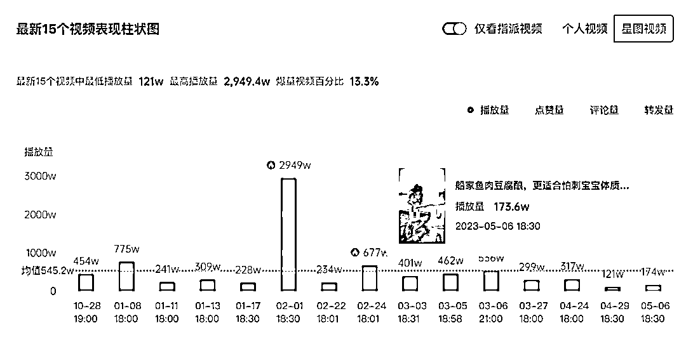
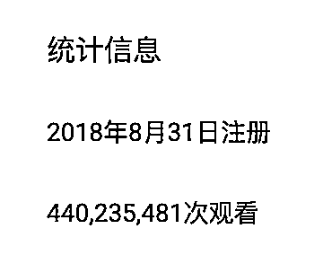

# 未来只有这八类 up 主，才能真正赚到钱

> 原文：[`www.yuque.com/for_lazy/thfiu8/wbon5pg5lcthq9qd`](https://www.yuque.com/for_lazy/thfiu8/wbon5pg5lcthq9qd)

## (59 赞)未来只有这八类 up 主，才能真正赚到钱

作者： 书情小跟班

日期：2023-08-21

前言：不是我原创，内容已经原作者（小五哥）授权

自媒体门槛极低，是个人都可以试试。

加上自媒体确实具有打工一族所奢望的自由，不用打卡，不用看老板的脸色，想去旅游说走就走。自媒体如果做好了，有稳定的现金流，确实日子还是比较滋润的。

所以虽然不像以前那样遍地都是钱了，这个身份依旧具有极大的吸引力。

门槛低意味着竞争激烈，蛋糕总共就那么大，肯定不会分到每个人头上。

前仆后继加入自媒体大军的，真正能够挣钱并持续挣钱的并不多。

这里面大部分没有折腾起足够的水花，即粉丝、播放量等数据远不足以实现商业化。

还有相当比例的，看着数据不错，粉丝几十上百万，也偶有播放量很高的爆款作品。但收入可能连普通上班族都不如，投入的成本都覆盖不了，最后在折腾两三年，花光积蓄后黯然离场，空留下一个网红或者大 V 的虚名。

本期主要针对的，也是把自媒体当成事业去经营的。那种只是当作业余爱好，不图名利，随便发发分享生活的，不在探讨范围内。

那既然是当成事业，就得可持续才行。说人话，就是得能挣钱。

同样是做自媒体，同样是十万粉丝，不同领域的变现能力差异可能十倍甚至百倍。有的领域，即使你粉丝百万，压根就看不到钱的影子。有的人只有几万粉丝，但在闷声发财。所以选择方向特别重要。

那咱们直接进入主题。根据我的个人经验，以及我的长期观察。

我认为，以下八种类别的自媒体，适合长期经营下去。咱们一个一个说。

**第一类，是最头部的且能控制成本的。**

这个相信不用过多解释，能做到各个内容平台的最头部的，日子过的都不会太差。

这里面有两个关键点，一是真头部，必须同时在粉丝量和期均播放量都能维持平台 top 的。

像 B 站每年都会评百大 up 主，评上了百大就算头部吗？当然不是，你现在去看，几年前的很多百大，已经停更了。

或者即使还在更新，但数据很一般。而且，百大与挣钱能力不完全挂钩。据我观察，不少百大 up 主，商业化并不怎么样。

**第二点，就是能控制成本。**

大的 up 主，在达到一定规模后，为了提升作品质量，或者为了进入更多领域，往往会组建团队。在年景好的时候，可能会盲目的扩张，比如招聘过多的人员，租用不到的豪华办公场地等。

类似的情况，我已经见过很多了。像上期谈到的木鱼水心，就算接不到商单，假如就他一个人，靠各平台的分成或补贴，相信也不至于多窘迫。但看他们视频的质量与频率，显然是有团队的。

而一旦除了自己，还有别人的工资要发，收入不如预期的情况下，这个压力是巨大的。

同样是 B 站头部 up 主的敬汉卿，粉丝近千万，播放数据也一直很稳定。在最近一期视频里，也透露其经历了大起大落，曾经团队最多时扩张至 40 人，每个月办公场地租金都要 5 万。

如今收入下滑，团队只剩 8 人，也离开了高档的写字楼，搬进了月租 3000 元的老破小。

最近一年收入也有 300 多万，但除去各种中介返点，人员开支，房租水电，最后的利润并没有很多。类似的案例还有很多，比如 B 站 up 主吃素的狮子，也经历过相似的起伏，不展开讲，有兴趣的可以去看他过往自己分享的视频。

我觉得头部 up 主里，过的最滋润的，是那类人设很强的生活领域的 up 主，比如拍一些搞笑的、吃播的。

这类频道的特征是，视频大部分一个人就能完成，最多一个拍摄的助理。然后大部分场景在室内，一个小房间就够了，对设备、道具、场地要求均不高。

但这类博主如果要成为头部，对博主本人的素质要求极高，比如形象好，非常幽默，还得会整活等等。

**第二类，垂直领域且离商业近的。**

垂直领域很好理解，大部分有一定粉丝量的 up 主，基本都在某一个垂直的类别，比如运动健身，宠物，舞蹈，鬼畜等。重点在于离商业近。怎样理解离商业近呢？就是这个领域有大量的成熟消费品牌，且甲方投放的预算多。

比如男性相关的领域，数码，汽车等。女性相关的，美妆，母婴等。美妆这种领域，产品毛利高，有相当的利润空间拿来做市场投放。数码、汽车领域，毛利不一定高，但客单价高，所以甲方的市场预算也不会少。

最重要的是，up 主的评测也好，体验也罢，会直接影响到消费者的决策。现在年轻人买个手机，电脑，智能手表之前，是不是都会网上看看各种博主的评测？就更不用说汽车这类大件了。

所以很多在这些垂直领域的，粉丝不多，但挣钱不少。比如我最近和 B 站一个不到五十万粉丝的数码区 up 主交流，他说今年完全没有感觉到商单变少。而且自己还纳闷，商单类视频播放量都不咋地，甲方怎么还一直愿意投钱。他本来也有主业，但现在商单的收入已经是本职工作的好几倍了。

原因其实很简单。最重要的当然还是这个领域甲方钱多，而且竞争激烈，他们在 KOL 这块肯定投放很积极。而且一般一个新产品，都会找各种量级的博主来投，并不只是找最头部的合作。

另外，就我个人的经验和观察来看，不同数码 up 主擅长和侧重的也不同。像我自己在买一些数码产品之前，可能会就某一个很小的功能点查找相关内容，而讲这个小功能点的往往只有小博主。

但因为我在意这个功能点，这个播放量只有几千的视频，依旧会直接影响我的购买决策。

B 站不少数码或汽车区的 up 主，粉丝只有二三十万，但开的车都是新款 Model S，保时捷 Taycan 等。看一下花火，就会发现找他们合作的商单不在少数。都说互联网男性用户不值钱，其实并不绝对，关键还是得看在什么领域。

**第三类，方便卖货的领域。**

简单讲，可以把流量转化为销量的。有些领域商单不一定多，但方便带货，比如宠物类的博主。看宠物类视频的观众，很多自己也是养猫狗的。围绕猫狗的消费可不少，猫粮狗粮，宠物零食，宠物玩具等等。

比如这个叫柿子菌 meow 的，做猫相关内容的 B 站 up 主，粉丝 100 多万，不算特别多，近期播放量也很不稳定。但其售卖猫周边的淘宝店，已经达到了三金冠。

仅靠自有流量，淘宝做到三金冠，干过电商的都知道这有多么牛逼。店铺销量现在依旧稳定，随便一个单品月销量都是数千。这还不是全部，其在抖音上同样有开店，累计销量已超过 30 万。

宠物类博主自营电商，不是个例，抖音上的就有不少，YouTube 上面同样有。台湾博主好味小姐，YouTube 粉丝 70 多万，主要内容也是猫相关的内容。她同样经营起了电商，没有选择在电商平台上开店，而是选择了用独立站的方式。

站内 SKU 不少，看得出已经经营多年了。就海外市场而言，如果解决了流量问题，独立站确实是一个不错的选择，因为不用给平台分钱，而且用户是沉浸式购物，不存在比价挑选的情况，适合私域的电商运营。这点和微信生态里的有赞商城，微信小商店有些类似。

宠物只是一个类别，还有不少领域都适合通过电商变现。去年 B 站直播带货的一哥 Mr 迷瞪，做家装类科普视频的 up 主，全年带货 7 个亿。

当然他不是自营电商，而是和品牌商家合作开团，更像李佳琦这种直播带货的形式。

但本质上，他在 B 站直播能卖的动货，也跟他平常发视频的定位有关。正是因为他早期的家装科普视频，建立起了人设以及粉丝的信任度，才有了后面带货的资本。

从这一点也可以看出，B 站的用户似乎也不是没有消费能力，还得看是什么领域，以及你的商业化打开方式对不对。

不过呢！电商带货的能力要求更全面一些，除了做内容做流量的能力，你还得知道如何选品，或者得有自己做产品的能力。

还得管供应链，库存，售后等。环节非常多，也是个苦活。

但如果做好了，它的天花板够高，且可以给你带来持续不断的收入。

如果你不想自己这么折腾，另一种方式就是做带货号，即帮别人卖货。

这种模式在抖音上很成熟了，近一两年在 B 站也开始出现。

你在首页上看到的，这类动不动几百万上千万的播放，跟健康、护肤等有关的视频，基本都是。

点进去，置顶评论一般都是直跳淘宝的链接。然后一看 up 主，粉丝才几万。为何一个几万粉丝的 up 主，发一个卖东西的广告视频，播放量能有上千万，因为这都是投放的流量。

B 站有个起飞计划，即可以花钱推广你的视频，跟抖音的抖+，还有 YouTube 的视频付费推广，本质都是一样，即花钱买展示量。

花钱买流量，从来不是便宜的事，为什么会买这么多。根本逻辑在于，只要收益是正的，就可以持续投放。

例如投 1000 块，让这个推广视频新增播放量 5 万，这新增的播放量可以带来 5000 块的销售额，假定利润率 40%，收益就是 2000 元。投 1000，能赚 2000，商家就可以继续投下去。

为了提高转化率，这类视频都会进行高度的引导和控评。你去看这个近 2000 万播放的视频，评论只有不到 200 条，弹幕不到 100，且都是花式吹捧的。

up 主怎么赚钱？商家找这类 up 主合作，一般会给一个较低的拍摄费用，然后后续产生的销量也会分成，比如 3%。假定这个近 2000 万的视频，产生了 100 万的销售额，up 主分到 3 万，对一个几万粉丝的 up 主，好像也不错。

起飞计划都是商家投的，这买来的播放量多多少少还能涨点粉丝。

现在 B 站这类号不在少数，集中在健康相关的领域。前段时间跟一个 MCN 的老板交流，他说现在 B 站做这类投放赚钱的商家有三种，**教育、美容护肤和保健品**。你如果想做一个带货号，不妨考虑下做这三个领域的带货内容。

**第四类，适合做增值内容的。**

就是适合做付费内容，开专栏卖课，或者搞社群之类的，就是所谓的知识付费。一般哪些领域适合呢，以技能类和职业提升的为主，比如英语、视频剪辑、UI 设计、摄影摄像、考研等。

这其实也不是什么新东西。自互联网诞生以来，早在 web1.0 时代，freemium 就是最常见的变现模式之一，只不过到了国内后，非得搞个知识付费这样的概念。freemium，即 free 和 premium 的合体。

基本内容 free，用于建立人设，吸引流量等。premium 内容收费。你是一个英语学习类的博主。平常发的主要是一些零散的知识点，比如常见用语如何用英语表达等。

当你通过知识的分享，以及各类整活视频，积攒到一定粉丝量后。这时候肯定早有很多人问你各种各样的英语的问题，以及英语学习中的烦恼。这时你推出一个 30 天口语提高的课程，是不是顺理成章的事。

像这些跟技能学习，学历提高，职场充电，金融理财，开展副业等有关的领域，往往是知识付费意愿最高的。

B 站早就上线了专栏课程的功能，比如这个 up 主，平常主要分享软件使用、编程学习等相关的视频。他在 B 站上已经上线了多达五门课程了，课程各种价格都有，最贵的近 2000 元。

YouTube 上面卖课的就更不用说了，各种各样的都有。不过 YouTube 本身除了频道会员，没有课程这个功能，但这根本不是问题，大量的第三方平台都可以很好的解决这类需求。

做这一类博主，你要达到能卖课的程度，最好是在某个领域内有所积累，毕竟还是需要专业性的。

让别人掏出真金白银来学你的东西，自己得先有两把刷子。要么你是专业人士，要么你在这个领域沉浸专研了很久。

**第五类，适合长期直播的。**

现在的视频平台，直播功能基本都是标配。不管是抖快，B 站，还是 YouTube。直播也是变现的一种方式，最直接的就是来自于观众的赏钱。

比如 B 站上舰长，YouTube 的抖内，超级留言等。抖快更不用说，抖快发视频，播放量再高，一分钱没有。

所以对于抖快的大部分网红，长期以来的运营策略就是八个字，视频涨粉，直播变现。

比如最近那个很火的挖呀挖的幼儿园老师，视频播放量高的夸张，短时间内涨粉几百万，但变现还得靠在直播时观众刷礼物。

直播很简单，打开个手机就能直播，但关键词在于长期。

直播跟发视频一样，得有内容。如果没有某种东西留住观众，你在直播个三五回之后，很快就会发现没什么东西好播了。

这跟你有多少粉丝无关。

能否长期直播下去，要么本人极具吸引力，比如颜值高身材好，要么具有某种适合在直播间展示的才艺，比如游戏主播。

第一种，所谓的颜值主播。在化妆、美颜、滤镜等一系列高科技加持下，镜头前的颜值早已不是稀缺东西，除非长的极具特色，或者真有闭月羞花之貌。

所以除了颜值，还得会来事。看颜值主播的，主要观众成分，以及观看的目的是什么，不用我多说了。

怎样挑逗观众，让榜一榜二大哥上头，心甘情愿的送钱，又不至于过于露骨而被封掉，就很考验水平了。

第二种，才艺直播。

最常见的，唱歌的跳舞的，都属于这类，当然也包括游戏这个大类别。除此之外，还有一些独特技能类的，比如搞平衡表演的等等。

第三种，会聊天或者会整活的。

这一类对个人口才和网感要求比较高。比如 B 站的峰哥，直播就以和观众聊天为主。一般人聊天可能没什么意思，但峰哥直播中的片段被各种剪成视频二次传播，B 站就有好几个 up 主，专门剪峰哥的直播片段发视频，播放量还都不低。

这是因为峰哥口才利落，幽默有趣，又非常懂网民的心态，所以直播时能金句频出，与其他女主播连麦也能有非常好的娱乐效果。峰哥是少有的，视频和直播都能做的很好的 up 主。

归根结底，直播重点在于娱乐与陪伴。是否能长期直播下去，你得看是否能给你的观众提供这些精神属性。

**第六类，能高频率更新且流量还不错的。**

怎么理解？就是那种差不多每天都可以更新，然后播放数据还不错，比较稳定的。这种能高频率更新的，一般以生活类领域为主，拍摄成本也比较低。

如果能高频更新，且流量还不错，那意味着靠各平台补贴，也可以有不错的收入。

比如 B 站徐大 sao 这个频道，曾经是很火的频道，巅峰时每期播放都过百万，商单也时常有。在经历了一系列风波之后，如今流量大幅下滑，300 多万的粉丝，平均播放量只有一二十万。

这个数据，结合他所在的领域，商单估计是没什么了，但好在更新的勤。

徐大 sao 四月更新了 12 条视频，总播放量在 200 多万，B 站的激励计划估计有个两三千块。不过这不是全部，因为他基本全平台发布，包括西瓜视频，以及各种什么百家号，腾讯号之类的，还有斗鱼，当然还有 YouTube。

只算补贴和广告分成，这些全部加起来估计有个万把块。和之前巅峰时大把赚钱当然是没法比了，但也能持续经营下去。

最关键的是视频制作成本低，因为他的内容就是做饭然后吃播，本来嘛，每天也要吃饭的，顺便拍一下，除了食材之外，没有太多额外的成本。

再举个更合适的例子。这个叫 Sean 的世界 TV 的频道，是一位移民泰国的杭州大哥经营的，之前主要分享移民后在泰国的各种生活，现在弄成了日常 vlog，走到哪拍到哪，频率也是日更。全平台发布，在 YouTube 和西瓜抖音的粉丝多一些。

看近期视频的数据，播放量不算高但是稳定。这个频道除了在抖音，不会有太多商单的机会。所以主要收入来源应该就是各平台分成或补贴。

虽然单期数据不算很高，但更新的多，而且所有平台都发，尤其是 YouTube 经营的还不错，所以总收益应该也还可以。

用 Sean 自己的话说，经营这个自媒体频道，发财不至于，但养活一大家人没有问题。

总结这一类频道的特点，以生活领域为主。

就是拍自己的日常生活，这样能保证每天都有东西拍，且拍摄成本很低。

这类频道在西瓜的三农领域有不少。

为什么高频率更新，流水账式的视频，还会有这么稳定的观看量呢？

我的思考是，这类频道和直播聊天的逻辑有点相似，即主打的是陪伴。

Sean 通过长时间的经营，分享自己的生活态度，让他的一部分观众，非常认可他这个人，每天看他发点东西成为一种习惯。

所以他不管是发在泰国的经历，还是中国的经历，已经不重要了。

粉丝就是想看他今天又逛了哪个夜市，吃了什么东西，见了哪个朋友。有时他停止更新几天，还会有不少人来问。

Sean 这种是人设较强的，靠人留住观众。还有一种高频低成本更新的，无人设或者弱人设的，本人不出镜的频道，比如拍如何做饭的，如何画画的，在 YouTube 数据也很好。这一种更准确的定义叫内容农场。

**第七类，不依赖单一平台的。**

B 站有些 up 主，你看他们的内容是挣不到什么钱的，因为更新频率不高，也看不到有什么商业行为。

是什么让他们能长期坚持更新下去的呢？

一般情况是在别的平台有不错的商业化，B 站就是顺手发一下。

比如这个叫船家妹丁的频道，风格有点像李子柒，不食人间烟火的样子。

你如果只看她在 B 站的视频，会感觉挺佛系的，就是拍一些很精致的船家生活的视频。

虽然数据还 OK，但一个月就那么三四期视频，还没有恰饭，这是怎么坚持下来的？答案就是她的主要阵地不是 B 站。

她发的视频都是竖屏的，且都比较短，可以很容易的判断基本盘在抖音。

仔细一看，在抖音上的商业行为可以说是很活跃，最近半年差不多有 15 个商业合作的视频，许多视频置顶评论也有推广跳转链接。

星图报价都是几万起，当然这是刊例价，实际成交不一定每单都有这么高，但也不会差的太多。

当然了，这些商业推广视频，B 站都没有发布。同样一个账号，在 B 站接不到商单，不意味着在抖音也接不到。

从我个人角度，我不是很喜欢严重依赖商单的账号。

因为除非你在我们前面说的那些离商业很近的领域，商单可能不是很稳。

当甲方预算减少，或者自己频道数据下滑时，可能受到的冲击会比较大。

所以，我想重点说的是 YouTube 做的不错的中文频道，或者中国人做的频道。

因为大家都知道 YouTube 的广告分成收益不错，如果你能在这里有不错的流量，可以更专注于自己的内容，而不受商单波动的影响。

这一类频道有自说自话的总裁，X 调查这样的讲各种离奇故事的频道。他们在国内外的平台表现都不错。还有像脑洞乌托邦这样的频道，算一个类型。

不过脑洞乌托邦在 B 站只有 20 万出头的关注，数据也很一般。

但是到了 YouTube，有 100 万以上订阅，且每期都稳定在 50 万以上的播放。所以 B 站对于她而言，播放量怎么样，有没有商单，完全不受影响。反正视频也做了，就顺手发一下吧。

还有一些电影解说类的频道。这个叫科幻梦工场的频道，在 B 站有 64 万关注。这个频道属于轻人设账号，我猜测商单机会不会太多，但这问题不大，因为他们在 YouTube 有近百万订阅。

你看近期视频播放量可能有些惨淡，但他们时不时会有爆款。频道总播放量也是达到了 7 亿以上，这一块广告分成不会少。

再比如这个永恒跳动的火焰的频道，主要发手工类视频，人有出镜，但无旁白，人设同样极弱。B 站 20 万关注出头，播放量也不稳定，接品牌商单几乎不可能。

但他在 YouTube 有 100 万以上的订阅，和科幻梦工场一样，平均播放量不高，但有几个播放量特别高的爆款视频。

这几个爆款会一直给他带来新的观看。频道总播放量 4 亿以上，广告分成也不少了。

**第八类，可延伸至线下变现的。**

有几种类型，一是线上积累粉丝与流量，可以增加自己的商业机会，还有溢价。

比如摄影类博主，如果在视频平台上有几万几十万粉丝。

除了这些流量可能给他带来，更多线下约拍的机会之外，他的这些视频作品，也方便与甲方进行展示。

有一定粉丝与人气，也可以开出比其他人更高的价格。

再比如舞蹈类博主，通过线上的曝光，可能会接到更多的线下商业演出机会的邀约。

还有一种，是本来就有线下业务，线上做视频自媒体，是为了开辟新客户。比如移民中介，房产中介等，这种在 YouTube 上面不少。

这一类博主往往粉丝和播放量都不是很高，但这不重要，他们需要的是精准顾客。而且因为客单价高，单个用户价值很高，对他们更重要的是实际的转化率。

还有一种，是本来没有线下业务，做了自媒体之后发现有线下变现的机会，误打误撞做起来的。比如这个叫艾伦老师是也的账号，在 B 站和西瓜都只有几万粉丝，但变现不错。

其主要内容是分享海外打工的内容，业务就是介绍国内的人到海外去打工。据其本人在直播时分享，最早是发了相关的在海外打工的经历分享之后，有人详细咨询时，才开展了这块业务。这个和前面聊的一样，作为中介，粉丝不需要多，主要得精准。

第八类跟前面七类不太一样，更多的是拿自媒体当一个工具，自媒体负责引流，真正的商业化在线下交付。

以上就是我总结的，可以能够长期发电，持续经营下去的视频自媒体的类别。

把自媒体当作微型创业的话，本质跟一个公司能否活下去一样的道理，就是看收入与成本，收入减去成本，就是你的收益。

假如你打工一个月到手有一万，你全职去做自媒体，不考虑其他因素，如果自媒体能够给你稳定的带来每月一万以上的收入，从金钱上就不亏。

要达到这一万的收益，首先收入超过一万。

前面这八类重点讲的都是收入。除了收入之外，还有成本。不少人自媒体难以继续下去，就是成本超支了。

要么是大的 up 主想扩张，迅速扩张团队，但收入没有跟着涨甚至下降。

要么是刚起步的，一上来就要用最好的设备，就得招一个小团队，在看到收益前已经撑不下去了。

所以自媒体，对于多数普通人而言，还是要回归“自”这个关键的字上面。自媒体，尤其是早期，就得轻量化，就得低成本。等到一定阶段了，再考虑媒体的属性。

做视频自媒体，成本一般包括设备，场地，人员以及制作费用，比如视频中使用的物料，需要的参旅开支等。

起步阶段，每一样要做到能省尽省。

做自媒体，也要有精益创业的理念。

在一开始，不求最好，但求能用的。

我一直以来的观点，就是在你赚到钱之后，再去考虑升级装备，组建团队等。

我现在收音使用的麦克风就要 7000 块，但这都是后期添置的。我在 10 万粉丝之前，使用的都只有一个 N 年前生产的二手单反。我招的第一个小伙伴，也是商业化相对稳定之后，自己也实在忙不过来了，才找的人。

为了拍视频，我离开了呆了多年的一线城市上海，曾经我在上海时，自己租房一年都要 10 万。

而如今，我租了老家小县城一个城中村的私房。共两层，每层 150 平米，前后还有院子，一年租金只要 2 万。我的办公，拍摄等，全部在这里完成。

互联网的好处就是不受地域限制，比如我拍这样对着镜头说话的视频，需要在北京，上海或者香港、台北吗？

如果你不是必须拍城市主题的内容，其实也可以考虑像我这样找一个小地方。

不少大 V，比如李子柒，滇西小哥，华农兄弟等，他们也是在回到老家农村之后才开始拍视频，才逐步成长为大 V。

如果他们还留在大城市，生活成本和工作压力，可能让他们根本不会走上这条路。

所以，如果你打算把自媒体当成一项事业，在选择领域和方向时，一定要想清楚自己的主要收入来自于哪里，自己的开支计划是多少，而不是盲目的一头扎进去。

* * *

评论区：

胖大魔 : 把他拉进生财啊
书情小跟班 : 哈哈😃

* * *