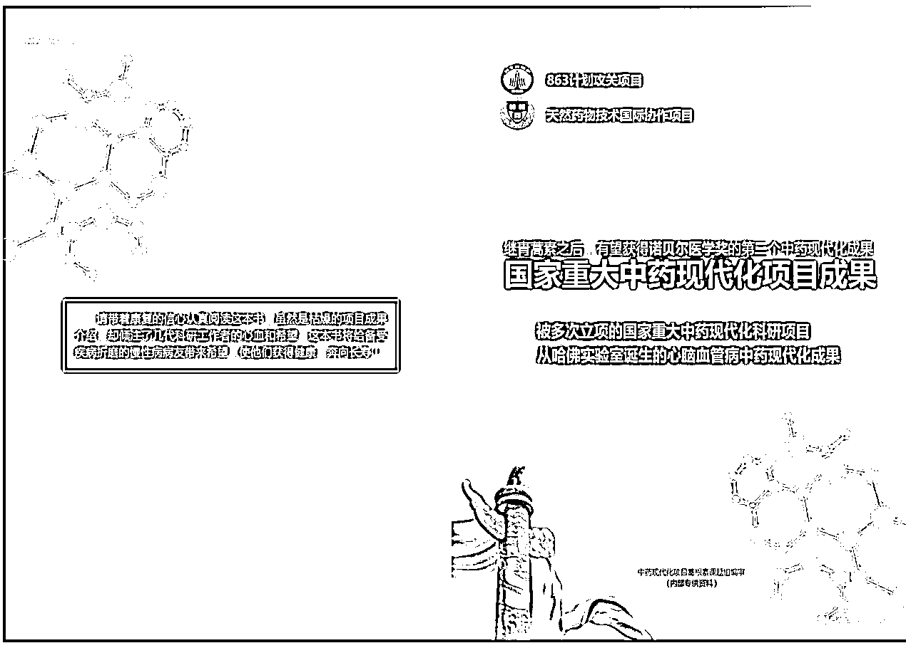
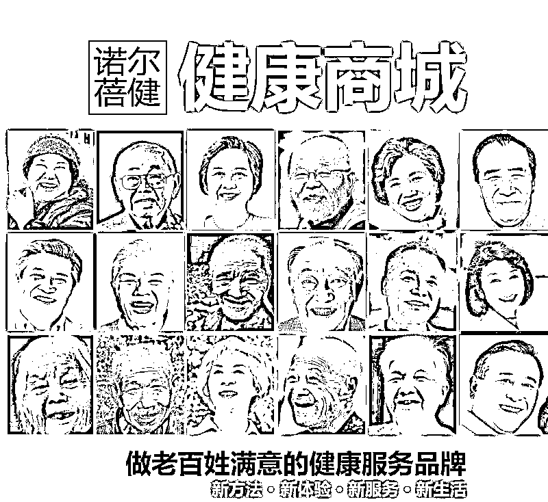
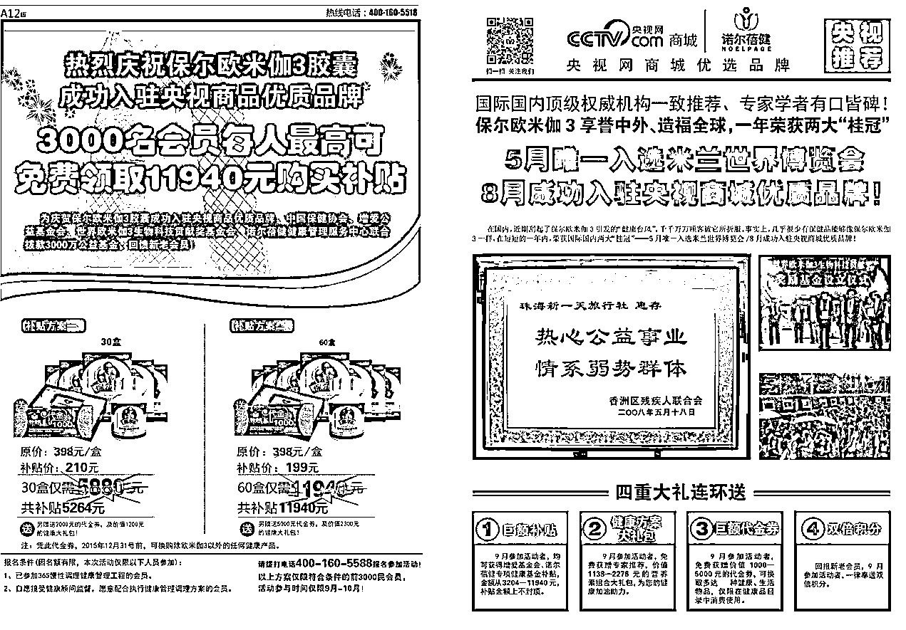
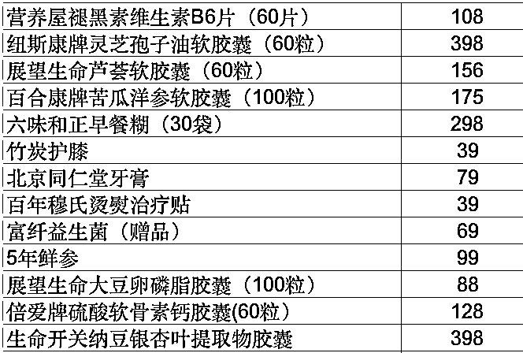

# 大广告（TVC）获客+后端私域会员制营销及私域精细化运营经验分享

> 原文：[`www.yuque.com/for_lazy/thfiu8/gl6i43xgzksklara`](https://www.yuque.com/for_lazy/thfiu8/gl6i43xgzksklara)

## (精华帖)(80 赞)大广告（TVC）获客+后端私域会员制营销及私域精细化运营经验分享

作者： 蚂蚁快跑

日期：2023-08-28

“拨打下方购物热线，即可将 XX 带回家。”你们一定在电视上看到过这样的广告。

其实这背后有一套关于私域运营的方法论，那它和今天的私域运营有什么相似之处或者区别呢？今天这篇文章，我就来详细讲讲，希望对你有所启发~

# **一、自我介绍**

大家好，我是生财圈有蚂蚁快跑，刚刚加入生财圈一个月时间多点，一直从事策划运营私域数据开发工作，曾在上海某年销售额 4 个亿的电购平台负责会员中心的会员制活动策划与开发工作。

近几年参与到一家初创公司创业项目，共同操盘测试了几个项目，做过女性口服类食品、祛斑类产品，有一点小小的心得。

这次分享主要主要给大家分享以下这些内容，希望其中内容可以给各位朋友的业务带来一些启发。

1、传统媒体的投放路径与话务承接转化说明

2、电购平台的私域数据承接与会员制的建立（主要从三个方面做分享）

1.  8 个维度：打好客户标签

2.  30 天客户沟通执行流程（5 次电话沟通现 3 个目的）

3.  客户分类与筛选（借助工具做好客户数据的分类和筛选）

3、会员后续的梯次开发

1.  开发维度：按照高利润主品、低利润福利品分类分别做集中促销

2.  促销规划：重点客户集中爆破、次重点客户福利品拉动、潜在客户多品开发

4、过往经验对当下私域运作的借鉴与思考

# 二、具体内容分享

**1、传统媒体的投放路径与话务承接转化说明**

我自己最早入行了解到电视广告的投放是在 2012 年，当时电视广告以直接下货广告为主，一个电视广告投放下去，要做到 1:7 以上投产比。

之后因为栏目专题的火爆，直接带动了电视广告从下货广告，变成了 30-45 分钟专业栏目进线广告，销售模式也简单：卫视直接投放长时段栏目广告，话务平台负责承接热线进行转化，转化率要求做到 20%，客单价在 1000 以上的水平。

所以这种电购平台的核心就几条：

1）拍好广告片

2）选对媒体资源

3）建好话务承接团队。

**第一条**拍好广告片，这个跟每个团队的企划人员水品有关系，放到我自己所在的团队，一般做一个广告片时间周期在 30 天，中间要开 7-8 次企划会，对广告脚本做十几次二十次修改后，才最终能够开始拍摄。

**第二条**的话，关于选媒体资源，主要对媒体做测试，先选择小卫视价格低的媒体做测试，比如西藏卫视、新疆卫视等等。

通过 3 天测试后，评估广告片进线数据，效果后，就选择更高更贵的卫视（如湖北卫视、湖南卫视、黑龙江卫视等）进行放量，直接广告片的进线数量低于红线标准后，再停止投放。

这里特别说明的是时间到今年之后电视广告随着短视频等互联网平台的冲击，已经发生了很大的变化。

据我自己了解到的信息，目前电视广告的进线方式已经已经变更为前段头低价产品比如 9.9、19.9 的引流品，成交之后转私域做交叉交易，或者有的演变为前段做民用品，转到私域后做营养品、保健食品等等。

**第三条**关于话务前段的业务承接团队，主要根据广告进线时间段来安排业务员上班，平均成交比例 20%为合格，低于 10%的员工直接淘汰。

团队管理以 5 个小组为一个单元配组长一名，小组转化 ROI 低于 1:5 的直接替换掉组管理人员，话务人员完成首次成交后，数据流转到会员中心，开始做私域转化和持续开发。

**2、电购平台的私域数据承接与会员制的建立**

前面分享的内容主要属于背景，私域数据承接与会员制的建立才是本次分享的重点所在，电购客户产生首单购买的，数据通过 CRM 系统流转到会员中心，在会员中心要先后完成 3 个节点的工作任务：包括：

1）打好客户标签（8 个维度打好客户标签）；

2）建立客户联系（30 天客户沟通执行流程）；

3）做好客户分类与筛选客户分类与筛选。

先说第一步，打好客户标签。

电购客户成交之后，我们获取到是客户姓名、联系电话、订购产品信息，对客户的其其它情况年龄、家庭情况、收入情况、决策情况、购买习惯、爱好情况、地域分布、性格特点等等信息完全不清楚。

这个时候就需要通过工具借助外呼来完善这些信息。

所以在一开始发货的时候，就随货发出第一套工具：会员专属内部刊物《健康是福》，以这本刊物为工具给业务员的第一次跟进做准备。

（以上送给客户的会员内部刊物）

当用户在第一时间收到公司产品之后，会员中心话务员立马电话跟进，完成几个动作：

动作 1：指导售后，告知客户使用方法，并且树立客户服用产品的信心。

动作 2：以刊物为话题，强调会员专属权益，每月 1 次的会员刊物、积分权益、会员折扣权益等等内容。

动作 3：给之后的服务做铺垫

在客户收到产品的前 7 天，要求每天去电，以了解客户使用情况为话题开头，从多个维度了解用户的情况。

比如问用户“阿姨一直不在家吗？&您的儿子不经常开看您吗”等等侧面了解客户的情况，探知客户的个人情况，主要了解的维度有：

1）年龄：通过年龄划分，大致判断客户目前的状态和保健仪式，年龄越大，保健意识越强。

2）家庭情况：主要看是独居还是跟家人同居，进而判断客户在做购买的决策的外力阻力大小

3）收入情况：是退休人员、还是无收人人员，来决定后续的产品推销策略

4）决策情况：是否自主决策，还是需要停家人的意见，决定后续关系维护切入点。

5）购买习惯：是间断性、还是冲动性购买。

6）爱好情况：根据客户爱好，给后续的客情维护提供切入点。

7）地域分布：根据地域判断客户的交叉需求

8）性格特点：根据性格来设计后续对应的攻单策略和方向。

其他：身体情况、疾病情况等等。

以上所有维度的标签，并不是一次两次沟通就可以完成，需要分步骤在一个月内容逐步完善。

因为给客户的邮寄刊物设计中包括六大板块的内容：健康管理、史海钩沉、心灵氧吧、健康故事、企业展示、会员之家，每个板块内容都成为业务员的沟通创造了话题。

别健康管理板块会涉及到一些养生操、健康观念等，容易与客户形成互动，健康故事则主要是真实的种草类故事，会员中心则是不断刺激客户升级会员权益。

这样借助工具配合电话跟踪服务，完成基础信息的采集。

再来说第二步，主要是建立客户联系，原则还是通过持续的沟通建立跟客户熟悉度、培养客户互动习惯、升级产品种草和完成产品二次复购。

在这一步初了延续了第一步的电话沟通话题之外，开始增加第二个工具—产品营销类书籍+读书有奖活动（书籍的目的是完成产品深度教育+读书有奖活动是促成客户完成深度教育）

（以上为给客户寄送的其中一本产品营销类书籍）

在书籍中设置有读书有奖活动，通过回答书中提出的客户，可以直接跟给自己服务的客服领取一项超值的会员福利，通过这样的营销设计，来给话务客服的跟进沟通创造了机会。

当客户拿到这样一本书籍之后，接下来就开始员工以 30 天为周期完成：书籍导读、产品种草、用户代入、自然复购几个动作：

动作 1：书籍导读，根据用户的实际身体情况，重点引导用户阅读和学习相对应的板块内容，进而依托书籍这个工具，完成客户自我教育。

动作 2：产品种草，依托书籍工具和电话沟通种草，铺垫产品的背书、成分、功能，完成产品的种草内容。

动作 3：用户代入，把用户的实际身体情况与产品作用效果想结合，通过描述产品使用场景和对使用产品带来的改变，完成用户代入。

动作 4：自然复购，结合读书有奖以及会员折扣权益，完成客户的二次自然复购和销售。

通过以上动作执行，大约 70%以上客户产生二次复购，形成了 1000 多万的销售额，剩余 30%的客户，则通过客户后续的层级开发完成复购。

第三步，就是客户客户分类与筛选。

第三步的执行与第一、第二步相伴随执行，但是为了更加对精细对客户进行分类，所以在执行第二步过程中，随产品书籍一同发出的还有一本低价产品手册，低价产品手册涵盖了五大类 100 多个产品的介绍，产品单价 99-499 元之间。

按照当时的执行结果看，每个单品都产生了十几万左右的销售额，但是最主要的目的还是完成了客户需求分类，打好需求标签后，给后续的分类活动促销提供数据支持。

（寄送给客户低价产品手册封面）

**3、会员后续的梯次开发**

在完成客户基础标签标注、客户产品种草、客户分类和筛选之后，在客户入网之后的第 3 个月就会执行会员客户的梯次开发。

通过前两个月的工作执行，我们对客户形成了 2 个维度的分级：

1）是按照客户沟通时长和沟通频率划分为：核心资源客户、重点维护客户、次重点客户、代促活客户。

2）是按照客户收入情况和购买金额，分为钻卡会员、金卡会员、银卡会员、铜卡会员、普通会员客户。

●感动服务+工具精细化开发\✪工具精细化开发\▲无差别促销活动

根据客户标签分类：（一年四次促销活动，4 次促销活动的销售额占比到全年销售额 2/3，第三月促销月的销售额，是前 2 个月销售总额的 3 倍左右）

（1）针对核心维护&重点维护的钻卡和金卡会员采用感动服务+促销报纸配合开发使用。

在对客户进行促销前半个月，会根据客户的爱好和地域在不通知客户的情况给客户寄发意料之外的礼物，同时搭配一封手写信函给到客户。

给重点客户寄送的为高客单价高利润的产品促销刊物，这类客户贡献了 1/3 的销售额。

（2）重点银卡会员则采用销售信函+福利品刊物拉动，在这里：

根据客户之前购买的产品分类特点分别寄送不同的产品销售信函+同时寄送客户促销刊物+优惠券方式，一并寄送给客户，话务员再按照给客户的寄送的相关产品内容，给予相应的优惠促销。

（3）针对次重点客户：直接采用福利品刊物+促销优惠券的方式拉动。这类客户购买频次低，购买意愿只能通过大力度的优惠让利来拉动，重点是让客户占到便宜为主。

（4）最后一类就是购买次数少，购买金额低的客户，直接诶采用代价利润福利品拉动的方式来促销。

（比如：以下为部分产品促销价格）

  

（之前部分产品低价低利润品的销售价格）

**4、过往经验对当下私域运作的借鉴与思考**  

（1）**在不同阶段采取不同的会员经验策略：**

随着商业形成的变化，主流的获客方式从电视转移到短视频手机端，但是客户私域会员制的运作方式却没有发生变化，但是在会员运营方法论却发生了很多变化，在这里也分享给大家：

在自己亲自参与的微电商团队中运作中，这几年经历了两个阶段的变化：第一个阶段是项目蓝海阶段，第二阶段是项目红海阶段。

我自己是 2017 年参与操盘项目，主要是做细分的蓝海项目-备孕体质调养，项目开始的头 2 年也就是 17 年到 18 年，在几个重点的女性平台上，全国只有我们一家在做这个细分赛道。

通过投流获客成本一直控制在 25-35 之间，客户入网后，首次成交客单价能到 1800-2000 元，转化率能做到 10%，因为获客成本低，首购就能有利润，所以在运作后端会员私域时候，就完全按照电购平台的经验运作，对入网会员做了分级管理。

通过朋友圈+私信的方式做客户维护，朋友圈种草，私信做服务和售后，次月复购率可以做到 60%，一个客户平均产生 4-5 次的复购，所以在会员私域运营上做的还算不错。

但是项目到了 2020 年，随着同行增多，平台流量成本上涨，整体项目进入红海阶段，市场进入血拼阶段，广告费原来 20 多元上涨到 120 的时候。

这个时候，电购平台的会员制运作方法，就难以维系团队的运作，前段的广告成本与销售产出不成比例，在这种情况下，我们的私域运作转入暴力市场开发阶段，对用户做了更加细致的分级，不同的客户采用的不同的促销方式，但是主打高频次、多价格的促销。

会员客户按照从 A-S 的英文标识来划分：

A、代表私域成交的客户，需要重点维护，属于销售额的主要来源

B、新入网客户潜在客户，需要按照流程来做深度开发

C、代表已对未报价未成交客户

D、代表已报价未成交客户

E、代表报价后跟踪进行 1 次促销的客户

F、代表报价后跟踪进行 2 次促销的客户

H、代表已经进入休眠期的客户

S、代表从私域剔除的客户

按照这样的客户分级，不同的客户采用了不同的维护和开发策略，但是总体的玩法玩法就是“信息轰炸，分层开发“，产品交叉、价格阶梯“的策略。

在 20-22 年 3 年时间这样的方法，简单粗暴有效，效果惊人，但是时间进入后疫情时代后，这样的方法立马开始出现了颓势，客户数据大量流失，客户回复率，购买率急速下降。

在这种情况下，私域的用户运作要求，开始转向了“精细化和人性化”的方向。开始按照非必要不打扰，非必要不促销，以 IP 人设打造+持续知识输出+IP 软推荐的方式进行私域运作。

期间按照这个思路，运营测试了梅子果酒品类，从抖音电商获取第一批用户数据，之后通过人工外呼+包裹卡的形式导入企业微信进行私域开发，导入企微私域后采用低频次的客户开发私信信息+企业微信朋友人设打造方式的维护开发。

企微朋友圈内容：采用人社日常+IP 选品+生活分享+活动预热的方式做输出。

企微私信开发：按照添加后送天猫优惠券 +7 天后好评返酒的方式做首次互动沟通，采用加粉后第 1 天 -7 天 -15 天 -30 天的频次私发信息进行私域开发

第 1 天，送优惠券+约定好评，形成互动。

第 7 天，做回访，回访口感，通过闲聊做互动。

第 15 天，做一次服务和优惠铺垫。

第 30 天，做一次优惠促销信息通知。

整体运作 2 个月的数据相对还算比较理想，私域导粉率 30%，客户复购率在 70%，客户总体流失率在 5%左右，首月亏损，二月持平，到第三个月开始进入盈利状态。

（2）**做私域能做长线不做短线**

暴力开发私域的客户尽管能短期创造极大的销售额和丰厚的利润，但是对私域用户却会造成极大的破坏。

以我自己的运作的第二项目祛斑类化妆品为例，在为期 5 天的促销开发中，5 万客户一天能产生 100 万的销售额。

但是副作用确实每次以损失 15%的私域客户为代价，尽管一年下来销售额和利润还算理想，但是私域客户的持续时间却只能维持在 2-3 年时间。

但是之前的电购平台的会员私域客户运作却能持续 5-10 年时间。

所以如果有获得免费用户流量的方法，做持续私域会员营销会是相对正确的选择。

以上就是本次分享的全部内容，希望对大家业务有所启发！

* * *

评论区：

Keiko : 厉害👍很干货了 全是实战经验
亦仁 : 感谢分享，已加精华。
亦仁 : 这套方法论放到私域里面是降维打击了。
蚂蚁快跑 : 感谢亦仁老大推荐[抱拳][抱拳]
翰林 : 很厉害呀，运营方法，长线的产品，思路，都很牛逼。
zeon : 求大佬联系方式

* * *