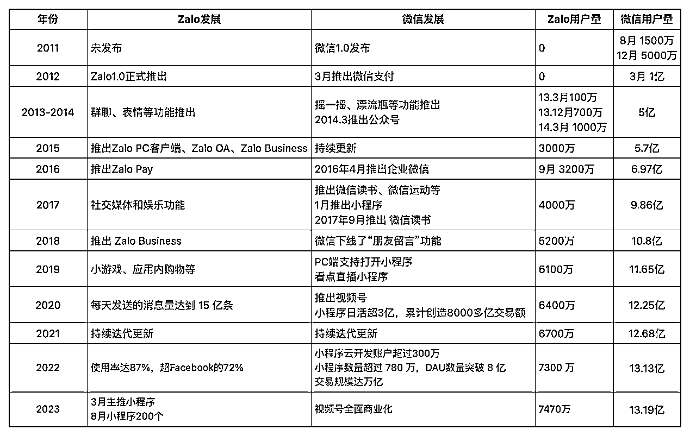
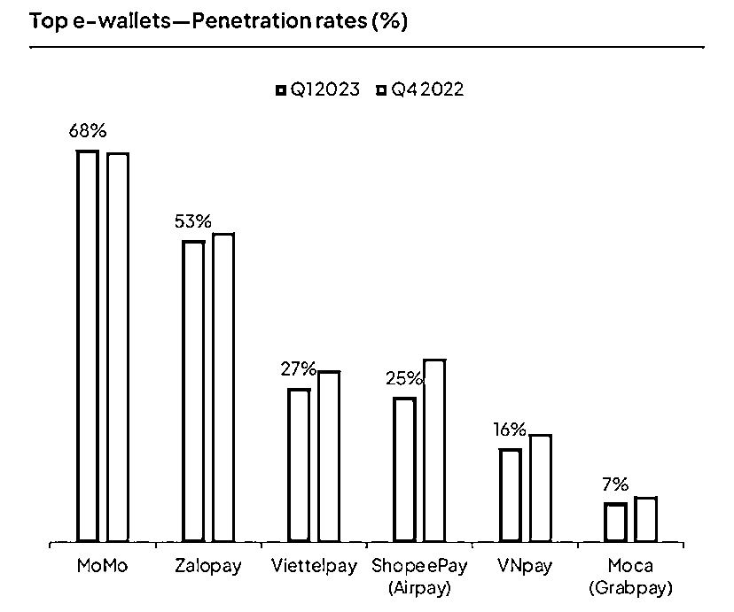

# 「肉身出海掘金」越南“微信”生态，Zalo 的创业机会

> 原文：[`www.yuque.com/for_lazy/thfiu8/gzy9d472kbmpt5xr`](https://www.yuque.com/for_lazy/thfiu8/gzy9d472kbmpt5xr)

## (46 赞)「肉身出海掘金」越南“微信”生态，Zalo 的创业机会

作者： 大程

日期：2023-09-08

出海创业有很多机会，比如国内微信生态的产品，都可以在 Zalo 生态里再做一遍，直接复制国内成熟的运营模式和玩法就有很好的效果。

像我们专门针对越南市场，出了知识付费平台型产品，签的一个 20 年经验的 HR 行业大咖做社群营销，在运营完全没有介入的情况下，很快就吸引了百余位付费会员。

不过普通人想要出海创业，也会面临不少的挑战，首先就是要解决语言、本地化、合规等问题，其次是要把内容、产品、技术、运营、市场等方面做好。

想要出海创业具体应该怎么做？接下来，我将通过这些年研究 Zalo 在东南亚市场时看到的结果，和大家分享出海创业的机会和挑战。

# 一、我是谁？

大家好，我是大程，跟很多创业的人比较，算是草根创业者，考虑到整个创业环境，早年我花了更多的时间在钻研技术和产品。

但是这两年因为很多项目已经有了完善的基础和底层逻辑，我在逐渐切入运营和商务，而且经常和现在的主力大军 90 后以及 00 后一起交流，合作。

在国内业务板块，微信生态，小程序板块已经都试水做过一些比较成熟的产品，也作为视频号服务商签约了很多账号。

海外业务，目前主要聚焦东南亚市场，我认为这个市场未来一定是一片蓝海。主要在“类微信生态”和一些产品、内容端做了一些探索，效果显而易见。

尤其是 8.15 后，越南的电子签证政策已经在逐步放开，所以，我有理由相信，接下里会有一波很好的机会，也希望把研究和看到的结果，分享给大家。

今天我的分享主题是——「肉身出海掘金」越南版“微信”生态的创业机会。

最近关于越南的新闻很火，其中有一个新闻是讲，越南电动汽车公司 VinFast Auto 通过 SPAC 在美上市并几度大涨后，号称“越南小腾讯”的互联网初创公司 VNG Ltd 也申请在美国上市，成为第一家寻求在纽约上市的越南科技公司。

这里的重点是科技公司，可以说他是越南互联网全村的希望。

招股书显示，VNG 采用 AB 股架构。在外部股东方面，腾讯一家就持有 43%的股份。

VNG 的发展模式和旗下很多的产品都跟腾讯生态类似，比如说**越南版微信“Zalo”**，后面我会详细分享。

我最早的创业是在敲代码，被很多人称作是早期的站长，还搞过码农教育培训，后面才真正切入平台型产品的创业，集齐了产品、技术和运营三驾马车，并且在海外开始创业。

回看中国互联网这沸腾的 20 年，感触最多的就是微信生态。我身边很多朋友在这个生态里创业，拿到了不少结果，也有朋友靠腾讯的股票拿到丰厚的回报。

从平台到服务商再到个体，归根结底，我们赚的都是国家和行业红利的钱。

怎么看接下来的市场，我可以很坚定的说，持续看好腾讯这个生态，尤其是视频号今年商业化元年的机会，AIGC 的机会。

但是对于普通创业者来说，在国内做出独立大 APP、大平台的机会已经不多了，但是基于大平台、早期的类微信生态，去创业做产品仍然值得探索。

# **二、创业者在 Zalo 生态的掘金机会**

早期决定出海创业，我调研了很多国家和地区的互联网生态，2014、2015 连续两年我已经绕地球飞了好多圈。

最后，我把俄罗斯定为我开拓海外市场的第一站，那里有 Yandex，是俄罗斯最大的互联网公司，旗下搜索引擎在俄罗斯拥有 60%以上的市场占有率，加上其网盟资源，甚至可以覆盖 93%的俄罗斯网民；

第二站我选择了东南亚，看了很多地区，最终落地越南。越南最大的独角兽公司叫 VNG。

VNG 成立于 2004 年，原名维纳游戏股份公司 （Vinagame），注册资本为 150 亿越南盾。该公司的注册资本目前已经超过 2870 亿越南盾。

今年上半年，VNG 实现营收额超过 4 万亿越南盾（12.5 亿元），税前利润近 500 亿越南盾（1500 万元）。VNG 的主要业务包括在线游戏、连接平台、支付和金融、云服务。

该公司还在香港特区、泰国、新加坡、菲律宾、缅甸、中国台湾、印度尼西亚等国家和地区开展业务。

2008 年 -2009 年间，腾讯两次收购 Vine Game 的股份，占比超过 20%。有了腾讯的扶持，VNG 也开始光明正大地借鉴腾讯的模板了。

2009 年，VNG 推出越南版 QQ，它的功能和界面几乎和国内的 QQ 一模一样，只用了两年时间，就成为越南社交软件 NO.1。2012 年推出越南版微信 Zalo。

我们常说，创业七分靠打拼三分靠运气，有的时候时运确实很重要，是成功路上不可或缺的。

VNG 很幸运地赶上了越南互联网蓬勃发展的几年，利用时间差，它把中国已经成熟的模式复制到了越南，所以在他的成功案例上可以得出一个结论，最好的模式就是抄作业。

Zalo 在越南，已经成为了国民级社交产品，跟国内的微信一样占据了绝大部分的市场份额，99%的本地人都在使用。

根据 MMA Vietnam 和 Decision Lab 最近发布的《2023 年第一季度互联消费者》报告，Zalo 也依然是越南最常用的消息应用程序。

具体来说，Zalo 以 86% 的使用率领先，其次是 Facebook（71%）、Messenger（57%）和 Instagram（14%）。

我们对比看看微信和 zalo 发展的历程，资料都是从网上公开数据做的整理

之前，越南曾经有一个地推巨无霸，主要的业务是话费充值，但是因为政府纳不到税，于是在 2018 年被强制关闭。一鲸落而万物生，后来 zalopay、momo 支付这些移动支付看到了市场的空挡就迅速成长起来。

目前越南的现金交易约占比 30%，其余 70%都是以各种形式的电子支付完成，如银行转账、电子钱包、扫码支付、银行刷卡。

Zalopay 拥有注册用户数 1500 万，月活跃用户数 450 万， 是越南市场第二大的电子钱包。Momo、VNPay、VTC Pay、ViettelPay 和 ZaloPay 是主要的支付公司。

1.  卡支付（国内 ATM、VISA 卡、Master 卡）

1.  电子钱包支付（Momo 钱包、ZaloPay，相当于中国的支付宝支付和微信支付）

1.  线上网关支付（例如 VNPay 支付网关，类似于中国的银联网页在线支付）

1.  智能手机支付（通过手机银行、二维码）

对比微信生态的产品，Zalo 主要的商业化机会我认为是集中在公众号、小程序、个人号（私域）板块。

**（1）公众号**

就如同微信公众号一样，Zalo 官方账号（OA）是个性化的 Zalo 广告解决方案，品牌可以在 Zalo 官方账号内建立一个本地社区，提供顾客服务和运行电子商务。

不少国际品牌，如可口可乐、EON 和宝洁，都注册了 Zalo 官方账号，以便进入越南市场并轻松触及当地客户。

我们可以看看，区别于国内公众号的地方都有哪些。

越南的公众号目前更多的是类似订阅号，可以为用户推送图文、用户关注后可以无限次对话。Zalo 生态的限制目前还没有很多，他们的克制意识也没有微信那么强，下图是 Zalo 公众号的用户数据图。

越南的用户集中度整体比较高，90%的消费者都在胡志明+河内的 4000 万人口种，如果做付费投流也容易触达用户。

如果是做电商的朋友，胡志明、河内+岘港，如果拿下这两个半市场，也就拿下了整个越南。

其实很多电商人的心气高，很多看不上越南这个小市场，但说实话，一个小市场都做不好怎么去做更大更多的市场呢？

一旦跑通越南市场，再去辐射东南亚的几个主要国家就比较容易了，反过来去推，一开始就多管齐下，想同时做好多个市场，就会比较困难。

我虽然一直在做海外业务，但是在国内也很关注微信生态，在公众号的红利期我做过一场微信大佬中原游的活动，当时参与的那帮哥们后来都赚到不少。

靠公众号谋生甚至赚大钱的人，单单是我身边的人，也不是一个小群体，但是后来监管越来越严，粉丝体量大的也开始慢慢收敛或者直接被平台关掉。

当时我看到 zalo 生态的公众号崛起，就赶紧让公司的合伙人托尼开始测试，很快，粉丝数量就涨到了 200 多万，直接成为了越南最大的公众号。

在我创业的早期，一直围绕苹果和安卓生态做应用，没有把更多的关注放在 zalo 生态，但是看到小程序生态发展起来的时候，我知道，机会已经来了。

**（2）小程序**

Zalo 拥有用户数约 7000 万，Zalo：200—250 个小程序，对比中国来看，微信及 WeChat 的合并月活跃账户数达 13.27 亿，300 万个云开发者账户，小程序超过 700 万个。

虽然两个市场的体量不同，但是腾讯控股的 VNG 集团打造的产品，始终会走上相近的道路。

其实，今天在中国的应用商店里开发 APP，打造独立平台的机会已经很少了，但是我们回过头来看，拼多多是微信生态诞生出来的；

有赞是在微信生态上市的服务商……类似的机会同样也会存在于越南市场，或者说东南亚市场之中。

越南是东南亚市场中少有的，拥有完整大平台生态的国家，越南有 VNG 已经打造好的平台生态，在这个生态里创业或者做产品，有一个好处就是，你作为外国人，不需要再从零到一去教育市场、去集齐所有的困难要素，你只需要基于这个生态，认真的做产品做服务就可以。

再举个例子，最早选择在东南亚市场起家的极兔，在做到越南全网点覆盖后（顺丰都还没做到），接受了本地物流巨头的投资，至于为什么引入当地资本，你要明白的一点就是，想要真正深入本地化，就必须与这个生态共生。

**（3）个人号**

数据统计，越南人每天使用智能手机的时间约为 6.2 小时。平均每个越南人每周使用 20.5 个应用程序。其中，2/3 的时间都用于社交网络和消息应用。

国内的微信个人号，尤其是私域这一套，在 Zalo 个人号使用中完全适用。

越南从今年 5 月落实了实名认证这个事，非实名手机号已被双向停机，那些在国内远程做业务的，基本已经被封得差不多了，真正要下场做好这个生态的服务，就必须来到本地。

（Zalo 个人号官方收费标准）

我谈到 Zalo 生态的创业机会并不是指灰色的那一套，更多的是持续看好这个生态的潜力，整体商业化的利润高而且周期性长，但是建议要做跟平台共生的事情。

所以对于 Zalo 的商业模式，其实跟微信类似，Zalo 公众号「品牌传播」、Zalo 消息通知「个性化沟通」、Zalo 小程序「私域营销」、Zalo 广告「精准投放」，利用这些渠道和方法形成企业品牌和博主 IP 的商业闭环。

# **三、Zalo 生态的具体机会**

创业者在 Zalo 生态有较多创业机会，能够做出很多家上规模的公司。但是需要解决语言、本地化、合规等问题。

“**绝大部分微信生态的产品，都有机会在视频号里再做一遍。绝大部分微信生态的产品，都有机会在 zalo 生态里再做一遍。**”

我们常说时光机理论也好、多元宇宙理论、折叠时空理论都好，越南作为一个新兴市场，一定有着比中国更多的小机会，每一个小的机会做好了就不小。

就拿我们服务的啤酒客户为例，它们面向的是华人群体，在越南的华人有一百多万，做好了这部分人的生意，业务规模也不小了。

所以我们把在中国经过验证的成熟商业模式，复制到东南亚的新兴市场，就跟早年欧美的产品、模式落地到中国一样。

我们自己的业务是采取“**自探索 + 一站式赋能**”模式，把 AIGC 的能力和我们这么多年对本地市场的深入理解，帮助一些优秀的模式和业务进入东南亚市场，降低创业风险，同时利用我们的技术优势和市场经验，在东南亚市场提供解决出海方案，跟老板们联运海外业务。

经过我们的探索，总结下来越南 Zalo 生态目前有这些机会。

**（1）游戏**

越南游戏市场正处于快速增长阶段，市场规模在 5 亿至 6 亿美元/年之间，其中手游占比超过 80%。这给咱们手上有游戏版权的创业者，带来很大的机会。

VNG 作为越南最大的手游发行商，占据了约 39.2%的市场份额，它的地位与腾讯在中国游戏市场中的地位相当接近。另一方面来说，VNG 虽然收入高，但由于缺乏自有 IP，盈利能力相对有限，所以外部拥有版权的游戏可以合作甚至接受他们的投资。

像微信小程序游戏“羊了个羊”，在疫情期间爆发式增长，营收也很不错。

在越南，小程序板块市场有很大的机会存在，目前，整个越南只有 200 多个小程序，而中国已经有超过 300 万小程序云开发者账号，根据不完全统计，已经上线了超过 700 万个小程序。

再比如最近大火的 AIGC 小程序妙鸭，在文化背景解决的情况下，快速复制的空间还是非常大的。

所以建议有游戏资源的老板可以关注，选择跟 VNG 或其他越南本地游戏发行商进行合作，然后找到越南当地的 KOL 或社媒平台进行推广。

**（2）自媒体/知识付费/IP**

越南的在线教育和知识付费市场正火热，大家已经开始选择在网上学习，比如学中文、英文等等。如果有像国内“得到”、“喜马拉雅”这样的知识付费平台出现，越南人一定是很乐意付费的。

另外大家可以去刷一刷越南市场的 TikTok，你会发现基本上都是以唱歌跳舞为主，但是近期开始慢慢出现口播、培训类的短视频直播内容，虽然占比还不高，但是随着越南 8 月 15 日签证的放开，越来越多的中国人和各国的创业者来到越南，这些成熟的模式和案例迟早会在越南再跑一遍。

我们也已经开发出了知识付费平台型产品，专门针对越南市场。选择直接把国内成熟的社群运营模式和课程玩法拿过来，重新复制一遍。

比如我们已经签了一个有着 20 年经验的 HR 行业大咖，她之前主要是做线下课程，现在直接转到线上 Zoom 销售课程，做社群营销，在运营完全没有介入的情况下，很快就吸引了百余位付费会员。

这其实证明了，越南市场对知识付费是完全接受的。

所以，如果你手上有优质的教育内容或者有能力做内容生产，这块蛋糕你也可以分一杯羹。找准目标用户，合作本土 MCN 和创作者，用正确的模式和玩法，越南市场知识付费绝对是个大有可为的地方。

**（3）To B 企业服务**

在越南，To B（对企业）企业服务领域也有机会。

首先，由于越南是一个相对较小的市场，整体商业化进程往往会比较快。跟国内不同，腾讯会议这样的产品也是在获得用户之后就转为付费模式。

其次，越南企业在商业文化上受到了欧美市场的强烈影响，因此更愿意为高质量的服务付费。

这为 To B 服务提供了一个良好的商业模式，欧美市场千亿美金市值的 Salesforce 在东南亚还是很有机会的，包括我们早年于专注做业务，公司人数拓展很快，后面采购了 hubspot，被动成为了钻石代理，这也证明了东南亚市场的 SAAS 模式和国内 SAAS 模式的区别。

除此之外，越南数字经济 2022 年增长速度仅次于印度位居世界第二，证明越南也是一个高度移动化的社会，拥有很高的移动互联网渗透率，越南企业有一些定制化的本地需求。

综合考量的各方因素，得出的结论，越南市场是有很大机会可以做出一个不错的产品市场。

本土的企业很早就接触了欧美的 SaaS 产品，FPT、Viettel 等，市场占有率很高，在本土非常知名。

刚刚过去的 8 月份胡志明创投大赛，10 个项目里有 7 个做 Saas，2 个做教育。我们对标 Salesforce 在越南市场的 Zalo 生态做了个 SaaS 平台，主要是小程序微商店的产品，我们现在不仅服务了像青岛啤酒这样的大牌上市公司，还合作了很多电商出海类的品牌。

中国企业出海占大头的其实是品牌出海，因为已经在国内市场建立了领先地位和优势，加上手上有钱，出海的优先选择还是会找当地的机构合作，会显得快速高效。

**（4）社交电商**

国内社交电商的模式比较成熟，把渠道和营销的支出费用，作为会员的推广奖励，解决渠道、营销、获客的问题。以云集 S2B2C 模式为例，S 是供应链端架构，B 是云集会员，C 是终端用户。

会员不负责商品的生产、储存、物流、售后等流程，产品不经过会员之手，直接从供应链和工厂直达消费者。云集的核心优势在于其“云集拼团”模式，即消费者可以通过邀请好友参与拼团，享受更低的价格。

此外，云集还提供了多种营销手段，如红包、优惠券等，吸引消费者进行购买。

越南人口年轻，互联网普及率高，社交媒体使用率也较高，越南的社交电商主要以 Facebook 和 Zalo 为主要平台，其中 Zalo 的生态更适合社交电商的模式。

以 3C 领域为例，越南消费者对 3C 数码产品有着较高的接受度，特别是苹果的产品，我们在越南的同事几乎是人手一台 iPhone 手机。从社交电商模式切入，可以建立基于 Zalo 的小程序商城会员系统，配合 Zalo 公众号。

在开发过程中，需要进行内容和服务的本地化，包括语言和货币，并集成越南常用的支付方式，如 Zalo Pay 和 Momo。然后发展 KOL 和 KOC，找到本地的经销商、开展本地化的营销活动。

**（5）投资**

8 月 24 日，VNG Limited 宣布已向美国证券交易委员会（SEC）提交 F-1 注册申请表，为 IPO 流程做准备。

对深耕微信生态的创业者、投资人、开发者和程序员群体来说：VNG，被誉为越南的小腾讯，即将 IPO，拥有腾讯和蚂蚁集团等重量级股东，考虑到腾讯在国内的成功，VNG 即将到来的 IPO 非常值得关注。

另外就是金融科技。对于 VNG 来说，现在 Zalo 的用户覆盖了 99%的网民，互联网下半场的出路是转型金融科技，所以仔细来看，VNG 现在还是亏损状态的主要原因就是无限制在金融科技领域烧钱，包括数字支付、财富管理、保险和信贷。

VNG 也在招股书中测算了越南金融科技的市场规模，认为到 2025 年将达到 524 亿美元，这是整个越南互联网通信和媒体（含社交媒体、数字广告、内容付费）市场规模的 10 倍之多。

而且比 VNG 国际化战略提到的，东南亚、中国台湾、拉丁美洲的游戏市场加起来还要大两倍。金融科技这个“饼”比所谓“出海”的饼还要大。

还有就是现在的经济形势下，投资需要非常谨慎，越南供应链和投资建厂重投资还有不少风险，很多老板都踩了不少坑，面对新市场拓展和投资，还要有敬畏心理，尤其是当前大形势不好的情况下更应谨慎。

当然，如果手中闲置资金多，可以进行资产的低价收购。

# **四、出海东南亚（越南）的挑战**

我始终保持一个观点，全球化就是本地化，我也看过很多身边的创业者还入局欧美市场，或者全世界各地飞去访谈去考察，没有真正下决心做好一个市场。

其实每个市场有每个市场的特点，真正做好一个市场就已经相当不容易，我们还是踏踏实实地做穿做透，站稳脚跟之后再谈复制迁移。

下面简单谈谈出海东南亚，尤其是出海越南的各个挑战。

**（1）语言关**

语言挑战分为两块，对内是本地化团队如何高效协作，对外是如何实现语言文化和沟通交流的本地化。

对内来说，一开始就要找坚定不移的到本地寻找业务合伙人，这个合伙人必须会中文，通过他/她来组建团队、管理团队和推进业务。

这样就从源头上突破了初步的语言关。实话实说我是最早进入俄罗斯市场的，但整个过程和结果并不满意，其中的核心问题就是在俄罗斯负责人的选择上出现了偏差，直到通过不停的更换负责人才把业务做起来。

但是在越南市场我很幸运，遇到现在的合伙人，已经一起共事了 6 年多。

解决完初级的语言关后，涉及行业术语、专有名词、同义词、多义词等中级的语言关，必须通过一段时间线下当面交流来磨合，因为人与人当面沟通，通过肢体和表情传递的信息，是比线上沟通交流更顺畅，可以更好更快速地突破行业内的中级语言关。

至于更高阶的语言关，那就必须通过长时间的磨合，不断带领团队拿到结果的反馈中突破。

一个本地化、国际化的团队从资源和视野上都比纯本土的团队更占有领先优势，但也同时也会有不少的挑战。建议创业者在找本地创始合伙人的时候，进行多维度的考量。

**（2）文化关**

虽然越南人会主动亲近或接受中国文化，但是文本还是需要本地化， 尽量不出现中文。

文化关一定是你深入本地化到一定程度才需要考虑的问题，我们做市场推广，在谈商务合作的过程中，发现了越南很多特别的细节，不通过本地人管理本地团队是很难绕过去的，绕不过可能就是一个坎。

越南文是非常小众的语种，大部分公司里如果没有专门精通越南文的员工，可能无法甄别翻译的准确程度以及是否存在政治敏感词汇。

严重的敏感词汇甚至会导致越南政府对其进行下架与处罚。不同语言，文化，风俗及思维造就了不同的市场需求，尊重本地文化，才能做好本地化。

越南从地理位置来说，其实更偏向东亚的文化，东南亚几大市场，印尼伊斯兰文化，菲律宾偏西方文化，越南文化最接近中日韩，很多中国产品和服务更适合越南市场需求。

对于中企的本地管理者来说，深入了解当地的历史、文化是很有必要的，但是能参考的中文资料实在有限，学习阅读越南文字难度很大，比较好的解决方法就是跟当地的越南姑爷多聊天，所谓越南姑爷就是在当地的中国人娶了越南媳妇并且长期待在越南工作生活。

跟大家讲一个小技巧，越南的“小费”文化，关系文化很突出。必要的时候，考虑花点小钱优化一下政府关系。

**（3）内容关**

在越南，对于刚出海的企业来说，最大的内容关难点，其实是在老板的认知上。

“内容有红利、内容带来复利”是中国市场总结出的共识，中国早已进入内容营销的时代，同样在越南做内容也很有必要。

如果你要深入当地市场，就必须建立当地的内容渠道，不管是给当地的合作伙伴看，还是给用户看，都需要这么一个东西。

比如说在 TikTok 有一个中国工厂的老板，做 IP 推工厂的产品和 2C 带货，再导流到小号，抖音很多成熟的模式同样在越南行得通。

越南的企业官网动态，在以前更多是展现在 Facebook 和网站，最近的趋势已经转移到了 Zalo OA 上，紧接着 Zalo 会推出视频号。

虽然整体进度会比微信慢上一拍，但是大致的内容生态会跟中国比较像，其中最大的区别在于越南人会更多地受欧美内容的影响。

但是有一个事实是，越南人的英语基本不行，他们更习惯消费越南语的内容，不管是图文、视频还是直播。

**（4）产品关**

越南做产品，最大的难关其实是定价。定高了比不过本地巨头和日韩牌子，定低了又产生不了利润，无法支撑运营。

越南用户的购买力可以按中国的一半来计算，但是有一些产品，比如说苹果手机，苹果电脑，他们的购买能力是强于中国的。因为本地人的工资虽然不高，但是车贷房贷压力不大，有贷款意识，付费能力强。

所以在定价上，外来产品建议先以成本价测转化率。面向年轻用户群体的电商产品，客单价普遍在 10 美金以下，用户并不太注重品牌；

面向年龄稍大群体的产品，用户会更注重品牌的选择，有些产品会选择贴标日韩品牌，这里面需要考虑的核心是，做出海就是为了利润，所以必须要往品牌方向积累，一开始就得做好铺垫；

对于客单价更高的产品，用户更习惯在线下渠道购买，而线下渠道比较封闭，或者运营成本高，导致创业者就需要从线上的细分市场切入做品牌，多渠道曝光，效果会更明显。

在面向越南用户的互联网产品上，他们对产品品质的要求还不算很高，产品出问题，只要补偿到位就能接受，但这是有一个限度的， 如果没钱或者预算不多也是可以考虑慢慢提升质量。

目前整个市场处于整个发展过程的早中期，产品略显粗糙，但机会就在于此，记住，品牌都是熬出来的，伟大更是始于卑微。

**（5）技术关**

出海东南亚最大的技术关，其实是开发成本和效率。

东南亚各国的网络和硬件基础环境、数据安全和本地化、数据合规等方面差别很大，再加上本地的巨头软件公司一家独大或者赢家通吃的局面。

如果我们选择招聘和搭建本地技术团队，难度非常高，特别是做移动应用需要中高阶的技术积累，还有本地很多开发的坑要踩。我们交了不少学费后才清晰了方向，国内中高级码农成本虽然高，但整体开发效率也会高些；

越南有人口红利，劳动力成本低，市场和商务团队使用本地员工，这样就能建立完全压倒性的优势，可以跟本地的巨头竞争。

具体到 Zalo 生态来说，母公司 VNG 虽然被腾讯控股，团队也有一些华人的高管，但整体是跟微信的技术团队完全分开的。

如果熟悉微信生态，包括服务号开发、小程序开发这些的开发者可以在 Zalo 这个板块做探索，包括 AI 工具出海、小程序游戏开发，把国内一些爆款（万兴科技的妙鸭）案例复制过来，逐步成为 Zalo 生态的服务商，跟 Zalo 平台在利益上做好捆绑。

总结下来我们会发现，出海在经历“**商业模式—游戏—工具—电商—内容”**的生态出海循环。随着 AIGC 的逐渐落地，周而复始，现在机会又回到了工具出海阶段。

独立开发者、初创技术开发团队这些有很大的出海新兴市场机会。

**（6）运营关**

海外市场做好的关键在于本地化，而本地化的核心在于找到适合做本地化的人才。

本地人才最缺的就是运营人才，其实现在中国企业出海是把原有的经验和认知搬到越南，这中间缺少了运营这一环，本地人需要花费很多的时间去补。

有很多电商企业客户联系到我们，高薪招聘双语优秀运营，或者中籍操盘手。

如果使用国内团队，面向本地运营的空军打法，会遇到语言沟通、管理效率等方面的问题，中间隔着一层翻译，本身就复杂的商业模式，再经过几次周转就很难跑通了。

解决方案要么是从中国带运营，或者项目负责人来，要么是筛选本地的人才进行培养。现状是中国的运营担心东南亚安全问题，很少有人愿意出来。

会有零零散散的人通过老板给激励被派过来出差，但是到了当地后，仍然两眼一抹黑，因为缺少生态系统的支持。

国内互联网之所以发达，除了统一的大市场之外，更多的是因为前有知识付费开路，拓展认知，教育市场；后有互联网各派系的社群线上线下合作，发展派系，传承经验。

在海外也是如此，需要跟早期出海有成功案例的前辈们学习。

对于纯本地的运营团队，有一个很有意思的案例，越南全年是无春秋冬季节区分，只有干湿两季，常年气温都在 30 多度，不需要穿很厚的衣服。

然而就是在这个情况下，TikTok 越南的直播间开始卖羽绒服，而且卖出了很多单。但其实背后是在卖知识付费课程，是为了绕过平台的限制，而且越南人还把这个当成案例，你看我在这么热的地方都能卖出不少羽绒服，那还有什么产品我卖不出去，来跟我学习 TikTok 直播卖货。

所以本地的运营人才潜力其实有待开发的。

**（7）团队关**

对于整体的出海公司来说，团队的搭建难关在于本地化招聘，一个是本地缺少这样的人才，或者集中度很高，都在竞品手上，解决的办法就是缩小招聘范围，圈定具体公司去给高薪挖人，把原有的资源和经验买过来；

另一个就是怎么设置招聘筛选的机制，本地团队的招聘一定会有高流失，设置好双选期和考核期，对每个合伙人进行招聘的考核非常重要。

**（8）管理关**

招聘完成，正常开展业务后，在管理上最大的难点就是沟通，沟通的难点是理解，越南的合伙人也好，团队成员也好，都没有经历过中国高速发展的成熟模式。

在沟通上，特别是前期要可视化地把案例、数据和结果展示出来，让沟通对象尽可能地理解并接受。一旦理解，金钱和成就感对人的诱惑、驱动能力是非常强的。

所以初期的沟通，或者聊到重点时要做好展示。我们在越南的合作伙伴谈到过两个案例，当年 11 月签约合作，一个月后线下店面开业，这个海外线下开店速度纪录，至今未破，很多越南员工凌晨还在加班。

**（8）市场关**

越南的传统行业比较封闭，不管是电信运营商、电视台或是有线网络都不准外资进入，和国内一样，这些都是国企。

尽管也可以展开合作，但这就等同于售卖内容，并不会有太大的收益，所以海外企业进军越南基本从互联网端切入。互联网要从移动端、垂直门户、细分市场切入。

有了一定的业务突破之后，一定要在行业内树立地位，真正进入本地市场的核心圈层，可以发布线下活动、参加行业峰会、做行业分享，逐步从一个外来者的身份，切入到本地企业的身份，接触当地的政府、核心企事业单位。

按照中国速度，想在越南市场甚至其他新兴市场快速打出规模化是不现实的，毕竟行业发展，市场需求，用户习惯等都需要时间的培养。

降维打击，快速收割一波的创业者是不合适在这个市场的。

# **五、最后**

感谢大家。2023 年后，随着国门大开和 AIGC 的浪潮，真正跨境出海的大航海时代来临。

如果各位老板创业者，在国内有很多比较成熟的模式，比如说知识付费、垂类应用、电商带货等模式，可以合作复制到海外，一起合作。

创业者需要躬身入局，肉身出海，到火热的创业一线去看看，到新兴市场的创业大公司去看，我们提供东南亚/越南 AI 线下活动及游学考察 / 优质项目落地海外深度探讨，欢迎交流。

* * *

评论区：

延延延 : 之前公司和越南那边的游戏代理商合作推出过 3D 版的传奇手游，这款手游在国内的 IOS 平台月流水连续 3 个月超过 1200W，后来因为版权扯皮就被下架了。代码应该还能找得到。

* * *