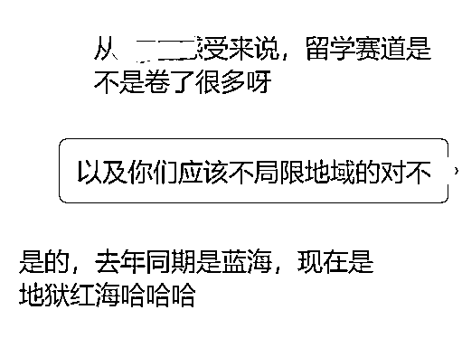
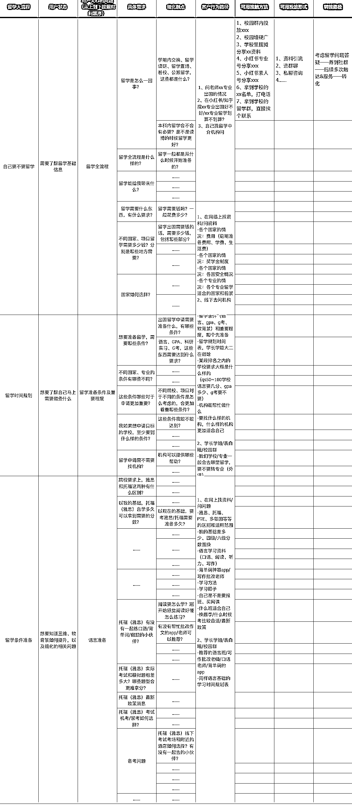

# 红海市场颠覆互联网获客打法，从 0 到 1 杀到 20%的市场份额

> 原文：[`www.yuque.com/for_lazy/thfiu8/xkonigy8t2efe5a9`](https://www.yuque.com/for_lazy/thfiu8/xkonigy8t2efe5a9)

## (35 赞)红海市场颠覆互联网获客打法，从 0 到 1 杀到 20%的市场份额

作者： 鱼饼先生

日期：2023-09-14

在做项目时，可能很多人在一听到是红海，或许就会眉头紧皱。

但如果我告诉你，我们是真的可以在红海里杀出重围，占据自己的一席之地呢？

接下来，就结合自己的实战经验给各位圈友分享下，怎么在内卷到不行的红海赛道找到入局机会。

先自我介绍一下，我叫鱼饼，7 年职业教育·留学行业创业，副业在做人生教练和领导力教练的公域操盘。

早先和一个生财的龙珠圈友，聊行业的时候交流到：

**红海市场杀出市场份额的关键，我觉得在于三个：**

1、产品服务本身是否厉害？

2、有没有办法比对手搞到更多流量？

3、有没有办法建立长期渠道/长期品牌？

**本文主要为大家解决者三个问题：**

**1、怎么在红海市场找到切入市场并且占据市场的根本点**

**2、找到精准客户并且把销售漏斗转化比例提高的思路关键**

**3、不拘泥于互联网并打破互联网的限制，把客户自身私域利用起来**

在展开说明之前，我们先思考三个常见的场景，我们文末再做个回顾：

**【微信红包 vs 微信群内的广告】**

同样是发在微信群内的一个东西，为什么广告链接别人不愿意点，微信红包却很多人愿意点？

微信红包刚发出来的时候，会不会也有人觉得这个“链接”可能是诈骗的？不真实的？

用户什么时候养成，看到微信红包要抢，看到不明广告链接要慎点的意识的？

**【彩票为什么这么多人买？】**

因为人们愿意花钱买一个中大奖的机会。

彩票背后的巨额奖金（机会），是驱动人前赴后继的“杠杆”

**【生财不太做公域，为什么会有这么多新流量进来？】**

本身质量和口碑是一方面，但是更厉害的是生财的拉新政策、志愿者机制等，调用了更多人的私域流量，而且这批人的私域流量，每年会有更新和增长

所以，我们的做法，能不能想办法，让我们的产品：

**1、让用户觉得，这就是红包，我需要很快地去抢？**

——那你不占有市场份额，谁占有？

**2、让用户觉得，你有我能让我中千万大奖的机会？**

——那用户不来抢你的产品，怎么可能？

**3、让很多用户知道，我有这么个产品**

——我的渠道很厉害，哪怕用户不刷互联网，在厕所里都能知道我

就留学关联的产品（中介/申请/机票/保险）为例，我会从几个方面来分享：

**一、总体概念——客户是谁，客户在哪里，如何触达到客户**

对于客户在哪里有个全链条的整体思路，只有先知道怎么触达客户，才能知道**用什么名义、用什么路径触达、用什么方式**转化更顺畅。

**二、对行业的理解——在没有标准的行业，建立标准，产品升维**

因为行业没有标准，所以用户最疼头的是筛选问题，且因为**行业的服务拉不开差距**，所以掌握流量/渠道的人就掌握了留学行业的话语权。

**三、对市场的理解——捕鱼到底在沙漠还是大海还是鱼塘最方便？**

我先要明确沙漠里没有鱼，而大海里有鱼，但是如果我有办法先把鱼放到鱼塘里面，我捕鱼的概率将大大提高，而将大海里的鱼放到鱼塘的关键，就是**给用户上「细化标签」**

**四、对渠道的理解——渠道无关平台、大小，渠道是触达客户的路径**

校园渠道能够有机会无死角的触达客户，**开玩笑讲，某个学生在寝室的厕所里，我可能都有办法触达到他。**

互联网渠道有互联网渠道逃不开的三个宿命：

1、做得好，各种同行来抄

2、后面互联网平台出各种规则来限制

3、用户被同行和我们自己反复发，搞烦了

**五、对产品的理解——引流品专注在用户前置位诉求的降维打击**

**我做留学，但是产品却不在留学这个赛道上玩****，我引流品做的其他方面的布局，这个布局产品对应大学生又是刚需/顶尖/唯一产品的话，对手是不是没法玩？**

高校市场的私域流量是更替的，学生这个身份因为每一年有新入学和毕业的，**学生流量天然又是更替流量。**

**——私域流量可以无限增长。**

**六、对布局的理解——打市场而非打客户**

找客户就类似于摘果子，我可以选择摘野果子，也可以选择自己种果树。

**摘野果子就只能依附于天气、外界资源，以及卷、抢，但是自家的果园可不一样，自家的果园，你可以催熟、你可以施肥、你可以培育新种、你可以有源源不断自然生长的果实。**

# 一、总体概念——客户是谁，客户在哪里，如何触达到客户

**（一）客户是谁**

本科高校市场的有申请海外研究生意向的留学用户

**（二）客户在哪里**

这个问题很有考究，我们可以说：用户在学校里。

但也可以说：

1.  用户在寝室里，

2.  用户在教室里，

3.  用户在某民间的新生群里，

4.  用户在某老师建的班级/课程群里，

5.  用户在某驾校/考研机构/考证机构建的社群里

6.  用户在某公众号的关注列表里

7.  用户在小红书平台/抖音/B 站/微博上刷内容

**（三）如何触达客户**

不管是否行得通，我们先在真空环境下去思考，用户如何触达

用户在寝室里：

1.  ——可以在寝室群里发广告

2.  ——可以让用户的室友帮忙推广

3.  ——可以让寝室楼阿姨帮忙贴广告

4.  ——可以让寝室楼同学帮忙贴广告

5.  ——可以直接去寝室楼一个个问

用户在教室里：

1.  ——可以在课程群里发广告

2.  ——可以让课程的同学帮忙推广

3.  ——可以让老师帮忙贴广告

4.  ——可以让同学帮忙在教学楼贴广告

5.  ——可以直接去教学楼一个个问

用户在某民间的新生群里：

1.  ——可以直接进群发广告

2.  ——可以让同学帮忙发广告

3.  ——可以在新生群里一个个加同学去问

用户在某老师建的班级/课程群里：

1.  ——可以直接进群发广告

2.  ——可以让同学帮忙发广告

3.  ——可以让老师帮忙发广告

4.  ——可以在课程群里一个个问

用户在某驾校/考研机构/考证机构建的社群里：

1.  ——可以直接进群发广告

2.  ——可以让同学帮忙发广告

3.  ——可以让群主帮忙发广告

4.  ——可以在群里一个个问

用户在某公众号的关注列表里：

1.  ——可以让号主帮忙发广告

2.  ——可以私信用户一个个问

用户在小红书平台/抖音/B 站/微博上刷内容：

1.  ——可以在公域截流

2.  ——可以在公域引流

3.  ——可以在公域私信用户

……

那么下一个问题，以上真空环境下我们想的方法都可行吗？这些对手都能想到的问题，凭什么我们能占有更多的市场份额？以及，从投入产出比角度来说，以上方法哪种更合适？

# 二、对行业的理解——在没有标准的行业，建立标准，产品升维

我们看留学这个行业，不像是医院似的，有三甲医院，有主治医师、主任医师，那么明确的标准。

一个没有标准的行业，我们从产品和商业变现角度来看，会有什么问题和机遇？

**（一）行业问题**

用户不知道怎么筛选，用户在没有被“教育过”的情况下，不知道头疼医头，脚疼医脚，他可能一开始是头疼医脚的。

从“医生角度”来看，真的有感冒的人来我心血管科，我能不能给他聊几句，提供些解决方案呢？

医院医生不能这么做，但是留学顾问很乐意这么做，因为我虽然不一定能对症下药，但是我还是可以给点帮助，并且赚你钱呀。

**但这对病人不一定有利。**

**（二）行业机遇**

那么这个时候，你告诉他，你头疼就应该去找最适合治疗头疼的医生，他会很感激你，给你付费。

另外，因为患者不知道不同医生的治疗水平差别和服务类别差别，以及客观来说，服务也难拉开很大差别。

不像是顶级老中医和年轻小中医那样，服务决定了市场。

留学这个行业中，掌握客户量（渠道）的，才决定市场。

所以你如果能够有办法：

1、找来很多“患者”

2、并且能够解决“患者”找不到对口医生的问题

那真是大功一件又能狠狠赚钱的事情。

**1 是需要下狠功夫的，市场中的对手可不会白白给你让“患者”**

**2 是有了 1 自然有很多对口医生找上门的。**

所以我们可以发现，1 是最关键的问题，同时 1 也是本文要讲的重点。

# 三、对市场的理解——捕鱼到底在沙漠还是大海还是鱼塘最方便？

OK 我们分析完行业，我们知道我们的着手点是找到足够多的“患者”。

**（一）单位市场的客户密度理解**

有些人会觉得自己的产品没有市场密度的概念，我的概念里其实都有。

把人群按照标签进行划分，不同标签的人群在采购逻辑上会有区别。

人群标签可以是：年龄、性别、收入、城市……

对应到大学留学客户的标签是：年级、性别、城市、学校层次（985、211、一本、二本）、学校类别（综合类、财经类、理工类、中外联合类）

标签和客户画像的深入能让你更精准找到客户。

你在互联网操盘手里面找生财有术的付费用户，就比在制造业工程师里面找生财有术的付费用户要来的容易。

同样，你在 985 高校找留学客户，肯定比二本院校找留学客户来得容易。

**（二）市场密度影响方式方法**

大标题我写着“捕鱼”。用同一种方法在不同场景捕鱼，效果可能会发生变化。我随便举个例子大家看是否合理：

在一个满是鱼的池塘里我**随意**扔下渔网，80%的可能性能捕到 10 条鱼。

在海洋里我**随意**扔下渔网，50%的可能性能捕到 5 条鱼。

在沙漠里我**随意**扔下渔网，0%的可能性能捕到 1 条鱼。

中外合办高校（A 类）的留学率是 80%，985 高校（B 类）的留学率是 20%，一本 211 高校（C 类）的留学率是 10%。

好，**我随便在学校里建个外卖群**，群内均 100 人

外卖群 A 中天然有 80 个留学客户。

外卖群 B 中天然有 20 个留学客户。

外卖群 C 中天然有 10 个留学客户。

注意，这里都还没有怎么考虑做转化的问题。

**（三）给你的用户加“细化标签”——在客观市场密度不变的情况下，增加我渔网捕鱼的概率**

这个可能很多人难以理解，市场密度客观就在那里，我网就是这么大，网眼就是这么大，我怎么增加捕鱼的概率呢？

你有没有想过，你的用户还有其他细化标签？

**当这个细化标签加上之后，其实你的市场已经发生了****变化****。**

我们刚刚聊到，普通一本 211 高校（C 类）中 10%是留学的大学生。但是如果我们加上一些细化标签：

一本 211 高校的奖学金获得者，**这个群体里**有没有可能留学的大学生变成了 40%？

一本 211 高校的金融专业，**这个群体里**有没有可能留学的大学生变成了 25%？

一本 211 高校的学生会部长，**这个群体里**有没有可能留学的大学生变成了 15%？

聊到这里我们再思考常规做留学的获客手段：

1、联系校园公众号/媒体发布——常规网眼常规鱼池捞鱼，拉不开差距，捞鱼效率低

2、互联网平台发布内容吸引客户——需要懂平台规则、难免最后进入到常规互联网“死局”

**四、对渠道的理解——渠道无关平台、大小，渠道是触达客户的路径**

理解完市场之后，我们基本知道了哪里找客户的“道理”，具体对应到怎么找到客户，和渠道路径有关

不是说做项目就要去做抖音、B 站、小红书、知乎的，**第一念应是思考你的客户在哪里，通过哪个渠道可以触达到他。**

**（一）校园级渠道**

**1、渠道覆盖覆盖流量越大越好**

在高校市场中，按照渠道覆盖范围大小，可以分为：全校级、全年级、全院级、全班级。

从这个维度可以进行渠道的覆盖流量的评估和计算。

像是刚刚聊到的，从渠道建设角度来说：

一本 211 高校的金融专业捞留学客户，是比全校市场捞留学客户，比例高 15%的

那么一个学校中，在产能/服务有限的情况下，剩下的是一个选择问题：

——我愿意 10000*10%*转化率α？

——我愿意 100*25%*转化率β？

#### 2、渠道的用户关注度越高越好

渠道关注度，与多个影响因素有关：渠道载体形式、渠道发布日常内容。

在高校市场中，渠道载体形式可分为：

QQ 群、微信群、钉钉群、校园论坛、小程序、自媒体公众号等，渠道载体形式不同，会影响用户的使用频次和使用习惯，比如现在很多高校的同学习惯使用微信群，不怎么看 QQ 群，那么这也可能意味着微信群的关注度普遍比 QQ 群要高。

同样的渠道载体，如果发布日常内容对同学的价值更大，那么同学对该渠道的关注度就会偏高。反之，则同学有可能关注渠道的频次很低，甚至屏蔽这类信息渠道。

#### 3、渠道的可靠性越高越好

渠道的可靠性，往往和渠道的建立者或组织方的性质、运作内容有关。

高校渠道的性质一般可分为：个人运营、院校官方运营、校园团队运营、社会机构运营。

根据组织方的不同性质，渠道发布的信息内容也会有所区别。若渠道在用户心中，组织者是具备一定官方和权威性的，并且往期发布信息内容对学生很有价值，那么用户对该渠道的信任度就会很高。这种渠道的可靠性就很高。

那么对应到 板块一的（三）中提到的那么多种触达客户的路径中，从打广告和信息流投放而言，我们自然可以排出权重：

1）微信群＞QQ 群

2）校园媒体平台＞学生自建平台＞校外机构建立平台

3）老师发＞同学发＞机构发

这个时候我们的内心应该出现一个触达用户的路径图和路径次序图：

1）老师帮忙发在校内 xx 微信群

2）老师帮忙发在校园 xx

3）同学帮忙发在……

**（二）互联网渠道**

互联网的渠道没有大小一说，更多是大数据推流和搜索流量。在我理解里面，互联网类的渠道，逃不开三类最终宿命：

1、做得好，各种同行来抄

2、后面互联网平台出各种规则来限制

3、用户被同行和我们自己反复发，搞烦了

怎么从找对标开始到超越对标的玩法，可以参见我上一篇精华帖，这回不展开赘述了：[`t.zsxq.com/10yyTHo1Y`](https://t.zsxq.com/10yyTHo1Y)

**五、对产品的理解——引流品专注在用户前置位诉求的降维打击**

不难分析出，互联网渠道相比校园级渠道，覆盖用户的深度和广度肯定都相对差些。

你可以不看抖音、小红书，但只要你在这个高校，肯定会看微信/老师消息/同学消息/同学老师朋友圈/校园墙……

公域你还要依赖大数据，私域是全面辐射用户。

我们刚刚在第四个板块分析到：

那么对应到 板块一的（三）中提到的那么多种触达客户的路径中，从打广告和信息流投放而言，我们自然可以排出权重：

1）微信群＞QQ 群

2）校园媒体平台＞学生自建平台＞校外机构建立平台

3）老师发＞同学发＞机构发

这个时候我们的内心应该出现一个触达用户的路径图和路径次序图：

1）老师帮忙发在校内 xx 微信群

2）老师帮忙发在校园 xx

3）同学帮忙发在……

那老师肯帮你发留学广告嘛？同学肯帮你发留学广告嘛？同学肯帮你推身边留学用户吗？

这里大家回过头思考我上面分析过的两个情况：

中外合办高校（A 类）的留学率是 80%，985 高校（B 类）的留学率是 20%，一本 211 高校（C 类）的留学率是 10%。

好，我随便在学校里建个外卖群，群内均 100 人

外卖群 A 中天然有 80 个留学客户。

外卖群 B 中天然有 20 个留学客户。

外卖群 C 中天然有 10 个留学客户。

你有没有想过，你的用户还有其他细化标签？

当这个细化标签加上之后，其实你的市场已经发生了变化。

我们刚刚聊到，普通一本 211 高校（C 类）中 10%是留学的大学生。但是如果我们加上一些细化标签：

一本 211 高校的奖学金获得者，这个群体里有没有可能留学的大学生变成了 40%？

一本 211 高校的金融专业，这个群体里有没有可能留学的大学生变成了 25%？

一本 211 高校的学生会部长，这个群体里有没有可能留学的大学生变成了 15%？

**好，重点来了**

如果你打磨一个产品专门面向奖学金获得者，你再从这里面转化留学客户，会不会比直接在全校捞留学客户容易？

如果你打磨一个产品专门面向艺术设计专业（高留学密度专业）的大学生，你再从这里面转化留学客户，会不会直接在全校捞留学客户容易？

如果你有一个上游，专门是做大学生投行四大实习实习的，你从上游里面转化留学客户，会不会直接在全校捞留学客户容易？

如果你有一个上游，是有一堆优秀大学生人才资源的，你从上游里面转化留学客户，会不会直接在全校捞留学客户容易？

……

**同学老师推留学用户是不是很难？毕竟学校很反商业嘛。但是你让他：**

**1）推荐奖学金获得者**

**2）推荐学生会主席部长**

**3）帮忙发布投行券商实习找继任**

**4）帮忙发布高质量大学生汇聚活动**

**这些动作会不会容易很多？**

这还没完。以上有些方式是离用户产生留学诉求，甚至采购留学中介申请这个服务很远的。

从产能和转化成交角度来说，我们要理解：

**1）用户哪怕在考虑采购产品的路上，但是没有到临近采购决策那一下，他都不会急着采购的。**

**2）用户在决策全链路上，诉求越靠近采购决策，采购决策越容易。**

这两句话，送给同行中做不同环节的朋友，以及大家在择业和选品考虑中，做哪个环节的建议。

**很多人构思引流品的时候，会觉得是不是用户前置位诉求的产品都可以做引流品？体验性质的产品都可以做引流品。**

**我觉得还有一种做法，叫做****降维打击****。**

**我做留学，但是不在留学这个赛道上玩****，我引流品做的其他方面的布局，这个布局产品对应大学生又是刚需/顶尖/唯一产品的话，对手是不是没法玩？**

比如：

①我专门有个面向奖学金获得者的产品，然后我针对这里面留学的同学，有个叫「名校冲刺申请计划」，是不是听起来很牛逼？如果你是奖学金获得者，是不是会让你觉得你配得上这个服务？

②我专门有个面向高校精英群体的产品，我针对这里面的同学，不断注入我整体产品服务很好、资源很多，自然留学也能解决你非常多问题，会不会让你在后续产生留学诉求那一下，采购选择我这边呢？

**这种类型的产品，可以快速在学生中产生裂变。**

前文提及互联网平台逃不开 3 个归宿。但是私域流量是更替的，学生这个身份因为每一年有新入学和毕业的，**学生流量天然又是更替流量。****——私域流量可以无限增长。**

# 六、对布局的理解——打市场而非打客户

**（一）饺子店要非常好吃我才肯跑很远**

从产品采购的角度来说，互联网的线上产品确实解决了很多产品地域受限的问题。但是还是有很多产品，和互联网是没有关联的。

留学中介申请这个事情，客单价很高，虽然现在很多做线上的，但是用户总归是见过人会更加信任一些，所以像是我在杭州，肯定也是杭州的客户好签约，东北的客户不好签约。

很多产品也是一个道理的：

比如我住在杭州西湖区，如果我要吃饺子，**我肯定考虑我家方圆 1 公里以内的饺子店，但你要我去 3 公里以外的饺子店，前提一定是这个饺子非常好吃**

线上的留学成交也是同理，**你非得品牌好到不行、产品好到不行、口碑好到不行，我才肯签约你。**

**否则就是强龙压不过地头蛇。**

大多数人获客做的，是打客户的模式，而不是打市场的模式。

**类似于摘野果子似的，摘野果子就只能依附于天气、外界资源，以及卷、抢，但是自家的果园可不一样，自家的果园，你可以催熟、你可以施肥、你可以培育新种、你可以有源源不断自然生长的果实。**

**（二）打市场和打客户的区别**

#### 1、打客户是什么？

一个客户过来，我沟通。

一个客户在那里，我找过去。

#### 2、打市场是什么？

①市场已经被我培育了品牌

②市场中的客户已经被我通过前置性的引流品触达了

③市场渠道在我手里，市场中的客户想采购产品，**只想得到我，一有相应需求就知道找我**

哪种轻松？哪种厉害？

#### 3、总结：怎么打市场？提升市场份额

我始终认为公域还是打客户的方式，因为公域来的客户不稳定，公域来的客户和客户**所在场所**没有关联性。

所以打市场，一定是：

①明确产品服务足够好

②确定好完整的品牌体系

③多种获客方式并行，建立市场体系

④谈渠道，建设渠道体系

⑤有采购前置位诉求的引流品 or 上游

那如果做校园产品的获客，肯定考虑的是：

校领导能不能谈下来？

校园社团能不能谈下来？

校园群群主能不能谈下来？

公域流量能不能做好校园同城的？

就好比我是微软在杭州的经销商，我的目标是把杭州市场拿下

我肯定不可能在杭州一个个找客户：

我肯定要把杭州所有的电脑城拿下，

我肯定要在杭州各区找代理，

我肯定要在杭州的商圈、写字楼密集的地方布局线下店，

我肯定要在公域上做好同城的广告

最后，附一个 SOP 的获客模型：

**（三）回顾开头的三个问题场景**

**【微信红包 vs 微信群内的广告】**

同样是发在微信群内的一个东西，为什么广告链接别人不愿意点，微信红包却很多人愿意点？

微信红包刚发出来的时候，会不会也有人觉得这个“链接”可能是诈骗的？不真实的？

用户什么时候形成，看到微信红包要抢，看到不明广告链接要慎点的**意识**的？

这样的意识是怎么被培育的？用户天然的意识是怎样的？

**对于大学生和留学用户来说，什么样的东西是红包？什么样的东西是广告？**

直接的留学产品是广告。

实习推荐/实习找继任/面向奖学金获得者的服务是红包。

**关键要点是你这个红包如果投放在高留学密度的市场里面，来抢的必然是留学客户**

**就像是我前面开玩笑讲，80%留学率的市场里面，我甚至随便拉一个外卖群，来的都是留学客户。**

**【彩票为什么这么多人买？】**

因为人们愿意花钱买一个中大奖的机会。彩票背后的巨额奖金（机会），是驱动人前赴后继的**“杠杆”**

机会杠杆和几个东西有关：奖金、通道、政策

所以我们的产品，可以往这三个方向去构思设计，如果产品没法满足，就在引流品或者上游产品上动脑筋。

前文我有提过两个例子：

①我专门有个面向奖学金获得者的产品，然后我针对这里面留学的同学，有个叫「名校冲刺申请计划」，是不是听起来很牛逼？如果你是奖学金获得者，是不是会让你觉得你配得上这个服务？

②我专门有个面向高校精英群体的产品，我针对这里面的同学，不断注入我整体产品服务很好、资源很多，自然留学也能解决你非常多问题，会不会让你在后续产生留学诉求那一下，采购选择我这边呢？

**留学我没法设计奖金（推荐客户返佣可以）、通道、政策，但是其他产品有办法。**

**【生财不太做公域，为什么会有这么多新流量进来？】**

本身质量和口碑是一方面，但是更厉害的是生财的拉新政策、志愿者机制等，调用了更多人的**私域流量**，而且**这批人的私域流量，每年会有更新和增长**

能调动更多人私域流量并且自发传播/自愿传播的，一定是满足几个特征：

1、受众广（实习总比留学受众广，且）

2、有身份价值体现（大学生高含金量实习、大学生高质量人脉资源等）

**比如生财拉新的关键，我理解还是“拉新佣金和政策”**

以上。

* * *

评论区：

挖哈的阿抓 : 我们平台自媒体经常接留学广告，考研广告，大学生用户私域近 10 万，估计他们产出是有的才会经常复投

* * *