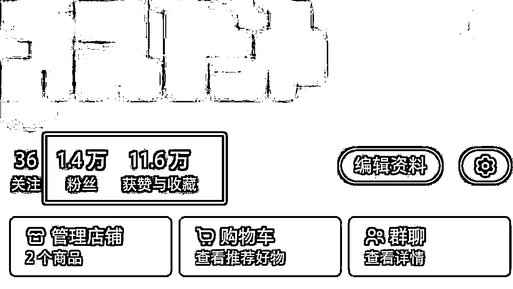
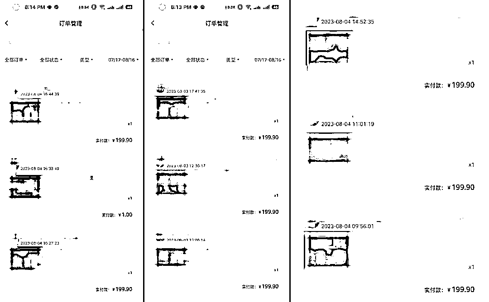
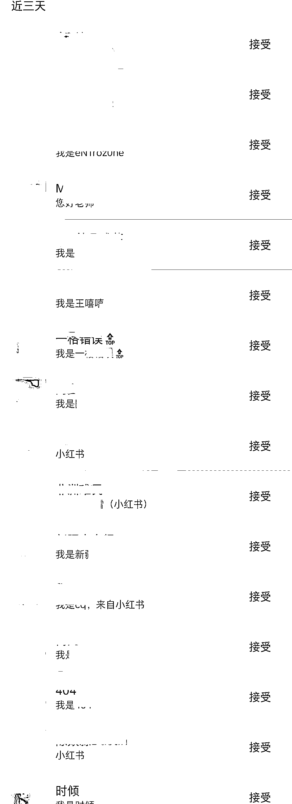
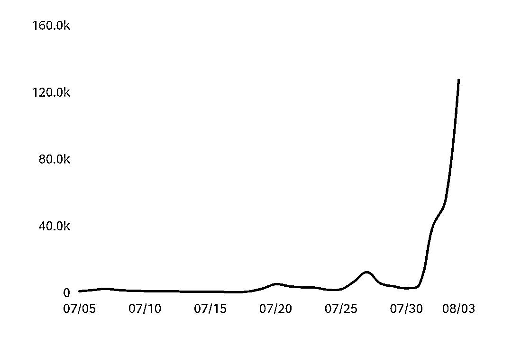
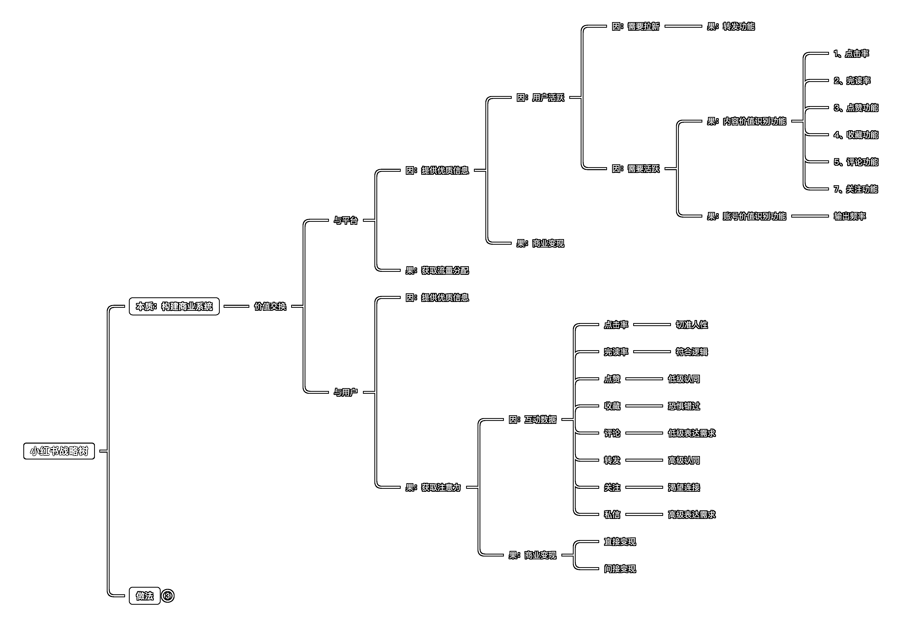
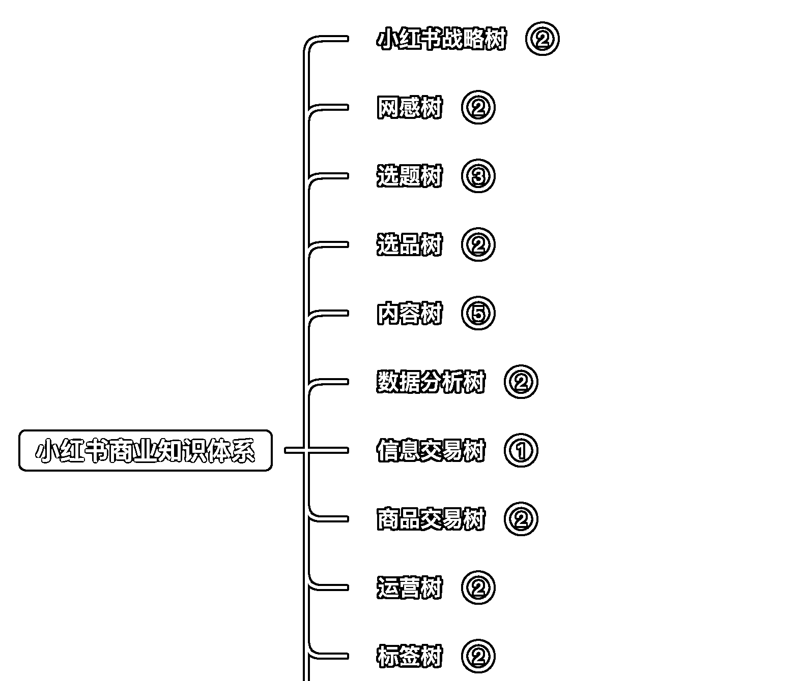
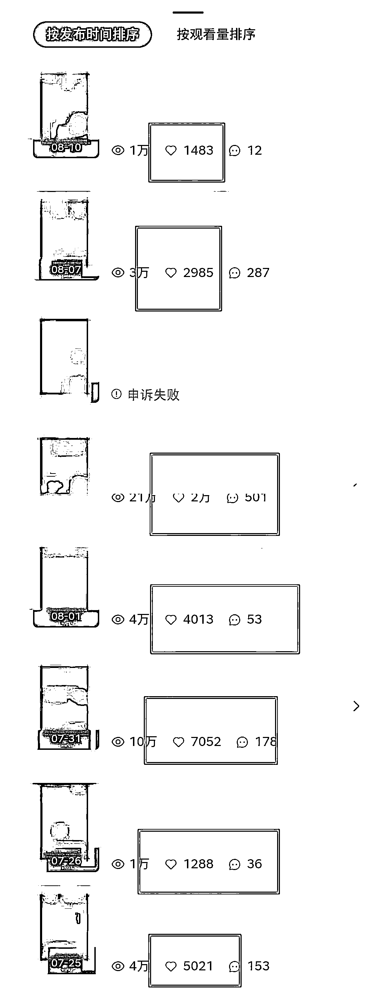
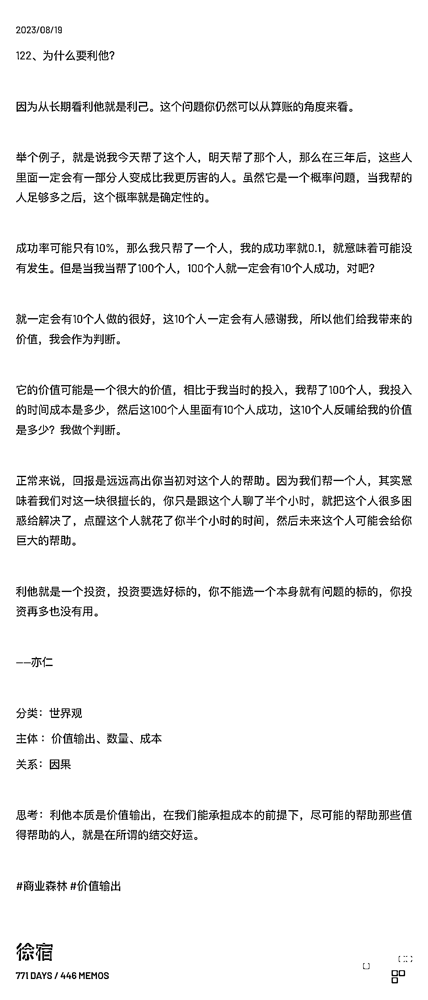
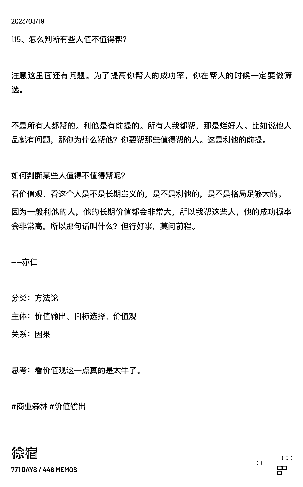

# 什么样的知识体系对于赚钱是有意义的

> 原文：[`www.yuque.com/for_lazy/thfiu8/yogxxskk33rd1e66`](https://www.yuque.com/for_lazy/thfiu8/yogxxskk33rd1e66)

## (精华帖)(282 赞)什么样的知识体系对于赚钱是有意义的

作者： 徐宿

日期：2023-08-28

看到生财有一些朋友分享知识管理和知识体系的文章，他们分享的方法在某些具体的信息管理场景中可能会有价值，但对于赚钱和成事的价值可能并不高，普通人学习的必要性不大，很容易浪费自己宝贵的时间。

我这样说会显得有些狂妄和偏执，但人的表达欲正是来自于此，你先听听我说的有没有逻辑。

这篇文章我会以自己「小红书 5 天涨粉 7000 关注」这样一个简单的案例，为你理解知识体系在赚钱这个活动中的意义。或许能够帮助新朋友和已经赚到一个数量级钱的老朋友们提供一个精进的方向。

先说一个观点：**赚小钱和做到一些基本的成绩，是可以通过科学实现的，如果方法正确可以 100%做到**。

下面我以自己上个月做小红书的案例来带你理解这个观点，先贴一些我做事的成绩反馈：

我大概花了 1 个月，把一个账号做到了 1 万粉，赚了两三千块钱，引流了 300 多个人到微信。

下面具体给你分享做这些数据的底层逻辑。

# 1、从方法论和世界观说起

在我们日常刷生财社群的文章时，大家可以看得到，有非常多教你赚钱的帖子，这些帖子中有非常多的方法论，告诉你第一步怎么做、第二步怎么做。

有些时候，你按照这些方法论可以得出正确的结果，更多时候，你可能得不到你想要的结果。

抛除那些你能得到正确结果的方法论，对于那些即被亦仁加了精华看起来很有价值的文章、而你按照他们教的方法却得不出你期望的结果的文章，大家应该是都有困惑的，这里最大的困惑可能就是：

## 为什么别人按照他讲的方法论能做出成绩，而我不行？

其实原理非常简单，**因为你看到的方法论或多或少都会存在缺陷**，由于每个人自身自带的经验和经历不同，别人知道这些缺陷在哪里，而你不知道。

大多数人的方法论，都是因为先做出成绩，事后觉得有必要或者有目的分享，然后复盘总结提炼一下给你呈现，这里你要知道，它并不是别人能做出成绩的全貌，只是浓缩的片段，**是浓缩必然有缺漏**，这个多多少少都避免不了。

上面这段话不容易理解，我以小红书实操案例带你感受一下，两种不同的做事模式之间产生的差异：

## 玄学模式

一般大家的做事方式被我称为【玄学模式】，大概的经历过程是这样的：

通常，在大家选项目做事的最初阶段，我们通过别人的文章简单理解了某个项目的商业闭环，比如我们知道小红书是一个内容平台，你去给小红书提供有价值的内容，它给你更多流量让更多人看到你，然后你使用一系列方法达到变现目的，这样一个商业闭环就走完了。

简单的理解了这个逻辑，你就去按照别人教你的方法去实操，最后发现在实操的过程中有很多问题攻略里也没说，别人发笔记随随便便几百几千赞，你发笔记没人赞，由于短时间得不到正反馈，你也不知道该怎么继续研究，就会怀疑自己可能不适合做这件事，于是放弃掉它，继续去换下一个。

正反馈，对于普通人来说，是非常重要的，一直遭受失败经历的人这里应该能理解我说的这件事有多重要，那种不知道自己继续坚持下去到底有没有结果的痛苦很少有人能扛下去。

可是如果你按照上面这种模式去做事，由于你不知道自己到底哪里出了问题，你也没有方法来思考到底哪里没做对，你的做事旅程就会变成一个玄学旅程，整个旅途都是一个碰运气的状态，运气好可以少试错几次，运气不好就得一直试错下去。

## 科学模式

另外一种模式就是我目前在用的模式，可以称呼它为【科学模式】，具体怎么做呢：**在做任何事情前，我要同步或者提前去建立这个项目的知识体系，这里的知识体系和市面上很多山寨博主讲的知识体系不是一会儿事儿**。

拿小红书来举例子，在我要去做小红书之前（对小红书软件基本的使用经验是必不可少的），我会先去建立关于小红书商业的知识体系。

知识体系的核心框架应该聚焦在「世界观」和「方法论」上，他的本质是**研究清楚知识之间的关系**。

一切有效的方法论都应该来自更科学的世界观，那么对于我这种内容生产者来说，在小红书做商业的世界观知识结构是怎么样的（大致是下面这样）：

这张图并不是全貌，只是一个关于小红书商业底层原理的切片展示，容我简单解释一下这张图最重要的 3 个含义：

1、**任何商业系统的底层原理逃不了价值交换**，否则它就不是商业系统，可能是掠夺或者战争之类的其他模式

2、**创作者在小红书上需要和两方做价值交换**：平台和用户，平台有平台的需求（商业变现）和责任（提供流量），用户有用户的需求（消费信息）和价值（提供注意力）。

3、从生财社群或者相关平台搜集各种信息，**提炼推导出这套系统每一层价值交换逻辑的因果关系**（有时候还需要你去做实验测试），就能获知这件事的大致世界观

当我有这么一张做事的地图后，对于一篇内容的创作我可以清晰的知道每一个关键节点要提供什么价值，拿创作一篇小红书笔记来说，如果我们的目的最后是要落到转粉率上，那么我们需要经历大概 4～7 个因果层：

你最起码，要在点击率、完读率、评论率和转粉率这几个环节清晰的知道自己提供了什么才导致用户做出相应的动作。

基于这样的世界观，我在做我的账号的时候，使用的方法论是：

1、通过切人性需求和障碍需求来提升点击率

2、通过降低内容阅读门槛和给予精准价值来提升完犊率（比如清单体、梨云绿）

3、通过让用户一下子吸收不了内容必须收藏提升收藏率

4、通过在内容中植入免费送资料让他们在评论区领取（提供评论率）

5、通过小号在评论区引导「已关注，求分享」来提升转粉率

由于这篇文章主题并不是讲小红书怎么做，所以我就不继续展示方法论部分的知识体系了，但实际上你要知道，我一切的内容生产和运营背后，都是有下面这种每一个具体环节的具体知识关系的，都是有科学的因果逻辑需要遵循的。

按照这种科学的因果逻辑构建的知识体系，我们可以成规模的创作出满足平台和用户需求的「优质内容」，比如我作为一个新手，研究 1 个月小红书可以稳定输出千赞笔记：

而大多数人在没有这种知识体系做支撑的时候，他对于小红书内容创作的认知是：**只要提供了价值就能赚钱**。

具体咋提供呢？可能大部分人并不知道。

大家并不能很精准的理解每一个环节要干什么。

**我们从别人那里吸收了很多方法论，可如何验证和思考这些方法论的科学性，大家却需要笨拙的一个个去实操试错，这其中浪费的时间、薄弱的正反馈导致我们总是浅尝辄止**（并不是说我后面说的这种方法就不需要实操试错，我只是在说这种方法可以降低试错成本，提升成功率）。

如上是这篇文章我要跟大家分享的第一个部分，关于知识体系对于赚钱或者你做任何事的意义，**知识体系首先是用来用的，不是用来看的**（市面上那些随处可见随意拼凑看起来很牛逼很好看的思维导图，实际多是漂亮的骗子）。

# 2、因果层决定成功率

由于生财有术中生产内容的圈友们并不总是逻辑清晰，表达精准，这使得你会在别人的文章中经常看到即感觉含混不清看起来像是废话又感觉似乎有道理的信息。

比如，“**做「小红书/抖音/视频号」就是要创作有价值的内容**”，这句话你乍一听，感觉很有道理，但仔细一想，又感觉他似乎什么都没有说，为什么会这样呢？

因为这些圈友并没有提供严格的因果逻辑运行过程，它只是用一句最本质的话把底层原理说通，于是在你看起来，做这些事似乎非常简单，只需要一个步骤。

可事实上，你需要经历非常多的因果层才能得到你想要的结果，比如我上面画的这张图，你可以再看一次：

再比如，亦仁这些年一直在强调生财有术能走到今天，和他所推崇的一些底层价值观有很大的关系，比如「**利他**」这个词。

大家听到这个词的时候，乍一听感觉格局真高，非常感动，但是我相信大部分人可能并不知道为什么要利他，我们只是因为别人做到的一些成绩所以愿意多给某些价值观一些相信，可你得知道，如果真的要践行这些价值观，需要你真的理解。

人为什么要利他呢，翻看亦仁以前跟谢老哥的聊天记录，其实这里面是有系统的因果逻辑的，你可以看一下我下面这两张知识卡片：

————————

仔细思考这两张知识卡片的内容，你会发现，「利他」是这套价值计算系统最终得出的一个标准，它有前因后果，有前提有底线，如果你不知道背后的这套知识体系，你很容易走错路，盲目的帮助别人、平白浪费自己的资源。

这就是为什么查理·芒格说：**如果你不知道一个知识的适用边界，那么你就不配拥有它**。

你只有把一些事情的世界观清晰的按照因果关系或者其他关系梳理清楚，这时候你去执行的时候，成功率才会更高。

从初期来看，思考或者实践我这种方法是个慢功夫，相对枯燥，但你要知道，只有这种积累才会带来真正的复利，因为这个世界很多领域的知识都是相通的，如果对这句话不理解的，可以看一下我以前在生财写的《学习的本质》一文。

李小龙曾经说，我不怕练一万种拳法的人，我只怕把一种拳法练一万遍的人。

你得知道什么拳法可以练一万遍，而我说的「知识体系」这种拳法，或许是值得的。

# 3、案例不是事实

我偶尔看到一些人评论，在生财看了非常多的赚钱文章，但是还是没有赚到，这是为什么呢？

其实非常简单，因为你只喜欢看，只追求大脑的感官刺激。

在这篇文章的第三部分，我要分享的一个重要知识是：**案例不是事实**，案例可以承担的责任是提高我们的理解效率，而不是直接提高我们的成功率，这是两个概念。

**生财有术大部分人发的赚钱文章对于创作者本身可能大概率是事实，但对于你，都是案例**。

我们可以相信别人说的一切内容都是真的，但在我们自己没有做到过，或者无法迁移理解时，我们需要记住一个最底层的行事前提：**一切都是假设**（哪怕是我今天说的这些，目前对于你来说也只是一些可能为真的信息）。

是假设就需要通过验证的方式让自己理解，这里，已经在现实生活中取得过很多成绩的人当然可以降低实操验证的频次。

但我相信大多数生财的圈友和我一样，恰好不是这种人，那么我们就需要去通过实操创造自己的事实成绩，这是动力、信心、认知的真正来源。

如果你一直在看生财有术的文章，但发现自己仍然毫无所获，那大概率就是看得太多了。

在没有科学的个人知识体系构建方法前，看得太多有时候未必是好事，你得知道**信息带来的不只是价值，还会勾出你好逸恶劳、急于求成、看不起小钱等等负面的状态**，这种状态会阻碍你去行动。

这就像今天人类世界很多吃起来美味的食物都或多或少附带一些糟糕的科技与狠活儿，举个最简单的例子：**辣条对于很多国人来说应该是很好吃的东西吧，但长期吃它的代价你可以想象一下**。

那么，一切的方法论、世界观、案例等等，最终的归宿是哪里呢？

其实最终的归属就是我在第一部分展示的那种知识体系之中，这种知识体系的本质就是你的认知框架、底层思维。

而这种知识体系承担的责任是什么呢？

是**让你有更清晰的头脑去分辨清楚别人说的那些东西到底对你有没有价值**。

由于这篇文章主要是在讲知识体系对于赚钱或者成事的意义和价值，所以这里不继续展开具体的知识体系构建方法，我打算回头看一下评论区会有多少人对这套方法感兴趣，如果你看完对它感兴趣的话，可以在评论区留言类似「对 xxx 感兴趣」的评论，我衡量需求基数来决定是否投入一些时间生产。

# 4、人不需要记太多东西

最后我想跟大家分享的一个话题是：**人不需要记太多东西**。

为什么我要在开头去吐槽很多讲知识管理方面的文章，并不是这些东西真的没有价值，当然是有一些的，但是对于普通人来说真的价值很低，在你没有赚到一个数量级的钱之前，投产比极低。

按照第一原理的思维，我们从头来思考你为什么会去研究知识管理？

最核心的目的可能是为了降低自己的大脑记忆压力，辨析清楚哪些知识有用哪些知识没用。

但你会看到，市面上大多数野生博主或者知识管理软件为你提供的方法是：**让你记得更多**。

这简直是个悖论，我们一方面想要让自己减少记忆压力，一方面又在疯狂的给自己的各种信息库填充各种信息。

爱因斯坦老师曾经说过一句话：

“ **Insanity is doing the same thing over and over and expecting different results**. ”

翻译一下：

**精神错乱就是一遍又一遍地做同样的事情，却期望得到不同的结果**。

我们真正需要的，是一套可以推理出本质知识的个人知识体系构建方法。

通过构建个人知识体系的过程，你会发现这个世界上很多知识都是想通的，都在揭露一些更底层的原理，当一些原理到了最底层，你自己就有一个可以复用终身的底层框架和模型，这个东西可以让你明辨是非，以不变应万变，比如物理学的牛顿力学、比如社会学的适者生存、甚至于比如生财的「利他」。

有太多卖课的、卖社群的、做教育的，他们会告诉你需要学习很多知识，只有少数人会告诉你，很多东西没必要学。

大多数人学习的最终目的，不是为了变成一个图书管理员，而是找到那些最根本的因果，让自己能够掌握一些以不变应万变的底层能力，去适应这个变换莫测的世界。

这就是为什么查理芒格说，**一个人一辈子只需要掌握大约 100 个思维模型就能活的很好的原因**。

以上多有偏见，希望能对你做成一些事有帮助。

* * *

评论区：

梨云 : 知识体系确实是做成一件事、一个项目的底层基石[机智]
早晚 : 思维逻辑好清晰[强]
筑梦 : 有价值，知识体系是一通百通的好东西
昆屿 : 说实话，我看了你好久，不知道你在讲啥，感觉我好菜[捂脸]
徐宿 : 圣火昭昭，圣光耀耀，教主此言我大赞[得意]
徐宿 : 没事，缘分还不到，我继续努力
夏维 ves : 好似看懂了又好似没看懂[害羞]
KingBor : 受益匪浅，感谢大佬分享[强][咖啡] 构建一个项目的知识体系，其实是构建自己对项目认知的过程，看看能不能应用到这次航海[呲牙]

* * *