# 微调 ChatGPT 3.5 实战

> 原文：[`www.yuque.com/for_lazy/thfiu8/fn3r157x69yaz7kf`](https://www.yuque.com/for_lazy/thfiu8/fn3r157x69yaz7kf)

## (22 赞)微调 ChatGPT 3.5 实战

作者： 许山山

日期：2023-09-04

OpenAI 于八月底开放了 gpt 3.5 的 fine-tune 接口，并提供了一份文档来指导如何进行 fine-tuning。

本文将通过微调一个风向标拆解模型的实战过程来跟大家分享一下微调 gpt 3.5 的方法。

关于 chatgpt 分析风向标可以看这篇帖子：https://wx.zsxq.com/dweb2/index/topic_detail/584558552552284

通过阅读本文你可以了解到：

1.  微调 gpt 3.5 的方法和流程

2.  使用 chatgpt 代码解释器来辅助生成数据集的方法

3.  判断微调是否适合你的场景

在开始讲具体操作步骤之前，先来跟大家分享一下我这两天实际的一些体验。

首先最重要的就是，什么时候使用 fine-tuning, 以及 fine-tuning 能做到什么。

以下是我个人的一些感受：

1.  当你需要训练模型生成更稳定的输出时（例如 json）

2.  当你想让模型学习到特定的风格或者完成特定的任务时

3.  当你想要减少 Token 的消耗 （但是注意这不一定会更便宜）

4.  抵抗 prompt 的逆向

接下来给大家看一下我微调的风向标模型和官方模型的效果对比。

每组中上图是微调模型，下图是原版模型。

第一组：

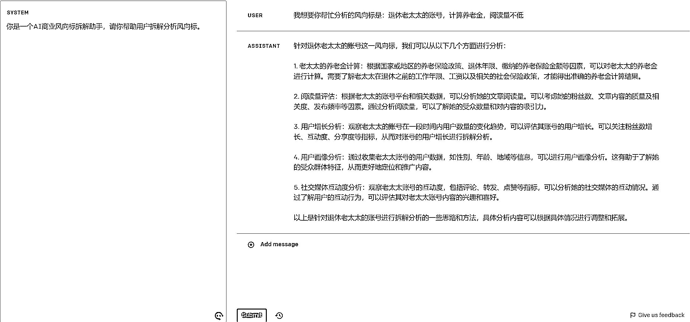

第二组：

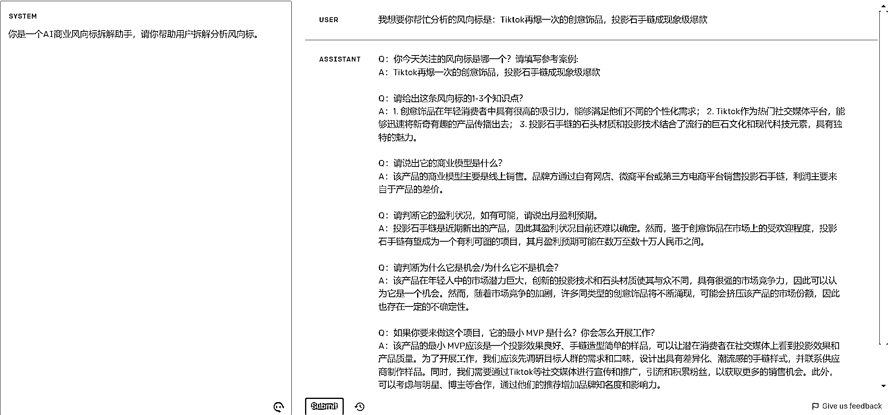

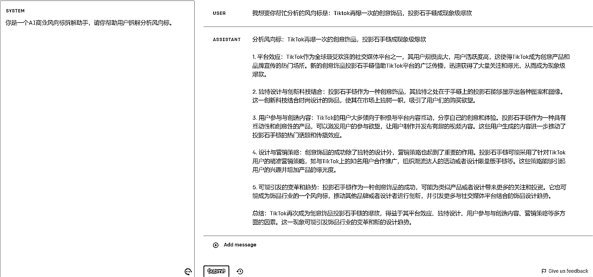

第三组：

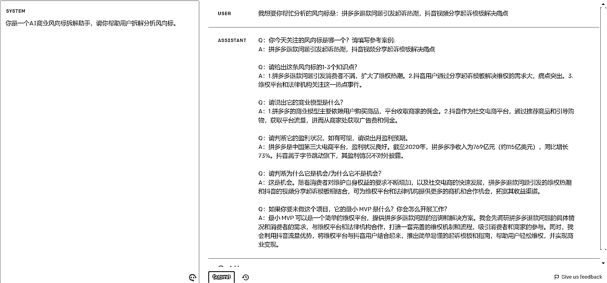

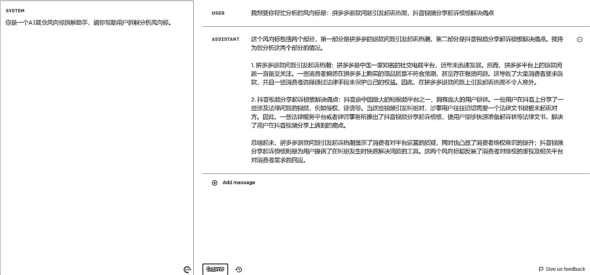

如果大家仔细阅读上面的内容，你们可能并不会觉得 fine-tuning 后的效果一定就比原版好，因为有些分析原版的 3.5 也已经做的很好了。

并且由于我的数据集的质量不一定特别的好（GPT 3.5 生成的），可能也会有所影响，一般来说，模型决定了性能的下限，数据的质量决定了性能的上限。

而如果不深究内容，只看结构的话，你有没有发现微调后的模型输出的风格特别接近【微调可以输出特定格式，学习特定风格】，而我们并没有在 prompt 中强调输出的格式应该是什么样的【抵抗 prompt 的逆向】。然后下面是我用来生成微调数据集的 prompt:

在微调模型之前，每次调用 3.5 的 API 我都需要用这一长串的 prompt【微调可以减少 Token 的消耗，但是并不一定更便宜，因为微调模型的调用价格更贵了】。

好了，如果你读到了这里并且觉得微调可能对你有帮助，那就和我一起看看具体怎么做吧。（还有一些废话科普，来自官方文档，不想读可以直接跳到实战部分）。

# **什么是微调（Fine-tuning）**

微调是一种机器学习技术，专门用于调整预先训练好的模型以适应特定的任务或应用。这意味着，如果你有一个特定的应用场景，比如客户服务自动回复，微调允许你使用专门的数据集来训练模型，使其更准确地响应与该场景相关的问题。

**示例**: 假设你运营一个电商网站，并希望使用聊天机器人来回答有关退货政策的问题。通过微调，你可以训练模型更准确地回答这一类问题，而不是提供一般性的或不准确的信息。

再说的简单一点，假如大语言模型是一个运营实习生，那么微调后的模型就是一个有着 3 年丰富工作经验的运营。微调可以让模型表现的更【专业】。

下面是一个对比表，展示微调和传统命令（Prompting）之间的主要差异：

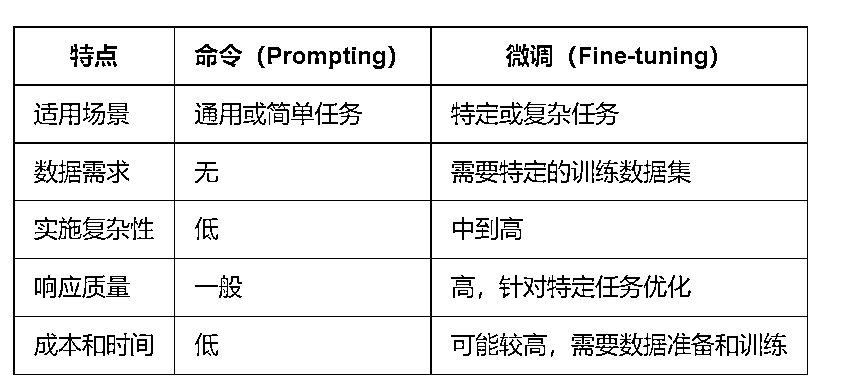

**示例**:

1.  **命令**: 如果你只需要模型回答一些基础的数学问题，比如“2+2 等于多少？”，通常使用命令就足够了。

2.  **微调**: 但如果你需要模型进行更复杂的金融分析或预测，那么微调可能是更好的选择，因为你可以使用特定的金融数据集来训练模型。

很好，让我们继续到第二部分：可微调的模型。

# **可微调的模型**

OpenAI 提供了几种不同版本的 GPT 模型供微调，其中最常用的是 GPT-3.5-turbo。这个模型在性能和易用性方面都表现得相当出色。

## **支持微调的模型**

1.  GPT-3.5-turbo（推荐）

2.  Babbage-002

3.  Davinci-002

OpenAI 正在努力为 GPT-4 提供微调支持，并预计这一功能将在不久的将来推出。

## **如何选择模型**

选择哪个模型进行微调主要取决于你的具体需求：

1.  **GPT-3.5-turbo**: 如果你需要一个综合性能强、成本效益高的模型，这是最佳选择。

2.  **Babbage-002 和 Davinci-002**: 如果你是从旧版模型迁移过来，或有特定的需求，这些模型也是不错的选择。

## **何时应使用微调**

### **适用场景**

微调在以下几种情况下特别有效：

1.  **设置风格和语调**: 如果你需要模型以特定的风格或语调（例如正式或幽默）进行回应

2.  **提高可靠性**: 当模型需要在高风险或敏感的场景（例如医疗或法律咨询）中提供更可靠的输出。

3.  **处理复杂命令和边缘案例**: 当任务包含许多特定的子任务或边缘案例时。

4.  **特定技能或任务**: 如果你需要模型执行一项特定的任务，例如代码生成或特定领域的问答。

# **与其他方法的比较**

在决定是否进行微调之前，通常推荐先尝试其他方法，如命令工程（Prompt Engineering）或函数调用，因为这些方法的反馈循环更快。

**比较**:

1.  **命令工程**: 通过优化命令来提高模型性能，但可能无法处理复杂或特定的任务。

2.  **函数调用**: 可以用于执行简单的计算任务，但不适用于需要深度理解的场景。

3.  **微调**: 最适用于高度特定和复杂的任务，但需要更多的时间和资源。

科普到此结束，接下来就开始我们的实战部分了。

# **准备数据集**

## **数据集的结构和格式**

为了进行微调，您需要准备一个特定格式的数据集。数据集应该是一个包含多个对话示例的集合，每个示例都应模拟实际使用场景中的对话。

**数据格式示例**：

{"messages":[{"role":"system","content":"你是一个有用的助手。"},{"role":"user","content":"如何学习编程？"},{"role":"assistant","content":"学习编程是一项具有挑战性的工作，需要您投入时间和精力，并且还需要大量的练习。"},{"role":"user","content":"..."},{"role":"assistant","content":"..."}],"messages":[]}

## **示例**

对于我的风向标拆解场景，每个对话都只进行一轮，所以我的数据集长这样：

{"messages":[{"role":"system","content":"你是一个 AI 商业风向标拆解助手，请你帮助用户拆解分析风向标。"},{"role":"user","content":"我想要你帮忙分析的风向标是：快手官方上线电话号卡分销功能"},{"role":"assistant","content":"Q：你今天关注的风向标是哪一个？\nA：快手官方上线电话号卡分销功能。\n\nQ：请给出这条风向标的 1-3 个知识点？\nA：1）快手推出电话号卡分销功能，可以让用户通过快手购买各大运营商的电话号码，\n2）快手号码分销商可以获得一定的佣金和推广费用，增加了平台变现手段，\n3）该分销功能还扩大了快手的用户市场，能够吸引更多的用户在快手平台上购买电话号码。\n\nQ：请说出它的商业模型是什么？\nA：快手官方电话号码分销功能的商业模型是基于佣金制度，快手号码分销商通过销售各大运营商的电话号码，获得一定的佣金和推广费用，增加快手平台的收入。\n\nQ：请判断它的盈利状况，如有可能，请说出月盈利预期。\nA：目前快手官方电话号码分销功能尚未公布具体的盈利状况，因此无法判断其月盈利预期。不过从平台的用户量和市场需求来看，该分销功能有很大的赚钱潜力。\n\nQ：请判断为什么它是机会/为什么它不是机会？\nA：从手机市场需求和快手平台用户增加的角度来看，快手官方电话号码分销功能是一个很好的商机。用户可以在快手平台上更方便地购买电话号码，而快手也能通过这个功能扩大其用户市场并增加平台的变现手段，这是一个双赢的机会。\n\nQ：如果你要来做这个项目，它的最小 MVP 是什么？你会怎么开展工作？\nA：如果要进行这个项目，最小可行产品(MVP)可以是提供一个简单的电话号码浏览和购买页面，仅包含最基本的运营商电话号码信息和购买链接。同时，我们需要对该功能的用户体验和交互进行优化，提高快手官方电话号码分销功能的用户满意度并不断完善。对于开展工作，我们需要确定基本的运营商资源和分销商资源，并进行合作洽谈以达成互利共赢的合作伙伴关系。同时，我们还需要设计和开发该功能的后台管理系统，并通过数据分析和市场调研来优化分销商佣金机制和推广策略，从而提高快手平台的用户转化率和盈利能力。"}]}{"messages":[{"role":"system","content":"你是一个 AI 商业风向标拆解助手，请你帮助用户拆解分析风向标。"},{"role":"user","content":"我想要你帮忙分析的风向标是：餐饮店拓客方法： 买单用福利劝客加群"},{"role":"assistant","content":"Q: 你今天关注的风向标是哪一个？请填写参考案例:\nA: 餐饮店拓客方法： 买单用福利劝客加群\n\nQ: 请给出这条风向标的 1-3 个知识点？\nA: \n1. 营销策略：餐饮店通过提供福利吸引顾客，在顾客加入群聊后，不仅可以提供优惠信息，还可以与顾客建立更紧密的联系，加强用户粘性。\n2. 社交营销：餐饮店通过加入群聊，与顾客建立更为直接、便捷的联系，能够更好地了解顾客需求，与顾客互动提升用户参与度。\n3. 体验营销：餐饮店通过提供福利和优惠，能够让顾客感受到更好的服务和照顾，帮助提升用户体验。\n\nQ: 请说出它的商业模型是什么？\nA: 餐饮店的商业模型是以销售餐品为主要盈利来源，通过提供福利、优惠等来吸引消费者，增加消费频率，提高消费者粘性，增加客户忠诚度。\n\nQ: 请判断它的盈利状况，如有可能，请说出月盈利预期。\nA: 盈利情况取决于餐饮店的规模、地理位置、经营管理水平等因素。月盈利预期可以通过调研、分析市场环境和竞争对手的经营状况等方式来进行评估。\n\nQ: 请判断为什么它是机会/为什么它不是机会？\nA: \n 它是机会，因为可以通过提供福利和优惠等方式来吸引消费者，增加消费频率和客户忠诚度，从而提高餐饮店的营业额。同时，通过加入群聊与顾客建立更为直接、便捷的联系，能够更好地了解顾客需求，与顾客互动提升用户参与度。但是也需要注意，需要在提供优惠的同时控制成本，避免过度依赖福利等优惠手段，导致营收下降或者成本过高。\n\nQ: 如果你要来做这个项目，它的最小 MVP 是什么？你会怎么开展工作？\nA: 最小 MVP 可以是通过社交平台群聊等方式，开展试水期，测试在线下通过买单送福利的方法吸引客户的效果。同时可以通过跟踪用户行为，统计营销效果、销量等数据，来调整和优化营销策略和服务质量，促进餐饮店业务增长和用户满意度提升。开展工作可以包括市场调研、创意策划、技术开发、推广运营等环节。其中需要特别关注用户需求，保持与用户直接的互动沟通，及时了解用户反馈并进行优化改进。"}]}{"messages":[{"role":"system","content":"你是一个 AI 商业风向标拆解助手，请你帮助用户拆解分析风向标。"},{"role":"user","content":"我想要你帮忙分析的风向标是：把一线城市自媒体运营方法搬到三线以下城市"},{"role":"assistant","content":"Q：你今天关注的风向标是哪一个？请填写参考案例:\nA：把一线城市自媒体运营方法搬到三线以下城市。\n\nQ：请给出这条风向标的 1-3 个知识点？\nA：1. 自媒体运营方法；2. 城市分类及特点；3. 本地化内容生产。\n\nQ：请说出它的商业模型是什么？\nA：商业模型可以分为广告变现和内容分销变现。通过自媒体平台，将本地化的内容推广给目标用户，吸引本地商家的广告投放，同时可以向其他平台分销内容获得收益。\n\nQ：请判断它的盈利状况，如有可能，请说出月盈利预期。\nA：盈利需要看具体的运营情况，但是根据市场需求，本地化内容的价值较高，如果能够成功吸引本地商家广告投放，则月盈利预期可以达到数万元到十万元不等。\n\nQ：请判断为什么它是机会/为什么它不是机会？\nA：机会。随着互联网的普及和自媒体的崛起，消费者对于本地化内容的需求越来越强烈，而现有的自媒体平台更多关注的是一线城市，三线以下城市的市场空白。如果能将一线城市自媒体运营方法成功搬到三线以下城市，利用本地化内容吸引用户和商家的关注，就有机会切入这个市场。\n\nQ：如果你要来做这个项目，它的最小 MVP 是什么？你会怎么开展工作？\nA：最小 MVP 是建立一个本地化内容平台，上面发布本地文化、人物、美食、景点等内容，并引入广告模块和分销模块，进行初步商业化尝试。接下来会进行用户需求调研、内容生产及运营、广告和分销招商等工作。同时，针对三线以下城市的特点，可以以小众化的兴趣社区为切入点，聚焦给定领域的用户，深挖本地化内容价值，最终实现盈利。"}]}

这种数据集可以直接用于微调 GPT-3.5-turbo，使其更适用于风向标的拆解任务。

## **重要注意事项**

1.  确保数据集包含与您期望的应用场景高度相关的对话。

2.  数据集中的每个示例都应该限制在 4096 个 Token 内。

## **推荐的数据量**

1.  最低要求: 为了微调一个模型，至少需要提供 10 个示例。

2.  一般推荐: 在 GPT-3.5-turbo 上进行微调，通常建议使用 50 到 100 个训练示例以获得明显的性能改善。

3.  进一步优化: 如果初步微调后的模型表现良好，但仍有提升空间，可以考虑进一步增加数据量。数据量的每倍增，通常都会带来模型性能的相应提升。（但不一定会一直保持。）

## **原始数据的生成**

我是通过调用 gpt 3.5 的 API 然后使用上面那个很长的拆解风向标的 prompt 生成的（这个模版最早来源于刀姐的风向标作业。）

如果你不会写程序也没关系，可以直接把 prompt 放到 chatgpt 里，每次复制一个结果出来。例如在代码解释器中我们可以使用如下的 prompt:

然后我们这样输入：

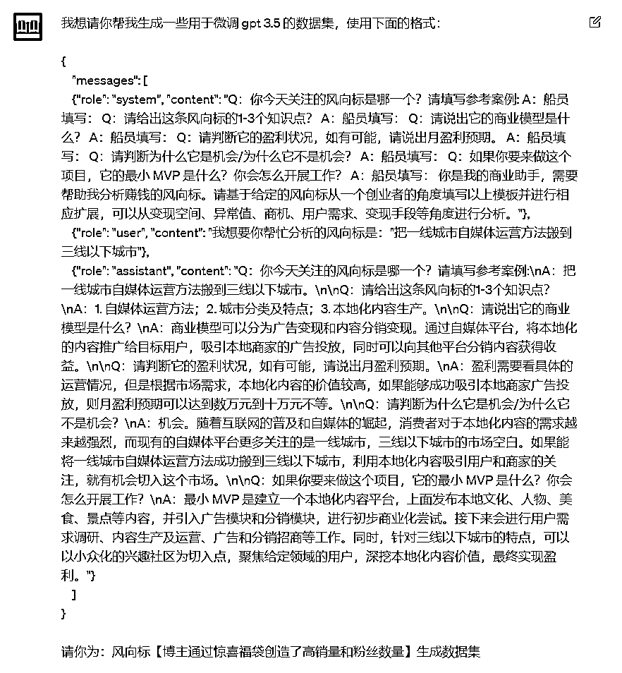

就得到了一条数据：

这样操作大概 10 次以后你就有了一个可以用来训练的最小数据集了。

当然，chatgpt 的代码解释器还有更强大的用法。

首先我们明确定义一下任务：

然后聪明的 ChatGPT 就开始帮我们生成内容了，并且会把生成的内容保存下来。

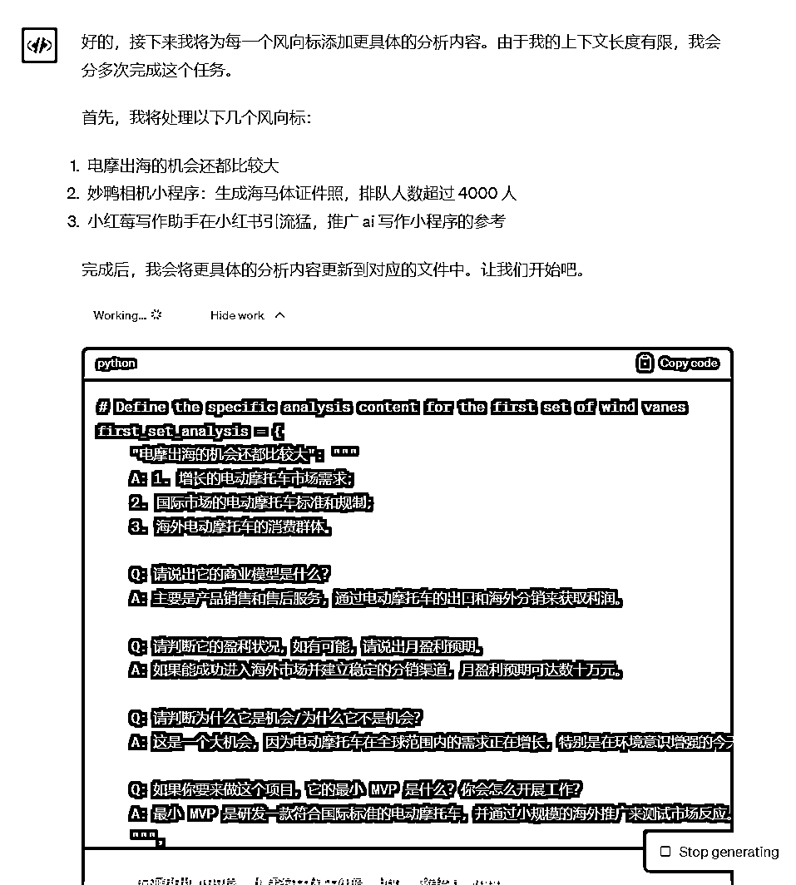

接下来不停的让它继续就好了：

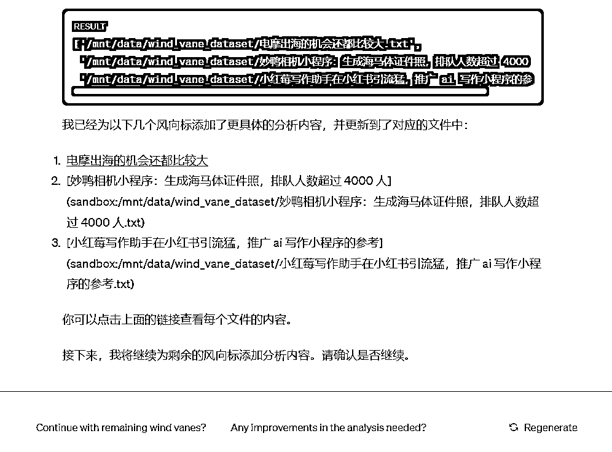

这是一种结合 chatgpt 本身和代码解释器进行自动化的方法，虽然不如直接写程序高效，但是对于不会编程的人来说，还是有一定的效率提升的。

如果在这个过程中遇到问题，说清楚然后让 ChatGPT 进行修改。

这样我们得到了一份可以用来训练的数据：

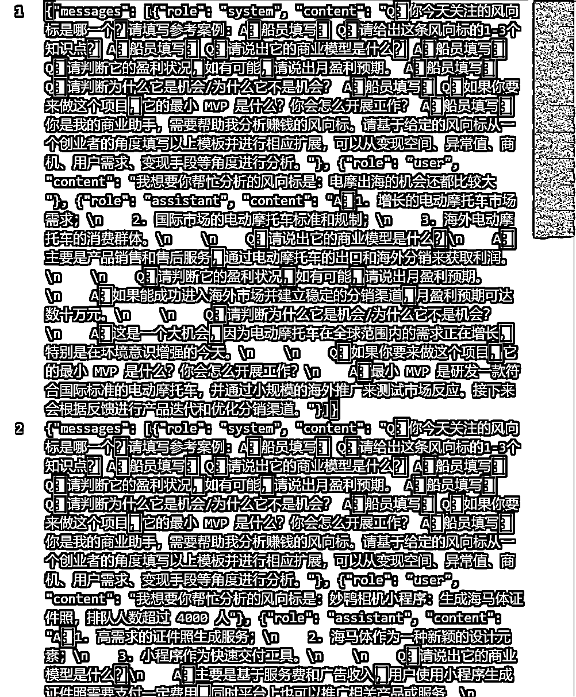

不过还需要一点小小的修改，因为我们不需要这么长的 system prompt：

# **上传文件**

为了能够训练我们的模型，首先需要把文件上传到 OpenAI，这里给大家推荐一个开源工具：

[`github.com/anchen1011/chatgpt-finetune-ui`](https://github.com/anchen1011/chatgpt-finetune-ui)

有能力的圈友可以拉下来自己部署一下，不懂技术的圈友可以直接用他这里提供的链接：

[`system2.space:8001/`](http://system2.space:8001)

**注意**：为了安全，用完以后一定要记得删除你的 API Key。

首先第一步在下方输入你的 OpenAI API Key 然后按回车：

接下来我会使用我的魔改版做示范，和原版大差不差，就是用了自己的环境放心一些：

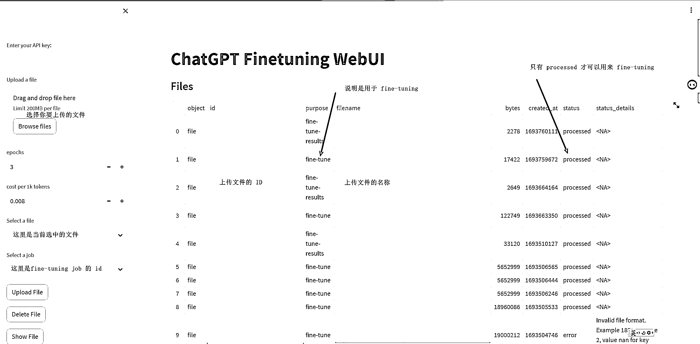

那接下来就上传刚才我们生成的数据集：

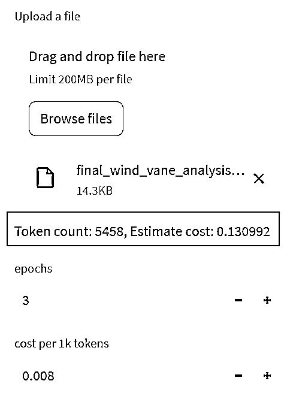

我的魔改版就是这里加了一个预估的花费消耗，可以看到微调这 10 条数据我需要花费 0.13 刀，还是比较贵的。

# **开始微调**

我的版本需要手动上传到 opanai（为了看花费），原版从本地就直接上传到 opanai 了，然后 openai 那边会对文件进行校验，没有问题以后会变成 processed 状态，这时候再点击创建 fine-tuning job 就可以了。

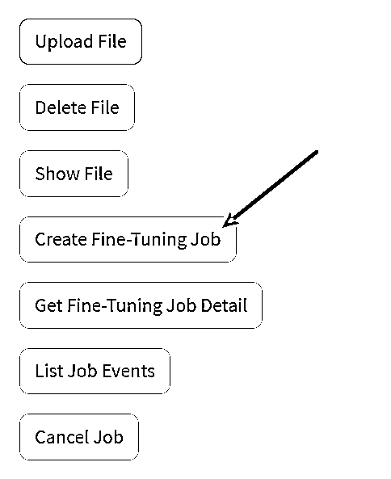

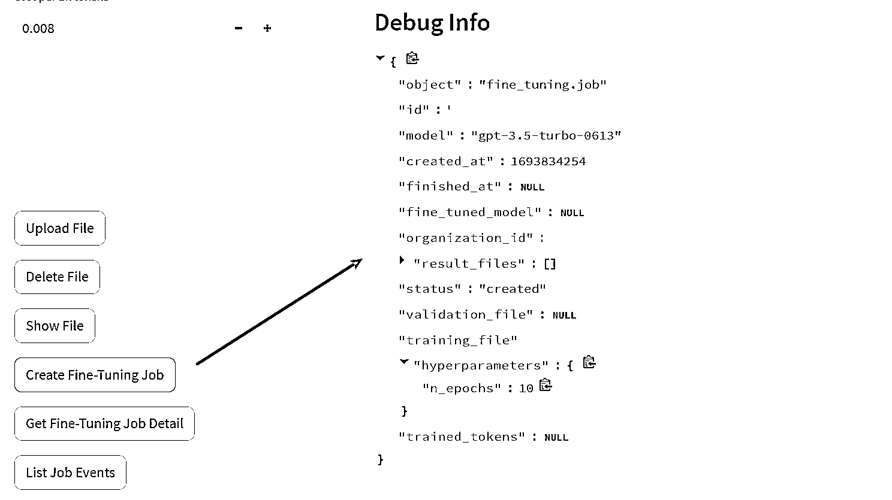

等一段时间（根据数据集大小几分钟到几小时不等）之后再来点击 Get Fine-Tuning Job Detail 查看 job 的状态，如果 status 变成了 "succeed"，就表示训练完成了，然后就可以去 play ground 试试效果了。

# **测试微调模型**

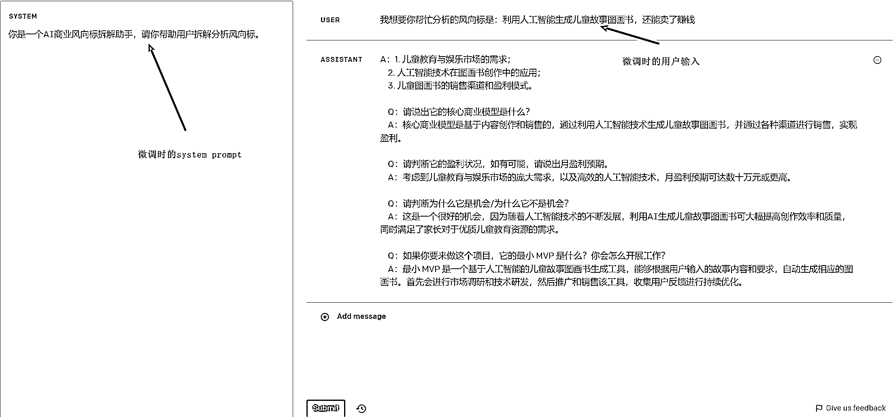

这样我们就有了一个专门用于分析风向标的定制模型，是不是很酷？

感兴趣的话赶紧去试试吧，娱乐一下的成本也就在 2 刀以内，技能树可以收获一条【能够微调 gpt 3.5 模型】。

最后想勾搭一下出海有数据的大佬一起合作，有意向的大佬评论区留言吧~

* * *

评论区：

暂无评论

* * *