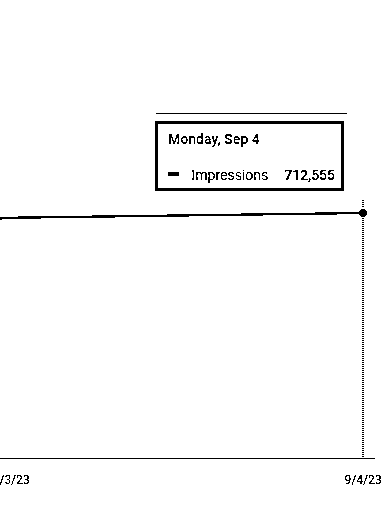

# 谷歌 SEO 独立站从 0-1 营销方案必备

> 原文：[`www.yuque.com/for_lazy/thfiu8/smgy6dzco18x8pqz`](https://www.yuque.com/for_lazy/thfiu8/smgy6dzco18x8pqz)

## (22 赞)谷歌 SEO 独立站从 0-1 营销方案必备

作者： 刺客-谷歌 SEO

日期：2023-09-11

在独立站这方面有积攒一些经验，看到很多朋友都想出海获得流量，今天就和大家分享一下，希望对大家有帮助。

网站日均曝光

**第一步：目标和关键词研究**

1.1 定义您的网站的主要目标：是增加销售、提高知名度还是其他目标？

1.2 进行关键词研究：确定与您的业务相关的关键词和短语。使用工具如 Google Keyword Planner 或 SEMrush 来帮助您找到潜在的关键词。

1.3 竞争分析：分析竞争对手的关键词策略，了解他们的成功之处。

**第二步：网站结构和内容优化**

2.1 网站结构优化：确保网站具有清晰的层次结构，易于导航，并使用友好的 URL。

2.2 内容优化：创建高质量、有价值的内容，满足用户需求。确保您的内容包括目标关键词，但不要过度堆砌关键词。

2.3 图片和多媒体优化：优化图像和多媒体文件以提高页面加载速度，并为搜索引擎提供相关信息。

**第三步：技术优化**

3.1 网站速度优化：确保您的网站快速加载，可以通过压缩图像、减少 HTTP 请求等方式来实现。

3.2 移动友好性：确保您的网站在移动设备上具有良好的用户体验，采用响应式设计。

3.3 网站安全性：保护您的网站免受恶意攻击，使用 HTTPS 协议并定期更新安全补丁。

3.4 技术标签和元数据优化：确保每个页面都具有正确的标题标签、描述标签和头部标签。

**第四步：链接建设**

4.1 内部链接：创建内部链接结构，使用户能够轻松导航并发现更多相关内容。

4.2 外部链接：寻找高质量的外部链接机会，与相关网站建立合作关系，提高您的网站的权威性。

**第五步：社交媒体和内容营销**

5.1 社交媒体策略：积极参与社交媒体平台，分享您的内容，并与潜在客户互动。

5.2 内容营销：定期发布有价值的内容，包括博客文章、视频、白皮书等，以吸引新访客并维持现有受众的兴趣。

**第六步：监测和分析**

6.1 使用 Google Analytics 等工具来跟踪网站流量、关键词排名和转化率等指标。

6.2 根据数据进行优化：根据分析结果调整您的策略，找出哪些策略有效，哪些需要改进。

6.3 定期报告：制定定期的 SEO 报告，以便您可以跟踪进展并进行必要的调整。

如果大家有问题欢迎随时交流。

* * *

评论区：

三林 : 用 gpt 写的文章吗[呲牙]
刺客-谷歌 SEO : 大佬就是眼尖，文章是 GPT 根据我的提示写的，流量截图是真的

* * *