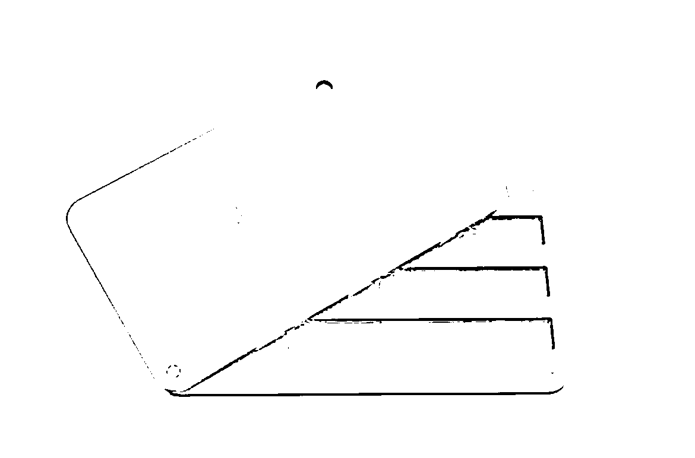

# 如何在 Web3 领域赚钱

> 原文：[`www.yuque.com/for_lazy/thfiu8/mx3ddnighnzzf5mn`](https://www.yuque.com/for_lazy/thfiu8/mx3ddnighnzzf5mn)

## (精华帖)(47 赞)如何在 Web3 领域赚钱

作者： Keegan 小钢

日期：2023-10-07

**我的故事**

我最早了解到比特币是在 2013 年，当时只是简单研究了一番，就看好比特币了。本来想买一些，但是，当时的那些数字货币交易平台很多都不靠谱，而且那时候不懂得如何自己创建钱包进行离线存储比特币，最终就没有下手。

直到 2017 年，比特币才再次进入我的视野。当时，比特币价格在一个星期内，从 5000 RMB 涨到了 10000 RMB。那时候，我开始深入研究其背后的原理，即区块链。我主要通读了几本书：

1.  《区块链: 新经济蓝图及导读》：同事推荐的一本书，讲到了区块链 1.0、2.0、3.0，帮助我从宏观上了解区块链。

2.  《区块链: 技术驱动金融》：从技术层面逐步解释了比特币是如何运作的。

3.  《区块链技术指南》：更加深入技术底层的书，还讲到了智能合约和超级账本，作为上一本书的补充。

4.  《区块链革命: 比特币底层技术如何改变货币、商业和世界》：全景式描述了区块链理论及应用，这是为了扩大视野的书。

学完之后，我就坚信区块链会改变世界。**从本质上来说，区块链所带来的革命是会改变社会的生产关系**。之后我就开始 all in 区块链了，即现在的 Web3。

那到目前为止，我在 Web3 行业已经深耕了 7 年多。在 Web3 技术圈里也算是个小 KOL，圈里有不少人看过我写的 Web3 技术文章，比如《[万字长文聊聊 Web3 的组成架构](https://mirror.xyz/keeganlee.eth/ij2xzk2dPBc5lDqjFJG_dNcw7IChf-MFUexwaKOq9xs)》。当下算是半自由职业，和几个项目方建立了长期合作关系，主要提供技术研发服务和研发团队管理。也开设了付费课程，指导 Web3 新人学习 Web3 技术。也在筹备新的课程体系，以及在考虑是否开设新的社群，比如 Web3 生财社群。

这多年以来，吃过一些甜头，比如曾在一个月内用 10 万本金赚到了 100 万。但也踩过不少坑，比如有多次资产归零的经历。而经过了多年的历练，不管是投资领域还是专业技术领域，都获得了显著的成长，使得我可以在多个不同的领域都具备了赚钱的能力。

下面，根据我多年来的经验所得，总结并分享下如何在 Web3 领域赚钱。

## **从安全开始**

在 Web3 领域，最怕的不是赚不到钱，而是赚到钱之后，因为缺乏安全意识，赚到的钱连本带利突然全没了。

有多种可能会让你的钱突然不见。比如，交易所倒闭、钱包助记词或私钥泄露、参与的 DeFi/GameFi 等项目被黑客盗币，以及遇上骗子。

很多人为了方便都会把资产放在中心化的交易所里，比如 Binance、OKX、Coinbase、Bybit、Bitget 等。但是，就连曾经是全球第二大的交易所 FTX 都会突然倒闭，中心化交易所的安全性绝对是存疑的，就算是全球第一大所 Binance，谁也无法保证一定不会出现黑天鹅。因此，我不会在交易所里长期存放太多资产。

大部分时候，我的资产会直接存放在数字钱包里。平时的交易，也经常直接使用 Uniswap 等去中心化交易所来完成，既方便也安全。而且，钱包不会只有一个，会分散存放到多个不同钱包，包括硬件钱包。大部分资产存放在硬件钱包里相对是最安全的。硬件钱包只用知名的品牌，比如 Ledger、Trezor、OneKey，且一定需是从官方渠道购买，否则难以保证安全。

钱包助记词和私钥一定要离线存储。有些人觉得离线存储不方便，会将助记词或私钥存储在云端，这其实非常不安全。亦仁就曾经把助记词写到云笔记，导致私钥泄露丢失了价值八位数的比特币。现在也有助记词钢板，防水防火防腐蚀，就比如下面这个：

另外，做开发的，还经常会使用到测试网。很多开发人员使用测试网和主网都会用同一个钱包，这其实也是有很大风险。曾经我有一位同事，就是测试网和主网都用同一个钱包，后来用这个钱包在主网接收公司的一笔转账，结果一转账币就被盗走了，记得好像有几十个 ETH 之多呢。我自己也是踩过同样的坑，还好我当时转账的只是很小额。

还有，我一般并不追风新项目。比如，很多人会热衷于薅羊毛追空投，但我觉得会费时费力又费钱，且有时候会被反薅，吃力不讨好。另外，知名新项目更容易成为黑客目标，知名项目被盗的新闻比比皆是。所以，就算要参与，小范围小资金参与一下就好了。

## **全职打工**

加入一家 Web3 公司，以全职打工的方式，赚取劳动性收入，是最普遍的一种。

在上一轮牛市中，Web3 行业的人才薪资水平普遍高于其他行业，所以吸引了很多人涌入。而且，因为 Web3 行业还处于起步发展阶段，对各种人才的需求缺口很大，所以就业机会也多。

只是这两年因为熊市，全球不管是哪个行业都不太景气，Web3 也不例外。另外，Web3 发展至今，要求具备的很多知识和技能，与以往的 Web2 有较大差异，进入门槛已经不小，所以想进入该领域的人员大多都还需要学习一段时间才有可能得到就业机会。

比如，做技术开发的，最热门的岗位之一就是智能合约工程师。而要成为一名合格的智能合约工程师，除了需要学会用 Solidity 开发智能合约，也要懂得使用 Hardhat 框架进行测试和部署，还要熟悉开发和部署 Subgraph，还有预言机和 Keeper 也要了解，以及各种标准的 token 协议如 ERC20、ERC721、ERC1155 等也要熟悉，然后也要熟悉一些最常用的知名项目，比如 Uniswap、Compound 等。这里面有些名词，外行人甚至可能连听都没听过，而这些都是需要学习的东西。

虽然现在是熊市，但其实对于想进入 Web3 行业的新人来说，反而是机会。刚好可以趁着熊市抓紧时间学习，做一个有准备的人，学而有成之后，等牛市来临，很多 Web3 公司再次招人之际，相比于那些没有准备的新人就很有竞争力了。

## **开设技术课程**

Web3 的技术人员还可以通过开设技术课程进行赚钱。因为我本身是做技术的，有了多年的技术积累，而且我还是个自媒体，有一些用户基础，所以开设技术课程也就能赚到钱。如果你没有用户基础，也可以找其他有用户基础的大佬一起合作，也可以找我合作。也不一定需要找像我一样有 Web3 技术背景的，只要有目标用户基础，而且可以帮助你推广课程的，都可以合作。

我目前还只开设了一门课程，录播视频课程，所面向的用户群体主要是想从 Web2 转入 Web3 或初入 Web3 的研发人员。课程的内容范围主要聚焦于兼容 **EVM** 链的 **DApp** 开发，即应用层的开发，而非链底层的开发。课程内容主要分为了 10 节课，这 10 节课的内容大纲如下：

1.  **Web3 基础概况**：介绍了什么是 Web3、Web3 的组成架构、Web3 的现状和趋势、Dapp 的技术架构等。

2.  **智能合约技术和语言基础**：钱包基础、EVM 基本原理、Solidity 语言基础等。

3.  **智能合约开发、测试和部署**：Infura、Alchemy、Etherscan 等基础工具的使用，以及如何用 Remix & Hardhat 开发、测试和部署合约等。

4.  **标准 Token 协议**：介绍了 ERC20、ERC721、ERC1155、SBT、ERC3525 等。

5.  **价格预言机和 Keeper**：价格预言机和 Keeper 服务的基础知识，Chainlink、Uniswap TWAP 价格预言机，如何用 Golang 实现 Keeper 服务等。

6.  **数据索引服务 Graph**：介绍链上数据索引服务 Graph，以及如何开发和部署 Subgraph。

7.  **前端 Web3 框架**：介绍了 MetaMask API、ethers、wagmi 等几个前端框架和代码示例。

8.  **剖析 Uniswap 协议**：剖析了 Uniswap 的代码和机制，包括 UniswapV1、UniswapV2、UniswapV3。

9.  **剖析 Compound 协议**：剖析了 Compound 的代码和机制，包括借贷模型、利率模型、利息计算、清算机制和清算机器人的实现思路等。

10.  **详解实战项目**：通过组合了 UniswapV2 和 Compound 实现杠杆借贷交易的项目，串联起整个 DApp 技术栈。

从内容大纲就可以看出，这套课程其实是做 DApp 开发的全栈课程。之后，基于这套课程，且受邀于出版社，我开始写书。但目前还没写完，且因为目前还处于熊市中，Web3 的热度不再，书籍出版的计划延后了。但我计划写完书稿后就准备开始录制第二期的这套课程。

另外，也有计划开设高阶课程，到时候会和其他技术大佬一起合作，目前还在规划中。

技术人员开设技术课程，有一点很关键，那就是行动力。很多人会犹豫，觉得自己的课程还不够完善，或有些东西还没有准备好，迟迟不敢开始。其实，只要时机对了，立即行动很重要。至于还没准备好的内容，在这个过程中会倒逼你去完善的。

## **接技术外包**

有 Web3 技术的人员，有时候也可以接一些 Web3 的技术外包工作。Web3 的前端开发、智能合约开发，以及测试人员，是最缺的几类人才，尤其是在牛市中，有很多新项目都急需人才，但很多新项目因为没有强大的背书，招优秀的全职人员并不容易，且考虑到成本问题，所以可能更倾向于找优秀的兼职人员先把产品研发出来。

也有一些项目方，本身缺乏 Web3 研发团队，也需要找一些技术团队，全套系统都外包。所以，如果可以和不同的研发人员合作，组建成一个研发团队，就可以接这些更大的项目。

从个人维度来说，单纯接外包并不是一件复利的事情，所以不建议什么外包项目都接。

比如我自己，我是曾经自己写过一系列剖析 Compound 的文章，对 Compound 非常熟悉。之后有项目方找我 fork 一套 Compound，包括智能合约、Subgraph 和清算服务程序，只是稍作一些小的调整。像这种对我来说就是复利的事情，因为我已经有一套成熟的模板，只需要花较少时间和精力做一些调整就可以交付给客户。所以我后来接了好几个这类外包项目。

从另一方面来说，我还可以从我的课程学员中，挑选出一些优秀的学员来组成团队，接系统性的外包项目来做。我只需要统筹管理好整个项目的研发，而学员们则可以从实战项目中进一步提升自己的能力，而且还能赚钱。

另外，如果是一份可以长期合作的外包工作，除了赚取额外收入之外，还可以从项目中提升自己能力的话，也是很值得接受的。我的前东家所在的项目组，就有两个外部的兼职技术人员是长期合作的。

## **当项目方顾问**

资深技术人才，有机会还可以和一些项目方建立长期合作关系，承担技术顾问或类似角色的身份，除了每个月固定的顾问费用，还可以占有一定比例的股份和币权，本质上也等同于和这些项目方一起创业。目前我的固定收入主要也是来自于这一块。

当技术顾问，一定要拿一些股份或币权，不然的话，其实就和打工没有区别。本质上，是和项目方一起合伙创业，所以也要有创业心态，要懂得评估项目的未来前景。而且，一定要尽快把股份和币权落实到合同里，不然等发展起来了就容易扯皮。

当然，不是技术人才，但在其他方面有自己的优势的，比如擅长运营，或擅长金融产品设计，或有其他项目方需要的资源，也都可以有机会担任顾问。我的前东家就有一位金融顾问，初期的金融产品模式设计就是他主导的。

因为 Web3 领域，很多团队都是由分布式的成员组成的，人员普遍是远程办公，且商业模式也和 Web2 的公司不同，因此，很多优秀的个体就有了更多机会，可以同时参与多个不同的项目。这是一个个体崛起的时代。

## **低风险投资**

有一些低风险的投资机会，在大部分时候都很适合参与。比如在当前的熊市中，或存在一些闲置资产短期或长期内不需要使用时，都可以参与到一些安全稳定的低风险 DeFi 产品中去赚取收益。这些低风险投资机会主要就是参与各种流动性挖矿。

比如，我最近就参与到借贷协议 Aave 中，通过 Supply 稳定币来赚取利息收益。Aave 中资金使用率最高的为 USDC，存款 APR（年化率）通常为 2%-5% 之间，最高时达到 10% 多。

也可以参与到另一个借贷协议 Compound 中，同样通过 Supply 稳定币来赚取利息收益，同时还能赚取协议代币 COMP。Compound 中的 USDC 存款 APR 通常会稳定在 3% 左右。另外，存款挖矿 COMP 的 APR 通常为 1.5% 左右。所以，两者加起来的 APR 平均为 4% 多，还是不错的。

今年 5 月，MakerDAO 的借贷协议 Spark Protocol 上线了，目前存稳定币 DAI 的存款利率达到了 5%，也是个很不错的投资机会。但因为这个借贷协议比较新，所以建议投入不要太多。

除了参与 Compound、Aave、MakerDAO 这些知名的借贷协议，也可以参与头部 DEX 的流动性挖矿，比如 Uniswap、SushiSwap、Curve 等，通过往这些 DEX 中注入流动性成为 LP（流动性提供商），就可以赚取用户交易手续费的分成。

参与 DEX 成为 LP，建议挑选交易量足够大的池子，比如在 Uniswap 上，USDC/ETH 的池子就比 WBTC/ETH 的池子交易量大很多。虽然，影响 LP 收益率的因素比较多，但通常情况下，交易量越大的池子，收益率一般也越高。但参与 DEX 的 LP，会存在[无常损失](https://academy.binance.com/zh/articles/impermanent-loss-explained)（Impermanent Loss）。不过，需要注意的是，无常损失并不是资产亏损了，而是一种机会成本的损失：「我做了流动性一段时间后，我的代币数量变化后的总价值」VS「假设我没做流动性，代币持有放到现在的价值」。如果单纯计算添加流动性前后价值的话，其实是赚的。

因为无常损失的存在，想要提高收益率的话，那么，在价格大幅波动的情况下，直接持有代币相比投入去做流动性可能收益会更高。而在行情震荡时提供流动性则更合适，这样既赚了手续费又可以大幅度减低无常损失的可能。

另外，提供流动性能赚取交易手续费。持有流动性越久，赚取的手续费越多，也就能覆盖掉无常损失了。

不过，对于不了解 Web3 的新手来说，要参与这些低风险的投资机会，还有不少知识需要先学习，包括如何创建钱包，如何连接钱包，Gas 的概念，如何用法币购买数字货币，如何查看自己的数字资产等等。对于没接触过 Web3 的人来说，最好的方式就是请教那些已经熟悉 Web3 的老手。

## **价值投资**

有些人觉得数字货币没有实际价值，所以不存在价值投资，这其实是错误的偏见。比特币从 2009 年诞生至今已经 14 年有余，如果没有价值的话早归零了。但我这里不想展开讨论其是否有价值，或有什么本质价值，我主要想说的是如何进行长期的投资。

适合进行长期投资的，目前最稳妥的就是两种资产：BTC 和 ETH。其他的，谁都不敢百分百保证在 10 年后依然会屹立不倒。在过去的十几年中，多轮牛熊切换，基本已经被市场淘汰的数字资产数不胜数。不过，也还是有一些蓝筹代币值得投资的，都是一些细分赛道中的龙头项目。比如 DEX 的龙头 Uniswap 的代币 UNI，借贷龙头 Compound（COMP）和 Aave（AAVE），Layer2 的代表 Arbitrum（ARB）和 Optimism（OP）等。在新一轮牛市周期中，配置一些潜力大的蓝筹代币也是不错的选择。

我做价值投资的策略其实也简单，在熊市中进行定投囤币，然后在牛市中分批卖出。

这里先给大家介绍一个重要的指数，叫 [Bitcoin Ahr999 Index](https://www.coinglass.com/pro/i/ahr999)。当指数低于 0.45 的时候，就是相对底部的时候，可以放心抄底。但不建议把资金一次性全部抄完，最好分批次建仓，当每一次价格继续往下探底的时候再抄一点，减低整体的持仓成本。如果错过了低于 0.45 的时期，那在 0.45 - 1.20 的区间内，也可以进行定投，可以按天、按周进行定投。我有一个朋友，还专门自己写了个定投程序，按小时进行定投。

有了 Bitcoin Ahr999 Index，判断熊市的相对底部就很容易了。当然，如果是更有经验的分析师，再结合当前的宏观数据等，对相对底部的判断区间会更精确一些。不过，要判断牛市的相对顶部则没那么容易了，想要在绝对顶部逃顶则是更难。对于每一轮牛市顶部，不同分析师都会有不同的预期，但超过前一轮牛市的前高则是毋庸置疑的。比特币前一轮牛市的前高是 69000 美元，而很多人都认为下一轮牛市至少突破 10 万美元应该问题不大。操作上也可以很简单，和在熊市中分批次建仓一样，在牛市中也分批次止盈就好了。以预期的目标价为起点，每上涨一个阶段就出部分，比如每上涨到一个新高点就出剩下的一半仓位，这样就能保证大部分利润入袋为安，且在相对顶部也能吃到一些利润。

另外，在长时间持币的时候，持有的数字资产还可以存到 Compound、Aave 等平台赚取利息，这样，既可以持币待涨还可以有利息收入赚到更多币。

虽然这个价值投资策略很简单，但实际操作起来，可能很多人难以耐心地坚持持币不动，忍不住的人容易在波动期间各种瞎操作，把价值投资变成了投机，结果搞到最后，甚至没赚到钱反而亏了也是可能的。我曾经就是这样，因为贪心，想做些高抛低收，但总会出现岔子。

如果要配置多个不同资产的话，配置比例也很重要。比如我自己，在下一轮牛市中，我的资产配置主要分为三块，BTC 和 ETH 肯定是重仓，仓位至少 50% 以上。第二块主要会以 Layer2 为主，仓位大概为 30%。最后一块我会以分布式存储为主，仓位大概为 20%。

## **高风险投资**

高风险的投资就是加杠杆，做期货合约。玩这个，最大的风险就是一旦爆仓，你的保证金就归零了，我就曾经被爆仓过好多次。相应地，收益也可以很高，我就已经尝过了用 10 万块的本金，一个月后变成了 100 多万。不过这样的机会也不是一直都会有。

这块其实是非常考验交易经验和人性的，尤其是贪婪的人性，很容易栽跟头。我的多次被爆仓，都是因为没能控制住自己的贪婪。

加杠杆做合约这种高风险投资，就更需要控制好风险，才能持续赚到钱。对于我来说，我会遵守以下这些基本准则。

首先，要先清楚目标，做高风险投资的目的是为了赚取更多本金用来做价值投资和低风险投资，而不是靠它实现暴富。不要本末倒置，如果想着靠玩合约暴富，那绝对不要碰合约。另外，我玩合约还有一个目的是为了锻炼自己的盘感。练了几年之后，才终于具备了一点能力，才终于能将 10 万本金在一个月内变成 100 万。不过，为了这个目的，付出的成本也挺高的，交了不少学费。

其次，配仓上，建议 90% 或以上用于价值投资和低风险投资，最多拿 10% 用来玩加杠杆的高风险投资。这样，就算亏了这部分钱，也不会过于心疼。

然后，不要逆势而行。比如，当前大趋势是牛市，大方向是上涨的情况下，那就只做多不做空。相反，大趋势是熊市，大方向是下跌的情况下，则只做空不做多。

建仓时机很关键，如果是准备开多，一定要耐心等待下跌到达支撑位。如果目标价位没到，宁愿不建仓也不要去追涨，这点非常关键。另外，不要一次建仓就满仓，最少分三次建仓，可以分别在第一支撑位、第二支撑位和第三支撑位挂单，也可以按价格步长进行挂单，比如每往下 500 U 挂一单。而爆仓价尽量保持低位，至少不要低于当前价格的 20%，如果能低于当前价格的 50% 则更好。一般来说，在牛市期间，已经出现回调的情况下极低概率会再继续下跌超过 20%。但在大周期中，根据波浪理论，至少会有几次大回调，而大回调的幅度和高点相比是可能会超过 20% 的。所以，大回调期间，不要急于建仓，可以等跌到位之后再分批建仓。

之后，一旦行情上涨到了预期的压力位开始滞涨，就可以分批止盈了。也同样可以分三次止盈，每上涨一个压力位就止盈一次。然后，再次耐心等待下一次回调建仓的机会。

当完成阶段性目标之后，一定要将本金或盈利部分抽出，转去做低风险投资或价值投资。如此一来，才算真正实现了玩高风险投资的目的。

这样周而复始，其实就能实现低风险高收益的杠杆投资了。这种方法，最关键的就是要控制好爆仓价格在非常安全的点位。而且，一定要耐心等合适的建仓机会。最最重要的，绝对不要过于贪心，要及时止盈或止损。说白了，这就是一件简单但不容易的事。

#### **以上就是我所熟知的，已经经历过或在经历中的，在 Web3 领域赚钱的各种途径和方法。当然，还有很多其他赚钱路子，比如我还可以开设 Web3 生财社群，还可以将我的投资策略写成程序化的工具，然后开放给付费会员使用。还有些不是我熟知的，所以我无法都一一阐述。总而言之，Web3 其实充满了很多机会。**

* * *

评论区：

无忌 : 我对技术领域不是很熟悉，也是 17 年入坑，中间经历过暴富，也体验过归零。
币圈除了技术其他资源都有[捂脸]，有机会多交流
Keegan 小钢 : 我也同样经历过暴富和归零
木心 : 同样经历
Hope : ahr 指数只能是个参考
Keegan 小钢 : 没错，是个参考指数
亦仁 : 感谢分享，已加精华。
　　　　　　　　 : 如何看你的课程呢？
Keegan 小钢 : 是说我的 Web3 技术课程吗？目前主要通过微信，你可以加我微信：keegan704

* * *