# 后亚马逊时代，关注知识产权才能赢得更多利润

> 原文：[`www.yuque.com/for_lazy/thfiu8/qthcwq0i65c2g28y`](https://www.yuque.com/for_lazy/thfiu8/qthcwq0i65c2g28y)

## (27 赞)后亚马逊时代，关注知识产权才能赢得更多利润

作者： yoko 跨境打包工

日期：2023-10-10

亚马逊平台经历了三个发展阶段，从“占坑为王”的红利期，到打造团队和流程的标准化时代，再到后亚马逊时代注重知识产权和品牌的今天。

白热化的红海竞争环境，越来越短的新品“利润甜蜜期”，站在品牌的视角去入局亚马逊，又需要咋做呢？

今天就结合自己的经验跟大家聊一下，希望对各位圈友有所启发。

6 年前的 9 月，在亚马逊美国站开始上线第一条 listing，开始了我的跨境电商创业之旅。

回首这 6 年来的点点滴滴，我把自己从一个刚毕业的外贸 B2B 新手员工到外贸 B2C 跨境创业者的身份蜕变整理成这份小手抄报送给生财有术的朋友们，希望和更多立志于从事跨境电商创业的朋友们一起交流成长。

创业是勇敢者的游戏，所有的旅程都始于一颗不满足于现状的心；所有的风景都源于当初敢于出发的勇气。

创业又是“幸存者”的游戏，市场的机会总是和风险相伴相生。创业者需要收集行业中隐藏的散落资讯地图，运用自己的商业知识储备解读它们，找到机会入口，整合身边的一切资源拿到最大化的成果。

与此同时要把风险的敞口关到最小，保护好每个阶段的胜利果实。

我用时间的丝线，串起这 6 年来面对的亚马逊平台生态环境变迁，以及每个阶段自己的解读和创业实践呈现给大家。

# 2015-2018  “占坑为王”红利时期

用现在的视角看 2015-2018 年的亚马逊平台生态状况，说一句“捡钱的红利时代”一点也不过分。

那时候亚马逊没有所谓的精品和铺货之分，也没有精细化运营和优化供应链的说法，甚至几乎没有多少人知道如何打好站内广告。当初做亚马逊很简单，上架-发货-等着收钱。

本阶段破局核心能力指南：跑步入场，快速试错，反馈纠偏，跑通闭环，拿到结果。

2017 年夏天，我们开始筹备在亚马逊美国站销售 led 灯具产品。从 7 月开始到 9 月初第一条 listing 链接开始上线售卖，我们做了以下工作：

1.  注册公司；

2.  准备品牌，包括品牌名称，品牌 logo 设计，以及简短的品牌 Slogan；

3.  账号注册，注意安全干净的网络环境，一套账号对应一套资料；

4.  产品调研，主要是平台的竞品状况调研（包括价格，对方链接的评论数量，评论星级，对方产品的优缺点等）

5.  确认产品下单数量安排工厂生产；

6.  确认产品外包装，确认产品使用说明书；

7.  Listing 文案准备；

8.  产品拍图，产品 A+ 页面设计；

9.  物流准备发货；

10.  亚马逊上架；

11.  选定推广手段，邀请测评，QA 准备，开启广告 CPC；

12.  反馈纠偏：如果开启了自动广告，依然没有自然出单，则需要重新检查整个 listing 的图文质量，特别是 keyword 优质关键词，类目路径是否有错误。以下是亚马逊站内十大流量入口，一一检查 listing 链接是否都有占据了流量入口。

**本阶段个人成果：**

做出 5-8 条优秀的 listing 链接 ，团队 3 人，运营 2 个店铺，月利润 15-25w 元。其中美国站点占据了业绩的 90%。

2018 年的 2 月被邀请开通美国品牌的加拿大站点，同年加拿大站单站点全年盈利超过 80w 元。受加拿大站点的启发，我们开始布局美国站点之外的其他小站点，欧洲的西班牙，意大利站点虽然单量不多但是利润很不错。

建议想尝试新入局的朋友们，如果产品在美国站竞争太激烈可以去欧洲，加拿大等小站点尝试一下。

**本阶段的风险控制点：**

**各种黑科技“乱花渐欲迷人眼”时留一分清醒**

在亚马逊行业的红利期，各种赚快钱的声音充斥在行业内，衍生出的各种“黑科技”服务大行其道（包括但不限于首页无差评，关键词上首页，捡僵尸 listing，恶意跟卖，恶意变狗）。

此时，我们需要留一分清醒：如果这是一个长期事业，这种利用平台漏洞的短期行为必然会被平台“秋后算账”追责。以操作评论为例，轻则移除评论，重则关闭链接：

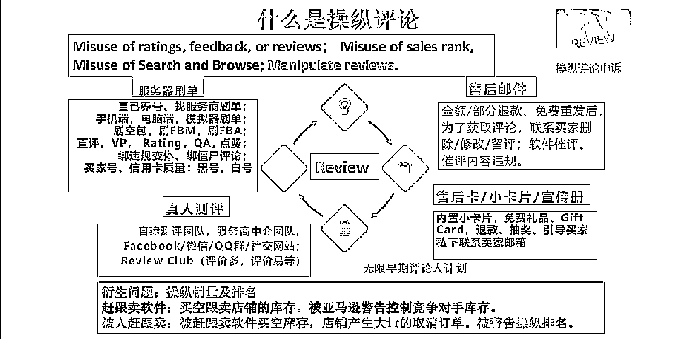

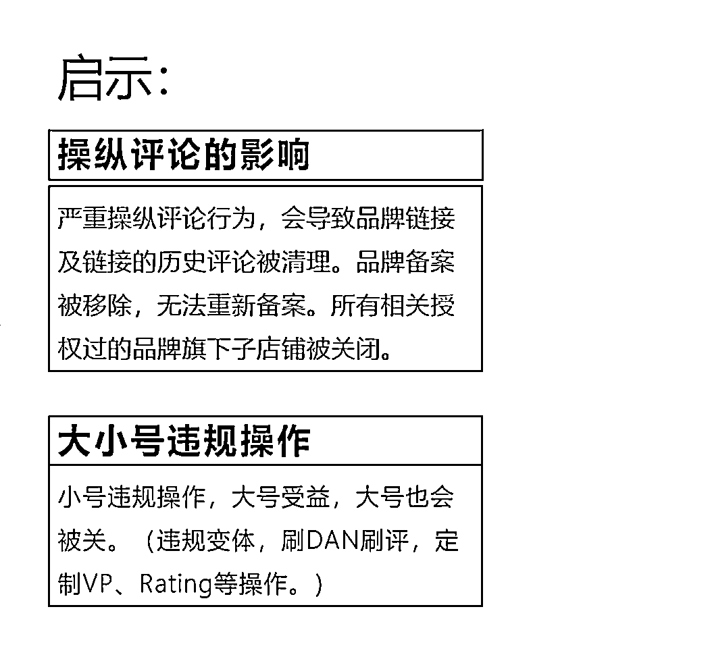

# **2019-2021 打造团队 SOP 标准化作业**

2019 年，随着“坂田五虎”“华南四少”的声名鹊起，还传闻跨境电商的从业者买光了深圳湾一号，所以越来越多的人注意到跨境电商这个行业，亚马逊平台涌入越来越多的入局者。

这时候平台竞争开始加剧，卖家模式也有了精品和铺货之分，初步有了供应链的概念，卖家也开始重视对广告的优化。

**本阶段核心能力指南：**

**规模复制，打造小团队 SOP；供应链谈判能力**

公司活下来后，需要招聘运营人员，培训运营知识，打造小团队管理流程。

下面介绍一下我们的站内广告人员的入职前三个月培训流程：

**培养周期表：**

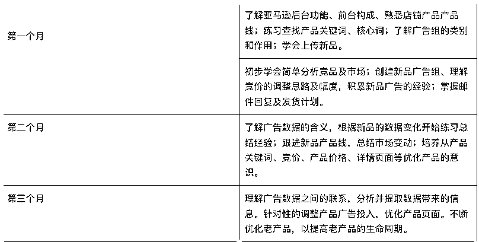

结束了试用期后，就是运营专员，我司的运营专员站内广告绩效考核标准如下：

**广告绩效考核标准：**

在提升期内，着重培养广告人员对广告数据的理解，通过分析产品，锻炼发现问题、归类问题、解决问题、总结经验的意识。

**本阶段风险控制点：**运营人员不稳定，刚培养好的运营流失，这时候需要制定合理有效的薪酬制度，把公司利益和员工收益深度绑定。我们在 2019 年把提成方式从之前的回款额提点改成利润提成方式，效果较佳。

**本阶段个人成果：**做出 4 个店铺，4 个品牌 团队人数，7 人，运营骨干年流失率 20% 以内；月均利润 50w 左右。

小团队管理推荐阅读书籍：《10 人以下小团队管理手册》

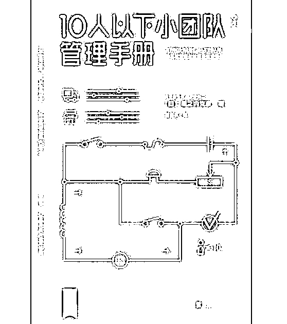

# **2021-2023 后亚马逊时代，知识产权和品牌的时代**

2021 年，是亚马逊行业的分水岭。一方面当“跨境电商”这个词再次登上两会，直接引爆了全国的跨境电商创业潮。2020 年口罩影响线上消费大增，亚马逊卖家们业绩普遍翻倍。

传闻华为的高管、海龟博士、军工企业的核心人才等等，前赴后继的加入亚马逊创业行列。竞争上升到白热化阶段，这时候大多数行业从业者有了研发的概念，开始深入供应链，也进入精细化运营的时代。

另一方面，平台“大卖封号潮”屡屡见诸新闻，卖家们如履薄冰，悲观的情绪蔓延开来。平台整顿预示红利期的正式结束，野蛮生长的粗放式运营模式再也行不通了。

白热化的红海竞争环境，越来越短的新品“利润甜蜜期”倒逼卖家们只能深入上游产品开发研发端去找利润。

下图是供大家参考的产品利润挖掘的思维导图。

**本阶段核心能力指南：**

**细分市场小蓝海利基产品的开发能力**

产品站内运营相对容易流程化，产品开发这项工作绝不是“速食主义”，对人的要求也更高。

如果你在一个细分产品赛道有一定的工作经验，了解其中的门道，能发现蓝海产品的机会缺口，那么亚马逊在线生意将是你可以考虑的一个创业平台。

如果你没有产品开发的经验，也许你可以从以下渠道着手产品的遴选。

通过以上渠道，建立自己的产品库，初步筛选出品类方向，每天记录一次，7 天复盘一次，长期出现在该榜单的产品重点关注。

然后对产品分类，需求分级，观察类目波动，品类更迭的方向，季节性因素的复盘，对品类横纵深挖。

**常见的产品开发流程：**

确定类目，根据策略确定产品线，调研数据，整理数据，分析数据，初选供应商，取样比对，样品定位，筛选供应商，确定供应商，优化产品，落地产品，录入产品资料，采购下单，跟进订单，订单出货，物流发货，上架售卖，复盘优化。

其中调研环节，我个人认为是最重要的一环。

产品数据调研包括确定类目，根据自己的资源情况（资金，供应商资源，资质等）结合目标站点的市场情况（ 市场容量，竞争，趋势，门槛）制定好自己的策略（产品功能的细分差异，特定使用人群，使用场景，淡旺季等）。

下面是选品的思维导图供参考：

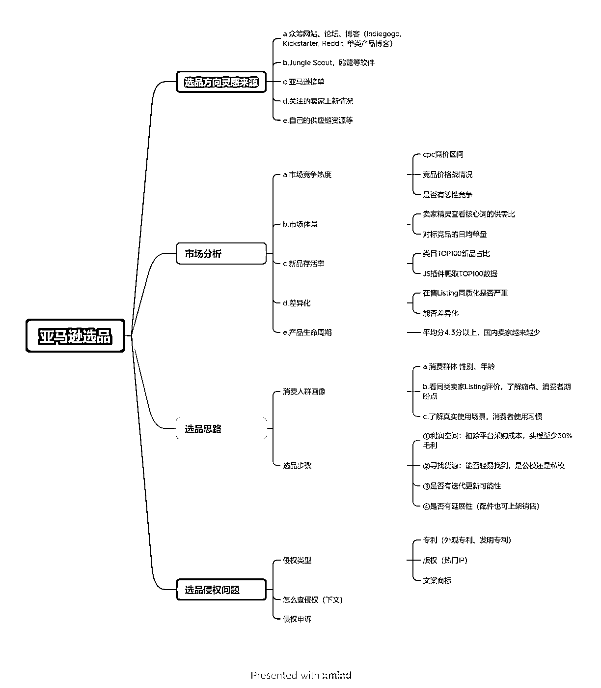

**利润甜蜜期产品案例：**

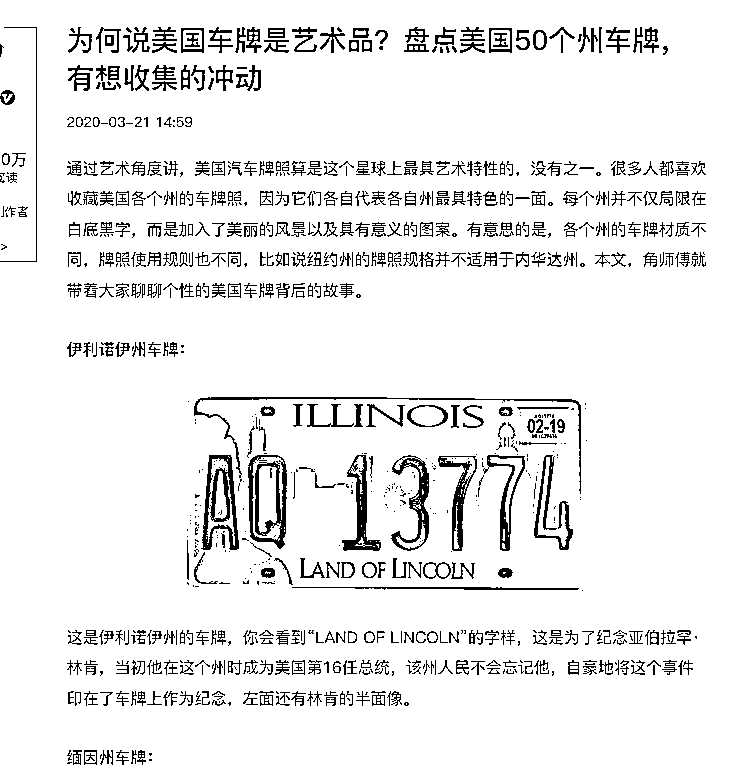

2021 年的时候我们做过一款特斯拉车牌支架。

美国的车牌文化很火。很多州规定外地车进入本地要在 30 天内换本地牌，有些州规定汽车需要挂 2 个车牌，前面一个，后面一个。

但是很多汽车只留了后面的车牌孔位，前面挂车牌没有孔位。所以需要一个支架来固定前面的那个车牌，美国的车牌盖和框架（ License Plate Covers & Frames）的市场需求是很大的。

以下是此刻在亚马逊美国站前台的搜索结果页，可以看到大部分 listing 链接的销售价格都在 50-70 美金区间：

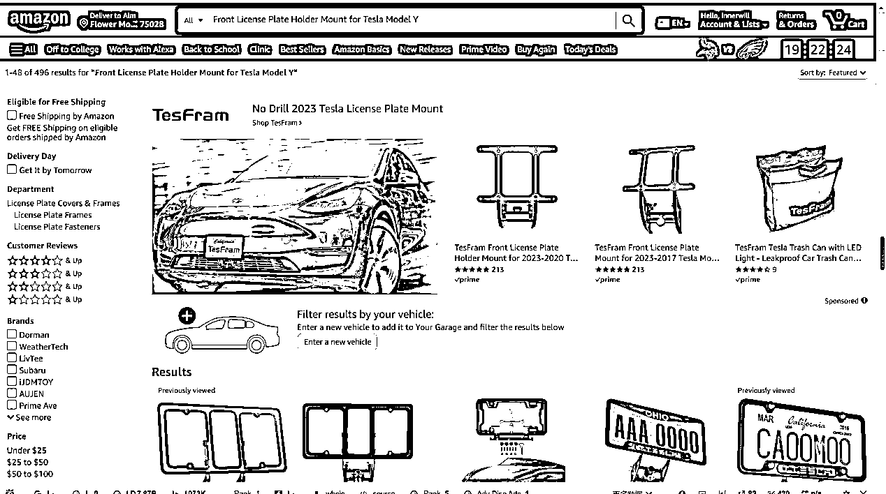

以下是软件调出来这个类目的相关数据：

  

2021 年的时候，我们进入这个小分类时，当时产品售价在 80 美金左右，采购成本 50 RMB，开模具费用 5W RMB，毛利润率在 45-55%之间。

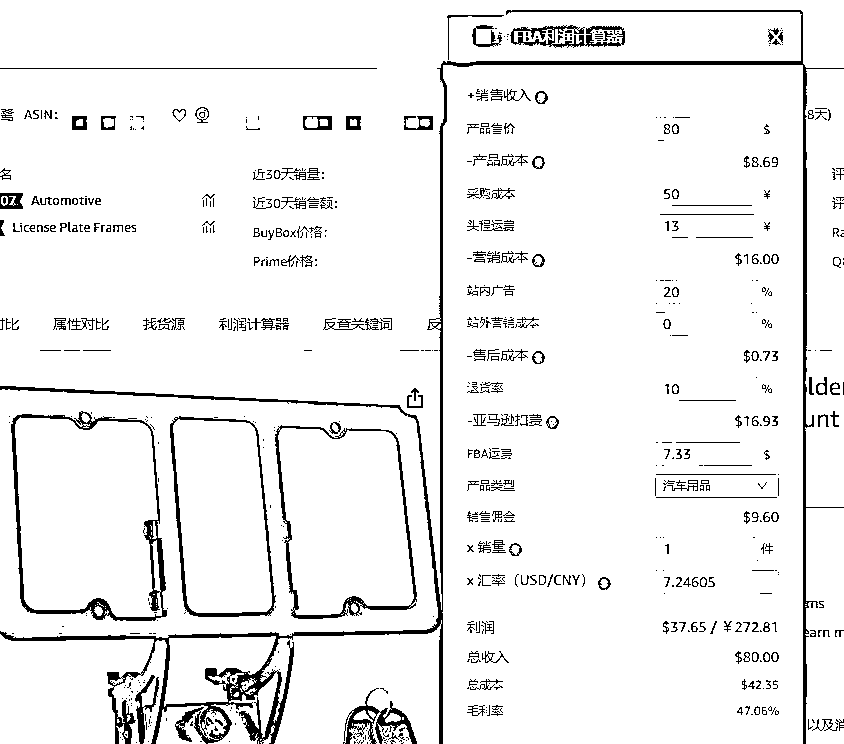

现在售价只有$54.99，毛利润率迅速下降到了 37%。

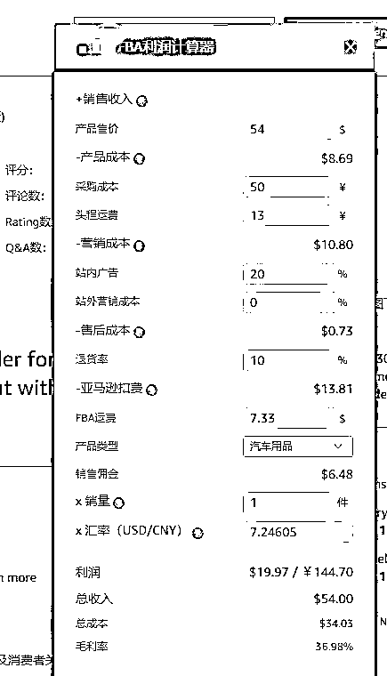

2021 年后，随着亚马逊行业的竞争加剧，一线从业人员的整体从业技能随着亚马逊培训的广泛普及以及相关行业工具的应用。

一个高毛利产品，特别是热门品类的生命周期从以前的 1-2 年迅速下降到 6-10 个月左右。

**Question:**

**这个车牌架子还有二次开发的可能性呢？ 除了开新模具改变外观。**

**是不是还可以应用在除了 model Y 以外的其他车型，比如长途卡车？**

**小蓝海产品选品案例：**

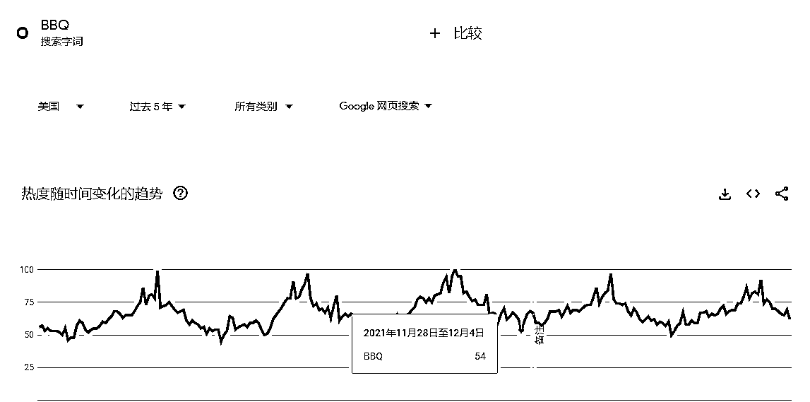

美国的烧烤和篝火文化非常流行。衍生出庞大的点火器产品需求。（如下图）

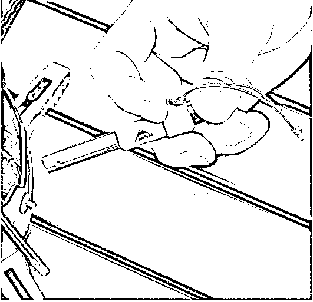

喷火枪（ Propane Torches）是一款高性能的火焰喷射装置，旨在满足烧烤，篝火，塑料翻新，燃烧，焊接等各种应用场景的使用需求。产品 2021 年才陆续在线上市场销售。

最开始的大型的喷火枪，需要点火器引燃。后面加入的陶瓷点火器，按钮点火。同时加入调节阀门，可以调控火焰大小。适配美国家庭常用的 mapp 罐接口。同时以枪造型，为原型。

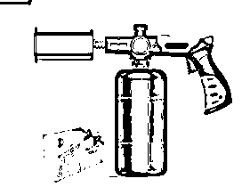

**当时我们调研这个产品时考虑到以下多元化的使用场景：**

烧烤场景：烤肉表面焦化，提高肉质口感

篝火：美国壁炉，庭院篝火市场体量需求也很大，产品又安全，同时出火量大，燃烧率很大。

（很多人以为这个夏季产品，其实冬季体量要大于夏季，产品单价很高，烤箱基本能正常完成需求，表面焦化是毕竟是少数群体。)

塑料翻新：塑料表面翻新（熟悉汽配的才知道这个效果）视频链接：[`www.sohu.com/a/711052317_100114195`](https://www.sohu.com/a/711052317_100114195)

除草：美国法律对除草有明文规定（这是 22 年的新应用场景，今年需求暴涨，增长了 180%），而且直接成为新的 3 级类目。

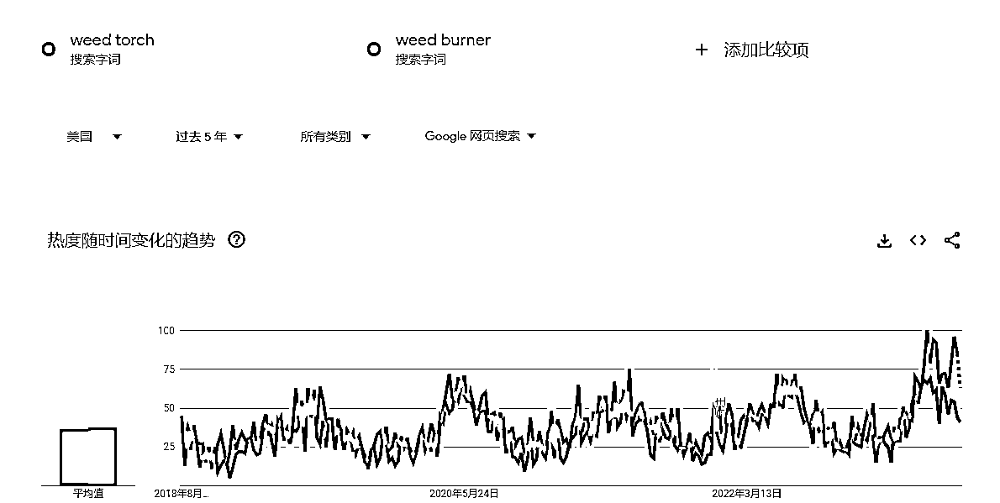

通过上面几个市场分析出产品都能满足市场需求，同时这个几个市场都是需求潜力巨大的。

客单价角度考虑，几个应用场景都是有一定消费能力的人群。

烤肉市场：家庭庭院烤肉这类群体的消费水平是比较高，能接受高价

篝火群体：篝火里面可以细分一个打猎群体，这类对于篝火氛围的需求还是挺大

翻新：翻新在汽配也有一个专门的类目，比较冷，有一家竞争对手直接做到 bsr1，月出 2000+，

除草：除草也有一个专门的类目，需求潜力更加大，可自行调研（因为本人还在做）现在也是单价最高的应用场景。

通过对不同的使用场景的功能决定售价，例如篝火和翻新，实际就生火和长时间燃烧，可能替代性强，价格下探比较低。基本在 20-35 美金以内。

而除草工具的替代品，售价集中在 100 美金左右，除草类目售价在 50 美金左右。

我们发现了这个细分市场，同时也拓展了多个应用场景。这个机遇就是我们自己对市场的认知和对消费者的需求熟悉总结出来的。

下图时当时刚上架时的利润：

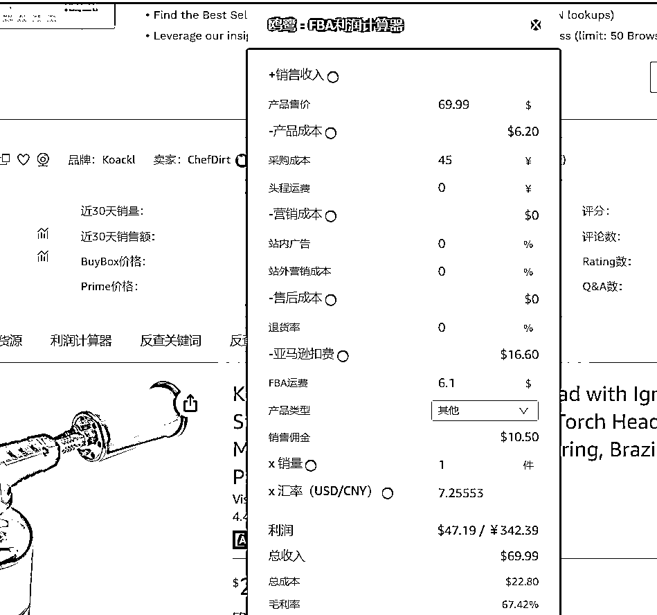

后来竞争加剧，客单价格迅速下降到了$49.99 但是通过优化产品内部结构（ 把原来的铜芯换成其他材质），采购成本下降到 35 RMB，利润也比其他蓝海产品可观很多。

**本阶段风险控制点：**

**知识产权侵权风险**

**什么是知识产权？**

知识产权是人们就其智力劳动成果所依法享有的专有权利，通常是国家赋予创造者对其智力成果在一定时期内享有的专有权或独占权（exclusive right）。知识产权具有时间性，地域性以及专有权特征。

知识产权宏观上分类为著作权（文学 文艺美术作品）与工业产权（商品）。著作权一般有版权，工业产权常见的是商标权和专利权。

版权，商标权，专利权经常有交叉情况，这是知识产权一个重要特点。

**亚马逊知识产权政策**

当您在亚马逊上销售商品时：

（1）您必须遵守所有适用于您的商品和商品信息的联邦、州和地方法律以及亚马逊政策；

（2）您不得侵犯品牌或其他权利所有者的知识产权。亚马逊非常重视知识产权侵权问题。即使卖家在不知情的情况下侵犯了知识产权，我们仍然会采取措施，卖家账户可能会收到警告或暂令停售

解析重点： 本政策不是法律建议。如果您对自己的知识产权或他人的知识产权有疑问，应咨询律师。

美国查询专利，商标网址：

[`www.uspto.gov/patents-getting-started/general-information-concerning-patents`](https://www.uspto.gov/patents-getting-started/general-information-concerning-patents)

[`www.uspto.gov/trademarks-getting-started/trademark-basics`](https://www.uspto.gov/trademarks-getting-started/trademark-basics)

欧洲查询地址：

[`www.epo.org/`](https://www.epo.org)

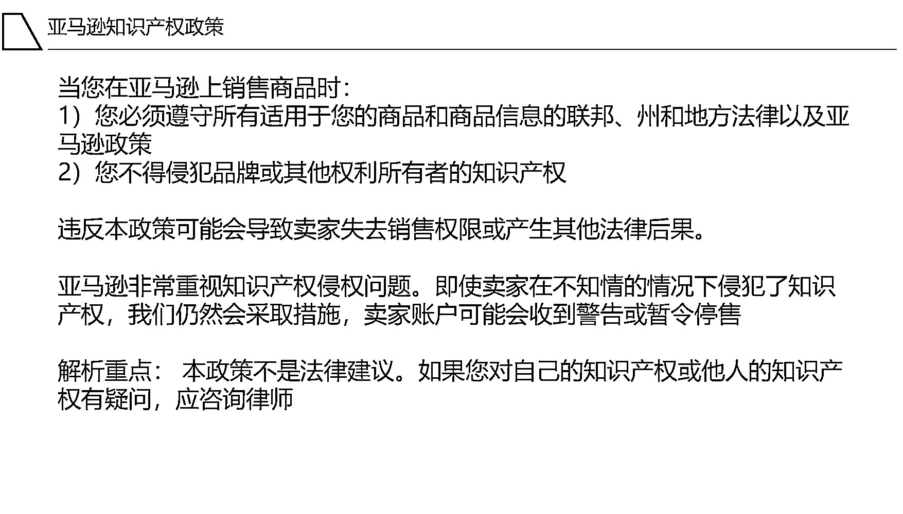

**产品案例：**

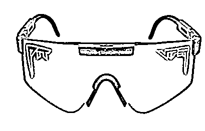

如果供应商给你推荐这款产品，你敢做吗？

又比如这两年大火的挂脖风扇。如果要切入这个产品，需要从哪几个方面规避知识产权风险呢？

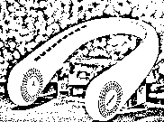

俗话说“没有一个爆款，可以活着走出中国山寨”。

产品专利不仅可以防守保护自己也能用来进攻，堵死对手的路。了解自己在做产品的知识产权状况（外观专利，新型实用专利所有者，专利有效期）是产品开发的必要动作。

利用知识产权建立自己的护城河，越来越普及。在知识产权安全范围内的合法蹭流量，是确定爆款的最佳捷径。只有你能蹭，别人不能蹭的流量就是你的竞争力。

能够投诉下架很多对手的 listing 链接叫做有核心竞争力。

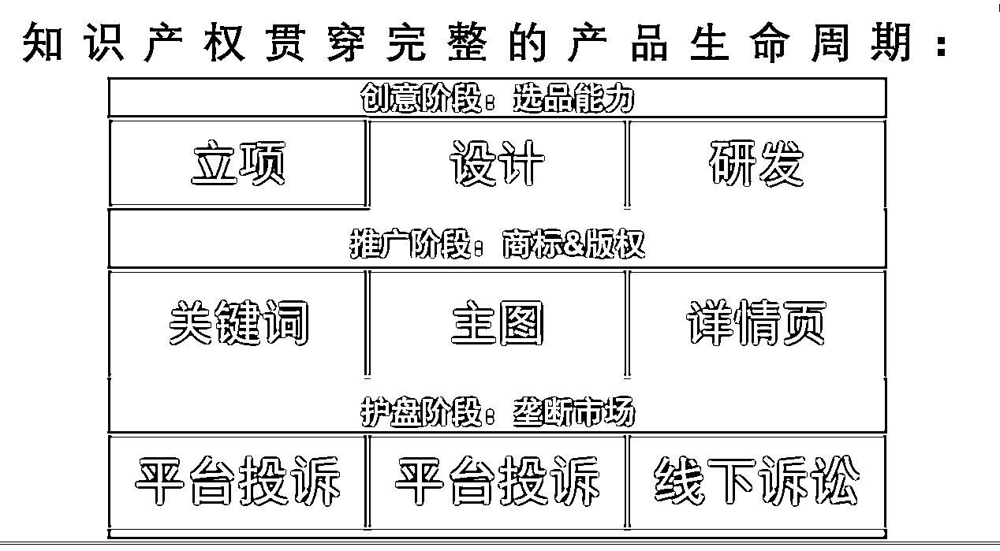

***最后再次强调风险控制，贯穿始终，创业者要亲自抓。销售机会千万条，账号安全控制第一条！**

店铺安全涉及生死，生死问题老板必须亲自抓，了解平台的最新政策，价值引导，不断更新自己的安全风控操作守则。

* * *

评论区：

zhAzha : 谢谢分享。写的太宽泛了，同亚马逊草根创业者。如果能只挑某个点写深入点我觉得更好。

* * *