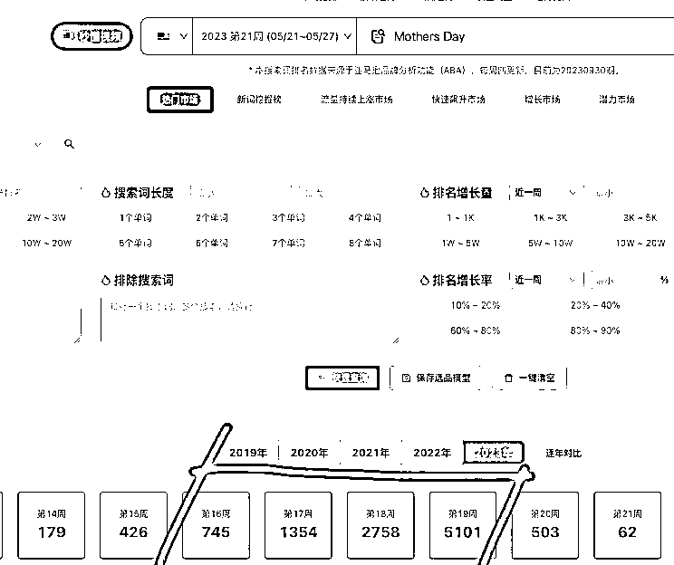
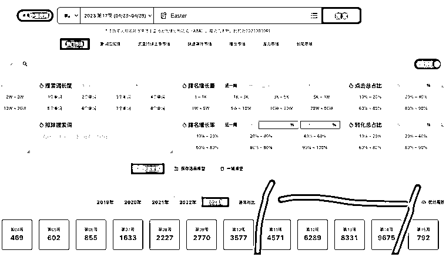
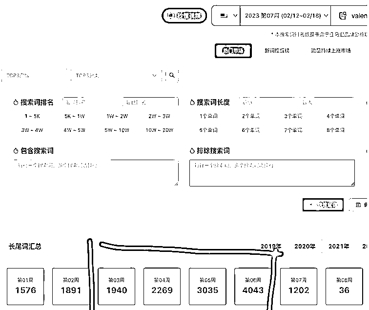
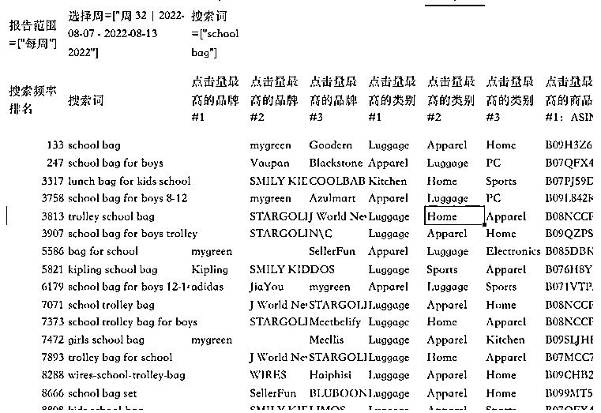
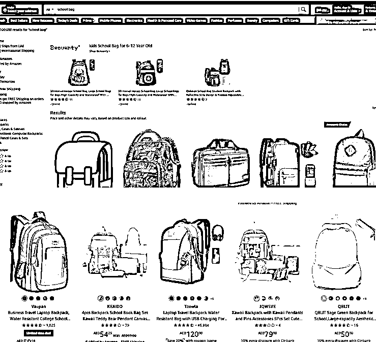
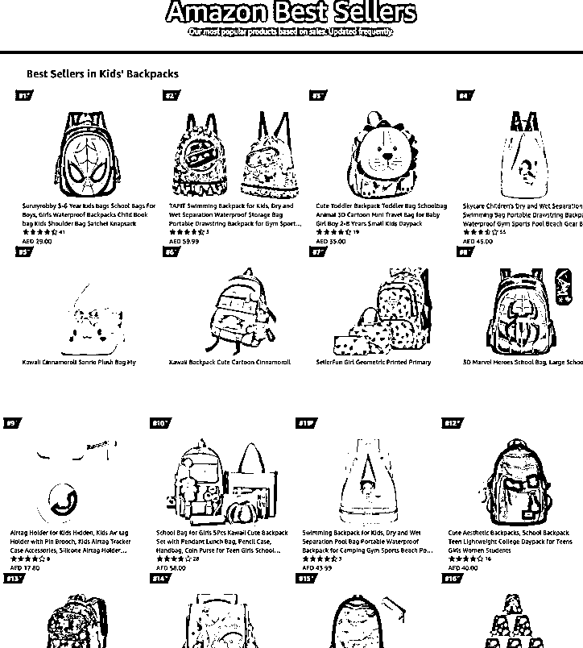
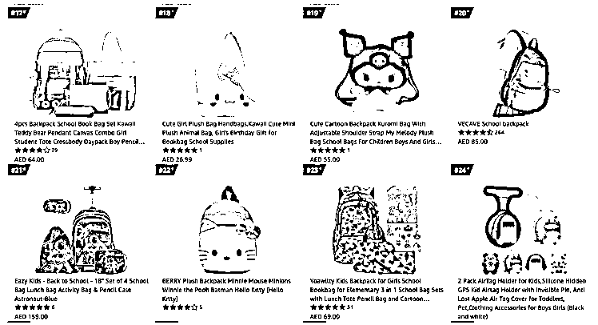
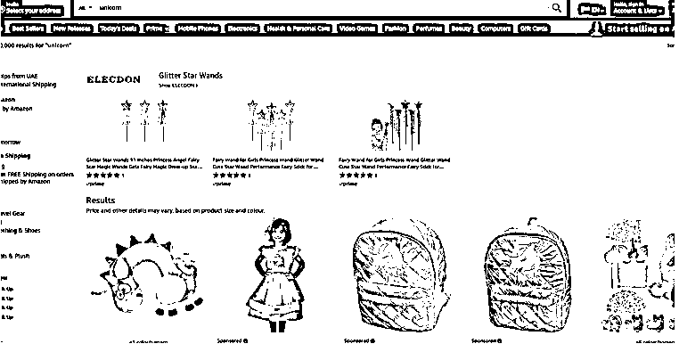
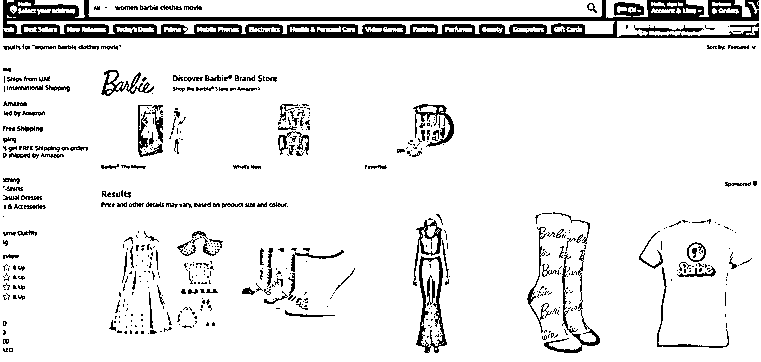
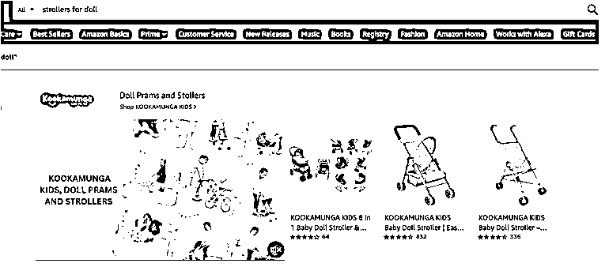

# 亚马逊低量级的 季节-节日性产品玩法

> 原文：[`www.yuque.com/for_lazy/thfiu8/osx3s5oihcooaqfi`](https://www.yuque.com/for_lazy/thfiu8/osx3s5oihcooaqfi)

## (24 赞)亚马逊低量级的 季节-节日性产品玩法

作者： 谭 lucky

日期：2023-10-12

最近一年，从 22 年开始的，尝试从节日主题切入做产品的过程中，赚到钱！虽然不是什么大钱，但是可以快速小跑，完成最小 mvp，然后进入复制的阶段。

说在前面的话，咱这方法，

# 不适合人群，

把亚马逊当副业的。

因为这玩法比较专业，不适合短时间，只花时间和动手就能完成的副业的。

需要一定研究精神，因为可以进一步延展。需要花时间进去。

# 我们的目标是，

沉淀节日中，人们购物的喜好。从而更加洞悉购买者的需求。

跑完最小 mvp，慢慢复制开来。

# 起盘所需，

1 有非美国的亚马逊账号

2 墨西哥，阿联酋，沙特，需要注册当地增值税号，才能卖产品

# 正文分为几个内容，

1 介绍季节性产品销售的天花板限制

2 介绍对比常规产品，季节性产品开品的优势

3 介绍季节性产品开品的失败经验

4 介绍季节性产品开品中可以差异化的方向

5 介绍季节性产品开品在非美国实际操作

6 介绍季节性产品开品在非美国市场的优势

来吧，

# 一，节日产品销售的天花板，

## 1, 时间短。因为季节性产品的主要销售周期通常是 2 周到 1 个月。

图中举例情人节，复活节，和母亲节的关键字流量的多少。数字越大，代表流量入口越多。

1.1 母亲节，

1.2 复活节，

1.3 情人节，

从以上 3 个图可以看出，情人节的流量入口维持上千的周期，是 3 个节日中最长的。最短是母亲节，其次是复活节。

人们在购买产品的时间段里，在情人节通常会提前数周购买。

而母亲节，是集中在 3 周爆发购买需求。

在节日来临的那一周，搜索达到了顶峰。

销售最旺的时间段，在节日来临前 2-6 周不等。

对于常规的日用产品，咱们没有明显的淡旺季之分，一年 12 个月都可以销售。但是节日用品，过了这几个星期的销售日期，就要等到 12 个月了！

## 2, 投入成本与回报比

23 年上半年，做了两个季节。复活节和返校季。

每次的采购成本，大概在两万块左右。

复活节，赚了 1 万 6。加拿大和美国亏了。

返校季，赚了 1 万 9。

两个季节的尝试，共赚了 3 万 5。

这一年做季节性产品，也不是赚了什么大钱。只是跑下来，我花的开发时间，备货时间，运营精力，不是很多，但是又有一定的收获。

收获虽然不大，但是是一个积累方法和经验的过程，在一步步的尝试中，为下一步扩展，做好充足的准备。

# 二，产品开发的过程中，季节性产品优势，相对常规产品来说

## 运营方面优势，

### 1， 季节流量大，广告推广简单，不用花很大力气。

在风口上的猪也会飞。

### 2， 竞争是一年一次，即产品链接都是跟当年的链接竞争，门槛低，不需要太多的评价做基本。

运营兼顾方面，天然的少了一项。

## 产品开发的优势，

### 3， 每个季节的节日主题突出，主题突出，热卖元素明显的季节特征，购买人群，使用人群也很明确，使用场景突出，做差异化的定位方向，比常规产品明确。

母亲节，父亲节，返校季，万圣节，圣诞节，复活节，情人节，斋月，等等。

### 4， 一年每个月都有节日，可以快速验证自己的开发产品方法，是否有效，再做调整。

我做复活节，1 月下单，3/4 月就知道结果，最长 4-5 个月，就能拿到市场反馈。小团队，一年能做 3-4 个季节。

而且，通过突出的主题，明确的购买人群，能更好的沉淀对差异化的理解和素材积累。

### 5， 售后嘛，退一万步，即使是差评多，下一年这个链接重新做一个就好啦。

不是说没有售后，亚马逊的售后基本是很简单的，咱们要做的就是把产品的质量提前把好关，包装得美美的。

最重要是开发产品，把产品定位得好。

# 三，开发季节性产品失败的经验和坑

## 开发产品的失败经验，

### 1， 选择上一年热销款去铺。

上一年美帝热卖什么产品，款式，就同样抄去加拿大去卖，抄去墨西哥去卖。我心想，我当地物流发货，胜人一筹。

其实不见得有多大优势。

产品还是 1。

### 2， 没有做差异化的季节性产品。

做产品，第一要旨，没差异化，同质化产品，即死。

### 3， 受众人群定位错误

没有认真做好产品分析，和受众人群分大部分和小部分的分析。选择了小部分人群，产品入多多。

比如返校季，针对的主要是上小学的适龄儿童，而我偏偏选择了押宝在幼儿园小朋友身上。

## 运营节奏，时间的坑，

### 4， 没拿样品直接订大货，事后有问题要修改就麻烦大了。

太草率，太自以为是，眼睛太大看漏眼。

不谨慎，属于性格的缺陷。

### 5， 开发时间没有安排好，导致只能走空运和快船，导致成本上升。

销售时间变短！留下可操作推广的时间，变短了，弹性不大！

退一万步讲，产品再好，没有足够的销售时间，只剩 1-2 周销售时间，别人已经在首页了，我还在 18 页，怎么可以不急？

只能猛砸广告，但是，如果你广告策略不明确，竞品已经遥遥领先，咱们重金砸流量，缺少调整时间，最后可能也是薄利。

### 6， 没有做好关键字调查，把最大流量词忽略掉。

没有做好流量入口梳理，再大的流量也看不到自己的产品。

同第 4 点，性格不谨慎。

### 7， 节日/季节性产品，一旦滞销，就是一年的仓储。压库存，压的就是钱。

# 四，在做季节性产品最重要的一步是——开发有差异性的产品

差异化这东西，不单单是是指产品的差异化，其实我们可以从多方面如说

### 1， 价格。

成本，包装，头程运费，去优化。

### 2， 渠道。

可以做站外推广，可以做站内推广，看选择的关键字和竞价高低。

### 3， 站点。

可以选择非美国站点进入。例如，加拿大，墨西哥，澳大利亚，中东，这新兴国家。

### 4， 推广。

这些非美国，且有上升潜力的市场，广告费都比美国便宜多了！

### 5， 从套装产品入手。

套装产品，是一个很有弹性的产品，可以做现货的套装，也可以做定制的套装。主要打的是一个供应链管理的差异化。

# 五，我是怎么做的？

### 我最大的差异化，应该是市场选择的差异化。

### 1 定位战场

选择非美国市场——阿联酋

### 2 选择热销且与自己资源匹配的 节日类目

把 aba（亚马逊后台数据库）往年的热销时间段数据都扒拉下来。

aba 是亚马逊的内部的数据源。包含当期点击最高的 3 个 asin 的资料和，当期前 100 万名的搜索关键字。

看下有没有集中的热销产品，热销类型/系列产品。

### 3 具体操作如下，

用 school bag 在阿联酋的搜一下，

### 1 页面现在，出来的是什么款式的

（如下图）

### 2 用 aba 榜单上的产品，查看往年的产品又是长什么款式？

### 3 对比近期类目，热销榜单的产品形态。

对比现在热卖榜单，有没有款式是集中类似的？

是否有延续，还是有新的变化。

### 4 同时用关键字去搜索前台，查看当前排名与热销类目的产品形态，产品款式，是否相似，有没有延续的，还是今年跟去年款式不一样了。

### 5 根据 使用

### 人群（性别，年龄），

### 产品功能 ，

### 使用场景 ，

### 热销元素 ，

### 采购成本，

### 去定位具体产品方向。

这里不仅是定位使用人群，通过功能，场景，热销元素，去发掘产品的差异化买点。

是否能用功能解决一个问题？

是否在特定场景去使用？

是否为这特定的图案去购买？

### 6 通过别的类目，去验证以上产品（功能/ 属性/ 元素/ 人群/ 使用场景 等）是否被热卖过？

例如，儿童的独角兽书包，能不能在儿童的衣服上使用？—— 热卖图案迁移，使用人群一类似

电影芭比的衣服，能不能迁移到现实来，做 cosplay？—— 热点迁移，受众人群类似

baby 有小推车，小狗能不能也有小推车？—— 功能的迁移，使用场景类似

婴儿车英文是 stroller，（不要说 baby car 了。。。

# 六， 选择非美国市场进入练手的好处是

有利润！

### 1， 竞争低。

低到什么程度？

就是可以用现货，稍微改改做差异化，你就能卖得起。

起步低，处于美国亚马逊早起的卖方市场。

### 2， 利润高。

特别是中东。

利润怎么高法？卖一个，可以赚两个的钱。

土豪的消费力就是高，对价格好像不那么敏感。

### 3， 虽然天花板低，但同时可以有效压制你的进货成本，低的试错风险。

别想着挣大钱，验证自己的思路，最重要。

也正是因为试错成本低，你可以小批量，多频次的去做测试。

### 4，尾程相对美国便宜。

因为各国货币，比美元成本便宜！

我的同一款产品，在美国的尾程是售价的 30%起步，在阿联酋是售价的 17%起步就可以了。

# 最后——产品还是无数个零前面的 1。

0 到 1 的时候，咱们拼的是产品数量和努力程度。

成为有稳定收入的小卖，咱们拼的就是优质产品数量。

希望对你有一点点小启发。

我也希望，自己能复制起来。

加油！

呀哈比比，我是谭 lucky。

* * *

评论区：

Grace : 赞👍
谭 lucky : [愉快]
yz : 写得真好，感谢分享，学习了
谭 lucky : 谢谢鼓励[愉快]

* * *