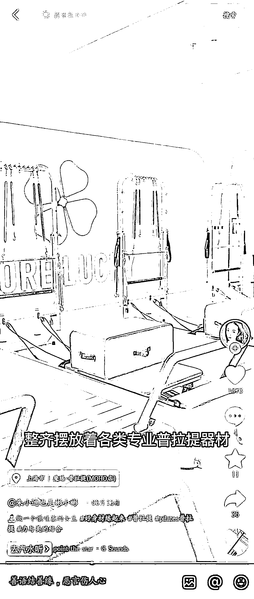
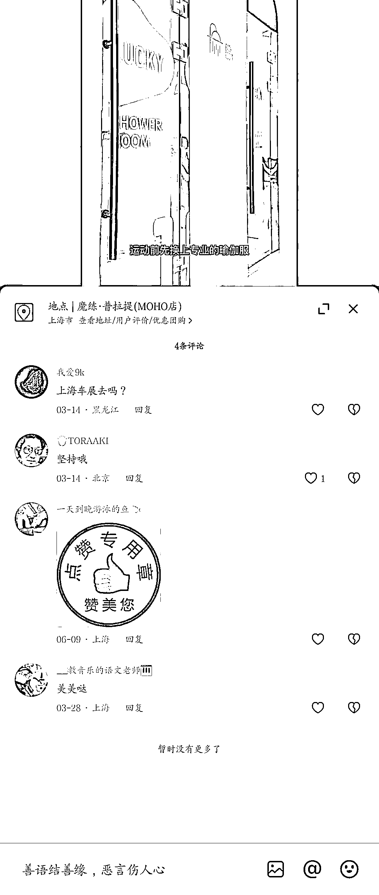
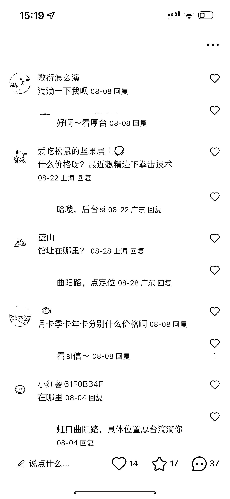
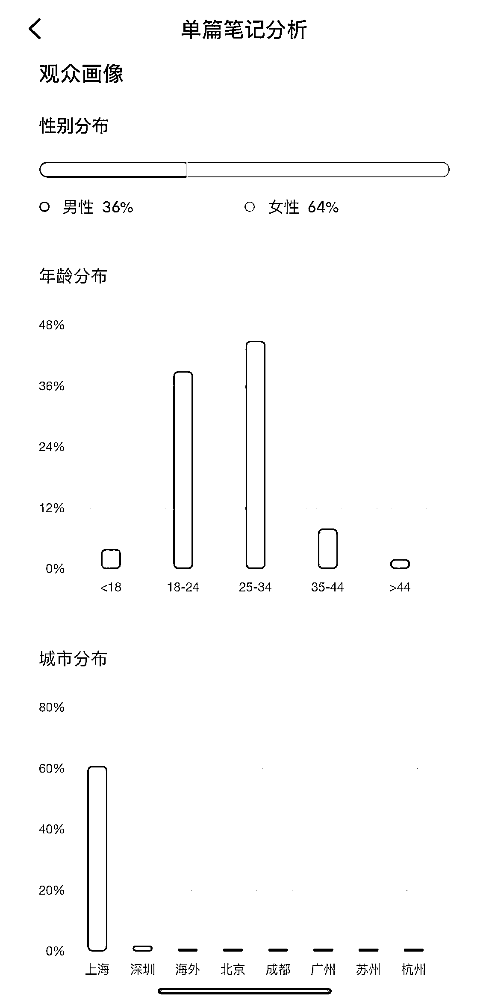
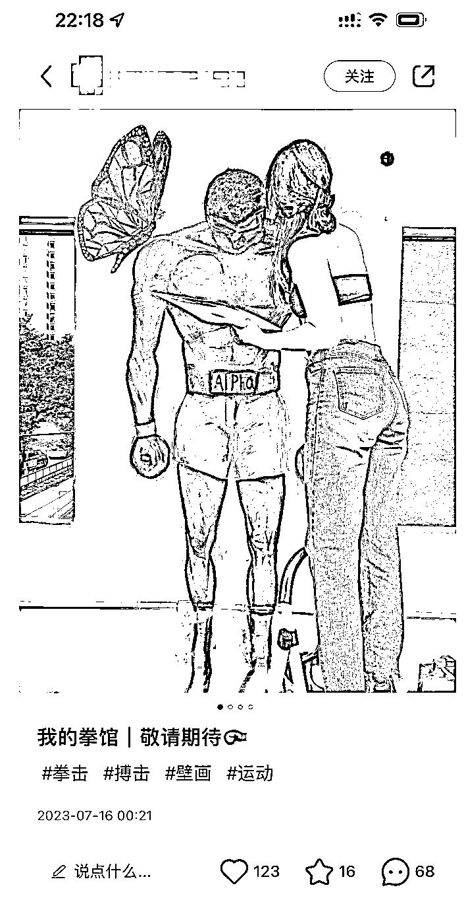
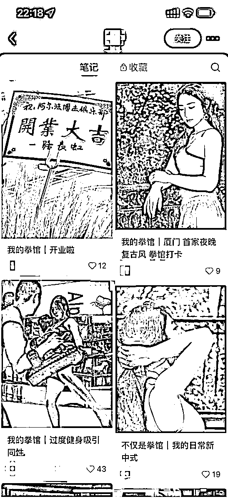
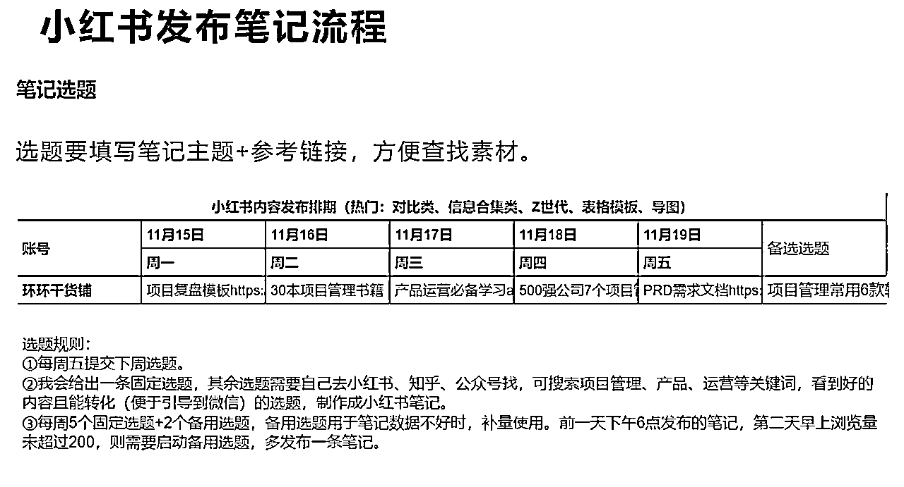
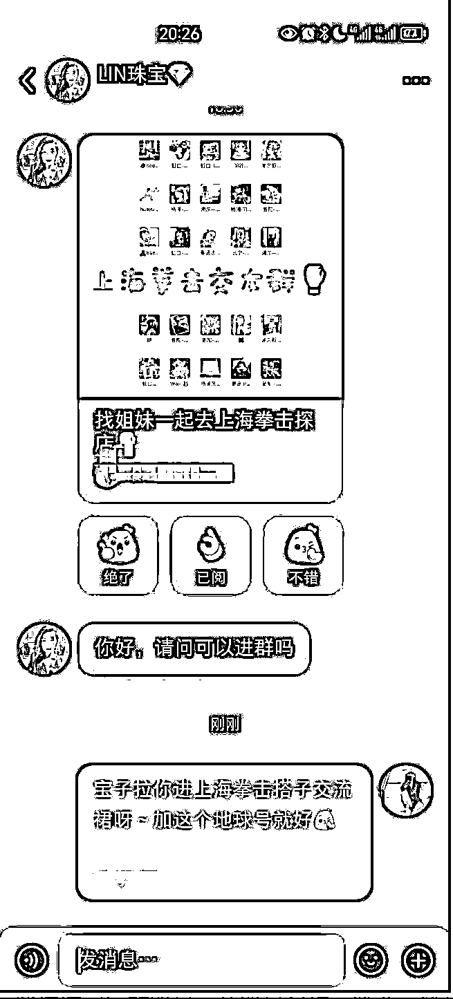

# 本地门店如何从小红书 3 个月引流 4000 精准用户

> 原文：[`www.yuque.com/for_lazy/thfiu8/ukdxcc2hse2dloim`](https://www.yuque.com/for_lazy/thfiu8/ukdxcc2hse2dloim)

## (精华帖)(98 赞)本地门店如何从小红书 3 个月引流 4000 精准用户

作者： 童童

日期：2023-11-08

哈喽大家好，我是童童，小红书本地生活矩阵玩家，同时也是一家拳馆合伙人。

通过小红书矩阵号运营，开店前 3 个月为拳馆引流私域 4000+精准用户，为开店积累客户和线上拳击课程变现；开店后为上海单家门店月精准引流 200+，目前门店 80%客源来自于小红书。

在传统实体店还只知道美团大众的时候，大家都打低价的价格战，包括抖音团购也是一次性薅羊毛的用户居多，到店消费低转高的转化率就比较低。我们不想陷入低价引流的漩涡，大家都比价就没意思。

门店在装修时，需要度过漫长的冷启动期，美团来的流量不够店里消化的，实体门店想做大，除了 C 端的用户，还有就是连锁门店品牌加盟，我们需要打造单店模型，真正实现线上+线下营收闭环。

大家都知道，小红书现在的流量很香，用户是 18-35 岁的一二线城市精致白领女性为主，消费能力和付费意愿极强，且小红书跟我们拳击的用户画像吻合率很高。

我们来看看小红书上那些做的好的商家，以及高转化笔记都是什么样的？

用上海的一家普拉提馆举个例子，我们来看下评论区：

同一家门店，我们来看看他在抖音的评论区：

看到差异了吗？

小红书的用户会问：
怎么买？
怎么报名？

抖音的用户大多只会点赞：
夸你美美哒....

如果你的行业用户画像适合小红书，需要高净值的女性用户，那么我建议本地商家一定要入局小红书。

小红书一个月引流上百个精准客户到店，就很香！
我觉得我也可以！
于是我先自己干
然后招兼职复制
....

先给大家展示一下我的高转化笔记的评论区长什么样子：

再来看下这篇高转化笔记的用户画像分析：

一篇不到 2000 的小眼睛的笔记，带来近 100 个精准客资，私域到店转化率高达 70%!

线下实体门店不需要追求涨粉和赞藏 99+数据虚假繁荣，真正愿意到店消费的高潜力用户都在评论区和私信！

运动健身行业单店投放获客成本在 50-80 元/个，以上数据纯免费自然流，内容获客！

我修改了几次关键词铺设以后：搜索流量占比 69%，用户画像调整到了非常贴合拳击理想用户的状态，男女比例 4：6，年龄 25-34 占比最大，将近 60%来自于上海。

同时我们做笔记一定不是千篇一律的内容，第一：大量重复的笔记容易违规，现在小红书对于笔记抄袭查重也很严格；第二：同个词条营销笔记太多会引起用户反感。

建议花 600 元认证蓝 V 企业号，如果客单价和转化率足够高，算好账，可以配合聚光投流。
企业号可以在主页显示「线下门店」，直接显示地址，可以直接导航到你的门店。
内容可以直接做你的门店活动，比如你的门店现在 618 的折扣活动，暑期学生优惠卡。

官方号的硬广内容有了，主理人号主要是为了给门店「树立人设」、「展示温度」的。
建议真人出镜，记录门店运营日常，创业心得，客户故事。

参考其他账号内容：

现在门店的产品和服务已经是最基本的门槛了，那如何在高标准的同行里面脱颖而出，一定是感受到人的真诚、有趣。

给大家分享一个小红书发布笔记选题规划流程表，可以按照这个来制作一周选题，来保证内容的素材丰富度。

小红书素人号的作用跟大众点评或者美团评价的作用是差不多的。

小红书用户在向你做咨询之前，在小红书已经浏览了大量的关于你门店的内容，在心里已经有了一个预期，那这个预期就来自素人账号的真实反馈。

那么我们在门店冷启动时，就可以去找一些本地的朋友去探店，输出小红书笔记，定位到你的门店，这样点进去门店地址会有很多笔记的种草和曝光。
我们做线下门店，需要的流量一定是十分精准的本地流量。

经常我会刷到一些传统门店的账号，从账号名称、简介、笔记内容、有一些「自我感动」的内容。完全看不出这个门店的城市、位置、产品、价格、优势差异化。那么本地流量的核心是什么？

模拟正常用户想去一家附近的运动健身门店，她会如何搜索？

城市+行业：比如上海拳馆、深圳健身房、北京舞蹈室。

所以我们就要在这些关键词关联的笔记里面，尽可能多的出现我们门店的名字。用户看到我们的名字越多，在她心里的心锚就扎的越深，越容易优先选择我们。

小红书现在很流行一种新型社交关系：搭子，主打的就是一个细分垂直领域的陪伴。
怎么把这个热点植入到我们线下门店里面？

比如我们是上海的拳馆，是不是利用素人账号可以在小红书找上海拳击搭子，一起去学拳击，引流到私域社群？

当一个小白想接触体验一个新的事物的时候，身边又没合适的朋友，那他就会希望能找到跟他一起的人，交流沟通，避免踩坑，减少学习成本和信息差。

小红书的同城搭子引流效果笔记：

加到微信群的搭子：

同理：特定城市和门店的，旅游搭子、拍照搭子、探店搭子、网球搭子，都可以用这种方式引流私域。
制作成本低且都是非常精准的用户，通过群发售、朋友圈运营、晒单等运营动作，搭子引流来的用户，我的拳击体验课私域转化率在 20%左右，转正式课就看门店的接待转化能力。

前端的产品内容直接决定后端的成交转化率，如果你想用资料引流，虽然引流基数大，但后端你要用非常多的时间去筛选沉淀付费意向客户；如果后端的人力有限，又想提高付费转化率，我们的笔记内容可以直接上产品价格。

当然主推的产品一定是你门店的爆款引流产品。

如果你在预售阶段，可以推百元引流体验课。

如果你在开业阶段，可以推千元引流的月卡。

这个价格一定是对比同行有吸引力的，根据自己行业做判断，明码标价的情况下用户来主动咨询的转化率是很高的，因为这已经是符合他心理预期的价位，只需要稍加引导就可以轻松成交。跟上面我提到的一样，明码标价笔记到店转化率在 60%以上。
从 0-1 闭环跑通后，如何放大流量？一个人的时间精力有限，而小红书笔记又需要日更维持账号活跃度，矩阵搭建来获得更多精准线索，如何把自己从繁琐的工作中解放出来思考线上流量的更多可能性呢？

两个都好，这个主要看你门店产品的转化率和利润，和能接受的获客成本问题。

如果 ROI 打得正，笔记爆了再去投流，那选择聚光一定是解放人力的。
目前我了解到的，小红书聚光投放，单店婚纱摄影行业加微成本在 200 元/个，普通的门店获客成本也在 50-120 元/个。

如果后端转化 sop 没有打磨好，这个获客价格是很高且浪费的。

今年 3 月份我开始招聘大学生来帮助我生产笔记内容和运营管理，提炼一个可复制的小红书内容矩阵打法，把这个核心内容教给大学生，利用较低的人力成本来做线上运营团队。

加微的单粉成本可以控制在 3-5 元/人，注意！这里可是加到微信的精准用户，不止是开口咨询线索。

利用人力杠杆，比投放杠杆，最大的好处就是成本降低，对于前期的容错度更高，公司有更多的利润空间去做新的尝试和玩法。

小红书实体商家赛道和其他知识博主，职场博主的内容和打法侧重还是有些差异的，
我们需要的是实实在在到本地门店消费的用户。

我总结了几个经验和建议分享给大家：

1.开业前，先引流一波精准客户到私域，再在朋友圈同步开店进程，预热造势蓄水，以达到开业当天就客满的目标！
2.不要怕阅读量少，矩阵批量上，来 1 个客户到店就不亏！
3.不要陷入虚荣指标，不是要你小红书有多少粉丝、有多少点赞收藏，99+没有任何意义，每天加 10 个咨询客户到微信才最重要！
4.不要一上来就投流，一定是先测试，测出属于你自己的爆款笔记内容模板，再去投放！
5.不要畏难，一开始接受不完美，重点是提炼出爆款内容模板！

* * *

评论区：

田新一 : 太干了，都是实实在在有用的干货
童童 : 实操复盘，有收获就好～
渔樵听风 : 感觉你是做婚纱摄影的
[奸笑]
童童 : 本地生活类目的商家我们都服务哈
雨烟 : 优秀[强]
王国庆 : 学习了
书豪 : 牛🐂
亦仁 : 感谢分享，已加精华。

* * *