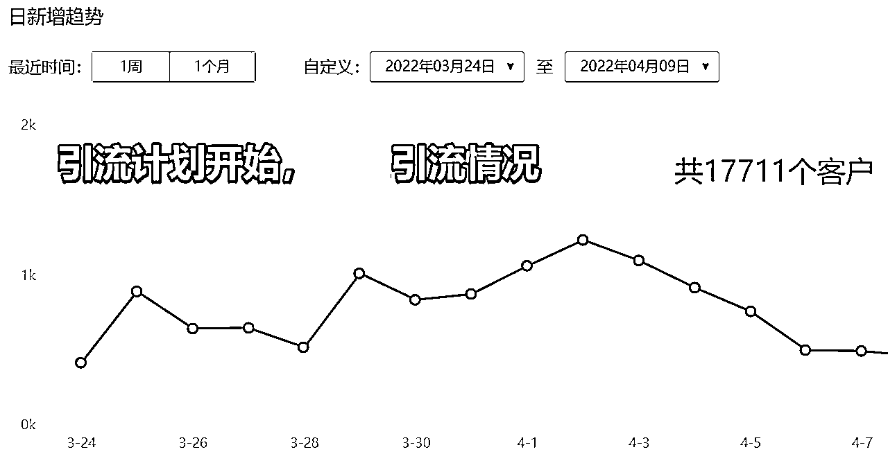
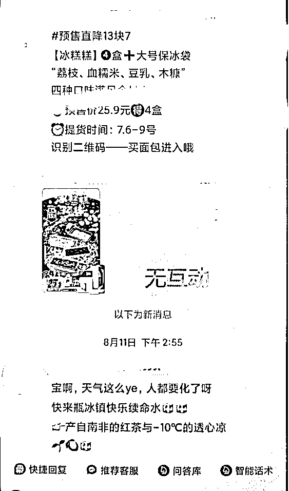
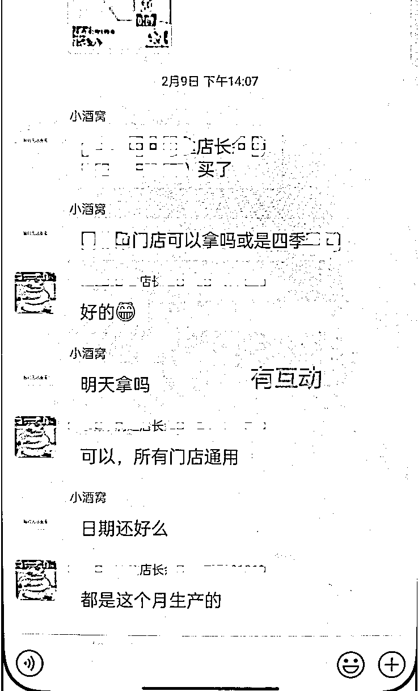
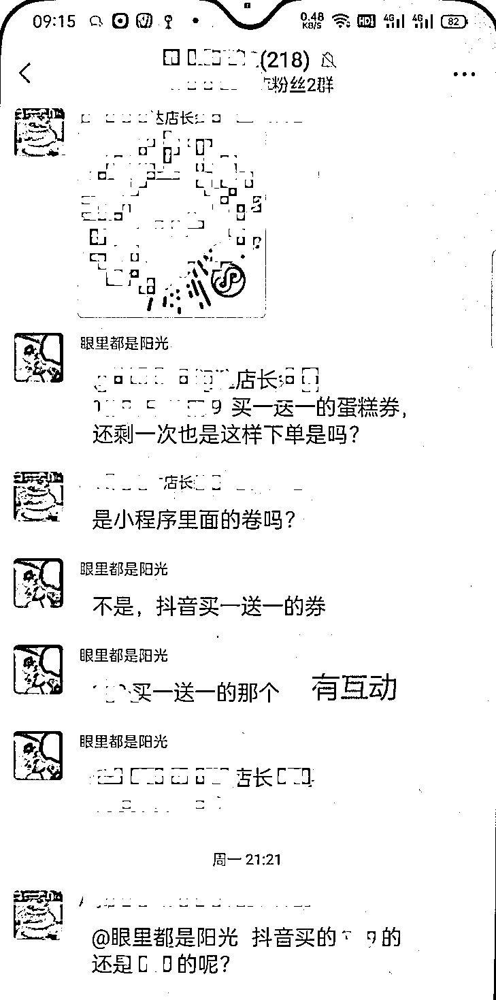

# 做好引流和复购，让营收翻倍

> 原文：[`www.yuque.com/for_lazy/thfiu8/zt15vu6g2s4p512a`](https://www.yuque.com/for_lazy/thfiu8/zt15vu6g2s4p512a)

## (63 赞)做好引流和复购，让营收翻倍

作者： 付豪

日期：2023-11-07

在四五线城市的连锁烘焙门店，通过从 0～1 搭建私域体系，让每月营业额增长了 50w+，怎么做到的？

一是引流，前三个月通过地推、朋友圈活动、试吃活动、周边品牌合作以及各种裂变活动，迅速积累流量。

二是复购，引进用户后给用户打标签、筛选高粘性用户，再通过粉丝群、社群活动和转介绍扩大基础流量，从而积累信任，让用户愿意二次消费。

下面，我从之前操盘烘焙连锁店的角度，来和大家说说，如何从 0～1 搭建烘焙连锁私域体系，做好烘焙连锁店的引流和复购的，让营收翻倍的。

大家好，我是付豪，目前主要帮助烘焙店搭建从小红书到私域的体系，解决烘焙实体店引流获客和会员无价值问题，帮助营收翻倍。

曾经从 0～1 搭建烘焙连锁私域体系，每月营业额增长 50w+。

我操盘的门店私域，是处于四五线城市的连锁门店，有一定品牌效应，产品体系中，包含生日蛋糕，也有现烤烘焙和西点。

生财关于烘焙实体店相关的帖子相对较少，自己的一些经验，希望给圈友一些启发。

# **一、实体店的痛点**

现在这个时代，想要“老老实实”开好一家实体店，真的非常难。

说在前面，如果个人实在想要创业，我是非常不建议大家去开实体店的，表面看起来挺光鲜亮丽，实际上的各种成本各种压力是大到你不能想象的。

你需要会的东西，也不只是产品，基本线下的东西得会，线上的东西也得会。

就我最近观察到的小区门口一家店，已经换了三拨人了，从刚开始卖衣服，后面卖清补凉，现在又换了老板，开始卖寿司之类的东西。

为什么倒闭？其实无非就是没有人，没有生意。

不管你在哪里开店，首要的焦虑点就是引流获客。

引流获客都还是第一关，引流加到微信后，还会有新一个问题，怎么让顾客记得你，来第二次消费甚至多次消费？

流量和复购，是摆在实体店面前的大难关。

# **二、获得私域流量后改变了什么**

对于烘焙店来说，引流无非就是两大角度，第一是从线下获取流量，第二是从互联网获取流量。

线下获取流量最简单粗暴的玩法，最直观的就是出人力去做地推。那结合一下互联网获取流量，就有很多玩法了。

比方说地推结合用朋友圈裂变的方式，用社群邀请的方式，用短视频做传播等等。

我去公司之前，他们的私域基本上是零，没有任何体系，连企业微信扩容都是个大问题，换了好几个人都没解决。

这也是很多传统行业的痛点，对于这些新的平台不了解，想学又没有时间，只能眼睁睁的看着，等到反应过来的时候，最好的时机就错过了。

以前很多门店都会用服务号作为流量沉淀的地方，让用户去关注，而现在服务号基本上已经没落了，用户刚关注就是免打扰，即使触达也不会有太大的效果。

所以把各种地方出现的用户导到微信上去做运营，一定是大势所趋，且是现在每个门店必须掌握的技能了。

（当时企业微信后台）

我进去公司之后，大概花了一周梳理一下公司整个引流路径，设置好工具和内容，加到好友之后要怎么做服务，就开始引流。

首先第一步就是先把公众号的一些客户快速吸引添加到企业微信中，同时快速设置好线下钩子权益，20 天不到就搞到 2w 个客户添加到企微，而且客户都是买过产品的客户，迅速建立了一套初始运营体系，这个会在后面分享。

包括后来新店引流地推，单日进人 800～1200。

私域流量池，配上充值或者月度活动，一个月可以给大商场店带来 1-4W 现金、社区型店带来 3k-1W 现金。

# **三、烘焙店引流（前三个月迅速积累流量）**

**（1） 开业前地推积累基础流量与信任**

**1、做好地推的思路是什么**

如果你要开一家店，但是却没有什么品牌效应的话，其实很多人是不知道你的，那前期应该怎么做去积累信任？

相信很多一路走过来的老板，开这么多门店，对于地推不可谓不熟悉，精明一点的老板，在开业前就开始地推，快速吸引大量粉丝关注。

我们常用的方式，就是找到人流量大的地方，比如准备新开门店的周边小区，商户，大街，商圈等，然后发传单。

也有很多地推团队，就是硬发，碰到顾客就塞一张传单上去，说您好我们 XX 新店开业了，到店有 XXX 或者关注可以领 XXX，这种方式现在如果还在使用，那基本上就是在浪费传单浪费钱。

破局点，就在于产品，还有地推的人。因为你本身就是做实体店的，用户直接感知到的，就是你的产品。产品是否有差异化或者味道是否好吃，这是用户首先的记忆点。

因为我们如果把自己当成顾客去思考，对一家门店没有任何认知，而且又不是当下急需的东西，全天在手机上都已经消息爆炸了，一张传单过来，可能都不会愿意接，接了也不可能仔细看，转身就扔垃圾桶了。

不仅仅是烘焙门店，很多实体门店在地推的时候都不去思考，导致地推效果很差。

那我们换一种思路，站在顾客的角度想，当下送什么更容易接受呢？

比较好的一种思路是，用试吃的思路去地推，也就是带着好吃的产品去地推，这样做，用户对产品有了认知，初步信任也就更容易建立。

**2、地推应该选怎样的产品**

平常我们在门店做试吃，是想要顾客吃完觉得好吃，然后产生购买行为，想在各个环节尽可能让顾客购买。

门店的流量是顾客找上来的，地推是我们主动去找顾客推荐，所以更要注重流程、选品和话术。

在地推环节，很多老板容易陷入一个误区，想让顾客对品牌有认知，于是挑选那些高价又精致的产品，或者地推重点强调品牌。

其实大可不必，因为顾客对烘焙品牌的认知，很大一部分来自于产品的好看好吃，以及身边亲朋好友频繁的推荐，而不是来自于它叫什么，长什么样。

这就像相亲，我们至少要第一印象好，才能有更深一步的关系，当好朋友每天不停在你嘴边提起一个人，熟悉感好感也就与日俱增了对吧？

所以，我们地推的产品，就适合选那些看起来好看好吃的产品。

当然成本要可控（比如 5 元以下），这样顾客拿到产品吃完，才会有记忆点，有这种惊喜：“哇，这个面包/蛋糕这么好吃诶，下次我要去买！”

这样在用户心智中已经种下了一颗种子，商家也不会觉得送出去很心疼，双赢。

那我们做地推的时候，首先就要选店里面成本可控（5 元以下）且味道很不错，让人有记忆点的产品，拿去免费送。

如果是套餐产品引流的话，也一定是要选有吸引力的，并且门店可以长期售卖的，比如夏天就比较适合用柠檬茶+绿豆饼套餐，这样开业的时候，才能尽量吸引更多人来。

**3、地推领取方式应该怎么设计？**

选好产品，接下来就要思考，怎么让顾客领取，就能够做到效益最大化。

地推除了让顾客知道产品好吃之外，当然更希望他天天来买，所以我们一定要把顾客加到微信，通过后续的运营，让顾客变成忠实粉丝。

怎么操作？送产品的时候，就可以直接说：添加店长微信，就可以领一份产品了哦。还可以领取 XX 元优惠券包，开业就可以用，到时候记得来哈。

大概就是这样的意思，重点在于地推人的态度。

这样做，送了多少份产品，就能加多少顾客到微信，甚至有技巧的话，还能加更多，同时用舒服的话术+优惠锁定顾客，让顾客开业期间来门店消费。

同时如果想让更多顾客知道新店开业，就再设计一个裂变环节，让用户自发转发就好了，比如转发朋友圈集赞，可凭转发记录在开业期间前往门店领取 XXX 产品，这样既能让用户到门店，还起到了宣传作用。

我们当时是用户加到好友后，会弹出自动回复语，以及一张裂变海报。自动回复语是简单介绍门店，开业时间，保留好友有啥权益。

海报内容是转发朋友圈保留三天，开业时可以直接来门店领取套餐一份，套餐设置的是当季比较火的产品。

不同门店特征不一样，裂变活动的设置也大不相同，这里就不多展开。

**4、正式地推前，还需要有人员规划**

如果已经是连锁门店，可以通过总部调配其他门店的工作人员来支持，分配小组，通过划分周边区域地毯式推广。

当时我们是在开业前，把人员分成了五个组，每个小组 3～5 人，当然如果能够招兼职的话，还能够分更多组。

比如我们的目标是三天搞到 8000 人的流量，那会把目标拆解到每个小组身上，每个小组每天就差不多是 550 人的目标。

负责人的策略，以及对于士气的鼓舞非常重要。

我们是根据门店周边 3 公里左右框定了范围，选人流量比较多的地方，比如一些人流量大的街道，商铺，一些小商圈的出入口，学校门口等等，直接拿着产品和 DM 单，去一家家地推，不放过任何一家。

地推就是刚，没有太多技巧，只要有人，就是机会。

如果是新门店，没有多少资源，发传单的效率就肯定不如有朋友有资源的团队，这种情况下，有两种方法。

**第一种方法是找兼职。**

现在学生兼职一天下来也不贵，培训好流程话术即可上手。由门店工作人员带领，带着产品去地推。

**第二种方法就是做异业合作。**

比如在周边的商圈，人流量大的商户，比如培训机构、电影院、美容院、KTV、游乐场等，能在这些地方充值办卡或者高消费的，一般都是周边客户，可以和这些门店的老板谈合作。

比如在他们原有活动的基础上，同时附赠一张卡片，卡片上面写上添加店长微信，凭此卡来门店可领 XX 产品，门店名字、地址、店长二维码，在顾客办活动的时候，让老板一起送。

和他们去谈合作，当然这个不是一定能谈成的，如果谈成后续也可以做活动互相导流共赢，所以，哪怕被拒绝，也是值得一试的。

**第三种方法，就是混本地社群。**

店长提前加入本地各种群，比如买菜群，早餐群，水果群，团购群，去主动挖掘客户，平常就和群里的一些朋友打好关系，主动加好友，但不要直接生硬发广告。

**地推需要注意的要点，都是踩过坑的经验：**

1.地推前就要定好目标，提前预估产品消耗量，一般在目标的基础上再上浮 10%～20%。

2.地推地点要估算人流高峰期在什么时候，比如学校，中午和放学时候就必须安排人在那里地推，比如商场周边，晚饭时间后就一定要有人把守。

3.提前安排负责人送货，货量分配到每一天，全天建立地推作战群，每个小组要有负责人沟通，每个小组保证及时补货。

4.小组一定要制定 PK 机制，最后一名如果没达到目标要罚，如果达到目标，不罚。第 1 名～3 名是有百元阶梯奖励的。

5.奖励一定要每天统计，每天地推结束发，这样每天都会有获得感，并且每 1～2 个小时就要在群内汇报进度，要让人有紧迫感。

6.每个拿到产品的客户都务必要加到微信，并且尽量让他转发朋友圈，特别是有些商家店主，或者老年人朋友。他们的朋友圈触达是更广的。如果有些客户想发但不会，经得同意后，可以直接拿手机帮他操作，这个对于四五线小城市快速打影响力特别好用。

7.为了防止客户刚加到就删除，务必要告知，凭借微信，到时候到店能有什么权益，最好是可以免费再领一份什么产品。

8.要提前给团队准备好线上话术和海报，提前培训加好友后具体是什么操作流程，这也是用企微比较方便的原因，可以设置自动回复。用户加入可以自动触发。

9.对于风险要有防控机制，比如说微信突然封禁了，要及时更换活码后面的承接账号，比如自动回复发券没有成功触发，一定要提前设置暗号，用户回复暗号就能领券。这个是之前自己踩过的坑，好在及时处理，不然在人流量大的时候，产品免费送出去了，人却没有留下来。

10.话术和海报设置要注意两点，一是告诉用户，门店在哪，何时开业，有何权益。二是告诉用户，转发 DM 单内容到朋友圈，开业凭朋友圈还能再领个 xxx 产品。

11.在地推过程中，地推人的态度决定了客户对品牌的印象，让顾客感觉好，才不容易删好友。

12.在地推引流的同时，后台一定要准备接待承接的人，用电脑登录上账号，有问题要及时回复。要让整个过程大家都有信心，这就需要线上线下的同事，同时努力去梳理好流程。

13.地推过程中，千万不要忘记同步朋友圈，同步地推过程中的动态，让客户知道你是真实的人，这也是通过地推可以增加与客户粘性的一种方式，营销味不需要太重。

通过地推，第一波基础流量就已经有了。

**（2）开业时朋友圈活动迅速扩大影响力积累流量，同时做充值活动锁客**

在做完地推之后，其实门店还有三天试营业时间。

这三天试营业的时间，目的就是在人流量不多的时候，先用来做测试和调整，梳理整个运营流程，给开业留出充足的试错时间，同时做朋友圈的活动。

这三天试营业，是不会有特别大的宣传动作的，基本上就是看自然流量，在这个过程中，可以同步在朋友圈】小红书、抖音平台做内容铺垫。

既然是自然流量，每个到店顾客都要把握好，这个是补足地推没有触达到的那部分人最好的机会。

大方做试吃，只要客户试吃觉得好吃，就邀请帮忙宣传一下朋友圈。

周边所有到店的客户，都要尽量引导他们发朋友圈，把每一个到店的人，都作为一个传播点，这一部分投入，是比投广告更有吸引力的，前提是设置好话术和图片，有创意，不要太严重营销感，让人人都愿意参与。

要求不屏蔽，保留三天，可以在开业期间来免费领取套餐一份，只要产品真的不错，服务到位，权益给到位，用户基本是愿意配合发一发的。

注意，只要你是以门店的角度去地推引流的，在开业之前，都不需要建群，因为在客户对品牌没有认知，对产品没有认知的情况下，建群一定会变成广告群，且运营不了多久，这是个大坑。

如果非要建群，那就取名叫通知群，简单直接告诉顾客它的作用，在开业活动结束后，发群公告让大家转移到新群或者解散即可。

当然这是连锁门店的打法，如果你是一家有温度的小店，并且顾客加到你的时候，就已经见过你长什么样了，能感受到你本身的那种特质，那建群是可行的，因为顾客待在群里会是因为你，而不仅仅是因为产品。

等到开业前一天，多多发朋友圈预热、发工作状态，让顾客先提前感知到活动，充满期待，同时也是活跃在客户朋友圈里面，避免刚加就把你忘记。

正式开业那天，除了一对一群发通知让顾客到店领取产品，朋友圈也一定要多发，并且多告诉顾客到店领取，产品有限，图片尽量拍出人多火爆的氛围。

这个时候，之前转发的海报就起作用了，因为那张海报保留三天，可以直接来门店免费领取产品。（如果要求更高一点，还可以加个点赞 10 个的门槛）

很多客户冲着这个免费领就来门店了，这时候开业，光来领产品的人就多得不行，非常热闹，即使你不买，也能被这样的场景吸引目光。

那些看到这样场景，当时地推没有接触到的客户，也会想要凑个热闹，那也可以顺手让顾客先转发朋友圈，这又是一层引爆点。

开业的时候，基本上可以看到同城朋友的朋友圈，都是开业活动，非常火爆。

当然这一切都是引流动作，引流之后的转化机制要设置好，开业期间的充值活动，力度可以稍大一些，用来提前锁住这一批客户，这个只要在烘焙行业做过的都知道怎么设计，就不多说了。

朋友圈活动讲得比较多，核心就是让熟人做推荐，社交圈子是有重叠的，看到的熟人发一次觉得没啥，看到第二个熟人发可能就好奇了，看到第三个熟人发，就会觉得，我也要去试试。

除了朋友圈，开业时也可以配合抖音门店直播，利用朋友圈转发同样的道理，让客户拍摄门店开业实景，发抖音带上门店标签、同城标签，发布好之后送产品，篇幅所限，抖音就不展开讲了。

**对于开业时候需要注意的要点，都是踩过坑的经验：**

1.提前安排好核销人员的培训，接替人员，如何操作，中间会遇到什么意外，如何处理，这些都要培训到位，因为开业时候现场人是非常多的，排长队的时候，是没有多少时间允许你临时处理问题的。赠送产品没货如何应对，核销人员忙不过来怎么办都是要想到的。

2.对于不想转发朋友圈的客户，不需要强硬要求转发，不然适得其反。

3.朋友圈的运营一定要做到位，千万不要等到开业了，没时间发朋友圈，线下火爆，朋友圈也要跟起来，因为真正转化的节点，就是开业那么两到三天。

4.除了小产品引流活动，现场还可以举办大型蛋糕试吃，生日蛋糕品鉴等活动，场子可以搭起来，这个是展现生日蛋糕的实力，让更多客户品尝到生日蛋糕，后面有订蛋糕需求就容易第一时间想到你。

5.如果是有大型的活动，一定要提前和城管打好招呼，之前我们就是有一次关系没处理到位，就是台子搭起来，城管来了又要拆，来来回回增加相当多工作量。

6.开业繁忙这几天，更是锻炼员工承载度的时候，一定要注意状态，客户体验不好，有负面情绪后面就是产品再好都不一定会再来了。

7.开业一定别忘了抖音、小红书等平台同步作品，有预算的话，除了找同城达人，也可以让用户在抖音上进行裂变，打上同城标签的话题，这样扩散效果是非常好的。

8.产品设计上，要设置能让用户有拍照晒单打卡的点，比如西点上插一个非常可爱非常有代表性的插件，比如送专属的钥匙扣等等。

**（3） 日常线下和门店配合多触点引流（设置引流品）**

开业完之后，就要开始进入平稳运营阶段了。

线下门店客流是非常不稳定的，一旦遇上下雨，或者夏天比较暴晒的时候，人流是减少的非常严重的，备了货，你也没办法触达这批人。

所以日常就是重在维护老客户，同时尽可能多的把线下到店购买的客户添加到微信中。

**1、紧盯客户进店的必经之路**

线下引流的布局，只要引流品设置好了，其他的就是触点的优化了。

**① 门口吸引：**

针对进店侧，制定进店诱饵活动。比如夏天时候就可以做 1 元冰淇淋活动，通过门口设置易拉宝，大的海报展示引流活动。前提是加到企业微信领券。吸引路过客流进店，放大门店的整体客流基数与销售增量。

**② 进店转化：**

设计微信添加福利策略，通过货架陈列二维码引导添加企业微信，推荐连带销售。

比如添加店长企微立马领 1 元立减券，选购货架上放置二维码，可以推连带产品、组合产品套餐。

**③ 托盘引流：**

设计企业微信添加福利策略，托盘上面的垫纸可以印上二维码，引导新用户添加店长企业微信。

**④ 买单台引流：**

收银环节 5 秒内的话术统一标准，由店员引导买单客户快捷扫码添加企业微信领福利（买单现场可用，如代金券、特惠加购单品等等。

**⑤ 买单后引流：**

客户付款小票，添加企业微信群二维码，客户可直接扫码小票入群（二次到店抵扣券或二次到店可领取优惠单品等）

可布触点场景还有：托盘摆放处、门口陈列，货架、冰柜、显示屏、收银台、大蛋糕册子、门店菜单、收银小票。只要新用户权益足够，触点发散出去就好了。

**2、 加强店员培训**

每一次引流活动开始前，都要组织各门店负责人统一进行培训，提前跑一遍活动全部流程，告知活动中需店长协助的操作细节，以及门店对应的相关话术。

培训都要集中批量化进行，现场充分暴露问题并解决问题，完成不同门店的特殊问题的具体解决。

比如产品有变更，优惠有变更，只有有一个店员信息没有同步到位的，顾客体验都会不好，也会让客户结算的时候产生不好的体验，影响后面的人选购。

另外一些典型的问题，比如自己作为店长，要非常清晰提货的流程，消费者端整体的流程是怎么样的，不然消费者进店，还要花费大量的沟通时间，会导致体验不好，这也是为什么很多门店引流做不下去的原因。

比如裂变活动过程中，用户私聊店长号的问题偏多，店长不知如何回答；

比如裂变活动店长号被限制。比如部分门店出现相关产品问题，店长私聊运营未能及时回复；比如会员储值，在线下的 POS 进行储值赠送的券不会同步到线上商城；

比如营销活动太繁琐，在门店的客户不愿扫码……这些问题都需要通过系统的培训，不断收集后集中解决。

**要点：**

1.引流这件事，流程越简单越好，不要搞复杂，多一个环节，会给整个流程多很多的时间消耗，这个时间，可以用来增加更多的转化。

2.在引流这些流程中，要让用户更主动地去"选择"，要思考如何巧妙“助推”，而不是一味强制和说教。如果只是强推的东西，用户粘性是不会高的。在不需要强迫的情况下，巧妙地引导我们可爱的客户做出更加理性的选择。真诚是第一要义。

**（4）试吃活动的“一鱼多吃”**

做试吃活动，其实和地推有异曲同工之处。

很多门店在门口做试吃，目的都只是为了让顾客进店消费。去抓住那波经过门店门口犹豫不决的顾客，感受到产品的好吃，进而进店去购买。

实际上，很多顾客只是在门口看一看，真的有免费吃的话，有时间就会过来尝试一下，但不一定会买，但是对于对品牌有好感，对产品有好感的这波人，完全可以利用试吃把它放大。

反正试吃这笔费用，就是一定要放出去的，那就不一定只限于到店客户，可以把范围扩散到到店客户的关系链。

对于试吃，一定大方，主打门店爆品，也可以借着试吃的机会送套餐产品，专门用来引流。

条件是用户可以帮忙转发朋友圈，不分组，并点赞 10 个，次日领取。

这里要注意的点，就是每天免费送的份数一定要限量，比如想要送的是冰淇淋+绿豆饼的套餐，一天只限前 20 份。

朋友圈要注意，话术最好控制在 5 行以内，并且这条朋友圈需要保留一天，次日来领取。

实际上，顾客可能转发朋友圈就忘了，或者次日来已经领完了，但是这个活动长久做下去（设置以月为单位的活动时间），总会有人分享，总会有人看到，那些转发后又还没领取过的客户，相当于客户到店后，再用其他活动进行转化，或者充值活动锁客。

领取时间一定要公开透明，并且立牌，什么时候领取完要公示给大家，不然很容易出现客诉。

这个成本计算下来，引流每天控制在 20～30 份，其实是不高的，但是可以利用这个方式，快速扩展私域流量池。

这个过程中要躲避的一个坑，就是顾客投诉，会有部分客户，付出了行动，跑几趟都没有领取到，觉得活动是欺骗，所以每天的活动结果，一定要及时在朋友圈公布，公开透明。同时也可以准备多几份量，专门用来应对这种客诉。

**（5）与周边品牌合作流量互换**

与周边品牌进行流量互换，其实核心就两个，第一个是借周边品牌的流量，来做转化，第二个是借周边品牌的产品，来做流量。

借助周边品牌的流量，来做转化，就是用他们的朋友圈+社群来推广我们的产品（券包），给到一定的推广费即可，或者答应之后也在朋友圈帮忙推广一次他们的产品，这种方式在品牌大促期间比较好用。

借助周边品牌的产品，来做流量，就是在店消费满多少，可以赠送周边品牌的产品或者服务，这个相当于是周边品牌帮我们出了引流品。

之前我们通过与一家牙科机构的合作，免费送他们的洗牙券，需要客户加到好友才能领取。而他们针对牙科服务的客户，赠送烘焙代金券。这样互换流量，双方流量池单日都能新增两三百客户，通过充值锁客，就能带来不少业绩。

值得注意的是，客户群体属性要相近，当时选择牙科机构，其实就是不管是不是爱吃甜食的人，都有洗牙需求，并且爱吃甜食的人，可能也需要这么一项服务来看看自己的牙是不是健康。

洗过牙觉得没问题的客户，又能够放心继续吃自己喜欢的东西，双赢。

**（6）新品快闪发布裂变活动**

快闪活动，其实是一项快速引流的方式，下面就以之前我做过的一项活动为案例来分析。

快闪活动适合有创意的新品，当时产品创新想到了跨界，做了一款德式烤肉芝士披萨。

由烘焙行业来做披萨，这个本身就是一个比较吸引人的亮点，谁都想试试，最终一天卖了 1100 多份。

做快闪活动前，要先想好，这个新品是不是真的具有吸引力，它最大的吸引点在哪？

做快闪活动有一个要避坑的地方：

1.正式活动之前，一定要记得及时做预热，让客户先感知到有这种产品，不然直接售卖，客户可能因为忙或者其他原因，就直接忽略掉了。

2.承接的社群量一定要准备足，文案要点是邀请好友，先占位购买，让进群的客户尽可能多邀请好友来。不同阶段，社群的群公告、欢迎语也要及时更改同步。一对一群发话术可以添加上先进群占位的话术，避免用户看到了也不进

3.活动开始之前，公司内部员工先跑一遍流程，确保流程顺畅，文案无误解。

4.提货时间，最好不要设置成当日，之前就是因为门店未提前沟通备货，导致门店出现部分客诉。以后如果是当日自提，需要提醒门店多备 1000 份左右的量，不过最好是把时间设置成次日起自提，并在活动过程中逐步缩减自提时间，比如从周五～周日，变成从周六～周日。

5.快闪活动之后，也一定要保持宣传，因为客户都有从众效应，看一次不买，看到第二次不买，看到第三次，就会忍不住想试试了。

6.在做宣传的过程中，一定要注意做视频展示，视频是比海报更能勾起用户的痒点的。并且在活动结束后，一定记得引导用户进入门店群，或者添加店长好友，没有领取新人优惠的可以领取优惠，老用户以免错过下次活动。

# 四、如何提供日常运营信任积累

**（1）进来打标签，打备注，做分层**

有了基础流量之后，其实后续需要做的就是针对老用户的精细化运营了。

你对你的用户了解越多，用户越不容易离开你。

但实际上，我们每天可聊的用户有限，而且忙起来时间确实来不及，那么是不是有一套标签体系，可以让我们迅速给用户建立一些档案呢？

答案是有的，如果你实在不知道怎么打标签，那么可以先从最基础的做起

比如人群标签：宝妈、学生、上班

比如客户类别：储值、分销员、高净值，这类标签的客户，积累 1000 个，你的生意就不愁了

比如互动标签：点赞之交、经常评论

比如意向标签：A 待成交：已经表示要买，但还没买；B 意向清晰：已经知道客户想要买什么了

; C 有沟通意向不明：闲聊过但不知道客户想买什么；D 无沟通：客户回复没超过 3 句

那备注这一块，姓名可以添加客户的基础信息，比如生日，一定要用 9 月，8 月，而不是 0901，0823 这样的数字，因为方便筛选。备注可以添加顾客聊到的一些爱好，喜欢的口味之类。

有好的标签体系，可以针对性的对客户发朋友圈，我把这些标签体系做成了思维导图，如果想要完整版的，可以私信我。

**（2）每天聊未标签的 10 位客户，针对客户做信息分层，筛选高粘性客户**

有很多刚加进来的客户，其实是对店长或者产品没有太多概念的，这个时候，每天可以抽出时间来一对一出触达一下。

以店长的身份，去问你最想了解的内容，大概 20 分钟左右可以聊完，就按照上面说的标签体系去聊，看看用户感兴趣的是什么，对产品有没有什么建议，聊完之后记得欢迎顾客下次到店。

在聊的过程中，就对用户的一些地址，购买原因，口味都有了解，也能看得出来哪些人是积极回复的客户。

虽然每天 10 个并不多，但是，这么长久做下来，其实是在积累自己的 1000 个粉丝。也能够亲身感受到，客户到底是需求什么。

朋友圈社群是基础，但是真正拉近距离的，一定是私聊。

**（3）针对高粘性用户设置粉丝社群**

建群，只针对高粘性粉丝建立粉丝群，因为社群的意义，其实不只是产品，高粘性粉丝才有互动空间。像现在很多的产品群，其实活跃度不会超过一个月，一般客户都会直接折叠，这种社群，即使你@所有人，都是失效的。

高粘性粉丝，其实认可的是店长这个人，已经针对店长这个人的社交圈，在群内就不仅仅可以分享产品，新品活动，还能通过群截图好评发朋友圈，也能晒工作日常等内容，外加朋友圈内容，突出店长 ip。

这类人群，一定是高复购人群，记得一定要重视，让这批客户，主动转介绍更多客户来。

日常也一定要针对这些高复购人群多做动作，比如节日优惠，生日小惊喜，这部分人能够带来的价值无限。

**（4）转介绍权益扩大基础流量池**

有了上面高粘性客户，就有了转介绍的可能性，其实只要转介绍到位，一家店是不会缺客户的。

转介绍权益有很多种，但重点是需要针对老用户做关系的维护，即使一开始快速囤积了非常多的客户，但对于老用户的筛选是必须要做的，一开始会很慢，可能只有那么一百来个，但是他们的价值是无穷的。

比如真正进入到 vip 群的客户，可以以折扣价格订购生日蛋糕，转介绍朋友购买蛋糕，可以得到红包 30 元，还能给朋友赠送一张手写贺卡。

之前刚制定权益的时候，会给认可的用户让利很多，但其实具体的权益，其实并不需要太多让利，别因为引流，把转介绍变成让利的一种方式，这样用户会觉得品牌非常廉价。

更多的是，产品好服务好，顾客有需要自然会推荐，店长日常就要和顾客多聊天，多关心动态，你重视客户，客户也一样会重视你。

**（5）每周社群不定期一次活动**

很多门店是建立了自己的社群的，但是一定会发现，只要你不做活动，那客户就不下单。

其实原因很简单，就是因为你的活动做得太规律了。

用户会想，我活动价能买到的，为什么要原价买，而且每周都有活动，那我到那一天买就好了呀，反正不是天天都要吃面包的，其实所谓会员日，固定时间做活动，就是把社群给作死了。

之前我们也踩过这样的坑，发现很多人都是等着会员日来买，再到后面做活动也没多大效果了，因为用户已经习以为常了。

做活动，每周可以不定时，提前预告，对于活动产品，不要全场都做折扣，可以这周针对面包，下周针对西点，再下周针对饮品，而且每次活动要限量。

这样顾客进来，买到活动产品，也有机会再去加购一些其他的产品，这样引流的目的才算达成。

# 总结

一家门店私域要做好，要有正确的心态建设，并不是引流到的所有人，都是你之后会复购的客户。

引流是最基础的，地推、开业活动，是最快吸引到同城流量的阶段，先吸引再筛选。

有了基础流量池，后续就是从中找到真正认可的客户。打标签做客户分层，让这部分客户，作为传播节点，去推荐更多自己的亲朋好友，自己也能在这些忠实客户中，找到自己之后产品和服务的方向。

在这个过程中，有很多的细节需要注意，以上分享是自己实操过程中要做好的大主干，这些方向做好，门店的生意是不会差的，想了解更多细节欢迎交流～

* * *

评论区：

梁靠谱 : 沙发，豪哥牛逼
清一 : 豪哥牛逼
付豪 : 感谢我谱姐！
小张有茶自家人喝的茶 : 付豪牛啊
诗媛 : 付豪牛啊
梅子 : 写得好细！🐮🍺！
辰风 : 付豪哥🐮
阿甘｜豪华车买手 : 谢谢付豪大佬的分享

* * *