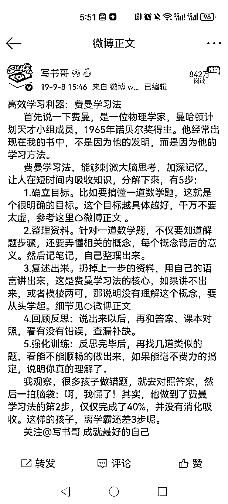
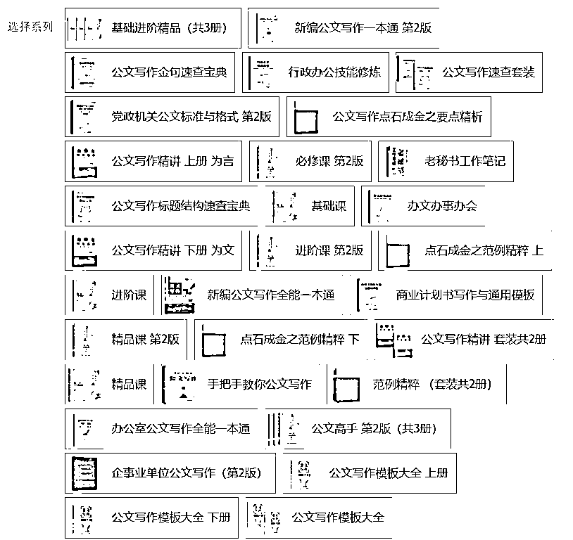
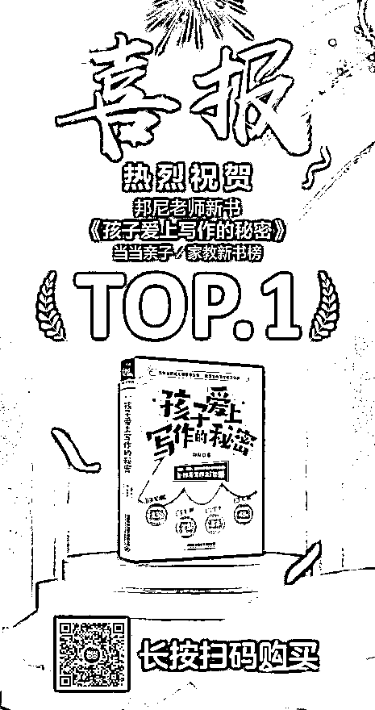
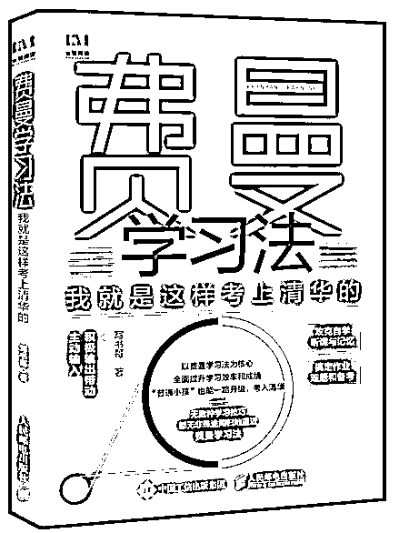

# 都想出本书，如何做到一本书畅销 30 万册

> 原文：[`www.yuque.com/for_lazy/thfiu8/gfltesewgdxc8s5c`](https://www.yuque.com/for_lazy/thfiu8/gfltesewgdxc8s5c)

## (91 赞)都想出本书，如何做到一本书畅销 30 万册

作者： 写书哥

日期：2023-11-24

大家好，我是写书哥，在图书行业摸爬滚打 20 多年，每年出版 100 多本书，累计出版 1000 多本书。今年图书市场非常惨淡，我这里的几本头部品种，在各类排行依旧是第一，但销量下滑了 30%。

这种情况下，我今年出了一本现象级爆款《费曼学习法》，出版半年销量 30 万册，这在平均销量几千册的图书市场，很不容易。

今年六一儿童节，我还做客刘润老师的直播间，分享学习方法，当天带货 2000 本。上个月，我的两本费曼学习法被“得到 APP”选中，上架到他们的电子书栏目。

接下来是我的复盘。

## 一、图书市场概览（不感兴趣的，可以略过）

20 年前，我刚入行时，正是图书市场的高光时刻，一本 AutoCAD 教材的稿费，能在北京买套房。

接下来就是漫漫下跌路，图书行业成了夕阳行业。

随着自媒体、短视频的崛起，图书总销量越来越低。即使这样，每年依旧有爆款书出现，但爆款逻辑和 10 年前完全不同了。

1、**图书种类**

图书种类很多，比如教材类、小说类、名人自传类、经济管理类、投资理财类、少儿绘本类等等。

我擅长是所有技能类图书，也就是教人某个本领的，比如计算机编程、人力资源、财务报表、期货炒股、学习方法、社群运营、私域流量、副业赚钱，这些领域都做过市场前三的产品。

2、**作者种类**

从作者的角度，可以分三类：

A、畅销书作者：莫言、刘慈欣、刘润…

B、普通作者：有一定宣传能力，但有技术能力，书有一定市场需求

C、自费作者：书的市场需求很小，或作者没有宣传能力，或者评职称、打造个人品牌

A 类作者是香饽饽，属于各大出版社的争抢对象，我就不掺和了。

我擅长的是 B 类作者，挖掘“实力强、影响力不强”的作者，通过图书打造个人 IP，放大影响力。

本质上，书是个人品牌的背书。

李笑来曾经讲过他的故事，录音门事件后，很多人质疑他。果麦（国内前三名的出版公司）的老板和他说，一个人是不是被主流认可，出书就是标志，如果这个人有污点，作为国家喉舌的出版社，即使他的书再畅销，也绝对不敢给他出书。

果麦老板让李笑来写本书，然后他来出版，李笑来觉得有道理！一晚上写出了《韭菜的自我修养》。

3、**出版社种类**

首先明确，所有的出版社都是国有企业，所有的书号只有出版社能获得。其它私人公司，比如果麦、读客、磨铁，他们做得很好、很大，但必须从国有出版社拿书号，书号是书的身份证，没有书号就是非法出版物。

所以，市场上那么多出版机构，可以大致分成两种：国有出版社、私人出版公司。

而国有出版社根据盈利方式，又分成两种：

**A、靠销量盈利的出版社：**只有一少部分，比如中信出版社、机械工业出版社、清华大学出版社等等，他们很少做自费书，有市场开发能力，能做爆款。

**B、靠作者自费盈利的出版社：**有一大半出版社没有市场发行能力，只能靠合作出书（本质上是利用书号资源），也会和私人出版公司合作。

要想让自己的书畅销，千万不要和 B 类出版社合作，我曾经吃过亏，他们许诺的很好，等出版后，在当当、京东上架，根本没有运营，销量惨不忍睹，赔钱后我终于明白，被忽悠了。

## 二、如何从红海中找到蓝海

教育内卷越来越严重，家长们都很焦虑，同时催生很多教育大 V，也带动图书市场竞争激烈。

在京东搜索“学习方法”，你会发现每个作者的标签都金光闪闪，比如清华学霸、北大学霸、哈佛学霸、特级教师等等，再加上流量加持，很难和他们竞争。

我也为此烦恼，试图打破僵局。

“学习方法”是个好赛道，可惜高手太多，我怎么能独辟蹊径呢？故事发生在 2019 年。

我写微博时，偶然有粉丝提到“费曼学习法”，我觉得挺有意思，就整理了一下，结合自己的学习经验，写了一篇文章，没想到，这篇文章爆了，获得 800 多万阅读，超乎预料的好。

作为出版人的直觉，我就研究《费曼学习法》是不是可以变成一本书。研究的第一步是看竞品，到京东搜索这个关键词，居然一本都没有，这是好消息也是坏消息。

好消息是，费曼学习法这个关键字，完全没有竞争对手，可能会大爆；

坏消息是，这么多出版社都没出这本书，意味着大家都不看好，也许是个赔钱货。

很纠结啊。

这时，就要说到我的做书理念：**把每本书当做一个风险投资，每年尝试 3 个高风险高回报的品种，即使再多人不看好，我也要赌一下。**

历史证明，我赌赢的概率很大，都取得了超额回报。这次的费曼学习法也是如此。

在这个指导思想下，我安排员工找作者，目标是教育博主、高校老师、清北学霸。可惜，找了一年多，居然没有满意的作者。

绝大多数回复是：“费曼学习法”很简单，1000 字就能说明的事情，要写 10 万字，不可能！

我很着急，但是没办法，巧妇难为无米之炊。

没想到，2021 年初，市场上第一本《费曼学习法》出版了，销量出奇的好。一年时间，在当当就有 2 万多评论，预估销量 10 万册以上。

我的心在滴血，总觉得自己的钞票被别人抢了。仔细研究发现：

1、这本书作者是专科学校的老师，没名气、没流量，属于普通作者，他们自己没有号召力，对销量贡献不大。

2、在百度、公众号、微博等宣传平台搜索这本书，只有极少的读书笔记，没有新闻报道、直播带货等信息，说明出版商极少宣传的情况下，还能卖起来，说明选题本身吸引人，抓住了读者的痛点，这是图书策划人最喜欢的选题方向。

**爆款=需求大+竞品少+营销少，**这妥妥的红海中的小蓝海。

## 三、同一关键词的差异化竞争

发现关键词后，我又遇到一个难题，竞品的势头起来了，在当当、京东、淘宝都占有有利地位，销量多、评论多，排行也靠前，如果我做一本类似的书，当万年老二，也能卖一些，但绝对卖不过第一本。

你可以回顾一下买书流程：

想买一本《直播带货》的书，直接到当当搜索这个关键字，然后按照排行挨个看，找到满意的下单。有耐心的话，能看 10 本就不错了，大概率只看前三名。

还有一种可能，你是某个作者粉丝，直接搜作者名下单。排名靠后的书根本没有机会。

**Tips：**说个出版行业潜规则，也有专门的刷评论公司，当当网上一个评论一块钱，很多书是这么操作起来的。

再说个京东的数据假象：京东有个规定，必须买书后才能评论，不能像当当那样请朋友免费刷评论，但这也就完美了么？

不是的！为了数据好看，京东也做了一些小手脚，这里告诉大家：

大家在京东上看《公文写作金句》这本书，评论有 10 万个，绝对是爆款啊。

但是且慢！这 10 万不仅仅是这本书的评论，还有其他一大堆书的评论，在这个页面中你会看到“选择系列”，见图 2，京东把几十本公文写作的书做成了一个系列，这 10 万评论是本系列所有书的评论总和。是不是有点坑？

如果想看这本书自己的评论，需要在评论栏目中选择“只看当前商品评价”，这样才会筛选出来。很多不明真相的读者，看着评论多，就下单了，其实被虚假评论忽悠了。

回归正题，我该怎么和它竞争呢？接下来就要找对手的软肋：

1、作者没有名气，没有名校光环，没有大 V 加持。我可以在作者维度，直接碾压这本书。

2、第一本书属于励志书，主要针对成年人。但事实上，学习不是成人的刚需（赚钱是刚需），爱学习的是少数。针对中小学提分才是刚需，我要做一本更聚焦、针对性更强的《费曼学习法》，全书讲解提分。

明确目标后，我安排编辑继续找作者，又找了半年，有几个人尝试，我对他们的内容都不满意。

有一次，公司开会，我慨叹：“这么一本书，找了快两年，居然搞不定。再这样，我就要自己写了。”

没想到，合伙人强烈支持这句玩笑话，他说：“你在微博上讲了很多学习方法，也不止 10 万字，把它们梳理出来，这本书就成了！”

更重要的是，我的身份正好符合差异化竞争，清华学霸讲学习方法，家长们买账。我也觉得有道理，用费曼学习法搭建框架，把微博内容填入其中，两个月的时间，这本书就完成了。

注意，这是我的第一本《费曼学习法》，不是主题中的 30 万爆款。

在作者介绍部分，我专门强调“写书哥来自农村，没有参加过任何培训班，也没有依靠父母指导学业，凭借对费曼学习法的运用，一路从村小考入清华大学。”

很多家长反馈，就是冲着作者介绍下单的。

## 四、图书销售逻辑的变化

5 年前，图书销售是电商模式，把书挂到当当、京东、淘宝，读者自己选择，也就是“人找货”，这时只要搞定排行榜，就有持续的自然流量，持续销售三、五年不成问题。

我曾经占了炒股、人力资源、财务报表、机器学习这些大门类关键字，赚的盆满钵满。

自从抖音、私域崛起以后，这模式玩不转了。当当和京东流量枯竭，即使占到排行榜前列，销量也不大。

再说个好玩的，当当在几年前调整了策略，到各个平台开店撸流量，比如淘宝上有当当、京东上有当当、拼多多上有当当、抖音上有当当。

同样一本书，当当在不同平台的折扣都不一样。当然，价格最贵的是当当的独立 APP，当当的忠实客户反而花钱最多，让人哭笑不得。

2020 年以后，图书也变成了“货找人”的模式，也就是说，读者自己也不知道要买什么书，看到博主推荐，就顺手下单。

这个转变很要命，以前的宣传渠道不管用，需要开辟新渠道。

新渠道就在眼前：找博主推荐，最好能有购买链接，读者感兴趣直接下单。这件事说起来简单，做起来很不容易，针对不同博主：

1、头部带货博主，比如李佳琦、刘媛媛、王芳，要求全网最低价，同时佣金比例也很高，再加上一件包邮，卖一本赔一本，在他们那里卖货只能赔本赚吆喝，宣传品牌。

2、粉丝百万的博主，大部分要坑位费，书的利润太薄，出版社花不起。上个月有本心理学的书，请一位全网粉丝 2000 万的博主带货，坑位费 12000，最后只卖出去 300 本，亏大了。

3、草根博主，这才是真正的蚂蚁雄兵，粉丝量不大（几千～几万），更有热情，会认认真真读书，真诚推荐，转化率很高。

要想走得长久，前两类都要慎重，只有和草根博主合作，才是生存之道。我的《费曼学习法》就是联系了几百位草根博主一起推，才形成了影响力。

以前的图书销售路径，是从电商（当当、京东、淘宝）起步，然后扩散到自媒体平台；现在是从自媒体平台起步，扩散到电商。

## 五、《费曼学习法》的 0 启动

说实话，这本书刚出版时，发行并不看好，按照常规书印刷和发货，投放到市场两周后，销量一般般，效果不好。这时我做了一个关键动作，把书带起来了。

这个动作是快团团，3 年前，用快团团的出版社很少，我也是在粉丝的推荐下尝试一下。我在微博上发现几个问题：

1、读者很懒，他们希望扫码下单，立刻下单。

以前我都是在微博上写书名，告诉读者到当当、京东购买。这种转化率极低，因为还要打开 app，再输入书名，这个动作太复杂，读者直接放弃。甚至加微信都是如此，我曾经测试过，在微博上写微信号码，和二维码相比，加人数量会少一半。

2、从众效应明显。

当大家都买一本书的时候，你也会跟着下单，这就是快团团接龙的可怕之处。我在自己的粉丝群中发快团团链接，连续接龙上百条，其他粉丝怕错过好书，也就跟着下单了。

3、喜欢赠品。

为了拉起销量，我和一位教育博主联合，赠送价值 498 的课程，相当于为他引流，因为他有一系列课程，如果读者觉得赠送的课程好，还想深入学习饿，就可以购买其他课程。

在快团团发布后，很多粉丝接龙购买，这本书先在微博上火起来了。我趁热打铁，联系自己的学员带货（3 年前我开办微博写作训练营，培养出上百个大 V，其中一大批是教育博主、育儿博主）。

这些大 V 对我很了解，推荐起来不遗余力，销量很快冲破 10000 本。

在这过程中，发生两件事：

1、帮博主变现：

很多博主本来是记录家庭生活，在微博上发一些自己的小故事，不知道如何变现，刚开始有畏难情绪。快团团对新手十分友好，只要发给他们一个帮卖链接，博主在微信上一点击就 OK，不用注册、验证之类的，很简单。

更重要的是，佣金实时结算，卖出去一本立刻有收入，这种感觉太棒了。现在还有博主感谢我，通过快团团变现，每个月有了更多零花钱。

2、坏事变好事：

我在快团团上设置库存 2000 本，由于销售过于火爆，超出预期，居然把 2000 本卖光。当时是晚上，很多粉丝没法下单，在我的微博评论区询问。

我正好睡觉没法处理，有些等不及的读者，直接从淘宝、当当下单，把其他电商平台的数据给拉起来了。

因为一个小失误，不仅私域热销，公域平台的很多店铺也开始重视这本书，这让我体会出“饥饿营销”的威力。当一个产品稀缺时，用户反而更愿意下单。

## 六、只有头部才有特权

经常有作者问我：畅销书要具备什么条件？

这类作者有一定粉丝、但还不够多，自己能带出去两三千本，接下来就后续乏力，毕竟信任你的人就那么多，他们只会下单一次。

所以，一定要珍惜这部分初始流量，用它撬动更大杠杆。我是这么做的：

**1、扩展渠道：**

快团团卖爆后，赶紧和发行部门联系，让他们提高这本书的重要等级，在全平台上架，抖音、视频号、拼多多等等。

注意，现在平台很分散，出版社力量有限，默认情况下，只会铺货电商渠道，新媒体渠道铺货很少。

**2、互链引流：**

读者买书时，经常会成套买书，比如一下子卖 3 本、5 本学习方法的书，如果把我的《费曼学习法》和其他同类爆款放到一起，自然被选中的概率大。

当然，如果自己的书销量太低，会被其他书嫌弃，前面表现好自然就有了谈判空间。

**3、重点展示：**

在各个店铺中，都有重点展示位，比如进入当当的经管书店，会有 Banner、主编推荐、新书上架、重点关注等栏目，能上到这些栏目中，就会增加曝光机会。

后期我推荐一大批粉丝到淘宝的当当店购买，一下子把当当的数据拉起来了，也就获得了更多的当当展示。

这里再说个小秘密，当当主店（也就是当当 APP、[dangdang.com](http://dangdang.com)）已经变成展示平台，这里的书大概率更贵。

反而当当在淘宝、拼多多、抖音开的店价格更便宜，当当的淘宝店绝大多数五折包邮，而当当主店居然还有 49 元以上才免运费，简直是坑老客户。

还有，很多作者希望得到 NO1 的头衔，比如“当当管理类新书排行榜第一”，听上去响当当，其实这个成本很低，只要单日销售 1000 本就能拿下。

注意，这 1000 本不一定要在当当主店买，可以在当当的淘宝店、抖音店、拼多多店下单，这些数据都会汇总到一起，算到综合排行中。

这么一套组合拳下来，就可以妥妥的做海报，进行二次宣传。把各种 NO1 的头衔按到自己头上。比如《孩子爱上写作的秘密》，就是这么操作的：

我在刷《费曼学习法》排行时，就推荐了当当的淘宝链接，这样相当于同时刷两个平台：在淘宝有了销售数据，在当当进了排行，一举两得。

大家以后买榜的时候，千万注意，到淘宝店去买榜，而不要去当当主店。

**4、折扣优惠：**

折扣是出版社的命根子，出版社的利润是图书定价的 10%左右，每降低一个点，利润就减少 10%。所以，越是不畅销的书，出版社越不愿意降价，确保卖一本赚一本。

除非这本书很畅销，出版社愿意打造爆品，才会降低折扣。

趁着我的《费曼学习法》畅销，编辑向社里申请五折包邮（到手价 29.9，很便宜），给到渠道商就四折左右，这个价格就固定下来了。

当这本书名气起来以后，很多书店为了抢流量，甚至愿意不赚钱，低价销售。

**5、二次传播：**

想办法做读书会，把读者拉到一起，大家写读书笔记，发朋友圈、发微博、发抖音，这样既宣传了自己，有帮助了读者。

很多读者买书以后不读，但是在读书会这个氛围中，看到大家都有收获，他也会跟着翻一翻，书中的某句话能给读者启发，那他就没白花这 30 块钱。

**6、抖音卖爆：**

初战告捷后，就要考虑如何扩大战果，我又盯上了抖音，希望借助这个最大的流量平台卖书。

说实话，刚起步的时候很困难，因为竞品比我这本早一年，已经在抖音卖了上万册，只要读者搜索这个关键字，它就排在前面，我有天然劣势。

这是每个新品的魔咒，必须打败大 BOSS，自己才能变成大 BOSS，我在抖音没有粉丝，怎么办？

行使头部特权，邀请出版社在自己的直播间重点推这本书，有一部分初始销量。然后广撒网，邀请众多小博主带货，经过一个多月的时间，销量到了 5000 册。达到这个级别后，其他博主也愿意带这本书了。

这么操作下，这本书销量滚滚向前，每个月销售 1 万多册。

## 七、第二曲线走起

按说，做到这种地步，我就可以高枕无忧了，自己的《费曼学习法》销量和竞品持平，按照图书销售规律，可以躺赚两年，最后销量达到 20 万册。

这是我考虑的是，怎么一鱼多吃。

出版界有个规律，一旦有爆品出现，其他出版社会大量涌入，分抢胜利果实（就像我分抢第一本的市场份额一样）。

我给起了个名字“填坑策略”：当发现一个蓝海大坑，不要只放一本，而应该细分需求，把这个坑填满，因为竞争对手也会发现，你不填别人也会填，干脆走自己的路，让别人无路可走。

到底怎么做呢？如何和前两本做出差异化呢？

第一本竞品针对的是成年人；我那本针对的是中小学生，全书密密麻麻有 10 多万字，读起来很辛苦，有没有可能简化一下？

于是，漫画版的想法应运而生，在抖音的持续火热下，用户对文字越来越不敏感，反而更喜欢读图，干脆，我做一本漫画版吧。

文字版

漫画版

经常有读者问，文字版和漫画版有什么不同？

其实这是两本完全不同的书，漫画版并不是文字版的缩写，而是独立的体系。

文字版针对四年级以上的学生，他们能深度思考，能持续看文字；漫画版针对四年级以下的学生，这本书彩色印刷，图片占到一半以上，字大行稀，信息量是文字版的四分之一。

在我看来，文字版内容更好，漫画版内容太小儿科了，只是为了加深护城河，做的防守型产品。没想到销量超出预期。

现在复盘，超预期真的讲究天时地利人和，具有随机性，甚至有戏剧性。下一节详细拆解。

## 八、天时地利人和

2022 年口罩原因，北京经常封控，出版社是国有单位，严格遵守国家规定，编辑经常在家办公，效率极低，2022 年出版的新书很少。

所以，去年我很郁闷，每天被作者催，最长的一本书，交稿 2 年还没出版，大家都在苦熬，这是大大的坏事。

没想到，转折来了。

**1、天时：**

2023 年初解除封控，出版社编辑也都正常上班。大家憋了三年，都想大干一场。尤其发行部门，需要新书打开声势。

但去年的新书很少，能拿得出手、确定能畅销的更少。

恰巧，我的《费曼学习法（漫画版）》出版了，由于文字版很畅销，发行对这本书有信心，于是把他选为重点书。时机刚刚好。

**2、地利：**

本来我的书在经管分社，应该按照经管渠道发货，文字版就是通过经管渠道宣传的；

没想到，漫画版被少儿分社的发行部看上了，他们的渠道都是妈妈相关的博主，和我的书更贴合。

这一点非常重要，很多产品质量很好，可惜“定位”出错，没找到合适渠道，白忙活一场。

正好说一下，学习方法、绘本、科普类图书，和 K12 教育一样，有用户偏差问题，使用者（孩子）和付款者（家长）分离，要想让孩子看到书，必须先说服家长，让家长认为这本书有价值，喜欢这本书，怎么让家长喜欢呢？

万维钢的《高手》中说过一个结论：喜欢=熟悉+意外。

对于《费曼学习法》来说：“熟悉”是我的清华大学标签，全国家长都希望自己的孩子考上清华；“意外”是“费曼”两个字，很多家长不知道费曼是谁，当看到书中介绍，费曼参与研发原子弹，是诺贝尔奖得主的时候，发现这是一位超级大神，立刻膜拜。

于是喜欢产生了。

**3、人和：**

被选为重点书后，还需要有人执行，幸运的是，全面负责这本书营销的可可非常给力，她联系了很多博主带货，同时对接百万级别的博主和我连麦直播。

就是在这个时候，联系上了刘润老师，在六一儿童节连麦直播，一个多小时卖了 2000 多本书。

从今年 6 月份开始，全网掀起《费曼学习法》的宣传高潮，抖音、小红书、视频号有一大批博主主动推荐这本书。微博上很多人做读书笔记、画思维导图，不用我主动送书邀请，读者自发行动起来了。

抖音上卖书排名第一的王芳也对这本书感兴趣，用 10 多分钟推荐这本书，当场销售 2000 多册，可惜折扣太低、佣金太高，在那里卖一本赔一本，就当做营销费了。

## 九、自媒体/创业者出书

5 年前，我这里的作者主要是专业技术人士，比如程序员。

自从疫情之后，自媒体人/创业者联系我的越来越多，因为大家发现，打工收入再高，也受制于公司，远不如打造自己的收入管道靠谱。

我这里也打造了很多畅销书，比如作者王振是浙江温州市的公务员，写作水平挺高。

利用空闲时间写了《公文写作实战秘籍》，出版后持续畅销，到现在卖了 5 万多册，他也成了公文领域的专家，很多人邀请他打磨公文，现在副业做的风生水起。

最近开始在抖音、小红书发力。

还有餐饮老板、财税专家、课外班老师、私域操盘手等等，他们出书后，增加了“作者”标签，势能更强，影响力更大，营收也增加很多。

**（一）出书的价值**

**1、确立行业地位，广告效应明显**

“作者”标签很稀缺，现在创始人、CEO、十大讲师这些标签太多太烂，“作者”标签能产生很强的信任感。

我有一个作者，写了一本《咖啡馆运营》的书，销量一般，他自己买了 1000 多本，放在店里供读者翻阅，很多顾客找他咨询开店，最后他搞加盟店，做的风生水起。

更重要的是，每个人都经过九年义务教育，对书有一种崇拜感，黑纸白字印在书上，和网上的文章、视频，重要性是完全不同的。

**2、书是非常好的引流品**

如果你有线上课程，用读书会的形式可以很快聚集读者，在读书会中发布课程，转化率非常高。一个做家庭教育的作者，在 300 多人的群中，转化高单价会员，一个月收入 40 多万。

另外，可以把书作为赠品，送给有影响力的人，他们帮忙推荐，效果更好。

**3、一鱼多吃**

很多自媒体人有自己的课程，这些课程稍加整理就是一本书，最近两年，我这里有二、三十本书是这么出来的，作者花的心思很少，本来课程就有逐字稿，再规范一下文字就可以了。既有名气又有收入，一举两得。

**4、书是结交朋友的纽带**

对于不太熟悉的朋友，没有聊天的由头，如果你出书了，赶紧给他们发消息：“兄弟，这是我的书，帮忙斧正啊。”无形中拉近了距离。

书还是最好的礼物。送大闸蟹太俗、送衣服不合身、送金条太贵，送书就不一样了，这可是知识啊，立刻感觉高大上了很多。

**5、书是传承的最好载体**

很多人是实干家，做事干净利落，也乐于助人，可时间有限，怎么能影响更多人呢？书是非常好的载体。就像我的《费曼学习法》，能帮到几十万人，如果让我一对一指导，一辈子也做不到。

更重要的是，书不会消散，五年后、十年后依旧存在。这也是很多商业资讯（比如华杉），企业家（比如曹德旺）愿意出书的原因。

**（二）自媒体/创业者出书，需要注意什么呢？**

**1、不要为了出书而出书**

有些作者创业多年，打不开局面，把出书当做救命稻草，这是不对的。出书始终是辅助，如果你的商业模式完善，需要扩大规模，出书对你有加持作用，实现从 1 到 10 的扩张。

如果主营业务始终亏损，希望通过一本书扭转局面，希望不大。

**2、稿费的收益不高**

2022 年图书零售市场总规模为 871 亿元，要分摊到作者、出版社、渠道商、印刷厂、造纸厂……还不如格力电器 2022 年销售额的一半。虽然有韩寒、刘慈欣、郑渊洁这些明星作者，但绝大多数作者稿费低得可怜。

如果想靠稿费盈利，还不如打工赚得多，性价比太低。

**3、出书周期比你想象的长**

一本书写作三、四个月，出版要半年左右（我这里有两年才出的），书籍涉及到意识形态问题，审查很严，而且越来越严，即使自费出书，也要 2、3 个月。

这和自媒体的快节奏完全不同，昨天一位数学老师想出套教材，寒假前要用，我真的做不到。后来建议她自己印刷一部分应急。

**4、写书是一把手工程**

上个月，有个大 V 想出本书，改了一个多月目录、样章，变了六七版，始终不合格，我就纳闷了：能做大 V 的，脑子绝对够用，怎么每次都改不到位呢？

昨天晚上专门给他打电话，结果发现，他把书交给助手了，让助手用他以前的文章整理，怪不得，这是必死之路！

我做了 20 年出版，出了 1000 多本书，老板让员工写书的，90%会死掉。只有一种例外：单独成立部门，这个部门的工作就是写书，书稿完成后部门解散。

如果想让员工保持原工作，同时写书，那简直是做梦。

无论老板说的多好，到员工那里都会转换成“你他妈的又想剥削我！”

更重要的是，员工的思维跟不上老板，老板自己写是 100 分的话，员工写连 50 分都不到，这么折腾来折腾去，老板、员工、我这三方都很累，最后无疾而终。

**（三）新手出书的几个大坑**

**1、自己闭门造车，没有出版社要**

每年都会有十多位这样的作者，他们拿着书稿找我出版，这些书稿都凝结着他们的心血，有些的写了好几年，说找了十多家出版社，人家都不出。

就像上周，有个作者是淘宝专家，写了一本 400 多页的淘宝运营书，用了 3 年多的时间，本来以为能大卖，结果现在淘宝走下坡路，出版社都不敢出，卖不动啊。

然后作者还愤愤地说：这是我多年的研究成果，这些出版社都眼瞎了，你看 JK 罗琳的《哈利波特》前面也被很多出版社拒绝了，出版以后不是全球热卖么。你只要帮我出版，这绝对是畅销书。

拜托！别拿哈利波特举例，那是小概率事件，更大的可能性是，这本书根本没有市场，所以我们不敢做，就这么简单。

全国几百家出版社，上万名编辑，不可能都眼瞎啊。

正确做法是，如果你有了想法，最好先找出版社聊一下，人家认可以后，你再动手，这样能少做无用功。

**2、别人都写过了，我要写一本新鲜的**

这也是新手的误区，比如外贸、跨境电商方面的书，已经有几十本、上百本了，作者就说我不拾人牙慧，我要做一本别人没写过的，这样是蓝海，更能显示出我的水平。

你放心，这些蓝海大概率是死海。就像前面那个闷头写书，不提前联系出版社一样，要看市场数据，如果这个技术已经有了好多年，始终没有书出现，那肯定是市场不好。

如果是个新冒头的技术，刚出现一两年，那还可以考虑。但这个新技术我们也会很慎重，去搜索技术的研发公司是谁，用户范围有多大。

我曾经出过一本数据分析的书，作者用了自己公司研发的资料库，书出版半年，公司倒闭了，里面的链接、案例都不能用，那本书课把我坑惨了。

所以，新技术、新方向一定要慎重再慎重，不出的概率远大于出版的概率。

**3、相信编辑承诺，然后吃了个闷亏**

很多作者过分相信编辑了，把大纲、正文发给编辑，然后编辑说很好很好，赶紧去写吧，作者就屁颠屁颠写了。

辛辛苦苦半年，写完了找编辑，编辑说这个选题方向不火了，领导说以后再出，一下子就把你给坑了。

还有更奇葩的，你写了半年再去找编辑，编辑离职了，人家说我管不着，给你介绍个同事吧。新编辑又不对你负责，拒绝你完全没压力。

很多作者都被这么坑过。那有什么办法么？签合同！

如果编辑说可以做了，你就反复追问什么时候签合同，要有出版社盖章的那种，如果没有合同，那这个书就是没娘的孩子，后面很容易出问题。

**4、追求完美，拖延症晚期患者**

这也是很多作者的通病，总想着认真准备，跟踪最新技术，结果忙活半天，1000 字都没写出来。

我们每年要签 200 多个合同，最后只有 100 人能出版，剩下的 100 人哪里去了？把自己写丢了，总想着出一本惊世名作，结果呢？连 2 万字都没写出来。

这是典型的拖延症，你要做的是每天制定计划，一天写一小节，哪怕 1000 字也好，逐步推进。

昨天和我的一个学员聊天，我告诉他每天 500 字，坚持 100 天就是 5 万字，200 天就是 10 万字，一半书就出来了。

只要保证不中断，你会发现越写越快。一定要牢记，先完成，再完美。

**5、自己不放心，非要找导师评估**

这时之前发生的事情，一个大 V 作者，他正在读博，准备写一本新技术的书，本来写的好好的，中间突然停了，我就很纳闷，出了什么事情？

原来他觉得自己资历不够，把写书的事情告诉了导师，希望导师把关一下。

导师知道后，说内容不错，提了两个无关痛痒的小意见。最后说了一句，你在学习期间写的书，经过我的指导，建议加上我的署名。

这下尴尬了，自己辛辛苦苦写了 10 多万字，这么轻飘飘的被导师拿走第二作者署名，就像怀孕 10 个月被人抢走孩子一样，作者心里苦啊，可有不好说什么，担心导师给他穿小鞋，让他延期毕业，就这么僵持住了。

现在一打开书稿就心烦，不想写。这就是典型把自己卖了的人，提醒大家，写书一定不要让领导或者导师知道，最差也要等书出版，生米煮成熟饭在说，不然很有可能被抢走劳动成果。

人在屋檐下，不得不低头啊。

那怎么办呢？我后来和这位博士说，继续写书，还是用他的名字出版，不给导师加名字，就说已经提交了，出版社不允许修改，把我们公司当成坏蛋就行了，这么诉几次哭，导师不高兴也只能接受了。

虽然话这么说，博士动力也少了很多。

这是典型的给领导递把柄啊，千万不要干这种蠢事。

还有一种情况，就是编辑请作者帮忙，挂个第二作者、第三作者，很多人也抹不开面子，最后弄得很膈应。

这是一定要坚决拒绝，不用担心，编辑出你的书是他的工作，也算他的业绩的。给他的朋友署名本来就不是你的义务。

关于自媒体出书，还有一些细节，可以看我之前的精华贴：[知识星球 | 深度连接铁杆粉丝，运营高品质社群，知识变现的工具 （](https://wx.zsxq.com/dweb2/index/topic_detail/582155555121584)[zsxq.com](http://zsxq.com)[）](https://wx.zsxq.com/dweb2/index/topic_detail/582155555121584) ，里面有选题定位、出版社和编辑的选择技巧、发行渠道合作技巧、如何增加图书卖点、如何连续爆款 10 年等内容。

## 十、总结

这两年图书市场很不好，出版同行苦不堪言，我能过得比较滋润，《费曼学习法》功不可没。最后说一下感想：

**1、不要在一棵树上吊死。**

刚创业时，我从计算机/互联网图书起家，在这个领域积累的作者、出版社人脉最多。可惜，从 2021 年开始，计算机图书市场萎缩严重，最近两年几乎没有签计算机相关的合同，我及时转型躲过一劫。

**2、命运掌握在自己手里。**

我的角色是作者经纪人，对接作者和出版社，以前特别相信编辑，他们说什么我就做什么，疫情后，市场变动大，曾经畅销的选题，现在不行了。

当初编辑信誓旦旦说能出版，过了半年，说领导不批，我毫无办法。

现在我学乖了，要做什么书，自己调查好主动约作者，这样最靠谱。本质上，还是自己不能偷懒，训练自己的市场敏感度。

**3、跟对大势事半功倍。**

为什么《费曼学习法》能畅销？本质上是教育焦虑，家长有需求，在这个社会风气下，同类书都不错。

同时期出版的《妈 这是我的人生》，内容很精彩，作者的影响力比我大很多，可惜销量始终上不去，这是一本缓解教育焦虑的书，家长们不认可，谁都没办法。

**4、数量是最好的质量。**

创业 20 多年，我做过很多畅销书、也做过很多赔钱书，如果让我总结规律，什么书肯定能畅销，我还是不敢 100%肯定。

很多事情尽人事听天命，有些我很看好的书（作者背景、宣传能力、内容质量都很好）就是卖不动；有些随手做的书，居然能卖 10 万册，这是个玄学。

预测某一本书很难，但预测一批书反而简单，比如我每年出 100 本书，总有三五本能畅销，这是个概率问题，所以持续做，数量是最好的质量，也就是所谓“大力出奇迹”。

**5、分清生意和朋友。**

我和小 A 合作了六、七年，出了四、五十本书，他为人豪爽，很讲江湖义气，唯一的缺点是心思不在业务上，在他那里出的书利润最低。

耐于情面，我每年都做几本帮他完成业绩，后来越想越不对劲，慢慢断了联系。现在反思，我居然贪图他的“情绪价值”。很多时候，生意和朋友不是同步的。

**6、靠书赚钱不是好生意，但通过书提高势能绝对是好生意。**

《费曼学习法》已经是现象级畅销书，卖了 30 万册，每本书稿费 4 元，收入才 150 万（实际上，很多书发货折扣很低，稿费不到 4 元）。

绝大多数书的销量只有 1 万册，写作 4 个月，出版 8 个月，折腾一年才几万块。

从现金的角度不划算，但从营销+势能的角度，完全不一样。我这里有很多作者，出书以后，通过书带来的周边生意（带货、讲课、对接资源）是稿费的几十倍、上百倍。

**7、蘑菇的周围还会有很多蘑菇。**

前面说了“填坑策略”，属于纵向挖市场，还有一个思路是横向挖，《费曼学习法》的本质，是名人+学习方法，这个思路能不能延伸呢？

肯定可以！比如西蒙学习法、艾宾浩斯学习法、思维导图学习法、心流学习法……这些都是可以打动人的选题，我也正在操作。如果你有合适的选题，也可以联系我。

**8、差异化思维。**

大家写书时，最好能选一个热门关键词作为书名，比如“私域流量”很火，但市场上的书太多了，竞争激烈，用这个词做书名能及格，但不优秀。

用“1000 个铁粉”做书名，立刻就不一样了。

**9、深度不重要，适合读者才重要。**

我有严重的理工科头脑，总觉得做书要“质优量足”，想把更多的内容写到书中，把读者喂饱。经常一本书写到 20 万字，排版密密麻麻，本以为这样读者喜欢。实际上，能认真读完一本书的人很少，能把一个思想讲透就是好书。

绝大多数读者是浅阅读，他们希望半天读完一本书，这样没有压力、没有负罪感。我从今年开始控制字数，通常 10 万字就够，采用 32 开，排版 200 多页，只讲最核心的部分，其它边边角角能删就删。

这是《费曼学习法（漫画版）》给我的启示，有一位家长和我说，孩子很喜欢这本书，坐地铁的一个小时就看完了，然后又反复看了好几遍，他还把这本书推荐给很多家长。

你觉得好不是真的好，大家都说好才是真的好。

好嘞，我的复盘就到这里，如果你有出书需求，可以加我微信：zzq0656，我会从市场和出版社的角度帮你分析。

* * *

评论区：

叶叶 _ 优势教练 : 都是经验之谈，感谢分享！
GEWO.GUO🌪 : 优秀
小鹅老师 : 干文
芷蓝 : 张哥太厉害啦
艾小飞 : 我也计划要出书，多谢写书哥的经验分享，分享得很细[强]

* * *