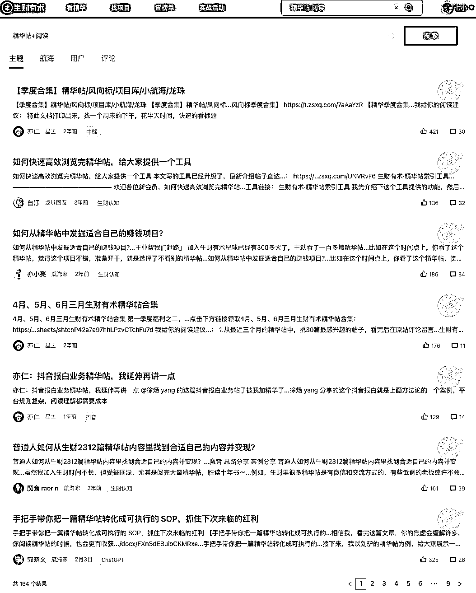
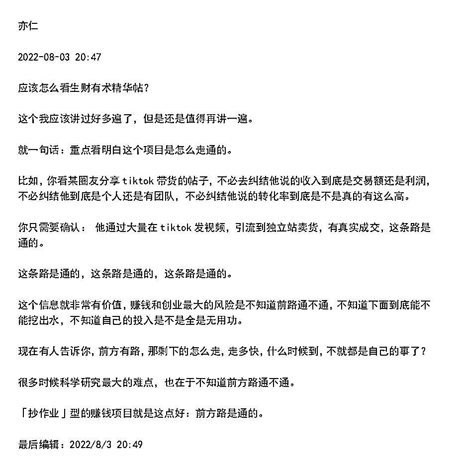
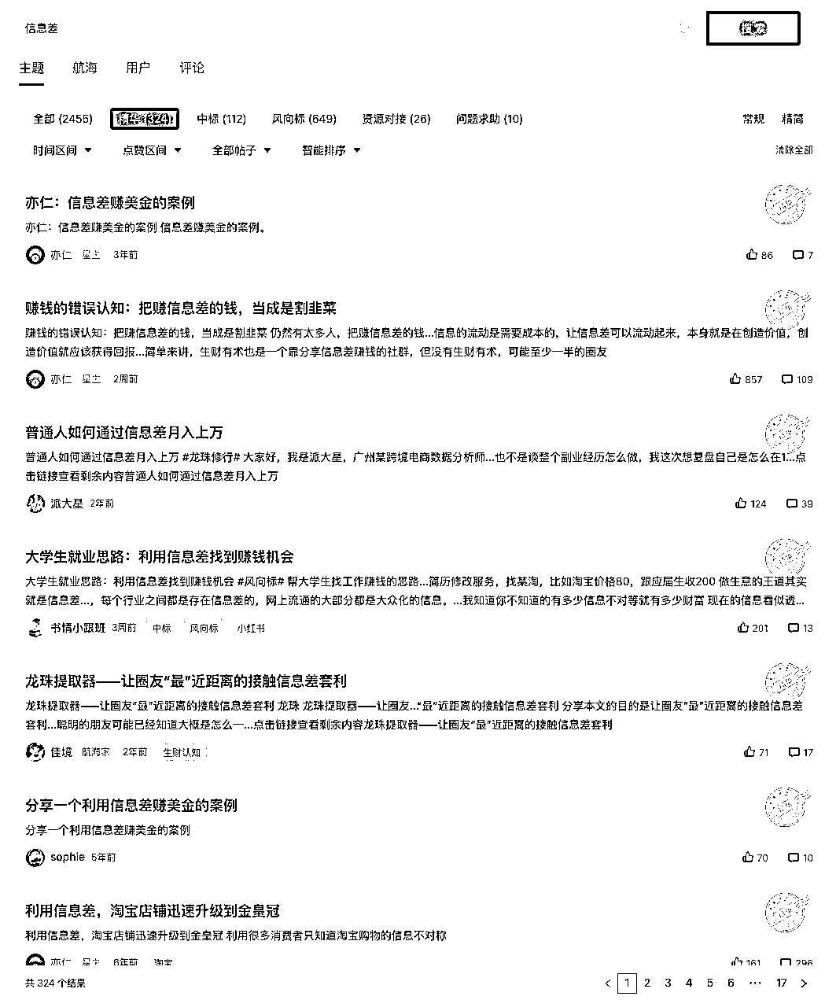
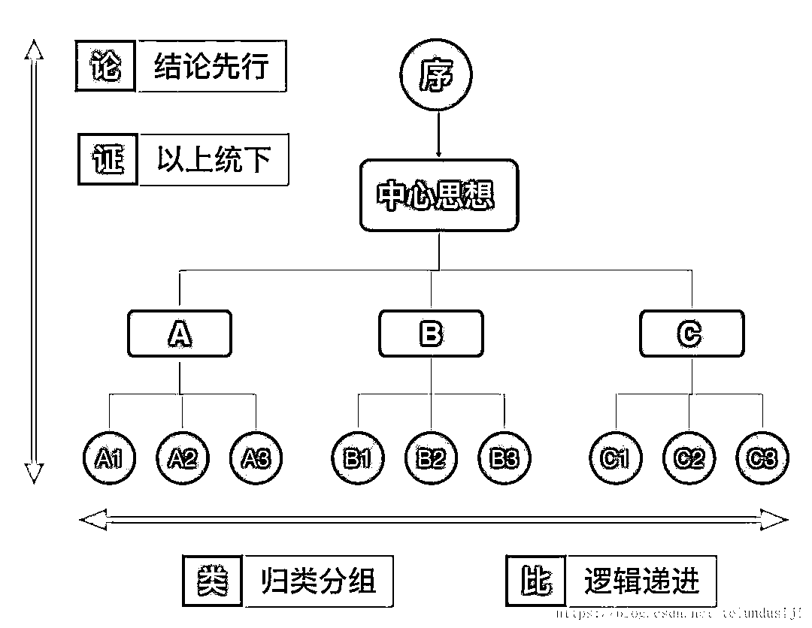
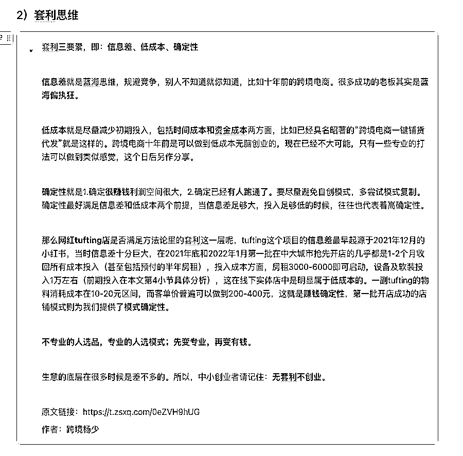
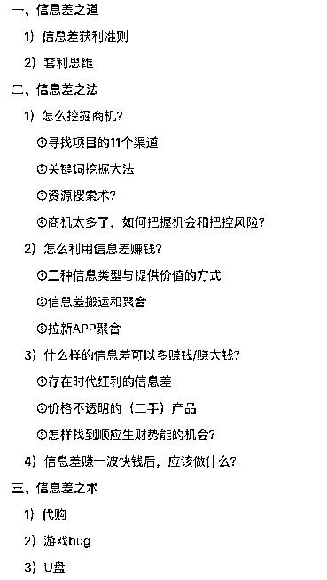
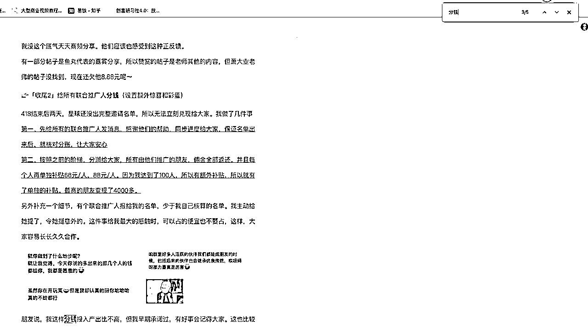

# 阅读精华帖的两种思路，你应该用哪种？

> 原文：[`www.yuque.com/for_lazy/thfiu8/nfo3qqzq78kk4giq`](https://www.yuque.com/for_lazy/thfiu8/nfo3qqzq78kk4giq)

## (48 赞)阅读精华帖的两种思路，你应该用哪种？

作者： 七小

日期：2023-11-01

《阅读精华帖的两种思路，你应该用哪种？》

大家晚上好呀，我是七小，人称生财课代表，知识管理专家。

感谢生财团队邀请，来给大家做个关于如何阅读精华帖的分享。前三个月外出学习了，好像没在航海群里冒泡了，这次来和大家分享，有种回到家的感觉，哈哈哈~

一些朋友在读精华帖的时候，会有这么一个问题：
看到星球有帖子更新了，就点进去看，看完之后感觉若有所获，但感觉过一段时间，又啥也不记得了，感觉这样子阅读很低效。想知道怎么阅读帖子，才能真正的吸收内容，学以致用，学以致富？

在我看来，阅读精华帖这个事情分成两种类型：
第一种类型叫做：搭建体系，吃透这个主题的全部知识。
第二种类型叫做：弱水三千只取一瓢，解决我的问题即可。

一些朋友喜欢先把一个事情的框架搭好，有了整体的认识再去行动，或者高手需要在自己的领域精进的情况，适合用第一种；而另外一些朋友，本身已经有项目在跑的，或者是喜欢先干起来再说，不懂再查书的，适合用第二种；

这两种方法一个横向一个纵向，没有好或不好之分，只要你在不同需求阶段，合理地去选择和应用就行。

下面咱们进入正文，来讲讲这两种阅读思路，分别该怎么用？

想要了解某个主题的情况，要做的是把这个主题的信息全部阅读一遍，清楚这个主题下面，都有哪些知识点？大致都是些什么意思？讲究的是一个 “全面”，使用的阅读方法是【主题阅读】。

我们先拟定一个主题，以这次分享的“如何阅读精华帖”主题为例，咱们演示一下，如果要研究【如何阅读精华帖】，该怎么操作呢？

操作步骤很简单：
打开生财搜索引擎，关键词搜索 “精华帖+阅读”，然后我们就可以看到一些关于【如何阅读精华帖】的帖子，内容显示了有 9 页，咱们一页页的翻阅，把觉得符合主题的信息给挑出来。

最后精选出你觉得比较有价值的信息，保存下来，反复翻阅，比如我这里找到的是下面这几篇内容。大家有空了也可以翻一翻。

如何用清单思维，打造自己的赚钱兵器库？

生财精华帖阅读法

精华共读航海实战，我之方法论

当你想查看某个主题，但星球里没有现成的、别人整理好的系统性内容，那么就需要你自己做专题整理了。

这时候我们需要玩一个【拼图游戏】，先去搜索、获取大量的碎片化信息，再一点点拼凑起来，变成自己的一份系统性的资料。

以“信息差专题整理”为例：
这是我当时翻了【信息差】关键词的所有帖子，然后拼出来的。

那如何玩这个【拼图游戏】，把碎片化的信息给体系化呢？

这里要用到的思维工具是【结构化思维】，由于时间有限，我这里只做简单分享。
如果你想深入学习这个方法，那我推荐去微信读书翻一下芭芭拉的《金字塔原理》，还有李忠秋的《结构思考力》，这两本书很好的阐述了【结构化思维】的用法。

代入到信息差这篇文章的整理，操作步骤就是这样：

生财搜索引擎，查找【信息差】关键词，把所有你觉得和这个主题相关的帖子都打开。
这里可以使用的工具是浏览器插件【OneTab】，用来保存你打开的 100 篇文章。
（它的功能是把所有页面折叠到插件页面，如图。如果你直接常开着 100 个页面，会卡死的）

把这 100 篇帖子，分批次打开，20 个一组。然后把内容快速看一遍，觉得和主题无关的帖子就关掉，有关的就留下。
这步处理完，100 篇帖子，大致会剩下 60 篇有关的帖子。

每篇帖子都有几百到几千字，和信息差这个词高度相关的内容，可能也就三五百字，把这部分的内容复制出来，另外粘贴到一个飞书文档里。比如下图。

把你觉得内容相关的主题，给放到一组里。 比如信息差文章中，有很多讲信息差的案例的，就把它们先放一起去。

内容分成几个大组之后，接下来就需要去创造一个框架，把所有组别的内容给统领起来了。这里没有啥取巧的方法，得靠平时你对思维模型的积累了。
思维模型里常用的有，这里套用刚好合适，所以，这篇文章的目录，就用【信息差的道法术器】了。

这种【结构化思维】处理信息的方式，步骤就那么几步，方法没啥特别的，难点在于大量的训练，熟能生巧。
我到现在能看几眼就把框架搭出来，中间是经过了近 3 年的，大量的信息处理训练的。如果你一开始做不到，那很正常，没关系的。你可以先从 5 篇、10 篇文章，搭配思维导图 XMind 来处理，开始练习。

结构化思维，在你做项目的时候，也能帮助你更快速定位问题所在，有助于你解决很多问题。

下面我们再来说另一种学习方式 【解决自己的问题】导向的学习。

这种学习方式讲究的是：字典式查询阅读、说明书式边操作边学

她里面讲的要点，我都不是当文章看的！而是当 todo list，直接对照着去做的！如下图：

像这种实操性的极强的文章，就不是用来看的，而是当做【说明书】【待办清单】，对照着去写下你要做的事情，一步步跟着操作的。

以及，如果你是已经在实操着项目，只是遇到了一些卡点，想针对性找问题解决方案的。那你是不需要看完全文的。

搜索引擎查询项目关键词--打开全部相关文章--Ctrl F 查询你的问题关键词-- 针对性的阅读片段即可。如下图。

要像查字典的一样的去翻帖子，以解决你的问题为导向去看，这样效率才最高，才能学以致用，学以致富~

以上就是本次分享的全部内容了。
总结一下 2 个阅读精华帖的思路：横向思路训练的是思维和能力，纵向思路解决的是当下的问题。
我自己在做项目的时候，这两种思路都会用到，希望对你们也有所帮助~

* * *

评论区：

暂无评论

* * *