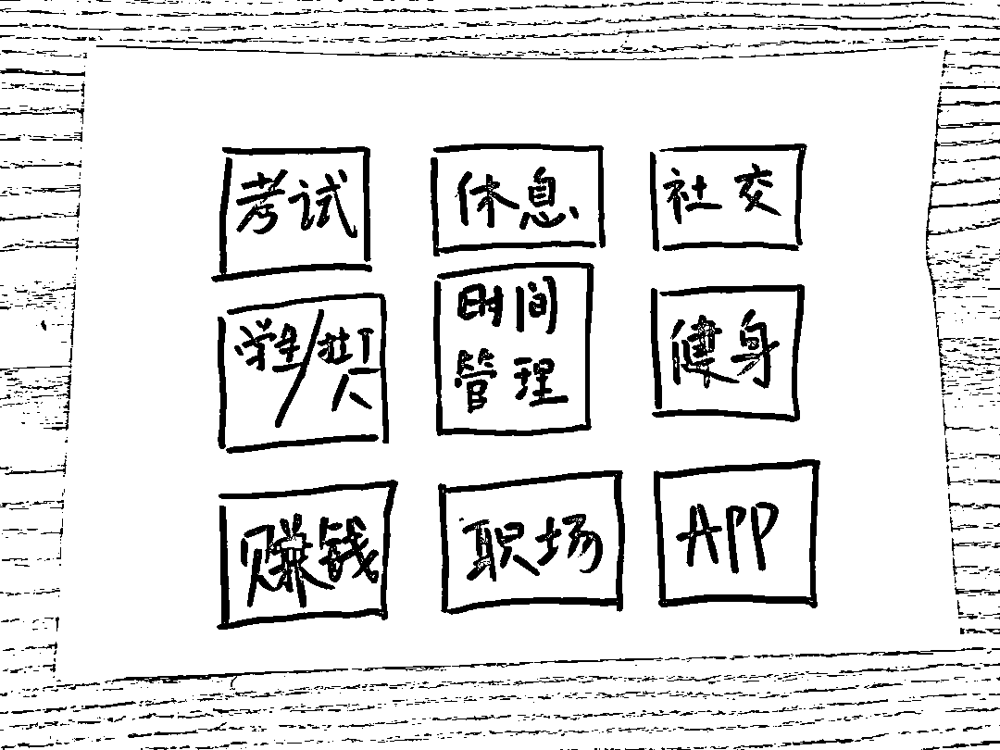

# 时间管理赛道如何通过打造个人 IP 来变现？

> 原文：[`www.yuque.com/for_lazy/thfiu8/bas2behe62mthern`](https://www.yuque.com/for_lazy/thfiu8/bas2behe62mthern)

## (44 赞)时间管理赛道如何通过打造个人 IP 来变现？

作者： 芷蓝

日期：2023-11-23

我是芷蓝，个人 IP 营销创业教练，今天给生财的小伙伴分享一些关于时间管理赛道营销变现技巧和逻辑。

文章会涉及到时间管理 IP 定位、时间管理领域的选题、内容填充、以及小红书、抖音等多个平台的引流方法、时间管理知识付费产品产品打造等模块。

**一、时间管理赛道如何做个人 IP 定位？**

首先，我们要知道一个精准的定位是包含了以下 3 个元素：

**1、你的人设是什么？**

**你是谁，你的身份是什么，你的标签是什么，这个就是人设。**

比如说，针对时间管理这个赛道，你的身份可以是一个大学生，你的标签可以是“爱折腾”。

比如说，你身份还可以是一个职场新人，你的标签可以是“斜杠青年”或者“副业达人”。那么你的人设就是：95 后职场斜杠年轻。

记住一个逻辑，**人设一定是要服务于自己的定位**，你未来要卖时间管理的课程，所以人设可以是斜杠青年，但如果你写一个自己喜欢做各种美食，虽然是真实的，但对你未来做的个人 IP 营销就意义不大。

真实是真实，但是我们要有针对性的选择，一切服务于自己的业务。

**2、你的目标用户画像是谁？**

**做 IP 定位的底层逻辑就是帮助某类人，解决某类问题，这个“某类人”就是你的用户画像。**

用户画像非常重要，因为一旦你确定下来，后续的你内容输出和产品，都将服务于这个画像的需求。

拿我自己来说，我踩过一个大坑，之前我的用户画像是“想做新媒体副业”的人。

我的所有内容都是围绕着副业的话题去写，后来我就发现，想做副业的人执行力和支付能力都太差了，确实引流了不少人，但是成交率很低，用户抱的预期又过高，且他们的认知能力和执行力不高。

最后的结果是，很多人过来白嫖你的资料、时间精力，但就是不付费。

付费的人，因为自己啥也不懂，而且平时工作忙执行力不到位，最后没啥结果，但是他们会觉得是你的价值没给到位。

我深度思考和复盘了很久，结果我发现，当前自己的状态算是一个新个体，团队很小都是线上，但全职于自媒体，就是自媒体个体全职创业。

和我同频的人，可能身处于各个赛道，但是他们都是全职出来自媒体的，所以他们的支付能力和执行力都很强。

于是，我果断把定位修改升级到：服务于自媒体创业者，帮助他们通过个人 IP 营销来提升自身的商业价值。

这样，我的目标用户就是和我一样的自媒体创业者，用户预期就是“提升商业价值”，这个是长期的复利收益，并不是像自媒体副业项目一样，追求短平快的短期收益。

随之更改的就是我的内容输出，从副业项目的拆解推荐，变成了个人 IP 营销、创业心法、创业故事等内容。

果然，当你的定位和内容输出修改后，引流过来的用户质量有了很大提升，大部分人是已经创业跑通闭环，看到你的内容觉得对他们当前的业务发展很有帮助，过来付费跟你链接。

还有一部分人是之前在职场上就很有能力，且有经济基础，现在打算离职后全力创业。这种人有很强的执行力、决策力和支付意愿。

目标用户变化之后，随之后来的是收入的 10 倍增长。

那么，**在时间管理这个领域，你的目标用户应该是谁呢？**

从我的角度来看，**用户画像需要跟你个人的身份、经历以及市场需求做融合，找到最适合你的那一部分。**

举个例子，比如说如果你当前在职场，或者说在职场上取得过比较不错的成绩，做到了更高的管理岗位，那么你的时间管理用户画像就应该是职场人，这样你在描述他们的痛点时，就会比较清晰，而且你的知识付费产品就不缺案例。

但是如果你之前职场经历很一般，没有什么亮眼的职位，且现在已经是全职自媒体人创业了，那我就不建议针对职场人了。

你也许做自媒体赚钱很高效，但是这一套逻辑拿到职场上就不一定有效了，那你的用户画像就应该是做自媒体创业者，帮助他们通过时间管理释放自己的潜能，减少自己的精力消耗等。

总结一下，做用户画像，首先你要确定这部分用户是有真的痛点，其次要有支付能力，最后要和自己的身份、经历和市场需求相关。

**3、你能为用户解决什么问题？**

你的人设和用户画像确定之后，还有 1 个最重要的元素，就是你能为用户解决 xx 问题，或者为他建立一个 xx 新的需求场景。

其实上面已经说过了，时间管理这个赛道，不同的用户画像，有不同的场景痛点。

比如说，针对像我一样的新个体，通过个人 IP 来赚钱，那么我在时间管理这方面的需求可能是以下 3 个：

***（1）如何判断对于自己来说真正重要的事情？***也就是说，当前这个阶段，我花费时间做什么事情才是利益最高的？

这个也是做时间管理赛道最高级的服务方式，帮助用户来梳理自己的四象限，重要紧急的是什么？重要不紧急的是什么？紧急不重要的是什么？既不重要，有不紧急的，平时一直在浪费你时间的是什么？

当然，越是服务高级的用户，越是向上服务，你就越要用以往大量的案例解决方案来支撑。

比如，你服务过 100 个新个体了，你自然知道，对于像我这样的人来说，这个阶段应该把时间花在哪里。

***（2）我要怎么才能够保持自己的精力？***时间管理其实很大一部分就是精力管理，如何让自己的身体、精神和情绪保持最佳状态，用最佳状态去完成工作，实现最高效率？

***（3）如何提升我跟合伙人之间的协作考虑？***这个其实就涉及到我与他人时间效率配合了，也是当前这个细分协作时代的新需求。

那如果不是我这样的人群，是职场人士呢？根据以往我跟合伙人的沟通，他们的痛点就可能是以下这些：

> 当你能够针对自己的用户画像把他们的痛点罗列出来后，就要去做优先级提炼，找到用户最痛➕反复出现的痛点，然后把它作为你定位下的痛点。
> 
> 这里大家需要思考 1 个问题，**用户会为什么样的需求付费呢？**就是我上面说的，必须程度足够深，且经常出现，已经干扰到你的生活和工作了，或者说让你感觉到一种意义上的丧失。
> 
> 啥叫意义上的丧失，拿职场人来说，每天浑浑噩噩的上班，干了 8-10 个小时，下班觉得这 1 天没有为公司和自己创造任何价值，日复一日的循环，这就是意义的丧失，他会为找到一个解决方案而付费。
> 
> ok，到这一步，你已经确定了自己的人设、用户的画像和具体能够为他们解决什么最痛的痛点，那我们就要用一个公式来把自己的定位沉淀成为一句话，这句话就是用户识别你的方法。
> 
> **你是谁（身份）➕你能为 xx 解决 xx 什么问题/你能陪伴 xx 一起实现 xx**
> 
> 比如说，芷蓝的定位就是：
> 
> 玩赚新媒创始人，为新个体创业者提供 IP 营销咨询服务，有效提升自身商业价值。
> 
> 当然，你也可以写自己是 xxx 公众号主理人、xxx 公司的某个职位、95 后二胎宝妈等等，都没有问题。
> 
> 灵活处理，你的身份是辅助你个人 IP 营销变现的，不需要纠结。
> 
> 如果你还是不能够沉淀出自己的个人 IP 定位，或者不知道自己的定位对不对，可以来找芷蓝聊聊，我根据自己的经验帮助你确定方向。
> 
> **二、时间管理赛道选题**
> 
> 定位就是为了帮助我们更好的、更具体的做内容输出，知道自己不写什么选题，比知道自己要写什么选题更重要。
> 
> 一个概念：**选题不是标题，标题是选题优化后的结果。**
> 
> 选题是为了能够让我们这篇帖子获得算法的推荐以及成功引起用户的注意力。
> 
> 在这里芷蓝给大家分享 3 个选题的逻辑，无论在哪个赛道，哪个平台你都用得到，后面再给大家附上一个时间管理选题参考表。
> 
> **1、选题是分阶段的**
> 
> 阶段 2 个字非常重要，你做自媒体账号要遵循不同阶段的不同选题策略。
> 
> 这就好像我给我的合伙人去做选题数据导出，都是按照对标粉丝数量来操作的。
> 
> 在 0-10000 粉丝阶段，千万不要去直接“上干货”，且不说你分享的是不是真干货，一个新账号，系统是不会给你做推荐的。
> 
> 在这个阶段做选题，你要使用 2 个方法，**一个是会蹭热点，一个是会仿爆款。**
> 
> 举例子，比如说你是做时间管理赛道的，你在 0-10000 粉丝之前就可以蹭明星的热点，例如前 2 年非常火的谷爱凌，就是个时间管理大师，不但拿奖牌，学习成绩也好，中文说的很棒，还会各种其他的技能。
> 
> “谷爱凌时间管理王炸版，学会你也可以和她一样棒”
> 
> “谷爱凌的时间管理秘诀？1 天=48 小时！”
> 
> “谷爱凌每天睡 10 个小时却依然还这么优秀的秘密是？”
> 
> 类似这样的选题就可以让你的新账号快速拿到正反馈，且还能让系统给你贴上时间管理的标签。
> 
> 当然，除了蹭体育明星和娱乐明星的流量，还要蹭热点，只需要时刻关注微博热搜就行了，但需要注意的是一定不要把热点和你的定位强行联系，否则用户看了会觉得很怪，另外就是不要写负能量的内容，保证账号不会被封。
> 
> 上面我说的是蹭热点还有明星，另外一种方式就是模仿，这个模仿不是抄袭而是做改写，我通常用的方法就是把 2 个爆款标题进行组合。
> 
> 还拿时间管理这个赛道来说，第一个百万级的爆款帖子是：
> 
> “全球公认最佳休息时间表来啦”
> 
> 然后我们再找一个高曝光的爆款帖子是：
> 
> “1 天顶 10 天！一手揭秘顶级学霸自用时间管理法”
> 
> 有了以上 2 个爆款选题，那我们只需要做一个结合即可：
> 
> “全球公认的顶级学霸自用时间管理法，1 天顶 10 天“
> 
> 用蹭➕合并改的这 2 种方法，就可以帮你在 0-10000 粉丝这个阶段快速涨粉，并且看到正向的数据反馈，会给到你更强的内驱力，有了这个内驱力你才能坚持把账号做下去。
> 
> 以上就是第 1 个阶段，到了第 2 个阶段 1-3 万粉丝的时候，我们的选题策略就要更改了。
> 
> 这个阶段，你的账号已经被系统打上了标签，而且有了一定的粉丝基础，这个时候我们再去输出内容，就要遵循**“专业➕筛选”**的这个逻辑了。
> 
> 记住，第一个阶段涨粉我们是为了把账号的权重做上来，而第二阶段涨粉或者说“掉粉”，我们是为了把真正的付费用户找出来，沉淀到私域。
> 
> 这个时候，你的选题就要更加注重场景下的用户需求。因为只有特点的场景，才能激活那些真正有需求的用户，而不是让他们好奇过来看看热闹。
> 
> 就像谷爱凌的时间管理作息表，或者说世界公认的休息法，这种内容看了就是看了，没办法应用。
> 
> ***什么叫做能应用的呢？***
> 
> 比如说：自媒体创业者如何通过 4 象限来给自己规划内容输出计划？
> 
> 这种就是很垂直的场景需求了，在这个选题里，有目标用户画像，有他们的场景需求，如果是我，看完之后就会跟着你的钩子去找到你，去看看你的能力如何，是否值得我付费学习。
> 
> 所以说，在这个阶段，你一定要输出自己擅长的技能所沉淀出来的内容，不擅长的，或者说没有深度的，就不要写，写就写长文，或者拍长视频，别怕有些用户看不完会滑走，我们已经不需为了完播率而做新奇特内容了。
> 
> 就像能够看完我这篇几千字甚至之前写的上万字文章的人，基本都会给我付费，因为他们看这么多文字，是真的有卡点的。
> 
> 到了第 3 个阶段，用户已经认可了你的能力，也有了自己的忠实粉丝，我们就要对账号更加**商业化运营**了。
> 
> 商业化运营包含 2 个方法，一个是在自己的内容中大量提及自己的课程、或者其他服务，包括上架自己的课程进行销售；第二个就是要去分享自己的成功案例➕复制自己给别人看。
> 
> 我重点说说第二个方法，首先你要想明白一件事情，在公域做内容，用户是否刷到你，取决于算法的推荐，就算是关注你的用户，也不会每次都能刷到你，更别提非关注用户了。
> 
> 所以，用户对你是有陌生感的，那么在这种前提下，用户不了解你不信任你，怎么才能让他愿意买你的产品，愿意去加你的微信呢？
> 
> 唯一的方法就是成功案例，你只有展示自己做出了哪些成功案例，帮助别人取得了什么成绩，他们看到后才会感兴趣，才会愿意去刷你其他的视频。
> 
> 还有，***复制自己给别人看是什么意思呢？***
> 
> 记住一个逻辑，我们做个人 IP 营销，最后高客单价变现一定是私教、合伙人这些产品，怎么能通过内容卖掉这些产品？一定是让用户想成为你，想去过你的生活，想拥有你现在的工作方式。
> 
> 所以到了选题的第 3 阶段，你要不停的分享自己当前正在经历的事情，未来想要做的事情，你的价值观，你每天的日常等等。
> 
> 这个时候，那些真正喜欢你的人会更加喜欢你，而你也不再完全依托于算法的推荐了，有了自己的忠实粉丝。
> 
> **2、选题要有对话感**
> 
> 选题之所以重要是因为它关系着有多少人看你的内容。
> 
> 那如果你想让别人看你的内容，你就得让他觉得，这篇帖子是在和他说话才行。
> 
> 这就是之前我一直在跟我的合伙人以及会员强调的一个词：**对话感。**
> 
> 没有对话感，你就是在记日记，就是在给你自己看，就是在自嗨。
> 
> 比如说，时间管理赛道的选题，你一定是在为某些人解决效率问题呀，帮助他们更有效的使用自己的时间，高效完成工作或者说赚到更多的钱。
> 
> 那你的选题就得把那些人的身份给点出来，比如说上面选题中出现的“学霸”这就是一个身份，那这个身份对应的人肯定是各种学生或者打算要考试的人。
> 
> 再比如，“全球公认最好的休息时间表”这个看似没有对话感，其实它是在跟那些经常失眠的人对话，或者经常休息不好压力大的人说话。
> 
> 啥叫没有对话感呢？
> 
> “我给你分享一个超级好用的时间管理法则”
> 
> “请收藏好这 10 个好用的时间管理 app，每个都很好用”
> 
> 以上 2 个标题，1 个是自嗨，另外一个没有给到用户“结果”，啥叫结果？「好用」不叫结果，「帮助你集中注意力」这个叫结果。
> 
> 对话感就是：你在跟谁说话？你能给到他什么好处？他怎么使用？
> 
> 在选题的时候，你要时刻思考这 3 个问题，这样你的内容写出来，才是真的对某类人有意义的，他们才会找到你，愿意为你付费解决自己的问题。
> 
> **3、套用模板搞定选题**
> 
> 上面为大家分享了选题的三个阶段和选题过程中要有对话感。
> 
> 逻辑果然是最重要的，但是也要有一些简单好操作的技巧。
> 
> 那接下来给大家分享一些在选题过程中可以拿起来就用的工具模板。
> 
> 首先第 1 个就是**九宫格选题法**
> 
> 道理很简单，就是用关键词进行组合，我用一张图来告诉大家如何在时间管理这个赛道上面，通过九宫格来做选题。
> 
> 
> 
> 因为我不太擅长做 PPT 或者画图之类的，所以就手写了一下给大家看。
> 
> 中间的格子就是时间管理，这个就是你所在的赛道或者说定位，在旁边的 8 个格子里面分别去写上和时间管理有关系的场景、人物和事情。
> 
> 然后随意用这三个元素进行组合，就可以是你的选题。
> 
> “职场人如何告别无效社交？这 3 个时间管理 APP，你要保存好”
> 
> “职场人每天累成狗怎么去健身？那是因为你根本不会时间管理”
> 
> 类似这样的选题，你甚至可以组合出上百种，当然这 9 个格子里面的关键词也可以去替换，只要遵循上面三个元素就行。
> 
> 除了用这种九宫格的选题工具，其实我们还有更简单的方法，就是直接套用薄款公式模型。
> 
> “从职场拖延者到部门绩效冠军，我只用对了一招时间管理方法”
> 
> 这里面就有一个爆款的公式：**从 xxx 到 xxx 我做对了什么**
> 
> 这个爆款公式不光可以套在时间管理这个赛道，任何一个赛道都可以用它去做话题。
> 
> “第 1 次利用 2 周时间拿到 xx 证书，是一种怎样的体验？”
> 
> 这里面就有一个爆款公式：**第一次 xxxx，是一种怎样的体验？**
> 
> 爆款公式都是有底层逻辑支撑的，这个逻辑我总结了一下，一般分为**罗列、对比和设问**。
> 
> **罗列：**15 个时间管理 app 帮助你快速提升自学效率
> 
> **对比：**做计划 vs 不做计划，到底哪个才能提升新个体的赚钱效率？
> 
> **设问：**为什么我说时间管理就是精力管理？给你 10 个案例就明白了。
> 
> 好啦，关于时间管理的选题，我总结了一下：
> 
> （1）按照账号不同阶段做不同的选题类型
> 
> （2）选题要有对话感，时刻自省你的内容是给谁看的，别陷入到自嗨状态
> 
> （3）善用选题工具和爆款模板的套用，比如 9 宫格以及罗列、对比和设问这 3 种爆款模板逻辑
> 
> **三、时间管理赛道的引流**
> 
> 引流这件事，无论任何赛道，底层逻辑都是相通的。
> 
> 引流钩子无非 3 种，一个是我会给你一套资料，一个是我这有个社群，一个是你有问题来找我咨询。
> 
> 因为之前写过一篇关于引流很详细的文章，包含了 2 个渠道➕1 个万能公式，这里就不再赘述了，大家直接看这篇内容即可。
> 
> [`mp.weixin.qq.com/s/PzEyFO2fBIx1yvMo4a88_Q`](https://mp.weixin.qq.com/s/PzEyFO2fBIx1yvMo4a88_Q)
> 
> 无论是小红书、抖音、知乎、豆瓣还是视频号，道理都是相通的。
> 
> **四、时间管理赛道的产品体系**
> 
> **特别想先和大家说一个做知识付费产品的逻辑：初期就做 1 款爆品**
> 
> 我的会员/合伙人，刚开始跟我沟通的时候，就在问我：我现在打算做产品，应该做几款，这个体系是怎样的？
> 
> 我说：如果你之前没有产品，现在刚开始做，那就不要考虑“体系”这个词，体系是产品的组合方式，满足你个人 IP 不同阶段不同用户需求的。
> 
> 你现在刚开始做知识产品，当下最重要的目的有 3 个：
> 
> 1、用一款产品让用户更好识别你
> 
> 2、打爆这款产品的销量，然后给自己积累势能，制造大事件，为产品后期的涨价做准备
> 
> 3、不给用户过多的选择，选择多了用户反而会犹犹豫豫不下单，尤其是做高客单价产品的小伙伴，你要知道高端用户要的不是「大合集」，他们要的是你给到他们的一个「简单答案」或者「解决方案」
> 
> 所以，如果你刚开始做时间管理这个赛道的 IP，还没有产品，我强烈建议你用最简单粗暴的方式：**咨询送社群。**
> 
> 通过内容输出展示目标用户不同场景下的痛点，然后用送资料的方式引流用户到你的私域，破冰➕需求引导，然后销售自己的半小时或者 15 分钟的电话咨询产品。
> 
> 购买自己这个简单的咨询产品就送你的时间管理社群，这个社群的权益可以是以下 3 个点：
> 
> 1、每周不定期更新自己的时间管理技巧
> 
> 2、加入送时间管理大礼包（整合一些时间管理的表格➕书籍 pdf 等）
> 
> 3、每个月定期带着大家一起时间管理打卡，互相扶持一起进步（初期不建议天数过多，7 天就 ok）
> 
> 这样下来，用户通过跟你的咨询会解决自己的一个问题，还能免费加入你的社群，他们的价值感就会很足。
> 
> 尤其是，在这个社群里还能碰到同频的小伙伴，大家一起打卡互相交流时间管理技巧和实际场景中遇到的问题，社交价值就出来了。
> 
> 当你通过这个简单的咨询产品积累了一批用户了，接下来你要做的事情就是开发自己的第二款产品：**1 个标准的录播课程。**
> 
> 我说下，为什么把标准课放到第二步？因为你做课程就要有自己的成功案例，一节有价值的课程，必须要满足 4 个元素，他们分别是：
> 
> 1、方法论
> 
> 2、成功案例
> 
> 3、应用工具
> 
> 4、操作流程
> 
> 没有真实案例，单纯讲方法论，那谁都可以做这套课程，价值感就不强，有了案例就等于有了真实度，用户就会更加相信你。
> 
> 那么，案例从哪来？一个人刚开始不可能有成功案例呀，所以才要有一开始的简单咨询，因为你总会碰到几个听了你的建议成功解决问题的人，这个是概率，概率也为下一步做好了准备。
> 
> 至于怎么去做这套课程，感兴趣的小伙伴可以看看我之前的这篇文章，里面涉及了做知识产品的简单 4 个步骤，即做选题、列提纲、快填充和萃模型。
> 
> https://articles.zsxq.com/id_2h7au9eizd1m.html
> 
> 当你有了自己的时间管理课程➕打卡/答疑社群➕咨询这 3 个产品的组合之后，你就可以着手 3 件事了。
> 
> **1、做一个高客单价的陪跑/私教服务**，这个产品是保证你后期高收益的关键，且能够帮助你筛选出高价值用户。
> 
> **2、设计自己的私域裂变流程**，让你社群里的用户在自己体验服务的过程中，也可以把身边有需求的人拉进来。
> 
> **3、进行产品权益的套娃**，最简单直接的方法就是，买课程送社群，买社群送课程，因为社群已经沉淀了内容和用户基础了，所以就可以单拿出来配合着标准录播课来卖了。
> 
> **既是一种增收，也是减轻了你的交付成本。**
> 
> 然后把课程、社群、咨询的这 3 个权益，全部归纳合并到你的高价陪伴私教服务里，买 1 得所有。
> 
> 到这，基本上你的产品整体节奏感和体系就出来了，随着后续你的用户数量增加，个人影响力增加，你再去开发一些围绕着时间管理这个基础定位的其他小课就行了，目的就是不停的给你高客单价产品增加权益感。
> 
> 当然，高端用户可能不需要那么多权益，他们可能只是认可你这个人而已，认可你就愿意为你付费，甚至最牛的服务就是不服务，用户单纯为了认可自己而买你的服务。
> 
> 但是，针对中低端用户，你的过渡期收益，那么权益的集合还是很有必要的，毕竟中低端用户想要的就是买 1 得 10 的感觉。
> 
> 好啦，这篇文章到这里就结束了，希望可以帮助到做时间管理 IP 的小伙伴能够在未来的营销过程中有些启发，当然如果你不是这个赛道的，也可以看看我上面插入的那篇文章，里面有通用个人 IP 营销解决方案。
> 
> 最后祝生财的小伙伴都能够找到自己的终身复利项目，就是把自己的 IP 做好，自己才是最值钱，卖自己才是最好的项目，且成本最低。
> 
> * * *
> 
> 评论区：
> 
> 昆屿 : 谢谢，很有启发
> 晨哥 : 很有启发
> 认知小窗-认哥 : 芷蓝大佬出品，必属精品❤️
> 
> 
> 
> * * *